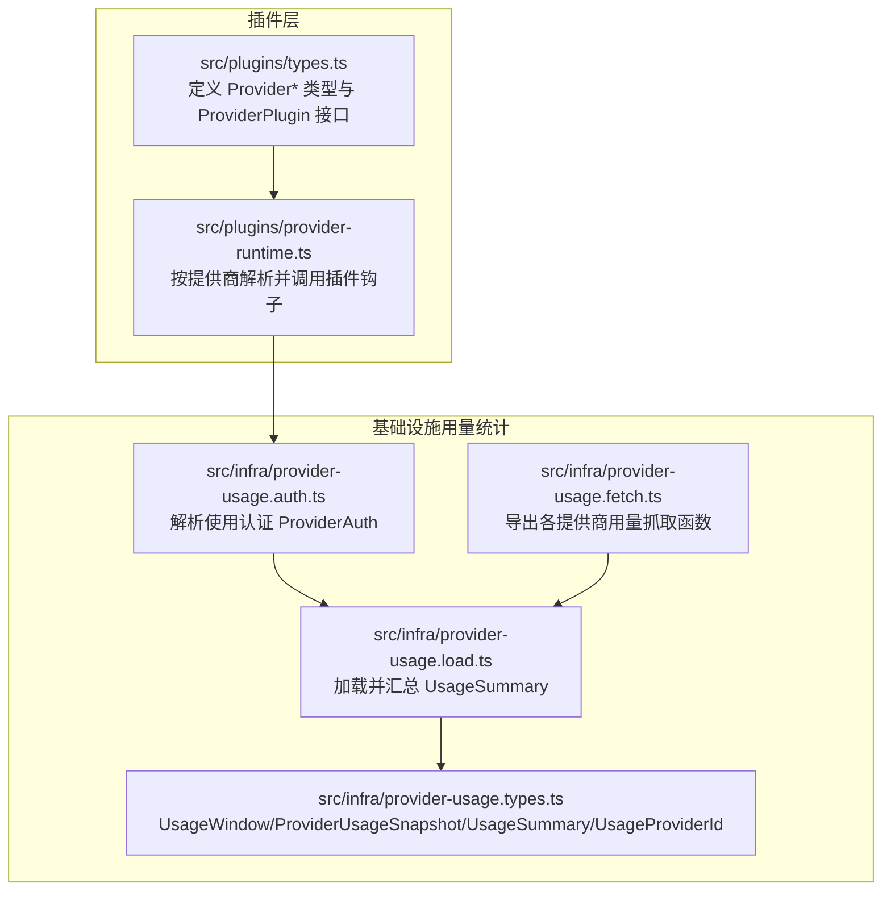
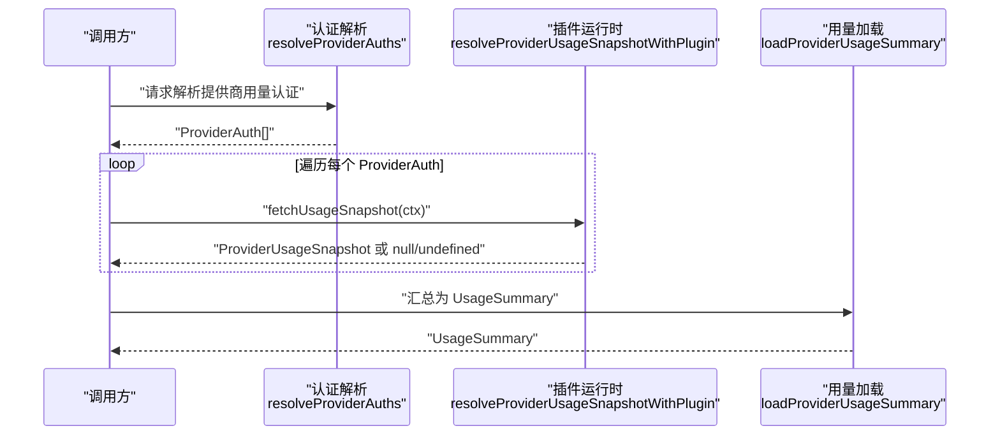
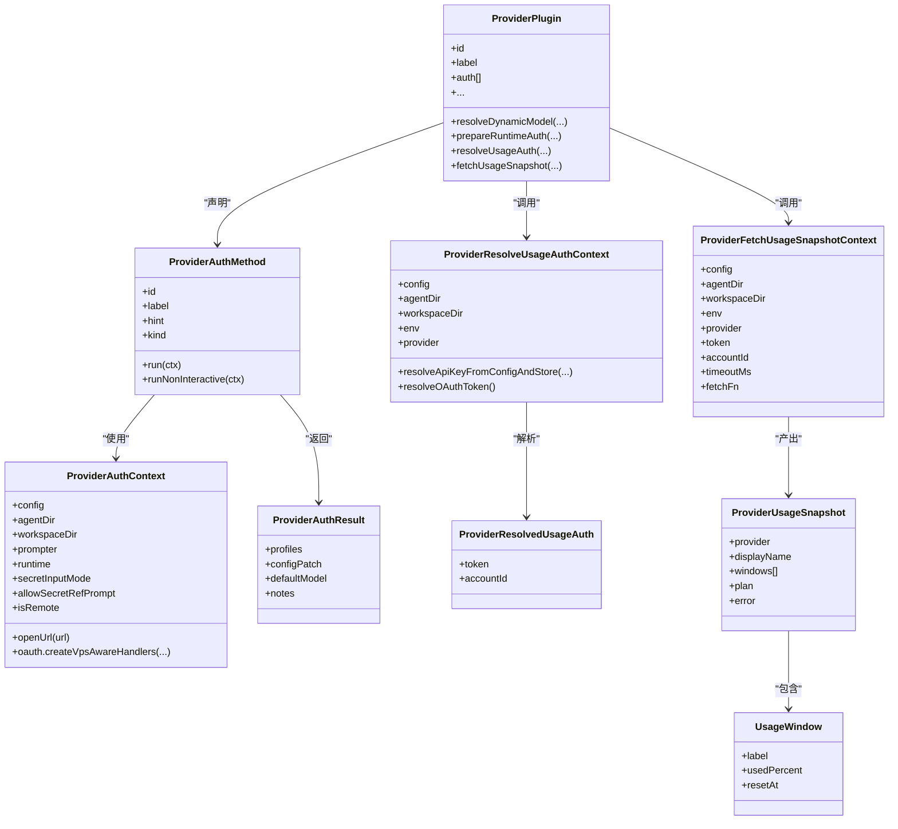
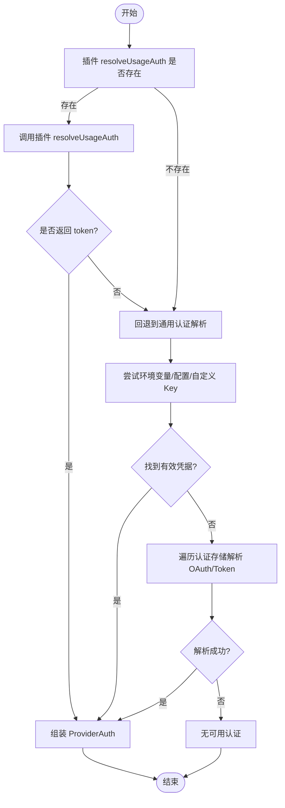
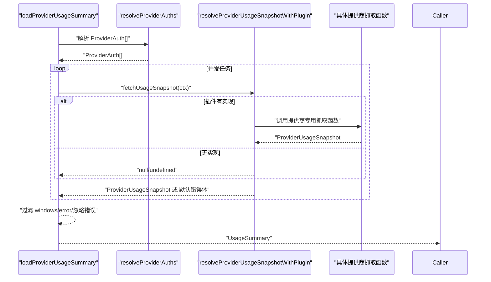
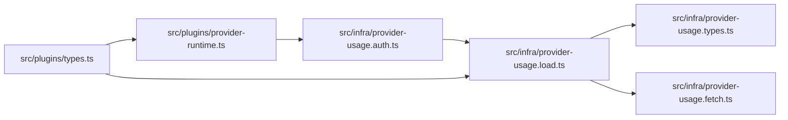

# 提供商类型

<cite>
**本文引用的文件**
- [src/plugins/types.ts](file://src/plugins/types.ts)
- [src/plugins/provider-runtime.ts](file://src/plugins/provider-runtime.ts)
- [src/infra/provider-usage.types.ts](file://src/infra/provider-usage.types.ts)
- [src/infra/provider-usage.auth.ts](file://src/infra/provider-usage.auth.ts)
- [src/infra/provider-usage.load.ts](file://src/infra/provider-usage.load.ts)
- [src/infra/provider-usage.fetch.ts](file://src/infra/provider-usage.fetch.ts)
- [docs/concepts/model-providers.md](file://docs/concepts/model-providers.md)
</cite>

## 目录
1. [简介](#简介)
2. [项目结构](#项目结构)
3. [核心组件](#核心组件)
4. [架构总览](#架构总览)
5. [详细组件分析](#详细组件分析)
6. [依赖关系分析](#依赖关系分析)
7. [性能考量](#性能考量)
8. [故障排查指南](#故障排查指南)
9. [结论](#结论)
10. [附录](#附录)

## 简介
本文件聚焦于“提供商（Provider）”相关类型与运行时机制，系统性梳理以下关键类型与流程：
- 认证上下文与认证方法：ProviderAuthContext、ProviderAuthMethod、ProviderAuthResult 等
- 运行时模型：ProviderRuntimeModel
- 使用统计快照：ProviderUsageSnapshot、UsageWindow、UsageSummary、UsageProviderId
- 使用认证解析：ProviderResolveUsageAuthContext、ProviderResolvedUsageAuth
- 使用快照抓取：ProviderFetchUsageSnapshotContext
- 插件侧钩子与运行时分发：ProviderPlugin 及 provider-runtime 的调用封装

目标是帮助读者理解 OpenClaw 中“提供商”的认证、模型运行时以及用量统计的类型化接口与实现边界，并给出配置与使用示例的参考路径。

## 项目结构
围绕提供商类型与使用统计，相关代码主要分布在如下模块：
- 插件层类型与运行时分发：src/plugins/types.ts、src/plugins/provider-runtime.ts
- 使用统计类型与加载：src/infra/provider-usage.types.ts、src/infra/provider-usage.load.ts
- 使用认证解析与聚合：src/infra/provider-usage.auth.ts
- 使用快照抓取导出入口：src/infra/provider-usage.fetch.ts
- 概念文档：docs/concepts/model-providers.md

图表来源
- [src/plugins/types.ts](file://src/plugins/types.ts)
- [src/plugins/provider-runtime.ts](file://src/plugins/provider-runtime.ts)
- [src/infra/provider-usage.types.ts](file://src/infra/provider-usage.types.ts)
- [src/infra/provider-usage.auth.ts](file://src/infra/provider-usage.auth.ts)
- [src/infra/provider-usage.load.ts](file://src/infra/provider-usage.load.ts)
- [src/infra/provider-usage.fetch.ts](file://src/infra/provider-usage.fetch.ts)

章节来源
- [src/plugins/types.ts](file://src/plugins/types.ts)
- [src/plugins/provider-runtime.ts](file://src/plugins/provider-runtime.ts)
- [src/infra/provider-usage.types.ts](file://src/infra/provider-usage.types.ts)
- [src/infra/provider-usage.auth.ts](file://src/infra/provider-usage.auth.ts)
- [src/infra/provider-usage.load.ts](file://src/infra/provider-usage.load.ts)
- [src/infra/provider-usage.fetch.ts](file://src/infra/provider-usage.fetch.ts)

## 核心组件
本节对关键类型进行逐项说明，并指出其在认证、模型运行时与用量统计中的职责。

- ProviderAuthContext 与 ProviderAuthMethod
  - 作用：描述提供商认证交互所需的上下文与可执行的认证方法；支持交互式与非交互式两种认证路径。
  - 关键字段：config、agentDir/workspaceDir、prompter、runtime、secretInputMode、allowSecretRefPrompt、isRemote、openUrl、oauth.createVpsAwareHandlers。
  - 认证方法：run(ctx) 执行交互式认证；runNonInteractive(ctx) 支持命令行或脚本驱动的认证。

- ProviderAuthResult
  - 作用：认证完成后返回的结果，包含 profiles 列表、可选的 configPatch、默认模型与提示信息。

- ProviderPlugin
  - 作用：插件对提供商能力的声明与扩展点集合，覆盖从发现、动态模型解析、运行时参数准备、流包装、到用量认证与快照抓取等全链路。
  - 关键钩子：resolveDynamicModel、prepareDynamicModel、normalizeResolvedModel、prepareExtraParams、wrapStreamFn、prepareRuntimeAuth、resolveUsageAuth、fetchUsageSnapshot、isCacheTtlEligible、buildMissingAuthMessage、suppressBuiltInModel、augmentModelCatalog、isBinaryThinking、supportsXHighThinking、resolveDefaultThinkingLevel、isModernModelRef 等。

- ProviderRuntimeModel
  - 作用：最终由运行时使用的模型对象，来源于 pi-ai 的 Model<Api>，经插件层解析与归一化后传入推理执行器。

- ProviderResolveUsageAuthContext 与 ProviderResolvedUsageAuth
  - 作用：用于解析“用量/配额”所需的认证凭据；resolveUsageAuth 返回 token 与可选 accountId。
  - 上下文能力：resolveApiKeyFromConfigAndStore、resolveOAuthToken。

- ProviderFetchUsageSnapshotContext 与 ProviderUsageSnapshot
  - 作用：抓取提供商用量快照；ProviderUsageSnapshot 包含 provider、displayName、windows、plan、error 等字段。
  - UsageWindow：label、usedPercent、resetAt；UsageSummary：updatedAt、providers。

- UsageProviderId
  - 作用：已支持用量查询的提供商枚举集合。

章节来源
- [src/plugins/types.ts](file://src/plugins/types.ts)
- [src/infra/provider-usage.types.ts](file://src/infra/provider-usage.types.ts)

## 架构总览
OpenClaw 在“用量统计”场景下的调用链如下：
- 首先通过 resolveProviderAuths 解析每个提供商的用量认证（优先使用插件提供的 resolveUsageAuth），得到 ProviderAuth（包含 token 与可选 accountId）。
- 对每个可用的 ProviderAuth，调用 resolveProviderUsageSnapshotWithPlugin，交由对应插件完成具体的 HTTP 请求与响应解析，生成 ProviderUsageSnapshot。
- 最终汇总为 UsageSummary，包含更新时间与各提供商的用量快照列表。

图表来源
- [src/infra/provider-usage.auth.ts](file://src/infra/provider-usage.auth.ts)
- [src/plugins/provider-runtime.ts](file://src/plugins/provider-runtime.ts)
- [src/infra/provider-usage.load.ts](file://src/infra/provider-usage.load.ts)

章节来源
- [src/infra/provider-usage.auth.ts](file://src/infra/provider-usage.auth.ts)
- [src/plugins/provider-runtime.ts](file://src/plugins/provider-runtime.ts)
- [src/infra/provider-usage.load.ts](file://src/infra/provider-usage.load.ts)

## 详细组件分析

### 认证与使用统计类型关系图

图表来源
- [src/plugins/types.ts](file://src/plugins/types.ts)
- [src/infra/provider-usage.types.ts](file://src/infra/provider-usage.types.ts)

章节来源
- [src/plugins/types.ts](file://src/plugins/types.ts)
- [src/infra/provider-usage.types.ts](file://src/infra/provider-usage.types.ts)

### 用量认证解析流程
- 优先从插件侧 resolveUsageAuth 获取 token 与 accountId。
- 若插件未提供，则回退至通用认证解析：从环境变量、配置、认证存储中解析 API Key 或 Token。
- 对 OAuth 类型，遍历认证存储中的条目，尝试解析有效令牌。

图表来源
- [src/infra/provider-usage.auth.ts](file://src/infra/provider-usage.auth.ts)

章节来源
- [src/infra/provider-usage.auth.ts](file://src/infra/provider-usage.auth.ts)

### 用量快照抓取与汇总
- resolveProviderUsageSnapshotWithPlugin：按提供商调用插件 fetchUsageSnapshot，产出 ProviderUsageSnapshot。
- loadProviderUsageSummary：并发抓取多个提供商用量，超时与错误处理，过滤忽略的错误，最终生成 UsageSummary。

图表来源
- [src/infra/provider-usage.load.ts](file://src/infra/provider-usage.load.ts)
- [src/plugins/provider-runtime.ts](file://src/plugins/provider-runtime.ts)
- [src/infra/provider-usage.fetch.ts](file://src/infra/provider-usage.fetch.ts)

章节来源
- [src/infra/provider-usage.load.ts](file://src/infra/provider-usage.load.ts)
- [src/plugins/provider-runtime.ts](file://src/plugins/provider-runtime.ts)
- [src/infra/provider-usage.fetch.ts](file://src/infra/provider-usage.fetch.ts)

## 依赖关系分析
- ProviderPlugin 作为“提供商能力声明”，通过 provider-runtime 将其方法映射到统一的调用接口，避免核心逻辑耦合具体提供商细节。
- ProviderUsageSnapshot 的生成由插件侧 fetchUsageSnapshot 负责，核心仅负责聚合与格式化。
- 认证解析 resolveProviderAuths 优先委托给插件，体现“插件优先”的设计原则。

图表来源
- [src/plugins/types.ts](file://src/plugins/types.ts)
- [src/plugins/provider-runtime.ts](file://src/plugins/provider-runtime.ts)
- [src/infra/provider-usage.auth.ts](file://src/infra/provider-usage.auth.ts)
- [src/infra/provider-usage.load.ts](file://src/infra/provider-usage.load.ts)
- [src/infra/provider-usage.types.ts](file://src/infra/provider-usage.types.ts)
- [src/infra/provider-usage.fetch.ts](file://src/infra/provider-usage.fetch.ts)

章节来源
- [src/plugins/types.ts](file://src/plugins/types.ts)
- [src/plugins/provider-runtime.ts](file://src/plugins/provider-runtime.ts)
- [src/infra/provider-usage.auth.ts](file://src/infra/provider-usage.auth.ts)
- [src/infra/provider-usage.load.ts](file://src/infra/provider-usage.load.ts)
- [src/infra/provider-usage.types.ts](file://src/infra/provider-usage.types.ts)
- [src/infra/provider-usage.fetch.ts](file://src/infra/provider-usage.fetch.ts)

## 性能考量
- 并发抓取：loadProviderUsageSummary 对多个提供商用量抓取采用 Promise.all 并发执行，提升整体吞吐。
- 超时控制：为每个抓取任务设置超时，避免单个提供商阻塞全局汇总。
- 错误过滤：对“无 windows 且 error 属于忽略集合”的条目进行过滤，减少噪声输出。
- 插件优先：优先使用插件提供的 resolveUsageAuth 与 fetchUsageSnapshot，避免核心重复实现。

章节来源
- [src/infra/provider-usage.load.ts](file://src/infra/provider-usage.load.ts)

## 故障排查指南
- 无可用认证
  - 现象：UsageSummary 中某提供商 windows 为空且 error 存在。
  - 排查：确认环境变量、配置与认证存储中是否存在有效凭据；检查插件 resolveUsageAuth 是否正确返回 token。
- 插件未实现用量抓取
  - 现象：返回默认错误体“Unsupported provider”。
  - 处理：为该提供商实现 fetchUsageSnapshot，或在插件侧补充相应抓取逻辑。
- 超时导致用量缺失
  - 现象：某提供商 error 为“Timeout”。
  - 处理：适当增大 timeoutMs，或检查网络连通性与上游服务状态。
- 认证存储冲突
  - 现象：resolveOAuthToken 解析失败。
  - 处理：检查认证存储中对应 provider 的 profile 类型与元数据一致性。

章节来源
- [src/infra/provider-usage.auth.ts](file://src/infra/provider-usage.auth.ts)
- [src/infra/provider-usage.load.ts](file://src/infra/provider-usage.load.ts)

## 结论
- ProviderPlugin 将“提供商能力”以钩子形式暴露，配合 provider-runtime 实现“插件优先”的扩展策略。
- ProviderUsageSnapshot 与 UsageSummary 明确了用量统计的数据结构与汇总流程，便于统一展示与报告。
- 认证解析 resolveProviderAuths 优先委托插件，既保证灵活性又降低核心复杂度。
- 建议在新增提供商时，优先实现 resolveUsageAuth 与 fetchUsageSnapshot，确保“用量可见”。

## 附录

### 类型使用示例（参考路径）
- 认证上下文与方法
  - [ProviderAuthContext 定义](file://src/plugins/types.ts)
  - [ProviderAuthMethod 定义](file://src/plugins/types.ts)
  - [ProviderAuthResult 定义](file://src/plugins/types.ts)
- 运行时模型
  - [ProviderRuntimeModel 定义](file://src/plugins/types.ts)
- 用量统计
  - [UsageWindow/ProviderUsageSnapshot/UsageSummary/UsageProviderId](file://src/infra/provider-usage.types.ts)
- 插件运行时分发
  - [resolveProviderUsageSnapshotWithPlugin](file://src/plugins/provider-runtime.ts)
  - [resolveProviderUsageAuthWithPlugin](file://src/plugins/provider-runtime.ts)
- 认证解析
  - [resolveProviderAuths](file://src/infra/provider-usage.auth.ts)
- 加载与汇总
  - [loadProviderUsageSummary](file://src/infra/provider-usage.load.ts)
- 抓取函数导出
  - [provider-usage.fetch 导出入口](file://src/infra/provider-usage.fetch.ts)

章节来源
- [src/plugins/types.ts](file://src/plugins/types.ts)
- [src/plugins/provider-runtime.ts](file://src/plugins/provider-runtime.ts)
- [src/infra/provider-usage.types.ts](file://src/infra/provider-usage.types.ts)
- [src/infra/provider-usage.auth.ts](file://src/infra/provider-usage.auth.ts)
- [src/infra/provider-usage.load.ts](file://src/infra/provider-usage.load.ts)
- [src/infra/provider-usage.fetch.ts](file://src/infra/provider-usage.fetch.ts)