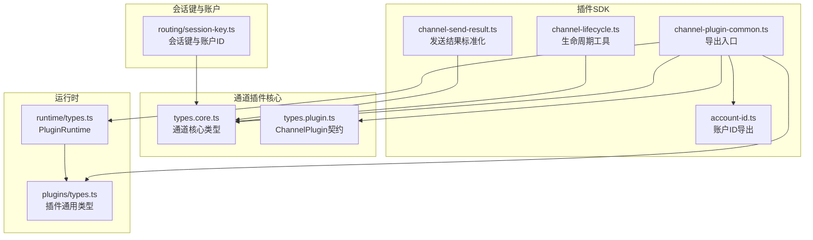
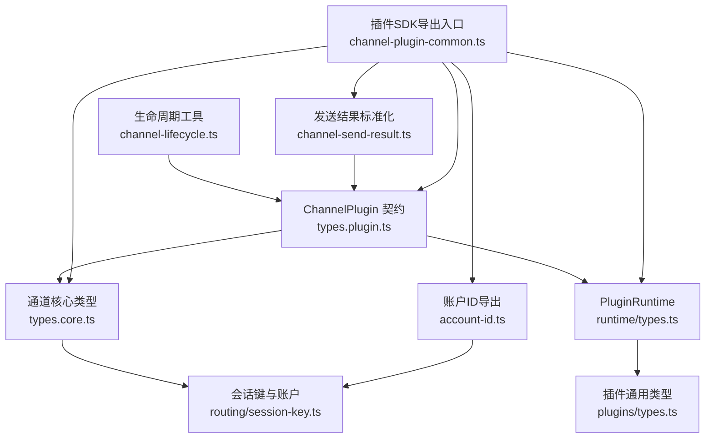
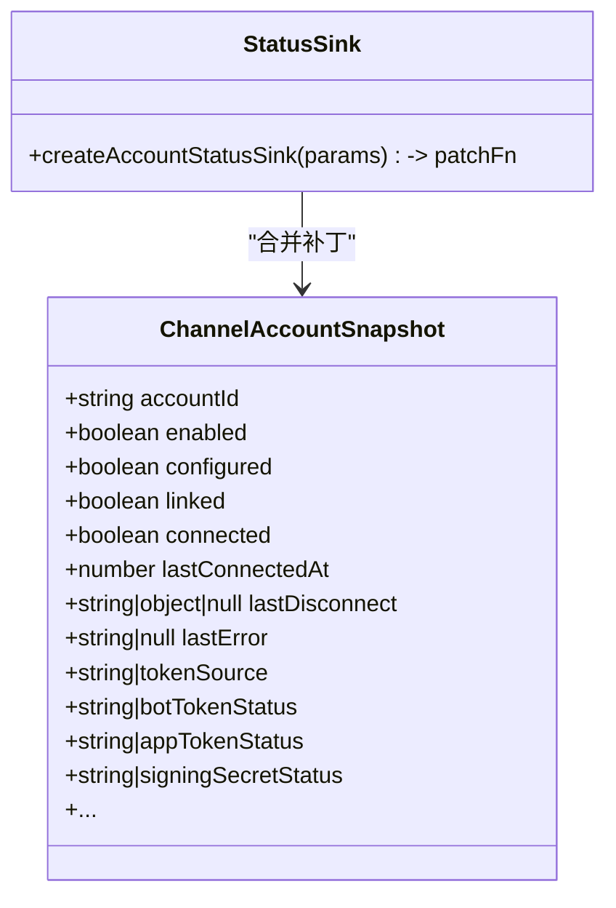
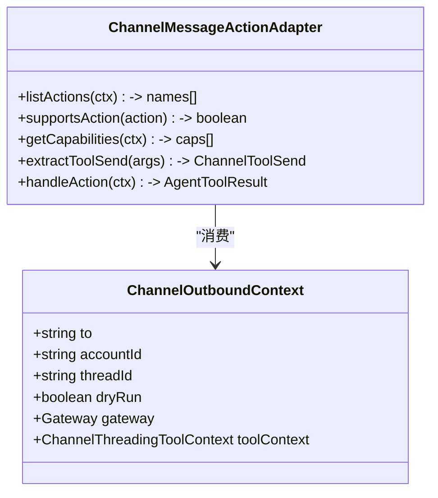
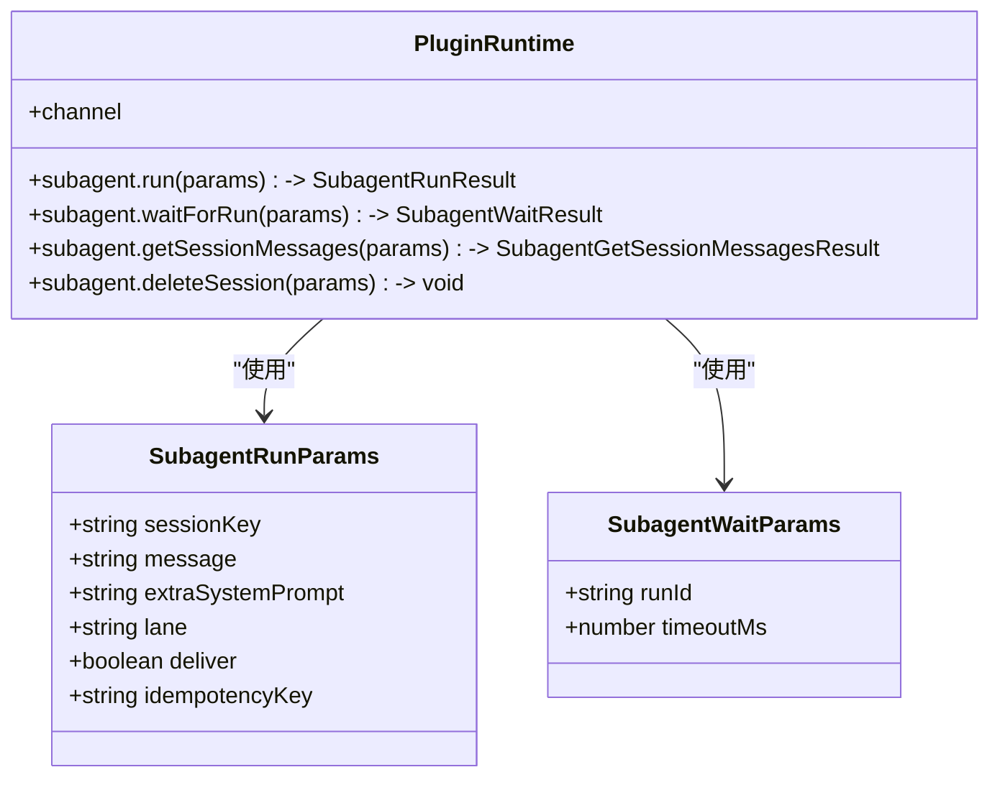
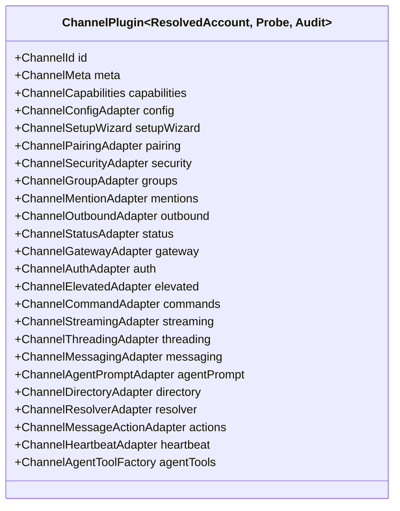
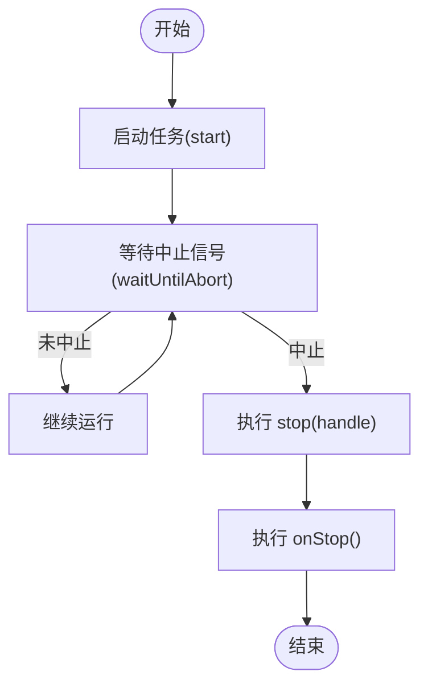
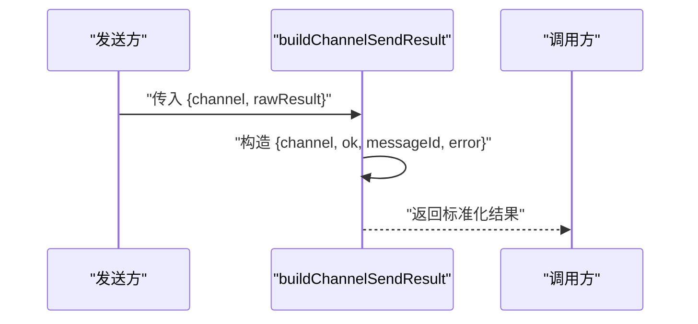
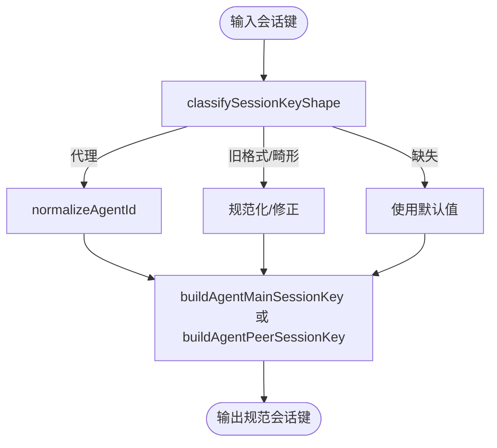
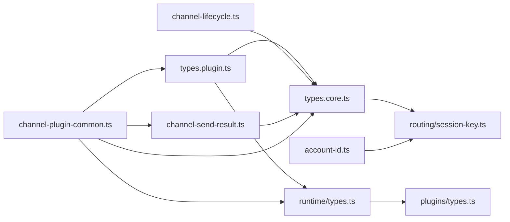

# 类型定义

<cite>
**本文引用的文件**
- [src/plugin-sdk/channel-plugin-common.ts](file://src/plugin-sdk/channel-plugin-common.ts)
- [src/plugin-sdk/channel-lifecycle.ts](file://src/plugin-sdk/channel-lifecycle.ts)
- [src/plugin-sdk/channel-send-result.ts](file://src/plugin-sdk/channel-send-result.ts)
- [src/plugin-sdk/account-id.ts](file://src/plugin-sdk/account-id.ts)
- [src/channels/plugins/types.core.ts](file://src/channels/plugins/types.core.ts)
- [src/channels/plugins/types.plugin.ts](file://src/channels/plugins/types.plugin.ts)
- [src/plugins/runtime/types.ts](file://src/plugins/runtime/types.ts)
- [src/plugins/types.ts](file://src/plugins/types.ts)
- [src/routing/session-key.ts](file://src/routing/session-key.ts)
</cite>

## 目录
1. [简介](#简介)
2. [项目结构](#项目结构)
3. [核心组件](#核心组件)
4. [架构总览](#架构总览)
5. [详细组件分析](#详细组件分析)
6. [依赖分析](#依赖分析)
7. [性能考虑](#性能考虑)
8. [故障排查指南](#故障排查指南)
9. [结论](#结论)
10. [附录](#附录)

## 简介
本文件为 OpenClaw 插件系统的类型定义参考文档，聚焦于插件相关 TypeScript 类型，包括接口、枚举、联合类型与泛型约束。重点覆盖以下关键类型与概念：
- ChannelAccountSnapshot：通道账户状态快照
- ChannelOutboundContext：通道出站消息上下文
- PluginRuntime：插件运行时能力集合
- 通道插件契约 ChannelPlugin 及其适配器族
- 生命周期与任务管理工具（被动生命周期、HTTP 服务器保活）
- 发送结果标准化与错误包装
- 会话键与账户标识的规范化与分类

本文件旨在帮助插件开发者准确理解类型之间的组合与继承关系，并在实际开发中遵循类型安全最佳实践。

## 项目结构
围绕“插件 SDK”与“通道插件”两大维度，类型分布在如下模块：
- 插件 SDK 入口与导出：统一导出常用类型与工具函数
- 通道插件核心类型：通道能力、元数据、账户快照、消息动作等
- 通道插件契约：ChannelPlugin 的完整适配器族与配置模式
- 运行时类型：子代理运行、等待、会话查询与通道运行时
- 生命周期与发送结果：任务生命周期管理与发送结果标准化
- 会话键与账户标识：会话键构建、解析与规范化

图表来源
- [src/plugin-sdk/channel-plugin-common.ts:1-22](file://src/plugin-sdk/channel-plugin-common.ts#L1-L22)
- [src/plugin-sdk/channel-lifecycle.ts:1-108](file://src/plugin-sdk/channel-lifecycle.ts#L1-L108)
- [src/plugin-sdk/channel-send-result.ts:1-15](file://src/plugin-sdk/channel-send-result.ts#L1-L15)
- [src/plugin-sdk/account-id.ts:1-6](file://src/plugin-sdk/account-id.ts#L1-L6)
- [src/channels/plugins/types.core.ts:1-410](file://src/channels/plugins/types.core.ts#L1-L410)
- [src/channels/plugins/types.plugin.ts:1-85](file://src/channels/plugins/types.plugin.ts#L1-L85)
- [src/plugins/runtime/types.ts:1-64](file://src/plugins/runtime/types.ts#L1-L64)
- [src/plugins/types.ts:1-800](file://src/plugins/types.ts#L1-L800)
- [src/routing/session-key.ts:1-254](file://src/routing/session-key.ts#L1-L254)

章节来源
- [src/plugin-sdk/channel-plugin-common.ts:1-22](file://src/plugin-sdk/channel-plugin-common.ts#L1-L22)
- [src/channels/plugins/types.core.ts:1-410](file://src/channels/plugins/types.core.ts#L1-L410)
- [src/channels/plugins/types.plugin.ts:1-85](file://src/channels/plugins/types.plugin.ts#L1-L85)
- [src/plugins/runtime/types.ts:1-64](file://src/plugins/runtime/types.ts#L1-L64)
- [src/plugins/types.ts:1-800](file://src/plugins/types.ts#L1-L800)
- [src/routing/session-key.ts:1-254](file://src/routing/session-key.ts#L1-L254)

## 核心组件
本节对关键类型进行分层说明，突出其职责、字段含义与典型用法。

- ChannelAccountSnapshot
  - 职责：描述通道账户的实时状态快照，包含启用、配置、连接、错误、令牌来源等信息
  - 关键字段：accountId、enabled、configured、linked、connected、lastError、tokenSource 等
  - 使用场景：状态上报、诊断、重连策略、令牌轮换
  - 复杂度：结构化对象，字段数量较多但均为可选或基础类型，便于序列化与比较
  - 章节来源
    - [src/channels/plugins/types.core.ts:100-162](file://src/channels/plugins/types.core.ts#L100-L162)

- ChannelOutboundContext
  - 职责：封装通道出站消息的上下文参数，如目标、线程、账户、网关信息等
  - 关键字段：to、accountId、threadId、dryRun、gateway、toolContext 等
  - 使用场景：消息路由、线程回复、工具调用上下文传递
  - 章节来源
    - [src/channels/plugins/types.core.ts:361-366](file://src/channels/plugins/types.core.ts#L361-L366)
    - [src/channels/plugins/types.core.ts:337-359](file://src/channels/plugins/types.core.ts#L337-L359)

- PluginRuntime
  - 职责：插件运行时能力集合，包含子代理运行、等待、会话查询与通道运行时
  - 子域：subagent（run/waitForRun/getSessionMessages/deleteSession）、channel
  - 使用场景：在插件工具或钩子中执行子代理任务、查询会话历史、与通道交互
  - 章节来源
    - [src/plugins/runtime/types.ts:51-63](file://src/plugins/runtime/types.ts#L51-L63)

- ChannelPlugin 契约
  - 职责：通道插件的完整适配器族契约，定义配置、设置向导、配对、安全、群组、提及、出站、状态、网关、认证、提权、命令、流式传输、线程、消息、代理提示、目录、解析器、消息动作、心跳与代理工具等
  - 泛型参数：ResolvedAccount、Probe、Audit，用于适配不同通道的账户解析、探测与审计类型
  - 使用场景：实现具体通道适配器、声明能力与默认行为
  - 章节来源
    - [src/channels/plugins/types.plugin.ts:49-84](file://src/channels/plugins/types.plugin.ts#L49-L84)

- 通道核心类型族
  - ChannelCapabilities：聊天类型、编辑/撤回/回复/媒体/线程等能力集合
  - ChannelMeta：通道元信息（id、label、selectionLabel、docsPath、aliases 等）
  - ChannelAgentTool / ChannelAgentToolFactory：通道专属代理工具及其工厂
  - ChannelMessageActionAdapter / ChannelMessageActionName：消息动作发现、支持性检查、能力获取、工具发送提取与处理
  - ChannelPollContext / ChannelPollResult：投票上下文与结果
  - BaseProbeResult / BaseTokenResolution：探测与令牌解析的基础结果结构
  - 章节来源
    - [src/channels/plugins/types.core.ts:184-197](file://src/channels/plugins/types.core.ts#L184-L197)
    - [src/channels/plugins/types.core.ts:79-98](file://src/channels/plugins/types.core.ts#L79-L98)
    - [src/channels/plugins/types.core.ts:16-20](file://src/channels/plugins/types.core.ts#L16-L20)
    - [src/channels/plugins/types.core.ts:367-379](file://src/channels/plugins/types.core.ts#L367-L379)
    - [src/channels/plugins/types.core.ts:389-397](file://src/channels/plugins/types.core.ts#L389-L397)
    - [src/channels/plugins/types.core.ts:399-410](file://src/channels/plugins/types.core.ts#L399-L410)

- 生命周期与任务管理
  - PassiveAccountLifecycleParams：被动账户生命周期参数（启动、停止、清理回调、中止信号）
  - runPassiveAccountLifecycle：保持任务存活直到中止并执行清理
  - keepHttpServerTaskAlive：监听 HTTP 服务器关闭事件，结合中止信号触发回调
  - waitUntilAbort：根据 AbortSignal 返回中止时的 Promise
  - 章节来源
    - [src/plugin-sdk/channel-lifecycle.ts:7-12](file://src/plugin-sdk/channel-lifecycle.ts#L7-L12)
    - [src/plugin-sdk/channel-lifecycle.ts:51-62](file://src/plugin-sdk/channel-lifecycle.ts#L51-L62)
    - [src/plugin-sdk/channel-lifecycle.ts:70-107](file://src/plugin-sdk/channel-lifecycle.ts#L70-L107)
    - [src/plugin-sdk/channel-lifecycle.ts:29-46](file://src/plugin-sdk/channel-lifecycle.ts#L29-L46)

- 发送结果标准化
  - ChannelSendRawResult：原始发送结果（ok、messageId、error）
  - buildChannelSendResult：将原始结果转换为带 channel 与 Error 包装的结果对象
  - 章节来源
    - [src/plugin-sdk/channel-send-result.ts:1-5](file://src/plugin-sdk/channel-send-result.ts#L1-L5)
    - [src/plugin-sdk/channel-send-result.ts:7-14](file://src/plugin-sdk/channel-send-result.ts#L7-L14)

- 会话键与账户标识
  - 会话键构建：buildAgentMainSessionKey、buildAgentPeerSessionKey、buildGroupHistoryKey、resolveThreadSessionKeys
  - 形状分类：classifySessionKeyShape
  - 账户与主键规范化：normalizeAccountId、normalizeMainKey、normalizeAgentId、isValidAgentId、sanitizeAgentId
  - 章节来源
    - [src/routing/session-key.ts:118-174](file://src/routing/session-key.ts#L118-L174)
    - [src/routing/session-key.ts:234-253](file://src/routing/session-key.ts#L234-L253)
    - [src/routing/session-key.ts:78-87](file://src/routing/session-key.ts#L78-L87)
    - [src/routing/session-key.ts:13-17](file://src/routing/session-key.ts#L13-L17)

## 架构总览
下图展示插件系统中类型之间的高层关系与依赖方向，强调“通道插件契约”作为适配器容器、“通道核心类型”作为状态与能力模型、“运行时类型”作为执行载体的角色分工。

图表来源
- [src/channels/plugins/types.plugin.ts:49-84](file://src/channels/plugins/types.plugin.ts#L49-L84)
- [src/channels/plugins/types.core.ts:100-162](file://src/channels/plugins/types.core.ts#L100-L162)
- [src/plugins/runtime/types.ts:51-63](file://src/plugins/runtime/types.ts#L51-L63)
- [src/plugins/types.ts:1-800](file://src/plugins/types.ts#L1-L800)
- [src/routing/session-key.ts:118-174](file://src/routing/session-key.ts#L118-L174)
- [src/plugin-sdk/channel-lifecycle.ts:51-62](file://src/plugin-sdk/channel-lifecycle.ts#L51-L62)
- [src/plugin-sdk/channel-send-result.ts:7-14](file://src/plugin-sdk/channel-send-result.ts#L7-L14)
- [src/plugin-sdk/channel-plugin-common.ts:1-22](file://src/plugin-sdk/channel-plugin-common.ts#L1-L22)
- [src/plugin-sdk/account-id.ts:1-6](file://src/plugin-sdk/account-id.ts#L1-L6)

## 详细组件分析

### 组件一：通道账户状态快照（ChannelAccountSnapshot）与上下文
- 结构要点
  - 快照以 accountId 为键，聚合 enabled/configured/linked/connected/restartPending 等布尔状态位
  - 时间戳字段 lastConnectedAt/lastDisconnect/lastMessageAt/lastError 等用于诊断与重连策略
  - 令牌来源与状态字段（tokenSource、botTokenStatus、appTokenStatus、signingSecretStatus）用于凭据治理
- 组合模式
  - 通过 createAccountStatusSink 将补丁合并到现有快照，避免直接修改全局状态
- 使用示例（路径）
  - [src/plugin-sdk/channel-lifecycle.ts:14-21](file://src/plugin-sdk/channel-lifecycle.ts#L14-L21)
- 章节来源
  - [src/channels/plugins/types.core.ts:100-162](file://src/channels/plugins/types.core.ts#L100-L162)
  - [src/plugin-sdk/channel-lifecycle.ts:14-21](file://src/plugin-sdk/channel-lifecycle.ts#L14-L21)

图表来源
- [src/channels/plugins/types.core.ts:100-162](file://src/channels/plugins/types.core.ts#L100-L162)
- [src/plugin-sdk/channel-lifecycle.ts:14-21](file://src/plugin-sdk/channel-lifecycle.ts#L14-L21)

### 组件二：通道出站上下文（ChannelOutboundContext）与消息动作
- 结构要点
  - to 目标、accountId 账户、threadId 线程、dryRun 干跑标记
  - gateway 提供网关客户端名称、显示名、模式与超时
  - toolContext 用于线程工具上下文传递
- 组合模式
  - 与 ChannelMessageActionAdapter 配合，实现动作发现、能力声明与处理
- 使用示例（路径）
  - [src/channels/plugins/types.core.ts:337-359](file://src/channels/plugins/types.core.ts#L337-L359)
  - [src/channels/plugins/types.core.ts:367-379](file://src/channels/plugins/types.core.ts#L367-L379)
- 章节来源
  - [src/channels/plugins/types.core.ts:337-359](file://src/channels/plugins/types.core.ts#L337-L359)
  - [src/channels/plugins/types.core.ts:367-379](file://src/channels/plugins/types.core.ts#L367-L379)

图表来源
- [src/channels/plugins/types.core.ts:337-359](file://src/channels/plugins/types.core.ts#L337-L359)
- [src/channels/plugins/types.core.ts:367-379](file://src/channels/plugins/types.core.ts#L367-L379)

### 组件三：插件运行时（PluginRuntime）与子代理
- 结构要点
  - subagent.run/waitForRun/getSessionMessages/deleteSession：子代理生命周期与会话查询
  - channel：通道运行时接口
- 组合模式
  - PluginRuntime = PluginRuntimeCore & { subagent, channel }
  - 通过 PluginRuntime 获取子代理运行结果与会话消息列表
- 使用示例（路径）
  - [src/plugins/runtime/types.ts:51-63](file://src/plugins/runtime/types.ts#L51-L63)
- 章节来源
  - [src/plugins/runtime/types.ts:51-63](file://src/plugins/runtime/types.ts#L51-L63)

图表来源
- [src/plugins/runtime/types.ts:8-29](file://src/plugins/runtime/types.ts#L8-L29)
- [src/plugins/runtime/types.ts:51-63](file://src/plugins/runtime/types.ts#L51-L63)

### 组件四：通道插件契约（ChannelPlugin）与适配器族
- 结构要点
  - id/meta/capabilities：通道标识、元信息与能力
  - 配置与设置：config/configSchema/setupWizard
  - 安全与配对：security/pairing
  - 群组与提及：groups/mentions
  - 出站与状态：outbound/status/gateway
  - 认证与提权：auth/elevated
  - 命令与流式传输：commands/streaming
  - 线程与消息：threading/messaging
  - 代理提示与目录：agentPrompt/directory/resolver
  - 消息动作与心跳：actions/heartbeat
  - 代理工具：agentTools
- 泛型参数
  - ChannelPlugin<ResolvedAccount, Probe, Audit>：允许通道自定义账户解析、探测与审计类型
- 使用示例（路径）
  - [src/channels/plugins/types.plugin.ts:49-84](file://src/channels/plugins/types.plugin.ts#L49-L84)
- 章节来源
  - [src/channels/plugins/types.plugin.ts:49-84](file://src/channels/plugins/types.plugin.ts#L49-L84)

图表来源
- [src/channels/plugins/types.plugin.ts:49-84](file://src/channels/plugins/types.plugin.ts#L49-L84)

### 组件五：生命周期与任务管理（被动生命周期、HTTP 服务器保活）
- 流程要点
  - runPassiveAccountLifecycle：启动任务，等待中止信号，执行 stop/onStop 清理
  - keepHttpServerTaskAlive：监听服务器 close 事件，结合 AbortSignal 触发 onAbort
  - waitUntilAbort：基于 AbortSignal 返回中止 Promise
- 使用示例（路径）
  - [src/plugin-sdk/channel-lifecycle.ts:51-62](file://src/plugin-sdk/channel-lifecycle.ts#L51-L62)
  - [src/plugin-sdk/channel-lifecycle.ts:70-107](file://src/plugin-sdk/channel-lifecycle.ts#L70-L107)
  - [src/plugin-sdk/channel-lifecycle.ts:29-46](file://src/plugin-sdk/channel-lifecycle.ts#L29-L46)
- 章节来源
  - [src/plugin-sdk/channel-lifecycle.ts:51-62](file://src/plugin-sdk/channel-lifecycle.ts#L51-L62)
  - [src/plugin-sdk/channel-lifecycle.ts:70-107](file://src/plugin-sdk/channel-lifecycle.ts#L70-L107)
  - [src/plugin-sdk/channel-lifecycle.ts:29-46](file://src/plugin-sdk/channel-lifecycle.ts#L29-L46)

图表来源
- [src/plugin-sdk/channel-lifecycle.ts:51-62](file://src/plugin-sdk/channel-lifecycle.ts#L51-L62)
- [src/plugin-sdk/channel-lifecycle.ts:29-46](file://src/plugin-sdk/channel-lifecycle.ts#L29-L46)

### 组件六：发送结果标准化（ChannelSendRawResult → PluginRuntime）
- 流程要点
  - buildChannelSendResult 将原始发送结果包装为包含 channel 与 Error 对象的结果
  - 便于上层统一处理成功/失败与错误信息
- 使用示例（路径）
  - [src/plugin-sdk/channel-send-result.ts:7-14](file://src/plugin-sdk/channel-send-result.ts#L7-L14)
- 章节来源
  - [src/plugin-sdk/channel-send-result.ts:7-14](file://src/plugin-sdk/channel-send-result.ts#L7-L14)

图表来源
- [src/plugin-sdk/channel-send-result.ts:7-14](file://src/plugin-sdk/channel-send-result.ts#L7-L14)

### 组件七：会话键与账户标识（规范化与分类）
- 流程要点
  - classifySessionKeyShape：对会话键进行形状分类（缺失/代理/旧格式/畸形）
  - normalizeAgentId/normalizeMainKey/normalizeAccountId：规范化标识符
  - buildAgentPeerSessionKey/buildAgentMainSessionKey：构建会话键
  - resolveThreadSessionKeys：线程会话键解析与父会话键保留
- 使用示例（路径）
  - [src/routing/session-key.ts:78-87](file://src/routing/session-key.ts#L78-L87)
  - [src/routing/session-key.ts:89-107](file://src/routing/session-key.ts#L89-L107)
  - [src/routing/session-key.ts:118-174](file://src/routing/session-key.ts#L118-L174)
  - [src/routing/session-key.ts:234-253](file://src/routing/session-key.ts#L234-L253)
- 章节来源
  - [src/routing/session-key.ts:78-87](file://src/routing/session-key.ts#L78-L87)
  - [src/routing/session-key.ts:89-107](file://src/routing/session-key.ts#L89-L107)
  - [src/routing/session-key.ts:118-174](file://src/routing/session-key.ts#L118-L174)
  - [src/routing/session-key.ts:234-253](file://src/routing/session-key.ts#L234-L253)

图表来源
- [src/routing/session-key.ts:78-87](file://src/routing/session-key.ts#L78-L87)
  - [src/routing/session-key.ts:118-174](file://src/routing/session-key.ts#L118-L174)

## 依赖分析
- 低耦合高内聚
  - ChannelPlugin 将各适配器解耦为独立接口，便于按需实现
  - 通道核心类型集中于 types.core.ts，形成稳定的契约层
- 外部依赖
  - 运行时类型依赖 PluginRuntimeCore 与 PluginRuntimeChannel
  - 通道适配器依赖 OpenClawConfig、MsgContext、GatewayClientMode 等外部类型
- 循环依赖风险
  - 当前文件间无明显循环导入；适配器通过类型引用而非运行时导入，降低耦合

图表来源
- [src/channels/plugins/types.plugin.ts:49-84](file://src/channels/plugins/types.plugin.ts#L49-L84)
- [src/channels/plugins/types.core.ts:100-162](file://src/channels/plugins/types.core.ts#L100-L162)
- [src/plugins/runtime/types.ts:51-63](file://src/plugins/runtime/types.ts#L51-L63)
- [src/plugins/types.ts:1-800](file://src/plugins/types.ts#L1-L800)
- [src/routing/session-key.ts:118-174](file://src/routing/session-key.ts#L118-L174)
- [src/plugin-sdk/channel-lifecycle.ts:51-62](file://src/plugin-sdk/channel-lifecycle.ts#L51-L62)
- [src/plugin-sdk/channel-send-result.ts:7-14](file://src/plugin-sdk/channel-send-result.ts#L7-L14)
- [src/plugin-sdk/channel-plugin-common.ts:1-22](file://src/plugin-sdk/channel-plugin-common.ts#L1-L22)
- [src/plugin-sdk/account-id.ts:1-6](file://src/plugin-sdk/account-id.ts#L1-L6)

章节来源
- [src/channels/plugins/types.plugin.ts:49-84](file://src/channels/plugins/types.plugin.ts#L49-L84)
- [src/channels/plugins/types.core.ts:100-162](file://src/channels/plugins/types.core.ts#L100-L162)
- [src/plugins/runtime/types.ts:51-63](file://src/plugins/runtime/types.ts#L51-L63)
- [src/plugins/types.ts:1-800](file://src/plugins/types.ts#L1-L800)
- [src/routing/session-key.ts:118-174](file://src/routing/session-key.ts#L118-L174)
- [src/plugin-sdk/channel-lifecycle.ts:51-62](file://src/plugin-sdk/channel-lifecycle.ts#L51-L62)
- [src/plugin-sdk/channel-send-result.ts:7-14](file://src/plugin-sdk/channel-send-result.ts#L7-L14)
- [src/plugin-sdk/channel-plugin-common.ts:1-22](file://src/plugin-sdk/channel-plugin-common.ts#L1-L22)
- [src/plugin-sdk/account-id.ts:1-6](file://src/plugin-sdk/account-id.ts#L1-L6)

## 性能考虑
- 类型安全优先：通过严格类型约束减少运行时错误，间接提升稳定性与可维护性
- 泛型与适配器：利用泛型参数与适配器模式降低重复实现，提高扩展效率
- 生命周期管理：合理使用中止信号与清理回调，避免资源泄漏
- 会话键构建：在高频场景下复用已构建的键，减少正则与字符串处理开销

## 故障排查指南
- 状态快照不更新
  - 检查 createAccountStatusSink 是否正确合并补丁
  - 章节来源
    - [src/plugin-sdk/channel-lifecycle.ts:14-21](file://src/plugin-sdk/channel-lifecycle.ts#L14-L21)
- 任务无法停止
  - 确认中止信号是否正确传递至 runPassiveAccountLifecycle
  - 章节来源
    - [src/plugin-sdk/channel-lifecycle.ts:51-62](file://src/plugin-sdk/channel-lifecycle.ts#L51-L62)
- 发送结果错误包装
  - 检查 buildChannelSendResult 的 error 字段是否被正确包裹为 Error
  - 章节来源
    - [src/plugin-sdk/channel-send-result.ts:7-14](file://src/plugin-sdk/channel-send-result.ts#L7-L14)
- 会话键异常
  - 使用 classifySessionKeyShape 判断键形状，必要时调用 normalizeAgentId/normalizeAccountId
  - 章节来源
    - [src/routing/session-key.ts:78-87](file://src/routing/session-key.ts#L78-L87)
    - [src/routing/session-key.ts:89-107](file://src/routing/session-key.ts#L89-L107)

## 结论
本文档系统梳理了 OpenClaw 插件体系中的关键类型定义，明确了 ChannelAccountSnapshot、ChannelOutboundContext、PluginRuntime 等核心类型的职责与组合方式，并提供了生命周期管理、发送结果标准化与会话键规范化的最佳实践。建议在实现新通道或插件时，优先遵循这些类型契约与流程，确保类型安全与可维护性。

## 附录
- 类型使用示例（路径）
  - 通道账户状态快照合并：[src/plugin-sdk/channel-lifecycle.ts:14-21](file://src/plugin-sdk/channel-lifecycle.ts#L14-L21)
  - 子代理运行与等待：[src/plugins/runtime/types.ts:51-63](file://src/plugins/runtime/types.ts#L51-L63)
  - 通道消息动作处理：[src/channels/plugins/types.core.ts:367-379](file://src/channels/plugins/types.core.ts#L367-L379)
  - 发送结果标准化：[src/plugin-sdk/channel-send-result.ts:7-14](file://src/plugin-sdk/channel-send-result.ts#L7-L14)
  - 会话键构建与解析：[src/routing/session-key.ts:118-174](file://src/routing/session-key.ts#L118-L174), [src/routing/session-key.ts:234-253](file://src/routing/session-key.ts#L234-L253)