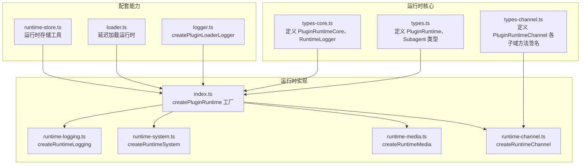
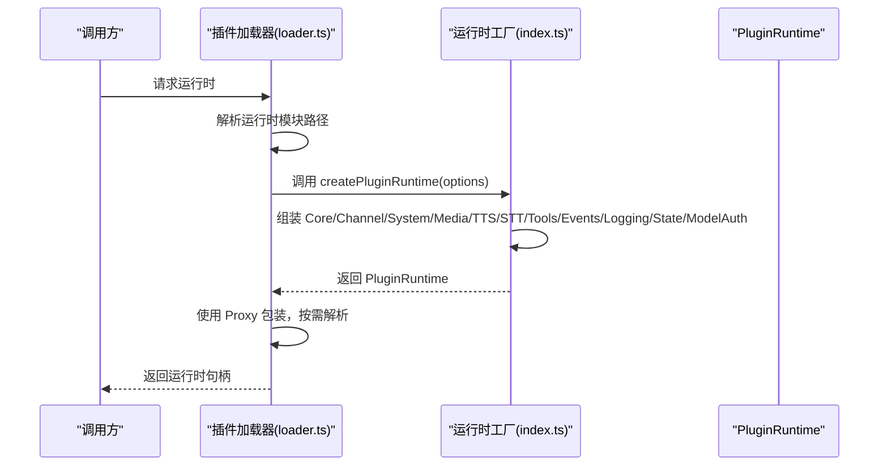
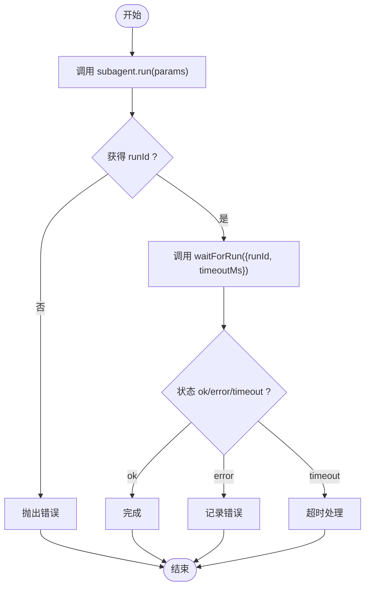
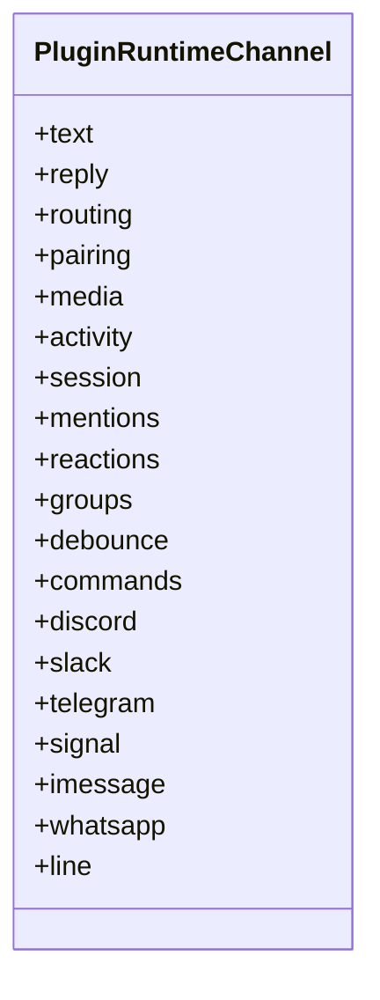
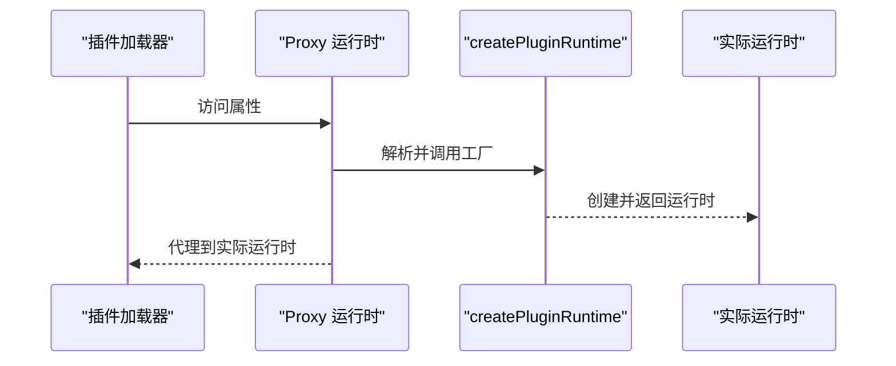
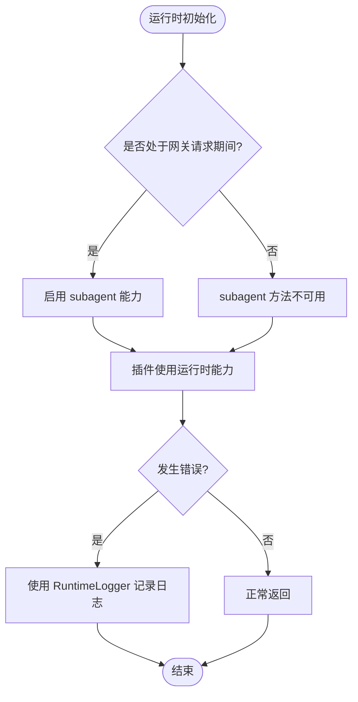
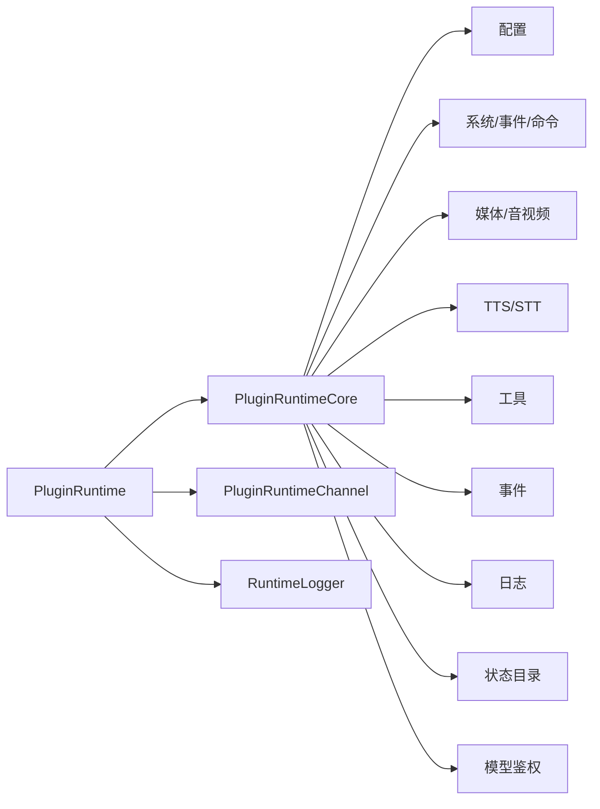

# 运行时类型

<cite>
**本文引用的文件**
- [src/plugins/runtime/types.ts](file://src/plugins/runtime/types.ts)
- [src/plugins/runtime/types-core.ts](file://src/plugins/runtime/types-core.ts)
- [src/plugins/runtime/types-channel.ts](file://src/plugins/runtime/types-channel.ts)
- [src/plugins/runtime/index.ts](file://src/plugins/runtime/index.ts)
- [src/plugins/runtime/runtime-logging.ts](file://src/plugins/runtime/runtime-logging.ts)
- [src/plugins/runtime/runtime-system.ts](file://src/plugins/runtime/runtime-system.ts)
- [src/plugins/runtime/runtime-media.ts](file://src/plugins/runtime/runtime-media.ts)
- [src/plugins/runtime/runtime-channel.ts](file://src/plugins/runtime/runtime-channel.ts)
- [src/plugins/logger.ts](file://src/plugins/logger.ts)
- [src/plugins/loader.ts](file://src/plugins/loader.ts)
- [src/plugin-sdk/runtime-store.ts](file://src/plugin-sdk/runtime-store.ts)
- [src/channels/run-state-machine.test.ts](file://src/channels/run-state-machine.test.ts)
</cite>

## 目录
1. [简介](#简介)
2. [项目结构](#项目结构)
3. [核心组件](#核心组件)
4. [架构总览](#架构总览)
5. [详细组件分析](#详细组件分析)
6. [依赖分析](#依赖分析)
7. [性能考虑](#性能考虑)
8. [故障排查指南](#故障排查指南)
9. [结论](#结论)

## 简介
本文件聚焦于 OpenClaw 插件运行时相关的类型与实现，系统性梳理并解释以下运行时接口类型与能力边界：
- PluginRuntime：插件运行时的统一能力集合，包含配置、系统、媒体、TTS/STT、工具、事件、日志、状态目录、模型鉴权等子域。
- SubagentRunParams/SubagentRunResult/SubagentWaitParams/SubagentWaitResult/SubagentGetSessionMessagesParams/SubagentGetSessionMessagesResult/SubagentDeleteSessionParams：子代理（Subagent）运行与会话管理的参数与结果类型。
- PluginLogger：插件加载器使用的日志适配器类型。

同时，文档覆盖运行时环境与生命周期管理、状态管理、错误处理、初始化与执行上下文、资源管理等主题，并通过图示展示类型关系与调用流程，帮助读者快速理解与正确使用运行时能力。

## 项目结构
围绕“运行时类型”的相关代码主要位于 src/plugins/runtime 目录下，辅以 src/plugins/logger.ts、src/plugins/loader.ts、src/plugin-sdk/runtime-store.ts 等文件提供日志适配、延迟加载与运行时存储能力。

图表来源
- [src/plugins/runtime/types.ts:1-64](file://src/plugins/runtime/types.ts#L1-L64)
- [src/plugins/runtime/types-core.ts:1-68](file://src/plugins/runtime/types-core.ts#L1-L68)
- [src/plugins/runtime/types-channel.ts:1-220](file://src/plugins/runtime/types-channel.ts#L1-L220)
- [src/plugins/runtime/index.ts:1-90](file://src/plugins/runtime/index.ts#L1-L90)
- [src/plugins/runtime/runtime-logging.ts:1-22](file://src/plugins/runtime/runtime-logging.ts#L1-L22)
- [src/plugins/runtime/runtime-system.ts:1-15](file://src/plugins/runtime/runtime-system.ts#L1-L15)
- [src/plugins/runtime/runtime-media.ts:1-18](file://src/plugins/runtime/runtime-media.ts#L1-L18)
- [src/plugins/runtime/runtime-channel.ts:1-339](file://src/plugins/runtime/runtime-channel.ts#L1-L339)
- [src/plugins/logger.ts:1-17](file://src/plugins/logger.ts#L1-L17)
- [src/plugins/loader.ts:848-902](file://src/plugins/loader.ts#L848-L902)
- [src/plugin-sdk/runtime-store.ts:1-26](file://src/plugin-sdk/runtime-store.ts#L1-L26)

章节来源
- [src/plugins/runtime/types.ts:1-64](file://src/plugins/runtime/types.ts#L1-L64)
- [src/plugins/runtime/types-core.ts:1-68](file://src/plugins/runtime/types-core.ts#L1-L68)
- [src/plugins/runtime/types-channel.ts:1-220](file://src/plugins/runtime/types-channel.ts#L1-L220)
- [src/plugins/runtime/index.ts:1-90](file://src/plugins/runtime/index.ts#L1-L90)

## 核心组件
- PluginRuntime：运行时能力总线，由 PluginRuntimeCore 与 channel 子域组成；还包含可选的 subagent 子域（在网关请求期间可用）。
- Subagent 类型族：用于启动子代理、等待其完成、查询会话消息、删除会话等。
- RuntimeLogger：运行时日志接口，支持 debug/info/warn/error。
- PluginRuntimeCore：运行时核心能力域，包括配置、系统、媒体、TTS/STT、工具、事件、日志、状态目录、模型鉴权等。
- PluginRuntimeChannel：通道能力域，按渠道细分文本处理、回复分发、路由、配对、媒体、活动记录、会话元数据、提及、反应、群组策略、防抖、命令授权、各渠道发送与动作等。

章节来源
- [src/plugins/runtime/types.ts:8-63](file://src/plugins/runtime/types.ts#L8-L63)
- [src/plugins/runtime/types-core.ts:10-67](file://src/plugins/runtime/types-core.ts#L10-L67)
- [src/plugins/runtime/types-channel.ts:16-219](file://src/plugins/runtime/types-channel.ts#L16-L219)

## 架构总览
运行时工厂 createPluginRuntime 负责组装 PluginRuntime，将各子域的能力注入到统一对象中。运行时在“网关请求期间”才具备 subagent 能力；否则 subagent 方法抛出不可用错误。运行时通过 Proxy 延迟解析，避免启动路径中无谓地加载所有依赖树。

图表来源
- [src/plugins/runtime/index.ts:52-87](file://src/plugins/runtime/index.ts#L52-L87)
- [src/plugins/loader.ts:848-902](file://src/plugins/loader.ts#L848-L902)

章节来源
- [src/plugins/runtime/index.ts:52-87](file://src/plugins/runtime/index.ts#L52-L87)
- [src/plugins/loader.ts:848-902](file://src/plugins/loader.ts#L848-L902)

## 详细组件分析

### PluginRuntime 类型与职责
- 结构组成
  - 版本号：字符串，来自包版本解析。
  - config：封装配置读写。
  - system：系统事件入队、心跳触发、命令超时执行、原生依赖提示格式化。
  - media：Web 媒体加载、MIME 检测、媒体类型判定、音频兼容性、图像元数据与缩放。
  - tts/stt：电话语音合成、音频转录。
  - tools：内存检索/搜索工具与 CLI 注册。
  - events：代理事件与会话转录更新事件订阅。
  - logging：是否输出详细日志、派生子日志器。
  - state：状态目录解析。
  - modelAuth：按模型或提供商解析 API Key。
  - subagent：仅在网关请求期间可用，否则抛错。
  - channel：按渠道划分的丰富能力集。

- 生命周期与可用性
  - subagent 方法在非网关请求期间不可用，工厂会返回“不可用”实现，调用时抛错。
  - 其余能力在运行时构建后即可使用。

- 初始化与装配
  - 通过 createPluginRuntime(options) 组装，允许外部注入 subagent 实现。

章节来源
- [src/plugins/runtime/types.ts:51-63](file://src/plugins/runtime/types.ts#L51-L63)
- [src/plugins/runtime/types-core.ts:10-67](file://src/plugins/runtime/types-core.ts#L10-L67)
- [src/plugins/runtime/index.ts:35-46](file://src/plugins/runtime/index.ts#L35-L46)
- [src/plugins/runtime/index.ts:52-87](file://src/plugins/runtime/index.ts#L52-L87)

### Subagent 运行与会话管理
- 参数与结果类型
  - SubagentRunParams：会话键、消息、额外系统提示、通道、投递开关、幂等键。
  - SubagentRunResult：返回 runId。
  - SubagentWaitParams：runId、超时毫秒数。
  - SubagentWaitResult：状态（ok/error/timeout）、错误信息。
  - SubagentGetSessionMessagesParams：会话键、消息数量限制。
  - SubagentGetSessionMessagesResult：消息数组。
  - SubagentDeleteSessionParams：会话键、可选删除转录。

- 可用性约束
  - 仅在网关请求期间可用；否则调用将抛出错误。

- 典型使用场景
  - 启动子代理：传入会话键与消息，获取 runId。
  - 等待完成：根据 runId 与可选超时等待结果。
  - 查询会话消息：按会话键与限制读取最近消息。
  - 删除会话：清理会话与可选转录。

图表来源
- [src/plugins/runtime/types.ts:8-29](file://src/plugins/runtime/types.ts#L8-L29)
- [src/plugins/runtime/types.ts:51-61](file://src/plugins/runtime/types.ts#L51-L61)
- [src/plugins/runtime/index.ts:35-46](file://src/plugins/runtime/index.ts#L35-L46)

章节来源
- [src/plugins/runtime/types.ts:8-49](file://src/plugins/runtime/types.ts#L8-L49)
- [src/plugins/runtime/index.ts:35-46](file://src/plugins/runtime/index.ts#L35-L46)

### PluginLogger 与日志适配
- PluginLogger 接口
  - info/warn/error/debug 可选方法，用于插件加载器日志输出。
- 适配器
  - createPluginLoaderLogger 将任意 LoggerLike 适配为 PluginLogger，转发调用。

- 使用建议
  - 在插件加载阶段使用该适配器，确保日志级别与行为一致。

章节来源
- [src/plugins/runtime/types-core.ts:3-8](file://src/plugins/runtime/types-core.ts#L3-L8)
- [src/plugins/logger.ts:10-17](file://src/plugins/logger.ts#L10-L17)

### 运行时日志子域（logging）
- 能力
  - shouldLogVerbose：是否输出详细日志。
  - getChildLogger：基于绑定与可选日志级别派生子日志器，返回符合 RuntimeLogger 的对象。
- 实现
  - createRuntimeLogging 返回 logging 子域实现，内部委托全局日志工具与级别归一化。

章节来源
- [src/plugins/runtime/types-core.ts:45-51](file://src/plugins/runtime/types-core.ts#L45-L51)
- [src/plugins/runtime/runtime-logging.ts:6-21](file://src/plugins/runtime/runtime-logging.ts#L6-L21)

### 运行时系统子域（system）
- 能力
  - enqueueSystemEvent：入队系统事件。
  - requestHeartbeatNow：立即请求心跳。
  - runCommandWithTimeout：带超时的命令执行。
  - formatNativeDependencyHint：原生依赖提示格式化。
- 实现
  - createRuntimeSystem 返回 system 子域实现。

章节来源
- [src/plugins/runtime/types-core.ts:16-21](file://src/plugins/runtime/types-core.ts#L16-L21)
- [src/plugins/runtime/runtime-system.ts:7-14](file://src/plugins/runtime/runtime-system.ts#L7-L14)

### 运行时媒体子域（media）
- 能力
  - loadWebMedia、detectMime、mediaKindFromMime、isVoiceCompatibleAudio、getImageMetadata、resizeToJpeg。
- 实现
  - createRuntimeMedia 返回 media 子域实现。

章节来源
- [src/plugins/runtime/types-core.ts:22-29](file://src/plugins/runtime/types-core.ts#L22-L29)
- [src/plugins/runtime/runtime-media.ts:8-17](file://src/plugins/runtime/runtime-media.ts#L8-L17)

### 运行时通道子域（channel）
- 能力域概览
  - text：文本切片、控制命令检测、Markdown 表格处理。
  - reply：回复分发、打字态、入站上下文、信封格式化。
  - routing：会话键构建、路由解析。
  - pairing：配对消息生成、读取/更新配对请求。
  - media：远程媒体抓取、本地保存。
  - activity：通道活动记录与查询。
  - session：会话存储路径、更新时间、入站会话记录、最后路由更新。
  - mentions：提及正则、匹配。
  - reactions：反应确认与清理。
  - groups：群组策略与是否必须提及。
  - debounce：入站防抖。
  - commands：命令授权、控制命令识别、命令处理开关。
  - discord/slack/telegram/signal/imessage/whatsapp/line：各渠道发送、监控、动作、打字租约等。
- 实现
  - createRuntimeChannel 返回 channel 子域实现，按渠道聚合导出函数。

图表来源
- [src/plugins/runtime/types-channel.ts:16-219](file://src/plugins/runtime/types-channel.ts#L16-L219)
- [src/plugins/runtime/runtime-channel.ts:142-338](file://src/plugins/runtime/runtime-channel.ts#L142-L338)

章节来源
- [src/plugins/runtime/types-channel.ts:16-219](file://src/plugins/runtime/types-channel.ts#L16-L219)
- [src/plugins/runtime/runtime-channel.ts:142-338](file://src/plugins/runtime/runtime-channel.ts#L142-L338)

### 运行时工厂与延迟加载
- createPluginRuntime
  - 组装 PluginRuntime：version、config、system、media、tts、stt、tools、channel、events、logging、state、modelAuth。
  - subagent 默认不可用，可通过 options 注入。
- 延迟加载
  - 插件加载器通过 Proxy 包装运行时，首次访问时解析真实运行时模块并缓存，避免启动路径中加载全部依赖树。

图表来源
- [src/plugins/runtime/index.ts:52-87](file://src/plugins/runtime/index.ts#L52-L87)
- [src/plugins/loader.ts:877-902](file://src/plugins/loader.ts#L877-L902)

章节来源
- [src/plugins/runtime/index.ts:52-87](file://src/plugins/runtime/index.ts#L52-L87)
- [src/plugins/loader.ts:848-902](file://src/plugins/loader.ts#L848-L902)

### 运行时状态管理与错误处理
- 运行时状态管理
  - 运行时通过 createPluginRuntime 组装，subagent 在网关请求期间可用；否则不可用。
  - 通过 Proxy 延迟解析，减少启动开销。
- 错误处理
  - subagent 不可用时调用对应方法将抛出错误。
  - 运行时日志通过 RuntimeLogger 输出，便于定位问题。
  - 运行时存储工具（runtime-store）提供运行时实例的设置/获取/清理能力，未设置时访问会抛错。

图表来源
- [src/plugins/runtime/index.ts:35-46](file://src/plugins/runtime/index.ts#L35-L46)
- [src/plugins/runtime/runtime-logging.ts:6-21](file://src/plugins/runtime/runtime-logging.ts#L6-L21)
- [src/plugin-sdk/runtime-store.ts:19-25](file://src/plugin-sdk/runtime-store.ts#L19-L25)

章节来源
- [src/plugins/runtime/index.ts:35-46](file://src/plugins/runtime/index.ts#L35-L46)
- [src/plugins/runtime/runtime-logging.ts:6-21](file://src/plugins/runtime/runtime-logging.ts#L6-L21)
- [src/plugin-sdk/runtime-store.ts:1-26](file://src/plugin-sdk/runtime-store.ts#L1-L26)

## 依赖分析
- 组件耦合
  - PluginRuntime 由多个子域模块组合而成，彼此低耦合、高内聚。
  - subagent 子域与网关请求上下文强相关，其他子域相对独立。
- 外部依赖
  - 配置、系统事件、心跳、进程执行、媒体处理、TTS/STT、工具、事件、日志、状态目录、模型鉴权等均来自核心模块。
- 循环依赖
  - 运行时工厂通过延迟加载与 Proxy 机制避免直接循环依赖。

图表来源
- [src/plugins/runtime/types.ts:51-63](file://src/plugins/runtime/types.ts#L51-L63)
- [src/plugins/runtime/types-core.ts:10-67](file://src/plugins/runtime/types-core.ts#L10-L67)

章节来源
- [src/plugins/runtime/types.ts:51-63](file://src/plugins/runtime/types.ts#L51-L63)
- [src/plugins/runtime/types-core.ts:10-67](file://src/plugins/runtime/types-core.ts#L10-L67)

## 性能考虑
- 延迟加载：通过 Proxy 与工厂延迟解析，避免启动路径中加载不必要的依赖树。
- 子域隔离：各子域能力独立装配，按需使用，降低热路径上的开销。
- 日志级别：通过 shouldLogVerbose 控制详细日志输出，减少生产环境日志噪声。
- 超时控制：system.runCommandWithTimeout 提供命令执行超时保障，防止阻塞。

## 故障排查指南
- subagent 方法报错
  - 现象：调用 subagent.run/wait/get/delete 抛出“仅在网关请求期间可用”的错误。
  - 排查：确认当前执行上下文是否处于网关请求期间；若非请求期间，请勿使用 subagent。
- 运行时未设置
  - 现象：通过 runtime-store 获取运行时抛出“未设置”错误。
  - 排查：确保在合适时机调用 setRuntime；或检查运行时初始化流程。
- 日志无输出
  - 现象：插件日志不显示。
  - 排查：确认使用 createPluginLoaderLogger 适配日志器；检查 shouldLogVerbose 与日志级别。

章节来源
- [src/plugins/runtime/index.ts:35-46](file://src/plugins/runtime/index.ts#L35-L46)
- [src/plugin-sdk/runtime-store.ts:19-25](file://src/plugin-sdk/runtime-store.ts#L19-L25)
- [src/plugins/runtime/runtime-logging.ts:6-21](file://src/plugins/runtime/runtime-logging.ts#L6-L21)

## 结论
本文系统梳理了 OpenClaw 插件运行时的类型与实现，明确了 PluginRuntime、Subagent 类型族与 PluginLogger 的职责边界与使用方式。通过工厂装配、子域隔离、延迟加载与日志适配等设计，运行时在保证安全与可控的同时，提供了丰富的通道与系统能力。遵循本文的类型使用规范与故障排查建议，可有效提升插件开发与维护效率。