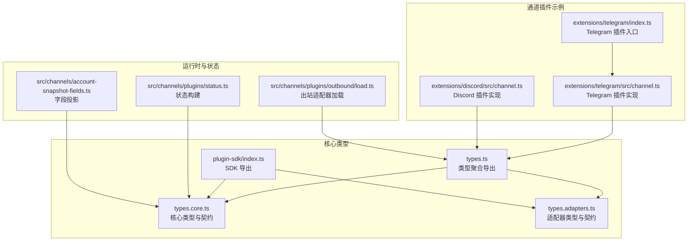
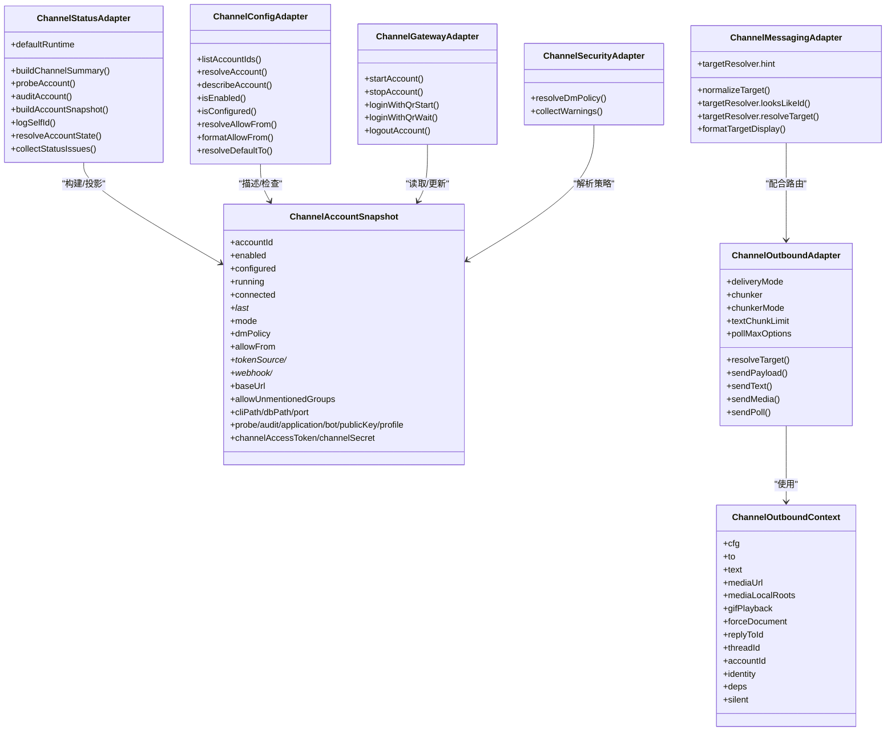
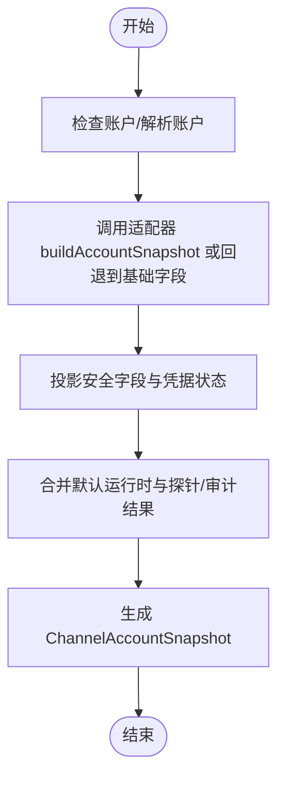
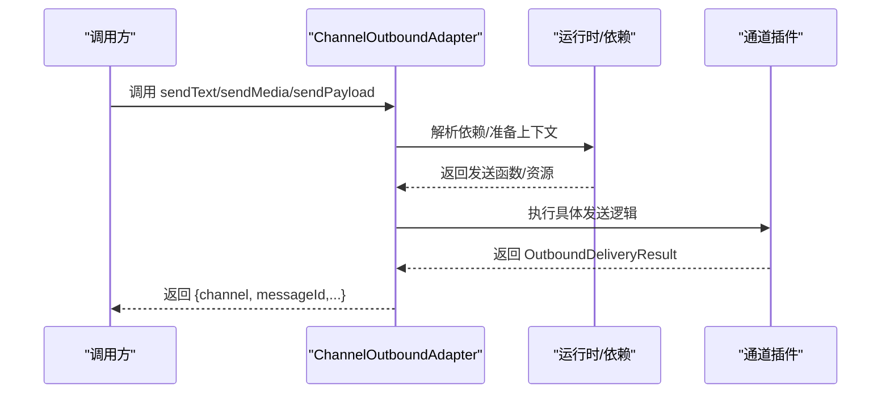
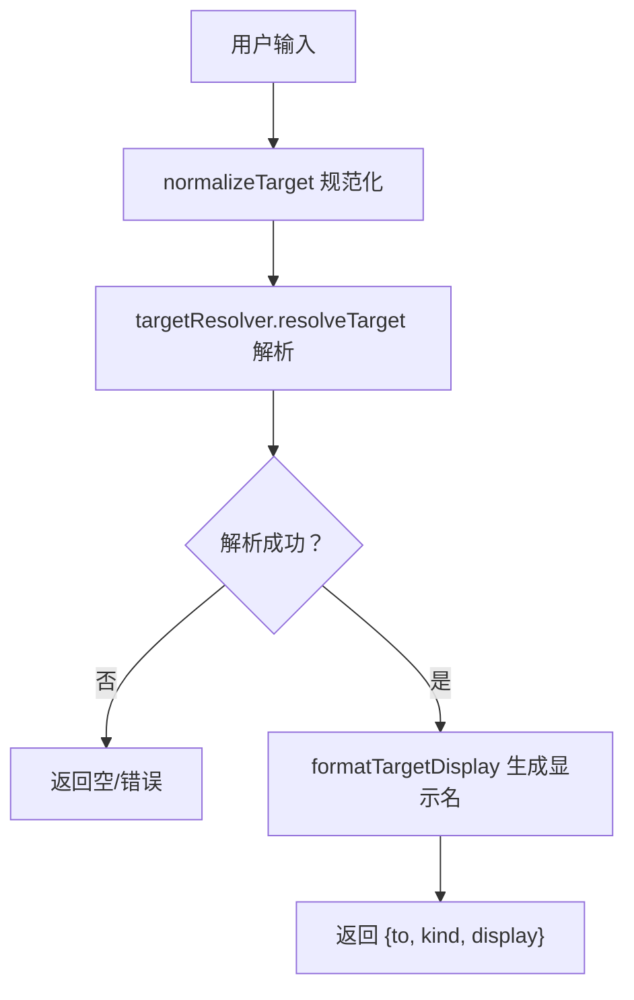
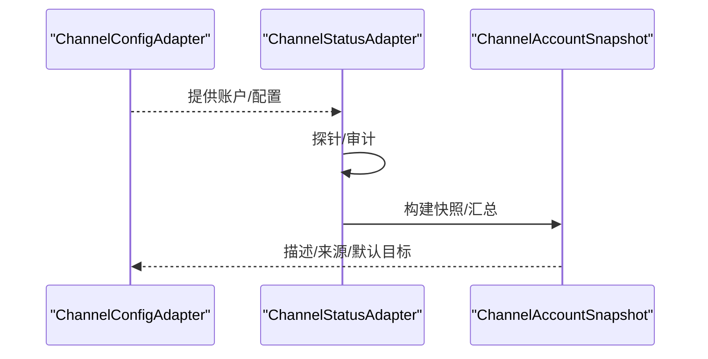
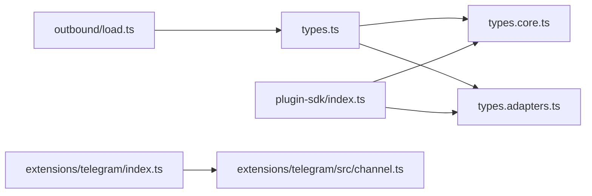

# 通道类型

<cite>
**本文引用的文件**
- [types.core.ts](file://src/channels/plugins/types.core.ts)
- [types.adapters.ts](file://src/channels/plugins/types.adapters.ts)
- [types.ts](file://src/channels/plugins/types.ts)
- [index.ts](file://src/plugin-sdk/index.ts)
- [load.ts](file://src/channels/plugins/outbound/load.ts)
- [status.ts](file://src/channels/plugins/status.ts)
- [account-snapshot-fields.ts](file://src/channels/account-snapshot-fields.ts)
- [channel.ts（Telegram）](file://extensions/telegram/src/channel.ts)
- [channel.ts（Discord）](file://extensions/discord/src/channel.ts)
- [index.ts（Telegram 插件入口）](file://extensions/telegram/index.ts)
</cite>

## 目录
1. [简介](#简介)
2. [项目结构](#项目结构)
3. [核心组件](#核心组件)
4. [架构总览](#架构总览)
5. [详细组件分析](#详细组件分析)
6. [依赖关系分析](#依赖关系分析)
7. [性能考量](#性能考量)
8. [故障排查指南](#故障排查指南)
9. [结论](#结论)
10. [附录：类型使用示例与最佳实践](#附录类型使用示例与最佳实践)

## 简介
本文件聚焦于 OpenClaw 通道系统中的核心类型与适配器契约，系统性梳理并解释以下关键类型与接口：
- ChannelAccountSnapshot：通道账户快照，用于描述账户状态、凭据来源与运行时元数据
- ChannelOutboundContext：出站消息发送上下文，承载目标、文本、媒体、线程与静默发送等参数
- ChannelMessagingAdapter：消息适配器，负责目标规范化、解析与显示格式化
- ChannelOutboundAdapter：出站适配器，定义分发模式、分块策略与发送能力
- 其他相关适配器与工具类型：如 ChannelConfigAdapter、ChannelStatusAdapter、ChannelGatewayAdapter、ChannelSecurityAdapter 等

同时，文档提供通道配置与状态管理的类型使用示例，覆盖认证、消息路由、连接管理等核心功能，并通过图示展示类型之间的关系与调用流程。

## 项目结构
通道类型与适配器主要位于以下位置：
- 核心类型定义：src/channels/plugins/types.core.ts、src/channels/plugins/types.adapters.ts
- 类型聚合导出：src/channels/plugins/types.ts、src/plugin-sdk/index.ts
- 出站适配器轻量加载：src/channels/plugins/outbound/load.ts
- 账户状态构建与投影：src/channels/plugins/status.ts、src/channels/account-snapshot-fields.ts
- 通道插件示例：extensions/telegram/src/channel.ts、extensions/discord/src/channel.ts
- 插件入口：extensions/telegram/index.ts

**图表来源**
- [types.core.ts:1-410](file://src/channels/plugins/types.core.ts#L1-L410)
- [types.adapters.ts:1-386](file://src/channels/plugins/types.adapters.ts#L1-L386)
- [types.ts:1-67](file://src/channels/plugins/types.ts#L1-L67)
- [index.ts:1-51](file://src/plugin-sdk/index.ts#L1-L51)
- [channel.ts（Telegram）:1-574](file://extensions/telegram/src/channel.ts#L1-L574)
- [channel.ts（Discord）:1-413](file://extensions/discord/src/channel.ts#L1-L413)
- [index.ts（Telegram 插件入口）:1-18](file://extensions/telegram/index.ts#L1-L18)
- [status.ts:1-90](file://src/channels/plugins/status.ts#L1-L90)
- [account-snapshot-fields.ts:1-219](file://src/channels/account-snapshot-fields.ts#L1-L219)
- [load.ts:1-17](file://src/channels/plugins/outbound/load.ts#L1-L17)

**章节来源**
- [types.core.ts:1-410](file://src/channels/plugins/types.core.ts#L1-L410)
- [types.adapters.ts:1-386](file://src/channels/plugins/types.adapters.ts#L1-L386)
- [types.ts:1-67](file://src/channels/plugins/types.ts#L1-L67)
- [index.ts:1-51](file://src/plugin-sdk/index.ts#L1-L51)
- [channel.ts（Telegram）:1-574](file://extensions/telegram/src/channel.ts#L1-L574)
- [channel.ts（Discord）:1-413](file://extensions/discord/src/channel.ts#L1-L413)
- [index.ts（Telegram 插件入口）:1-18](file://extensions/telegram/index.ts#L1-L18)
- [status.ts:1-90](file://src/channels/plugins/status.ts#L1-L90)
- [account-snapshot-fields.ts:1-219](file://src/channels/account-snapshot-fields.ts#L1-L219)
- [load.ts:1-17](file://src/channels/plugins/outbound/load.ts#L1-L17)

## 核心组件
本节对关键类型进行深入解析，包括用途、字段语义、典型实现要点与注意事项。

- ChannelAccountSnapshot
  - 作用：描述通道账户的“快照”状态，包含启用/配置/连接/运行时时间戳、错误信息、凭据来源与状态、DM 策略、允许来源、令牌状态等
  - 关键字段：enabled/configured/linked/running/connected、restartPending、last* 时间戳、busy/activeRuns、mode/dmPolicy、allowFrom、tokenSource/*Status、webhook/*Url、baseUrl、allowUnmentionedGroups、cliPath/dbPath/port、probe/audit/application/bot/publicKey/profile、channelAccessToken/channelSecret 等
  - 使用场景：状态命令渲染、健康检查、问题诊断、配置建议
  - 参考路径：[ChannelAccountSnapshot:100-162](file://src/channels/plugins/types.core.ts#L100-L162)

- ChannelOutboundContext
  - 作用：出站消息发送的上下文载体，统一传递目标、文本、媒体、回复/线程、身份与依赖
  - 关键字段：cfg、to、text、mediaUrl/mediaLocalRoots、gifPlayback、forceDocument、replyToId/threadId、accountId、identity、deps、silent
  - 使用场景：所有出站发送流程（文本、媒体、轮询）
  - 参考路径：[ChannelOutboundContext:89-104](file://src/channels/plugins/types.adapters.ts#L89-L104)

- ChannelOutboundAdapter
  - 作用：定义通道的出站发送能力，包括分发模式、分块策略、最大选项数、目标解析与发送方法
  - 关键字段：deliveryMode、chunker/chunkerMode/textChunkLimit、pollMaxOptions、resolveTarget、sendPayload/sendText/sendMedia/sendPoll
  - 使用场景：各通道自定义发送逻辑与分块策略
  - 参考路径：[ChannelOutboundAdapter:110-127](file://src/channels/plugins/types.adapters.ts#L110-L127)

- ChannelMessagingAdapter
  - 作用：消息路由与目标解析适配器，支持目标规范化、解析与显示格式化
  - 关键字段：normalizeTarget、targetResolver（looksLikeId/hint/resolveTarget）、formatTargetDisplay
  - 使用场景：将用户输入的目标转换为平台可识别 ID，并生成可读显示名
  - 参考路径：[ChannelMessagingAdapter:294-317](file://src/channels/plugins/types.core.ts#L294-L317)

- ChannelConfigAdapter
  - 作用：账户配置访问器，提供账户列表、解析、启用/禁用、删除、配置检查、描述与默认目标解析等
  - 关键字段：listAccountIds/resolveAccount/...、setAccountEnabled/deleteAccount、isEnabled/isConfigured、describeAccount、resolveAllowFrom/formatAllowFrom、resolveDefaultTo
  - 使用场景：通道配置 UI、状态构建、权限与来源控制
  - 参考路径：[ChannelConfigAdapter:52-81](file://src/channels/plugins/types.adapters.ts#L52-L81)

- ChannelStatusAdapter
  - 作用：账户状态探测、审计与快照构建，支持汇总构建、探针执行、审计、快照生成、状态枚举解析与问题收集
  - 关键字段：defaultRuntime、buildChannelSummary/probeAccount/auditAccount/buildAccountSnapshot、logSelfId、resolveAccountState、collectStatusIssues
  - 使用场景：通道健康度评估、问题诊断与修复建议
  - 参考路径：[ChannelStatusAdapter:129-168](file://src/channels/plugins/types.adapters.ts#L129-L168)

- ChannelGatewayAdapter
  - 作用：通道网关生命周期管理，支持启动/停止账户、二维码登录、登出
  - 关键字段：startAccount/stopAccount、loginWithQrStart/loginWithQrWait、logoutAccount
  - 使用场景：外部通道插件的运行时接入与生命周期控制
  - 参考路径：[ChannelGatewayAdapter:277-291](file://src/channels/plugins/types.adapters.ts#L277-L291)

- ChannelSecurityAdapter
  - 作用：安全策略解析与告警收集，支持 DM 策略解析与警告收集
  - 关键字段：resolveDmPolicy、collectWarnings
  - 使用场景：基于账户与配置的安全策略落地
  - 参考路径：[ChannelSecurityAdapter:380-385](file://src/channels/plugins/types.adapters.ts#L380-L385)

**章节来源**
- [types.core.ts:100-317](file://src/channels/plugins/types.core.ts#L100-L317)
- [types.adapters.ts:52-168](file://src/channels/plugins/types.adapters.ts#L52-L168)
- [types.adapters.ts:277-291](file://src/channels/plugins/types.adapters.ts#L277-L291)
- [types.adapters.ts:380-385](file://src/channels/plugins/types.adapters.ts#L380-L385)

## 架构总览
下图展示了通道类型在系统中的角色与交互关系，以及与插件实现的关系：

**图表来源**
- [types.core.ts:89-317](file://src/channels/plugins/types.core.ts#L89-L317)
- [types.adapters.ts:52-168](file://src/channels/plugins/types.adapters.ts#L52-L168)
- [types.adapters.ts:277-291](file://src/channels/plugins/types.adapters.ts#L277-L291)
- [types.adapters.ts:380-385](file://src/channels/plugins/types.adapters.ts#L380-L385)

## 详细组件分析

### ChannelAccountSnapshot 分析
- 字段设计
  - 状态类：enabled/configured/linked/running/connected、restartPending、busy/activeRuns
  - 时间类：lastConnectedAt/lastDisconnect/lastMessageAt/lastEventAt/lastError/lastStartAt/lastStopAt/lastInboundAt/lastOutboundAt
  - 运行模式与策略：mode/dmPolicy/allowFrom、allowUnmentionedGroups
  - 凭据与来源：tokenSource/*Status、credentialSource/secretSource、audienceType/audience、webhook/*Url、baseUrl
  - 运行时与应用：cliPath/dbPath/port、probe/audit/application/bot/publicKey/profile、channelAccessToken/channelSecret
- 使用示例参考
  - 状态构建：[buildChannelAccountSnapshot:75-90](file://src/channels/plugins/status.ts#L75-L90)
  - 字段投影：[projectSafeChannelAccountSnapshotFields:176-219](file://src/channels/account-snapshot-fields.ts#L176-L219)

**图表来源**
- [status.ts:75-90](file://src/channels/plugins/status.ts#L75-L90)
- [account-snapshot-fields.ts:176-219](file://src/channels/account-snapshot-fields.ts#L176-L219)

**章节来源**
- [types.core.ts:100-162](file://src/channels/plugins/types.core.ts#L100-L162)
- [status.ts:75-90](file://src/channels/plugins/status.ts#L75-L90)
- [account-snapshot-fields.ts:176-219](file://src/channels/account-snapshot-fields.ts#L176-L219)

### ChannelOutboundContext 与 ChannelOutboundAdapter 分析
- ChannelOutboundContext
  - 统一承载出站发送所需的所有上下文信息，便于适配器与运行时解耦
  - 参考路径：[ChannelOutboundContext:89-104](file://src/channels/plugins/types.adapters.ts#L89-L104)
- ChannelOutboundAdapter
  - 定义分发模式（direct/gateway/hybrid）、分块策略（chunker/chunkerMode/textChunkLimit）、轮询最大选项数（pollMaxOptions）
  - 提供目标解析与发送方法：resolveTarget、sendPayload、sendText、sendMedia、sendPoll
  - 参考路径：[ChannelOutboundAdapter:110-127](file://src/channels/plugins/types.adapters.ts#L110-L127)
- 示例实现（Telegram）
  - 出站适配器实现与发送函数：[telegramPlugin.outbound:300-384](file://extensions/telegram/src/channel.ts#L300-L384)
  - 出站上下文使用：[sendTelegramOutbound:113-141](file://extensions/telegram/src/channel.ts#L113-L141)

**图表来源**
- [types.adapters.ts:110-127](file://src/channels/plugins/types.adapters.ts#L110-L127)
- [channel.ts（Telegram）:300-384](file://extensions/telegram/src/channel.ts#L300-L384)

**章节来源**
- [types.adapters.ts:89-127](file://src/channels/plugins/types.adapters.ts#L89-L127)
- [channel.ts（Telegram）:113-141](file://extensions/telegram/src/channel.ts#L113-L141)

### ChannelMessagingAdapter 分析
- 职责
  - 目标规范化：normalizeTarget 将用户输入标准化为目标标识
  - 目标解析：targetResolver.looksLikeId 判断是否像目标 ID；resolveTarget 将输入解析为平台 ID、类型与显示名
  - 显示格式化：formatTargetDisplay 生成可读的目标显示字符串
- 示例实现（Telegram/Discord）
  - Telegram messaging 配置：[telegramPlugin.messaging:286-292](file://extensions/telegram/src/channel.ts#L286-L292)
  - Discord messaging 配置：[discordPlugin.messaging:184-190](file://extensions/discord/src/channel.ts#L184-L190)

**图表来源**
- [types.core.ts:294-317](file://src/channels/plugins/types.core.ts#L294-L317)
- [channel.ts（Telegram）:286-292](file://extensions/telegram/src/channel.ts#L286-L292)
- [channel.ts（Discord）:184-190](file://extensions/discord/src/channel.ts#L184-L190)

**章节来源**
- [types.core.ts:294-317](file://src/channels/plugins/types.core.ts#L294-L317)
- [channel.ts（Telegram）:286-292](file://extensions/telegram/src/channel.ts#L286-L292)
- [channel.ts（Discord）:184-190](file://extensions/discord/src/channel.ts#L184-L190)

### ChannelConfigAdapter 与 ChannelStatusAdapter 分析
- ChannelConfigAdapter
  - 列表与解析：listAccountIds/resolveAccount
  - 启用/禁用/删除：setAccountEnabled/deleteAccount
  - 配置检查：isEnabled/isConfigured/unconfiguredReason
  - 描述与来源：describeAccount、resolveAllowFrom/formatAllowFrom、resolveDefaultTo
  - 参考路径：[ChannelConfigAdapter:52-81](file://src/channels/plugins/types.adapters.ts#L52-L81)
- ChannelStatusAdapter
  - 探针与审计：probeAccount/auditAccount
  - 快照构建：buildChannelSummary/buildAccountSnapshot/defaultRuntime
  - 状态枚举：resolveAccountState、collectStatusIssues
  - 参考路径：[ChannelStatusAdapter:129-168](file://src/channels/plugins/types.adapters.ts#L129-L168)
- 示例实现（Telegram）
  - 配置访问器与描述：[telegramPlugin.config.*:217-248](file://extensions/telegram/src/channel.ts#L217-L248)
  - 状态构建与问题收集：[telegramPlugin.status.*:385-471](file://extensions/telegram/src/channel.ts#L385-L471)

**图表来源**
- [types.adapters.ts:52-81](file://src/channels/plugins/types.adapters.ts#L52-L81)
- [types.adapters.ts:129-168](file://src/channels/plugins/types.adapters.ts#L129-L168)
- [channel.ts（Telegram）:217-248](file://extensions/telegram/src/channel.ts#L217-L248)
- [channel.ts（Telegram）:385-471](file://extensions/telegram/src/channel.ts#L385-L471)

**章节来源**
- [types.adapters.ts:52-81](file://src/channels/plugins/types.adapters.ts#L52-L81)
- [types.adapters.ts:129-168](file://src/channels/plugins/types.adapters.ts#L129-L168)
- [channel.ts（Telegram）:217-248](file://extensions/telegram/src/channel.ts#L217-L248)
- [channel.ts（Telegram）:385-471](file://extensions/telegram/src/channel.ts#L385-L471)

### ChannelGatewayAdapter 与 ChannelSecurityAdapter 分析
- ChannelGatewayAdapter
  - 生命周期：startAccount/stopAccount
  - 登录：loginWithQrStart/loginWithQrWait
  - 登出：logoutAccount
  - 参考路径：[ChannelGatewayAdapter:277-291](file://src/channels/plugins/types.adapters.ts#L277-L291)
- ChannelSecurityAdapter
  - DM 策略：resolveDmPolicy
  - 告警：collectWarnings
  - 参考路径：[ChannelSecurityAdapter:380-385](file://src/channels/plugins/types.adapters.ts#L380-L385)
- 示例实现（Telegram）
  - 网关启动/登出：[telegramPlugin.gateway.*:472-572](file://extensions/telegram/src/channel.ts#L472-L572)
  - 安全策略：[telegramPlugin.security.*:249-278](file://extensions/telegram/src/channel.ts#L249-L278)

**章节来源**
- [types.adapters.ts:277-291](file://src/channels/plugins/types.adapters.ts#L277-L291)
- [types.adapters.ts:380-385](file://src/channels/plugins/types.adapters.ts#L380-L385)
- [channel.ts（Telegram）:472-572](file://extensions/telegram/src/channel.ts#L472-L572)
- [channel.ts（Telegram）:249-278](file://extensions/telegram/src/channel.ts#L249-L278)

## 依赖关系分析
- 类型聚合
  - types.ts 汇总导出核心类型与适配器，plugin-sdk/index.ts 对外暴露 SDK 类型
  - 参考路径：[types.ts:1-67](file://src/channels/plugins/types.ts#L1-L67)、[index.ts:1-51](file://src/plugin-sdk/index.ts#L1-L51)
- 出站适配器加载
  - outbound/load.ts 提供轻量级出站适配器加载，避免导入完整插件带来的额外开销
  - 参考路径：[load.ts:1-17](file://src/channels/plugins/outbound/load.ts#L1-L17)
- 插件注册与入口
  - Telegram 插件入口通过 index.ts 注册插件并设置运行时
  - 参考路径：[index.ts（Telegram 插件入口）:1-18](file://extensions/telegram/index.ts#L1-L18)

**图表来源**
- [types.ts:1-67](file://src/channels/plugins/types.ts#L1-L67)
- [index.ts:1-51](file://src/plugin-sdk/index.ts#L1-L51)
- [load.ts:1-17](file://src/channels/plugins/outbound/load.ts#L1-L17)
- [index.ts（Telegram 插件入口）:1-18](file://extensions/telegram/index.ts#L1-L18)

**章节来源**
- [types.ts:1-67](file://src/channels/plugins/types.ts#L1-L67)
- [index.ts:1-51](file://src/plugin-sdk/index.ts#L1-L51)
- [load.ts:1-17](file://src/channels/plugins/outbound/load.ts#L1-L17)
- [index.ts（Telegram 插件入口）:1-18](file://extensions/telegram/index.ts#L1-L18)

## 性能考量
- 出站适配器加载优化
  - 仅导入必要模块，避免加载完整插件导致的冷启动与内存开销
  - 参考路径：[load.ts:1-17](file://src/channels/plugins/outbound/load.ts#L1-L17)
- 分块与限流
  - 文本分块与轮询最大选项数由适配器定义，避免单次请求过大或超限
  - 参考路径：[ChannelOutboundAdapter:110-127](file://src/channels/plugins/types.adapters.ts#L110-L127)
- 状态构建与字段投影
  - 仅投影安全字段，减少敏感信息泄露风险与渲染开销
  - 参考路径：[projectSafeChannelAccountSnapshotFields:176-219](file://src/channels/account-snapshot-fields.ts#L176-L219)

[本节为通用指导，无需特定文件分析]

## 故障排查指南
- 状态问题收集
  - 使用 ChannelStatusAdapter.collectStatusIssues 收集账户问题，结合 ChannelStatusIssue 结构定位意图、权限、配置、认证与运行时问题
  - 参考路径：[ChannelStatusIssue:58-64](file://src/channels/plugins/types.core.ts#L58-L64)、[ChannelStatusAdapter:129-168](file://src/channels/plugins/types.adapters.ts#L129-L168)
- 凭据状态与可用性
  - 通过 projectCredentialSnapshotFields 与 resolveConfiguredFromCredentialStatuses 判断凭据状态与可用性
  - 参考路径：[account-snapshot-fields.ts:62-101](file://src/channels/account-snapshot-fields.ts#L62-L101)、[account-snapshot-fields.ts:126-174](file://src/channels/account-snapshot-fields.ts#L126-L174)
- 插件入口与注册
  - 确认插件入口正确注册并设置运行时，避免运行时缺失导致的功能不可用
  - 参考路径：[index.ts（Telegram 插件入口）:1-18](file://extensions/telegram/index.ts#L1-L18)

**章节来源**
- [types.core.ts:58-64](file://src/channels/plugins/types.core.ts#L58-L64)
- [types.adapters.ts:129-168](file://src/channels/plugins/types.adapters.ts#L129-L168)
- [account-snapshot-fields.ts:62-101](file://src/channels/account-snapshot-fields.ts#L62-L101)
- [account-snapshot-fields.ts:126-174](file://src/channels/account-snapshot-fields.ts#L126-L174)
- [index.ts（Telegram 插件入口）:1-18](file://extensions/telegram/index.ts#L1-L18)

## 结论
OpenClaw 的通道类型体系以清晰的契约与职责分离为核心，通过 ChannelAccountSnapshot、ChannelOutboundContext、ChannelOutboundAdapter、ChannelMessagingAdapter 等关键类型，实现了跨通道的一致性抽象与灵活扩展。配合 ChannelConfigAdapter、ChannelStatusAdapter、ChannelGatewayAdapter、ChannelSecurityAdapter，系统在配置、状态、生命周期与安全方面提供了完整的支撑。实际通道插件（如 Telegram、Discord）通过实现相应适配器，即可无缝接入并遵循统一的类型约束与行为规范。

[本节为总结，无需特定文件分析]

## 附录：类型使用示例与最佳实践
- ChannelAccountSnapshot 使用示例
  - 状态构建：参考 [buildChannelAccountSnapshot:75-90](file://src/channels/plugins/status.ts#L75-L90)
  - 字段投影：参考 [projectSafeChannelAccountSnapshotFields:176-219](file://src/channels/account-snapshot-fields.ts#L176-L219)
- ChannelOutboundContext 使用示例
  - 出站发送上下文：参考 [ChannelOutboundContext:89-104](file://src/channels/plugins/types.adapters.ts#L89-L104)
  - Telegram 出站实现：参考 [telegramPlugin.outbound:300-384](file://extensions/telegram/src/channel.ts#L300-L384)
- ChannelMessagingAdapter 使用示例
  - 目标规范化与解析：参考 [ChannelMessagingAdapter:294-317](file://src/channels/plugins/types.core.ts#L294-L317)
  - Telegram/Discord 实现：参考 [telegramPlugin.messaging:286-292](file://extensions/telegram/src/channel.ts#L286-L292)、[discordPlugin.messaging:184-190](file://extensions/discord/src/channel.ts#L184-L190)
- ChannelConfigAdapter 与 ChannelStatusAdapter 使用示例
  - 配置访问与描述：参考 [telegramPlugin.config.*:217-248](file://extensions/telegram/src/channel.ts#L217-L248)
  - 状态构建与问题收集：参考 [telegramPlugin.status.*:385-471](file://extensions/telegram/src/channel.ts#L385-L471)
- 出站适配器加载最佳实践
  - 仅在需要时加载完整插件，轻量场景使用 [loadChannelOutboundAdapter:13-17](file://src/channels/plugins/outbound/load.ts#L13-L17)

**章节来源**
- [status.ts:75-90](file://src/channels/plugins/status.ts#L75-L90)
- [account-snapshot-fields.ts:176-219](file://src/channels/account-snapshot-fields.ts#L176-L219)
- [types.adapters.ts:89-104](file://src/channels/plugins/types.adapters.ts#L89-L104)
- [channel.ts（Telegram）:300-384](file://extensions/telegram/src/channel.ts#L300-L384)
- [types.core.ts:294-317](file://src/channels/plugins/types.core.ts#L294-L317)
- [channel.ts（Telegram）:286-292](file://extensions/telegram/src/channel.ts#L286-L292)
- [channel.ts（Discord）:184-190](file://extensions/discord/src/channel.ts#L184-L190)
- [channel.ts（Telegram）:217-248](file://extensions/telegram/src/channel.ts#L217-L248)
- [channel.ts（Telegram）:385-471](file://extensions/telegram/src/channel.ts#L385-L471)
- [load.ts:13-17](file://src/channels/plugins/outbound/load.ts#L13-L17)