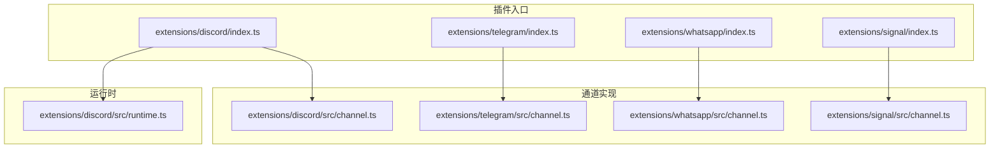
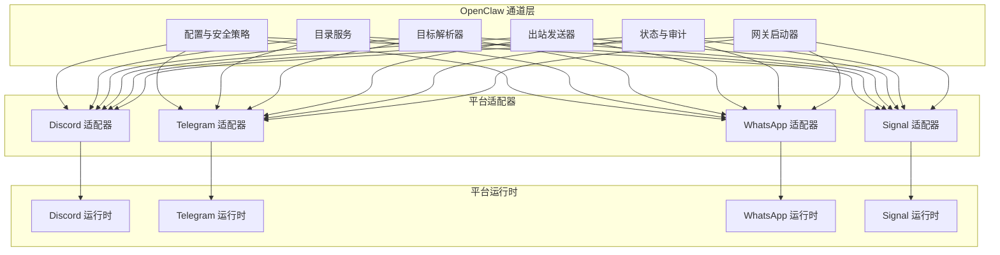
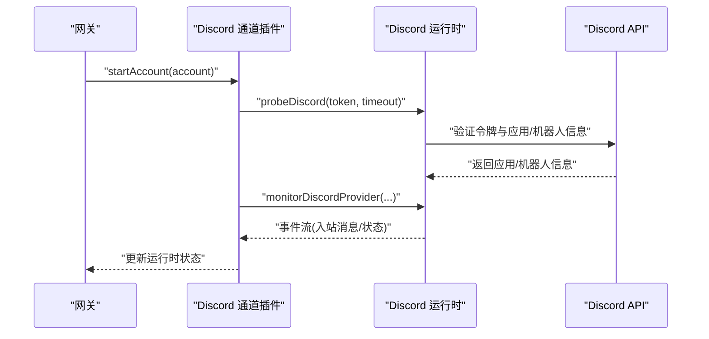
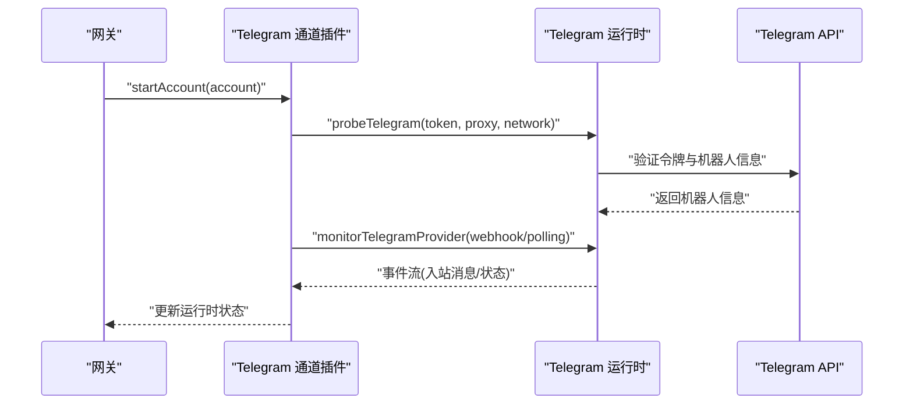
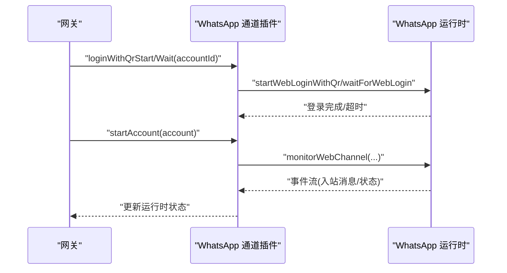
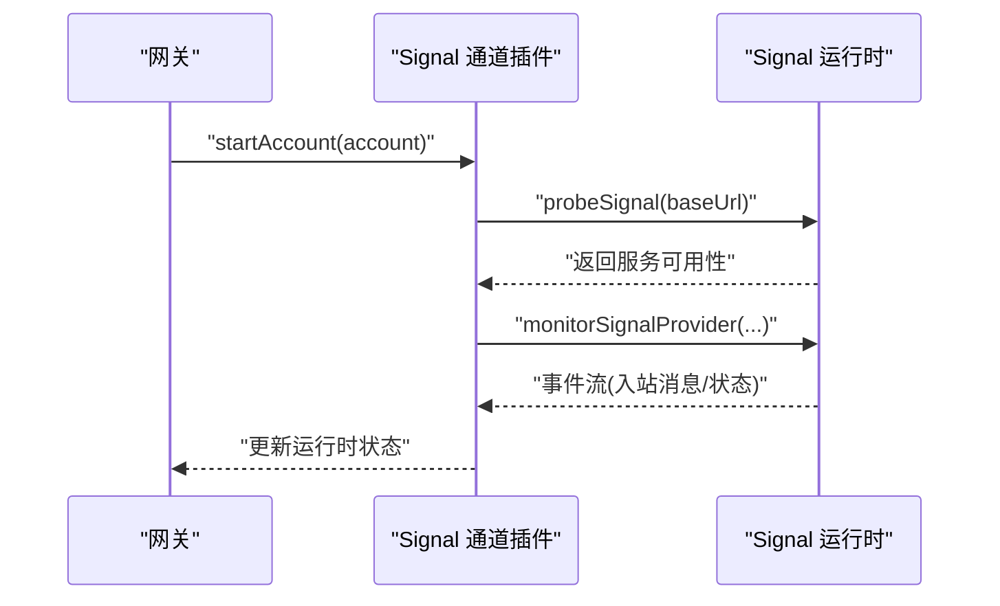
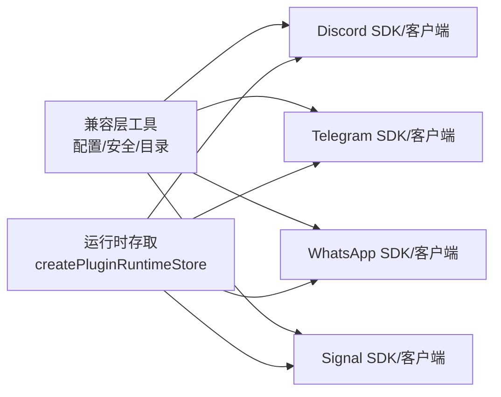

# 平台特定适配器

<cite>
**本文引用的文件**
- [extensions/discord/index.ts](file://extensions/discord/index.ts)
- [extensions/discord/src/channel.ts](file://extensions/discord/src/channel.ts)
- [extensions/discord/src/runtime.ts](file://extensions/discord/src/runtime.ts)
- [extensions/telegram/index.ts](file://extensions/telegram/index.ts)
- [extensions/telegram/src/channel.ts](file://extensions/telegram/src/channel.ts)
- [extensions/whatsapp/index.ts](file://extensions/whatsapp/index.ts)
- [extensions/whatsapp/src/channel.ts](file://extensions/whatsapp/src/channel.ts)
- [extensions/signal/index.ts](file://extensions/signal/index.ts)
- [extensions/signal/src/channel.ts](file://extensions/signal/src/channel.ts)
</cite>

## 目录
1. [简介](#简介)
2. [项目结构](#项目结构)
3. [核心组件](#核心组件)
4. [架构总览](#架构总览)
5. [详细组件分析](#详细组件分析)
6. [依赖关系分析](#依赖关系分析)
7. [性能考量](#性能考量)
8. [故障排查指南](#故障排查指南)
9. [结论](#结论)
10. [附录：开发与集成指南](#附录开发与集成指南)

## 简介
本文件系统性梳理 OpenClaw 在即时通讯平台（Discord、Telegram、WhatsApp、Signal）上的“平台特定适配器”实现，覆盖各平台的消息格式、连接方式、认证机制、消息路由与状态同步等核心能力，并提供可复用的开发与集成指南。适配器以插件形式注册到 OpenClaw 的通道层，统一通过运行时接口与底层 SDK/客户端交互。

## 项目结构
各平台适配器均采用一致的目录组织模式：
- 插件入口：位于扩展根目录的 index.ts，负责注册插件、注入运行时、注册通道插件。
- 通道实现：位于 src/channel.ts，定义通道元数据、配置、安全策略、消息解析、发送、状态与网关启动等。
- 运行时存取：位于 src/runtime.ts，提供运行时存储与获取方法，避免循环依赖与初始化顺序问题。

**图表来源**
- [extensions/discord/index.ts:1-23](file://extensions/discord/index.ts#L1-L23)
- [extensions/discord/src/channel.ts:1-413](file://extensions/discord/src/channel.ts#L1-L413)
- [extensions/discord/src/runtime.ts:1-7](file://extensions/discord/src/runtime.ts#L1-L7)
- [extensions/telegram/index.ts:1-18](file://extensions/telegram/index.ts#L1-L18)
- [extensions/telegram/src/channel.ts:1-574](file://extensions/telegram/src/channel.ts#L1-L574)
- [extensions/whatsapp/index.ts:1-18](file://extensions/whatsapp/index.ts#L1-L18)
- [extensions/whatsapp/src/channel.ts:1-443](file://extensions/whatsapp/src/channel.ts#L1-L443)
- [extensions/signal/index.ts:1-18](file://extensions/signal/index.ts#L1-L18)
- [extensions/signal/src/channel.ts:1-247](file://extensions/signal/src/channel.ts#L1-L247)

**章节来源**
- [extensions/discord/index.ts:1-23](file://extensions/discord/index.ts#L1-L23)
- [extensions/telegram/index.ts:1-18](file://extensions/telegram/index.ts#L1-L18)
- [extensions/whatsapp/index.ts:1-18](file://extensions/whatsapp/index.ts#L1-L18)
- [extensions/signal/index.ts:1-18](file://extensions/signal/index.ts#L1-L18)

## 核心组件
- 插件注册器：在各平台入口中调用 setRuntime 注入运行时，再通过 api.registerChannel 注册通道插件。
- 通道插件 ChannelPlugin：统一暴露 meta、capabilities、config、security、messaging、directory、resolver、outbound、status、gateway 等能力域。
- 运行时存取：通过 createPluginRuntimeStore 创建命名空间运行时，避免模块初始化顺序问题。
- 统一配置与安全：使用兼容层工具构建账户级配置访问器、默认账号解析、DM 安全策略、组策略与路由警告收集。
- 状态与审计：提供默认运行时状态、状态汇总、探针探测、权限审计与快照构建。

**章节来源**
- [extensions/discord/src/channel.ts:84-413](file://extensions/discord/src/channel.ts#L84-L413)
- [extensions/discord/src/runtime.ts:1-7](file://extensions/discord/src/runtime.ts#L1-L7)
- [extensions/telegram/src/channel.ts:182-574](file://extensions/telegram/src/channel.ts#L182-L574)
- [extensions/whatsapp/src/channel.ts:90-443](file://extensions/whatsapp/src/channel.ts#L90-L443)
- [extensions/signal/src/channel.ts:95-247](file://extensions/signal/src/channel.ts#L95-L247)

## 架构总览
下图展示 OpenClaw 通道层与各平台适配器的交互关系，以及消息从“入站事件”到“出站发送”的典型路径。

**图表来源**
- [extensions/discord/src/channel.ts:84-413](file://extensions/discord/src/channel.ts#L84-L413)
- [extensions/telegram/src/channel.ts:182-574](file://extensions/telegram/src/channel.ts#L182-L574)
- [extensions/whatsapp/src/channel.ts:90-443](file://extensions/whatsapp/src/channel.ts#L90-L443)
- [extensions/signal/src/channel.ts:95-247](file://extensions/signal/src/channel.ts#L95-L247)

## 详细组件分析

### Discord 适配器
- 插件注册：入口导入通道插件与运行时设置函数，注册通道并按需注册子代理钩子。
- 通道能力：
  - 聊天类型：直接消息、频道、主题。
  - 媒体、投票、反应、线程、原生命令。
  - 文本分块上限与流式合并策略。
- 配置与安全：
  - 账户级配置访问器与默认账号解析。
  - DM 政策基于用户提及与 allowFrom 列表。
  - 组策略与路由白名单警告收集。
- 消息与目标：
  - 目标标准化与 ID 判定。
  - 解析群组/用户允许列表，支持群组与个人消息。
- 出站发送：
  - 文本、媒体、投票发送；支持回复、静默发送。
  - 可通过依赖注入替换底层发送函数。
- 状态与审计：
  - 默认运行时状态、应用/机器人信息、连接状态。
  - 探针探测 Bot 信息与意图状态；审计频道权限。
- 网关启动：
  - 启动监控任务，处理入站事件、更新运行时状态。

**图表来源**
- [extensions/discord/src/channel.ts:366-411](file://extensions/discord/src/channel.ts#L366-L411)

**章节来源**
- [extensions/discord/index.ts:1-23](file://extensions/discord/index.ts#L1-L23)
- [extensions/discord/src/channel.ts:84-413](file://extensions/discord/src/channel.ts#L84-L413)
- [extensions/discord/src/runtime.ts:1-7](file://extensions/discord/src/runtime.ts#L1-L7)

### Telegram 适配器
- 插件注册：入口导入通道插件与运行时设置函数，注册通道。
- 通道能力：
  - 聊天类型：直接、群组、频道、主题。
  - 媒体、投票、反应、线程、原生命令。
  - Markdown 分块与文本分块限制。
- 配置与安全：
  - 多账号共享同一 Bot Token 的冲突检测与提示。
  - DM 政策与组策略的路由白名单警告收集。
- 消息与目标：
  - 目标标准化与 ID 判定。
  - 支持线程 ID 与回复消息 ID 解析。
- 出站发送：
  - 文本、媒体、投票发送；支持静默、强制文档。
  - Payload 批量消息发送封装。
- 状态与审计：
  - 探针探测 Bot 信息；审计群组成员身份。
  - 构建包含模式（webhook/polling）、最后收发时间等快照。
- 网关启动：
  - 支持 webhook 或轮询两种模式；启动监控任务。

**图表来源**
- [extensions/telegram/src/channel.ts:472-519](file://extensions/telegram/src/channel.ts#L472-L519)

**章节来源**
- [extensions/telegram/index.ts:1-18](file://extensions/telegram/index.ts#L1-L18)
- [extensions/telegram/src/channel.ts:182-574](file://extensions/telegram/src/channel.ts#L182-L574)

### WhatsApp 适配器
- 插件注册：入口导入通道插件与运行时设置函数，注册通道。
- 通道能力：
  - 聊天类型：直接、群组。
  - 媒体、投票、反应。
  - 命令执行需所有者权限，空配置跳过。
- 配置与安全：
  - 账户绑定与强制绑定；默认账号解析。
  - DM 政策基于 E.164 规范化；组策略与路由白名单警告。
- 消息与目标：
  - 目标标准化与 ID 判定（E.164、群组 JID）。
  - 目标解析器支持多种输入格式。
- 出站发送：
  - 文本分块与底层发送封装；投票发送。
- 认证与心跳：
  - Web 登录（QR 流程）与活跃监听检查。
  - 心跳检查准备状态与接收人解析。
- 状态与审计：
  - 连接、断开、消息时间、重连次数等运行时状态。
  - 自我身份日志输出。
- 网关启动：
  - 启动 Web 通道监控任务，状态回传。

**图表来源**
- [extensions/whatsapp/src/channel.ts:405-441](file://extensions/whatsapp/src/channel.ts#L405-L441)

**章节来源**
- [extensions/whatsapp/index.ts:1-18](file://extensions/whatsapp/index.ts#L1-L18)
- [extensions/whatsapp/src/channel.ts:90-443](file://extensions/whatsapp/src/channel.ts#L90-L443)

### Signal 适配器
- 插件注册：入口导入通道插件与运行时设置函数，注册通道。
- 通道能力：
  - 聊天类型：直接、群组。
  - 媒体、反应。
  - 文本分块与流式合并策略。
- 配置与安全：
  - 账户级配置访问器与默认账号解析。
  - DM 政策基于 E.164 规范化；组策略限制发送者警告。
- 消息与目标：
  - 目标标准化与 ID 判定（支持 E.164、UUID、群组标识）。
- 出站发送：
  - 文本、媒体发送；支持媒体大小限制。
- 状态与审计：
  - 探针探测 Signal 服务；构建基础状态摘要。
- 网关启动：
  - 启动 Provider 监控任务，拉取回复管道。

**图表来源**
- [extensions/signal/src/channel.ts:228-245](file://extensions/signal/src/channel.ts#L228-L245)

**章节来源**
- [extensions/signal/index.ts:1-18](file://extensions/signal/index.ts#L1-L18)
- [extensions/signal/src/channel.ts:95-247](file://extensions/signal/src/channel.ts#L95-L247)

## 依赖关系分析
- 适配器对 OpenClaw 兼容层的依赖：
  - 配置基座、账户访问器、默认账号解析、安全策略构建、目录查询等。
- 适配器对运行时的依赖：
  - 通过 createPluginRuntimeStore 获取/设置运行时，避免循环依赖。
- 适配器对底层平台 SDK/客户端的依赖：
  - Discord：令牌探针、频道权限审计、消息发送、监控。
  - Telegram：令牌探针、群组审计、消息发送、webhook/polling 监控。
  - WhatsApp：Web 登录、监听、消息发送、心跳检查。
  - Signal：服务探针、消息发送、监控。

**图表来源**
- [extensions/discord/src/channel.ts:36-38](file://extensions/discord/src/channel.ts#L36-L38)
- [extensions/telegram/src/channel.ts:40-46](file://extensions/telegram/src/channel.ts#L40-L46)
- [extensions/whatsapp/src/channel.ts:35-37](file://extensions/whatsapp/src/channel.ts#L35-L37)
- [extensions/signal/src/channel.ts](file://extensions/signal/src/channel.ts#L31)

**章节来源**
- [extensions/discord/src/channel.ts:36-38](file://extensions/discord/src/channel.ts#L36-L38)
- [extensions/telegram/src/channel.ts:40-46](file://extensions/telegram/src/channel.ts#L40-L46)
- [extensions/whatsapp/src/channel.ts:35-37](file://extensions/whatsapp/src/channel.ts#L35-L37)
- [extensions/signal/src/channel.ts](file://extensions/signal/src/channel.ts#L31)

## 性能考量
- 文本分块与流式合并：
  - Discord/Signal 默认启用流式合并策略，减少频繁发送。
  - Telegram/WhatsApp/Signal 提供文本分块器，避免平台长度限制。
- 媒体发送：
  - 各平台适配器在发送媒体时支持本地根目录与 URL，部分平台支持最大字节限制。
- 连接与监控：
  - Discord/Telegram 支持应用/机器人信息探针，提前识别意图/权限问题。
  - WhatsApp/Signal 通过活跃监听与服务探针保障可用性。
- 审计与告警：
  - 组策略与路由白名单警告帮助快速定位开放范围过大或未配置的问题。

[本节为通用指导，不涉及具体文件分析]

## 故障排查指南
- Discord
  - 检查令牌有效性与应用/机器人信息；关注消息内容意图状态提示。
  - 使用审计功能检查频道权限，确认未解析的频道数量。
- Telegram
  - 检查是否多账号共享同一 Bot Token；若存在冲突，仅保留一个拥有者账号。
  - 确认 webhook 配置或轮询模式正确，网络代理与超时参数合理。
- WhatsApp
  - 确保已成功完成 Web 登录（QR），并保持活跃监听。
  - 心跳检查失败时，优先确认 Web 是否启用、登录状态与监听状态。
- Signal
  - 确认服务地址可达，探针返回可用。
  - 关注媒体大小限制与错误日志。

**章节来源**
- [extensions/discord/src/channel.ts:309-338](file://extensions/discord/src/channel.ts#L309-L338)
- [extensions/telegram/src/channel.ts:487-504](file://extensions/telegram/src/channel.ts#L487-L504)
- [extensions/whatsapp/src/channel.ts:312-332](file://extensions/whatsapp/src/channel.ts#L312-L332)
- [extensions/signal/src/channel.ts:219-226](file://extensions/signal/src/channel.ts#L219-L226)

## 结论
上述四个平台适配器遵循统一的插件化架构与通道接口，分别针对 Discord 的令牌与权限模型、Telegram 的多账号令牌共享与 webhook/polling 模式、WhatsApp 的 Web 登录与心跳机制、Signal 的服务探针与媒体限制，实现了消息路由、状态同步与安全策略的标准化落地。通过运行时存取与兼容层工具，适配器在保证平台特性的同时，最大化复用 OpenClaw 的配置、安全与可观测能力。

[本节为总结，不涉及具体文件分析]

## 附录：开发与集成指南
- 开发步骤
  - 在扩展根目录创建 index.ts，导入通道插件与运行时设置函数，注册通道。
  - 在 src/channel.ts 中定义 ChannelPlugin，填充 meta、capabilities、config、security、messaging、directory、resolver、outbound、status、gateway 等字段。
  - 在 src/runtime.ts 中导出 setRuntime/getRuntime，确保运行时可被插件与通道共享。
- 集成要点
  - 配置 Schema：使用平台提供的配置 Schema 构建通道配置。
  - 安全策略：利用兼容层工具构建账户级 DM 政策与组策略警告收集。
  - 目标解析：实现 normalizeTarget 与 looksLikeId，确保跨平台一致性。
  - 出站发送：封装底层发送函数，支持文本、媒体、投票等类型。
  - 状态与审计：提供探针与审计函数，构建运行时快照。
  - 网关启动：实现 startAccount，启动监控任务并回传状态。
- 平台差异建议
  - Discord：关注意图与权限；启用审计频道权限。
  - Telegram：避免令牌共享；选择合适的 webhook/polling 模式。
  - WhatsApp：重视登录流程与监听状态；心跳检查不可省略。
  - Signal：严格控制媒体大小；确保服务可达。

**章节来源**
- [extensions/discord/index.ts:1-23](file://extensions/discord/index.ts#L1-L23)
- [extensions/discord/src/channel.ts:84-413](file://extensions/discord/src/channel.ts#L84-L413)
- [extensions/discord/src/runtime.ts:1-7](file://extensions/discord/src/runtime.ts#L1-L7)
- [extensions/telegram/index.ts:1-18](file://extensions/telegram/index.ts#L1-L18)
- [extensions/telegram/src/channel.ts:182-574](file://extensions/telegram/src/channel.ts#L182-L574)
- [extensions/whatsapp/index.ts:1-18](file://extensions/whatsapp/index.ts#L1-L18)
- [extensions/whatsapp/src/channel.ts:90-443](file://extensions/whatsapp/src/channel.ts#L90-L443)
- [extensions/signal/index.ts:1-18](file://extensions/signal/index.ts#L1-L18)
- [extensions/signal/src/channel.ts:95-247](file://extensions/signal/src/channel.ts#L95-L247)