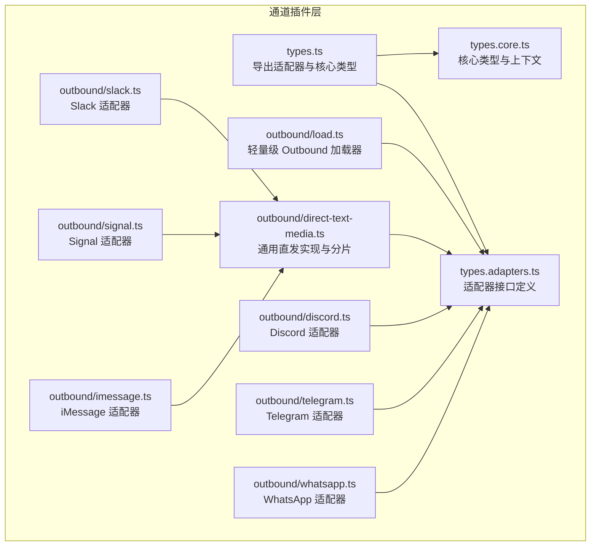
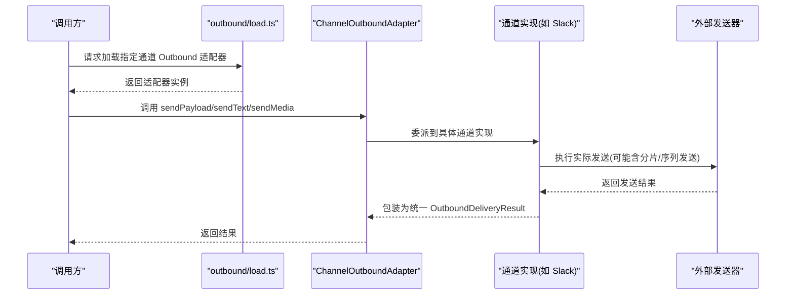
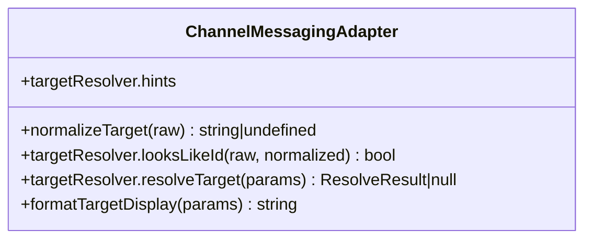
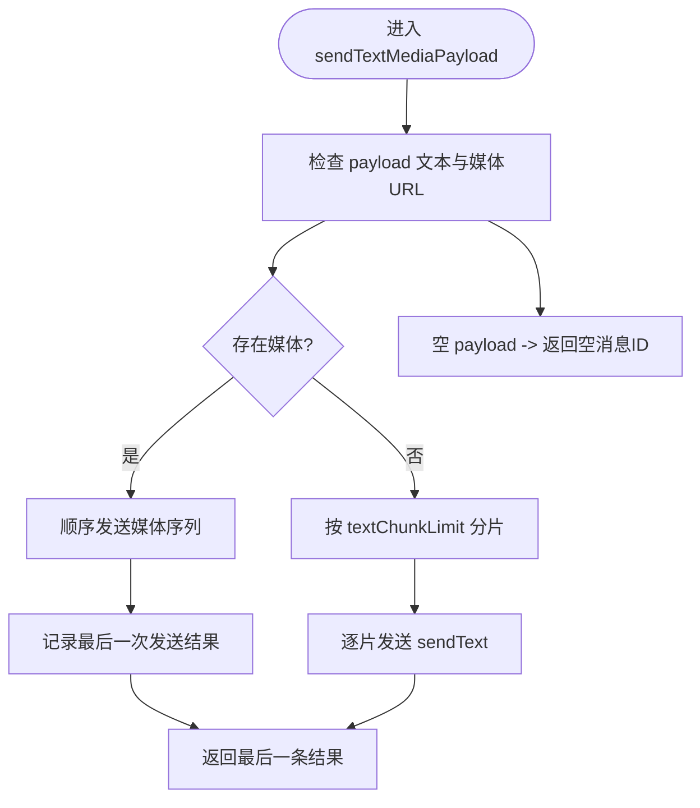
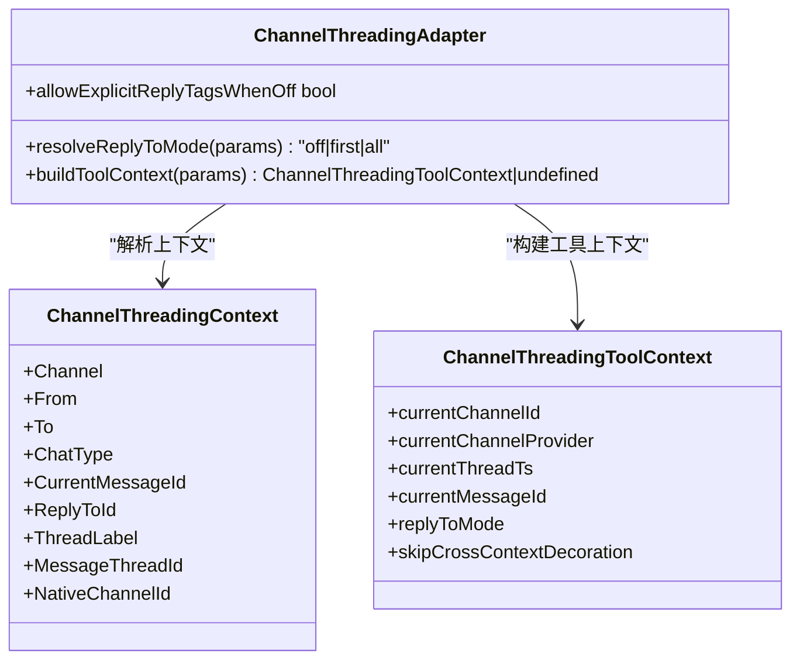
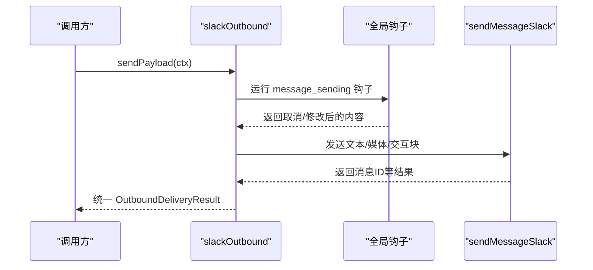
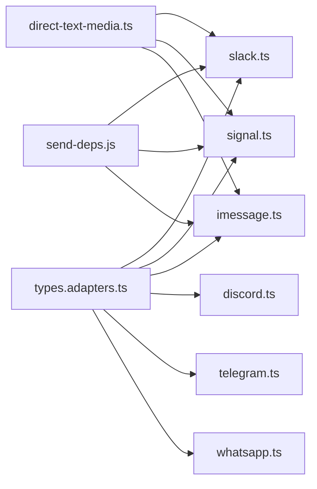

# 消息适配器

<cite>
**本文引用的文件**
- [src/channels/plugins/types.ts](file://src/channels/plugins/types.ts)
- [src/channels/plugins/types.core.ts](file://src/channels/plugins/types.core.ts)
- [src/channels/plugins/types.adapters.ts](file://src/channels/plugins/types.adapters.ts)
- [src/channels/plugins/outbound/load.ts](file://src/channels/plugins/outbound/load.ts)
- [src/channels/plugins/outbound/direct-text-media.ts](file://src/channels/plugins/outbound/direct-text-media.ts)
- [src/channels/plugins/outbound/slack.ts](file://src/channels/plugins/outbound/slack.ts)
- [src/channels/plugins/outbound/signal.ts](file://src/channels/plugins/outbound/signal.ts)
- [src/channels/plugins/outbound/imessage.ts](file://src/channels/plugins/outbound/imessage.ts)
- [src/channels/plugins/outbound/discord.ts](file://src/channels/plugins/outbound/discord.ts)
- [src/channels/plugins/outbound/telegram.ts](file://src/channels/plugins/outbound/telegram.ts)
- [src/channels/plugins/outbound/whatsapp.ts](file://src/channels/plugins/outbound/whatsapp.ts)
</cite>

## 目录
1. [简介](#简介)
2. [项目结构](#项目结构)
3. [核心组件](#核心组件)
4. [架构总览](#架构总览)
5. [详细组件分析](#详细组件分析)
6. [依赖关系分析](#依赖关系分析)
7. [性能考量](#性能考量)
8. [故障排查指南](#故障排查指南)
9. [结论](#结论)
10. [附录](#附录)

## 简介
本文件系统性梳理消息适配器体系，重点覆盖以下三类适配器：
- ChannelMessagingAdapter：消息目标解析与显示格式化能力
- ChannelOutboundAdapter：消息发送（文本、媒体、交互块、投票）与分片策略
- ChannelThreadingAdapter：线程/回复上下文解析与工具上下文构建

文档将从架构、数据流、处理逻辑、集成点、错误处理与性能特征等方面进行深入分析，并提供开发示例与最佳实践建议。

## 项目结构
消息适配器位于通道插件子系统中，核心类型与适配器接口在 types.* 文件中定义；具体通道的 Outbound 实现位于 src/channels/plugins/outbound/*；加载入口通过轻量级加载器按需引入。

图示来源
- [src/channels/plugins/types.ts:1-68](file://src/channels/plugins/types.ts#L1-L68)
- [src/channels/plugins/types.core.ts:1-410](file://src/channels/plugins/types.core.ts#L1-L410)
- [src/channels/plugins/types.adapters.ts:1-386](file://src/channels/plugins/types.adapters.ts#L1-L386)
- [src/channels/plugins/outbound/load.ts:1-17](file://src/channels/plugins/outbound/load.ts#L1-L17)
- [src/channels/plugins/outbound/direct-text-media.ts:1-194](file://src/channels/plugins/outbound/direct-text-media.ts#L1-L194)
- [src/channels/plugins/outbound/slack.ts:1-256](file://src/channels/plugins/outbound/slack.ts#L1-L256)
- [src/channels/plugins/outbound/signal.ts:1-32](file://src/channels/plugins/outbound/signal.ts#L1-L32)
- [src/channels/plugins/outbound/imessage.ts:1-36](file://src/channels/plugins/outbound/imessage.ts#L1-L36)
- [src/channels/plugins/outbound/discord.ts:1-3](file://src/channels/plugins/outbound/discord.ts#L1-L3)
- [src/channels/plugins/outbound/telegram.ts:1-2](file://src/channels/plugins/outbound/telegram.ts#L1-L2)
- [src/channels/plugins/outbound/whatsapp.ts:1-3](file://src/channels/plugins/outbound/whatsapp.ts#L1-L3)

章节来源
- [src/channels/plugins/types.ts:1-68](file://src/channels/plugins/types.ts#L1-L68)
- [src/channels/plugins/types.core.ts:1-410](file://src/channels/plugins/types.core.ts#L1-L410)
- [src/channels/plugins/types.adapters.ts:1-386](file://src/channels/plugins/types.adapters.ts#L1-L386)
- [src/channels/plugins/outbound/load.ts:1-17](file://src/channels/plugins/outbound/load.ts#L1-L17)

## 核心组件
- ChannelMessagingAdapter：负责目标规范化、目标解析、显示格式化，支撑跨通道一致的目标寻址体验。
- ChannelOutboundAdapter：统一的消息发送抽象，支持文本分片、媒体序列发送、交互块渲染、投票发送等。
- ChannelThreadingAdapter：线程/回复上下文解析与工具上下文构建，支持“关闭/首个/全部”回复模式与显式标签保留策略。

章节来源
- [src/channels/plugins/types.core.ts:240-263](file://src/channels/plugins/types.core.ts#L240-L263)
- [src/channels/plugins/types.adapters.ts:110-127](file://src/channels/plugins/types.adapters.ts#L110-L127)
- [src/channels/plugins/types.core.ts:294-317](file://src/channels/plugins/types.core.ts#L294-L317)

## 架构总览
消息适配器采用“接口定义 + 通道实现 + 轻量加载”的分层设计：
- 接口层：types.* 定义适配器契约与核心上下文
- 实现层：各通道在 outbound/* 中实现 ChannelOutboundAdapter；Messaging/Threading 在 types.core.ts 中以可选扩展形式提供
- 加载层：outbound/load.ts 提供仅包含发送能力的轻量加载器，避免导入完整插件带来的额外开销

图示来源
- [src/channels/plugins/outbound/load.ts:1-17](file://src/channels/plugins/outbound/load.ts#L1-L17)
- [src/channels/plugins/types.adapters.ts:110-127](file://src/channels/plugins/types.adapters.ts#L110-L127)
- [src/channels/plugins/outbound/slack.ts:149-255](file://src/channels/plugins/outbound/slack.ts#L149-L255)

## 详细组件分析

### ChannelMessagingAdapter 分析
职责与能力
- 目标规范化：将输入目标标准化为平台可识别 ID
- 目标解析：根据输入与偏好类型解析为最终收件人 ID、类型与展示名
- 显示格式化：将内部目标信息格式化为用户可读字符串

关键字段与行为
- normalizeTarget：标准化输入
- targetResolver.looksLikeId / resolveTarget：判定并解析目标
- formatTargetDisplay：生成展示文本

图示来源
- [src/channels/plugins/types.core.ts:294-317](file://src/channels/plugins/types.core.ts#L294-L317)

章节来源
- [src/channels/plugins/types.core.ts:294-317](file://src/channels/plugins/types.core.ts#L294-L317)

### ChannelOutboundAdapter 分析
职责与能力
- 发送模式：direct/gateway/hybrid
- 文本分片：chunker + textChunkLimit 控制分片策略
- 多媒体发送：sendPayload 统一封装文本+媒体序列发送
- 交互块与投票：Slack 等通道可渲染交互块与发送投票
- 目标解析：resolveTarget 支持显式/隐式/心跳模式

通用直发与分片流程
- sendTextMediaPayload：根据 payload 决定先发媒体序列再发文本，或直接分片发送文本
- sendPayloadMediaSequence：顺序发送多个媒体，首条可带文本，其余仅媒体
- createDirectTextMediaOutbound：封装通用直发模板，统一 maxBytes 解析与选项构建

图示来源
- [src/channels/plugins/outbound/direct-text-media.ts:61-91](file://src/channels/plugins/outbound/direct-text-media.ts#L61-L91)

章节来源
- [src/channels/plugins/types.adapters.ts:110-127](file://src/channels/plugins/types.adapters.ts#L110-L127)
- [src/channels/plugins/outbound/direct-text-media.ts:1-194](file://src/channels/plugins/outbound/direct-text-media.ts#L1-L194)

### ChannelThreadingAdapter 分析
职责与能力
- 回复模式解析：支持 off/first/all 三种模式，以及显式标签保留策略
- 工具上下文构建：为工具调用构建当前线程、消息 ID、回复模式等上下文
- 跨上下文装饰控制：支持跳过跨上下文前缀装饰，用于直接组合新消息而非转发

图示来源
- [src/channels/plugins/types.core.ts:240-292](file://src/channels/plugins/types.core.ts#L240-L292)

章节来源
- [src/channels/plugins/types.core.ts:240-292](file://src/channels/plugins/types.core.ts#L240-L292)

### 具体通道适配器实现

#### Slack 适配器
- 发送模式：direct
- 文本限制：textChunkLimit=4000
- 交互块：支持构建与合并，最大块数限制
- 钩子：全局 message_sending 钩子可取消或修改内容
- 线程：优先使用 replyToId，否则回退到 threadId

图示来源
- [src/channels/plugins/outbound/slack.ts:47-122](file://src/channels/plugins/outbound/slack.ts#L47-L122)
- [src/channels/plugins/outbound/slack.ts:149-255](file://src/channels/plugins/outbound/slack.ts#L149-L255)

章节来源
- [src/channels/plugins/outbound/slack.ts:1-256](file://src/channels/plugins/outbound/slack.ts#L1-L256)

#### Signal/iMessage 适配器
- 通过 createDirectTextMediaOutbound 快速生成适配器
- 统一解析媒体大小限制与发送选项
- 支持 replyToId 透传

章节来源
- [src/channels/plugins/outbound/signal.ts:1-32](file://src/channels/plugins/outbound/signal.ts#L1-L32)
- [src/channels/plugins/outbound/imessage.ts:1-36](file://src/channels/plugins/outbound/imessage.ts#L1-L36)
- [src/channels/plugins/outbound/direct-text-media.ts:116-194](file://src/channels/plugins/outbound/direct-text-media.ts#L116-L194)

#### Discord/Telegram/WhatsApp 适配器
- 采用 shim 重导出扩展实现，保持与内置适配器接口一致
- 便于在扩展生态中独立维护与演进

章节来源
- [src/channels/plugins/outbound/discord.ts:1-3](file://src/channels/plugins/outbound/discord.ts#L1-L3)
- [src/channels/plugins/outbound/telegram.ts:1-2](file://src/channels/plugins/outbound/telegram.ts#L1-L2)
- [src/channels/plugins/outbound/whatsapp.ts:1-3](file://src/channels/plugins/outbound/whatsapp.ts#L1-L3)

## 依赖关系分析
- 类型耦合：所有适配器均依赖 types.adapters.ts 中的接口定义与 types.core.ts 中的核心上下文
- 运行时依赖：Outbound 发送依赖 send-deps 解析具体发送器实现
- 通道特定：Slack 独立实现交互块与钩子；Signal/iMessage 使用通用直发模板

图示来源
- [src/channels/plugins/types.adapters.ts:1-386](file://src/channels/plugins/types.adapters.ts#L1-L386)
- [src/channels/plugins/outbound/slack.ts:1-256](file://src/channels/plugins/outbound/slack.ts#L1-L256)
- [src/channels/plugins/outbound/signal.ts:1-32](file://src/channels/plugins/outbound/signal.ts#L1-L32)
- [src/channels/plugins/outbound/imessage.ts:1-36](file://src/channels/plugins/outbound/imessage.ts#L1-L36)
- [src/channels/plugins/outbound/direct-text-media.ts:1-194](file://src/channels/plugins/outbound/direct-text-media.ts#L1-L194)

章节来源
- [src/channels/plugins/types.adapters.ts:1-386](file://src/channels/plugins/types.adapters.ts#L1-L386)
- [src/channels/plugins/outbound/direct-text-media.ts:1-194](file://src/channels/plugins/outbound/direct-text-media.ts#L1-L194)

## 性能考量
- 分片策略：textChunkLimit 控制单次发送长度，减少平台限制与失败重试成本
- 媒体序列：sendPayloadMediaSequence 顺序发送媒体，避免一次性超大负载
- 媒体上限：createScopedChannelMediaMaxBytesResolver 从配置解析媒体上限，防止超限
- 钩子开销：全局钩子可能增加延迟，应谨慎使用且避免阻塞操作

## 故障排查指南
- 发送被钩子取消：检查全局 message_sending 钩子是否误判或过度修改内容
- 媒体发送失败：确认媒体 URL 可访问、大小未超过通道限制
- 文本分片异常：核对 chunker 与 textChunkLimit 设置，确保平台兼容
- 线程回复错位：确认 replyToId 与 threadId 传递正确，避免混用导致回复位置错误

## 结论
消息适配器体系通过清晰的接口定义与通用实现模板，实现了跨通道的一致发送体验。ChannelMessagingAdapter 与 ChannelThreadingAdapter 提供了目标解析与线程上下文能力，ChannelOutboundAdapter 则统一了发送流程与分片策略。借助轻量加载器与扩展生态，系统在可维护性与可扩展性之间取得良好平衡。

## 附录

### 开发示例与最佳实践
- 新增通道 Outbound 适配器
  - 若为直发通道，优先使用 createDirectTextMediaOutbound 快速生成适配器骨架
  - 如需交互块/投票等高级能力，参考 Slack 实现，按需扩展
  - 合理设置 textChunkLimit 与媒体上限，结合平台文档校验
- 目标解析与显示
  - 在 ChannelMessagingAdapter 中提供 normalizeTarget 与 resolveTarget，保证跨通道一致性
  - formatTargetDisplay 应考虑平台差异，提供可读性强的展示
- 线程与回复
  - 使用 ChannelThreadingAdapter 的 resolveReplyToMode 与工具上下文，确保工具调用与转发场景的语义正确
- 错误处理
  - 对外统一返回 OutboundDeliveryResult，便于上层聚合与统计
  - 对于可重试场景，结合平台返回码与网络状况进行指数退避