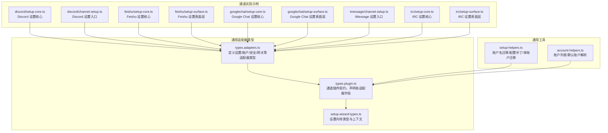
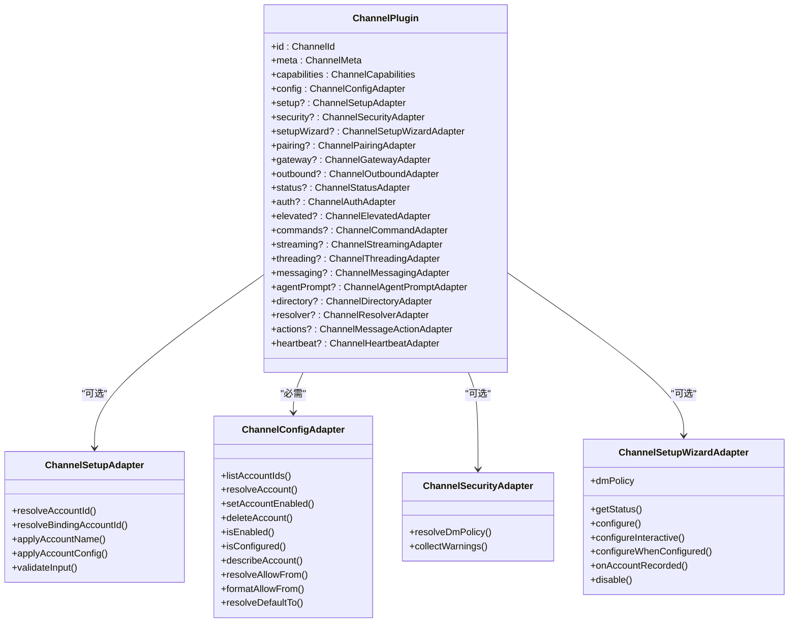
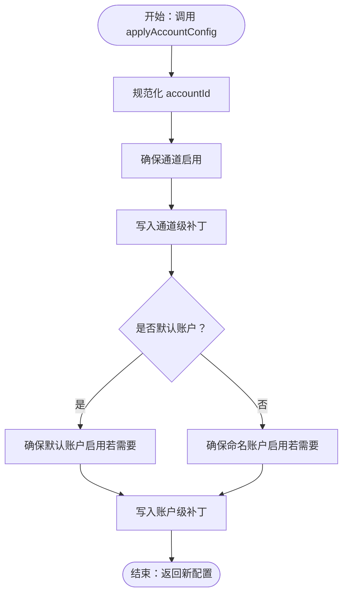
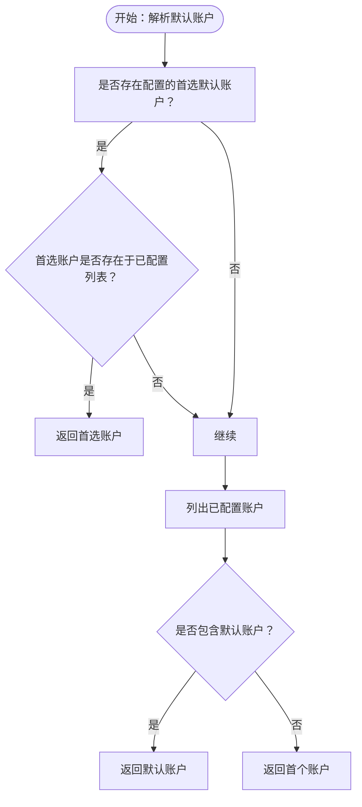
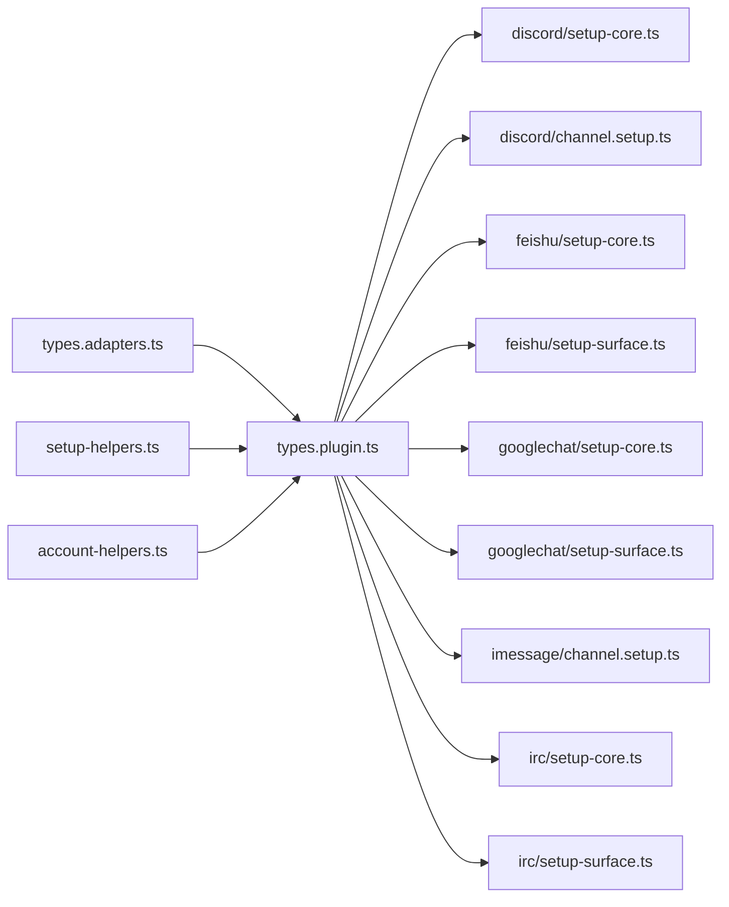

# 设置适配器

<cite>
**本文引用的文件**
- [src/channels/plugins/types.adapters.ts](file://src/channels/plugins/types.adapters.ts)
- [src/channels/plugins/types.plugin.ts](file://src/channels/plugins/types.plugin.ts)
- [src/channels/plugins/setup-helpers.ts](file://src/channels/plugins/setup-helpers.ts)
- [src/channels/plugins/account-helpers.ts](file://src/channels/plugins/account-helpers.ts)
- [src/channels/plugins/setup-wizard-types.ts](file://src/channels/plugins/setup-wizard-types.ts)
- [extensions/discord/src/setup-core.ts](file://extensions/discord/src/setup-core.ts)
- [extensions/discord/src/channel.setup.ts](file://extensions/discord/src/channel.setup.ts)
- [extensions/feishu/src/setup-core.ts](file://extensions/feishu/src/setup-core.ts)
- [extensions/feishu/src/setup-surface.ts](file://extensions/feishu/src/setup-surface.ts)
- [extensions/googlechat/src/setup-core.ts](file://extensions/googlechat/src/setup-core.ts)
- [extensions/googlechat/src/setup-surface.ts](file://extensions/googlechat/src/setup-surface.ts)
- [extensions/imessage/src/channel.setup.ts](file://extensions/imessage/src/channel.setup.ts)
- [extensions/irc/src/setup-core.ts](file://extensions/irc/src/setup-core.ts)
- [extensions/irc/src/setup-surface.ts](file://extensions/irc/src/setup-surface.ts)
</cite>

## 目录
1. [简介](#简介)
2. [项目结构](#项目结构)
3. [核心组件](#核心组件)
4. [架构总览](#架构总览)
5. [详细组件分析](#详细组件分析)
6. [依赖关系分析](#依赖关系分析)
7. [性能考量](#性能考量)
8. [故障排查指南](#故障排查指南)
9. [结论](#结论)
10. [附录](#附录)

## 简介
本文件系统性梳理与设置适配器相关的架构与实现，重点覆盖以下方面：
- 设置适配器（ChannelSetupAdapter）：负责账户 ID 解析、绑定账户解析、账户名称应用、账户配置应用与输入校验。
- 账户适配器（ChannelAccountAdapter）：负责账户列表、默认账户解析、账户启用/禁用、配置状态检查、允许来源与默认发送目标解析等。
- 安全适配器（ChannelSecurityAdapter）：负责私信策略（DM Policy）解析与安全警告收集。
- 配置向导（ChannelSetupWizardAdapter）：负责通道设置状态查询、交互式配置、DM 策略提示与账户记录回调。
- 权限与配对（ChannelPairingAdapter）：负责允许来源条目标准化与审批通知。
- 关键工具函数：账户名迁移、作用域账户配置补丁、单账户到多账户迁移等。

文档同时提供设置流程的开发示例与配置验证方法，并包含 OAuth 流程、账户绑定、权限验证等核心功能的实现细节说明。

## 项目结构
设置适配器相关的核心类型与插件契约位于通道插件适配器定义文件中；具体通道（如 Discord、Feishu、Google Chat、iMessage、IRC）在各自扩展目录下提供设置核心逻辑与表面层逻辑。账户与配置辅助工具位于通用工具模块中。

图表来源
- [src/channels/plugins/types.adapters.ts:24-81](file://src/channels/plugins/types.adapters.ts#L24-L81)
- [src/channels/plugins/types.plugin.ts:49-84](file://src/channels/plugins/types.plugin.ts#L49-L84)
- [src/channels/plugins/setup-wizard-types.ts:93-106](file://src/channels/plugins/setup-wizard-types.ts#L93-L106)
- [src/channels/plugins/setup-helpers.ts:123-198](file://src/channels/plugins/setup-helpers.ts#L123-L198)
- [src/channels/plugins/account-helpers.ts:8-62](file://src/channels/plugins/account-helpers.ts#L8-L62)
- [extensions/discord/src/setup-core.ts](file://extensions/discord/src/setup-core.ts)
- [extensions/discord/src/channel.setup.ts](file://extensions/discord/src/channel.setup.ts)
- [extensions/feishu/src/setup-core.ts](file://extensions/feishu/src/setup-core.ts)
- [extensions/feishu/src/setup-surface.ts](file://extensions/feishu/src/setup-surface.ts)
- [extensions/googlechat/src/setup-core.ts](file://extensions/googlechat/src/setup-core.ts)
- [extensions/googlechat/src/setup-surface.ts](file://extensions/googlechat/src/setup-surface.ts)
- [extensions/imessage/src/channel.setup.ts](file://extensions/imessage/src/channel.setup.ts)
- [extensions/irc/src/setup-core.ts](file://extensions/irc/src/setup-core.ts)
- [extensions/irc/src/setup-surface.ts](file://extensions/irc/src/setup-surface.ts)

章节来源
- [src/channels/plugins/types.adapters.ts:24-81](file://src/channels/plugins/types.adapters.ts#L24-L81)
- [src/channels/plugins/types.plugin.ts:49-84](file://src/channels/plugins/types.plugin.ts#L49-L84)
- [src/channels/plugins/setup-wizard-types.ts:93-106](file://src/channels/plugins/setup-wizard-types.ts#L93-L106)
- [src/channels/plugins/setup-helpers.ts:123-198](file://src/channels/plugins/setup-helpers.ts#L123-L198)
- [src/channels/plugins/account-helpers.ts:8-62](file://src/channels/plugins/account-helpers.ts#L8-L62)

## 核心组件
本节聚焦三类适配器及其职责边界与关键方法。

- 设置适配器（ChannelSetupAdapter）
  - 负责：解析账户 ID、解析绑定账户、应用账户名称、应用账户配置、可选输入校验。
  - 关键方法路径：[applyAccountConfig:40-44](file://src/channels/plugins/types.adapters.ts#L40-L44)，[resolveAccountId:25-29](file://src/channels/plugins/types.adapters.ts#L25-L29)，[resolveBindingAccountId:30-34](file://src/channels/plugins/types.adapters.ts#L30-L34)，[applyAccountName:35-39](file://src/channels/plugins/types.adapters.ts#L35-L39)，[validateInput:45-49](file://src/channels/plugins/types.adapters.ts#L45-L49)。

- 账户适配器（ChannelConfigAdapter）
  - 负责：列出账户、解析账户、默认账户、启用/禁用账户、删除账户、检查配置状态、描述账户快照、解析允许来源/格式化允许来源、解析默认发送目标。
  - 关键方法路径：[listAccountIds:53-53](file://src/channels/plugins/types.adapters.ts#L53-L53)，[resolveAccount:54-54](file://src/channels/plugins/types.adapters.ts#L54-L54)，[isEnabled:63-63](file://src/channels/plugins/types.adapters.ts#L63-L63)，[isConfigured:65-65](file://src/channels/plugins/types.adapters.ts#L65-L65)，[describeAccount:67-67](file://src/channels/plugins/types.adapters.ts#L67-L67)，[resolveAllowFrom:68-71](file://src/channels/plugins/types.adapters.ts#L68-L71)，[formatAllowFrom:72-76](file://src/channels/plugins/types.adapters.ts#L72-L76)，[resolveDefaultTo:77-80](file://src/channels/plugins/types.adapters.ts#L77-L80)。

- 安全适配器（ChannelSecurityAdapter）
  - 负责：解析 DM 策略、收集安全警告。
  - 关键方法路径：[resolveDmPolicy:381-383](file://src/channels/plugins/types.adapters.ts#L381-L383)，[collectWarnings:384-384](file://src/channels/plugins/types.adapters.ts#L384-L384)。

- 设置向导适配器（ChannelSetupWizardAdapter）
  - 负责：获取通道设置状态、执行配置、交互式配置、当已配置时的再次配置、DM 策略、账户记录回调、禁用通道。
  - 关键方法路径：[getStatus:95-95](file://src/channels/plugins/setup-wizard-types.ts#L95-L95)，[configure:96-96](file://src/channels/plugins/setup-wizard-types.ts#L96-L96)，[configureInteractive:97-102](file://src/channels/plugins/setup-wizard-types.ts#L97-L102)，[dmPolicy:103-103](file://src/channels/plugins/setup-wizard-types.ts#L103-L103)，[onAccountRecorded:104-104](file://src/channels/plugins/setup-wizard-types.ts#L104-L104)，[disable:105-105](file://src/channels/plugins/setup-wizard-types.ts#L105-L105)。

章节来源
- [src/channels/plugins/types.adapters.ts:24-81](file://src/channels/plugins/types.adapters.ts#L24-L81)
- [src/channels/plugins/types.adapters.ts:380-385](file://src/channels/plugins/types.adapters.ts#L380-L385)
- [src/channels/plugins/setup-wizard-types.ts:93-106](file://src/channels/plugins/setup-wizard-types.ts#L93-L106)

## 架构总览
设置适配器在通道插件契约中被声明为可选字段，通道插件通过实现这些适配器完成账户生命周期管理、安全策略落地与设置向导集成。

图表来源
- [src/channels/plugins/types.plugin.ts:49-84](file://src/channels/plugins/types.plugin.ts#L49-L84)
- [src/channels/plugins/types.adapters.ts:24-81](file://src/channels/plugins/types.adapters.ts#L24-L81)
- [src/channels/plugins/types.adapters.ts:380-385](file://src/channels/plugins/types.adapters.ts#L380-L385)
- [src/channels/plugins/setup-wizard-types.ts:93-106](file://src/channels/plugins/setup-wizard-types.ts#L93-L106)

## 详细组件分析

### 设置适配器（ChannelSetupAdapter）
- 职责边界
  - 账户 ID 解析：根据配置与输入解析最终使用的账户 ID。
  - 绑定账户解析：在会话绑定场景下解析目标账户 ID。
  - 应用账户名称：将用户提供的名称写入配置（按通道与账户维度）。
  - 应用账户配置：将用户输入合并到配置中，确保通道与账户启用。
  - 输入校验：对输入进行可选校验并返回错误信息。
- 关键流程
  - 账户配置应用流程（applyAccountConfig）会确保通道与账户处于启用状态，并将补丁写入对应作用域。
  - 账户名称应用流程（applyAccountName）支持“始终使用 accounts”与默认账户迁移两种策略。
  - 单账户通道迁移至多账户（moveSingleAccountChannelSectionToDefaultAccount）会将顶层账户键迁移到 accounts.default，避免重复值。

图表来源
- [src/channels/plugins/types.adapters.ts:40-44](file://src/channels/plugins/types.adapters.ts#L40-L44)
- [src/channels/plugins/setup-helpers.ts:137-198](file://src/channels/plugins/setup-helpers.ts#L137-L198)

章节来源
- [src/channels/plugins/types.adapters.ts:24-50](file://src/channels/plugins/types.adapters.ts#L24-L50)
- [src/channels/plugins/setup-helpers.ts:123-198](file://src/channels/plugins/setup-helpers.ts#L123-L198)

### 账户适配器（ChannelConfigAdapter）
- 职责边界
  - 列出账户：从配置中提取所有已配置账户 ID。
  - 默认账户解析：优先使用配置中的首选默认账户，否则回退到默认账户或首个账户。
  - 启用/禁用与删除：控制账户可用性与生命周期。
  - 配置状态：判断账户是否已配置、未配置原因。
  - 描述账户：生成账户快照用于状态展示。
  - 允许来源与默认发送目标：解析允许来源集合、格式化输出、解析默认发送目标。
- 关键流程
  - 账户列表与默认账户解析由账户助手模块提供，支持规范化与排序。
  - 允许来源解析与格式化用于权限控制与 UI 展示。

图表来源
- [src/channels/plugins/account-helpers.ts:12-59](file://src/channels/plugins/account-helpers.ts#L12-L59)

章节来源
- [src/channels/plugins/types.adapters.ts:52-81](file://src/channels/plugins/types.adapters.ts#L52-L81)
- [src/channels/plugins/account-helpers.ts:8-62](file://src/channels/plugins/account-helpers.ts#L8-L62)

### 安全适配器（ChannelSecurityAdapter）
- 职责边界
  - 解析 DM 策略：根据上下文决定私信访问策略（允许/拒绝/仅联系人等）。
  - 收集安全警告：汇总潜在风险项供 UI 或 CLI 提示。
- 关键流程
  - 在通道安全上下文中调用 resolveDmPolicy 获取策略对象。
  - collectWarnings 返回字符串数组，便于统一展示。

章节来源
- [src/channels/plugins/types.adapters.ts:380-385](file://src/channels/plugins/types.adapters.ts#L380-L385)

### 设置向导适配器（ChannelSetupWizardAdapter）
- 职责边界
  - 获取状态：返回通道是否已配置及状态行。
  - 执行配置：根据用户输入与上下文生成最终配置。
  - 交互式配置：在已配置情况下提供再次配置能力。
  - DM 策略：提供策略标签、键名、当前策略读取与设置、允许来源提示。
  - 账户记录回调：在记录账户后触发回调。
  - 禁用通道：将通道整体关闭。
- 关键流程
  - getStatus 与 configure 为核心入口，配合 SetupChannelsOptions 控制行为。
  - dmPolicy 可选地提供允许来源提示以完善权限配置。

章节来源
- [src/channels/plugins/setup-wizard-types.ts:93-106](file://src/channels/plugins/setup-wizard-types.ts#L93-L106)

### 权限与配对（ChannelPairingAdapter）
- 职责边界
  - idLabel：标识符标签，用于 UI 显示。
  - 标准化允许来源条目：将输入归一化为统一格式。
  - 审批通知：在需要时通知审批流程。

章节来源
- [src/channels/plugins/types.adapters.ts:267-275](file://src/channels/plugins/types.adapters.ts#L267-L275)

### 开发示例与配置验证方法
- 示例：Discord 设置
  - 核心逻辑入口：[extensions/discord/src/setup-core.ts](file://extensions/discord/src/setup-core.ts)
  - 通道设置入口：[extensions/discord/src/channel.setup.ts](file://extensions/discord/src/channel.setup.ts)
- 示例：Feishu 设置
  - 核心逻辑入口：[extensions/feishu/src/setup-core.ts](file://extensions/feishu/src/setup-core.ts)
  - 表面层设置：[extensions/feishu/src/setup-surface.ts](file://extensions/feishu/src/setup-surface.ts)
- 示例：Google Chat 设置
  - 核心逻辑入口：[extensions/googlechat/src/setup-core.ts](file://extensions/googlechat/src/setup-core.ts)
  - 表面层设置：[extensions/googlechat/src/setup-surface.ts](file://extensions/googlechat/src/setup-surface.ts)
- 示例：iMessage 设置
  - 通道设置入口：[extensions/imessage/src/channel.setup.ts](file://extensions/imessage/src/channel.setup.ts)
- 示例：IRC 设置
  - 核心逻辑入口：[extensions/irc/src/setup-core.ts](file://extensions/irc/src/setup-core.ts)
  - 表面层设置：[extensions/irc/src/setup-surface.ts](file://extensions/irc/src/setup-surface.ts)

章节来源
- [extensions/discord/src/setup-core.ts](file://extensions/discord/src/setup-core.ts)
- [extensions/discord/src/channel.setup.ts](file://extensions/discord/src/channel.setup.ts)
- [extensions/feishu/src/setup-core.ts](file://extensions/feishu/src/setup-core.ts)
- [extensions/feishu/src/setup-surface.ts](file://extensions/feishu/src/setup-surface.ts)
- [extensions/googlechat/src/setup-core.ts](file://extensions/googlechat/src/setup-core.ts)
- [extensions/googlechat/src/setup-surface.ts](file://extensions/googlechat/src/setup-surface.ts)
- [extensions/imessage/src/channel.setup.ts](file://extensions/imessage/src/channel.setup.ts)
- [extensions/irc/src/setup-core.ts](file://extensions/irc/src/setup-core.ts)
- [extensions/irc/src/setup-surface.ts](file://extensions/irc/src/setup-surface.ts)

### OAuth 流程、账户绑定与权限验证
- OAuth 流程
  - 通道通常通过 ChannelAuthAdapter.login 触发登录流程（例如令牌获取、回调处理），随后可结合 ChannelSetupAdapter.applyAccountConfig 将凭据写入配置。
  - 登录成功后，可通过 ChannelGatewayAdapter 提供的 QR 登录接口进行二次认证（loginWithQrStart/loginWithQrWait）。
- 账户绑定
  - 使用 ChannelSetupAdapter.resolveBindingAccountId 解析绑定场景下的目标账户。
  - 结合 SessionBindingService（会话绑定服务）与 SessionBindingAdapter，实现会话与账户的绑定/解绑与放置策略（current/child）。
- 权限验证
  - 通过 ChannelPairingAdapter.normalizeAllowEntry 标准化允许来源条目。
  - 通过 ChannelSecurityAdapter.resolveDmPolicy 决策私信策略，结合 ChannelConfigAdapter.resolveAllowFrom/formatAllowFrom 进行来源解析与格式化。

章节来源
- [src/channels/plugins/types.adapters.ts:293-301](file://src/channels/plugins/types.adapters.ts#L293-L301)
- [src/channels/plugins/types.adapters.ts:277-291](file://src/channels/plugins/types.adapters.ts#L277-L291)
- [src/channels/plugins/types.adapters.ts:267-275](file://src/channels/plugins/types.adapters.ts#L267-L275)
- [src/channels/plugins/types.adapters.ts:380-385](file://src/channels/plugins/types.adapters.ts#L380-L385)
- [src/infra/outbound/session-binding-service.ts:113-146](file://src/infra/outbound/session-binding-service.ts#L113-L146)

## 依赖关系分析
- 适配器类型与插件契约
  - ChannelPlugin 声明 setup、config、security、setupWizard、pairing、gateway 等适配器字段，形成统一扩展点。
- 工具函数与适配器协作
  - setup-helpers 提供配置补丁与账户名迁移，与 ChannelSetupAdapter 的 applyAccountConfig/applyAccountName 协作。
  - account-helpers 提供账户列表与默认账户解析，与 ChannelConfigAdapter 的 listAccountIds/resolveDefaultAccountId 协作。
- 通道实现与适配器
  - 各通道扩展在 setup-core 与 setup-surface 中实现具体设置逻辑，并遵循适配器契约。

图表来源
- [src/channels/plugins/types.adapters.ts:24-81](file://src/channels/plugins/types.adapters.ts#L24-L81)
- [src/channels/plugins/types.plugin.ts:49-84](file://src/channels/plugins/types.plugin.ts#L49-L84)
- [src/channels/plugins/setup-helpers.ts:123-198](file://src/channels/plugins/setup-helpers.ts#L123-L198)
- [src/channels/plugins/account-helpers.ts:8-62](file://src/channels/plugins/account-helpers.ts#L8-L62)
- [extensions/discord/src/setup-core.ts](file://extensions/discord/src/setup-core.ts)
- [extensions/discord/src/channel.setup.ts](file://extensions/discord/src/channel.setup.ts)
- [extensions/feishu/src/setup-core.ts](file://extensions/feishu/src/setup-core.ts)
- [extensions/feishu/src/setup-surface.ts](file://extensions/feishu/src/setup-surface.ts)
- [extensions/googlechat/src/setup-core.ts](file://extensions/googlechat/src/setup-core.ts)
- [extensions/googlechat/src/setup-surface.ts](file://extensions/googlechat/src/setup-surface.ts)
- [extensions/imessage/src/channel.setup.ts](file://extensions/imessage/src/channel.setup.ts)
- [extensions/irc/src/setup-core.ts](file://extensions/irc/src/setup-core.ts)
- [extensions/irc/src/setup-surface.ts](file://extensions/irc/src/setup-surface.ts)

章节来源
- [src/channels/plugins/types.adapters.ts:24-81](file://src/channels/plugins/types.adapters.ts#L24-L81)
- [src/channels/plugins/types.plugin.ts:49-84](file://src/channels/plugins/types.plugin.ts#L49-L84)
- [src/channels/plugins/setup-helpers.ts:123-198](file://src/channels/plugins/setup-helpers.ts#L123-L198)
- [src/channels/plugins/account-helpers.ts:8-62](file://src/channels/plugins/account-helpers.ts#L8-L62)

## 性能考量
- 配置写入与补丁应用
  - applyAccountConfig 与 patchScopedAccountConfig 采用浅拷贝与选择性写入，避免不必要的深拷贝开销。
- 账户列表与默认账户解析
  - 账户列表在无配置时回退到默认账户，减少分支判断成本；排序在必要时进行，避免频繁排序。
- 允许来源解析
  - resolveAllowFrom 与 formatAllowFrom 仅在需要时执行，避免在未启用权限控制的通道上产生额外计算。

## 故障排查指南
- 配置未生效
  - 检查 applyAccountConfig 是否正确调用并传入正确的 accountId 与补丁。
  - 确认 ensureChannelEnabled/ensureAccountEnabled 选项是否符合预期。
- 默认账户不正确
  - 检查 resolveDefaultAccountId 的首选账户解析逻辑，确认 defaultAccount 配置与已配置账户列表一致。
- 单账户通道迁移问题
  - 使用 moveSingleAccountChannelSectionToDefaultAccount 将顶层键迁移到 accounts.default，避免重复值。
- 安全策略异常
  - 检查 resolveDmPolicy 返回值与 collectWarnings 输出，确认策略键与允许来源键一致。
- 权限来源不匹配
  - 使用 normalizeAllowEntry 标准化输入，结合 formatAllowFrom 输出统一格式，核对 UI 展示与实际解析结果。

章节来源
- [src/channels/plugins/setup-helpers.ts:123-198](file://src/channels/plugins/setup-helpers.ts#L123-L198)
- [src/channels/plugins/account-helpers.ts:12-59](file://src/channels/plugins/account-helpers.ts#L12-L59)
- [src/channels/plugins/types.adapters.ts:380-385](file://src/channels/plugins/types.adapters.ts#L380-L385)
- [src/channels/plugins/types.adapters.ts:267-275](file://src/channels/plugins/types.adapters.ts#L267-L275)

## 结论
设置适配器体系通过统一的适配器契约与工具函数，实现了跨通道的一致性账户管理、安全策略与设置向导体验。开发者只需在通道扩展中实现相应适配器方法，即可获得完整的配置应用、权限控制与安全告警能力。建议在实现时遵循以下原则：
- 明确区分通道级与账户级配置的作用域。
- 在应用配置前进行必要的输入校验与来源标准化。
- 通过设置向导适配器提供清晰的状态反馈与交互式配置入口。
- 在安全策略层面保持最小权限原则，并提供可审计的警告收集机制。

## 附录
- 相关类型与上下文
  - 通道插件契约：[ChannelPlugin:49-84](file://src/channels/plugins/types.plugin.ts#L49-L84)
  - 设置向导上下文：[ChannelSetupConfigureContext:57-65](file://src/channels/plugins/setup-wizard-types.ts#L57-L65)
  - 会话绑定上下文：[ChannelGatewayContext:170-241](file://src/channels/plugins/types.adapters.ts#L170-L241)