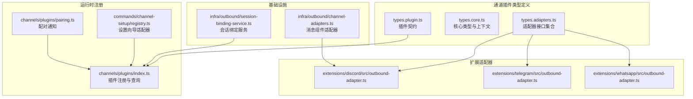
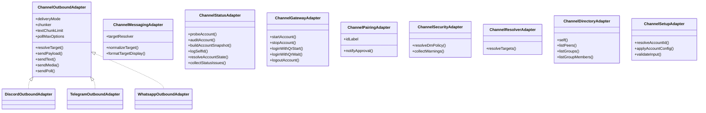
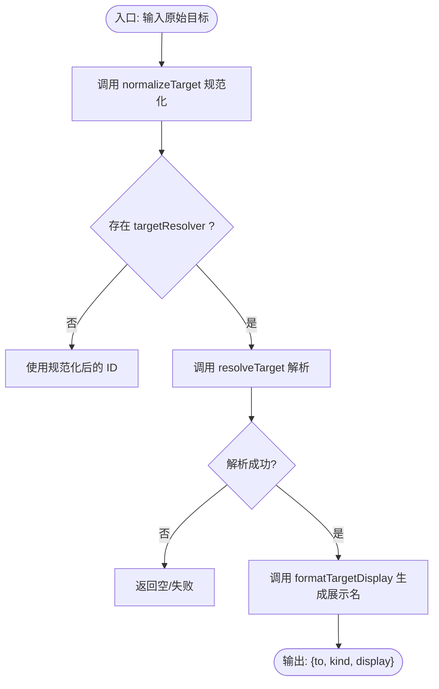
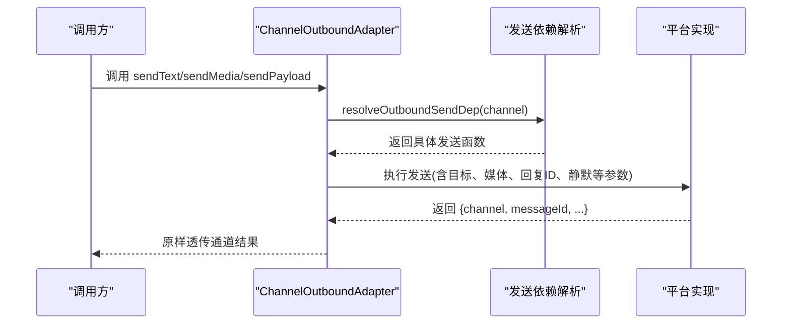
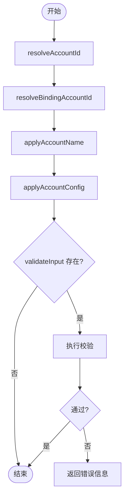
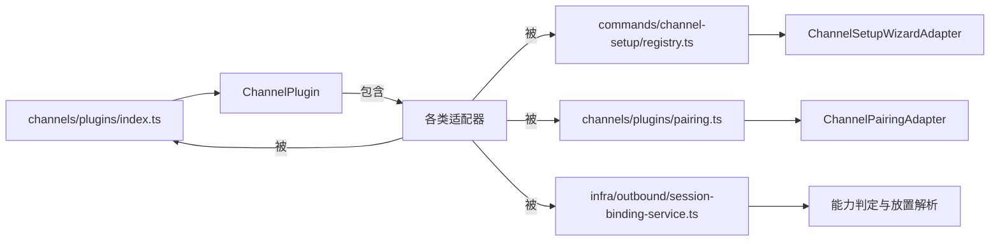

# 通道适配器

<cite>
**本文引用的文件**
- [src/channels/plugins/types.adapters.ts](file://src/channels/plugins/types.adapters.ts)
- [src/channels/plugins/types.core.ts](file://src/channels/plugins/types.core.ts)
- [src/channels/plugins/types.plugin.ts](file://src/channels/plugins/types.plugin.ts)
- [src/infra/outbound/channel-adapters.ts](file://src/infra/outbound/channel-adapters.ts)
- [extensions/discord/src/outbound-adapter.ts](file://extensions/discord/src/outbound-adapter.ts)
- [extensions/telegram/src/outbound-adapter.ts](file://extensions/telegram/src/outbound-adapter.ts)
- [extensions/whatsapp/src/outbound-adapter.ts](file://extensions/whatsapp/src/outbound-adapter.ts)
- [src/channels/plugins/index.ts](file://src/channels/plugins/index.ts)
- [src/commands/channel-setup/registry.ts](file://src/commands/channel-setup/registry.ts)
- [src/channels/plugins/pairing.ts](file://src/channels/plugins/pairing.ts)
- [src/infra/outbound/session-binding-service.ts](file://src/infra/outbound/session-binding-service.ts)
</cite>

## 目录
1. [简介](#简介)
2. [项目结构](#项目结构)
3. [核心组件](#核心组件)
4. [架构总览](#架构总览)
5. [详细组件分析](#详细组件分析)
6. [依赖关系分析](#依赖关系分析)
7. [性能考量](#性能考量)
8. [故障排查指南](#故障排查指南)
9. [结论](#结论)
10. [附录](#附录)

## 简介
本文件系统性梳理 OpenClaw 的“通道适配器”体系，覆盖适配器接口设计、实现模式与要求、生命周期管理与错误处理策略，并提供多平台（Discord、Telegram、WhatsApp）适配器的开发指南与参考路径。读者可据此为新即时通讯平台扩展适配器，或在现有适配器基础上进行定制与优化。

## 项目结构
通道适配器围绕“插件化通道”模型组织，核心类型定义位于通道插件类型模块，具体适配器实现分布于各扩展目录中；消息发送与跨上下文组件由基础设施层统一支撑。

**图表来源**
- [src/channels/plugins/types.adapters.ts:24-386](file://src/channels/plugins/types.adapters.ts#L24-L386)
- [src/channels/plugins/types.core.ts:12-410](file://src/channels/plugins/types.core.ts#L12-L410)
- [src/channels/plugins/types.plugin.ts:49-84](file://src/channels/plugins/types.plugin.ts#L49-L84)
- [src/infra/outbound/channel-adapters.ts:15-57](file://src/infra/outbound/channel-adapters.ts#L15-L57)
- [src/infra/outbound/session-binding-service.ts:113-146](file://src/infra/outbound/session-binding-service.ts#L113-L146)
- [extensions/discord/src/outbound-adapter.ts:86-223](file://extensions/discord/src/outbound-adapter.ts#L86-L223)
- [extensions/telegram/src/outbound-adapter.ts:98-174](file://extensions/telegram/src/outbound-adapter.ts#L98-L174)
- [extensions/whatsapp/src/outbound-adapter.ts:13-77](file://extensions/whatsapp/src/outbound-adapter.ts#L13-L77)
- [src/channels/plugins/index.ts:74-90](file://src/channels/plugins/index.ts#L74-L90)
- [src/commands/channel-setup/registry.ts:9-47](file://src/commands/channel-setup/registry.ts#L9-L47)
- [src/channels/plugins/pairing.ts:51-69](file://src/channels/plugins/pairing.ts#L51-L69)

**章节来源**
- [src/channels/plugins/types.adapters.ts:24-386](file://src/channels/plugins/types.adapters.ts#L24-L386)
- [src/channels/plugins/types.core.ts:12-410](file://src/channels/plugins/types.core.ts#L12-L410)
- [src/channels/plugins/types.plugin.ts:49-84](file://src/channels/plugins/types.plugin.ts#L49-L84)
- [src/infra/outbound/channel-adapters.ts:15-57](file://src/infra/outbound/channel-adapters.ts#L15-L57)
- [src/infra/outbound/session-binding-service.ts:113-146](file://src/infra/outbound/session-binding-service.ts#L113-L146)
- [extensions/discord/src/outbound-adapter.ts:86-223](file://extensions/discord/src/outbound-adapter.ts#L86-L223)
- [extensions/telegram/src/outbound-adapter.ts:98-174](file://extensions/telegram/src/outbound-adapter.ts#L98-L174)
- [extensions/whatsapp/src/outbound-adapter.ts:13-77](file://extensions/whatsapp/src/outbound-adapter.ts#L13-L77)
- [src/channels/plugins/index.ts:74-90](file://src/channels/plugins/index.ts#L74-L90)
- [src/commands/channel-setup/registry.ts:9-47](file://src/commands/channel-setup/registry.ts#L9-L47)
- [src/channels/plugins/pairing.ts:51-69](file://src/channels/plugins/pairing.ts#L51-L69)

## 核心组件
- 适配器接口族：涵盖配置、设置、网关、认证、心跳、目录、解析、安全、消息、线程、流式等能力边界，统一以“可选方法”的形式暴露，便于按需实现。
- 插件契约：ChannelPlugin 将各适配器组合为一个可发现、可加载的通道插件，支持默认值、重载策略、代理工具等扩展点。
- 基础设施适配器：如消息组件适配器，用于在特定通道渲染跨上下文组件（例如 Discord 的“来自某处”装饰）。
- 会话绑定服务：根据适配器能力与会话上下文，决定绑定位置（当前/子会话），并提供能力判定与注册机制。

**章节来源**
- [src/channels/plugins/types.adapters.ts:24-386](file://src/channels/plugins/types.adapters.ts#L24-L386)
- [src/channels/plugins/types.plugin.ts:49-84](file://src/channels/plugins/types.plugin.ts#L49-L84)
- [src/infra/outbound/channel-adapters.ts:15-57](file://src/infra/outbound/channel-adapters.ts#L15-L57)
- [src/infra/outbound/session-binding-service.ts:113-146](file://src/infra/outbound/session-binding-service.ts#L113-L146)

## 架构总览
通道适配器采用“插件化 + 接口契约 + 基础设施支撑”的分层架构：
- 类型层：定义适配器接口与核心数据结构，确保跨平台一致性。
- 实现层：各扩展目录提供具体适配器（如 Discord/Telegram/WhatsApp 出站适配器）。
- 运行时层：插件注册、设置向导、配对通知等运行期行为。
- 基础设施层：消息组件渲染、会话绑定、发送依赖解析等通用能力。

**图表来源**
- [src/channels/plugins/types.adapters.ts:110-127](file://src/channels/plugins/types.adapters.ts#L110-L127)
- [src/channels/plugins/types.adapters.ts:294-317](file://src/channels/plugins/types.adapters.ts#L294-L317)
- [src/channels/plugins/types.adapters.ts:129-168](file://src/channels/plugins/types.adapters.ts#L129-L168)
- [src/channels/plugins/types.adapters.ts:277-291](file://src/channels/plugins/types.adapters.ts#L277-L291)
- [src/channels/plugins/types.adapters.ts:267-275](file://src/channels/plugins/types.adapters.ts#L267-L275)
- [src/channels/plugins/types.adapters.ts:380-385](file://src/channels/plugins/types.adapters.ts#L380-L385)
- [src/channels/plugins/types.adapters.ts:358-366](file://src/channels/plugins/types.adapters.ts#L358-L366)
- [src/channels/plugins/types.adapters.ts:337-346](file://src/channels/plugins/types.adapters.ts#L337-L346)
- [src/channels/plugins/types.adapters.ts:24-50](file://src/channels/plugins/types.adapters.ts#L24-L50)
- [extensions/discord/src/outbound-adapter.ts:86-223](file://extensions/discord/src/outbound-adapter.ts#L86-L223)
- [extensions/telegram/src/outbound-adapter.ts:98-174](file://extensions/telegram/src/outbound-adapter.ts#L98-L174)
- [extensions/whatsapp/src/outbound-adapter.ts:13-77](file://extensions/whatsapp/src/outbound-adapter.ts#L13-L77)

## 详细组件分析

### ChannelMessagingAdapter（消息目标解析）
- 职责：标准化目标输入、解析目标、格式化显示名，确保跨通道一致的消息路由体验。
- 关键点：
  - normalizeTarget：规范化原始输入。
  - targetResolver：提供“看起来像 ID”判断、提示信息、解析函数，返回目标 ID、类型与来源。
  - formatTargetDisplay：将内部标识转换为用户可读展示文本。

**图表来源**
- [src/channels/plugins/types.core.ts:294-317](file://src/channels/plugins/types.core.ts#L294-L317)

**章节来源**
- [src/channels/plugins/types.core.ts:294-317](file://src/channels/plugins/types.core.ts#L294-L317)

### ChannelOutboundAdapter（出站适配器）
- 职责：封装消息发送细节，统一文本、媒体、交互组件、投票等发送流程；支持直连/网关混合投递模式。
- 关键点：
  - deliveryMode：direct/gateway/hybrid。
  - chunker/chunkerMode/textChunkLimit：文本切片策略。
  - resolveTarget：目标解析（部分平台需要）。
  - sendPayload/sendText/sendMedia/sendPoll：统一的发送入口，返回通道特定结果。

**图表来源**
- [extensions/discord/src/outbound-adapter.ts:162-187](file://extensions/discord/src/outbound-adapter.ts#L162-L187)
- [extensions/telegram/src/outbound-adapter.ts:103-114](file://extensions/telegram/src/outbound-adapter.ts#L103-L114)
- [extensions/whatsapp/src/outbound-adapter.ts:39-54](file://extensions/whatsapp/src/outbound-adapter.ts#L39-L54)

**章节来源**
- [src/channels/plugins/types.adapters.ts:110-127](file://src/channels/plugins/types.adapters.ts#L110-L127)
- [extensions/discord/src/outbound-adapter.ts:86-223](file://extensions/discord/src/outbound-adapter.ts#L86-L223)
- [extensions/telegram/src/outbound-adapter.ts:98-174](file://extensions/telegram/src/outbound-adapter.ts#L98-L174)
- [extensions/whatsapp/src/outbound-adapter.ts:13-77](file://extensions/whatsapp/src/outbound-adapter.ts#L13-L77)

### ChannelSetupAdapter（设置适配器）
- 职责：账户 ID 解析、绑定账户解析、应用名称、应用配置、输入校验。
- 适用场景：首次接入、批量导入、动态切换账户。

**图表来源**
- [src/channels/plugins/types.adapters.ts:24-50](file://src/channels/plugins/types.adapters.ts#L24-L50)

**章节来源**
- [src/channels/plugins/types.adapters.ts:24-50](file://src/channels/plugins/types.adapters.ts#L24-L50)
- [src/commands/channel-setup/registry.ts:9-47](file://src/commands/channel-setup/registry.ts#L9-L47)

### ChannelStatusAdapter（状态适配器）
- 职责：账户摘要构建、探针探测、审计、快照生成、状态枚举、问题收集。
- 价值：统一健康度评估与诊断口径。

**章节来源**
- [src/channels/plugins/types.adapters.ts:129-168](file://src/channels/plugins/types.adapters.ts#L129-L168)
- [src/channels/plugins/types.core.ts:100-162](file://src/channels/plugins/types.core.ts#L100-L162)

### ChannelGatewayAdapter（网关适配器）
- 职责：账户生命周期（启动/停止）、二维码登录（开始/等待）、登出。
- 注意：外置插件可通过 channelRuntime 获取高级能力；内置通道通常直接导入内部模块。

**章节来源**
- [src/channels/plugins/types.adapters.ts:277-291](file://src/channels/plugins/types.adapters.ts#L277-L291)
- [src/channels/plugins/types.adapters.ts:170-241](file://src/channels/plugins/types.adapters.ts#L170-L241)

### ChannelPairingAdapter（配对适配器）
- 职责：配对标识标签、允许来源规范化、批准通知。
- 典型用法：在配对审批后通知通道侧刷新状态或提示用户。

**章节来源**
- [src/channels/plugins/types.adapters.ts:267-275](file://src/channels/plugins/types.adapters.ts#L267-L275)
- [src/channels/plugins/pairing.ts:51-69](file://src/channels/plugins/pairing.ts#L51-L69)

### ChannelSecurityAdapter（安全适配器）
- 职责：私聊策略解析、警告收集。
- 作用：统一 DM 策略与风险提示。

**章节来源**
- [src/channels/plugins/types.adapters.ts:380-385](file://src/channels/plugins/types.adapters.ts#L380-L385)
- [src/channels/plugins/types.core.ts:199-212](file://src/channels/plugins/types.core.ts#L199-L212)

### ChannelDirectoryAdapter / ChannelResolverAdapter（目录与解析）
- 职责：列出用户/群组、获取成员、解析目标 ID/名称。
- 价值：为消息路由与 UI 提供一致的数据源。

**章节来源**
- [src/channels/plugins/types.adapters.ts:337-346](file://src/channels/plugins/types.adapters.ts#L337-L346)
- [src/channels/plugins/types.adapters.ts:358-366](file://src/channels/plugins/types.adapters.ts#L358-L366)

### ChannelMessageActionAdapter（消息动作）
- 职责：声明可用动作、能力、提取工具发送参数、执行动作。
- 价值：将平台能力暴露给智能体，实现“动作即工具”。

**章节来源**
- [src/channels/plugins/types.core.ts:367-379](file://src/channels/plugins/types.core.ts#L367-L379)

### ChannelThreadingAdapter（线程适配器）
- 职责：回复到模式（关闭/首个/全部）、显式回复标签支持、工具上下文构建。
- 价值：在多通道上保持一致的回复与线程语义。

**章节来源**
- [src/channels/plugins/types.core.ts:240-292](file://src/channels/plugins/types.core.ts#L240-L292)

### ChannelElevatedAdapter / ChannelCommandAdapter（提升与命令）
- 职责：提升来源回退、命令所有者强制策略、空配置跳过。
- 价值：在安全与易用之间取得平衡。

**章节来源**
- [src/channels/plugins/types.adapters.ts:368-378](file://src/channels/plugins/types.adapters.ts#L368-L378)

### ChannelHeartbeatAdapter（心跳适配器）
- 职责：就绪检查、收件人解析。
- 价值：保障通道可用性与广播能力。

**章节来源**
- [src/channels/plugins/types.adapters.ts:303-313](file://src/channels/plugins/types.adapters.ts#L303-L313)

### ChannelConfigAdapter（配置适配器）
- 职责：账户列表、解析、启用/删除、是否已配置/启用、描述快照、默认 to/allowFrom 解析与格式化。
- 价值：统一账户生命周期管理。

**章节来源**
- [src/channels/plugins/types.adapters.ts:52-81](file://src/channels/plugins/types.adapters.ts#L52-L81)

### ChannelGroupAdapter（群组适配器）
- 职责：是否必须提及、群组介绍提示、工具策略。
- 价值：在群组场景下约束与增强行为。

**章节来源**
- [src/channels/plugins/types.adapters.ts:83-87](file://src/channels/plugins/types.adapters.ts#L83-L87)

### ChannelMentionAdapter / ChannelAgentPromptAdapter（提及与提示）
- 职责：提及剥离正则/模式、提示工具建议。
- 价值：提升自然语言交互质量。

**章节来源**
- [src/channels/plugins/types.core.ts:214-231](file://src/channels/plugins/types.core.ts#L214-L231)
- [src/channels/plugins/types.core.ts:319-321](file://src/channels/plugins/types.core.ts#L319-L321)

### ChannelStreamingAdapter（流式适配器）
- 职责：块合并默认参数（最小字符数、空闲时间）。
- 价值：平滑流式输出体验。

**章节来源**
- [src/channels/plugins/types.core.ts:233-238](file://src/channels/plugins/types.core.ts#L233-L238)

### ChannelMessageAdapter（消息组件适配器）
- 职责：声明是否支持组件 V2，以及如何构建跨上下文组件（如 Discord 的“来自某处”容器）。
- 价值：在不同通道渲染一致的上下文提示。

**章节来源**
- [src/infra/outbound/channel-adapters.ts:15-57](file://src/infra/outbound/channel-adapters.ts#L15-L57)

### 会话绑定服务（Session Binding Service）
- 职责：根据适配器能力与会话上下文，推断默认放置位置、解析放置项、判定绑定/解绑能力。
- 价值：在多通道间统一会话绑定策略。

**章节来源**
- [src/infra/outbound/session-binding-service.ts:113-146](file://src/infra/outbound/session-binding-service.ts#L113-L146)

## 依赖关系分析
- 插件注册与查询：通过运行时注册表加载插件，去重并按顺序排序，提供按 ID 查询能力。
- 设置向导适配器：从插件中抽取设置向导，构建适配器映射，按通道选择。
- 配对通知：按通道查找配对适配器并触发批准通知。
- 会话绑定：基于适配器能力与会话引用推断放置位置，统一判定绑定支持与放置集合。

**图表来源**
- [src/channels/plugins/index.ts:74-90](file://src/channels/plugins/index.ts#L74-L90)
- [src/commands/channel-setup/registry.ts:9-47](file://src/commands/channel-setup/registry.ts#L9-L47)
- [src/channels/plugins/pairing.ts:51-69](file://src/channels/plugins/pairing.ts#L51-L69)
- [src/infra/outbound/session-binding-service.ts:113-146](file://src/infra/outbound/session-binding-service.ts#L113-L146)

**章节来源**
- [src/channels/plugins/index.ts:74-90](file://src/channels/plugins/index.ts#L74-L90)
- [src/commands/channel-setup/registry.ts:9-47](file://src/commands/channel-setup/registry.ts#L9-L47)
- [src/channels/plugins/pairing.ts:51-69](file://src/channels/plugins/pairing.ts#L51-L69)
- [src/infra/outbound/session-binding-service.ts:113-146](file://src/infra/outbound/session-binding-service.ts#L113-L146)

## 性能考量
- 文本切片与模式：合理设置 chunker/chunkerMode/textChunkLimit，避免超限导致多次往返。
- 媒体序列发送：优先首条携带交互组件，后续媒体分条发送，减少组件丢失与重复渲染。
- 线程与回复：在支持 Webhook 的通道优先使用 Webhook 发送，降低延迟与避免头像/昵称不一致。
- 依赖解析：通过 resolveOutboundSendDep 按通道选择最优实现，避免不必要的模块加载。

[本节为通用指导，无需特定文件来源]

## 故障排查指南
- 出站发送失败
  - 检查 resolveTarget 是否正确解析目标；若平台需要特殊前缀（如 Discord 的 thread 绑定），确认目标构造逻辑。
  - 若使用 Webhook，确认绑定记录存在且凭证有效。
  - 参考路径：[extensions/discord/src/outbound-adapter.ts:21-84](file://extensions/discord/src/outbound-adapter.ts#L21-L84)
- 文本被截断或组件丢失
  - 调整 textChunkLimit 并使用媒体序列发送；确保首条消息携带组件。
  - 参考路径：[extensions/discord/src/outbound-adapter.ts:133-158](file://extensions/discord/src/outbound-adapter.ts#L133-L158)
- 媒体发送异常
  - 检查媒体 URL 可达性与本地根目录；必要时开启 forceDocument（如 Telegram）。
  - 参考路径：[extensions/telegram/src/outbound-adapter.ts:127-141](file://extensions/telegram/src/outbound-adapter.ts#L127-L141)
- 会话绑定无效
  - 校验适配器 capabilities.bindSupported 与 placements；确认默认放置与会话引用。
  - 参考路径：[src/infra/outbound/session-binding-service.ts:113-146](file://src/infra/outbound/session-binding-service.ts#L113-L146)
- 配对未生效
  - 确认 notifyApproval 已被调用；检查通道是否实现该方法。
  - 参考路径：[src/channels/plugins/pairing.ts:51-69](file://src/channels/plugins/pairing.ts#L51-L69)

**章节来源**
- [extensions/discord/src/outbound-adapter.ts:21-84](file://extensions/discord/src/outbound-adapter.ts#L21-L84)
- [extensions/discord/src/outbound-adapter.ts:133-158](file://extensions/discord/src/outbound-adapter.ts#L133-L158)
- [extensions/telegram/src/outbound-adapter.ts:127-141](file://extensions/telegram/src/outbound-adapter.ts#L127-L141)
- [src/infra/outbound/session-binding-service.ts:113-146](file://src/infra/outbound/session-binding-service.ts#L113-L146)
- [src/channels/plugins/pairing.ts:51-69](file://src/channels/plugins/pairing.ts#L51-L69)

## 结论
通道适配器通过清晰的接口契约与基础设施支撑，实现了多平台的一致体验与可扩展性。开发者应遵循“按需实现、统一入口、明确生命周期”的原则，结合本文提供的模式与示例路径，快速完成新平台适配与优化。

[本节为总结，无需特定文件来源]

## 附录

### 开发指南：为新平台实现 ChannelOutboundAdapter
- 步骤
  - 定义适配器对象，设置 deliveryMode、chunker、textChunkLimit、pollMaxOptions。
  - 实现 resolveTarget（如需）与 sendText/sendMedia/sendPayload/sendPoll。
  - 在发送前解析依赖 resolveOutboundSendDep，按通道选择最佳实现。
  - 如支持 Webhook 或线程绑定，优先使用基础设施能力。
- 参考路径
  - [extensions/discord/src/outbound-adapter.ts:86-223](file://extensions/discord/src/outbound-adapter.ts#L86-L223)
  - [extensions/telegram/src/outbound-adapter.ts:98-174](file://extensions/telegram/src/outbound-adapter.ts#L98-L174)
  - [extensions/whatsapp/src/outbound-adapter.ts:13-77](file://extensions/whatsapp/src/outbound-adapter.ts#L13-L77)

**章节来源**
- [extensions/discord/src/outbound-adapter.ts:86-223](file://extensions/discord/src/outbound-adapter.ts#L86-L223)
- [extensions/telegram/src/outbound-adapter.ts:98-174](file://extensions/telegram/src/outbound-adapter.ts#L98-L174)
- [extensions/whatsapp/src/outbound-adapter.ts:13-77](file://extensions/whatsapp/src/outbound-adapter.ts#L13-L77)

### 生命周期管理要点
- 插件注册：通过运行时注册表加载并缓存插件，按顺序与元数据排序。
- 设置向导：从插件抽取设置向导，构建适配器映射，按通道选择。
- 配对通知：在批准后调用 notifyApproval，触发通道侧刷新。
- 会话绑定：根据适配器能力与会话引用推断默认放置位置，判定绑定支持与放置集合。
- 参考路径
  - [src/channels/plugins/index.ts:74-90](file://src/channels/plugins/index.ts#L74-L90)
  - [src/commands/channel-setup/registry.ts:9-47](file://src/commands/channel-setup/registry.ts#L9-L47)
  - [src/channels/plugins/pairing.ts:51-69](file://src/channels/plugins/pairing.ts#L51-L69)
  - [src/infra/outbound/session-binding-service.ts:113-146](file://src/infra/outbound/session-binding-service.ts#L113-L146)

**章节来源**
- [src/channels/plugins/index.ts:74-90](file://src/channels/plugins/index.ts#L74-L90)
- [src/commands/channel-setup/registry.ts:9-47](file://src/commands/channel-setup/registry.ts#L9-L47)
- [src/channels/plugins/pairing.ts:51-69](file://src/channels/plugins/pairing.ts#L51-L69)
- [src/infra/outbound/session-binding-service.ts:113-146](file://src/infra/outbound/session-binding-service.ts#L113-L146)