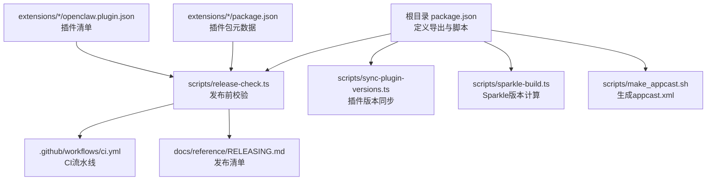
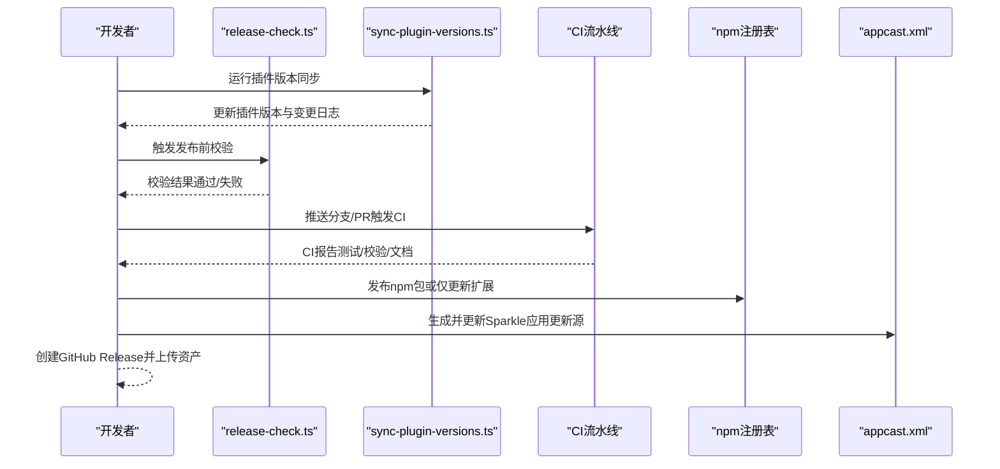
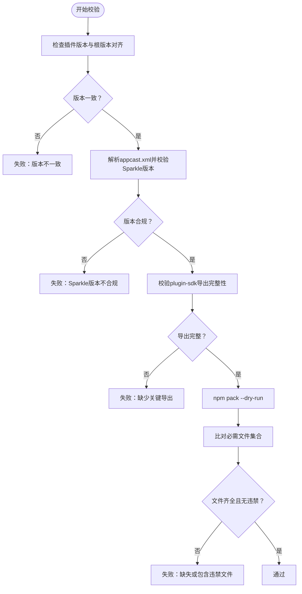
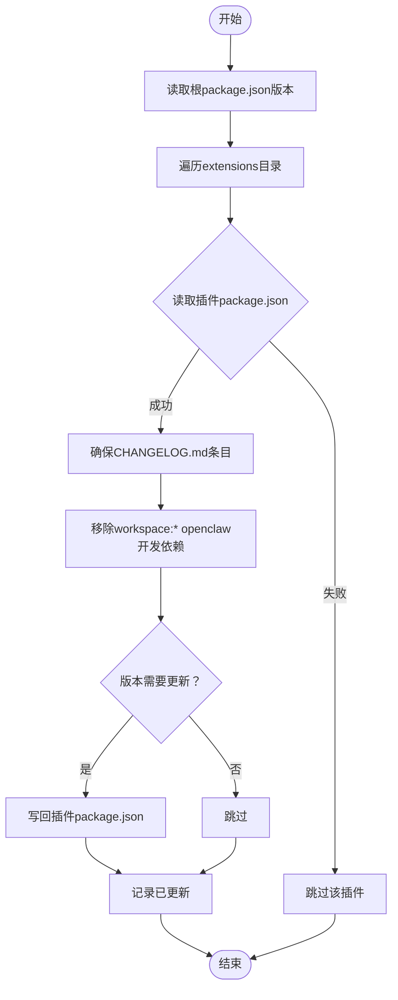
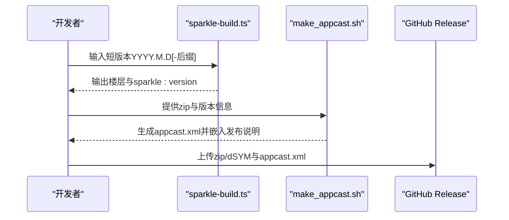
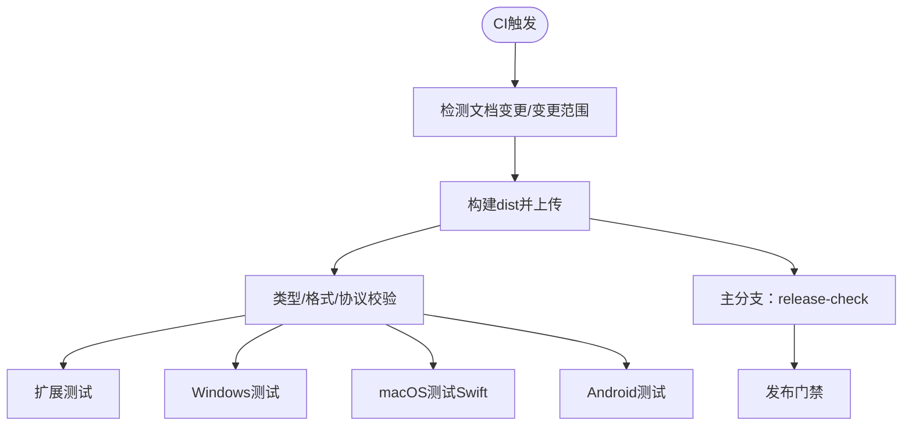
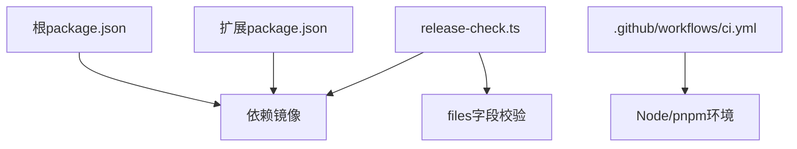

# 插件发布和分发

<cite>
**本文档引用的文件**
- [README.md](file://README.md)
- [package.json](file://package.json)
- [scripts/release-check.ts](file://scripts/release-check.ts)
- [scripts/sync-plugin-versions.ts](file://scripts/sync-plugin-versions.ts)
- [scripts/sparkle-build.ts](file://scripts/sparkle-build.ts)
- [scripts/make_appcast.sh](file://scripts/make_appcast.sh)
- [.github/workflows/ci.yml](file://.github/workflows/ci.yml)
- [docs/plugins/manifest.md](file://docs/plugins/manifest.md)
- [docs/plugins/community.md](file://docs/plugins/community.md)
- [docs/reference/RELEASING.md](file://docs/reference/RELEASING.md)
- [extensions/discord/openclaw.plugin.json](file://extensions/discord/openclaw.plugin.json)
- [extensions/discord/package.json](file://extensions/discord/package.json)
</cite>

## 目录
1. [简介](#简介)
2. [项目结构](#项目结构)
3. [核心组件](#核心组件)
4. [架构总览](#架构总览)
5. [详细组件分析](#详细组件分析)
6. [依赖关系分析](#依赖关系分析)
7. [性能考虑](#性能考虑)
8. [故障排除指南](#故障排除指南)
9. [结论](#结论)
10. [附录](#附录)

## 简介
本指南面向OpenClaw插件开发者与维护者，系统阐述插件的打包、发布与分发流程，涵盖版本管理、依赖处理、构建优化、文档与元数据规范、审核与质量保障、以及维护与更新最佳实践。OpenClaw通过严格的CI校验、统一的插件清单与SDK导出校验、以及Sparkle应用更新通道，确保插件在npm、官方扩展库与第三方生态中的可发现性、可安装性与可维护性。

## 项目结构
OpenClaw采用多语言混合工程：核心为TypeScript/JavaScript，配合Swift（macOS应用）、Gradle（Android）与XcodeGen（iOS）。插件体系位于extensions目录，每个插件包含：
- openclaw.plugin.json：插件清单（必需）
- package.json：包元数据与入口声明
- 源码与构建产物（dist/下各SDK模块）

关键发布相关文件与职责：
- package.json：定义npm包导出、构建脚本、依赖与发布范围
- scripts/release-check.ts：发布前校验（插件版本对齐、Sparkle版本、SDK导出完整性、打包内容）
- scripts/sync-plugin-versions.ts：批量同步插件版本与变更日志
- scripts/sparkle-build.ts：Sparkle版本计算工具
- scripts/make_appcast.sh：生成macOS应用更新源appcast.xml
- .github/workflows/ci.yml：CI流水线，含release-check与多平台测试
- docs/reference/RELEASING.md：发布清单与步骤
- docs/plugins/manifest.md：插件清单与JSON Schema要求
- docs/plugins/community.md：社区插件收录标准与提交流程

图表来源
- [package.json](file://package.json#L1-L458)
- [scripts/release-check.ts](file://scripts/release-check.ts#L1-L451)
- [scripts/sync-plugin-versions.ts](file://scripts/sync-plugin-versions.ts#L1-L109)
- [scripts/sparkle-build.ts](file://scripts/sparkle-build.ts#L1-L77)
- [scripts/make_appcast.sh](file://scripts/make_appcast.sh#L1-L71)
- [.github/workflows/ci.yml](file://.github/workflows/ci.yml#L1-L765)
- [docs/reference/RELEASING.md](file://docs/reference/RELEASING.md#L1-L122)
- [extensions/discord/openclaw.plugin.json](file://extensions/discord/openclaw.plugin.json#L1-L10)
- [extensions/discord/package.json](file://extensions/discord/package.json#L1-L12)

章节来源
- [package.json](file://package.json#L1-L458)
- [.github/workflows/ci.yml](file://.github/workflows/ci.yml#L114-L138)

## 核心组件
- 发布校验器（release-check）：确保插件版本与核心版本一致、Sparkle版本合规、SDK导出完整、打包内容符合预期。
- 版本同步器（sync-plugin-versions）：批量更新插件版本并写入变更日志条目。
- Sparkle工具链：计算版本楼层、生成appcast、签名与发布。
- CI流水线：自动执行校验、测试与文档检查，避免不合规发布。
- 插件清单与SDK：严格schema校验与导出约束，保障运行时稳定性。

章节来源
- [scripts/release-check.ts](file://scripts/release-check.ts#L221-L267)
- [scripts/release-check.ts](file://scripts/release-check.ts#L334-L344)
- [scripts/release-check.ts](file://scripts/release-check.ts#L372-L405)
- [scripts/release-check.ts](file://scripts/release-check.ts#L407-L446)
- [scripts/sync-plugin-versions.ts](file://scripts/sync-plugin-versions.ts#L41-L101)
- [scripts/sparkle-build.ts](file://scripts/sparkle-build.ts#L14-L57)
- [.github/workflows/ci.yml](file://.github/workflows/ci.yml#L114-L138)

## 架构总览
OpenClaw插件发布架构由“清单约束 + SDK导出 + 打包校验 + CI门禁 + 分发渠道”构成，确保插件在安装、加载与运行阶段的正确性与一致性。

图表来源
- [scripts/sync-plugin-versions.ts](file://scripts/sync-plugin-versions.ts#L41-L101)
- [scripts/release-check.ts](file://scripts/release-check.ts#L407-L446)
- [.github/workflows/ci.yml](file://.github/workflows/ci.yml#L114-L138)
- [scripts/make_appcast.sh](file://scripts/make_appcast.sh#L1-L71)
- [docs/reference/RELEASING.md](file://docs/reference/RELEASING.md#L67-L91)

## 详细组件分析

### 组件A：发布校验器（release-check）
职责与流程：
- 插件版本对齐：校验所有扩展包版本与根版本保持一致
- Sparkle版本合规：解析appcast.xml，验证sparkle:version不低于楼层要求
- SDK导出完整性：确保dist/plugin-sdk/index.js导出关键API
- 打包内容校验：通过npm pack --dry-run比对必需文件集合
- 根依赖镜像一致性：校验扩展依赖是否与根依赖镜像一致（允许白名单）

图表来源
- [scripts/release-check.ts](file://scripts/release-check.ts#L221-L267)
- [scripts/release-check.ts](file://scripts/release-check.ts#L334-L344)
- [scripts/release-check.ts](file://scripts/release-check.ts#L372-L405)
- [scripts/release-check.ts](file://scripts/release-check.ts#L407-L446)

章节来源
- [scripts/release-check.ts](file://scripts/release-check.ts#L221-L267)
- [scripts/release-check.ts](file://scripts/release-check.ts#L334-L344)
- [scripts/release-check.ts](file://scripts/release-check.ts#L372-L405)
- [scripts/release-check.ts](file://scripts/release-check.ts#L407-L446)

### 组件B：版本同步器（sync-plugin-versions）
职责与流程：
- 读取根package.json版本作为目标版本
- 遍历extensions目录，更新每个插件package.json的version字段
- 自动在插件CHANGELOG.md中插入对应版本条目
- 移除插件开发依赖中的workspace:* openclaw条目（若存在）

图表来源
- [scripts/sync-plugin-versions.ts](file://scripts/sync-plugin-versions.ts#L41-L101)

章节来源
- [scripts/sync-plugin-versions.ts](file://scripts/sync-plugin-versions.ts#L41-L101)

### 组件C：Sparkle工具链
职责与流程：
- 计算版本楼层：根据短版本（形如YYYY.M.D或带后缀）推导sparkle:version的楼层
- 生成appcast：使用Sparkle工具链生成并嵌入发布说明，更新appcast.xml
- 发布准备：生成zip与dSYM，准备GitHub Release附件

图表来源
- [scripts/sparkle-build.ts](file://scripts/sparkle-build.ts#L14-L57)
- [scripts/make_appcast.sh](file://scripts/make_appcast.sh#L1-L71)

章节来源
- [scripts/sparkle-build.ts](file://scripts/sparkle-build.ts#L14-L57)
- [scripts/make_appcast.sh](file://scripts/make_appcast.sh#L1-L71)

### 组件D：CI流水线（CI门禁）
职责与流程：
- 文档变更检测：快速跳过重任务
- 变更范围检测：按修改路径决定是否运行Node/Windows/macOS/Android等任务
- 构建与校验：构建dist并上传；仅在主分支运行release-check
- 多平台测试：Node、Windows、macOS（Swift）、Android
- 安全审计：密钥扫描、工作流审计、生产依赖审计

图表来源
- [.github/workflows/ci.yml](file://.github/workflows/ci.yml#L15-L78)
- [.github/workflows/ci.yml](file://.github/workflows/ci.yml#L114-L138)
- [.github/workflows/ci.yml](file://.github/workflows/ci.yml#L358-L481)
- [.github/workflows/ci.yml](file://.github/workflows/ci.yml#L559-L718)
- [.github/workflows/ci.yml](file://.github/workflows/ci.yml#L719-L765)

章节来源
- [.github/workflows/ci.yml](file://.github/workflows/ci.yml#L15-L78)
- [.github/workflows/ci.yml](file://.github/workflows/ci.yml#L114-L138)
- [.github/workflows/ci.yml](file://.github/workflows/ci.yml#L358-L481)
- [.github/workflows/ci.yml](file://.github/workflows/ci.yml#L559-L718)
- [.github/workflows/ci.yml](file://.github/workflows/ci.yml#L719-L765)

### 组件E：插件清单与SDK导出
- 清单要求：每个插件必须提供openclaw.plugin.json，包含id与configSchema；可选channels/providers/skills/name/description/uiHints/version等
- SDK导出：dist/plugin-sdk/index.js必须导出一组关键API，否则插件运行时崩溃
- 打包校验：release-check会检查dist/plugin-sdk/*系列产物与build-info.json是否存在

章节来源
- [docs/plugins/manifest.md](file://docs/plugins/manifest.md#L9-L76)
- [scripts/release-check.ts](file://scripts/release-check.ts#L346-L405)
- [scripts/release-check.ts](file://scripts/release-check.ts#L20-L113)

### 组件F：分发渠道与社区插件
- 官方插件库：@openclaw/*作用域下的npm包，随核心发布同步版本
- 第三方仓库：社区插件需满足收录要求（npm发布、GitHub公开仓库、文档与问题跟踪、维护信号）
- 私有分发：可通过企业内部npm仓库或Git子模块方式分发

章节来源
- [docs/plugins/community.md](file://docs/plugins/community.md#L9-L52)
- [docs/reference/RELEASING.md](file://docs/reference/RELEASING.md#L93-L122)

## 依赖关系分析
- 根依赖镜像：扩展包的依赖应尽量与根package.json保持一致，未对齐的差异会被release-check捕获
- 打包范围：package.json的files字段控制npm包内容，需显式包含dist、docs、skills、extensions等目录，避免误打包macOS应用bundle
- CI依赖：CI流水线依赖pnpm与Node环境，确保缓存与安装一致性

图表来源
- [package.json](file://package.json#L23-L34)
- [scripts/release-check.ts](file://scripts/release-check.ts#L128-L165)
- [.github/workflows/ci.yml](file://.github/workflows/ci.yml#L97-L104)

章节来源
- [package.json](file://package.json#L23-L34)
- [scripts/release-check.ts](file://scripts/release-check.ts#L128-L165)
- [.github/workflows/ci.yml](file://.github/workflows/ci.yml#L97-L104)

## 性能考虑
- 构建缓存：CI中使用actions/cache与自定义缓存策略，减少重复安装与编译时间
- 并行测试：Windows与Node测试采用分片并行，缩短整体耗时
- 依赖精简：通过pnpm overrides与onlyBuiltDependencies减少不必要的二进制依赖
- Sparkle签名：使用ed25519私钥进行签名，确保下载与更新安全

章节来源
- [.github/workflows/ci.yml](file://.github/workflows/ci.yml#L295-L331)
- [.github/workflows/ci.yml](file://.github/workflows/ci.yml#L469-L481)
- [package.json](file://package.json#L420-L456)
- [scripts/make_appcast.sh](file://scripts/make_appcast.sh#L7-L11)

## 故障排除指南
常见问题与定位建议：
- npm包过大或包含macOS应用bundle：检查package.json的files字段，确保排除dist/OpenClaw.app
- npm发布认证问题：使用传统认证方式获取OTP提示
- npx验证失败（锁损坏）：清理缓存后重试
- 标签回退修复：必要时强制更新标签并确保GitHub Release资产匹配
- 插件清单缺失或schema错误：确保openclaw.plugin.json存在且configSchema合法
- SDK导出缺失：确认dist/plugin-sdk/index.js导出完整

章节来源
- [docs/reference/RELEASING.md](file://docs/reference/RELEASING.md#L74-L83)
- [scripts/release-check.ts](file://scripts/release-check.ts#L372-L405)
- [docs/plugins/manifest.md](file://docs/plugins/manifest.md#L53-L62)

## 结论
OpenClaw通过严格的清单约束、SDK导出校验、Sparkle版本与打包内容门禁，以及CI自动化流水线，构建了从开发到发布的完整质量闭环。遵循本文档的版本管理、依赖处理、构建优化与审核流程，可显著降低插件发布风险，提升用户体验与可维护性。

## 附录

### A. 插件清单与元数据规范
- 必填字段：id、configSchema
- 常用可选字段：kind、channels、providers、skills、name、description、uiHints、version
- JSON Schema要求：必须提供Schema，即使为空对象
- 运行时行为：未知channels键、未知插件ID均视为错误；禁用插件的配置会保留并在诊断中告警

章节来源
- [docs/plugins/manifest.md](file://docs/plugins/manifest.md#L18-L76)
- [extensions/discord/openclaw.plugin.json](file://extensions/discord/openclaw.plugin.json#L1-L10)

### B. 插件版本与同步
- 同步命令：pnpm plugins:sync
- 行为：更新插件版本、写入变更日志条目、移除workspace:* openclaw开发依赖
- 校验：release-check确保所有插件版本与根版本一致

章节来源
- [scripts/sync-plugin-versions.ts](file://scripts/sync-plugin-versions.ts#L41-L101)
- [scripts/release-check.ts](file://scripts/release-check.ts#L221-L267)

### C. 发布清单与步骤
- 版本与元数据：更新package.json版本、同步插件版本、更新CLI/version字符串、核对bin映射
- 构建与产物：构建dist、校验dist/build-info.json、可选npm pack预检
- 变更日志与文档：更新CHANGELOG.md与README示例
- 校验：build、check、test、release:check、安装冒烟测试
- macOS应用：构建签名、zip、生成appcast、更新appcast.xml
- 发布：npm publish（含dist-tags）、创建GitHub Release、上传资产、公告

章节来源
- [docs/reference/RELEASING.md](file://docs/reference/RELEASING.md#L10-L91)

### D. 社区插件收录与提交
- 收录要求：npm发布、GitHub公开仓库、文档与问题跟踪、维护信号
- 提交流程：PR添加条目，包含名称、npm包名、仓库地址、一行描述、安装命令
- 质量门槛：实用、文档完善、安全可靠；低质量插件可能被拒绝

章节来源
- [docs/plugins/community.md](file://docs/plugins/community.md#L9-L52)