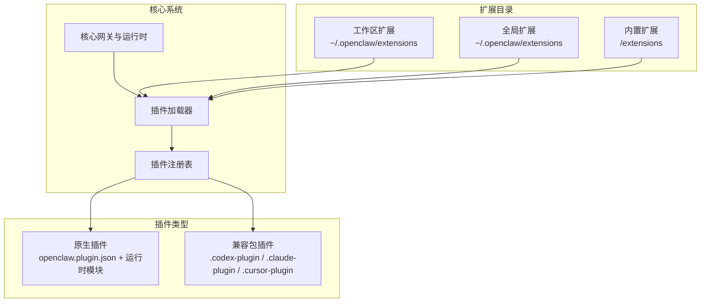
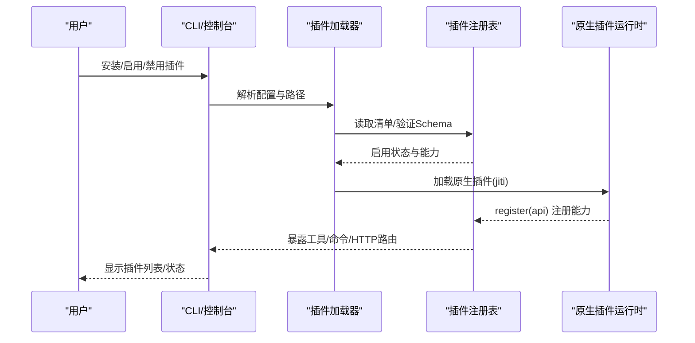
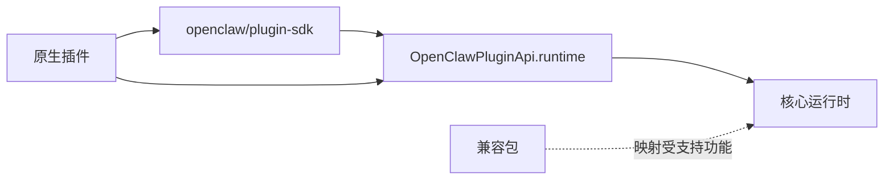

# 插件开发指南

<cite>
**本文档引用的文件**
- [README.md](file://README.md)
- [getting-started.md](file://docs/start/getting-started.md)
- [plugin.md](file://docs/tools/plugin.md)
- [manifest.md](file://docs/plugins/manifest.md)
- [bundles.md](file://docs/plugins/bundles.md)
- [plugin-sdk.md](file://docs/refactor/plugin-sdk.md)
- [index.ts](file://src/plugin-sdk/index.ts)
</cite>

## 目录
1. [简介](#简介)
2. [项目结构](#项目结构)
3. [核心组件](#核心组件)
4. [架构总览](#架构总览)
5. [详细组件分析](#详细组件分析)
6. [依赖关系分析](#依赖关系分析)
7. [性能考虑](#性能考虑)
8. [故障排除指南](#故障排除指南)
9. [结论](#结论)
10. [附录](#附录)

## 简介
本指南面向希望在 OpenClaw 平台上开发插件的开发者，覆盖从项目初始化、开发环境搭建、SDK 使用方法到最终部署发布的完整流程。内容包括：
- 插件系统架构与生命周期
- 多种类型插件（Provider、Channel、Tool、Memory）的开发要点与最佳实践
- 插件清单（openclaw.plugin.json）与 JSON Schema 配置验证
- SDK 导出与运行时 API 的使用方式
- 调试技巧、测试策略与性能优化建议
- 常见问题排查与解决方案

## 项目结构
OpenClaw 采用“核心 + 扩展”的模块化设计，插件以“原生插件”或“兼容包”两种形式存在：
- 原生插件：包含 openclaw.plugin.json 清单与运行时模块，通过 jiti 动态加载，具备完全的运行时能力
- 兼容包：遵循 Codex/Claude/Cursor 布局的外部包，OpenClaw 仅作为元数据/内容包映射到内置功能

图表来源
- [plugin.md:60-87](file://docs/tools/plugin.md#L60-L87)
- [plugin.md:658-752](file://docs/tools/plugin.md#L658-L752)

章节来源
- [plugin.md:60-87](file://docs/tools/plugin.md#L60-L87)
- [plugin.md:658-752](file://docs/tools/plugin.md#L658-L752)

## 核心组件
- 插件清单与发现
  - 原生插件必须包含 openclaw.plugin.json，用于声明 id、配置模式、渠道/提供者注册等
  - 发现顺序：配置路径 → 工作区扩展 → 全局扩展 → 内置扩展
- 插件启用规则
  - 支持 plugins.enabled、plugins.deny、plugins.allow、plugins.entries.<id>.enabled、plugins.slots.* 等
  - 默认：内置默认开启插件集合；工作区插件默认关闭
- 运行时加载
  - 仅原生插件在进程内加载并通过 register(api) 注册能力
  - 兼容包仅作为元数据/内容包映射，不执行运行时代码

章节来源
- [manifest.md:29-34](file://docs/plugins/manifest.md#L29-L34)
- [plugin.md:753-771](file://docs/tools/plugin.md#L753-L771)
- [plugin.md:129-148](file://docs/tools/plugin.md#L129-L148)

## 架构总览
OpenClaw 插件系统分为四层：清单与发现、启用与验证、运行时加载、表面消费。

图表来源
- [plugin.md:440-453](file://docs/tools/plugin.md#L440-L453)
- [plugin.md:129-148](file://docs/tools/plugin.md#L129-L148)

章节来源
- [plugin.md:440-453](file://docs/tools/plugin.md#L440-L453)
- [plugin.md:129-148](file://docs/tools/plugin.md#L129-L148)

## 详细组件分析

### 插件清单与配置验证
- 必填字段
  - id：插件唯一标识
  - configSchema：JSON Schema，用于配置校验（即使无配置也需提供空对象模式）
- 可选字段
  - kind、channels、providers、providerAuthEnvVars、skills、name、description、uiHints、version
- 验证行为
  - 未知 channels.* 键为错误（除非该渠道由插件声明）
  - plugins.entries.<id>、plugins.allow、plugins.deny、plugins.slots.* 必须引用“可发现”的插件 id
  - 缺失或损坏的清单会阻断配置验证
  - 若插件已安装但被禁用，保留配置并在 Doctor 中警告

章节来源
- [manifest.md:36-67](file://docs/plugins/manifest.md#L36-L67)
- [manifest.md:74-84](file://docs/plugins/manifest.md#L74-L84)

### 插件 SDK 与运行时 API
- SDK 分层
  - SDK（编译期、稳定、可发布）：类型、辅助函数、配置工具
  - 运行时（执行面、注入）：访问核心运行时行为的最小接口集
- 运行时 API 关键能力
  - channel.*：文本分块、回复派发、路由、配对、媒体、提及、群组策略、去抖动、命令授权
  - logging：日志级别与子日志器
  - state：解析状态目录
- 兼容性与版本
  - SDK 语义化版本，运行时随核心版本发布
  - 插件声明所需运行时范围（如 openclawRuntime: ">=YYYY.M"）

章节来源
- [plugin-sdk.md:19-44](file://docs/refactor/plugin-sdk.md#L19-L44)
- [plugin-sdk.md:45-145](file://docs/refactor/plugin-sdk.md#L45-L145)
- [plugin-sdk.md:188-193](file://docs/refactor/plugin-sdk.md#L188-L193)

### 原生插件开发流程（Provider/Channel/Tool/Memory）
- 初始化与项目结构
  - 创建插件根目录，编写 openclaw.plugin.json 与 package.json
  - 在 index.ts 中实现 register(api) 并导出能力
- Provider 插件
  - 通过 api.registerProvider 注册 catalog/resolveDynamicModel/capabilities/usage 等钩子
  - 利用 providerAuthEnvVars 提前解析环境变量认证信息
- Channel 插件
  - 实现账户解析、配对、消息发送/接收、目录与权限策略
  - 使用 SDK 中的通道规范化、去抖动、提及匹配等工具
- Tool 插件
  - 通过 api.registerTool 或 api.registerAgentTool 注册工具
  - 使用 createActionGate/readStringParam/readNumberParam/jsonResult 等参数处理工具
- Memory 插件
  - 通过 plugins.slots.memory 选择专属槽位
  - 实现上下文引擎接口（ContextEngine），支持组装/压缩/摄入/引导

章节来源
- [plugin.md:195-214](file://docs/tools/plugin.md#L195-L214)
- [plugin.md:216-330](file://docs/tools/plugin.md#L216-L330)
- [plugin-sdk.md:153-187](file://docs/refactor/plugin-sdk.md#L153-L187)

### 兼容包插件（Codex/Claude/Cursor）
- 行为差异
  - 不执行运行时代码，仅映射技能、Hook 包、MCP、嵌入式 Pi 设置等
- 支持现状
  - 技能根：skills/、commands/、.cursor/commands/
  - Hook 包：符合 OpenClaw HookPack 布局（HOOK.md + handler.ts/js）
  - MCP：合并到 claude-cli 后端配置
  - 嵌入式 Pi 设置：Claude settings.json 导入
- 安全模型
  - 仅边界内读取文件，不执行任意运行时代码

章节来源
- [bundles.md:31-45](file://docs/plugins/bundles.md#L31-L45)
- [bundles.md:84-118](file://docs/plugins/bundles.md#L84-L118)
- [bundles.md:240-254](file://docs/plugins/bundles.md#L240-L254)

### 插件调试与测试策略
- 调试技巧
  - 使用 openclaw plugins list/info 检查清单与能力
  - 通过 OPENCLAW_DISABLE_PLUGIN_*_CACHE=1 临时禁用缓存以定位问题
  - 使用 openclaw doctor 检查配置与插件错误
- 测试策略
  - 单元测试：适配器级测试（真实核心实现）
  - 黄金测试：每插件的端到端回归（安装 + 运行 + 冒烟）
  - CI 示例：在 CI 中运行单个端到端示例插件

章节来源
- [plugin.md:649-657](file://docs/tools/plugin.md#L649-L657)
- [plugin-sdk.md:194-199](file://docs/refactor/plugin-sdk.md#L194-L199)

### 性能优化方法
- 缓存与预热
  - 插件发现、清单注册表、已加载插件注册表具有短期进程内缓存
  - 可通过环境变量调整缓存窗口与禁用缓存
- 路由与并发
  - 使用 KeyedAsyncQueue 等队列工具进行键控任务排队
  - 合理设置去抖动与限流，避免重复请求
- 资源管理
  - 媒体下载与保存使用带大小限制的缓冲区与临时路径
  - 合理使用持久化去重缓存，减少重复处理

章节来源
- [plugin.md:649-657](file://docs/tools/plugin.md#L649-L657)
- [index.ts:185-187](file://src/plugin-sdk/index.ts#L185-L187)
- [index.ts:486-491](file://src/plugin-sdk/index.ts#L486-L491)

## 依赖关系分析
- 插件与核心的耦合
  - 插件只能通过 api.runtime 访问核心行为，避免直接导入 src/**
  - SDK 小而稳定，运行时映射到现有核心实现
- 插件间依赖
  - 通过 plugins.slots.* 选择独占型插件（如 memory）
  - 通过 plugins.allow 以 id 为粒度进行信任控制
- 外部依赖
  - 兼容包不执行运行时代码，仅映射受支持的功能
  - 原生插件可引入 npm 依赖，但需注意构建脚本与生命周期脚本限制

图表来源
- [plugin-sdk.md:41-44](file://docs/refactor/plugin-sdk.md#L41-L44)
- [plugin-sdk.md:149-152](file://docs/refactor/plugin-sdk.md#L149-L152)
- [plugin.md:103-123](file://docs/tools/plugin.md#L103-L123)

章节来源
- [plugin-sdk.md:41-44](file://docs/refactor/plugin-sdk.md#L41-L44)
- [plugin-sdk.md:149-152](file://docs/refactor/plugin-sdk.md#L149-L152)
- [plugin.md:103-123](file://docs/tools/plugin.md#L103-L123)

## 性能考虑
- 启动与缓存
  - 短期内缓存发现结果、清单注册表与已加载插件注册表，降低启动与命令开销
  - 可通过环境变量临时禁用缓存以定位问题
- 请求与并发
  - 使用 keyed 异步队列与去抖动机制，避免重复请求与风暴
  - 合理设置媒体下载与保存的大小限制与超时
- 日志与可观测性
  - 使用运行时日志器与诊断事件，记录关键路径与异常

章节来源
- [plugin.md:649-657](file://docs/tools/plugin.md#L649-L657)
- [index.ts:185-187](file://src/plugin-sdk/index.ts#L185-L187)
- [index.ts:486-491](file://src/plugin-sdk/index.ts#L486-L491)

## 故障排除指南
- 清单缺失或无效
  - 症状：插件未出现在列表或配置验证失败
  - 处理：检查 openclaw.plugin.json 是否存在且 JSON Schema 合法
- 插件未启用
  - 症状：插件存在但未生效
  - 处理：确认 plugins.enabled、plugins.allow、plugins.deny、plugins.entries.<id>.enabled、plugins.slots.* 的设置
- 兼容包未执行
  - 症状：能力检测到但未运行
  - 处理：查看 openclaw plugins info <id>，确认是否属于当前未连线的功能
- 安全警告
  - 症状：启动时出现安全警告
  - 处理：检查 plugins.allow 与插件来源路径所有权，必要时使用显式安装/加载路径

章节来源
- [manifest.md:74-84](file://docs/plugins/manifest.md#L74-L84)
- [plugin.md:753-771](file://docs/tools/plugin.md#L753-L771)
- [plugin.md:722-730](file://docs/tools/plugin.md#L722-L730)
- [bundles.md:268-293](file://docs/plugins/bundles.md#L268-L293)

## 结论
OpenClaw 的插件体系以“清单优先、运行时隔离、能力映射”为核心原则，既保证了安全性，又提供了强大的扩展能力。开发者应优先使用 SDK 与运行时 API，严格遵守清单与 Schema 规范，并结合缓存、并发与日志策略提升插件性能与稳定性。对于第三方生态，兼容包提供了低风险的能力映射路径；对于需要深度集成的场景，原生插件则提供了完整的运行时能力。

## 附录

### 开发环境搭建与快速开始
- 安装与入门
  - 使用官方安装脚本或包管理器安装 openclaw
  - 运行 openclaw setup --wizard --install-daemon 完成向导
  - 通过 openclaw dashboard 打开控制界面
- Node 版本要求
  - 推荐 Node 24；兼容 Node 22 LTS

章节来源
- [getting-started.md:20-27](file://docs/start/getting-started.md#L20-L27)
- [getting-started.md:28-77](file://docs/start/getting-started.md#L28-L77)

### 插件开发模板与最佳实践
- Provider 插件
  - 使用 api.registerProvider 注册 catalog/resolveDynamicModel/capabilities/usage 钩子
  - 在 manifest 中声明 providerAuthEnvVars 以便在不加载运行时的情况下解析环境变量
- Channel 插件
  - 实现账户解析与配对流程，使用 SDK 工具进行目标规范化、提及匹配与群组策略解析
- Tool 插件
  - 使用 createActionGate/readStringParam/readNumberParam/jsonResult 等工具处理参数与返回
- Memory 插件
  - 通过 plugins.slots.memory 选择槽位，实现 ContextEngine 接口

章节来源
- [plugin.md:216-330](file://docs/tools/plugin.md#L216-L330)
- [plugin-sdk.md:153-187](file://docs/refactor/plugin-sdk.md#L153-L187)

### 插件清单字段参考
- 必填
  - id：插件唯一标识
  - configSchema：JSON Schema（即使无配置也需提供）
- 可选
  - kind、channels、providers、providerAuthEnvVars、skills、name、description、uiHints、version
- 验证与启用
  - 未知 channels.* 键为错误
  - plugins.entries.<id>、plugins.allow、plugins.deny、plugins.slots.* 必须引用可发现 id
  - 禁用插件保留配置并在 Doctor 中警告

章节来源
- [manifest.md:36-67](file://docs/plugins/manifest.md#L36-L67)
- [manifest.md:74-84](file://docs/plugins/manifest.md#L74-L84)