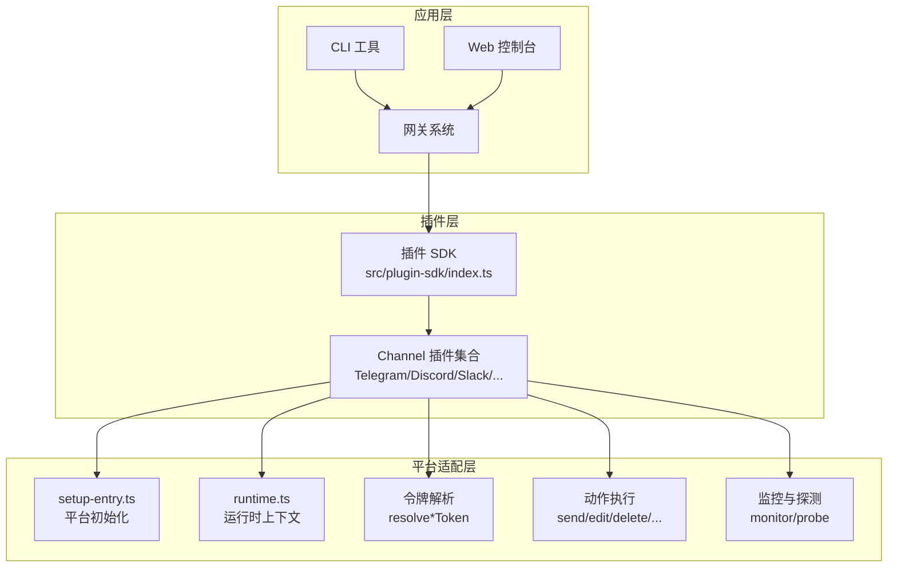
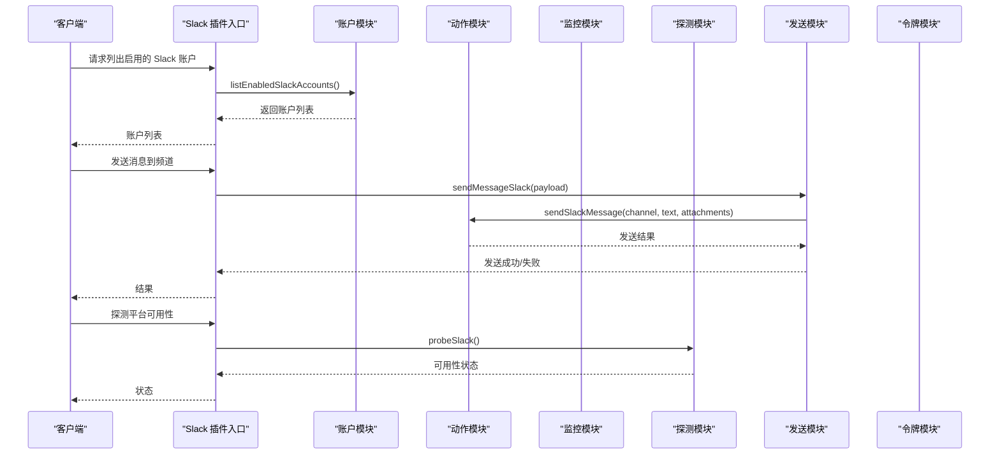
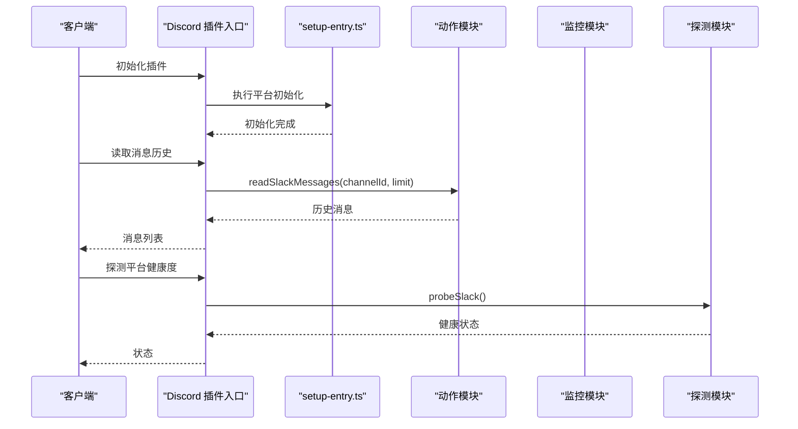
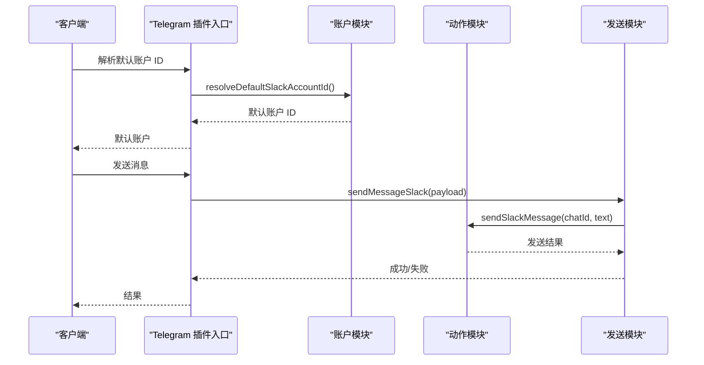
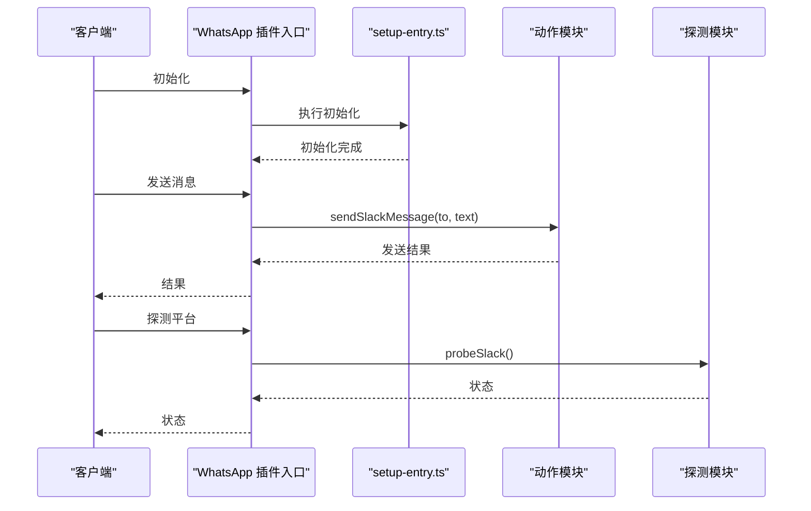
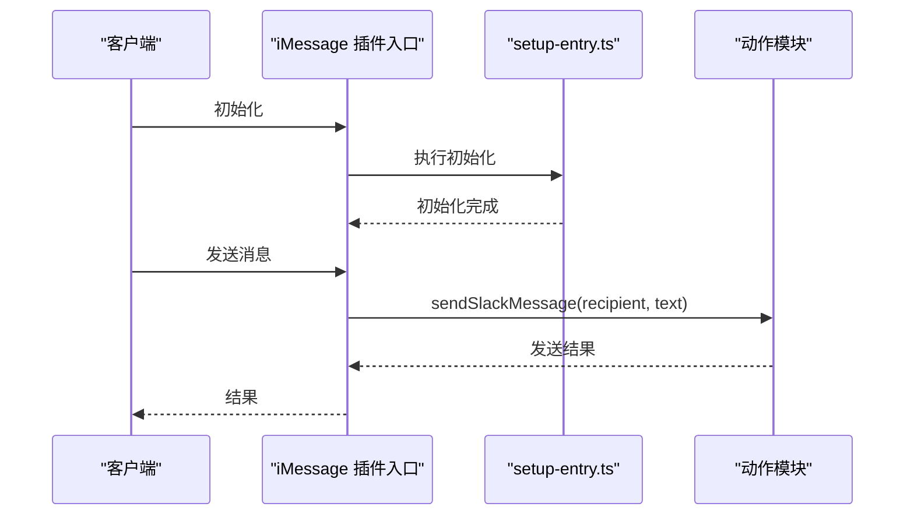
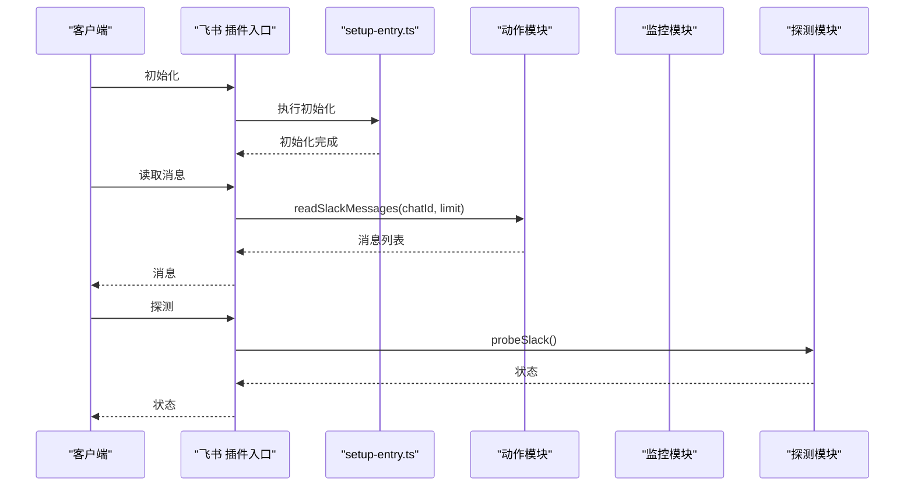
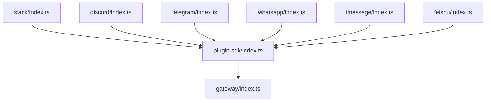

# Channel 插件开发

<cite>
**本文档引用的文件**
- [extensions/slack/src/index.ts](file://extensions/slack/src/index.ts)
- [extensions/discord/src/index.ts](file://extensions/discord/src/index.ts)
- [extensions/telegram/src/index.ts](file://extensions/telegram/src/index.ts)
- [extensions/whatsapp/src/index.ts](file://extensions/whatsapp/src/index.ts)
- [extensions/imessage/src/index.ts](file://extensions/imessage/src/index.ts)
- [extensions/feishu/src/index.ts](file://extensions/feishu/src/index.ts)
- [extensions/msteams/src/index.ts](file://extensions/msteams/src/index.ts)
- [extensions/signal/src/index.ts](file://extensions/signal/src/index.ts)
- [extensions/googlechat/src/index.ts](file://extensions/googlechat/src/index.ts)
- [extensions/matrix/src/index.ts](file://extensions/matrix/src/index.ts)
- [extensions/mattermost/src/index.ts](file://extensions/mattermost/src/index.ts)
- [extensions/line/src/index.ts](file://extensions/line/src/index.ts)
- [extensions/irc/src/index.ts](file://extensions/irc/src/index.ts)
- [extensions/nostr/src/index.ts](file://extensions/nostr/src/index.ts)
- [extensions/zalo/src/index.ts](file://extensions/zalo/src/index.ts)
- [extensions/twitch/src/index.ts](file://extensions/twitch/src/index.ts)
- [extensions/tlon/src/index.ts](file://extensions/tlon/src/index.ts)
- [extensions/synology-chat/src/index.ts](file://extensions/synology-chat/src/index.ts)
- [extensions/nextcloud-talk/src/index.ts](file://extensions/nextcloud-talk/src/index.ts)
- [extensions/whatsapp/src/setup-entry.ts](file://extensions/whatsapp/src/setup-entry.ts)
- [extensions/imessage/src/setup-entry.ts](file://extensions/imessage/src/setup-entry.ts)
- [extensions/discord/src/setup-entry.ts](file://extensions/discord/src/setup-entry.ts)
- [extensions/feishu/src/setup-entry.ts](file://extensions/feishu/src/setup-entry.ts)
- [extensions/slack/src/setup-entry.ts](file://extensions/slack/src/setup-entry.ts)
- [extensions/telegram/src/setup-entry.ts](file://extensions/telegram/src/setup-entry.ts)
- [extensions/googlechat/src/setup-entry.ts](file://extensions/googlechat/src/setup-entry.ts)
- [extensions/matrix/src/setup-entry.ts](file://extensions/matrix/src/setup-entry.ts)
- [extensions/mattermost/src/setup-entry.ts](file://extensions/mattermost/src/setup-entry.ts)
- [extensions/line/src/setup-entry.ts](file://extensions/line/src/setup-entry.ts)
- [extensions/irc/src/setup-entry.ts](file://extensions/irc/src/setup-entry.ts)
- [extensions/nostr/src/setup-entry.ts](file://extensions/nostr/src/setup-entry.ts)
- [extensions/zalo/src/setup-entry.ts](file://extensions/zalo/src/setup-entry.ts)
- [extensions/twitch/src/setup-entry.ts](file://extensions/twitch/src/setup-entry.ts)
- [extensions/tlon/src/setup-entry.ts](file://extensions/tlon/src/setup-entry.ts)
- [extensions/synology-chat/src/setup-entry.ts](file://extensions/synology-chat/src/setup-entry.ts)
- [extensions/nextcloud-talk/src/setup-entry.ts](file://extensions/nextcloud-talk/src/setup-entry.ts)
- [extensions/shared/runtime.ts](file://extensions/shared/runtime.ts)
- [extensions/shared/config-schema-helpers.ts](file://extensions/shared/config-schema-helpers.ts)
- [extensions/shared/passive-monitor.ts](file://extensions/shared/passive-monitor.ts)
- [extensions/shared/deferred.ts](file://extensions/shared/deferred.ts)
- [extensions/shared/status-issues.ts](file://extensions/shared/status-issues.ts)
- [extensions/shared/channel-status-summary.ts](file://extensions/shared/channel-status-summary.ts)
- [src/plugin-sdk/index.ts](file://src/plugin-sdk/index.ts)
- [src/gateway/index.ts](file://src/gateway/index.ts)
- [docs/channels/index.md](file://docs/channels/index.md)
- [docs/channels/slack.md](file://docs/channels/slack.md)
- [docs/channels/discord.md](file://docs/channels/discord.md)
- [docs/channels/telegram.md](file://docs/channels/telegram.md)
- [docs/channels/whatsapp.md](file://docs/channels/whatsapp.md)
- [docs/channels/imessage.md](file://docs/channels/imessage.md)
- [docs/channels/feishu.md](file://docs/channels/feishu.md)
- [docs/channels/troubleshooting.md](file://docs/channels/troubleshooting.md)
- [docs/gateway/protocol.md](file://docs/gateway/protocol.md)
- [docs/gateway/configuration.md](file://docs/gateway/configuration.md)
- [docs/gateway/authentication.md](file://docs/gateway/authentication.md)
- [docs/concepts/messages.md](file://docs/concepts/messages.md)
- [docs/concepts/architecture.md](file://docs/concepts/architecture.md)
</cite>

## 目录
1. [简介](#简介)
2. [项目结构](#项目结构)
3. [核心组件](#核心组件)
4. [架构总览](#架构总览)
5. [详细组件分析](#详细组件分析)
6. [依赖关系分析](#依赖关系分析)
7. [性能考虑](#性能考虑)
8. [故障排除指南](#故障排除指南)
9. [结论](#结论)
10. [附录](#附录)

## 简介
本指南面向需要为即时通讯平台开发 Channel 插件的开发者，覆盖 Telegram、Discord、WhatsApp、Slack、飞书、iMessage 等主流平台的集成方法。文档从架构设计、连接管理、消息路由与状态同步等维度出发，结合仓库中的现有实现，给出可操作的开发步骤、最佳实践与常见问题处理策略。同时，文档解释了插件与网关系统的通信协议、消息序列化与事件处理机制，并针对各平台的限制、速率限制与错误恢复提供指导。

## 项目结构
OpenClaw 将每个即时通讯平台封装为独立的插件目录，采用统一的模块导出与入口设置方式。典型结构包括：
- 平台插件根目录：extensions/{platform}
- 源码目录：extensions/{platform}/src
- 入口文件：extensions/{platform}/index.ts
- 设置入口（setup-entry.ts）：用于初始化与配置注入
- 平台能力导出：accounts.js、actions.js、monitor.js、probe.js、send.js、token.js 等

下图展示了主要 Channel 插件的组织结构与导出关系：

```mermaid
graph TB
subgraph "插件入口"
SlackIndex["Slack 入口<br/>extensions/slack/src/index.ts"]
DiscordIndex["Discord 入口<br/>extensions/discord/src/index.ts"]
TelegramIndex["Telegram 入口<br/>extensions/telegram/src/index.ts"]
WhatsAppIndex["WhatsApp 入口<br/>extensions/whatsapp/src/index.ts"]
ImessageIndex["iMessage 入口<br/>extensions/imessage/src/index.ts"]
FeishuIndex["飞书 入口<br/>extensions/feishu/src/index.ts"]
MSTeamsIndex["MSTeams 入口<br/>extensions/msteams/src/index.ts"]
SignalIndex["Signal 入口<br/>extensions/signal/src/index.ts"]
GoogleChatIndex["Google Chat 入口<br/>extensions/googlechat/src/index.ts"]
MatrixIndex["Matrix 入口<br/>extensions/matrix/src/index.ts"]
MattermostIndex["Mattermost 入口<br/>extensions/mattermost/src/index.ts"]
LineIndex["Line 入口<br/>extensions/line/src/index.ts"]
IRCIndex["IRC 入口<br/>extensions/irc/src/index.ts"]
NostrIndex["Nostr 入口<br/>extensions/nostr/src/index.ts"]
ZaloIndex["Zalo 入口<br/>extensions/zalo/src/index.ts"]
TwitchIndex["Twitch 入口<br/>extensions/twitch/src/index.ts"]
TlonIndex["Tlon 入口<br/>extensions/tlon/src/index.ts"]
SynologyIndex["Synology Chat 入口<br/>extensions/synology-chat/src/index.ts"]
NextcloudIndex["Nextcloud Talk 入口<br/>extensions/nextcloud-talk/src/index.ts"]
end
subgraph "共享模块"
Runtime["runtime.ts"]
ConfigSchema["config-schema-helpers.ts"]
PassiveMonitor["passive-monitor.ts"]
Deferred["deferred.ts"]
StatusIssues["status-issues.ts"]
StatusSummary["channel-status-summary.ts"]
end
SlackIndex --> Runtime
DiscordIndex --> Runtime
TelegramIndex --> Runtime
WhatsAppIndex --> Runtime
ImessageIndex --> Runtime
FeishuIndex --> Runtime
MSTeamsIndex --> Runtime
SignalIndex --> Runtime
GoogleChatIndex --> Runtime
MatrixIndex --> Runtime
MattermostIndex --> Runtime
LineIndex --> Runtime
IRCIndex --> Runtime
NostrIndex --> Runtime
ZaloIndex --> Runtime
TwitchIndex --> Runtime
TlonIndex --> Runtime
SynologyIndex --> Runtime
NextcloudIndex --> Runtime
SlackIndex --> ConfigSchema
DiscordIndex --> ConfigSchema
TelegramIndex --> ConfigSchema
WhatsAppIndex --> ConfigSchema
ImessageIndex --> ConfigSchema
FeishuIndex --> ConfigSchema
MSTeamsIndex --> ConfigSchema
SignalIndex --> ConfigSchema
GoogleChatIndex --> ConfigSchema
MatrixIndex --> ConfigSchema
MattermostIndex --> ConfigSchema
LineIndex --> ConfigSchema
IRCIndex --> ConfigSchema
NostrIndex --> ConfigSchema
ZaloIndex --> ConfigSchema
TwitchIndex --> ConfigSchema
TlonIndex --> ConfigSchema
SynologyIndex --> ConfigSchema
NextcloudIndex --> ConfigSchema
```

图表来源
- [extensions/slack/src/index.ts:1-26](file://extensions/slack/src/index.ts#L1-L26)
- [extensions/discord/src/index.ts](file://extensions/discord/src/index.ts)
- [extensions/telegram/src/index.ts](file://extensions/telegram/src/index.ts)
- [extensions/whatsapp/src/index.ts](file://extensions/whatsapp/src/index.ts)
- [extensions/imessage/src/index.ts](file://extensions/imessage/src/index.ts)
- [extensions/feishu/src/index.ts](file://extensions/feishu/src/index.ts)
- [extensions/msteams/src/index.ts](file://extensions/msteams/src/index.ts)
- [extensions/signal/src/index.ts](file://extensions/signal/src/index.ts)
- [extensions/googlechat/src/index.ts](file://extensions/googlechat/src/index.ts)
- [extensions/matrix/src/index.ts](file://extensions/matrix/src/index.ts)
- [extensions/mattermost/src/index.ts](file://extensions/mattermost/src/index.ts)
- [extensions/line/src/index.ts](file://extensions/line/src/index.ts)
- [extensions/irc/src/index.ts](file://extensions/irc/src/index.ts)
- [extensions/nostr/src/index.ts](file://extensions/nostr/src/index.ts)
- [extensions/zalo/src/index.ts](file://extensions/zalo/src/index.ts)
- [extensions/twitch/src/index.ts](file://extensions/twitch/src/index.ts)
- [extensions/tlon/src/index.ts](file://extensions/tlon/src/index.ts)
- [extensions/synology-chat/src/index.ts](file://extensions/synology-chat/src/index.ts)
- [extensions/nextcloud-talk/src/index.ts](file://extensions/nextcloud-talk/src/index.ts)
- [extensions/shared/runtime.ts](file://extensions/shared/runtime.ts)
- [extensions/shared/config-schema-helpers.ts](file://extensions/shared/config-schema-helpers.ts)
- [extensions/shared/passive-monitor.ts](file://extensions/shared/passive-monitor.ts)
- [extensions/shared/deferred.ts](file://extensions/shared/deferred.ts)
- [extensions/shared/status-issues.ts](file://extensions/shared/status-issues.ts)
- [extensions/shared/channel-status-summary.ts](file://extensions/shared/channel-status-summary.ts)

章节来源
- [extensions/slack/src/index.ts:1-26](file://extensions/slack/src/index.ts#L1-L26)
- [extensions/discord/src/index.ts](file://extensions/discord/src/index.ts)
- [extensions/telegram/src/index.ts](file://extensions/telegram/src/index.ts)
- [extensions/whatsapp/src/index.ts](file://extensions/whatsapp/src/index.ts)
- [extensions/imessage/src/index.ts](file://extensions/imessage/src/index.ts)
- [extensions/feishu/src/index.ts](file://extensions/feishu/src/index.ts)
- [extensions/msteams/src/index.ts](file://extensions/msteams/src/index.ts)
- [extensions/signal/src/index.ts](file://extensions/signal/src/index.ts)
- [extensions/googlechat/src/index.ts](file://extensions/googlechat/src/index.ts)
- [extensions/matrix/src/index.ts](file://extensions/matrix/src/index.ts)
- [extensions/mattermost/src/index.ts](file://extensions/mattermost/src/index.ts)
- [extensions/line/src/index.ts](file://extensions/line/src/index.ts)
- [extensions/irc/src/index.ts](file://extensions/irc/src/index.ts)
- [extensions/nostr/src/index.ts](file://extensions/nostr/src/index.ts)
- [extensions/zalo/src/index.ts](file://extensions/zalo/src/index.ts)
- [extensions/twitch/src/index.ts](file://extensions/twitch/src/index.ts)
- [extensions/tlon/src/index.ts](file://extensions/tlon/src/index.ts)
- [extensions/synology-chat/src/index.ts](file://extensions/synology-chat/src/index.ts)
- [extensions/nextcloud-talk/src/index.ts](file://extensions/nextcloud-talk/src/index.ts)

## 核心组件
- 插件入口导出：各平台通过 index.ts 统一导出账户管理、动作执行、监控、探测、发送与令牌解析等能力，便于上层调用与组合使用。
- 共享运行时与工具：runtime.ts 提供运行时上下文；config-schema-helpers.ts 提供配置校验与模式辅助；passive-monitor.ts 提供被动监控能力；deferred.ts 提供延迟/承诺工具；status-issues.ts 与 channel-status-summary.ts 提供状态与问题汇总能力。
- 平台设置入口：setup-entry.ts 负责平台特定的初始化流程，如认证、连接建立、事件注册等。

章节来源
- [extensions/slack/src/index.ts:1-26](file://extensions/slack/src/index.ts#L1-L26)
- [extensions/shared/runtime.ts](file://extensions/shared/runtime.ts)
- [extensions/shared/config-schema-helpers.ts](file://extensions/shared/config-schema-helpers.ts)
- [extensions/shared/passive-monitor.ts](file://extensions/shared/passive-monitor.ts)
- [extensions/shared/deferred.ts](file://extensions/shared/deferred.ts)
- [extensions/shared/status-issues.ts](file://extensions/shared/status-issues.ts)
- [extensions/shared/channel-status-summary.ts](file://extensions/shared/channel-status-summary.ts)

## 架构总览
OpenClaw 的 Channel 插件遵循“平台无关”的 SDK 设计，通过统一的插件接口与网关通信协议对接后端服务。整体架构如下：

图表来源
- [src/plugin-sdk/index.ts](file://src/plugin-sdk/index.ts)
- [src/gateway/index.ts](file://src/gateway/index.ts)
- [extensions/slack/src/index.ts:1-26](file://extensions/slack/src/index.ts#L1-L26)
- [extensions/slack/src/setup-entry.ts](file://extensions/slack/src/setup-entry.ts)
- [extensions/shared/runtime.ts](file://extensions/shared/runtime.ts)
- [extensions/shared/config-schema-helpers.ts](file://extensions/shared/config-schema-helpers.ts)

章节来源
- [src/plugin-sdk/index.ts](file://src/plugin-sdk/index.ts)
- [src/gateway/index.ts](file://src/gateway/index.ts)
- [docs/gateway/protocol.md](file://docs/gateway/protocol.md)
- [docs/gateway/configuration.md](file://docs/gateway/configuration.md)
- [docs/gateway/authentication.md](file://docs/gateway/authentication.md)
- [docs/concepts/architecture.md](file://docs/concepts/architecture.md)

## 详细组件分析

### Slack 插件分析
Slack 插件通过统一入口导出账户、动作、监控、探测、发送与令牌解析等能力，便于在多账号场景下进行消息路由与状态管理。

图表来源
- [extensions/slack/src/index.ts:1-26](file://extensions/slack/src/index.ts#L1-L26)

章节来源
- [extensions/slack/src/index.ts:1-26](file://extensions/slack/src/index.ts#L1-L26)

### Discord 插件分析
Discord 插件同样采用统一入口导出能力，支持账户管理、消息动作、监控与探测等功能。

图表来源
- [extensions/discord/src/index.ts](file://extensions/discord/src/index.ts)
- [extensions/discord/src/setup-entry.ts](file://extensions/discord/src/setup-entry.ts)

章节来源
- [extensions/discord/src/index.ts](file://extensions/discord/src/index.ts)
- [extensions/discord/src/setup-entry.ts](file://extensions/discord/src/setup-entry.ts)

### Telegram 插件分析
Telegram 插件通过入口导出账户、动作、监控、探测与发送能力，支持多账号与消息路由。

图表来源
- [extensions/telegram/src/index.ts](file://extensions/telegram/src/index.ts)
- [extensions/telegram/src/setup-entry.ts](file://extensions/telegram/src/setup-entry.ts)

章节来源
- [extensions/telegram/src/index.ts](file://extensions/telegram/src/index.ts)
- [extensions/telegram/src/setup-entry.ts](file://extensions/telegram/src/setup-entry.ts)

### WhatsApp 插件分析
WhatsApp 插件提供账户解析、消息动作与平台探测能力，setup-entry.ts 负责平台初始化。

图表来源
- [extensions/whatsapp/src/index.ts](file://extensions/whatsapp/src/index.ts)
- [extensions/whatsapp/src/setup-entry.ts](file://extensions/whatsapp/src/setup-entry.ts)

章节来源
- [extensions/whatsapp/src/index.ts](file://extensions/whatsapp/src/index.ts)
- [extensions/whatsapp/src/setup-entry.ts](file://extensions/whatsapp/src/setup-entry.ts)

### iMessage 插件分析
iMessage 插件通过入口导出账户与动作能力，setup-entry.ts 负责平台初始化。

图表来源
- [extensions/imessage/src/index.ts](file://extensions/imessage/src/index.ts)
- [extensions/imessage/src/setup-entry.ts](file://extensions/imessage/src/setup-entry.ts)

章节来源
- [extensions/imessage/src/index.ts](file://extensions/imessage/src/index.ts)
- [extensions/imessage/src/setup-entry.ts](file://extensions/imessage/src/setup-entry.ts)

### 飞书（Feishu）插件分析
飞书插件提供账户、动作、监控、探测与发送能力，setup-entry.ts 负责初始化。

图表来源
- [extensions/feishu/src/index.ts](file://extensions/feishu/src/index.ts)
- [extensions/feishu/src/setup-entry.ts](file://extensions/feishu/src/setup-entry.ts)

章节来源
- [extensions/feishu/src/index.ts](file://extensions/feishu/src/index.ts)
- [extensions/feishu/src/setup-entry.ts](file://extensions/feishu/src/setup-entry.ts)

### 其他平台（概览）
- Telegram、Discord、Slack、WhatsApp、iMessage、飞书、MSTeams、Signal、Google Chat、Matrix、Mattermost、Line、IRC、Nostr、Zalo、Twitch、Tlon、Synology Chat、Nextcloud Talk 等插件均采用类似的统一入口导出与 setup-entry 初始化模式。
- 各平台的动作模块通常包含发送、编辑、删除、反应、置顶、取消置顶、列出成员、表情包、收藏等能力；监控与探测模块负责平台健康度与可用性检查；令牌模块负责 Bot/App 令牌解析与切换。

章节来源
- [extensions/telegram/src/index.ts](file://extensions/telegram/src/index.ts)
- [extensions/discord/src/index.ts](file://extensions/discord/src/index.ts)
- [extensions/slack/src/index.ts:1-26](file://extensions/slack/src/index.ts#L1-L26)
- [extensions/whatsapp/src/index.ts](file://extensions/whatsapp/src/index.ts)
- [extensions/imessage/src/index.ts](file://extensions/imessage/src/index.ts)
- [extensions/feishu/src/index.ts](file://extensions/feishu/src/index.ts)
- [extensions/msteams/src/index.ts](file://extensions/msteams/src/index.ts)
- [extensions/signal/src/index.ts](file://extensions/signal/src/index.ts)
- [extensions/googlechat/src/index.ts](file://extensions/googlechat/src/index.ts)
- [extensions/matrix/src/index.ts](file://extensions/matrix/src/index.ts)
- [extensions/mattermost/src/index.ts](file://extensions/mattermost/src/index.ts)
- [extensions/line/src/index.ts](file://extensions/line/src/index.ts)
- [extensions/irc/src/index.ts](file://extensions/irc/src/index.ts)
- [extensions/nostr/src/index.ts](file://extensions/nostr/src/index.ts)
- [extensions/zalo/src/index.ts](file://extensions/zalo/src/index.ts)
- [extensions/twitch/src/index.ts](file://extensions/twitch/src/index.ts)
- [extensions/tlon/src/index.ts](file://extensions/tlon/src/index.ts)
- [extensions/synology-chat/src/index.ts](file://extensions/synology-chat/src/index.ts)
- [extensions/nextcloud-talk/src/index.ts](file://extensions/nextcloud-talk/src/index.ts)

## 依赖关系分析
- 插件与 SDK：所有 Channel 插件依赖 src/plugin-sdk/index.ts 提供的统一接口与类型定义。
- 插件与网关：通过 src/gateway/index.ts 与网关系统交互，遵循网关协议与认证机制。
- 插件内部：各平台插件依赖 extensions/shared 下的通用工具模块，确保一致性与可维护性。

图表来源
- [src/plugin-sdk/index.ts](file://src/plugin-sdk/index.ts)
- [src/gateway/index.ts](file://src/gateway/index.ts)
- [extensions/slack/src/index.ts:1-26](file://extensions/slack/src/index.ts#L1-L26)
- [extensions/discord/src/index.ts](file://extensions/discord/src/index.ts)
- [extensions/telegram/src/index.ts](file://extensions/telegram/src/index.ts)
- [extensions/whatsapp/src/index.ts](file://extensions/whatsapp/src/index.ts)
- [extensions/imessage/src/index.ts](file://extensions/imessage/src/index.ts)
- [extensions/feishu/src/index.ts](file://extensions/feishu/src/index.ts)

章节来源
- [src/plugin-sdk/index.ts](file://src/plugin-sdk/index.ts)
- [src/gateway/index.ts](file://src/gateway/index.ts)

## 性能考虑
- 连接池与并发控制：建议在平台初始化阶段建立连接池，并对并发请求进行限流，避免触发平台速率限制。
- 缓存策略：对频繁查询的资源（如用户信息、频道列表）进行缓存，减少重复请求。
- 异步处理：消息发送与事件处理应异步化，避免阻塞主线程。
- 超时与重试：为网络请求设置合理超时与指数退避重试策略，提升稳定性。
- 监控与日志：通过 passive-monitor.ts 与 channel-status-summary.ts 记录状态变化，及时发现异常。

## 故障排除指南
- 平台不可用：使用 probeSlack/probe* 系列函数进行健康检查，确认令牌有效性与网络连通性。
- 速率限制：根据平台文档调整请求频率，必要时引入队列与延迟重试。
- 认证失败：检查 resolveSlackAppToken/resolveSlackBotToken 等令牌解析逻辑，确保权限范围正确。
- 状态异常：利用 status-issues.ts 与 channel-status-summary.ts 定位问题根因，结合日志进行诊断。
- 文档参考：参阅 docs/channels/troubleshooting.md 与各平台文档以获取更详细的排错步骤。

章节来源
- [docs/channels/troubleshooting.md](file://docs/channels/troubleshooting.md)
- [extensions/shared/status-issues.ts](file://extensions/shared/status-issues.ts)
- [extensions/shared/channel-status-summary.ts](file://extensions/shared/channel-status-summary.ts)

## 结论
OpenClaw 的 Channel 插件体系通过统一的入口导出、共享运行时与工具模块以及平台特定的初始化流程，实现了对多即时通讯平台的一致化接入。开发者可基于现有 Slack/Discord/Telegram 等插件的实现模式，快速扩展新的平台支持，并遵循网关协议与认证机制，确保消息路由、状态同步与错误恢复的可靠性。

## 附录
- 平台文档索引：参阅 docs/channels/ 目录下的各平台文档，了解平台特性、配置项与最佳实践。
- 网关协议：参阅 docs/gateway/ 相关文档，掌握与网关通信的协议细节与安全机制。
- 概念说明：参阅 docs/concepts/messages.md 与 docs/concepts/architecture.md，理解消息模型与系统架构。