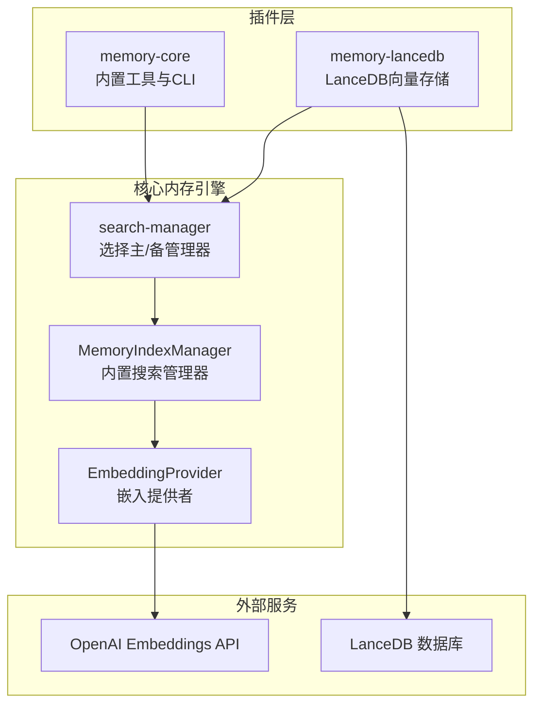
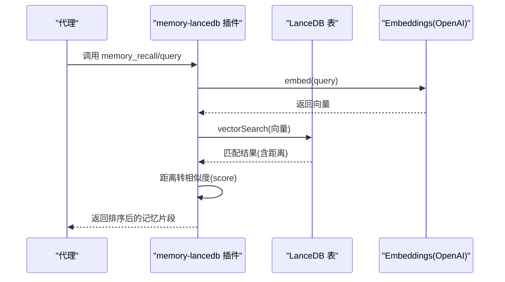
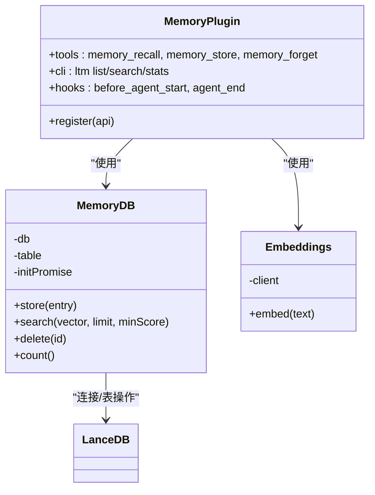
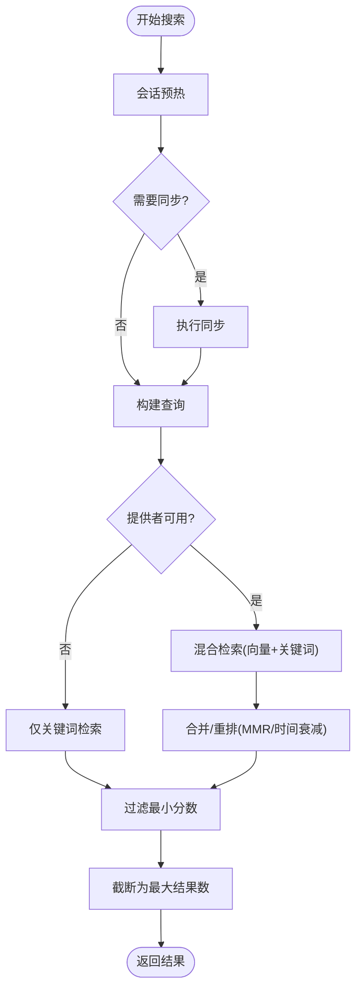
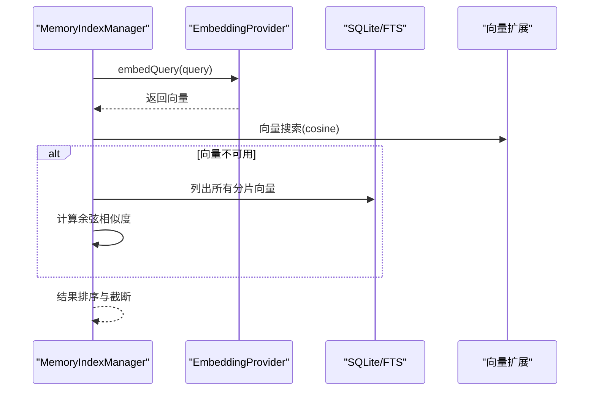
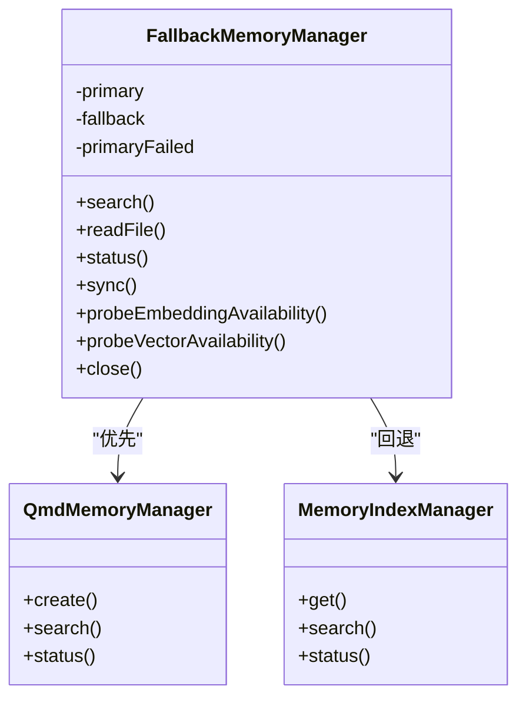
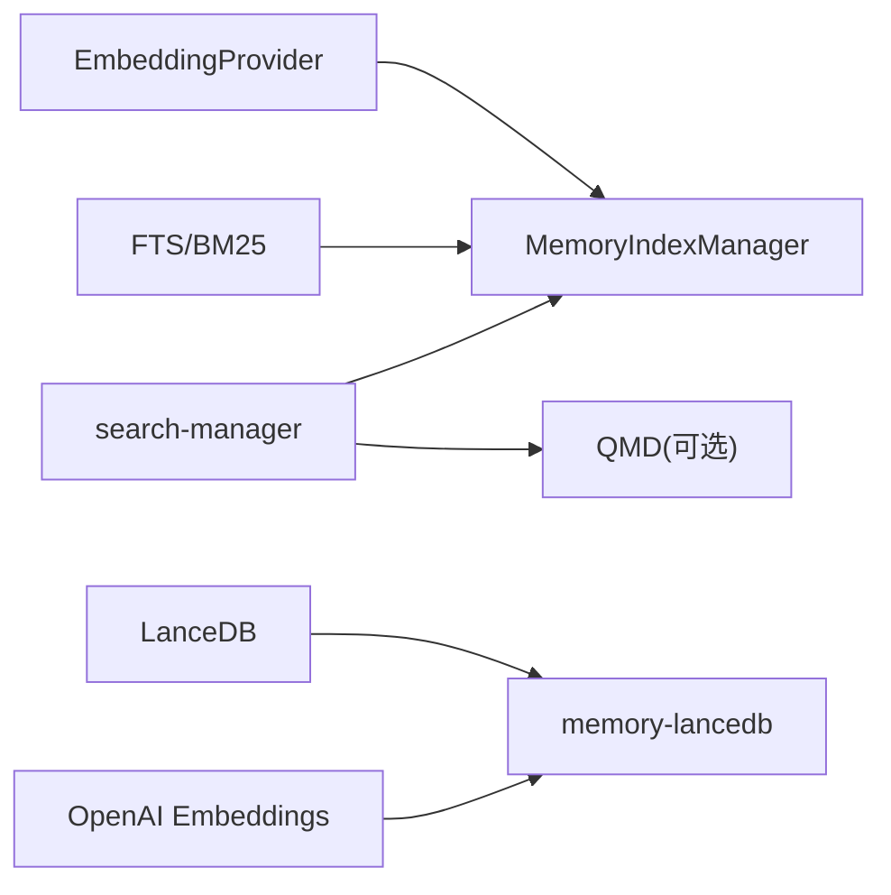

# Memory 插件开发

<cite>
**本文档引用的文件**
- [extensions/memory-core/index.ts](file://extensions/memory-core/index.ts)
- [extensions/memory-lancedb/index.ts](file://extensions/memory-lancedb/index.ts)
- [extensions/memory-lancedb/config.ts](file://extensions/memory-lancedb/config.ts)
- [extensions/memory-lancedb/openclaw.plugin.json](file://extensions/memory-lancedb/openclaw.plugin.json)
- [src/memory/index.ts](file://src/memory/index.ts)
- [src/memory/types.ts](file://src/memory/types.ts)
- [src/memory/manager.ts](file://src/memory/manager.ts)
- [src/memory/manager-sync-ops.ts](file://src/memory/manager-sync-ops.ts)
- [src/memory/manager-search.ts](file://src/memory/manager-search.ts)
- [src/memory/search-manager.ts](file://src/memory/search-manager.ts)
- [src/memory/embeddings.ts](file://src/memory/embeddings.ts)
- [src/memory/backend-config.ts](file://src/memory/backend-config.ts)
- [src/plugins/loader.ts](file://src/plugins/loader.ts)
- [src/commands/status.scan.ts](file://src/commands/status.scan.ts)
</cite>

## 目录
1. [简介](#简介)
2. [项目结构](#项目结构)
3. [核心组件](#核心组件)
4. [架构总览](#架构总览)
5. [详细组件分析](#详细组件分析)
6. [依赖关系分析](#依赖关系分析)
7. [性能考虑](#性能考虑)
8. [故障排查指南](#故障排查指南)
9. [结论](#结论)
10. [附录](#附录)

## 简介
本技术指南面向希望在 OpenClaw 中开发或扩展 Memory（记忆）插件的开发者。文档覆盖以下主题：
- 记忆存储插件的架构设计与实现方法：内存存储、向量数据库与持久化存储的集成方式
- 记忆检索算法、向量嵌入处理与查询优化策略
- 自定义记忆存储后端的完整实现步骤
- 插件与代理系统的记忆管理交互、数据同步与一致性保证
- 性能调优、索引策略与容量管理最佳实践

## 项目结构
OpenClaw 的 Memory 子系统由“内置搜索管理器”和“可插拔存储后端”两部分组成：
- 内置搜索管理器：负责向量化检索、关键词检索、混合检索、增量同步、缓存与状态报告等
- 存储后端：通过插件机制接入，如 LanceDB 向量存储插件
- 插件系统：统一注册工具、CLI 命令、生命周期钩子与服务

图表来源
- [src/memory/search-manager.ts:1-254](file://src/memory/search-manager.ts#L1-L254)
- [src/memory/manager.ts:1-841](file://src/memory/manager.ts#L1-L841)
- [extensions/memory-lancedb/index.ts:1-679](file://extensions/memory-lancedb/index.ts#L1-L679)

章节来源
- [src/memory/index.ts:1-12](file://src/memory/index.ts#L1-L12)
- [src/memory/types.ts:1-82](file://src/memory/types.ts#L1-L82)

## 核心组件
- MemorySearchManager 接口：统一的搜索、读取、状态、同步与探针能力
- MemoryIndexManager：内置搜索管理器，支持向量检索、关键词检索、混合检索、增量同步、批处理与只读恢复
- EmbeddingProvider：抽象远程/本地嵌入提供者，支持 OpenAI、Gemini、Voyage、Mistral、Ollama 与本地 node-llama-cpp
- 搜索管理器工厂：根据配置选择内置或 QMD 后端，并支持降级回退
- 插件接口：memory-core 提供基础工具与 CLI；memory-lancedb 提供 LanceDB 向量存储与自动回忆/捕获

章节来源
- [src/memory/types.ts:61-82](file://src/memory/types.ts#L61-L82)
- [src/memory/manager.ts:61-241](file://src/memory/manager.ts#L61-L241)
- [src/memory/embeddings.ts:29-58](file://src/memory/embeddings.ts#L29-L58)
- [src/memory/search-manager.ts:20-102](file://src/memory/search-manager.ts#L20-L102)
- [extensions/memory-core/index.ts:1-39](file://extensions/memory-core/index.ts#L1-L39)
- [extensions/memory-lancedb/index.ts:292-679](file://extensions/memory-lancedb/index.ts#L292-L679)

## 架构总览
下图展示了从插件到嵌入提供者、再到向量存储的完整调用链路与数据流。

图表来源
- [extensions/memory-lancedb/index.ts:324-358](file://extensions/memory-lancedb/index.ts#L324-L358)
- [extensions/memory-lancedb/index.ts:116-140](file://extensions/memory-lancedb/index.ts#L116-L140)
- [extensions/memory-lancedb/index.ts:163-186](file://extensions/memory-lancedb/index.ts#L163-L186)

## 详细组件分析

### 组件A：LanceDB 向量存储插件
该插件以 LanceDB 作为向量存储后端，使用 OpenAI Embeddings 生成向量，提供自动回忆与自动捕获能力。

图表来源
- [extensions/memory-lancedb/index.ts:59-157](file://extensions/memory-lancedb/index.ts#L59-L157)
- [extensions/memory-lancedb/index.ts:163-186](file://extensions/memory-lancedb/index.ts#L163-L186)
- [extensions/memory-lancedb/index.ts:292-679](file://extensions/memory-lancedb/index.ts#L292-L679)

实现要点
- 存储与检索：MemoryDB 封装 LanceDB 连接与表初始化，提供向量搜索与相似度转换
- 嵌入生成：Embeddings 使用 OpenAI 客户端按模型与维度生成向量
- 工具与 CLI：注册 recall/store/forget 工具与 ltm 命令
- 生命周期钩子：before_agent_start 自动注入上下文；agent_end 自动捕获用户输入

章节来源
- [extensions/memory-lancedb/index.ts:59-157](file://extensions/memory-lancedb/index.ts#L59-L157)
- [extensions/memory-lancedb/index.ts:163-186](file://extensions/memory-lancedb/index.ts#L163-L186)
- [extensions/memory-lancedb/index.ts:292-679](file://extensions/memory-lancedb/index.ts#L292-L679)

### 组件B：内置搜索管理器（MemoryIndexManager）
内置搜索管理器负责：
- 选择嵌入提供者（远程/本地），支持自动与回退
- 向量检索与关键词检索（FTS），以及混合检索
- 增量同步、批处理、只读数据库恢复
- 状态报告与探针（嵌入可用性、向量可用性）

图表来源
- [src/memory/manager.ts:259-367](file://src/memory/manager.ts#L259-L367)
- [src/memory/manager-search.ts:20-94](file://src/memory/manager-search.ts#L20-L94)
- [src/memory/manager-search.ts:136-192](file://src/memory/manager-search.ts#L136-L192)

章节来源
- [src/memory/manager.ts:61-241](file://src/memory/manager.ts#L61-L241)
- [src/memory/manager.ts:259-367](file://src/memory/manager.ts#L259-L367)
- [src/memory/manager-search.ts:20-94](file://src/memory/manager-search.ts#L20-L94)
- [src/memory/manager-search.ts:136-192](file://src/memory/manager-search.ts#L136-L192)

### 组件C：嵌入提供者与向量检索
- 嵌入提供者抽象：统一 embedQuery/embedBatch 接口，支持多提供商与本地模型
- 向量检索：cosine 距离计算与相似度转换；回退到纯 SQL 相似度匹配
- 关键词检索：FTS 查询构建与 BM25 排序

图表来源
- [src/memory/embeddings.ts:168-288](file://src/memory/embeddings.ts#L168-L288)
- [src/memory/manager-search.ts:20-94](file://src/memory/manager-search.ts#L20-L94)

章节来源
- [src/memory/embeddings.ts:29-58](file://src/memory/embeddings.ts#L29-L58)
- [src/memory/embeddings.ts:168-288](file://src/memory/embeddings.ts#L168-L288)
- [src/memory/manager-search.ts:20-94](file://src/memory/manager-search.ts#L20-L94)

### 组件D：搜索管理器工厂与回退机制
- 根据配置选择 QMD 或内置后端
- QMD 失败时自动回退到内置搜索管理器
- 缓存主 QMD 管理器实例，失败后清理缓存以便下次重建

图表来源
- [src/memory/search-manager.ts:104-247](file://src/memory/search-manager.ts#L104-L247)

章节来源
- [src/memory/search-manager.ts:20-102](file://src/memory/search-manager.ts#L20-L102)
- [src/memory/search-manager.ts:104-247](file://src/memory/search-manager.ts#L104-L247)

### 组件E：插件系统与内存槽位
- 插件加载器根据 memory 槽位决定启用哪个 memory 插件
- 支持 memory-core 与 memory-lancedb 等插件
- 当 memory 槽位为 none 时禁用内存功能

章节来源
- [src/plugins/loader.ts:1191-1230](file://src/plugins/loader.ts#L1191-L1230)
- [src/commands/status.scan.ts:72-89](file://src/commands/status.scan.ts#L72-L89)
- [extensions/memory-core/index.ts:1-39](file://extensions/memory-core/index.ts#L1-L39)
- [extensions/memory-lancedb/openclaw.plugin.json:1-89](file://extensions/memory-lancedb/openclaw.plugin.json#L1-L89)

## 依赖关系分析
- 内置搜索管理器依赖嵌入提供者与 SQLite/FTS；当向量扩展不可用时回退到纯 SQL 相似度
- LanceDB 插件依赖 LanceDB 与 OpenAI SDK；提供自动回忆与自动捕获钩子
- 搜索管理器工厂在 QMD 不可用时回退到内置管理器

图表来源
- [src/memory/embeddings.ts:168-288](file://src/memory/embeddings.ts#L168-L288)
- [src/memory/manager.ts:259-367](file://src/memory/manager.ts#L259-L367)
- [extensions/memory-lancedb/index.ts:292-679](file://extensions/memory-lancedb/index.ts#L292-L679)
- [src/memory/search-manager.ts:20-102](file://src/memory/search-manager.ts#L20-L102)

章节来源
- [src/memory/manager.ts:259-367](file://src/memory/manager.ts#L259-L367)
- [extensions/memory-lancedb/index.ts:292-679](file://extensions/memory-lancedb/index.ts#L292-L679)
- [src/memory/search-manager.ts:20-102](file://src/memory/search-manager.ts#L20-L102)

## 性能考虑
- 向量检索
  - 使用 cosine 距离与向量索引（LanceDB）提升检索速度
  - 相似度转换：将 L2 距离映射到 0-1 分数范围，便于阈值过滤
- 混合检索
  - 向量权重与文本权重平衡，MMR 重排减少冗余，时间衰减提升时效性
- 批处理与并发
  - 批处理失败上限与等待策略，避免雪崩
- 只读数据库恢复
  - 自动检测只读错误并重建连接，保障稳定性
- 增量同步
  - 会话增量与文件监控，降低全量同步开销

章节来源
- [extensions/memory-lancedb/index.ts:116-140](file://extensions/memory-lancedb/index.ts#L116-L140)
- [src/memory/manager.ts:259-367](file://src/memory/manager.ts#L259-L367)
- [src/memory/manager.ts:454-590](file://src/memory/manager.ts#L454-L590)

## 故障排查指南
- 嵌入提供者不可用
  - 检查 API Key 是否缺失或网络问题；查看 providerUnavailableReason
  - 在缺少密钥时可降级到 FTS-only 模式
- 向量扩展不可用
  - probeVectorAvailability 返回 false；检查扩展路径与加载错误
- 只读数据库错误
  - 自动触发只读恢复流程；若持续失败，检查权限与磁盘空间
- QMD 后端异常
  - 回退到内置搜索管理器；检查日志中的 lastError 与 fallback 信息

章节来源
- [src/memory/manager.ts:778-804](file://src/memory/manager.ts#L778-L804)
- [src/memory/manager.ts:505-589](file://src/memory/manager.ts#L505-L589)
- [src/memory/search-manager.ts:104-247](file://src/memory/search-manager.ts#L104-L247)

## 结论
OpenClaw 的 Memory 子系统通过“内置搜索管理器 + 可插拔存储后端”的架构实现了高扩展性与高可用性。内置管理器提供稳健的向量/关键词混合检索与增量同步能力；插件机制允许灵活接入不同存储后端（如 LanceDB）。结合批处理、只读恢复与回退策略，系统在复杂场景下仍能保持稳定与高性能。

## 附录

### 实现自定义记忆存储后端的步骤
- 定义配置模式与 UI 提示（参考 memory-lancedb 的配置与插件清单）
- 注册工具与 CLI 命令，提供 recall/store/forget 能力
- 实现生命周期钩子：before_agent_start（自动回忆）、agent_end（自动捕获）
- 提供服务注册与启动/停止逻辑
- 在搜索管理器工厂中接入新后端，并在异常时支持回退

章节来源
- [extensions/memory-lancedb/config.ts:1-181](file://extensions/memory-lancedb/config.ts#L1-L181)
- [extensions/memory-lancedb/openclaw.plugin.json:1-89](file://extensions/memory-lancedb/openclaw.plugin.json#L1-L89)
- [extensions/memory-lancedb/index.ts:292-679](file://extensions/memory-lancedb/index.ts#L292-L679)
- [src/memory/search-manager.ts:20-102](file://src/memory/search-manager.ts#L20-L102)

### 记忆检索算法与查询优化
- 向量检索：cosine 距离，相似度转换，阈值过滤
- 关键词检索：BM25 排序，查询扩展
- 混合检索：加权融合、MMR 去重、时间衰减
- 增量同步：会话增量、文件监控、批处理与去抖

章节来源
- [src/memory/manager-search.ts:20-94](file://src/memory/manager-search.ts#L20-L94)
- [src/memory/manager-search.ts:136-192](file://src/memory/manager-search.ts#L136-L192)
- [src/memory/manager.ts:259-367](file://src/memory/manager.ts#L259-L367)
- [src/memory/manager-sync-ops.ts:54-95](file://src/memory/manager-sync-ops.ts#L54-L95)

### 插件与代理系统的交互
- 插件通过 OpenClawPluginApi 注册工具、CLI 与服务
- 生命周期钩子在代理开始前注入上下文，在代理结束后捕获记忆
- 搜索管理器在查询前进行会话预热与必要同步

章节来源
- [extensions/memory-lancedb/index.ts:292-679](file://extensions/memory-lancedb/index.ts#L292-L679)
- [src/memory/search-manager.ts:20-102](file://src/memory/search-manager.ts#L20-L102)