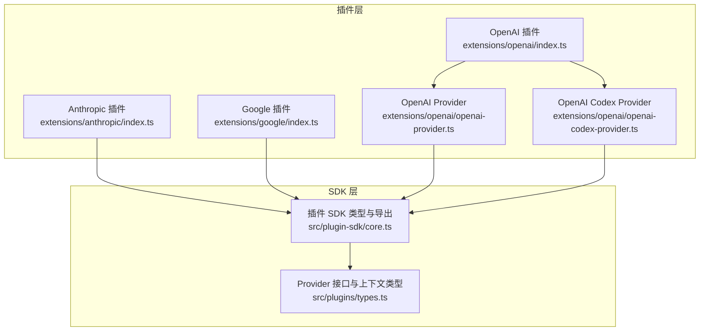
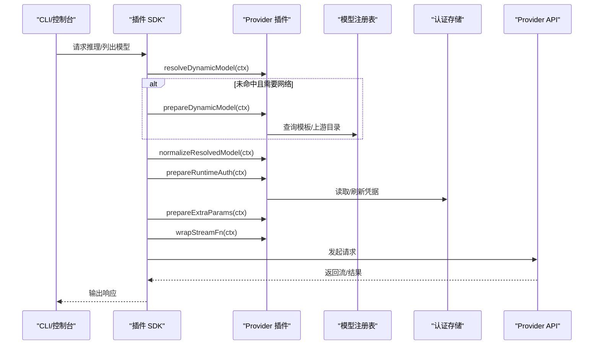
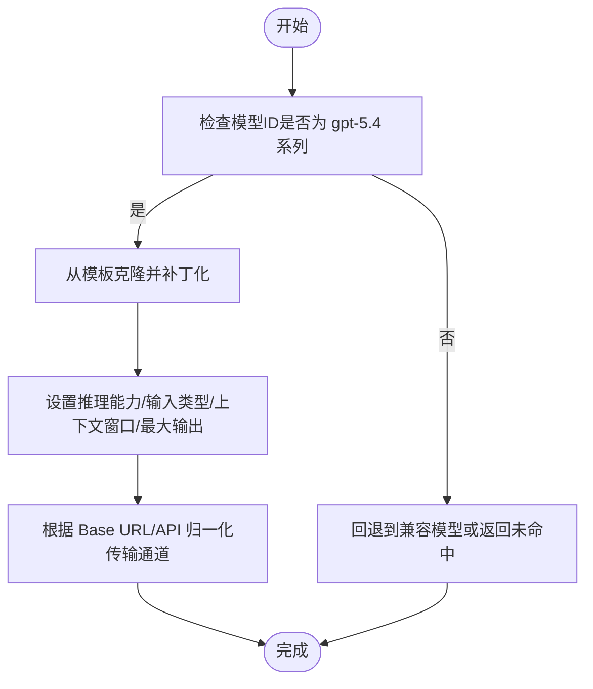
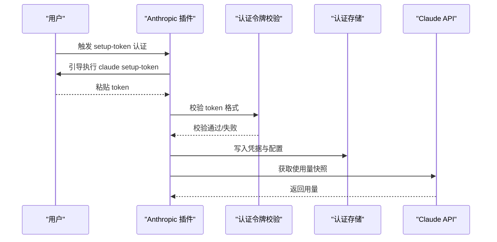
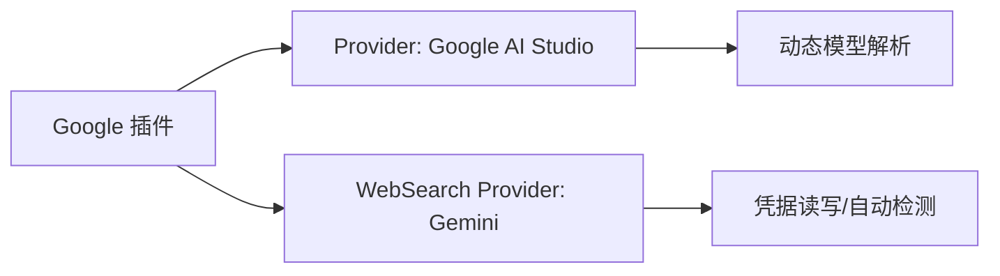
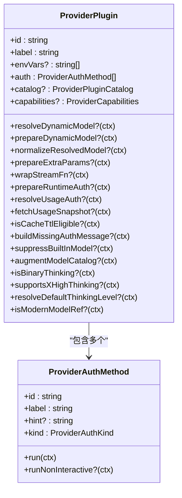
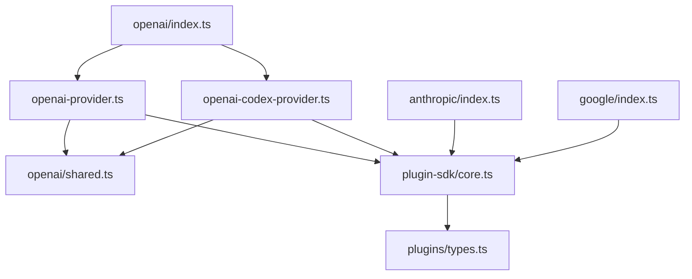

# Provider 插件开发

<cite>
**本文引用的文件**
- [extensions/openai/index.ts](file://extensions/openai/index.ts)
- [extensions/openai/openai-provider.ts](file://extensions/openai/openai-provider.ts)
- [extensions/openai/openai-codex-provider.ts](file://extensions/openai/openai-codex-provider.ts)
- [extensions/openai/shared.ts](file://extensions/openai/shared.ts)
- [extensions/anthropic/index.ts](file://extensions/anthropic/index.ts)
- [extensions/google/index.ts](file://extensions/google/index.ts)
- [src/plugin-sdk/core.ts](file://src/plugin-sdk/core.ts)
- [src/plugins/types.ts](file://src/plugins/types.ts)
- [src/commands/auth-token.ts](file://src/commands/auth-token.ts)
- [src/agents/auth-profiles/profiles.ts](file://src/agents/auth-profiles/profiles.ts)
</cite>

## 目录
1. [简介](#简介)
2. [项目结构](#项目结构)
3. [核心组件](#核心组件)
4. [架构总览](#架构总览)
5. [详细组件分析](#详细组件分析)
6. [依赖关系分析](#依赖关系分析)
7. [性能考量](#性能考量)
8. [故障排除指南](#故障排除指南)
9. [结论](#结论)
10. [附录](#附录)

## 简介
本指南面向需要为 OpenClaw 开发“Provider 插件”的工程师，系统讲解如何对接主流 AI 模型提供商（如 OpenAI、Anthropic、Google Gemini 等），涵盖插件架构、配置结构、认证机制、API 调用封装、错误处理策略、与代理系统的交互模式、参数转换与响应处理、配置验证、性能优化与故障排除等。

## 项目结构
OpenClaw 将 Provider 插件集中放置于 extensions/<provider>/ 目录下，并通过统一的插件 SDK 注册到系统中。每个 Provider 插件通常包含：
- 插件入口：负责声明插件元数据与注册 Provider
- Provider 实现：定义动态模型解析、认证、使用量查询、能力开关等
- 共享工具：复用的模型匹配、模板克隆、URL 判定等逻辑

**图表来源**
- [extensions/openai/index.ts:1-17](file://extensions/openai/index.ts#L1-L17)
- [extensions/openai/openai-provider.ts:1-153](file://extensions/openai/openai-provider.ts#L1-L153)
- [extensions/openai/openai-codex-provider.ts:1-254](file://extensions/openai/openai-codex-provider.ts#L1-L254)
- [extensions/anthropic/index.ts:1-319](file://extensions/anthropic/index.ts#L1-L319)
- [extensions/google/index.ts:1-47](file://extensions/google/index.ts#L1-L47)
- [src/plugin-sdk/core.ts:1-139](file://src/plugin-sdk/core.ts#L1-L139)
- [src/plugins/types.ts:545-738](file://src/plugins/types.ts#L545-L738)

**章节来源**
- [extensions/openai/index.ts:1-17](file://extensions/openai/index.ts#L1-L17)
- [extensions/openai/openai-provider.ts:1-153](file://extensions/openai/openai-provider.ts#L1-L153)
- [extensions/openai/openai-codex-provider.ts:1-254](file://extensions/openai/openai-codex-provider.ts#L1-L254)
- [extensions/anthropic/index.ts:1-319](file://extensions/anthropic/index.ts#L1-L319)
- [extensions/google/index.ts:1-47](file://extensions/google/index.ts#L1-L47)
- [src/plugin-sdk/core.ts:1-139](file://src/plugin-sdk/core.ts#L1-L139)
- [src/plugins/types.ts:545-738](file://src/plugins/types.ts#L545-L738)

## 核心组件
- Provider 插件接口与上下文
  - ProviderPlugin：插件对外暴露的能力集合，包括认证、动态模型解析、运行时参数准备、流包装、使用量查询、能力开关、现代模型识别、默认思考级别等
  - 各类上下文类型：用于在不同阶段注入配置、环境变量、模型注册表、超时、HTTP 客户端等
- 插件 SDK 导出
  - 提供空配置 Schema、OAuth 结果构建器、沙箱后端、远程命令、设备配对、密钥文件读取、网关绑定地址解析等通用能力
- 认证与凭据管理
  - 支持多种认证方式：OAuth、API Key、Token、设备码等；提供凭据规范化、存储、排序、标记“最近一次有效”等能力
- 动态模型解析与兼容性
  - 通过模板克隆与补丁化，实现“上游未收录的新模型”向前兼容；支持传输层切换（例如 OpenAI 响应通道与 Codex 响应通道）
- 使用量查询
  - 针对不同 Provider 的使用量/配额查询接口进行封装，统一返回格式

**章节来源**
- [src/plugins/types.ts:545-738](file://src/plugins/types.ts#L545-L738)
- [src/plugin-sdk/core.ts:63-139](file://src/plugin-sdk/core.ts#L63-L139)
- [src/commands/auth-token.ts:1-39](file://src/commands/auth-token.ts#L1-L39)
- [src/agents/auth-profiles/profiles.ts:1-116](file://src/agents/auth-profiles/profiles.ts#L1-L116)

## 架构总览
Provider 插件在启动时由插件入口注册到 OpenClaw，随后在以下场景被调用：
- 模型解析：当请求的模型不在本地目录时，调用 resolveDynamicModel 或 prepareDynamicModel + resolveDynamicModel
- 运行时认证：prepareRuntimeAuth 在推理前交换或刷新凭证
- 参数准备：prepareExtraParams 对 extraParams 进行标准化
- 流包装：wrapStreamFn 在通用流封装之后再做 Provider 特有处理
- 使用量查询：resolveUsageAuth + fetchUsageSnapshot 获取配额/用量快照

**图表来源**
- [src/plugins/types.ts:581-627](file://src/plugins/types.ts#L581-L627)
- [src/plugins/types.ts:636-663](file://src/plugins/types.ts#L636-L663)
- [src/plugins/types.ts:377-396](file://src/plugins/types.ts#L377-L396)

## 详细组件分析

### OpenAI Provider 插件
- 插件入口
  - 注册两个 Provider：OpenAI 与 OpenAI Codex
- OpenAI Provider
  - 动态模型解析：针对 gpt-5.4 系列，通过模板克隆与补丁化生成运行时模型，设置推理能力、输入类型、上下文窗口与最大输出
  - 传输层归一：当使用 OpenAI 原生 API 时自动切换到 openai-responses 通道
  - 现代模型识别：gpt-5.4/5.2/5.0 等
  - 缺失认证提示：当仅存在 Codex OAuth 时，给出明确提示
  - 内置模型抑制：对特定 Spark 模型进行抑制并提示
  - 目录增强：将 gpt-5.4 与 gpt-5.4-pro 的目录项补充到最终目录
- OpenAI Codex Provider
  - 认证：浏览器 OAuth 登录，返回访问/刷新令牌与过期时间
  - 目录：仅在存在对应凭据时才暴露目录
  - 动态模型解析：gpt-5.4、gpt-5.3-codex-spark 等，自动切换到 openai-codex-responses 通道与固定 Base URL
  - 传输层归一：根据 API 与 Base URL 自动选择 Codex 通道
  - 思考级别：支持 xhigh
  - 使用量查询：通过 fetchCodexUsage 获取用量快照
  - 目录增强：补充 gpt-5.4 与 spark 模型条目

**图表来源**
- [extensions/openai/openai-provider.ts:41-84](file://extensions/openai/openai-provider.ts#L41-L84)
- [extensions/openai/shared.ts:25-49](file://extensions/openai/shared.ts#L25-L49)

**章节来源**
- [extensions/openai/index.ts:1-17](file://extensions/openai/index.ts#L1-L17)
- [extensions/openai/openai-provider.ts:1-153](file://extensions/openai/openai-provider.ts#L1-L153)
- [extensions/openai/openai-codex-provider.ts:1-254](file://extensions/openai/openai-codex-provider.ts#L1-L254)
- [extensions/openai/shared.ts:1-66](file://extensions/openai/shared.ts#L1-L66)

### Anthropic Provider 插件
- 认证：支持 setup-token（claude setup-token）方式，提供交互式与非交互式两种流程
- 动态模型解析：对 Claude 4.6 系列进行前向兼容映射，将 dash 与 dot 格式映射到模板模型
- 现代模型识别：对现代模型前缀进行判定
- 默认思考级别：对特定模型族返回自适应策略
- 使用量查询：通过 resolveOAuthToken 获取令牌，再调用 fetchClaudeUsage 获取用量快照
- 提示缓存 TTL：返回可缓存状态

**图表来源**
- [extensions/anthropic/index.ts:123-192](file://extensions/anthropic/index.ts#L123-L192)
- [extensions/anthropic/index.ts:311-312](file://extensions/anthropic/index.ts#L311-L312)
- [src/commands/auth-token.ts:26-38](file://src/commands/auth-token.ts#L26-L38)

**章节来源**
- [extensions/anthropic/index.ts:1-319](file://extensions/anthropic/index.ts#L1-L319)
- [src/commands/auth-token.ts:1-39](file://src/commands/auth-token.ts#L1-L39)

### Google (Gemini) Provider 插件
- 注册 Provider：Google AI Studio，支持 GEMINI_API_KEY/GOOGLE_API_KEY 环境变量
- 动态模型解析：对现代模型进行前向兼容映射
- Web 搜索 Provider：以插件形式注册 Gemini 的网络搜索能力，支持凭据读写与自动检测顺序

**图表来源**
- [extensions/google/index.ts:1-47](file://extensions/google/index.ts#L1-L47)

**章节来源**
- [extensions/google/index.ts:1-47](file://extensions/google/index.ts#L1-L47)

### 插件 SDK 与类型系统
- ProviderPlugin 接口：定义认证、目录、动态模型解析、运行时参数、流包装、使用量查询、能力开关、现代模型识别、默认思考级别、内置模型抑制、目录增强等钩子
- 上下文类型：贯穿插件生命周期，提供配置、环境、模型注册表、超时、HTTP 客户端、凭据解析等能力
- SDK 辅助：emptyPluginConfigSchema、OAuth 结果构建器、沙箱后端、远程命令、设备配对、密钥文件读取、网关绑定地址解析等

**图表来源**
- [src/plugins/types.ts:545-738](file://src/plugins/types.ts#L545-L738)

**章节来源**
- [src/plugin-sdk/core.ts:1-139](file://src/plugin-sdk/core.ts#L1-L139)
- [src/plugins/types.ts:545-738](file://src/plugins/types.ts#L545-L738)

## 依赖关系分析
- 插件入口依赖 SDK 导出的 emptyPluginConfigSchema 与 registerProvider
- Provider 实现依赖共享工具（如模板克隆、URL 匹配、模型兼容归一）
- 认证流程依赖凭据存储与令牌校验工具
- 使用量查询依赖 Provider 自身的 resolveUsageAuth + fetchUsageSnapshot

**图表来源**
- [extensions/openai/index.ts:1-17](file://extensions/openai/index.ts#L1-L17)
- [extensions/openai/openai-provider.ts:1-153](file://extensions/openai/openai-provider.ts#L1-L153)
- [extensions/openai/openai-codex-provider.ts:1-254](file://extensions/openai/openai-codex-provider.ts#L1-L254)
- [extensions/openai/shared.ts:1-66](file://extensions/openai/shared.ts#L1-L66)
- [extensions/anthropic/index.ts:1-319](file://extensions/anthropic/index.ts#L1-L319)
- [extensions/google/index.ts:1-47](file://extensions/google/index.ts#L1-L47)
- [src/plugin-sdk/core.ts:1-139](file://src/plugin-sdk/core.ts#L1-L139)
- [src/plugins/types.ts:545-738](file://src/plugins/types.ts#L545-L738)

**章节来源**
- [extensions/openai/index.ts:1-17](file://extensions/openai/index.ts#L1-L17)
- [extensions/openai/openai-provider.ts:1-153](file://extensions/openai/openai-provider.ts#L1-L153)
- [extensions/openai/openai-codex-provider.ts:1-254](file://extensions/openai/openai-codex-provider.ts#L1-L254)
- [extensions/openai/shared.ts:1-66](file://extensions/openai/shared.ts#L1-L66)
- [extensions/anthropic/index.ts:1-319](file://extensions/anthropic/index.ts#L1-L319)
- [extensions/google/index.ts:1-47](file://extensions/google/index.ts#L1-L47)
- [src/plugin-sdk/core.ts:1-139](file://src/plugin-sdk/core.ts#L1-L139)
- [src/plugins/types.ts:545-738](file://src/plugins/types.ts#L545-L738)

## 性能考量
- 动态模型解析尽量保持同步与无副作用，网络 I/O 放在 prepareDynamicModel 中异步预热
- 传输层归一化避免重复切换，减少不必要的 Base URL 与 API 字段变更
- 使用量查询采用超时包装与统一错误处理，避免阻塞主流程
- 对现代模型与缓存 TTL 的判断尽量轻量，避免在热路径上做昂贵计算
- 凭据存储与读取使用带锁更新，确保并发安全

## 故障排除指南
- 认证失败
  - 检查环境变量与凭据存储是否正确；对于 Anthropic，确认 setup-token 格式与长度
  - 对于 OpenAI Codex，确认 OAuth 登录流程已完成且返回了有效的访问/刷新令牌
- 模型不可用
  - 若出现“未知模型”，检查是否被内置模型抑制（如 Spark 模型仅支持 Codex 通道）
  - 确认动态模型解析是否命中模板，必要时在 prepareDynamicModel 中预热上游目录
- 传输异常
  - 检查 Base URL 与 API 字段是否被错误地归一化为 Codex 通道
  - 确认 extraParams 是否包含不被 Provider 支持的键
- 使用量查询失败
  - 确认 resolveUsageAuth 返回的令牌可用，且 fetchUsageSnapshot 的超时与 HTTP 客户端配置正确

**章节来源**
- [src/commands/auth-token.ts:26-38](file://src/commands/auth-token.ts#L26-L38)
- [src/agents/auth-profiles/profiles.ts:45-64](file://src/agents/auth-profiles/profiles.ts#L45-L64)
- [extensions/openai/openai-codex-provider.ts:135-160](file://extensions/openai/openai-codex-provider.ts#L135-L160)
- [extensions/anthropic/index.ts:311-312](file://extensions/anthropic/index.ts#L311-L312)

## 结论
通过 Provider 插件，OpenClaw 能够以一致的接口适配多家模型提供商。遵循本文档的架构与最佳实践，开发者可以快速实现新的 Provider 插件，覆盖认证、模型解析、参数转换、流包装与使用量查询等关键环节，并在保证性能与稳定性的同时，提供良好的用户体验。

## 附录
- 插件配置结构
  - 使用 emptyPluginConfigSchema 定义插件级配置的 JSON Schema 与 UI 提示
  - Provider 级别通过 envVars 暴露关键环境变量，便于用户理解与配置
- 认证机制
  - 支持 OAuth、API Key、Token、设备码等多种方式；提供交互式与非交互式两种认证流程
  - 认证结果通过 ProviderAuthResult 统一返回，包含 profiles、configPatch、defaultModel 等
- API 调用封装与错误处理
  - 使用 prepareRuntimeAuth 进行凭证交换与刷新
  - 使用 prepareExtraParams 与 wrapStreamFn 进行参数标准化与流包装
  - 使用 resolveUsageAuth 与 fetchUsageSnapshot 获取使用量快照
- 与代理系统的交互模式
  - 插件通过 registerProvider 注册自身能力，随后在模型解析、认证、推理、使用量查询等阶段被 SDK 调用
  - 插件内部可利用 SDK 提供的远程命令、沙箱后端、密钥文件读取等能力

**章节来源**
- [src/plugin-sdk/core.ts:63-139](file://src/plugin-sdk/core.ts#L63-L139)
- [src/plugins/types.ts:545-738](file://src/plugins/types.ts#L545-L738)
- [extensions/openai/index.ts:1-17](file://extensions/openai/index.ts#L1-L17)
- [extensions/anthropic/index.ts:1-319](file://extensions/anthropic/index.ts#L1-L319)
- [extensions/google/index.ts:1-47](file://extensions/google/index.ts#L1-L47)