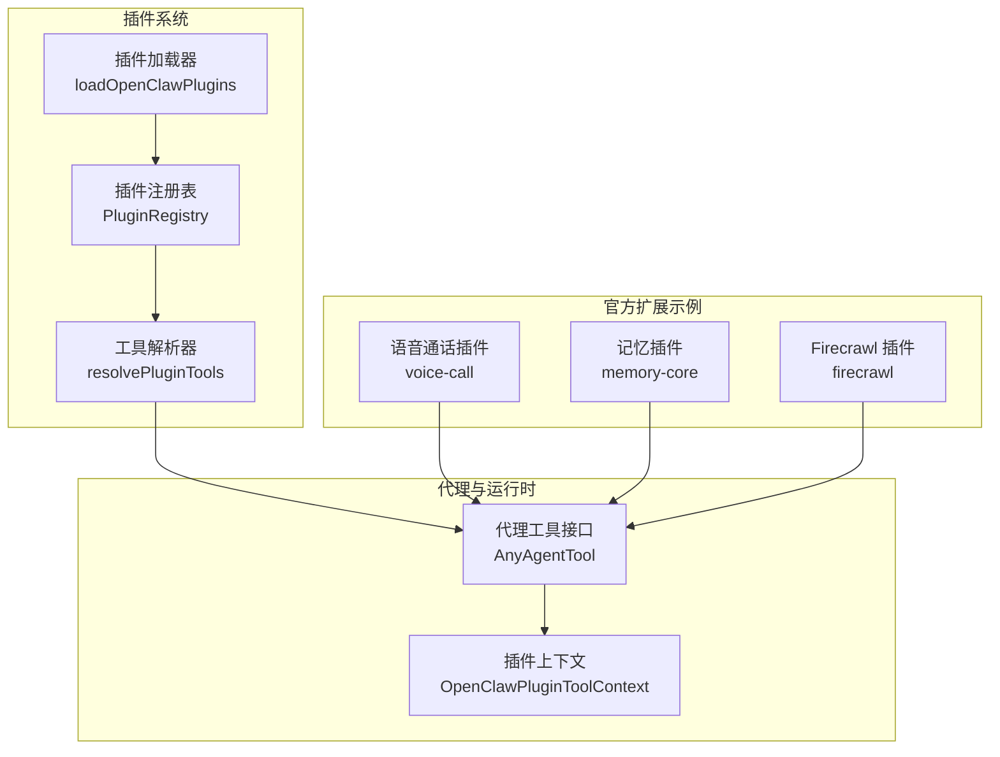
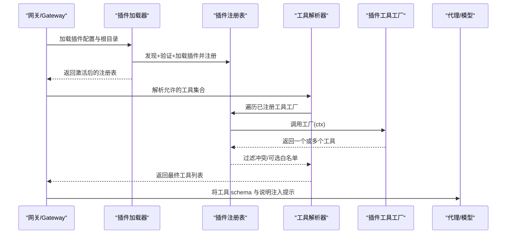
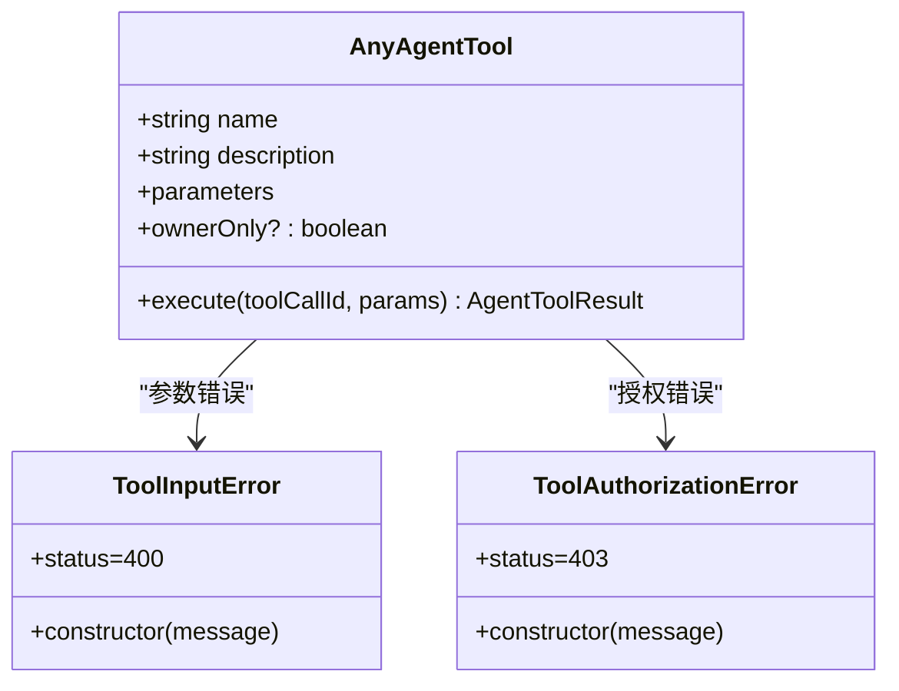
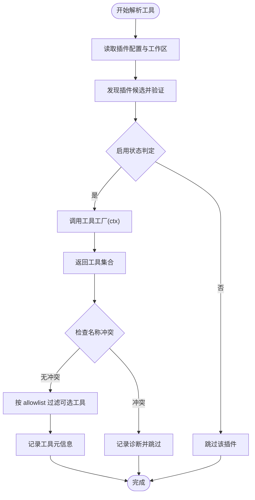
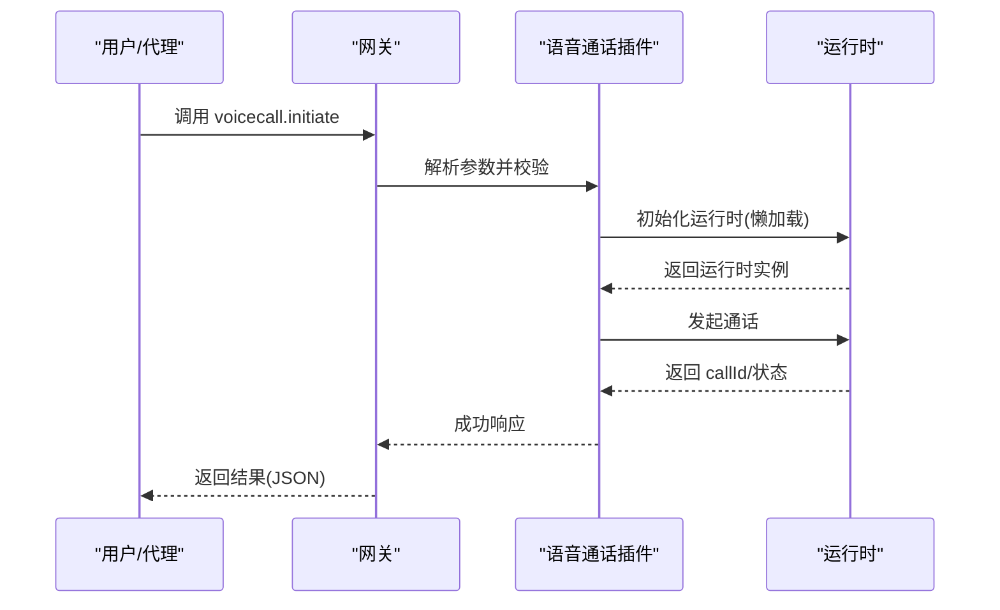
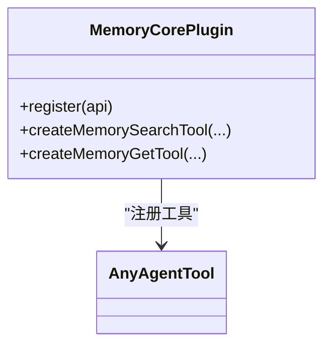
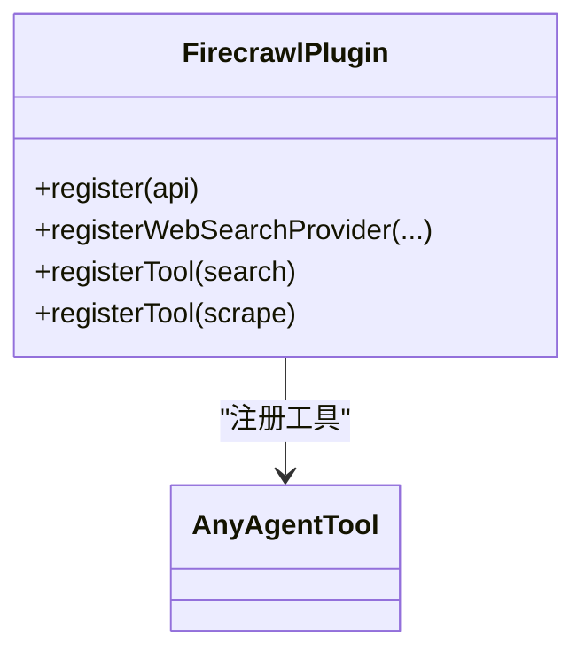
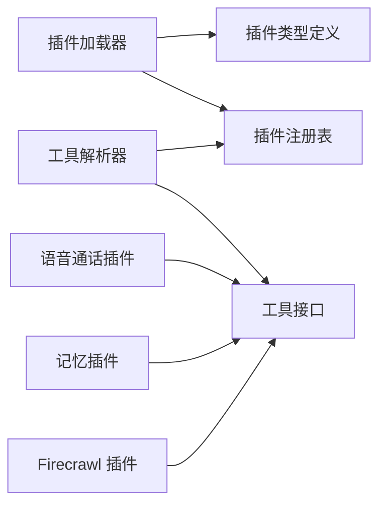

# Tool 插件开发

<cite>
**本文引用的文件**
- [src/plugin-sdk/index.ts](file://src/plugin-sdk/index.ts)
- [src/plugins/tools.ts](file://src/plugins/tools.ts)
- [docs/tools/index.md](file://docs/tools/index.md)
- [docs/tools/plugin.md](file://docs/tools/plugin.md)
- [src/agents/tools/common.ts](file://src/agents/tools/common.ts)
- [src/plugins/loader.ts](file://src/plugins/loader.ts)
- [src/plugins/types.ts](file://src/plugins/types.ts)
- [extensions/voice-call/index.ts](file://extensions/voice-call/index.ts)
- [extensions/memory-core/index.ts](file://extensions/memory-core/index.ts)
- [extensions/firecrawl/index.ts](file://extensions/firecrawl/index.ts)
- [extensions/shared/runtime.ts](file://extensions/shared/runtime.ts)
</cite>

## 目录
1. [简介](#简介)
2. [项目结构](#项目结构)
3. [核心组件](#核心组件)
4. [架构总览](#架构总览)
5. [详细组件分析](#详细组件分析)
6. [依赖分析](#依赖分析)
7. [性能考量](#性能考量)
8. [故障排查指南](#故障排查指南)
9. [结论](#结论)
10. [附录](#附录)

## 简介
本指南面向希望在 OpenClaw 中开发“工具（Tool）”插件的工程师，系统讲解如何基于插件 SDK 定义、注册与暴露工具，覆盖浏览器控制、网页抓取、代码辅助、记忆存储、语音通话等常见能力，并说明工具接口定义、参数校验、执行流程、结果处理、与代理系统的集成、权限与安全、并发与性能优化、以及错误处理最佳实践。

## 项目结构
OpenClaw 的工具插件体系由“插件加载器—插件注册表—工具解析—代理调用”构成，核心入口与类型定义集中在插件 SDK 与工具解析模块中；官方扩展（如 voice-call、memory-core、firecrawl）作为参考实现展示了如何通过插件 API 注册工具、CLI、服务与网关方法。

图示来源
- [src/plugins/loader.ts:774-820](file://src/plugins/loader.ts#L774-L820)
- [src/plugins/tools.ts:45-142](file://src/plugins/tools.ts#L45-L142)
- [src/plugins/types.ts:89-97](file://src/plugins/types.ts#L89-L97)
- [extensions/voice-call/index.ts:146-562](file://extensions/voice-call/index.ts#L146-L562)
- [extensions/memory-core/index.ts:4-36](file://extensions/memory-core/index.ts#L4-L36)
- [extensions/firecrawl/index.ts:8-21](file://extensions/firecrawl/index.ts#L8-L21)

章节来源
- [src/plugins/loader.ts:774-820](file://src/plugins/loader.ts#L774-L820)
- [src/plugins/tools.ts:45-142](file://src/plugins/tools.ts#L45-L142)
- [src/plugins/types.ts:89-97](file://src/plugins/types.ts#L89-L97)

## 核心组件
- 插件 SDK 导出：统一导出工具类型、通道适配器、运行时、HTTP/Webhook 工具、SSRF/鉴权辅助等，便于插件作者按需引入子路径。
- 工具解析器：从已加载插件注册表中解析可用工具，支持名称冲突检测、可选工具白名单过滤、重复工厂调用保护。
- 代理工具接口：标准化工具定义（名称、描述、参数模式、执行函数），并提供通用参数读取与错误类型。
- 插件加载器：负责发现候选插件根目录、读取清单、安全校验、启用状态决策、动态加载与注册，最终激活全局注册表。
- 官方扩展示例：语音通话（网关方法+工具）、记忆（搜索/获取工具+CLI）、Firecrawl（网页搜索/抓取工具）。

章节来源
- [src/plugin-sdk/index.ts:1-120](file://src/plugin-sdk/index.ts#L1-L120)
- [src/plugins/tools.ts:11-142](file://src/plugins/tools.ts#L11-L142)
- [src/agents/tools/common.ts:8-34](file://src/agents/tools/common.ts#L8-L34)
- [src/plugins/loader.ts:774-820](file://src/plugins/loader.ts#L774-L820)
- [extensions/voice-call/index.ts:146-562](file://extensions/voice-call/index.ts#L146-L562)
- [extensions/memory-core/index.ts:4-36](file://extensions/memory-core/index.ts#L4-L36)
- [extensions/firecrawl/index.ts:8-21](file://extensions/firecrawl/index.ts#L8-L21)

## 架构总览
下图展示从插件加载到工具暴露给代理的端到端流程，包括配置解析、工具工厂调用、冲突与白名单过滤、以及工具元数据记录。

图示来源
- [src/plugins/loader.ts:774-820](file://src/plugins/loader.ts#L774-L820)
- [src/plugins/tools.ts:45-142](file://src/plugins/tools.ts#L45-L142)
- [src/plugins/types.ts:89-97](file://src/plugins/types.ts#L89-L97)

章节来源
- [src/plugins/loader.ts:774-820](file://src/plugins/loader.ts#L774-L820)
- [src/plugins/tools.ts:45-142](file://src/plugins/tools.ts#L45-L142)

## 详细组件分析

### 组件一：工具接口与参数校验
- 工具接口：统一的 AnyAgentTool 类型，扩展 ownerOnly 受限标记；工具执行函数返回标准 AgentToolResult 结构，支持文本与图片内容。
- 参数读取：提供字符串、数字、数组、反应动作等常用参数读取器，内置必填/去空/整数/严格解析等选项；读取失败抛出 ToolInputError 或 ToolAuthorizationError。
- 图像结果封装：提供 imageResult/imageResultFromFile，自动注入媒体占位符与 Sanitization 限制，确保输出安全可控。

图示来源
- [src/agents/tools/common.ts:8-34](file://src/agents/tools/common.ts#L8-L34)
- [src/agents/tools/common.ts:61-142](file://src/agents/tools/common.ts#L61-L142)
- [src/agents/tools/common.ts:244-289](file://src/agents/tools/common.ts#L244-L289)

章节来源
- [src/agents/tools/common.ts:8-34](file://src/agents/tools/common.ts#L8-L34)
- [src/agents/tools/common.ts:61-142](file://src/agents/tools/common.ts#L61-L142)
- [src/agents/tools/common.ts:244-289](file://src/agents/tools/common.ts#L244-L289)

### 组件二：插件加载与工具解析
- 插件加载：按配置扫描候选路径、安全校验、启用状态决策、动态加载与注册，构建全局注册表。
- 工具解析：遍历注册表中的工具工厂，调用工厂生成工具；对同名/冲突进行去重与告警；支持可选工具按 allowlist 白名单过滤；记录工具元信息（插件 id、是否可选）。

图示来源
- [src/plugins/loader.ts:774-820](file://src/plugins/loader.ts#L774-L820)
- [src/plugins/tools.ts:45-142](file://src/plugins/tools.ts#L45-L142)

章节来源
- [src/plugins/loader.ts:774-820](file://src/plugins/loader.ts#L774-L820)
- [src/plugins/tools.ts:45-142](file://src/plugins/tools.ts#L45-L142)

### 组件三：官方扩展示例（语音通话）
- 网关方法：注册 voicecall.initiate/continue/speak/end/status/start 等 RPC 方法，参数校验与错误响应统一处理。
- 工具：注册 voice_call 工具，支持 initiate_call/continue_call/speak_to_user/end_call/get_status 等动作，参数校验与错误包装一致。
- CLI 与服务：注册 CLI 命令与后台服务生命周期钩子，按需启动/停止运行时。

图示来源
- [extensions/voice-call/index.ts:261-397](file://extensions/voice-call/index.ts#L261-L397)
- [extensions/voice-call/index.ts:399-519](file://extensions/voice-call/index.ts#L399-L519)

章节来源
- [extensions/voice-call/index.ts:146-562](file://extensions/voice-call/index.ts#L146-L562)

### 组件四：官方扩展示例（记忆存储）
- 工具：通过 api.runtime.tools 创建 memory_search 与 memory_get 工具，按会话隔离配置。
- CLI：注册 memory 子命令，提供检索与查看能力。

图示来源
- [extensions/memory-core/index.ts:4-36](file://extensions/memory-core/index.ts#L4-L36)

章节来源
- [extensions/memory-core/index.ts:4-36](file://extensions/memory-core/index.ts#L4-L36)

### 组件五：官方扩展示例（网页抓取/Firecrawl）
- 提供 Web 搜索与抓取工具，注册为插件工具与 Web 搜索提供者，便于在代理层统一调度。

图示来源
- [extensions/firecrawl/index.ts:8-21](file://extensions/firecrawl/index.ts#L8-L21)

章节来源
- [extensions/firecrawl/index.ts:8-21](file://extensions/firecrawl/index.ts#L8-L21)

### 组件六：插件 SDK 与运行时辅助
- SDK 子路径：建议使用 openclaw/plugin-sdk/* 子路径导入所需能力，避免引入整包导致体积与依赖膨胀。
- 运行时辅助：共享运行时解析器，当外部传入运行时为空时，自动创建带日志的运行时对象，保证工具链路一致性。

章节来源
- [src/plugin-sdk/index.ts:547-578](file://src/plugin-sdk/index.ts#L547-L578)
- [extensions/shared/runtime.ts:1-15](file://extensions/shared/runtime.ts#L1-L15)

## 依赖分析
- 插件加载器依赖：配置归一化、清单注册表、路径安全检查、缓存键构建、安装追踪规则、全局钩子初始化。
- 工具解析器依赖：插件注册表、工具工厂、名称规范化、冲突检测、可选工具白名单。
- 工具接口依赖：参数读取器、图像结果封装、错误类型、代理工具结果结构。
- 官方扩展依赖：插件 API（registerGatewayMethod/registerTool/registerCli/registerService/registerWebSearchProvider）、运行时工具集、配置校验与 UI 提示。

图示来源
- [src/plugins/loader.ts:774-820](file://src/plugins/loader.ts#L774-L820)
- [src/plugins/tools.ts:45-142](file://src/plugins/tools.ts#L45-L142)
- [src/plugins/types.ts:89-97](file://src/plugins/types.ts#L89-L97)
- [extensions/voice-call/index.ts:146-562](file://extensions/voice-call/index.ts#L146-L562)
- [extensions/memory-core/index.ts:4-36](file://extensions/memory-core/index.ts#L4-L36)
- [extensions/firecrawl/index.ts:8-21](file://extensions/firecrawl/index.ts#L8-L21)

章节来源
- [src/plugins/loader.ts:774-820](file://src/plugins/loader.ts#L774-L820)
- [src/plugins/tools.ts:45-142](file://src/plugins/tools.ts#L45-L142)
- [src/plugins/types.ts:89-97](file://src/plugins/types.ts#L89-L97)

## 性能考量
- 启动与缓存：插件加载器对发现结果、清单注册表、已加载注册表进行短时进程内缓存，减少启动与命令重复开销；可通过环境变量禁用或调整缓存窗口。
- 工具解析热路径：在测试或工具构造热路径中，若插件被禁用则直接短路，避免不必要的发现与 JIT 加载。
- 并发与资源：运行时懒加载（如语音通话插件）避免常驻占用；服务生命周期钩子支持按需启动/停止，降低资源消耗。
- 输出净化：图像结果封装与 Sanitization 限制确保输出安全，避免大尺寸或敏感媒体造成传输与存储压力。

章节来源
- [src/plugins/loader.ts:61-69](file://src/plugins/loader.ts#L61-L69)
- [src/plugins/loader.ts:318-354](file://src/plugins/loader.ts#L318-L354)
- [extensions/voice-call/index.ts:166-197](file://extensions/voice-call/index.ts#L166-L197)
- [src/agents/tools/common.ts:244-289](file://src/agents/tools/common.ts#L244-L289)

## 故障排查指南
- 插件未加载/未生效
  - 检查 plugins.allow 是否包含该插件 id；确认非捆绑插件默认关闭策略与安装路径追踪。
  - 查看插件诊断日志与警告，定位重复候选、来源未追踪等问题。
- 工具不可见或被拒绝
  - 确认工具名称未与核心工具冲突；检查 allowlist 与可选工具白名单。
  - 若工具 ownerOnly，需满足发送者为所有者。
- 参数错误
  - 使用参数读取器（字符串/数字/数组/反应动作）进行显式校验；捕获 ToolInputError/ToolAuthorizationError 并返回明确错误信息。
- 网关方法异常
  - 统一错误响应包装（sendError），确保返回 { success: false, error } 结构；必要时重置懒加载运行时以释放资源。

章节来源
- [docs/tools/plugin.md:722-735](file://docs/tools/plugin.md#L722-L735)
- [src/plugins/tools.ts:11-142](file://src/plugins/tools.ts#L11-L142)
- [src/agents/tools/common.ts:27-43](file://src/agents/tools/common.ts#L27-L43)
- [extensions/voice-call/index.ts:199-201](file://extensions/voice-call/index.ts#L199-L201)

## 结论
通过插件 SDK 与工具解析器，OpenClaw 提供了清晰、可扩展的工具插件开发框架。官方扩展（语音通话、记忆、Firecrawl）展示了从网关方法、工具、CLI 到服务生命周期的完整实现范式。遵循参数校验、错误处理、权限控制与安全净化的最佳实践，可快速构建稳定、可维护且高性能的工具插件。

## 附录
- 工具与插件文档索引
  - 工具总览与策略：[Tools 文档:1-578](file://docs/tools/index.md#L1-L578)
  - 插件安装、清单与安全：[Plugins 文档:1-800](file://docs/tools/plugin.md#L1-L800)
- 关键实现参考
  - 插件 SDK 导出与子路径：[plugin-sdk 入口:547-578](file://src/plugin-sdk/index.ts#L547-L578)
  - 工具接口与参数读取：[agents/tools/common:61-142](file://src/agents/tools/common.ts#L61-L142)
  - 插件加载与注册：[plugins/loader:774-820](file://src/plugins/loader.ts#L774-L820)
  - 工具解析与冲突处理：[plugins/tools:45-142](file://src/plugins/tools.ts#L45-L142)
  - 官方扩展示例
    - 语音通话：[voice-call:146-562](file://extensions/voice-call/index.ts#L146-L562)
    - 记忆存储：[memory-core:4-36](file://extensions/memory-core/index.ts#L4-L36)
    - Firecrawl：[firecrawl:8-21](file://extensions/firecrawl/index.ts#L8-L21)
  - 运行时辅助：[shared/runtime:1-15](file://extensions/shared/runtime.ts#L1-L15)