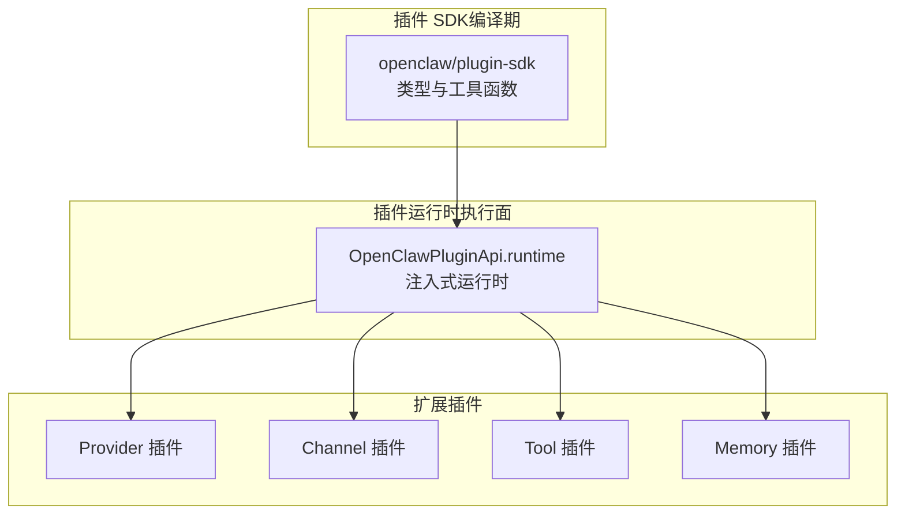
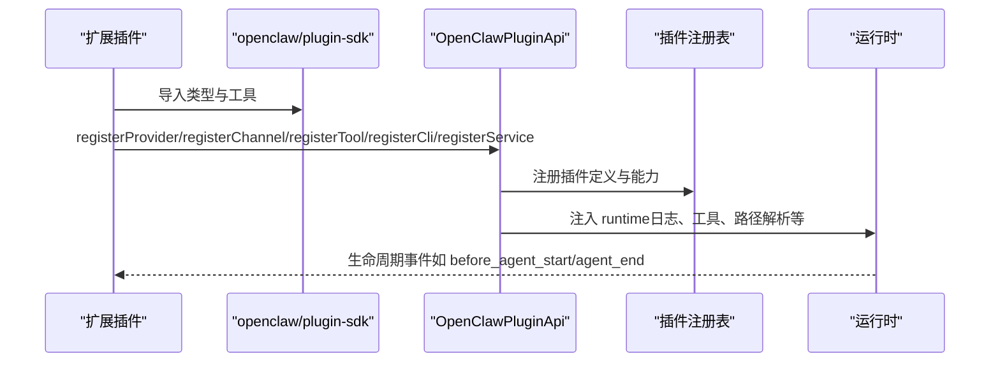
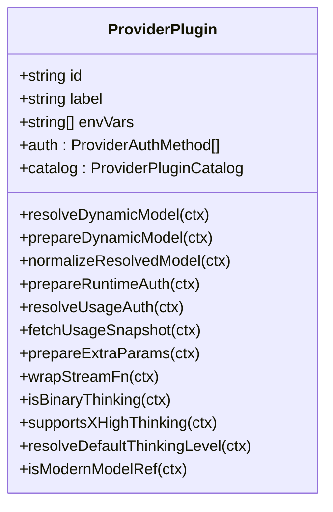
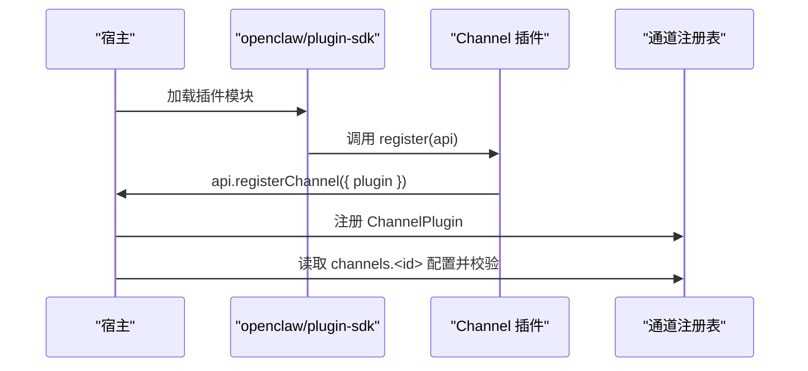
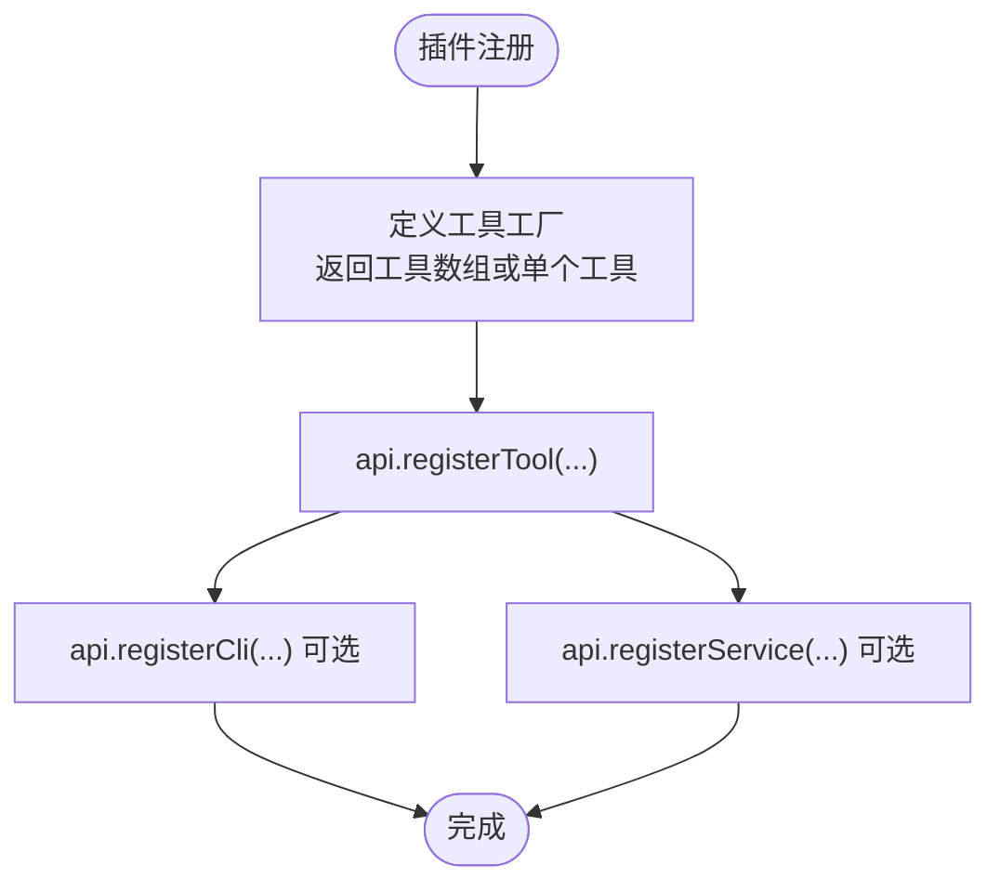
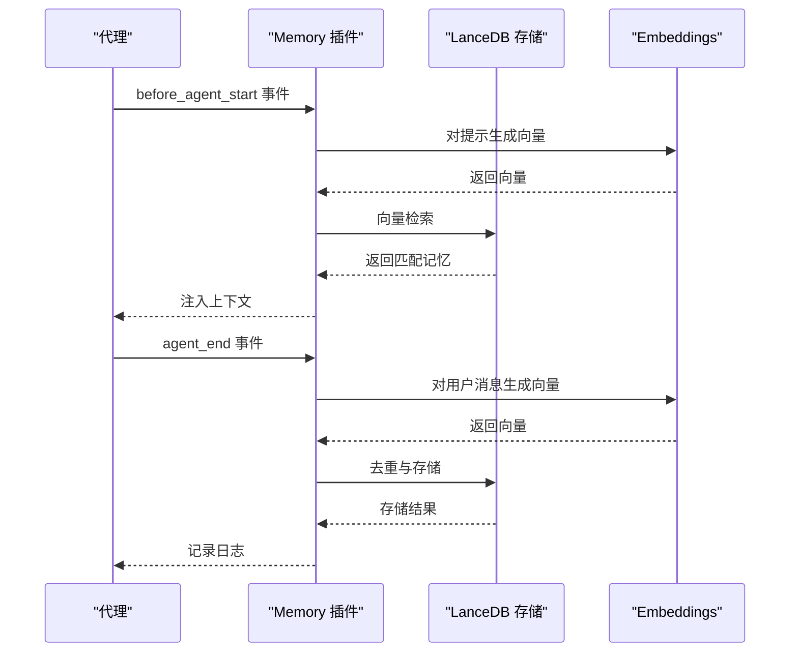
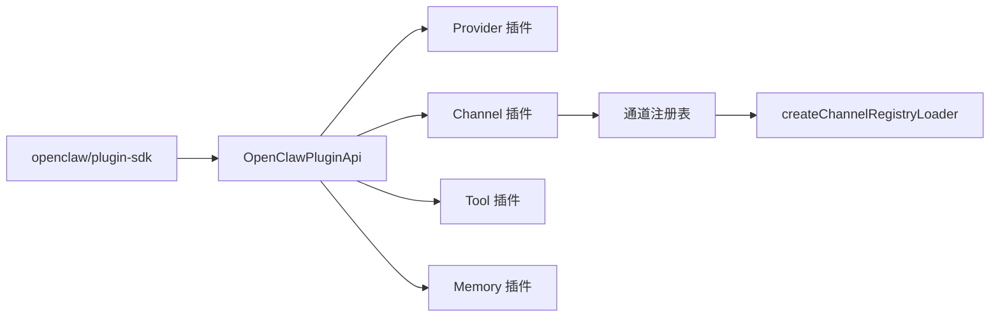

# 插件类型开发

<cite>
**本文引用的文件**
- [src/plugin-sdk/index.ts](file://src/plugin-sdk/index.ts)
- [src/plugins/types.ts](file://src/plugins/types.ts)
- [src/plugins/config-schema.ts](file://src/plugins/config-schema.ts)
- [src/channels/plugins/registry-loader.ts](file://src/channels/plugins/registry-loader.ts)
- [extensions/discord/index.ts](file://extensions/discord/index.ts)
- [extensions/discord/openclaw.plugin.json](file://extensions/discord/openclaw.plugin.json)
- [extensions/openai/index.ts](file://extensions/openai/index.ts)
- [extensions/openai/openclaw.plugin.json](file://extensions/openai/openclaw.plugin.json)
- [extensions/memory-core/index.ts](file://extensions/memory-core/index.ts)
- [extensions/memory-lancedb/index.ts](file://extensions/memory-lancedb/index.ts)
- [extensions/memory-lancedb/openclaw.plugin.json](file://extensions/memory-lancedb/openclaw.plugin.json)
- [extensions/shared/runtime.ts](file://extensions/shared/runtime.ts)
- [docs/tools/plugin.md](file://docs/tools/plugin.md)
- [docs/refactor/plugin-sdk.md](file://docs/refactor/plugin-sdk.md)
- [docs/zh-CN/refactor/plugin-sdk.md](file://docs/zh-CN/refactor/plugin-sdk.md)
</cite>

## 目录
1. [简介](#简介)
2. [项目结构](#项目结构)
3. [核心组件](#核心组件)
4. [架构总览](#架构总览)
5. [详细组件分析](#详细组件分析)
6. [依赖分析](#依赖分析)
7. [性能考虑](#性能考虑)
8. [故障排查指南](#故障排查指南)
9. [结论](#结论)
10. [附录](#附录)

## 简介
本指南面向希望在 OpenClaw 中开发不同插件类型的开发者，系统讲解 Provider 插件（AI 模型提供商）、Channel 插件（即时通讯平台）、Tool 插件（工具扩展）与 Memory 插件（记忆存储）的架构设计、实现模式与配置选项。文档提供从简单到复杂的实现路径与模板参考，解释插件之间的交互关系与集成方式，帮助你快速构建稳定、可维护且可扩展的插件。

## 项目结构
OpenClaw 将插件体系分为三层：
- 插件 SDK（编译期、稳定、可发布）：提供类型、工具函数与配置辅助，无运行时状态与副作用。
- 插件运行时（执行面、注入）：通过 OpenClawPluginApi.runtime 提供访问，插件不得直接导入 src/**。
- 扩展插件（外部或内置）：遵循 SDK 接口注册 Provider/Channel/Tool/Memory 等能力。

图表来源
- [src/plugin-sdk/index.ts:1-800](file://src/plugin-sdk/index.ts#L1-L800)
- [src/plugins/types.ts:1083-1098](file://src/plugins/types.ts#L1083-L1098)

章节来源
- [docs/refactor/plugin-sdk.md:1-43](file://docs/refactor/plugin-sdk.md#L1-L43)
- [docs/zh-CN/refactor/plugin-sdk.md:1-40](file://docs/zh-CN/refactor/plugin-sdk.md#L1-L40)

## 核心组件
- 插件 SDK 入口导出：集中导出类型、常量、工具函数与配置辅助，作为扩展插件的唯一稳定表面。
- 插件类型与生命周期：定义插件种类（kind）、注册入口（register/activate）、配置校验（configSchema）等。
- 插件运行时 API：通过 OpenClawPluginApi 暴露 registerProvider/registerChannel/registerTool/registerCli/registerService 等能力。
- 配置 Schema：支持空配置与 JSON Schema，配合 UI 提示（uiHints）提升易用性。

章节来源
- [src/plugin-sdk/index.ts:1-800](file://src/plugin-sdk/index.ts#L1-L800)
- [src/plugins/types.ts:52-1098](file://src/plugins/types.ts#L52-L1098)
- [src/plugins/config-schema.ts:1-33](file://src/plugins/config-schema.ts#L1-L33)

## 架构总览
插件在运行时通过 OpenClawPluginApi 注册能力，SDK 负责类型约束与工具，通道插件由通道注册表加载，Provider 插件负责模型目录与认证，Tool 插件提供工具，Memory 插件提供检索与持久化。

图表来源
- [src/plugin-sdk/index.ts:1-800](file://src/plugin-sdk/index.ts#L1-L800)
- [src/plugins/types.ts:1083-1098](file://src/plugins/types.ts#L1083-L1098)

## 详细组件分析

### Provider 插件（AI 模型提供商）
- 目标：为模型目录与推理提供认证、动态模型解析、流包装、用量查询等能力。
- 关键点：
  - 支持多认证方式（OAuth、API Key、设备码等）。
  - 动态模型解析与准备（prepareDynamicModel/resolveDynamicModel）。
  - 运行时认证交换（prepareRuntimeAuth）与用量认证（resolveUsageAuth）。
  - 流包装与额外参数处理（wrapStreamFn/prepareExtraParams）。
  - 思维策略与现代模型判定（isBinaryThinking/isModernModelRef）。
- 实现要点：
  - 使用 SDK 提供的 Provider 类型与上下文类型。
  - 在 register 中调用 api.registerProvider(...) 完成注册。
  - 可通过 openclaw.plugin.json 声明 providerAuthEnvVars 以增强体验。

图表来源
- [src/plugins/types.ts:545-738](file://src/plugins/types.ts#L545-L738)

章节来源
- [extensions/openai/index.ts:1-17](file://extensions/openai/index.ts#L1-L17)
- [extensions/openai/openclaw.plugin.json:1-13](file://extensions/openai/openclaw.plugin.json#L1-L13)
- [src/plugins/types.ts:545-738](file://src/plugins/types.ts#L545-L738)

### Channel 插件（即时通讯平台）
- 目标：将第三方聊天平台（如 Discord、Telegram、Slack 等）作为“内置”通道接入。
- 关键点：
  - 通过 api.registerChannel({ plugin }) 注册。
  - 配置位于 channels.<id>，由插件自身进行校验与解析。
  - 支持 setup 与 setupWizard 分离，前者负责账户归一化与写入，后者负责向宿主暴露状态与描述符。
- 实现要点：
  - 使用 SDK 的 ChannelPlugin 类型与 ChannelMeta/Capabilities。
  - 通过 createChannelRegistryLoader 从注册表按 id 解析插件值。
  - 可在 openclaw.plugin.json 中声明 channels 数组。

图表来源
- [docs/tools/plugin.md:1429-1478](file://docs/tools/plugin.md#L1429-L1478)
- [src/channels/plugins/registry-loader.ts:1-35](file://src/channels/plugins/registry-loader.ts#L1-L35)
- [extensions/discord/index.ts:1-23](file://extensions/discord/index.ts#L1-L23)
- [extensions/discord/openclaw.plugin.json:1-10](file://extensions/discord/openclaw.plugin.json#L1-L10)

章节来源
- [docs/tools/plugin.md:1429-1478](file://docs/tools/plugin.md#L1429-L1478)
- [src/channels/plugins/registry-loader.ts:1-35](file://src/channels/plugins/registry-loader.ts#L1-L35)
- [extensions/discord/index.ts:1-23](file://extensions/discord/index.ts#L1-L23)
- [extensions/discord/openclaw.plugin.json:1-10](file://extensions/discord/openclaw.plugin.json#L1-L10)

### Tool 插件（工具扩展）
- 目标：为代理提供可调用工具（如搜索、计算、文件操作等），支持 CLI 命令与服务。
- 关键点：
  - 通过 api.registerTool(factory, options) 注册工具工厂。
  - 工具上下文包含会话、请求者身份、沙箱状态等。
  - 可通过 api.registerCli 注册命令；通过 api.registerService 注册后台服务。
- 实现要点：
  - 使用 SDK 的 OpenClawPluginToolContext 与工具类型。
  - 可结合 runtime.tools.* 创建标准工具（如内存检索）。

图表来源
- [src/plugins/types.ts:72-97](file://src/plugins/types.ts#L72-L97)
- [extensions/memory-core/index.ts:1-39](file://extensions/memory-core/index.ts#L1-L39)

章节来源
- [src/plugins/types.ts:72-97](file://src/plugins/types.ts#L72-L97)
- [extensions/memory-core/index.ts:1-39](file://extensions/memory-core/index.ts#L1-L39)

### Memory 插件（记忆存储）
- 目标：提供长期记忆检索、存储与遗忘能力，支持自动回忆与自动捕获。
- 关键点：
  - 提供 memory_recall/memory_store/memory_forget 三个工具。
  - 支持 CLI 命令（ltm list/search/stats）。
  - 通过生命周期钩子（before_agent_start/agent_end）实现自动回忆与自动捕获。
  - 配置项包括嵌入模型、数据库路径、是否自动回忆/捕获、最大字符数等。
- 实现要点：
  - 使用 SDK 的 OpenClawPluginApi.runtime.tools.* 创建工具。
  - 通过 openclaw.plugin.json 提供 uiHints 与 JSON Schema，提升配置体验。

图表来源
- [extensions/memory-lancedb/index.ts:292-679](file://extensions/memory-lancedb/index.ts#L292-L679)
- [extensions/memory-lancedb/openclaw.plugin.json:1-89](file://extensions/memory-lancedb/openclaw.plugin.json#L1-L89)
- [extensions/memory-core/index.ts:1-39](file://extensions/memory-core/index.ts#L1-L39)

章节来源
- [extensions/memory-lancedb/index.ts:292-679](file://extensions/memory-lancedb/index.ts#L292-L679)
- [extensions/memory-lancedb/openclaw.plugin.json:1-89](file://extensions/memory-lancedb/openclaw.plugin.json#L1-L89)
- [extensions/memory-core/index.ts:1-39](file://extensions/memory-core/index.ts#L1-L39)

## 依赖分析
- 插件 SDK 与运行时解耦：扩展插件只依赖 openclaw/plugin-sdk，不直接导入 src/**。
- 通道插件通过注册表加载：createChannelRegistryLoader 缓存并按需解析插件值。
- Provider/Tool/Memory 插件通过 OpenClawPluginApi 注册，形成松耦合能力组合。

图表来源
- [src/plugin-sdk/index.ts:1-800](file://src/plugin-sdk/index.ts#L1-L800)
- [src/channels/plugins/registry-loader.ts:1-35](file://src/channels/plugins/registry-loader.ts#L1-L35)

章节来源
- [src/plugin-sdk/index.ts:1-800](file://src/plugin-sdk/index.ts#L1-L800)
- [src/channels/plugins/registry-loader.ts:1-35](file://src/channels/plugins/registry-loader.ts#L1-L35)

## 性能考虑
- SDK 层避免运行时状态与副作用，确保插件可热插拔与可测试。
- 通道插件注册表带缓存，减少重复解析开销。
- Memory 插件的向量检索与去重逻辑应控制阈值与限制，避免高延迟。
- Provider 插件的动态模型解析建议先走 prepareDynamicModel 预热，再 resolveDynamicModel 决策。

## 故障排查指南
- 配置校验失败：检查 openclaw.plugin.json 的 JSON Schema 与 uiHints 是否正确，必要时使用 emptyPluginConfigSchema() 作为起点。
- 通道插件未生效：确认 channels.<id> 下的配置结构与字段名正确，参考通道插件的 setup 与 setupWizard 分离流程。
- Provider 插件认证异常：核对 ProviderAuthContext 中的 secret 输入模式与非交互认证流程。
- Memory 插件检索为空：检查嵌入模型维度与数据库路径，确认 before_agent_start 生命周期钩子已触发。

章节来源
- [src/plugins/config-schema.ts:1-33](file://src/plugins/config-schema.ts#L1-L33)
- [docs/tools/plugin.md:1429-1478](file://docs/tools/plugin.md#L1429-L1478)
- [extensions/memory-lancedb/index.ts:292-679](file://extensions/memory-lancedb/index.ts#L292-L679)

## 结论
通过统一的插件 SDK 与运行时 API，OpenClaw 为 Provider、Channel、Tool 与 Memory 插件提供了清晰的开发范式与强大的扩展能力。遵循本文的架构设计、实现模式与配置选项，你可以快速构建高质量插件，并与其他插件协同工作，满足复杂场景需求。

## 附录
- 模板与示例参考
  - Provider 插件模板：参见 openai 插件的注册与 Provider 定义。
    - [extensions/openai/index.ts:1-17](file://extensions/openai/index.ts#L1-L17)
    - [extensions/openai/openclaw.plugin.json:1-13](file://extensions/openai/openclaw.plugin.json#L1-L13)
  - Channel 插件模板：参见 discord 插件的注册与通道插件定义。
    - [extensions/discord/index.ts:1-23](file://extensions/discord/index.ts#L1-L23)
    - [extensions/discord/openclaw.plugin.json:1-10](file://extensions/discord/openclaw.plugin.json#L1-L10)
  - Memory 插件模板：参见 memory-core 与 memory-lancedb 的工具与 CLI 注册。
    - [extensions/memory-core/index.ts:1-39](file://extensions/memory-core/index.ts#L1-L39)
    - [extensions/memory-lancedb/index.ts:292-679](file://extensions/memory-lancedb/index.ts#L292-L679)
    - [extensions/memory-lancedb/openclaw.plugin.json:1-89](file://extensions/memory-lancedb/openclaw.plugin.json#L1-L89)
  - 运行时封装模板：shared/runtime 提供 logger-backed runtime 的封装示例。
    - [extensions/shared/runtime.ts:1-15](file://extensions/shared/runtime.ts#L1-L15)
- 配置 Schema 与 UI 提示
  - 使用 emptyPluginConfigSchema() 快速起步，逐步添加属性与 uiHints。
  - 参考 memory-lancedb 的 uiHints 与 JSON Schema，提升配置体验。
    - [extensions/memory-lancedb/openclaw.plugin.json:1-89](file://extensions/memory-lancedb/openclaw.plugin.json#L1-L89)
    - [src/plugins/config-schema.ts:1-33](file://src/plugins/config-schema.ts#L1-L33)