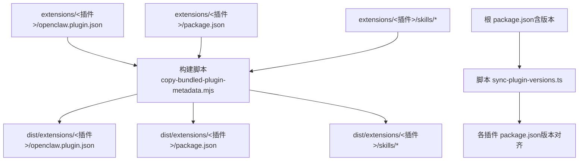
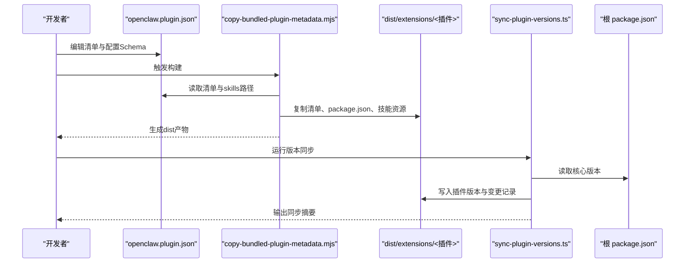
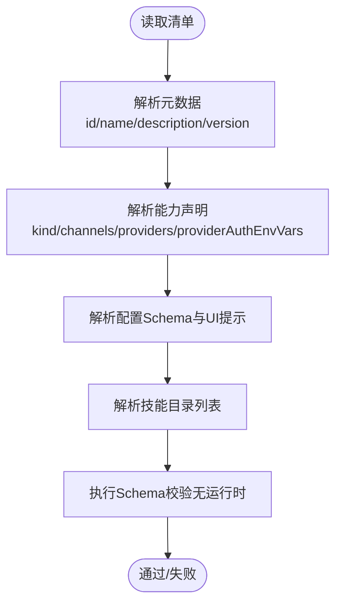
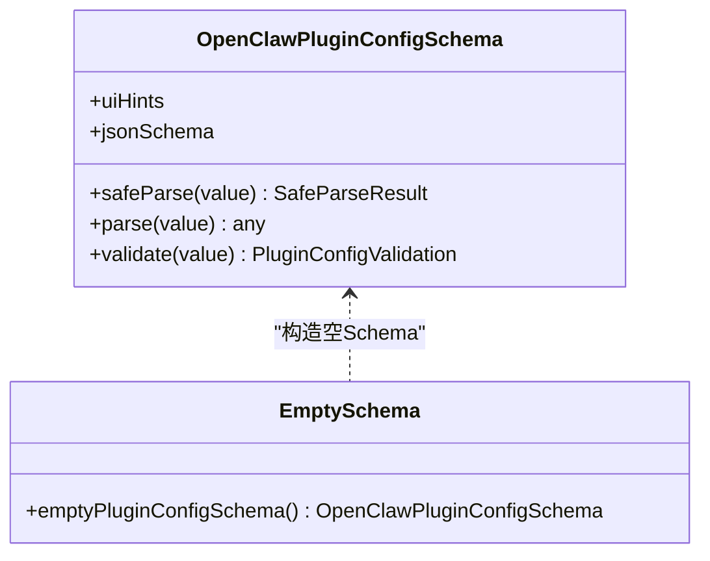
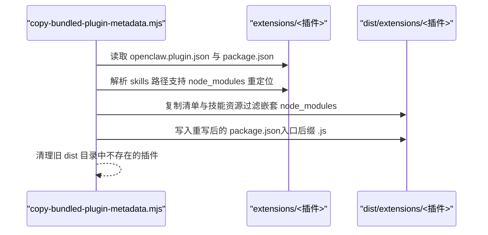
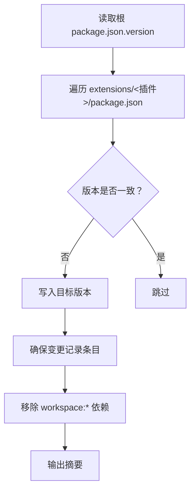
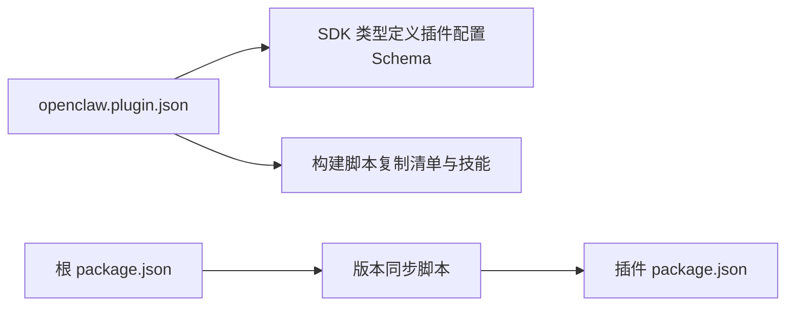

# 插件配置与部署

<cite>
**本文引用的文件**
- [openclaw.plugin.json（示例：acpx）](file://extensions/acpx/openclaw.plugin.json)
- [openclaw.plugin.json（示例：anthropic）](file://extensions/anthropic/openclaw.plugin.json)
- [openclaw.plugin.json（示例：discord）](file://extensions/discord/openclaw.plugin.json)
- [openclaw.plugin.json（示例：google）](file://extensions/google/openclaw.plugin.json)
- [openclaw.plugin.json（示例：openai）](file://extensions/openai/openclaw.plugin.json)
- [插件清单规范（官方文档）](file://docs/plugins/manifest.md)
- [插件包与兼容布局（官方文档）](file://docs/plugins/bundles.md)
- [插件代理工具（官方文档）](file://docs/plugins/agent-tools.md)
- [语音通话插件（官方文档）](file://docs/plugins/voice-call.md)
- [插件SDK入口（类型导出）](file://src/plugin-sdk/index.ts)
- [插件配置Schema工具（空Schema）](file://src/plugins/config-schema.ts)
- [插件类型定义（核心）](file://src/plugins/types.ts)
- [打包：复制内置插件元数据](file://scripts/copy-bundled-plugin-metadata.mjs)
- [脚本：同步插件版本](file://scripts/sync-plugin-versions.ts)
</cite>

## 目录
1. [简介](#简介)
2. [项目结构](#项目结构)
3. [核心组件](#核心组件)
4. [架构总览](#架构总览)
5. [详细组件分析](#详细组件分析)
6. [依赖关系分析](#依赖关系分析)
7. [性能考量](#性能考量)
8. [故障排查指南](#故障排查指南)
9. [结论](#结论)
10. [附录](#附录)

## 简介
本指南聚焦于 OpenClaw 插件系统的“清单文件（openclaw.plugin.json）”与“部署与版本管理”。内容涵盖：
- 清单文件结构与配置项：元数据、依赖声明、运行时配置与 UI 提示
- 打包、复制与发布流程：如何将插件技能资源与清单复制到分发目录
- 版本管理与兼容性：如何与核心版本对齐、生成变更记录
- 安装、更新与卸载的自动化流程：命令行与配置层面的协同
- 故障诊断与回滚策略：清单校验失败、能力未执行、安全边界等

## 项目结构
OpenClaw 将插件以“扩展（extensions）”形式组织，每个扩展包含一个 openclaw.plugin.json 清单与可选的 package.json、技能目录等。构建阶段通过脚本将清单与技能资源复制到 dist 输出目录，并在必要时重写 package.json 的入口字段。

图表来源
- [打包：复制内置插件元数据:129-201](file://scripts/copy-bundled-plugin-metadata.mjs#L129-L201)
- [脚本：同步插件版本:41-101](file://scripts/sync-plugin-versions.ts#L41-L101)

章节来源
- [打包：复制内置插件元数据:129-201](file://scripts/copy-bundled-plugin-metadata.mjs#L129-L201)
- [脚本：同步插件版本:41-101](file://scripts/sync-plugin-versions.ts#L41-L101)

## 核心组件
- 清单文件（openclaw.plugin.json）
  - 必填字段：id、configSchema
  - 可选字段：kind、channels、providers、providerAuthEnvVars、skills、name、description、uiHints、version
  - 作用：在不加载插件运行时的前提下进行配置校验与能力发现
- 插件SDK类型与工具
  - 类型导出：插件配置Schema接口、UI提示、插件工具上下文等
  - 工具函数：空Schema构造器，用于“无配置插件”的严格校验
- 构建与发布脚本
  - 复制插件清单与技能资源至 dist
  - 同步插件版本与变更记录
- 官方文档
  - 清单规范、包兼容性、代理工具与语音通话插件使用说明

章节来源
- [插件清单规范（官方文档）:36-100](file://docs/plugins/manifest.md#L36-L100)
- [插件SDK入口（类型导出）:58-70](file://src/plugin-sdk/index.ts#L58-L70)
- [插件配置Schema工具（空Schema）:13-33](file://src/plugins/config-schema.ts#L13-L33)
- [打包：复制内置插件元数据:129-201](file://scripts/copy-bundled-plugin-metadata.mjs#L129-L201)
- [脚本：同步插件版本:41-101](file://scripts/sync-plugin-versions.ts#L41-L101)

## 架构总览
下图展示了从清单到运行时的关键路径：清单用于“发现与校验”，构建脚本负责“复制与重写”，版本脚本负责“一致性”。

图表来源
- [打包：复制内置插件元数据:129-201](file://scripts/copy-bundled-plugin-metadata.mjs#L129-L201)
- [脚本：同步插件版本:41-101](file://scripts/sync-plugin-versions.ts#L41-L101)

## 详细组件分析

### 组件A：清单文件结构与配置项
- 元数据
  - id：插件唯一标识
  - name、description：显示名称与简述
  - version：版本号（信息性）
- 能力声明
  - kind：插件种类（如 memory、context-engine），由 slots 选择
  - channels/providers：该插件注册的通道/模型提供商
  - providerAuthEnvVars：用于环境变量认证探测的映射
- 配置与Schema
  - configSchema：JSON Schema，用于严格校验插件配置
  - uiHints：UI标签、帮助文本、敏感标记、高级选项等
- 运行时与资源
  - skills：相对插件根的技能目录列表
  - 其他字段：如 ACPX 的命令、权限模式、超时、队列TTL、MCP 服务器等

图表来源
- [插件清单规范（官方文档）:36-100](file://docs/plugins/manifest.md#L36-L100)
- [openclaw.plugin.json（示例：acpx）:1-106](file://extensions/acpx/openclaw.plugin.json#L1-L106)
- [openclaw.plugin.json（示例：anthropic）:1-13](file://extensions/anthropic/openclaw.plugin.json#L1-L13)
- [openclaw.plugin.json（示例：discord）:1-10](file://extensions/discord/openclaw.plugin.json#L1-L10)
- [openclaw.plugin.json（示例：google）:1-13](file://extensions/google/openclaw.plugin.json#L1-L13)
- [openclaw.plugin.json（示例：openai）:1-13](file://extensions/openai/openclaw.plugin.json#L1-L13)

章节来源
- [插件清单规范（官方文档）:36-100](file://docs/plugins/manifest.md#L36-L100)
- [openclaw.plugin.json（示例：acpx）:1-106](file://extensions/acpx/openclaw.plugin.json#L1-L106)
- [openclaw.plugin.json（示例：anthropic）:1-13](file://extensions/anthropic/openclaw.plugin.json#L1-L13)
- [openclaw.plugin.json（示例：discord）:1-10](file://extensions/discord/openclaw.plugin.json#L1-L10)
- [openclaw.plugin.json（示例：google）:1-13](file://extensions/google/openclaw.plugin.json#L1-L13)
- [openclaw.plugin.json（示例：openai）:1-13](file://extensions/openai/openclaw.plugin.json#L1-L13)

### 组件B：插件SDK与配置Schema工具
- OpenClawPluginConfigSchema 接口
  - 支持 safeParse/parse/validate/uiHints/jsonSchema
  - 用于在不加载插件模块的情况下验证配置
- emptyPluginConfigSchema 工具
  - 返回“空对象且不允许额外属性”的Schema
  - 适用于不需要配置的插件

图表来源
- [插件SDK入口（类型导出）:58-70](file://src/plugin-sdk/index.ts#L58-L70)
- [插件配置Schema工具（空Schema）:13-33](file://src/plugins/config-schema.ts#L13-L33)

章节来源
- [插件SDK入口（类型导出）:58-70](file://src/plugin-sdk/index.ts#L58-L70)
- [插件配置Schema工具（空Schema）:13-33](file://src/plugins/config-schema.ts#L13-L33)

### 组件C：打包、复制与发布流程
- 复制清单与技能资源
  - 读取 extensions 下的每个插件目录
  - 解析 openclaw.plugin.json 与 package.json
  - 将 skills 目录复制到 dist，并重写 package.json 中的入口字段
  - 对 node_modules 引用的技能资源进行重定位，避免发布包内嵌套 node_modules
- 发布产物
  - dist/extensions/<插件>/openclaw.plugin.json
  - dist/extensions/<插件>/package.json
  - dist/extensions/<插件>/skills/*

图表来源
- [打包：复制内置插件元数据:129-201](file://scripts/copy-bundled-plugin-metadata.mjs#L129-L201)

章节来源
- [打包：复制内置插件元数据:129-201](file://scripts/copy-bundled-plugin-metadata.mjs#L129-L201)

### 组件D：版本管理与兼容性检查
- 版本同步
  - 读取根 package.json 的 version
  - 遍历 extensions 下所有插件的 package.json
  - 若版本不一致则更新；若不存在变更记录条目则追加
  - 移除 workspace:* 开发依赖（如存在）
- 兼容性检查
  - 清单必须包含 id 与 configSchema
  - 未知通道/插件ID将被视为错误
  - 禁用但配置存在的插件会保留配置并在诊断中告警

图表来源
- [脚本：同步插件版本:41-101](file://scripts/sync-plugin-versions.ts#L41-L101)
- [插件清单规范（官方文档）:74-84](file://docs/plugins/manifest.md#L74-L84)

章节来源
- [脚本：同步插件版本:41-101](file://scripts/sync-plugin-versions.ts#L41-L101)
- [插件清单规范（官方文档）:74-84](file://docs/plugins/manifest.md#L74-L84)

### 组件E：安装、更新与卸载自动化流程
- 安装
  - npm 包安装或本地目录安装
  - 安装后需重启网关以加载插件
- 更新
  - 升级 npm 包或替换本地目录
  - 运行版本同步脚本以保持与核心版本一致
- 卸载
  - 删除插件目录或禁用插件条目
  - 清理 dist 中对应的插件目录（由构建脚本维护）

章节来源
- [语音通话插件（官方文档）:34-52](file://docs/plugins/voice-call.md#L34-L52)
- [插件包与兼容布局（官方文档）:255-267](file://docs/plugins/bundles.md#L255-L267)

### 组件F：故障诊断与回滚策略
- 清单校验失败
  - 缺失或无效的 openclaw.plugin.json 会被视为插件错误并阻止配置验证
  - 建议：使用空 Schema 工具确保严格校验
- 能力未执行（包兼容）
  - 某些能力仅被检测但尚未接入（例如 Claude hooks、Cursor agents）
  - 建议：使用 info 命令查看能力报告，确认当前支持范围
- 安全边界
  - 包兼容不执行任意运行时代码，仅映射已支持特性
  - 建议：优先使用原生插件布局以获得完整功能与更强信任边界

章节来源
- [插件清单规范（官方文档）:74-84](file://docs/plugins/manifest.md#L74-L84)
- [插件包与兼容布局（官方文档）:124-158](file://docs/plugins/bundles.md#L124-L158)

## 依赖关系分析
- 清单与SDK
  - 清单中的 configSchema 与 uiHints 与 SDK 类型定义相互配合，实现“先校验再运行”
- 构建脚本与清单
  - 构建脚本读取清单中的 skills 列表，决定复制哪些资源
- 版本脚本与根包
  - 版本脚本以根包版本为基准，统一插件版本与变更记录

图表来源
- [插件SDK入口（类型导出）:58-70](file://src/plugin-sdk/index.ts#L58-L70)
- [插件配置Schema工具（空Schema）:13-33](file://src/plugins/config-schema.ts#L13-L33)
- [打包：复制内置插件元数据:129-201](file://scripts/copy-bundled-plugin-metadata.mjs#L129-L201)
- [脚本：同步插件版本:41-101](file://scripts/sync-plugin-versions.ts#L41-L101)

章节来源
- [插件SDK入口（类型导出）:58-70](file://src/plugin-sdk/index.ts#L58-L70)
- [插件配置Schema工具（空Schema）:13-33](file://src/plugins/config-schema.ts#L13-L33)
- [打包：复制内置插件元数据:129-201](file://scripts/copy-bundled-plugin-metadata.mjs#L129-L201)
- [脚本：同步插件版本:41-101](file://scripts/sync-plugin-versions.ts#L41-L101)

## 性能考量
- 清单校验在配置读取阶段完成，避免加载插件模块带来的开销
- 构建脚本复制技能资源时过滤嵌套 node_modules，减少发布包体积
- 版本同步脚本批量处理，避免逐个手动维护

## 故障排查指南
- 清单缺失或格式错误
  - 现象：配置验证失败，Doctor 报告插件错误
  - 处理：确保清单存在且包含 id 与 configSchema；参考空 Schema 工具
- 未知通道/插件ID
  - 现象：安装/启用时报错
  - 处理：确认清单中 channels/providers 与实际插件能力一致
- 包兼容能力未执行
  - 现象：info 显示“未接入”
  - 处理：使用原生插件布局或等待后续支持
- 发布包过大或包含 node_modules
  - 现象：dist 包含嵌套 node_modules
  - 处理：检查构建脚本对 node_modules 的重定位与过滤逻辑

章节来源
- [插件清单规范（官方文档）:74-84](file://docs/plugins/manifest.md#L74-L84)
- [插件包与兼容布局（官方文档）:124-158](file://docs/plugins/bundles.md#L124-L158)
- [打包：复制内置插件元数据:129-201](file://scripts/copy-bundled-plugin-metadata.mjs#L129-L201)

## 结论
- 清单文件是插件“发现与校验”的关键，必须严格遵循 Schema 与字段要求
- 构建与版本脚本保障了插件资源与版本的一致性与安全性
- 包兼容布局提供了跨生态的便捷安装体验，但功能映射有限
- 建议在生产环境中优先采用原生插件布局，并结合 Doctor 与 info 命令进行持续健康检查

## 附录
- 示例清单字段速览
  - 元数据：id、name、description、version
  - 能力：kind、channels、providers、providerAuthEnvVars
  - 配置：configSchema、uiHints
  - 资源：skills
- 相关文档
  - [插件清单规范（官方文档）](file://docs/plugins/manifest.md)
  - [插件包与兼容布局（官方文档）](file://docs/plugins/bundles.md)
  - [插件代理工具（官方文档）](file://docs/plugins/agent-tools.md)
  - [语音通话插件（官方文档）](file://docs/plugins/voice-call.md)