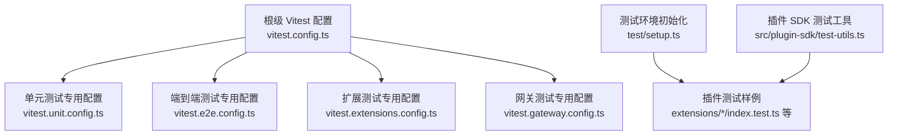
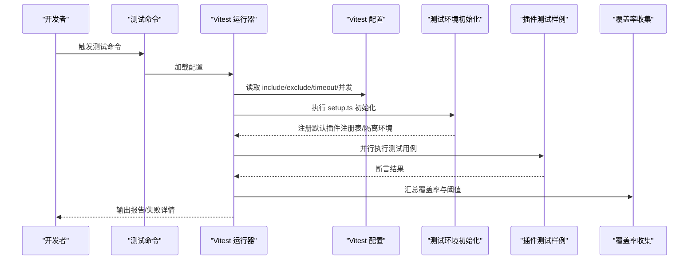
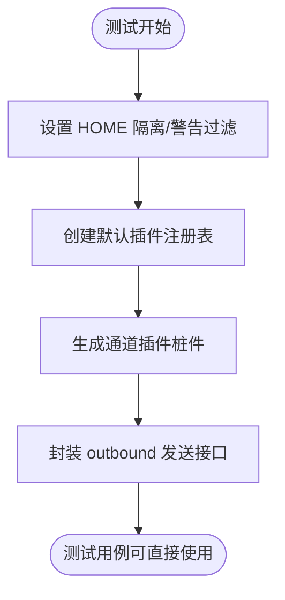
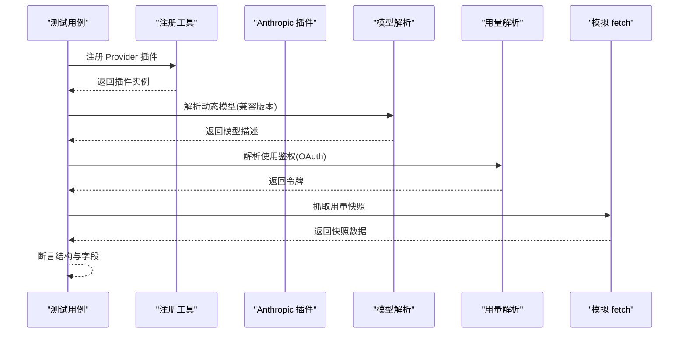
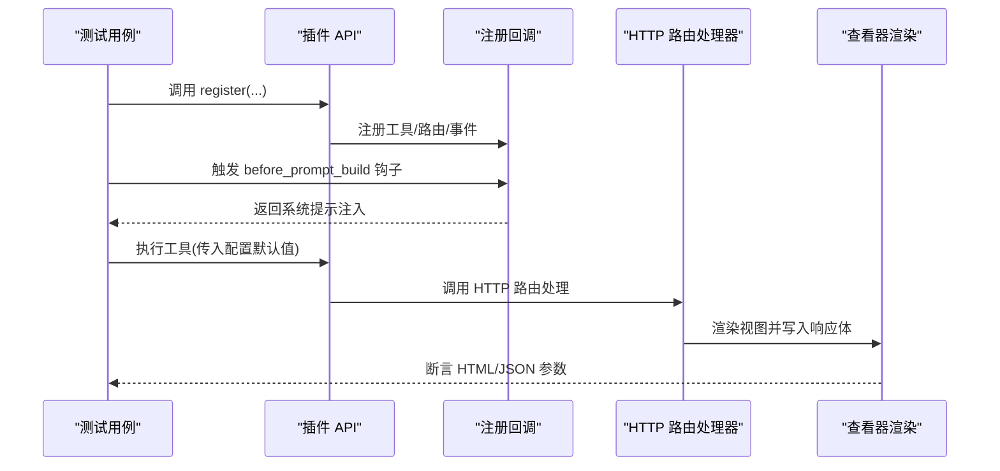
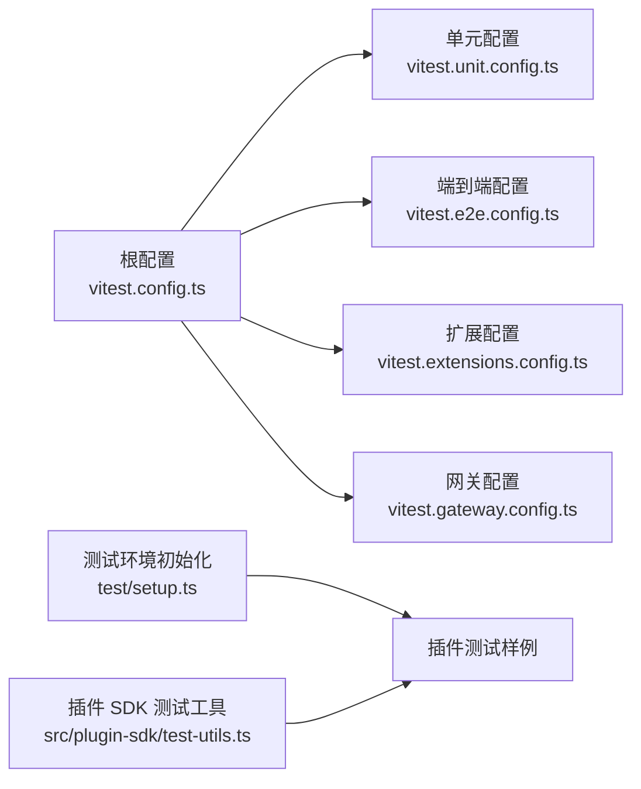

# 测试与调试

<cite>
**本文引用的文件**
- [vitest.config.ts](file://vitest.config.ts)
- [vitest.unit.config.ts](file://vitest.unit.config.ts)
- [vitest.e2e.config.ts](file://vitest.e2e.config.ts)
- [vitest.extensions.config.ts](file://vitest.extensions.config.ts)
- [vitest.gateway.config.ts](file://vitest.gateway.config.ts)
- [setup.ts](file://test/setup.ts)
- [index.test.ts（anthropic 插件）](file://extensions/anthropic/index.test.ts)
- [index.test.ts（diffs 插件）](file://extensions/diffs/index.test.ts)
- [index.test.ts（github-copilot 插件）](file://extensions/github-copilot/index.test.ts)
- [test-utils.ts（插件 SDK 测试工具）](file://src/plugin-sdk/test-utils.ts)
</cite>

## 目录
1. [引言](#引言)
2. [项目结构](#项目结构)
3. [核心组件](#核心组件)
4. [架构总览](#架构总览)
5. [详细组件分析](#详细组件分析)
6. [依赖关系分析](#依赖关系分析)
7. [性能考量](#性能考量)
8. [故障排查指南](#故障排查指南)
9. [结论](#结论)
10. [附录](#附录)

## 引言
本指南聚焦于插件测试与调试的最佳实践，覆盖单元测试、集成测试与端到端测试策略，以及调试工具与流程。内容基于仓库中现有的 Vitest 配置、测试辅助设施与多个插件的测试样例，帮助开发者高效编写可维护的测试用例，并通过日志、断点与性能分析快速定位问题。

## 项目结构
围绕“插件测试与调试”的关键目录与文件如下：
- 测试运行器与配置：根级 Vitest 配置与分场景专用配置
- 测试环境初始化：全局 setup 文件，负责隔离、桩件与默认注册表
- 插件测试样例：多插件的单元测试，展示注册、工具与路由钩子的验证方式
- 插件 SDK 测试工具：对测试友好的导出集合

图表来源
- [vitest.config.ts:1-156](file://vitest.config.ts#L1-L156)
- [vitest.unit.config.ts:1-28](file://vitest.unit.config.ts#L1-L28)
- [vitest.e2e.config.ts:1-33](file://vitest.e2e.config.ts#L1-L33)
- [vitest.extensions.config.ts:1-10](file://vitest.extensions.config.ts#L1-L10)
- [vitest.gateway.config.ts:1-4](file://vitest.gateway.config.ts#L1-L4)
- [setup.ts:1-194](file://test/setup.ts#L1-L194)
- [test-utils.ts（插件 SDK 测试工具）:1-9](file://src/plugin-sdk/test-utils.ts#L1-L9)

章节来源
- [vitest.config.ts:1-156](file://vitest.config.ts#L1-L156)
- [setup.ts:1-194](file://test/setup.ts#L1-L194)

## 核心组件
- 测试运行器与配置
  - 根配置定义别名、超时、并发、包含/排除规则与覆盖率阈值
  - 单元测试配置在根基础上进一步缩小范围，排除重资源模块
  - 端到端配置强调进程隔离与工作线程数控制
  - 扩展与网关测试配置用于按子域运行
- 测试环境初始化
  - 安装全局警告过滤、设置 HOME 隔离、安装默认插件注册表
  - 提供通道插件桩件与默认注册表工厂，便于快速搭建测试上下文
- 插件测试样例
  - 展示如何注册单个 Provider 插件并验证模型兼容性、鉴权解析与用量快照抓取
  - 展示如何注册工具、HTTP 路由与生命周期钩子，并验证系统提示注入与视图参数默认值
  - 展示 Copilot 兼容回退逻辑的验证
- 插件 SDK 测试工具
  - 对外导出少量测试友好符号，便于在扩展测试中复用

章节来源
- [vitest.config.ts:30-156](file://vitest.config.ts#L30-L156)
- [vitest.unit.config.ts:11-27](file://vitest.unit.config.ts#L11-L27)
- [vitest.e2e.config.ts:20-32](file://vitest.e2e.config.ts#L20-L32)
- [setup.ts:34-194](file://test/setup.ts#L34-L194)
- [index.test.ts（anthropic 插件）:1-92](file://extensions/anthropic/index.test.ts#L1-L92)
- [index.test.ts（diffs 插件）:1-125](file://extensions/diffs/index.test.ts#L1-L125)
- [index.test.ts（github-copilot 插件）:1-39](file://extensions/github-copilot/index.test.ts#L1-L39)
- [test-utils.ts（插件 SDK 测试工具）:1-9](file://src/plugin-sdk/test-utils.ts#L1-L9)

## 架构总览
下图展示了测试运行与调试的关键路径：从配置到执行再到覆盖率与报告输出。

图表来源
- [vitest.config.ts:30-156](file://vitest.config.ts#L30-L156)
- [setup.ts:34-194](file://test/setup.ts#L34-L194)

## 详细组件分析

### 组件一：测试运行与覆盖率策略
- 超时与池化
  - 测试与钩子超时根据平台调整；默认使用进程池以提升稳定性
- 包含/排除策略
  - include 明确扫描源码与 UI 测试；exclude 排除应用层、UI、入口与大型集成模块
- 覆盖率阈值
  - 行/函数/分支/语句阈值为 70%/70%/55%/70%，仅统计实际被测试套件覆盖的源码
- 工作线程
  - 本地按 CPU 动态分配，CI 下 Windows 限制为 2，其他为 3

章节来源
- [vitest.config.ts:30-156](file://vitest.config.ts#L30-L156)

### 组件二：单元测试配置与范围
- 基于根配置裁剪 include，移除扩展测试范围
- 排除重资源模块（如网关、浏览器、代理等），聚焦纯逻辑单元测试

章节来源
- [vitest.unit.config.ts:11-27](file://vitest.unit.config.ts#L11-L27)

### 组件三：端到端测试配置
- 强制进程池以避免 VM 上下文状态泄漏
- 默认单工作线程或按 CPU 百分比动态分配，支持环境变量覆盖
- 支持静默/详细输出开关

章节来源
- [vitest.e2e.config.ts:1-33](file://vitest.e2e.config.ts#L1-L33)

### 组件四：扩展与网关测试专用配置
- 扩展测试配置：按扩展目录匹配测试文件，同时排除通道实现的特定模式
- 网关测试配置：按网关目录匹配测试文件

章节来源
- [vitest.extensions.config.ts:1-10](file://vitest.extensions.config.ts#L1-L10)
- [vitest.gateway.config.ts:1-4](file://vitest.gateway.config.ts#L1-L4)

### 组件五：测试环境初始化与桩件
- 全局隔离
  - 设置 HOME 隔离、安装警告过滤、提升监听者上限
- 插件注册表
  - 提供默认注册表，包含多个通道插件桩件，便于快速构建上下文
- 通道插件桩件
  - 封装 outbound 发送接口，支持直接发送与网关模式
  - 提供配置解析与可用账户枚举能力的桩件

图表来源
- [setup.ts:34-194](file://test/setup.ts#L34-L194)

章节来源
- [setup.ts:34-194](file://test/setup.ts#L34-L194)

### 组件六：插件测试样例（Anthropic）
- 场景
  - 动态模型前向兼容解析
  - 使用鉴权解析（OAuth 令牌）
  - 用量快照抓取与窗口信息校验
- 方法
  - 使用注册工具注册单个 Provider 插件
  - 通过自定义 fetch 模拟网络请求，断言返回结构

图表来源
- [index.test.ts（anthropic 插件）:11-92](file://extensions/anthropic/index.test.ts#L11-L92)

章节来源
- [index.test.ts（anthropic 插件）:1-92](file://extensions/anthropic/index.test.ts#L1-L92)

### 组件七：插件测试样例（Diffs）
- 场景
  - 注册工具、HTTP 路由与生命周期钩子
  - 系统提示注入（before_prompt_build）
  - 通过工具执行与 HTTP 查看器验证配置默认值
- 方法
  - 使用测试 API 创建最小化插件 API 实例
  - 通过模拟 HTTP 响应体断言渲染参数

图表来源
- [index.test.ts（diffs 插件）:8-112](file://extensions/diffs/index.test.ts#L8-L112)

章节来源
- [index.test.ts（diffs 插件）:1-125](file://extensions/diffs/index.test.ts#L1-L125)

### 组件八：插件测试样例（GitHub Copilot）
- 场景
  - 验证 Copilot 特有的前向兼容回退逻辑
- 方法
  - 注册 Provider 插件并传入新旧模型 ID，断言解析行为

章节来源
- [index.test.ts（github-copilot 插件）:1-39](file://extensions/github-copilot/index.test.ts#L1-L39)

### 组件九：插件 SDK 测试工具
- 作用
  - 对外导出少量测试友好类型与工具，便于扩展测试复用
- 影响
  - 降低重复造轮子成本，统一测试接口

章节来源
- [test-utils.ts（插件 SDK 测试工具）:1-9](file://src/plugin-sdk/test-utils.ts#L1-L9)

## 依赖关系分析
- 配置依赖
  - 单元/端到端/扩展/网关配置均基于根配置进行裁剪
- 环境依赖
  - 测试运行前必须执行 setup.ts，否则插件注册表与隔离环境不可用
- 插件测试依赖
  - 多数插件测试依赖注册工具与 Provider/插件 API 的桩件

图表来源
- [vitest.config.ts:1-156](file://vitest.config.ts#L1-L156)
- [vitest.unit.config.ts:1-28](file://vitest.unit.config.ts#L1-L28)
- [vitest.e2e.config.ts:1-33](file://vitest.e2e.config.ts#L1-L33)
- [vitest.extensions.config.ts:1-10](file://vitest.extensions.config.ts#L1-L10)
- [vitest.gateway.config.ts:1-4](file://vitest.gateway.config.ts#L1-L4)
- [setup.ts:1-194](file://test/setup.ts#L1-L194)
- [test-utils.ts（插件 SDK 测试工具）:1-9](file://src/plugin-sdk/test-utils.ts#L1-L9)

章节来源
- [vitest.config.ts:1-156](file://vitest.config.ts#L1-L156)
- [setup.ts:1-194](file://test/setup.ts#L1-L194)

## 性能考量
- 并发与隔离
  - 单元测试使用进程池，避免 VM 状态泄漏；端到端测试强制进程池确保确定性
  - 工作线程数在本地按 CPU 动态分配，在 CI 下 Windows 限制为 2，其他为 3
- 超时设置
  - 测试与钩子超时随平台调整，Windows 下钩子超时更高
- 覆盖率锚定
  - 仅统计被测试套件实际覆盖的源码，避免无关模块影响阈值

章节来源
- [vitest.config.ts:30-156](file://vitest.config.ts#L30-L156)
- [vitest.e2e.config.ts:1-33](file://vitest.e2e.config.ts#L1-L33)

## 故障排查指南
- 日志与输出
  - 端到端测试支持详细输出开关，便于定位慢点与异常
- 断点调试
  - 使用进程池运行，可在 IDE 中设置断点；注意避免 VM 状态泄漏导致的跨文件污染
- 环境隔离
  - 确保每次测试前后的插件注册表被正确恢复；若使用假计时器，需在 afterEach 中重置
- 常见问题
  - 跨文件环境泄漏：启用 unstubEnvs/unstubGlobals，避免 vmForks 下的环境污染
  - 并发监听器上限：提升最大监听者数量以避免噪音告警
  - 超时与失败：适当提高超时或拆分用例，避免长耗时步骤阻塞整体进度

章节来源
- [vitest.config.ts:30-156](file://vitest.config.ts#L30-L156)
- [setup.ts:181-194](file://test/setup.ts#L181-L194)

## 结论
本指南基于仓库现有配置与样例，总结了插件测试与调试的策略与流程：以根配置为基线，按场景拆分专用配置；通过 setup.ts 提供稳定的测试环境与桩件；利用多插件测试样例学习注册、钩子与工具的验证方法；结合覆盖率阈值与性能优化建议，形成可落地的质量保障流程。

## 附录
- 测试用例编写规范（基于样例提炼）
  - 使用最小化 API 桩件，避免真实外部依赖
  - 通过模拟 fetch 或 HTTP 响应体断言行为
  - 在 beforeAll 设置默认注册表，避免重复构造
  - 在 afterEach 恢复注册表与计时器状态
- 模拟对象使用方法
  - 使用测试工具创建插件 API 实例，注册工具、HTTP 路由与事件
  - 通过配置默认值驱动工具与视图渲染，断言最终输出
- 常见测试场景
  - Provider 插件：模型兼容解析、鉴权解析、用量抓取
  - 工具与路由：注册、钩子触发、系统提示注入、视图参数默认值
  - 兼容性：前向兼容回退逻辑验证
- 覆盖率与质量保证
  - 行/函数/分支/语句阈值：70%/70%/55%/70%
  - 仅统计被测试套件实际覆盖的源码，避免无关模块干扰