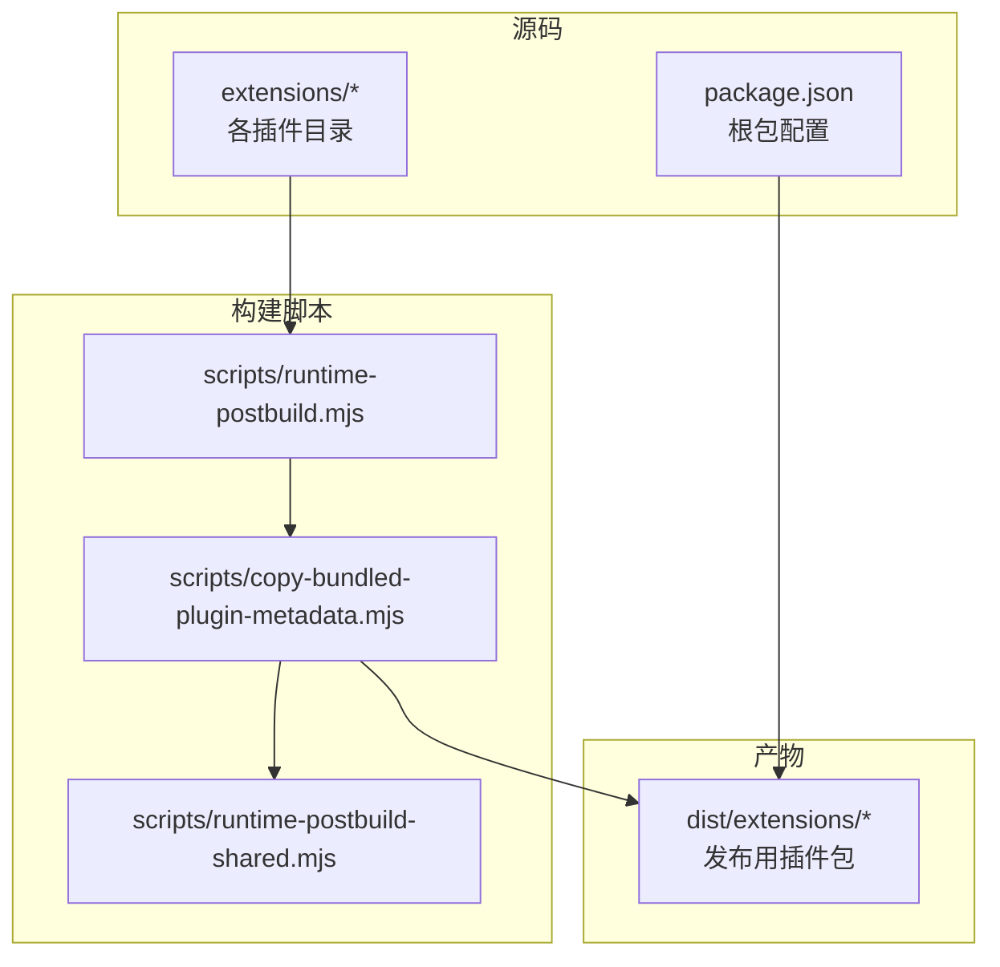
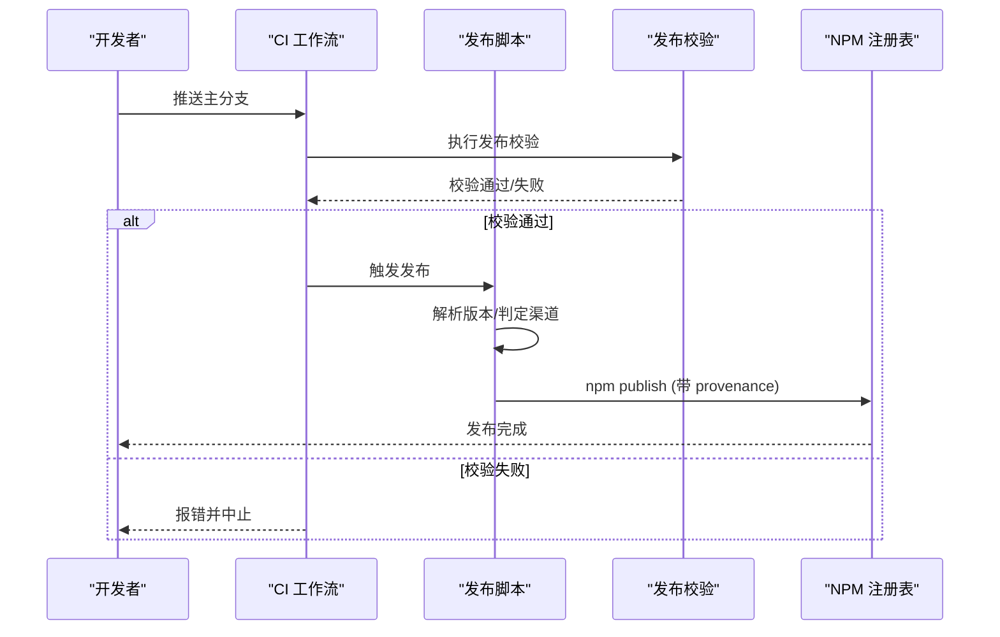
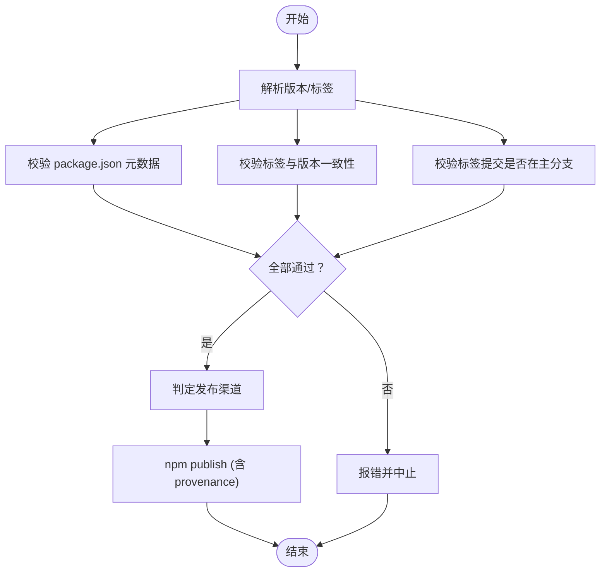
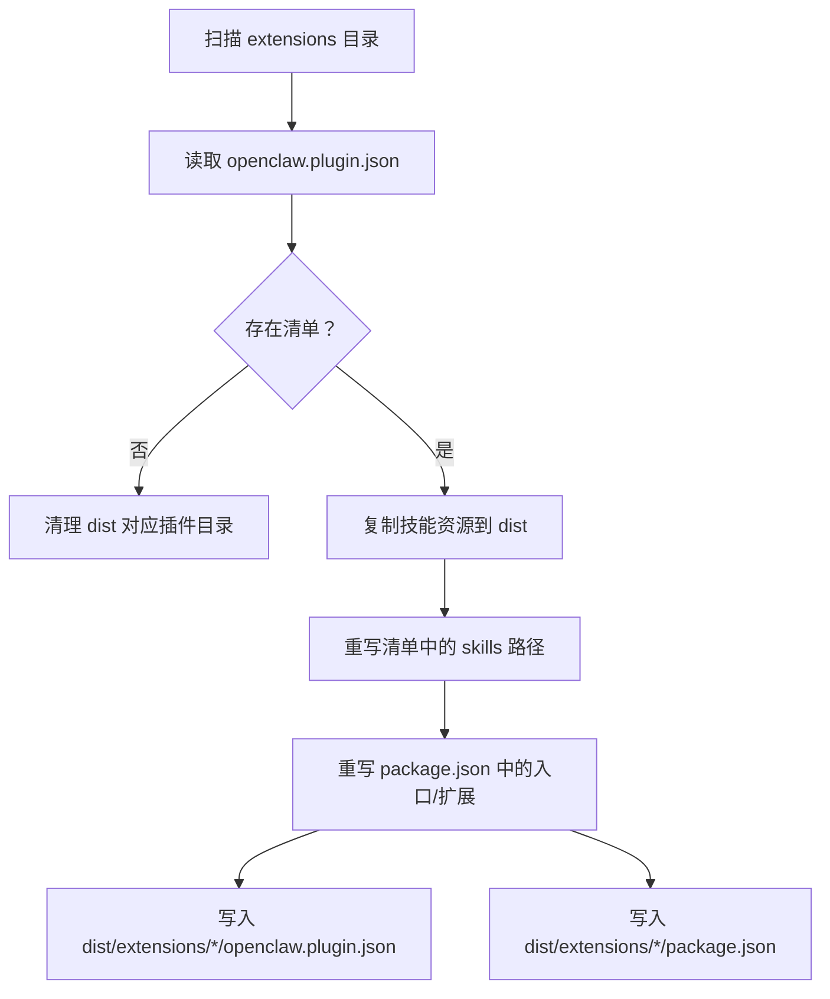
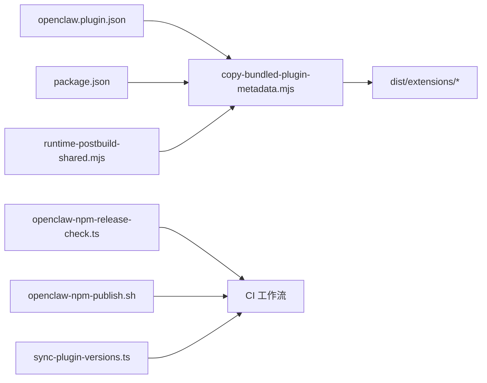

# 部署与分发

<cite>
**本文引用的文件**
- [openclaw-npm-publish.sh](file://scripts/openclaw-npm-publish.sh)
- [openclaw-npm-release-check.ts](file://scripts/openclaw-npm-release-check.ts)
- [sync-plugin-versions.ts](file://scripts/sync-plugin-versions.ts)
- [copy-bundled-plugin-metadata.mjs](file://scripts/copy-bundled-plugin-metadata.mjs)
- [runtime-postbuild.mjs](file://scripts/runtime-postbuild.mjs)
- [runtime-postbuild-shared.mjs](file://scripts/runtime-postbuild-shared.mjs)
- [ci.yml](file://.github/workflows/ci.yml)
- [.npmignore](file://extensions/.npmignore)
- [anthropic/openclaw.plugin.json](file://extensions/anthropic/openclaw.plugin.json)
- [discord/openclaw.plugin.json](file://extensions/discord/openclaw.plugin.json)
- [google/openclaw.plugin.json](file://extensions/google/openclaw.plugin.json)
- [telegram/openclaw.plugin.json](file://extensions/telegram/openclaw.plugin.json)
- [memory-core/openclaw.plugin.json](file://extensions/memory-core/openclaw.plugin.json)
- [voice-call/openclaw.plugin.json](file://extensions/voice-call/openclaw.plugin.json)
</cite>

## 目录
1. [简介](#简介)
2. [项目结构](#项目结构)
3. [核心组件](#核心组件)
4. [架构总览](#架构总览)
5. [详细组件分析](#详细组件分析)
6. [依赖关系分析](#依赖关系分析)
7. [性能考量](#性能考量)
8. [故障排查指南](#故障排查指南)
9. [结论](#结论)
10. [附录](#附录)

## 简介
本指南面向插件开发者与运维工程师，系统阐述 OpenClaw 插件的打包、版本管理、发布与分发流程；详解插件清单文件 openclaw.plugin.json 的配置与元数据规范；给出签名与验证、安全检查要点；提供插件市场提交与审核建议；并配套自动化部署脚本与 CI/CD 集成方案，以及插件更新与向后兼容策略。

## 项目结构
OpenClaw 将插件以“扩展”形式组织在 extensions 目录下，每个插件包含独立的 openclaw.plugin.json 清单与 package.json。构建阶段通过运行时后置构建脚本复制并规范化插件元数据到 dist 输出目录，供发布与安装使用。CI 工作流负责在推送主分支时执行发布前校验与测试。

**图表来源**
- [runtime-postbuild.mjs:5-8](file://scripts/runtime-postbuild.mjs#L5-L8)
- [copy-bundled-plugin-metadata.mjs:129-188](file://scripts/copy-bundled-plugin-metadata.mjs#L129-L188)
- [runtime-postbuild-shared.mjs:4-17](file://scripts/runtime-postbuild-shared.mjs#L4-L17)

**章节来源**
- [ci.yml:116-140](file://.github/workflows/ci.yml#L116-L140)
- [runtime-postbuild.mjs:5-8](file://scripts/runtime-postbuild.mjs#L5-L8)
- [copy-bundled-plugin-metadata.mjs:129-188](file://scripts/copy-bundled-plugin-metadata.mjs#L129-L188)

## 核心组件
- 发布校验与渠道判定：根据版本号自动识别稳定/测试通道，并输出发布命令。
- 版本同步工具：批量对齐插件版本与根版本，生成变更记录。
- 构建期插件元数据复制：将插件清单与资源复制到 dist，重写入口与扩展路径，确保发布包不携带 node_modules 嵌套树。
- CI 发布检查：在主分支推送时执行发布内容校验，保证版本格式、仓库地址、二进制入口等符合规范。

**章节来源**
- [openclaw-npm-publish.sh:12-23](file://scripts/openclaw-npm-publish.sh#L12-L23)
- [openclaw-npm-release-check.ts:100-160](file://scripts/openclaw-npm-release-check.ts#L100-L160)
- [sync-plugin-versions.ts:41-101](file://scripts/sync-plugin-versions.ts#L41-L101)
- [copy-bundled-plugin-metadata.mjs:129-188](file://scripts/copy-bundled-plugin-metadata.mjs#L129-L188)
- [ci.yml:116-140](file://.github/workflows/ci.yml#L116-L140)

## 架构总览
下图展示从源码到发布产物的关键流程：版本解析与渠道判定、插件版本同步、构建期元数据复制、发布前校验与实际发布。

**图表来源**
- [ci.yml:116-140](file://.github/workflows/ci.yml#L116-L140)
- [openclaw-npm-publish.sh:12-33](file://scripts/openclaw-npm-publish.sh#L12-L33)
- [openclaw-npm-release-check.ts:289-321](file://scripts/openclaw-npm-release-check.ts#L289-L321)

## 详细组件分析

### 组件一：插件清单文件 openclaw.plugin.json 规范
- 必填字段
  - id：插件唯一标识，建议与插件目录名一致。
  - kind：可选，如 memory 表示内存类插件。
  - channels/providers：声明该插件支持的频道或模型提供商。
  - configSchema：基于 JSON Schema 的配置校验定义，用于运行时参数校验与 UI 呈现。
- 可选字段
  - providerAuthEnvVars：按提供商映射所需的认证环境变量列表。
  - uiHints：为配置项提供标签、帮助文本、占位符、是否敏感、是否高级等元信息，便于 UI 自动渲染。
  - skills：声明随插件打包的技能资源路径（相对插件根或 node_modules 内部），构建时会复制到 dist 并重写清单中的路径。
  - openclaw.setupEntry/openclaw.extensions：在 package.json 中声明的入口与扩展，构建时会被重写为 .js 后缀并写入 dist/package.json。

示例参考：
- [anthropic/openclaw.plugin.json:1-13](file://extensions/anthropic/openclaw.plugin.json#L1-L13)
- [discord/openclaw.plugin.json:1-10](file://extensions/discord/openclaw.plugin.json#L1-L10)
- [google/openclaw.plugin.json:1-13](file://extensions/google/openclaw.plugin.json#L1-L13)
- [telegram/openclaw.plugin.json:1-10](file://extensions/telegram/openclaw.plugin.json#L1-L10)
- [memory-core/openclaw.plugin.json:1-10](file://extensions/memory-core/openclaw.plugin.json#L1-L10)
- [voice-call/openclaw.plugin.json:1-612](file://extensions/voice-call/openclaw.plugin.json#L1-L612)

**章节来源**
- [anthropic/openclaw.plugin.json:1-13](file://extensions/anthropic/openclaw.plugin.json#L1-L13)
- [discord/openclaw.plugin.json:1-10](file://extensions/discord/openclaw.plugin.json#L1-L10)
- [google/openclaw.plugin.json:1-13](file://extensions/google/openclaw.plugin.json#L1-L13)
- [telegram/openclaw.plugin.json:1-10](file://extensions/telegram/openclaw.plugin.json#L1-L10)
- [memory-core/openclaw.plugin.json:1-10](file://extensions/memory-core/openclaw.plugin.json#L1-L10)
- [voice-call/openclaw.plugin.json:1-612](file://extensions/voice-call/openclaw.plugin.json#L1-L612)

### 组件二：版本管理与发布流程
- 版本格式
  - 稳定版：YYYY.M.D
  - 测试版：YYYY.M.D-beta.N
  - 修正标签：YYYY.M.D-N（仅稳定版）
- 发布渠道
  - 稳定版：直接发布
  - 测试版：带 beta 标签发布
- 发布前校验
  - 校验 package.json 字段（名称、描述、许可证、仓库地址、二进制入口、peer 依赖等）
  - 校验版本与标签一致性与日期偏差
  - 校验打标签提交是否在主分支内
- 实际发布
  - 使用受信发布（GitHub OIDC）与 provenance 标记

**图表来源**
- [openclaw-npm-release-check.ts:100-160](file://scripts/openclaw-npm-release-check.ts#L100-L160)
- [openclaw-npm-release-check.ts:211-283](file://scripts/openclaw-npm-release-check.ts#L211-L283)
- [openclaw-npm-publish.sh:12-33](file://scripts/openclaw-npm-publish.sh#L12-L33)

**章节来源**
- [openclaw-npm-release-check.ts:100-160](file://scripts/openclaw-npm-release-check.ts#L100-L160)
- [openclaw-npm-release-check.ts:211-283](file://scripts/openclaw-npm-release-check.ts#L211-L283)
- [openclaw-npm-publish.sh:12-33](file://scripts/openclaw-npm-publish.sh#L12-L33)

### 组件三：插件版本同步与变更记录
- 功能
  - 将所有插件的版本对齐至根版本
  - 在每个插件的 CHANGELOG.md 中追加版本条目
  - 移除插件 package.json 中的 workspace:* 开发依赖（避免发布包污染）
- 输出
  - 返回更新统计（已更新、已记录、跳过、已移除 workspace 依赖）

**章节来源**
- [sync-plugin-versions.ts:41-101](file://scripts/sync-plugin-versions.ts#L41-L101)

### 组件四：构建期插件元数据复制与规范化
- 能力
  - 复制插件清单与技能资源到 dist/extensions
  - 重写 package.json 中的入口与扩展为 .js 后缀
  - 对 node_modules 内部的技能资源进行重定位，避免发布包携带嵌套 node_modules 树
  - 仅保留实际存在的技能路径
- 产物
  - dist/extensions/*/openclaw.plugin.json（已重写 skills 路径）
  - dist/extensions/*/package.json（已重写 openclaw.setupEntry/openclaw.extensions）

**图表来源**
- [copy-bundled-plugin-metadata.mjs:129-188](file://scripts/copy-bundled-plugin-metadata.mjs#L129-L188)
- [runtime-postbuild-shared.mjs:4-17](file://scripts/runtime-postbuild-shared.mjs#L4-L17)

**章节来源**
- [copy-bundled-plugin-metadata.mjs:129-188](file://scripts/copy-bundled-plugin-metadata.mjs#L129-L188)
- [runtime-postbuild-shared.mjs:4-17](file://scripts/runtime-postbuild-shared.mjs#L4-L17)
- [runtime-postbuild.mjs:5-8](file://scripts/runtime-postbuild.mjs#L5-L8)

### 组件五：CI/CD 集成与自动化
- CI 关键步骤
  - 构建 dist 并上传工件
  - 主分支推送时执行发布校验
  - 运行 Node、Windows、macOS、Android 等多平台测试与检查
- 发布校验在 CI 中的触发条件
  - 仅在主分支推送且非仅文档改动时执行
  - 下载 dist 工件并运行 pnpm release:check

**章节来源**
- [ci.yml:82-140](file://.github/workflows/ci.yml#L82-L140)

## 依赖关系分析
- 插件清单与构建脚本
  - 每个插件的 openclaw.plugin.json 是构建期复制与重写的输入
  - 构建脚本依赖 runtime-postbuild-shared 提供的文件操作能力
- 发布脚本与 CI
  - openclaw-npm-publish.sh 依赖 GitHub OIDC 受信发布与 npm provenance
  - CI 在主分支推送时自动触发发布校验
- 版本同步与发布校验
  - sync-plugin-versions.ts 与 openclaw-npm-release-check.ts 协同，确保版本与标签一致、仓库与二进制入口合规

**图表来源**
- [copy-bundled-plugin-metadata.mjs:129-188](file://scripts/copy-bundled-plugin-metadata.mjs#L129-L188)
- [runtime-postbuild-shared.mjs:4-17](file://scripts/runtime-postbuild-shared.mjs#L4-L17)
- [openclaw-npm-release-check.ts:289-321](file://scripts/openclaw-npm-release-check.ts#L289-L321)
- [openclaw-npm-publish.sh:12-33](file://scripts/openclaw-npm-publish.sh#L12-L33)
- [sync-plugin-versions.ts:41-101](file://scripts/sync-plugin-versions.ts#L41-L101)
- [ci.yml:116-140](file://.github/workflows/ci.yml#L116-L140)

**章节来源**
- [copy-bundled-plugin-metadata.mjs:129-188](file://scripts/copy-bundled-plugin-metadata.mjs#L129-L188)
- [openclaw-npm-release-check.ts:289-321](file://scripts/openclaw-npm-release-check.ts#L289-L321)
- [openclaw-npm-publish.sh:12-33](file://scripts/openclaw-npm-publish.sh#L12-L33)
- [sync-plugin-versions.ts:41-101](file://scripts/sync-plugin-versions.ts#L41-L101)
- [ci.yml:116-140](file://.github/workflows/ci.yml#L116-L140)

## 性能考量
- 构建期复制策略
  - 使用过滤器排除 node_modules 子树，减少打包体积与潜在安全风险
  - 仅复制实际存在的技能路径，避免空转与冗余 IO
- CI 并行与缓存
  - 多任务分片与平台矩阵并行执行，缩短整体耗时
  - 依赖缓存与粘滞磁盘策略优化安装与编译时间
- 发布校验
  - 仅在主分支推送时执行，避免 PR 场景下的重复开销

**章节来源**
- [copy-bundled-plugin-metadata.mjs:109-123](file://scripts/copy-bundled-plugin-metadata.mjs#L109-L123)
- [ci.yml:142-207](file://.github/workflows/ci.yml#L142-L207)

## 故障排查指南
- 发布校验失败
  - 检查 package.json 字段是否满足要求（名称、描述、许可证、仓库地址、二进制入口、peer 依赖）
  - 确认版本与标签格式正确且日期偏差在允许范围内
  - 确认打标签提交确实在主分支内
- 插件未出现在 dist
  - 确认插件目录下存在 openclaw.plugin.json
  - 确认清单中的 skills 路径在插件根或 node_modules 内部且可访问
- 版本不同步
  - 运行版本同步脚本，确认根版本已更新，插件 CHANGELOG 已追加条目
- CI 中断
  - 查看 CI 日志中“Release check”与“Checks”阶段输出，定位具体失败原因

**章节来源**
- [openclaw-npm-release-check.ts:170-209](file://scripts/openclaw-npm-release-check.ts#L170-L209)
- [openclaw-npm-release-check.ts:211-283](file://scripts/openclaw-npm-release-check.ts#L211-L283)
- [copy-bundled-plugin-metadata.mjs:85-127](file://scripts/copy-bundled-plugin-metadata.mjs#L85-L127)
- [sync-plugin-versions.ts:41-101](file://scripts/sync-plugin-versions.ts#L41-L101)
- [ci.yml:116-140](file://.github/workflows/ci.yml#L116-L140)

## 结论
通过规范化的插件清单、严格的版本与发布校验、构建期元数据复制与 CI 自动化，OpenClaw 形成了可复用、可审计、可扩展的插件部署与分发体系。遵循本文档的配置与流程，可显著降低发布风险并提升交付效率。

## 附录

### 插件清单字段速查
- id：插件唯一标识
- kind：插件类型（如 memory）
- channels/providers：支持的频道/提供商
- providerAuthEnvVars：提供商认证所需环境变量
- configSchema：配置校验 JSON Schema
- uiHints：配置项 UI 元信息
- skills：随插件打包的技能资源路径（构建期复制）
- openclaw.setupEntry/openclaw.extensions：入口与扩展（构建期重写）

**章节来源**
- [anthropic/openclaw.plugin.json:1-13](file://extensions/anthropic/openclaw.plugin.json#L1-L13)
- [discord/openclaw.plugin.json:1-10](file://extensions/discord/openclaw.plugin.json#L1-L10)
- [google/openclaw.plugin.json:1-13](file://extensions/google/openclaw.plugin.json#L1-L13)
- [telegram/openclaw.plugin.json:1-10](file://extensions/telegram/openclaw.plugin.json#L1-L10)
- [memory-core/openclaw.plugin.json:1-10](file://extensions/memory-core/openclaw.plugin.json#L1-L10)
- [voice-call/openclaw.plugin.json:1-612](file://extensions/voice-call/openclaw.plugin.json#L1-L612)

### 插件市场提交与审核要点
- 清单完整性：确保 openclaw.plugin.json 字段齐全、configSchema 完整、uiHints 明确
- 认证与安全：providerAuthEnvVars 列出所有必需密钥；避免在清单中硬编码敏感信息
- 资源合规：skills 路径仅指向实际存在的资源；避免携带 node_modules 嵌套树
- 版本与标签：遵循 CalVer 与标签规范；修正标签仅用于稳定版
- CI 通过：确保 CI 中“Release check”与“Checks”均通过

**章节来源**
- [openclaw-npm-release-check.ts:100-160](file://scripts/openclaw-npm-release-check.ts#L100-L160)
- [openclaw-npm-release-check.ts:211-283](file://scripts/openclaw-npm-release-check.ts#L211-L283)
- [copy-bundled-plugin-metadata.mjs:129-188](file://scripts/copy-bundled-plugin-metadata.mjs#L129-L188)

### 自动化部署脚本与 CI/CD 集成
- 发布脚本
  - [openclaw-npm-publish.sh:1-34](file://scripts/openclaw-npm-publish.sh#L1-L34)
- 发布校验
  - [openclaw-npm-release-check.ts:1-322](file://scripts/openclaw-npm-release-check.ts#L1-L322)
- 插件版本同步
  - [sync-plugin-versions.ts:1-109](file://scripts/sync-plugin-versions.ts#L1-L109)
- 构建期元数据复制
  - [copy-bundled-plugin-metadata.mjs:1-206](file://scripts/copy-bundled-plugin-metadata.mjs#L1-L206)
  - [runtime-postbuild.mjs:1-13](file://scripts/runtime-postbuild.mjs#L1-L13)
  - [runtime-postbuild-shared.mjs:1-36](file://scripts/runtime-postbuild-shared.mjs#L1-L36)
- CI 工作流
  - [ci.yml:1-827](file://.github/workflows/ci.yml#L1-L827)

**章节来源**
- [openclaw-npm-publish.sh:1-34](file://scripts/openclaw-npm-publish.sh#L1-L34)
- [openclaw-npm-release-check.ts:1-322](file://scripts/openclaw-npm-release-check.ts#L1-L322)
- [sync-plugin-versions.ts:1-109](file://scripts/sync-plugin-versions.ts#L1-L109)
- [copy-bundled-plugin-metadata.mjs:1-206](file://scripts/copy-bundled-plugin-metadata.mjs#L1-L206)
- [runtime-postbuild.mjs:1-13](file://scripts/runtime-postbuild.mjs#L1-L13)
- [runtime-postbuild-shared.mjs:1-36](file://scripts/runtime-postbuild-shared.mjs#L1-L36)
- [ci.yml:1-827](file://.github/workflows/ci.yml#L1-L827)

### 插件更新机制与向后兼容
- 版本策略
  - 稳定版采用 CalVer；测试版带 -beta.N；必要时使用修正标签 -N
- 清单演进
  - 新增字段建议保持默认值或可选；避免破坏现有配置
  - configSchema 中新增属性需谨慎，优先使用 additionalProperties 控制
- 发布前验证
  - 通过发布校验确保版本、标签、仓库与二进制入口一致
- CI 门禁
  - 保持多平台测试与检查通过，防止引入回归

**章节来源**
- [openclaw-npm-release-check.ts:100-160](file://scripts/openclaw-npm-release-check.ts#L100-L160)
- [ci.yml:142-207](file://.github/workflows/ci.yml#L142-L207)