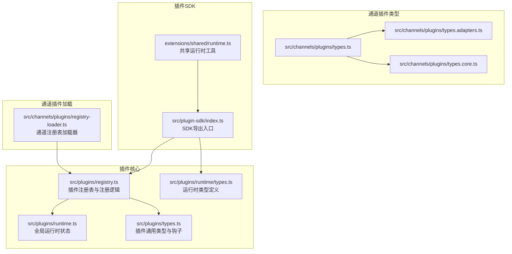
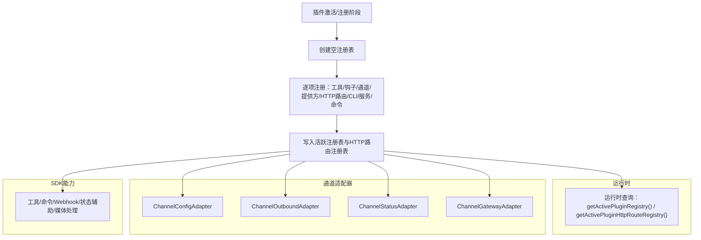
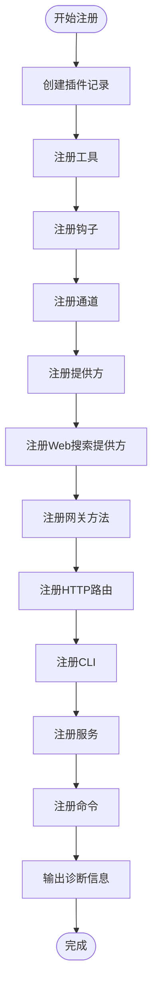
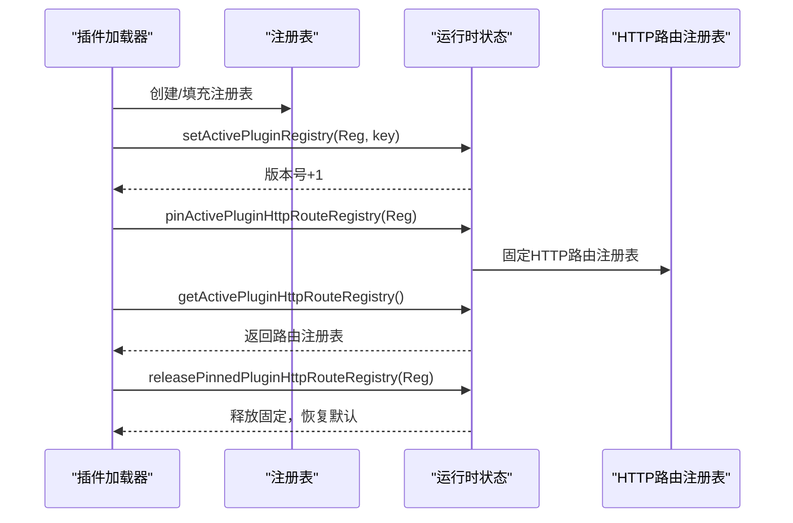
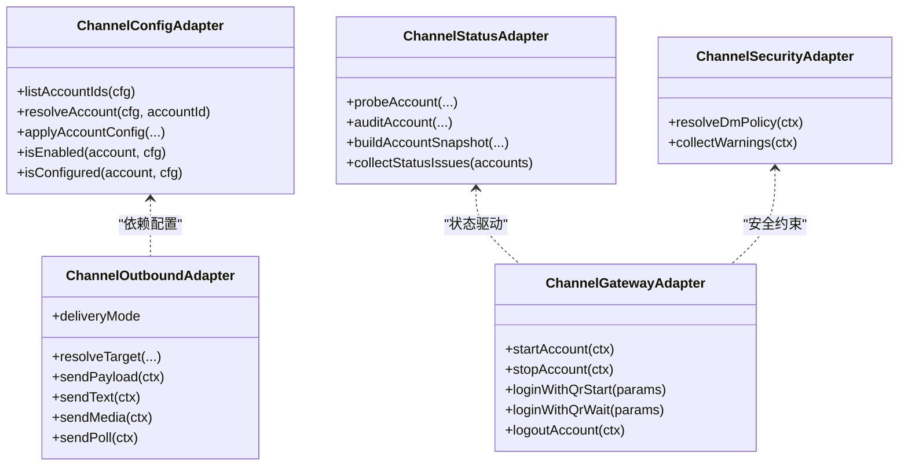
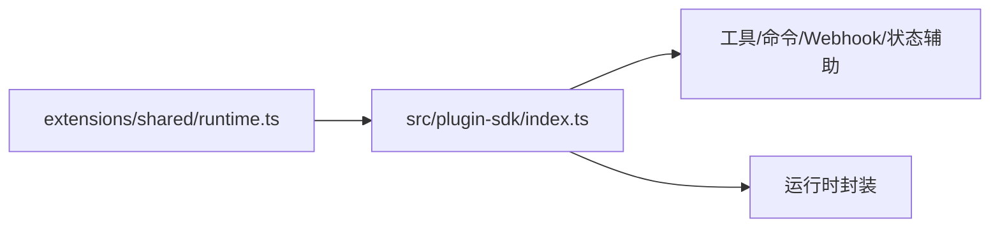
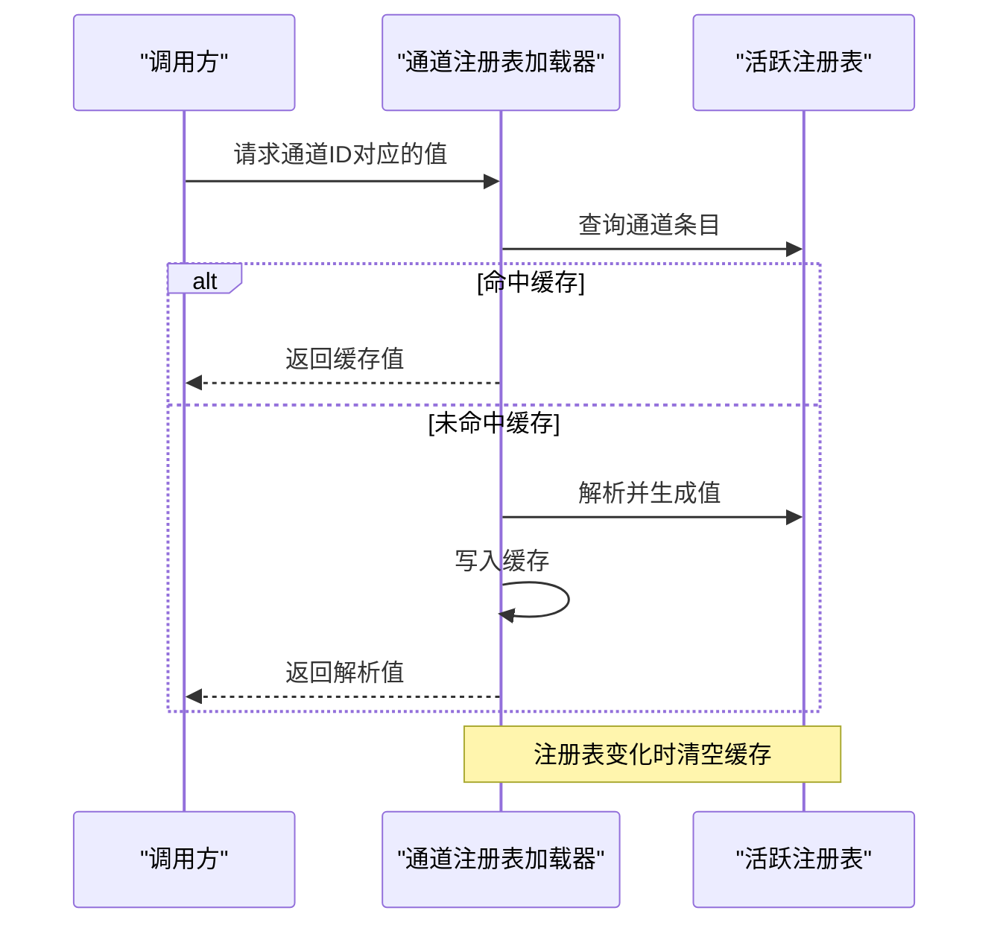
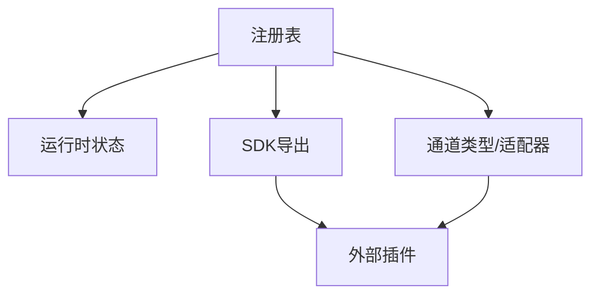

# 插件架构设计

<cite>
**本文档引用的文件**
- [src/plugins/registry.ts](file://src/plugins/registry.ts)
- [src/plugins/runtime.ts](file://src/plugins/runtime.ts)
- [src/plugins/types.ts](file://src/plugins/types.ts)
- [src/plugins/runtime/types.ts](file://src/plugins/runtime/types.ts)
- [src/channels/plugins/types.ts](file://src/channels/plugins/types.ts)
- [src/channels/plugins/types.adapters.ts](file://src/channels/plugins/types.adapters.ts)
- [src/channels/plugins/types.core.ts](file://src/channels/plugins/types.core.ts)
- [src/plugin-sdk/index.ts](file://src/plugin-sdk/index.ts)
- [extensions/shared/runtime.ts](file://extensions/shared/runtime.ts)
- [src/channels/plugins/registry-loader.ts](file://src/channels/plugins/registry-loader.ts)
- [SECURITY.md](file://SECURITY.md)
</cite>

## 目录
1. [引言](#引言)
2. [项目结构](#项目结构)
3. [核心组件](#核心组件)
4. [架构总览](#架构总览)
5. [详细组件分析](#详细组件分析)
6. [依赖分析](#依赖分析)
7. [性能考虑](#性能考虑)
8. [故障排除指南](#故障排除指南)
9. [结论](#结论)

## 引言
本文件面向开发者与维护者，系统化阐述 OpenClaw 插件架构的设计理念、整体架构、组件关系与运行时机制。重点覆盖插件分类体系（Provider、Channel、Tool、Memory 等）、插件注册流程、依赖解析、版本兼容性与安全边界，并通过架构图与序列图帮助理解插件系统的实现细节与技术决策。

## 项目结构
OpenClaw 的插件系统由“插件注册表”“运行时状态”“通道适配器类型”“插件 SDK 导出入口”等模块构成，形成可扩展、可治理、可演进的插件生态。下图展示与插件架构直接相关的目录与文件关系：

**图表来源**
- [src/plugins/registry.ts](file://src/plugins/registry.ts)
- [src/plugins/runtime.ts](file://src/plugins/runtime.ts)
- [src/plugins/runtime/types.ts](file://src/plugins/runtime/types.ts)
- [src/plugins/types.ts](file://src/plugins/types.ts)
- [src/channels/plugins/types.ts](file://src/channels/plugins/types.ts)
- [src/channels/plugins/types.adapters.ts](file://src/channels/plugins/types.adapters.ts)
- [src/channels/plugins/types.core.ts](file://src/channels/plugins/types.core.ts)
- [src/plugin-sdk/index.ts](file://src/plugin-sdk/index.ts)
- [extensions/shared/runtime.ts](file://extensions/shared/runtime.ts)
- [src/channels/plugins/registry-loader.ts](file://src/channels/plugins/registry-loader.ts)

**章节来源**
- [src/plugins/registry.ts](file://src/plugins/registry.ts)
- [src/plugins/runtime.ts](file://src/plugins/runtime.ts)
- [src/plugins/runtime/types.ts](file://src/plugins/runtime/types.ts)
- [src/plugins/types.ts](file://src/plugins/types.ts)
- [src/channels/plugins/types.ts](file://src/channels/plugins/types.ts)
- [src/channels/plugins/types.adapters.ts](file://src/channels/plugins/types.adapters.ts)
- [src/channels/plugins/types.core.ts](file://src/channels/plugins/types.core.ts)
- [src/plugin-sdk/index.ts](file://src/plugin-sdk/index.ts)
- [extensions/shared/runtime.ts](file://extensions/shared/runtime.ts)
- [src/channels/plugins/registry-loader.ts](file://src/channels/plugins/registry-loader.ts)

## 核心组件
- 插件注册表：集中管理插件记录、工具、钩子、通道、提供方、HTTP 路由、CLI 命令、服务等，支持诊断信息收集与重复项检测。
- 运行时状态：以全局单例持有当前活跃注册表与 HTTP 路由注册表，支持版本号与键值缓存，保障路由解析一致性。
- 通道插件类型：定义通道适配器接口、账户快照、消息动作、线程上下文、能力声明等，统一不同通道的接入方式。
- 插件 SDK：对外暴露工具、命令、Webhook、状态辅助、运行时封装等能力，作为插件开发的统一入口。
- 共享运行时工具：为外部插件提供日志后端运行时的便捷构造方法，确保在无内置通道能力时仍可使用 SDK 能力。

**章节来源**
- [src/plugins/registry.ts](file://src/plugins/registry.ts)
- [src/plugins/runtime.ts](file://src/plugins/runtime.ts)
- [src/channels/plugins/types.adapters.ts](file://src/channels/plugins/types.adapters.ts)
- [src/channels/plugins/types.core.ts](file://src/channels/plugins/types.core.ts)
- [src/plugin-sdk/index.ts](file://src/plugin-sdk/index.ts)
- [extensions/shared/runtime.ts](file://extensions/shared/runtime.ts)

## 架构总览
OpenClaw 插件系统采用“注册表驱动 + 运行时状态 + 类型约束”的分层架构。插件在激活阶段通过统一 API 注册各类能力；运行时通过全局状态暴露活跃注册表与路由注册表；通道插件通过适配器类型实现跨平台一致性；SDK 提供开发与集成所需的公共能力。

**图表来源**
- [src/plugins/registry.ts](file://src/plugins/registry.ts)
- [src/plugins/runtime.ts](file://src/plugins/runtime.ts)
- [src/channels/plugins/types.adapters.ts](file://src/channels/plugins/types.adapters.ts)
- [src/plugin-sdk/index.ts](file://src/plugin-sdk/index.ts)

## 详细组件分析

### 组件A：插件注册表与注册流程
- 职责：构建并维护插件注册表，提供注册工具、钩子、通道、提供方、Web 搜索提供方、网关方法、HTTP 路由、CLI、服务与命令的能力；进行重复项检测与冲突诊断。
- 关键点：
  - 工具注册：支持工厂函数或静态工具对象，自动规范化名称列表，标记可选工具。
  - 钩子注册：支持事件数组与元数据，避免同名钩子重复注册，按配置决定是否写入内部钩子系统。
  - 通道注册：区分“仅设置”与“完整”模式，避免重复注册同一通道 ID。
  - 提供方注册：标准化提供方 ID 与配置，避免重复注册。
  - HTTP 路由注册：路径归一化、匹配模式与鉴权校验、重叠冲突检测与替换策略。
  - CLI 注册：命令集合去重与冲突报告。
  - 服务注册：服务 ID 去重。
  - 命令注册：验证命令定义，非激活快照加载时跳过全局命令写入，保留诊断一致性。
  - 类型化钩子：按钩子名称白名单过滤，支持提示注入策略控制。
- 复杂度与性能：注册过程以 O(n) 遍历现有条目进行冲突检查；HTTP 路由重叠检测为 O(m×n)（m 为新路由数，n 为已注册路由数），建议在构建期做预检。

**图表来源**
- [src/plugins/registry.ts](file://src/plugins/registry.ts)

**章节来源**
- [src/plugins/registry.ts](file://src/plugins/registry.ts)

### 组件B：运行时状态与路由解析
- 职责：维护全局活跃注册表与 HTTP 路由注册表，支持版本号递增、键值缓存、路由注册表固定/释放与回退策略。
- 关键点：
  - setActivePluginRegistry：切换活跃注册表并更新版本号。
  - pinActivePluginHttpRouteRegistry/releasePinnedPluginHttpRouteRegistry：固定/释放 HTTP 路由注册表，保证路由解析一致性。
  - getActivePluginHttpRouteRegistry/requireActivePluginHttpRouteRegistry/resolveActivePluginHttpRouteRegistry：按优先级返回可用路由注册表。
- 性能：全局状态访问为 O(1)，路由解析受注册表规模影响，建议在启动阶段完成路由注册，避免运行时频繁变更。

**图表来源**
- [src/plugins/runtime.ts](file://src/plugins/runtime.ts)

**章节来源**
- [src/plugins/runtime.ts](file://src/plugins/runtime.ts)

### 组件C：通道插件类型与适配器
- 职责：通过适配器抽象通道差异，统一账户配置、消息发送、状态探测、网关启停、权限与安全策略等。
- 关键类型：
  - ChannelConfigAdapter：账户列表、解析、启用/禁用、配置检查、允许来源解析与格式化。
  - ChannelOutboundAdapter：目标解析、文本/媒体/投票发送、分片策略。
  - ChannelStatusAdapter：探针、审计、账户快照构建、状态问题收集。
  - ChannelGatewayAdapter：账户启动/停止、二维码登录、登出。
  - ChannelAuthAdapter：登录流程。
  - ChannelHeartbeatAdapter：就绪检查、收件人解析。
  - ChannelDirectoryAdapter：自/群组/成员枚举。
  - ChannelResolverAdapter：目标解析。
  - ChannelElevatedAdapter：允许来源回退。
  - ChannelCommandAdapter：命令执行策略。
  - ChannelSecurityAdapter：DM 策略与警告收集。
- 设计要点：类型严格约束，通道间行为通过适配器对齐；对外暴露统一的“通道运行时”能力给外部插件，提升扩展性与一致性。

**图表来源**
- [src/channels/plugins/types.adapters.ts](file://src/channels/plugins/types.adapters.ts)
- [src/channels/plugins/types.core.ts](file://src/channels/plugins/types.core.ts)

**章节来源**
- [src/channels/plugins/types.ts](file://src/channels/plugins/types.ts)
- [src/channels/plugins/types.adapters.ts](file://src/channels/plugins/types.adapters.ts)
- [src/channels/plugins/types.core.ts](file://src/channels/plugins/types.core.ts)

### 组件D：插件SDK导出与共享运行时
- 职责：统一导出插件开发所需能力（工具、命令、Webhook、状态辅助、媒体处理、运行时封装等），并提供共享运行时工具以简化外部插件开发。
- 关键点：
  - SDK 导出：聚合各子模块类型与工具，便于插件按需引入。
  - 共享运行时：在无内置通道能力时，为外部插件提供日志后端运行时构造方法，确保一致的运行时体验。

**图表来源**
- [src/plugin-sdk/index.ts](file://src/plugin-sdk/index.ts)
- [extensions/shared/runtime.ts](file://extensions/shared/runtime.ts)

**章节来源**
- [src/plugin-sdk/index.ts](file://src/plugin-sdk/index.ts)
- [extensions/shared/runtime.ts](file://extensions/shared/runtime.ts)

### 组件E：通道注册表加载器
- 职责：基于活跃注册表按通道 ID 缓存解析结果，避免重复查找；当注册表变化时清空缓存，确保一致性。
- 关键点：缓存键为 ChannelId，值为解析结果；首次命中后写入缓存；注册表变更时清空缓存。

**图表来源**
- [src/channels/plugins/registry-loader.ts](file://src/channels/plugins/registry-loader.ts)

**章节来源**
- [src/channels/plugins/registry-loader.ts](file://src/channels/plugins/registry-loader.ts)

## 依赖分析
- 组件耦合：
  - 注册表与运行时状态强耦合：注册表变更触发运行时状态版本号递增与路由注册表同步。
  - 通道适配器依赖注册表中的通道条目与配置，形成“类型约束 + 运行时查询”的双层依赖。
  - SDK 导出模块聚合多子模块，作为插件开发的统一入口，降低外部插件的导入复杂度。
- 外部依赖与集成点：
  - HTTP 路由注册依赖路径归一化与重叠检测，确保路由唯一性与安全性。
  - 提供方注册依赖标准化流程，避免重复与冲突。
- 循环依赖风险：当前结构以注册表为中心向外辐射，未见明显循环依赖迹象。

**图表来源**
- [src/plugins/registry.ts](file://src/plugins/registry.ts)
- [src/plugins/runtime.ts](file://src/plugins/runtime.ts)
- [src/channels/plugins/types.adapters.ts](file://src/channels/plugins/types.adapters.ts)
- [src/plugin-sdk/index.ts](file://src/plugin-sdk/index.ts)

**章节来源**
- [src/plugins/registry.ts](file://src/plugins/registry.ts)
- [src/plugins/runtime.ts](file://src/plugins/runtime.ts)
- [src/channels/plugins/types.adapters.ts](file://src/channels/plugins/types.adapters.ts)
- [src/plugin-sdk/index.ts](file://src/plugin-sdk/index.ts)

## 性能考虑
- 注册阶段：
  - 工具/钩子/通道/提供方等注册为 O(n) 操作；HTTP 路由重叠检测为 O(m×n)，建议在构建期进行预检与去重。
  - 命令注册在非激活快照加载时跳过全局写入，减少冲突检测开销。
- 运行时：
  - 运行时状态为全局单例，查询为 O(1)；路由解析优先使用固定注册表，避免频繁切换带来的额外判断。
- 通道加载：
  - 通道注册表加载器带缓存，首次解析后复用，显著降低重复查询成本。

[本节为通用性能讨论，不直接分析具体文件]

## 故障排除指南
- 常见错误与定位：
  - 重复注册：钩子、通道、提供方、HTTP 路由、CLI 命令等均会进行重复项检测并输出诊断信息，需根据插件 ID 与源文件定位冲突来源。
  - HTTP 路由冲突：路径与匹配模式相同但鉴权不一致会被拒绝；替换策略要求所有者一致，否则拒绝替换。
  - 配置校验失败：插件配置不符合 Schema 将被拒绝，需检查配置值与 Schema 定义。
  - 缺少注册导出：插件缺少 register/activate 导出会报错，需确认导出函数存在且可调用。
- 建议排查步骤：
  - 查看诊断输出，定位冲突或非法注册项。
  - 校验插件配置 Schema 与输入值。
  - 确认路由路径归一化与鉴权设置。
  - 在非激活快照加载场景下，确认命令定义验证通过但未写入全局命令表。

**章节来源**
- [src/plugins/registry.ts](file://src/plugins/registry.ts)

## 结论
OpenClaw 插件架构以“注册表 + 运行时状态 + 类型约束 + SDK 导出”为核心，实现了跨平台通道适配、提供方扩展、工具与命令集成以及 Webhook/网关方法的统一治理。通过严格的重复检测、冲突诊断与路由安全策略，系统在保证扩展性的同时兼顾了稳定性与安全性。建议在插件开发中遵循统一的注册流程、类型约束与配置校验规范，以获得最佳的兼容性与可维护性。