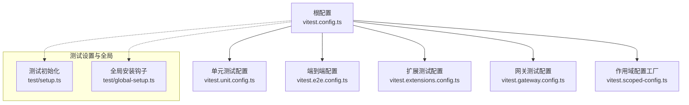
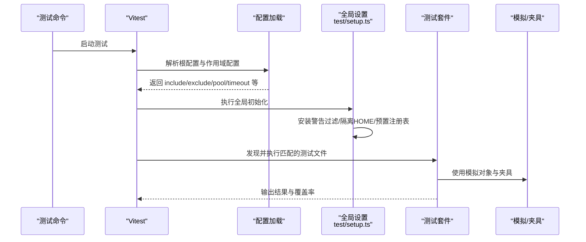
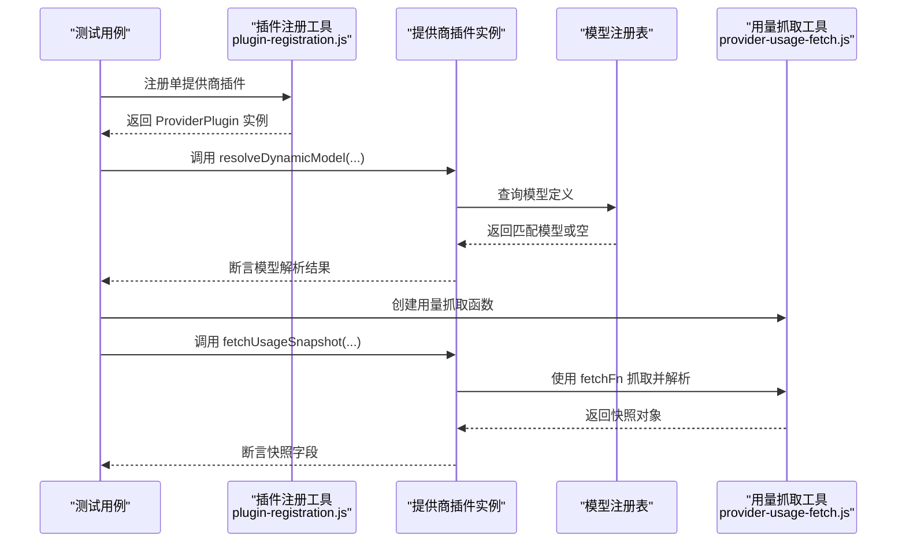
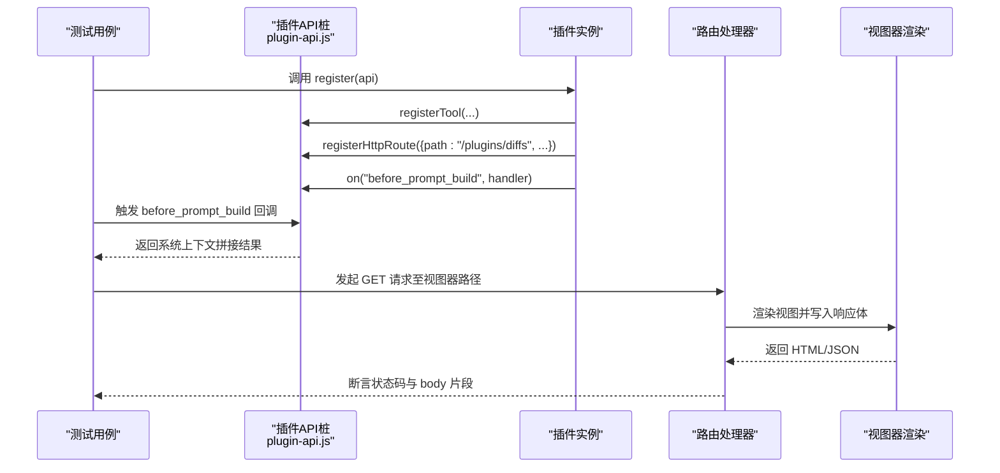
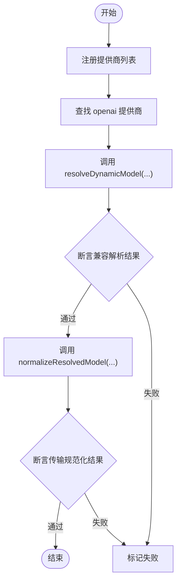
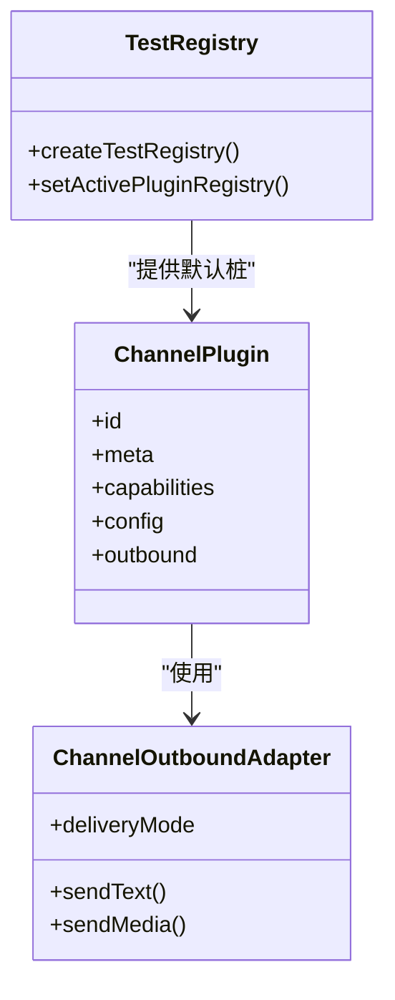
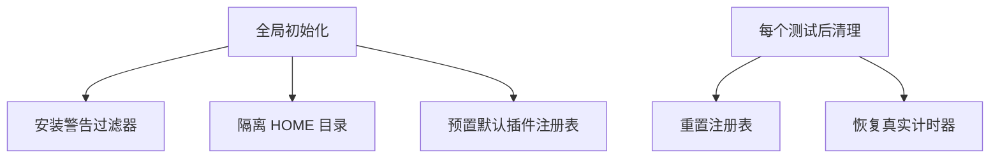
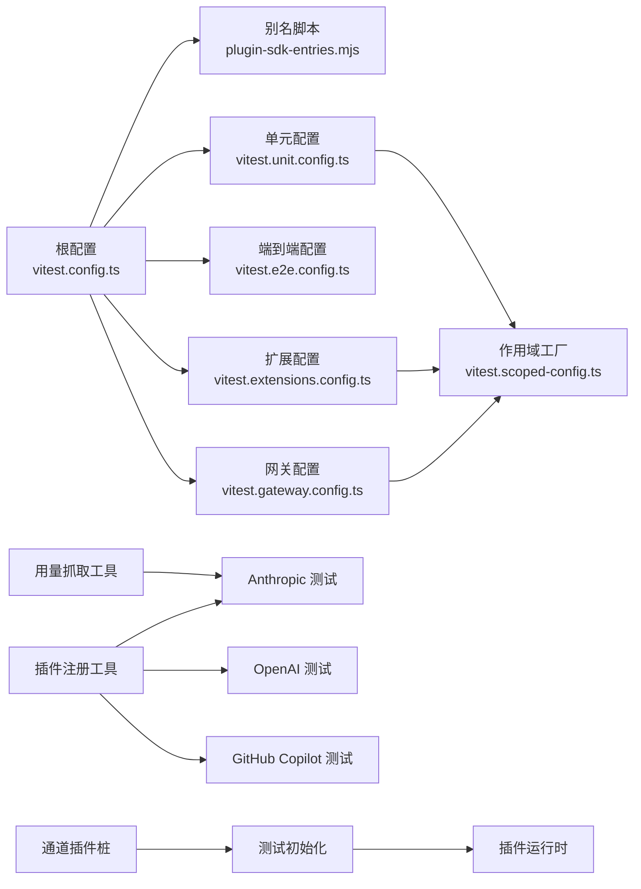

# 插件测试与调试

<cite>
**本文引用的文件**
- [vitest.config.ts](file://vitest.config.ts)
- [vitest.unit.config.ts](file://vitest.unit.config.ts)
- [vitest.e2e.config.ts](file://vitest.e2e.config.ts)
- [vitest.extensions.config.ts](file://vitest.extensions.config.ts)
- [vitest.gateway.config.ts](file://vitest.gateway.config.ts)
- [vitest.scoped-config.ts](file://vitest.scoped-config.ts)
- [test/setup.ts](file://test/setup.ts)
- [test/global-setup.ts](file://test/global-setup.ts)
- [extensions/anthropic/index.test.ts](file://extensions/anthropic/index.test.ts)
- [extensions/diffs/index.test.ts](file://extensions/diffs/index.test.ts)
- [extensions/openai/index.test.ts](file://extensions/openai/index.test.ts)
- [extensions/github-copilot/index.test.ts](file://extensions/github-copilot/index.test.ts)
- [src/test-utils/plugin-registration.js](file://src/test-utils/plugin-registration.js)
- [src/test-utils/provider-usage-fetch.js](file://src/test-utils/provider-usage-fetch.js)
- [src/test-utils/mock-http-response.js](file://src/test-utils/mock-http-response.js)
- [src/test-utils/channel-plugins.js](file://src/test-utils/channel-plugins.js)
- [src/plugins/runtime.js](file://src/plugins/runtime.js)
- [src/infra/warning-filter.js](file://src/infra/warning-filter.js)
- [src/infra/outbound/deliver.js](file://src/infra/outbound/deliver.js)
- [src/channels/plugins/types.js](file://src/channels/plugins/types.js)
- [src/config/config.js](file://src/config/config.js)
- [src/test-helpers/index.js](file://src/test-helpers/index.js)
- [src/test-utils/index.js](file://src/test-utils/index.js)
- [test/helpers/fast-short-timeouts.ts](file://test/helpers/fast-short-timeouts.ts)
- [test/helpers/temp-home.ts](file://test/helpers/temp-home.ts)
- [test/helpers/import-fresh.ts](file://test/helpers/import-fresh.ts)
- [test/fixtures/system-run-command-contract.json](file://test/fixtures/system-run-command-contract.json)
- [test/fixtures/system-run-approval-binding-contract.json](file://test/fixtures/system-run-approval-binding-contract.json)
- [test/fixtures/system-run-approval-mismatch-contract.json](file://test/fixtures/system-run-approval-mismatch-contract.json)
- [test/fixtures/exec-wrapper-resolution-parity.json](file://test/fixtures/exec-wrapper-resolution-parity.json)
- [test/fixtures/exec-allowlist-shell-parser-parity.json](file://test/fixtures/exec-allowlist-shell-parser-parity.json)
- [test/mocks/baileys.ts](file://test/mocks/baileys.ts)
- [scripts/lib/plugin-sdk-entries.mjs](file://scripts/lib/plugin-sdk-entries.mjs)
- [vitest.channel-paths.mjs](file://vitest.channel-paths.mjs)
</cite>

## 目录
1. [引言](#引言)
2. [项目结构](#项目结构)
3. [核心组件](#核心组件)
4. [架构总览](#架构总览)
5. [详细组件分析](#详细组件分析)
6. [依赖关系分析](#依赖关系分析)
7. [性能考量](#性能考量)
8. [故障排查指南](#故障排查指南)
9. [结论](#结论)
10. [附录](#附录)

## 引言
本指南面向插件开发者与测试工程师，系统阐述 OpenClaw 插件测试与调试的专业方法论。内容覆盖测试框架（Vitest 配置与分层）、单元测试与集成测试策略、调试工具与日志追踪、测试环境搭建、模拟对象与测试数据准备、常见场景解决方案、性能与并发测试、以及测试自动化与持续集成最佳实践。目标是帮助团队在保证质量的同时提升稳定性与可维护性。

## 项目结构
OpenClaw 的测试体系以 Vitest 为核心，通过多套分层配置实现“单元测试、扩展测试、端到端测试、网关测试”等不同粒度的测试运行。测试入口与别名解析由根级 Vitest 配置统一管理；各子域通过“作用域配置”按需启用更严格的排除规则或包含范围。

图表来源
- [vitest.config.ts:1-156](file://vitest.config.ts#L1-L156)
- [vitest.unit.config.ts:1-28](file://vitest.unit.config.ts#L1-L28)
- [vitest.e2e.config.ts:1-33](file://vitest.e2e.config.ts#L1-L33)
- [vitest.extensions.config.ts:1-10](file://vitest.extensions.config.ts#L1-L10)
- [vitest.gateway.config.ts:1-4](file://vitest.gateway.config.ts#L1-L4)
- [vitest.scoped-config.ts:1-18](file://vitest.scoped-config.ts#L1-L18)
- [test/setup.ts:1-194](file://test/setup.ts#L1-L194)
- [test/global-setup.ts:1-7](file://test/global-setup.ts#L1-L7)

章节来源
- [vitest.config.ts:1-156](file://vitest.config.ts#L1-L156)
- [vitest.unit.config.ts:1-28](file://vitest.unit.config.ts#L1-L28)
- [vitest.e2e.config.ts:1-33](file://vitest.e2e.config.ts#L1-L33)
- [vitest.extensions.config.ts:1-10](file://vitest.extensions.config.ts#L1-L10)
- [vitest.gateway.config.ts:1-4](file://vitest.gateway.config.ts#L1-L4)
- [vitest.scoped-config.ts:1-18](file://vitest.scoped-config.ts#L1-L18)
- [test/setup.ts:1-194](file://test/setup.ts#L1-L194)
- [test/global-setup.ts:1-7](file://test/global-setup.ts#L1-L7)

## 核心组件
- 测试框架与配置
  - 根配置定义别名映射、超时、隔离池、覆盖率阈值与排除范围，确保跨平台一致性与稳定隔离。
  - 单元测试配置基于根配置裁剪扩展测试与部分集成路径，聚焦纯单元逻辑。
  - 端到端配置强制进程隔离，限制并发以保证确定性，并支持环境变量控制输出详细程度。
  - 扩展测试与网关测试通过“作用域配置工厂”快速生成仅包含特定目录的测试集。
- 测试初始化与环境
  - 全局初始化安装警告过滤器、隔离用户主目录、预置默认插件注册表，确保测试间无污染。
  - 提供通道插件桩、出站适配器桩、插件注册工具与提供商用量抓取工具，支撑插件行为验证。
- 测试工具与夹具
  - 提供 HTTP 响应模拟、入站消息捕获、临时 HOME 目录、导入刷新等辅助能力。
  - 提供系统执行命令/审批契约夹具，用于校验安全边界与权限控制。

章节来源
- [vitest.config.ts:1-156](file://vitest.config.ts#L1-L156)
- [vitest.unit.config.ts:1-28](file://vitest.unit.config.ts#L1-L28)
- [vitest.e2e.config.ts:1-33](file://vitest.e2e.config.ts#L1-L33)
- [vitest.scoped-config.ts:1-18](file://vitest.scoped-config.ts#L1-L18)
- [test/setup.ts:1-194](file://test/setup.ts#L1-L194)
- [src/test-utils/plugin-registration.js](file://src/test-utils/plugin-registration.js)
- [src/test-utils/provider-usage-fetch.js](file://src/test-utils/provider-usage-fetch.js)
- [src/test-utils/mock-http-response.js](file://src/test-utils/mock-http-response.js)
- [src/test-utils/channel-plugins.js](file://src/test-utils/channel-plugins.js)
- [src/plugins/runtime.js](file://src/plugins/runtime.js)
- [src/infra/warning-filter.js](file://src/infra/warning-filter.js)
- [src/infra/outbound/deliver.js](file://src/infra/outbound/deliver.js)
- [src/channels/plugins/types.js](file://src/channels/plugins/types.js)
- [src/config/config.js](file://src/config/config.js)
- [test/helpers/fast-short-timeouts.ts](file://test/helpers/fast-short-timeouts.ts)
- [test/helpers/temp-home.ts](file://test/helpers/temp-home.ts)
- [test/helpers/import-fresh.ts](file://test/helpers/import-fresh.ts)
- [test/fixtures/system-run-command-contract.json](file://test/fixtures/system-run-command-contract.json)
- [test/fixtures/system-run-approval-binding-contract.json](file://test/fixtures/system-run-approval-binding-contract.json)
- [test/fixtures/system-run-approval-mismatch-contract.json](file://test/fixtures/system-run-approval-mismatch-contract.json)
- [test/fixtures/exec-wrapper-resolution-parity.json](file://test/fixtures/exec-wrapper-resolution-parity.json)
- [test/fixtures/exec-allowlist-shell-parser-parity.json](file://test/fixtures/exec-allowlist-shell-parser-parity.json)
- [test/mocks/baileys.ts](file://test/mocks/baileys.ts)

## 架构总览
下图展示测试运行时的关键交互：Vitest 加载根配置与作用域配置，执行前注入全局设置，随后按配置选择测试文件集合，利用模拟与夹具完成断言。

图表来源
- [vitest.config.ts:1-156](file://vitest.config.ts#L1-L156)
- [vitest.unit.config.ts:1-28](file://vitest.unit.config.ts#L1-L28)
- [vitest.e2e.config.ts:1-33](file://vitest.e2e.config.ts#L1-L33)
- [vitest.scoped-config.ts:1-18](file://vitest.scoped-config.ts#L1-L18)
- [test/setup.ts:1-194](file://test/setup.ts#L1-L194)

## 详细组件分析

### 组件A：插件注册与提供商用法测试（以 Anthropic 为例）
该类测试验证插件对动态模型解析、认证令牌解析与用量快照抓取的能力。典型流程包括：注册单提供商插件、构造模型注册表、调用解析函数并断言返回值；或使用用量抓取工具模拟 HTTP 响应并断言快照结构。

图表来源
- [extensions/anthropic/index.test.ts:1-92](file://extensions/anthropic/index.test.ts#L1-L92)
- [src/test-utils/plugin-registration.js](file://src/test-utils/plugin-registration.js)
- [src/test-utils/provider-usage-fetch.js](file://src/test-utils/provider-usage-fetch.js)

章节来源
- [extensions/anthropic/index.test.ts:1-92](file://extensions/anthropic/index.test.ts#L1-L92)
- [src/test-utils/plugin-registration.js](file://src/test-utils/plugin-registration.js)
- [src/test-utils/provider-usage-fetch.js](file://src/test-utils/provider-usage-fetch.js)

### 组件B：插件 API 行为与 HTTP 视图器测试（以 Diffs 为例）
该类测试验证插件在注册阶段的行为：注册工具、HTTP 路由与生命周期钩子；并通过 HTTP 请求驱动视图器渲染，断言响应体中的配置项是否正确注入。

图表来源
- [extensions/diffs/index.test.ts:1-125](file://extensions/diffs/index.test.ts#L1-L125)
- [src/test-utils/mock-http-response.js](file://src/test-utils/mock-http-response.js)

章节来源
- [extensions/diffs/index.test.ts:1-125](file://extensions/diffs/index.test.ts#L1-L125)
- [src/test-utils/mock-http-response.js](file://src/test-utils/mock-http-response.js)

### 组件C：多提供商注册与兼容性测试（以 OpenAI 为例）
该类测试验证单一扩展内注册多个提供商，并对新模型 ID 进行向前兼容解析与传输规范化处理。

图表来源
- [extensions/openai/index.test.ts:1-106](file://extensions/openai/index.test.ts#L1-L106)

章节来源
- [extensions/openai/index.test.ts:1-106](file://extensions/openai/index.test.ts#L1-L106)

### 组件D：通道插件桩与出站适配器桩
为通道类插件提供稳定的桩对象，便于在不启动真实通道客户端的情况下验证发送文本、媒体等行为。测试初始化中预置默认通道插件集合，确保每次测试从一致的注册表开始。

图表来源
- [test/setup.ts:50-128](file://test/setup.ts#L50-L128)
- [src/test-utils/channel-plugins.js](file://src/test-utils/channel-plugins.js)
- [src/plugins/runtime.js](file://src/plugins/runtime.js)
- [src/channels/plugins/types.js](file://src/channels/plugins/types.js)
- [src/config/config.js](file://src/config/config.js)
- [src/infra/outbound/deliver.js](file://src/infra/outbound/deliver.js)

章节来源
- [test/setup.ts:50-128](file://test/setup.ts#L50-L128)
- [src/test-utils/channel-plugins.js](file://src/test-utils/channel-plugins.js)
- [src/plugins/runtime.js](file://src/plugins/runtime.js)
- [src/channels/plugins/types.js](file://src/channels/plugins/types.js)
- [src/config/config.js](file://src/config/config.js)
- [src/infra/outbound/deliver.js](file://src/infra/outbound/deliver.js)

### 组件E：测试环境与隔离
- 全局初始化安装进程警告过滤器，避免噪声干扰。
- 通过临时 HOME 目录隔离用户状态，防止跨测试污染。
- 预置默认插件注册表并在 afterEach 中恢复，避免假定时器泄漏。

图表来源
- [test/setup.ts:34-48](file://test/setup.ts#L34-L48)
- [test/setup.ts:181-193](file://test/setup.ts#L181-L193)
- [test/global-setup.ts:1-7](file://test/global-setup.ts#L1-L7)
- [test/helpers/temp-home.ts](file://test/helpers/temp-home.ts)

章节来源
- [test/setup.ts:34-48](file://test/setup.ts#L34-L48)
- [test/setup.ts:181-193](file://test/setup.ts#L181-L193)
- [test/global-setup.ts:1-7](file://test/global-setup.ts#L1-L7)
- [test/helpers/temp-home.ts](file://test/helpers/temp-home.ts)

## 依赖关系分析
- 配置依赖
  - 根配置依赖插件 SDK 子路径别名脚本，确保 openclaw/plugin-sdk 的别名解析正确。
  - 作用域配置工厂复用根配置，仅变更 include/exclude，降低重复与维护成本。
- 工具依赖
  - 插件注册工具与提供商用量抓取工具被多个插件测试复用，形成统一的测试基座。
  - 通道插件桩依赖类型定义与配置解析接口，确保与运行时一致。
- 夹具依赖
  - 系统执行命令/审批契约夹具用于验证安全边界，与运行时的系统执行模块耦合紧密。

图表来源
- [vitest.config.ts:1-156](file://vitest.config.ts#L1-L156)
- [vitest.scoped-config.ts:1-18](file://vitest.scoped-config.ts#L1-L18)
- [scripts/lib/plugin-sdk-entries.mjs](file://scripts/lib/plugin-sdk-entries.mjs)
- [src/test-utils/plugin-registration.js](file://src/test-utils/plugin-registration.js)
- [src/test-utils/provider-usage-fetch.js](file://src/test-utils/provider-usage-fetch.js)
- [src/test-utils/channel-plugins.js](file://src/test-utils/channel-plugins.js)
- [test/setup.ts:1-194](file://test/setup.ts#L1-L194)
- [src/plugins/runtime.js](file://src/plugins/runtime.js)

章节来源
- [vitest.config.ts:1-156](file://vitest.config.ts#L1-L156)
- [vitest.scoped-config.ts:1-18](file://vitest.scoped-config.ts#L1-L18)
- [scripts/lib/plugin-sdk-entries.mjs](file://scripts/lib/plugin-sdk-entries.mjs)
- [src/test-utils/plugin-registration.js](file://src/test-utils/plugin-registration.js)
- [src/test-utils/provider-usage-fetch.js](file://src/test-utils/provider-usage-fetch.js)
- [src/test-utils/channel-plugins.js](file://src/test-utils/channel-plugins.js)
- [test/setup.ts:1-194](file://test/setup.ts#L1-L194)
- [src/plugins/runtime.js](file://src/plugins/runtime.js)

## 性能考量
- 并发与隔离
  - 单元测试采用进程隔离池，避免 VM 上下文泄漏导致的状态污染。
  - 端到端测试默认串行或低并发，可通过环境变量调整工作进程数，平衡速度与稳定性。
- 超时与资源
  - 根配置设置合理的测试与钩子超时，Windows 平台额外放宽钩子超时。
  - 通过提升最大监听器数量减少事件系统警告开销。
- 覆盖率与粒度
  - 覆盖率锚定核心源码目录，排除应用与 UI 等集成面，确保阈值稳定且可衡量。
  - 通过分层配置缩小每次运行的扫描范围，缩短 CI 时间。

章节来源
- [vitest.config.ts:30-156](file://vitest.config.ts#L30-L156)
- [vitest.e2e.config.ts:1-33](file://vitest.e2e.config.ts#L1-L33)
- [test/setup.ts:13-23](file://test/setup.ts#L13-L23)

## 故障排查指南
- 常见问题定位
  - 插件未注册或模型解析异常：检查插件注册工具与模型注册表查询逻辑。
  - HTTP 路由未生效：确认插件注册阶段是否正确调用路由注册函数，路径与鉴权策略是否匹配。
  - 出站发送失败：核对通道插件桩的出站适配器是否正确注入依赖映射。
- 日志与追踪
  - 使用全局初始化中的警告过滤器减少噪声；必要时在本地提升 Vitest 输出详细度。
  - 对于端到端测试，可通过环境变量开启详细输出，观察请求/响应与中间态。
- 数据与环境
  - 使用临时 HOME 目录与预置注册表，避免历史状态影响；在 afterEach 中恢复真实计时器，防止跨文件泄漏。
- 安全边界与契约
  - 使用系统执行命令/审批契约夹具验证权限控制与解析一致性，确保与运行时行为一致。

章节来源
- [extensions/diffs/index.test.ts:1-125](file://extensions/diffs/index.test.ts#L1-L125)
- [extensions/anthropic/index.test.ts:1-92](file://extensions/anthropic/index.test.ts#L1-L92)
- [test/setup.ts:181-193](file://test/setup.ts#L181-L193)
- [test/fixtures/system-run-command-contract.json](file://test/fixtures/system-run-command-contract.json)
- [test/fixtures/system-run-approval-binding-contract.json](file://test/fixtures/system-run-approval-binding-contract.json)
- [test/fixtures/system-run-approval-mismatch-contract.json](file://test/fixtures/system-run-approval-mismatch-contract.json)
- [test/fixtures/exec-wrapper-resolution-parity.json](file://test/fixtures/exec-wrapper-resolution-parity.json)
- [test/fixtures/exec-allowlist-shell-parser-parity.json](file://test/fixtures/exec-allowlist-shell-parser-parity.json)

## 结论
通过分层的 Vitest 配置、完善的测试初始化与丰富的模拟/夹具工具，OpenClaw 在插件开发与测试方面形成了高可维护、高稳定性的工程化体系。建议在日常开发中遵循“先单元后集成”的策略，结合本指南提供的模板与最佳实践，持续提升插件质量与交付效率。

## 附录
- 测试环境搭建要点
  - 使用根配置别名与作用域配置工厂快速生成测试任务。
  - 在 CI 中根据平台与 CPU 数量合理设置并发与超时。
- 模拟对象与夹具
  - 使用通道插件桩与提供商用量抓取工具构建稳定测试。
  - 利用 HTTP 响应模拟与入站消息捕获验证路由与协议行为。
- 自动化与质量保证
  - 将单元测试、扩展测试与端到端测试纳入 CI 流水线，结合覆盖率阈值与契约夹具，确保回归质量。