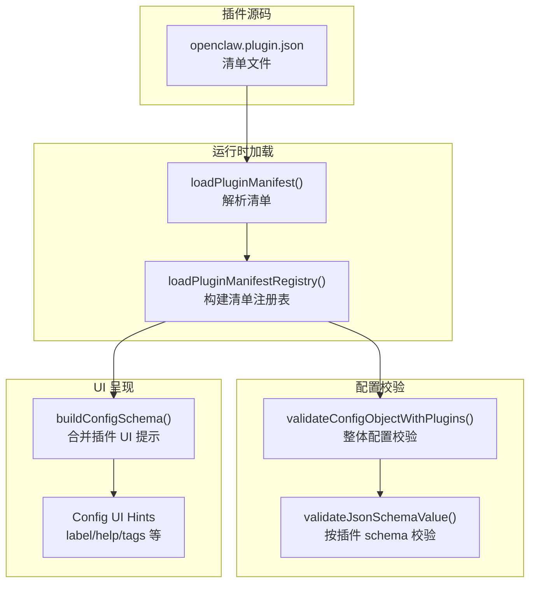
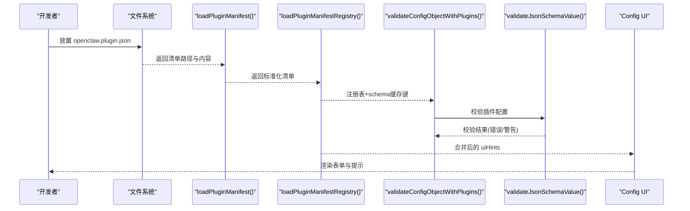
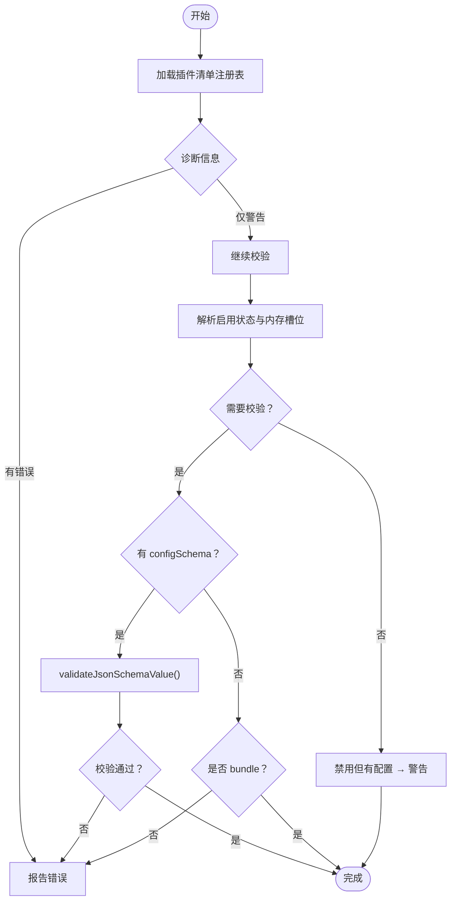
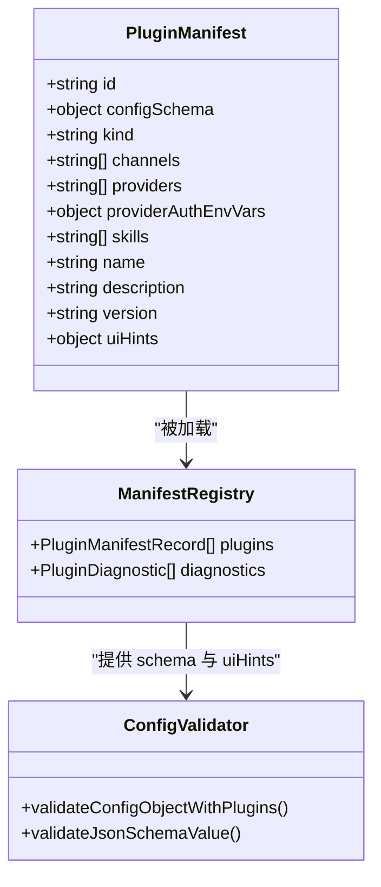

# 插件清单与配置

<cite>
**本文引用的文件**
- [src/plugins/manifest.ts](file://src/plugins/manifest.ts)
- [src/plugins/manifest-registry.ts](file://src/plugins/manifest-registry.ts)
- [src/config/validation.ts](file://src/config/validation.ts)
- [src/gateway/protocol/schema/config.ts](file://src/gateway/protocol/schema/config.ts)
- [src/shared/config-ui-hints-types.ts](file://src/shared/config-ui-hints-types.ts)
- [src/config/schema.ts](file://src/config/schema.ts)
- [extensions/anthropic/openclaw.plugin.json](file://extensions/anthropic/openclaw.plugin.json)
- [extensions/google/openclaw.plugin.json](file://extensions/google/openclaw.plugin.json)
- [extensions/discord/openclaw.plugin.json](file://extensions/discord/openclaw.plugin.json)
- [extensions/github-copilot/openclaw.plugin.json](file://extensions/github-copilot/openclaw.plugin.json)
- [extensions/firecrawl/openclaw.plugin.json](file://extensions/firecrawl/openclaw.plugin.json)
- [extensions/shared/config-schema-helpers.ts](file://extensions/shared/config-schema-helpers.ts)
</cite>

## 目录
1. [简介](#简介)
2. [项目结构](#项目结构)
3. [核心组件](#核心组件)
4. [架构总览](#架构总览)
5. [详细组件分析](#详细组件分析)
6. [依赖关系分析](#依赖关系分析)
7. [性能考量](#性能考量)
8. [故障排查指南](#故障排查指南)
9. [结论](#结论)
10. [附录](#附录)

## 简介
本文件面向插件开发者与维护者，系统化阐述 openclaw.plugin.json 插件清单的结构、字段语义、必需与可选字段、配置模式（configSchema）编写规范、UI 提示配置（uiHints）、认证环境变量设置（providerAuthEnvVars），以及清单验证机制、错误处理与调试方法。文档同时提供多种类型插件的清单示例与配置最佳实践，帮助确保插件清单的正确性与一致性。

## 项目结构
OpenClaw 的插件体系围绕“清单文件 + 配置模式 + UI 提示 + 认证环境变量”展开，核心流程如下：
- 插件根目录下的 openclaw.plugin.json 定义插件元信息与配置模式
- 运行时加载清单并构建清单注册表，用于后续配置校验与 UI 呈现
- 配置校验器对用户配置进行 schema 校验，并输出问题与警告
- UI 层基于 configSchema 与 uiHints 动态渲染配置表单与提示

图示来源
- [src/plugins/manifest.ts:65-141](file://src/plugins/manifest.ts#L65-L141)
- [src/plugins/manifest-registry.ts:265-426](file://src/plugins/manifest-registry.ts#L265-L426)
- [src/config/validation.ts:300-623](file://src/config/validation.ts#L300-L623)
- [src/config/schema.ts:177-208](file://src/config/schema.ts#L177-L208)
- [src/gateway/protocol/schema/config.ts:53-100](file://src/gateway/protocol/schema/config.ts#L53-L100)

章节来源
- [src/plugins/manifest.ts:11-23](file://src/plugins/manifest.ts#L11-L23)
- [src/plugins/manifest-registry.ts:33-57](file://src/plugins/manifest-registry.ts#L33-L57)
- [src/config/validation.ts:300-373](file://src/config/validation.ts#L300-L373)

## 核心组件
- 插件清单模型与加载
  - 清单接口定义了 id、configSchema、kind、channels、providers、providerAuthEnvVars、skills、name、description、version、uiHints 等字段
  - 加载器负责安全地打开清单文件、解析 JSON、校验必需字段、规范化列表字段与环境变量映射
- 清单注册表
  - 构建插件清单记录，合并 uiHints，计算 schema 缓存键，处理重复 ID 与来源优先级
- 配置校验
  - 对启用或存在配置的插件执行 schema 校验；对禁用但仍有配置的条目发出警告
- UI 提示
  - 将插件 uiHints 合并到全局配置 schema 的 uiHints 中，驱动 UI 表单渲染与敏感字段标记

章节来源
- [src/plugins/manifest.ts:11-23](file://src/plugins/manifest.ts#L11-L23)
- [src/plugins/manifest.ts:65-141](file://src/plugins/manifest.ts#L65-L141)
- [src/plugins/manifest-registry.ts:138-170](file://src/plugins/manifest-registry.ts#L138-L170)
- [src/config/validation.ts:581-616](file://src/config/validation.ts#L581-L616)
- [src/config/schema.ts:177-208](file://src/config/schema.ts#L177-L208)

## 架构总览
下图展示从清单文件到配置校验与 UI 呈现的关键交互：

图示来源
- [src/plugins/manifest.ts:65-141](file://src/plugins/manifest.ts#L65-L141)
- [src/plugins/manifest-registry.ts:265-426](file://src/plugins/manifest-registry.ts#L265-L426)
- [src/config/validation.ts:300-623](file://src/config/validation.ts#L300-L623)

## 详细组件分析

### openclaw.plugin.json 字段规范与验证规则
- 必需字段
  - id：字符串，插件唯一标识，不能为空
  - configSchema：对象，遵循 JSON Schema 规范，作为插件配置的权威约束
- 可选字段
  - kind：插件类型（如 memory、provider、channel 等）
  - channels：字符串数组，声明该插件支持的频道 ID 列表
  - providers：字符串数组，声明该插件提供的模型/服务提供方 ID 列表
  - providerAuthEnvVars：对象，键为 providerId，值为字符串数组，表示该提供方所需的认证环境变量名
  - skills：字符串数组，声明该插件提供的技能名称
  - name/description/version：字符串，用于 UI 显示与版本管理
  - uiHints：对象，键为配置路径，值为 UI 提示配置（label/help/tags/group/order/advanced/sensitive/placeholder/itemTemplate 等）
- 数据类型与验证规则
  - id、name、description、version：字符串，会去除首尾空白后使用
  - channels/providers/skills：数组，元素为字符串，会去除空白并过滤空串
  - providerAuthEnvVars：对象，键非空且值为非空字符串数组
  - configSchema：必须为对象，否则视为缺失
- 加载与安全
  - 清单文件必须位于插件根目录，且通过边界读取确保路径安全
  - 解析失败或格式不合法时返回明确错误消息

章节来源
- [src/plugins/manifest.ts:11-23](file://src/plugins/manifest.ts#L11-L23)
- [src/plugins/manifest.ts:29-53](file://src/plugins/manifest.ts#L29-L53)
- [src/plugins/manifest.ts:101-108](file://src/plugins/manifest.ts#L101-L108)
- [src/plugins/manifest.ts:65-141](file://src/plugins/manifest.ts#L65-L141)

### 清单注册表与 schema 缓存
- 注册表记录
  - 包含插件 id、名称、描述、版本、格式、渠道/提供方/技能列表、来源、根目录、清单路径、schema 缓存键、configSchema、uiHints 等
- schema 缓存键
  - 若清单包含 configSchema，则以清单文件修改时间戳拼接路径生成缓存键，避免频繁重算
- 重复 ID 与来源优先级
  - 当同一 id 多次出现时，依据来源优先级（config > workspace > global > bundled）选择覆盖项，并发出警告
- 插件 ID 兼容性检查
  - 若候选 idHint 与 manifest.id 不兼容，发出警告

章节来源
- [src/plugins/manifest-registry.ts:33-57](file://src/plugins/manifest-registry.ts#L33-L57)
- [src/plugins/manifest-registry.ts:331-340](file://src/plugins/manifest-registry.ts#L331-L340)
- [src/plugins/manifest-registry.ts:377-396](file://src/plugins/manifest-registry.ts#L377-L396)
- [src/plugins/manifest-registry.ts:322-329](file://src/plugins/manifest-registry.ts#L322-L329)

### 配置校验流程与错误处理
- 整体流程
  - 加载清单注册表，收集诊断信息
  - 校验插件允许/禁止列表与内存槽位
  - 对启用或存在配置的插件执行 configSchema 校验
  - 对禁用但仍有配置的条目发出警告
- 错误与警告
  - 缺失 schema：当插件为非 bundle 且未提供 configSchema 时，报告问题
  - 禁用但有配置：发出警告，提示配置被忽略
  - 校验失败：逐条输出路径、消息、可选的允许值集合
- 调试建议
  - 使用“显示禁用但有配置”的警告定位多余配置
  - 检查插件来源与重复 ID 警告，确认最终生效的是哪个版本

图示来源
- [src/config/validation.ts:300-373](file://src/config/validation.ts#L300-L373)
- [src/config/validation.ts:581-616](file://src/config/validation.ts#L581-L616)

章节来源
- [src/config/validation.ts:300-623](file://src/config/validation.ts#L300-L623)

### UI 提示配置（uiHints）与 schema 合并
- 类型定义
  - ConfigUiHint：包含 label、help、tags、group、order、advanced、sensitive、placeholder、itemTemplate 等字段
  - ConfigUiHints：键为配置路径，值为 ConfigUiHint
- 合并策略
  - 将插件 uiHints 合并到全局配置 schema 的 uiHints 中，插件层覆盖默认提示
  - 支持敏感字段自动识别与显式标记
- 协议与类型
  - TypeBox 定义了 ConfigUiHintSchema、ConfigSchemaLookupChildSchema、ConfigSchemaLookupResultSchema 等，保证协议一致性

章节来源
- [src/shared/config-ui-hints-types.ts:1-14](file://src/shared/config-ui-hints-types.ts#L1-L14)
- [src/gateway/protocol/schema/config.ts:53-100](file://src/gateway/protocol/schema/config.ts#L53-L100)
- [src/config/schema.ts:177-208](file://src/config/schema.ts#L177-L208)

### 认证环境变量设置（providerAuthEnvVars）
- 作用
  - 在清单中声明某提供方所需的认证环境变量名，便于安装/配置向导与运行时凭证解析
- 使用方式
  - 键为 providerId，值为字符串数组，表示该提供方至少需要这些环境变量之一可用
- 最佳实践
  - 为每个提供方列出所有可能的环境变量名，便于不同部署场景切换
  - 与 uiHints.sensitive 配合，在 UI 中对敏感字段进行遮盖与提示

章节来源
- [src/plugins/manifest.ts:17](file://src/plugins/manifest.ts#L17)
- [src/config/schema.ts:177-208](file://src/config/schema.ts#L177-L208)

### 配置模式（configSchema）编写指南
- 基本要求
  - configSchema 必须为对象，顶层 type=object，建议 additionalProperties=false 限制未知字段
  - 使用 TypeBox 或等价 JSON Schema 工具定义属性、类型、必填项、枚举、嵌套对象等
- 建议结构
  - 将插件配置划分为逻辑分组，配合 uiHints.group 与 order 控制 UI 排序
  - 对敏感字段设置 uiHints.sensitive=true，避免明文泄露
  - 使用 uiHints.placeholder 提供输入占位符，help 提供上下文说明
- 复杂场景
  - 列表/字典：使用 items/propertyNames/propertySchemas 等 JSON Schema 能力
  - 条件字段：结合 anyOf/oneOf/then/else 实现条件可见与互斥
  - 辅助工具：参考扩展共享的辅助函数，实现复杂校验（如通道开放策略与 allowFrom 的联动）

章节来源
- [extensions/shared/config-schema-helpers.ts:11-25](file://extensions/shared/config-schema-helpers.ts#L11-L25)
- [src/gateway/protocol/schema/config.ts:53-100](file://src/gateway/protocol/schema/config.ts#L53-L100)

### 各类型插件清单示例与最佳实践
- Provider 插件（如 anthropic、google、github-copilot）
  - 示例要点：声明 providers 数组与 providerAuthEnvVars，configSchema 为空对象表示无额外配置
  - 最佳实践：即使无配置也应提供空对象 schema，保持一致性
- Channel 插件（如 discord）
  - 示例要点：声明 channels 数组，configSchema 为空对象
  - 最佳实践：若未来引入配置，提前预留路径并使用 uiHints 分组
- 通用插件（如 firecrawl）
  - 示例要点：最小化清单，仅保留 id 与 configSchema
  - 最佳实践：尽早完善 uiHints，提升配置体验

章节来源
- [extensions/anthropic/openclaw.plugin.json:1-13](file://extensions/anthropic/openclaw.plugin.json#L1-L13)
- [extensions/google/openclaw.plugin.json:1-13](file://extensions/google/openclaw.plugin.json#L1-L13)
- [extensions/discord/openclaw.plugin.json:1-10](file://extensions/discord/openclaw.plugin.json#L1-L10)
- [extensions/github-copilot/openclaw.plugin.json:1-13](file://extensions/github-copilot/openclaw.plugin.json#L1-L13)
- [extensions/firecrawl/openclaw.plugin.json:1-9](file://extensions/firecrawl/openclaw.plugin.json#L1-L9)

## 依赖关系分析
- 组件耦合
  - loadPluginManifest 依赖边界文件读取与 JSON 解析，确保安全性
  - loadPluginManifestRegistry 依赖清单记录构建与重复 ID/来源优先级处理
  - validateConfigObjectWithPlugins 依赖注册表与 schema 校验器，形成闭环
- 外部依赖
  - JSON Schema 校验器（validateJsonSchemaValue）用于实际校验
  - TypeBox 类型系统用于协议与 UI 提示的强类型约束

图示来源
- [src/plugins/manifest.ts:11-23](file://src/plugins/manifest.ts#L11-L23)
- [src/plugins/manifest-registry.ts:33-57](file://src/plugins/manifest-registry.ts#L33-L57)
- [src/config/validation.ts:300-623](file://src/config/validation.ts#L300-L623)

章节来源
- [src/plugins/manifest.ts:65-141](file://src/plugins/manifest.ts#L65-L141)
- [src/plugins/manifest-registry.ts:265-426](file://src/plugins/manifest-registry.ts#L265-L426)
- [src/config/validation.ts:300-623](file://src/config/validation.ts#L300-L623)

## 性能考量
- 清单缓存
  - 注册表支持短 TTL 缓存，减少启动阶段重复扫描与解析
  - schema 缓存键基于清单文件修改时间，避免无效重算
- 校验范围控制
  - 仅对启用或存在配置的插件执行校验，降低开销
- UI 合并优化
  - 插件 uiHints 合并发生在构建阶段，运行时直接消费

章节来源
- [src/plugins/manifest-registry.ts:64-94](file://src/plugins/manifest-registry.ts#L64-L94)
- [src/plugins/manifest-registry.ts:331-340](file://src/plugins/manifest-registry.ts#L331-L340)
- [src/config/validation.ts:581-588](file://src/config/validation.ts#L581-L588)

## 故障排查指南
- 常见问题与定位
  - 插件未找到：检查 plugins.allow/plugins.deny/plugins.entries 中的 id 是否存在于已发现清单
  - 重复 ID：关注重复 ID 警告，确认来源优先级与最终生效版本
  - 禁用但有配置：收到“插件禁用但配置存在”的警告，清理冗余配置
  - 缺失 schema：当插件为非 bundle 且未提供 configSchema，将报告问题
- 调试步骤
  - 查看注册表诊断信息，定位具体清单路径与错误原因
  - 使用 validateConfigObjectWithPlugins 的返回结果，逐条修正配置路径
  - 检查 providerAuthEnvVars 是否与实际环境变量一致
- 相关实现位置
  - 清单加载与错误消息：[src/plugins/manifest.ts:65-108](file://src/plugins/manifest.ts#L65-L108)
  - 注册表诊断与重复 ID 处理：[src/plugins/manifest-registry.ts:377-396](file://src/plugins/manifest-registry.ts#L377-L396)
  - 配置校验与问题报告：[src/config/validation.ts:581-616](file://src/config/validation.ts#L581-L616)

章节来源
- [src/plugins/manifest.ts:65-108](file://src/plugins/manifest.ts#L65-L108)
- [src/plugins/manifest-registry.ts:377-396](file://src/plugins/manifest-registry.ts#L377-L396)
- [src/config/validation.ts:581-616](file://src/config/validation.ts#L581-L616)

## 结论
openclaw.plugin.json 是插件生态的权威契约，通过严格的清单加载、注册表构建、配置校验与 UI 提示合并，确保插件在功能、安全与易用性上的一致性。遵循本文档的字段规范、配置模式编写指南与最佳实践，可显著降低集成成本与维护风险。

## 附录
- 关键实现参考
  - 清单接口与加载：[src/plugins/manifest.ts:11-141](file://src/plugins/manifest.ts#L11-L141)
  - 注册表构建与缓存：[src/plugins/manifest-registry.ts:265-426](file://src/plugins/manifest-registry.ts#L265-L426)
  - 配置校验主流程：[src/config/validation.ts:300-623](file://src/config/validation.ts#L300-L623)
  - UI 提示类型与合并：[src/shared/config-ui-hints-types.ts:1-14](file://src/shared/config-ui-hints-types.ts#L1-L14)、[src/config/schema.ts:177-208](file://src/config/schema.ts#L177-L208)
  - 协议与类型定义：[src/gateway/protocol/schema/config.ts:53-100](file://src/gateway/protocol/schema/config.ts#L53-L100)
  - 示例清单：[extensions/anthropic/openclaw.plugin.json:1-13](file://extensions/anthropic/openclaw.plugin.json#L1-L13)、[extensions/google/openclaw.plugin.json:1-13](file://extensions/google/openclaw.plugin.json#L1-L13)、[extensions/discord/openclaw.plugin.json:1-10](file://extensions/discord/openclaw.plugin.json#L1-L10)、[extensions/github-copilot/openclaw.plugin.json:1-13](file://extensions/github-copilot/openclaw.plugin.json#L1-L13)、[extensions/firecrawl/openclaw.plugin.json:1-9](file://extensions/firecrawl/openclaw.plugin.json#L1-L9)
  - 复杂校验辅助：[extensions/shared/config-schema-helpers.ts:11-25](file://extensions/shared/config-schema-helpers.ts#L11-L25)