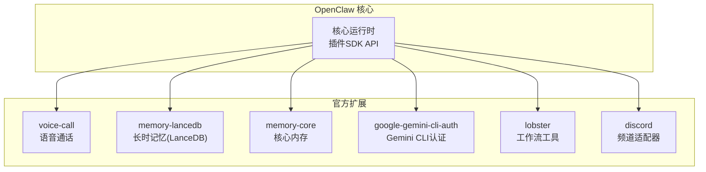
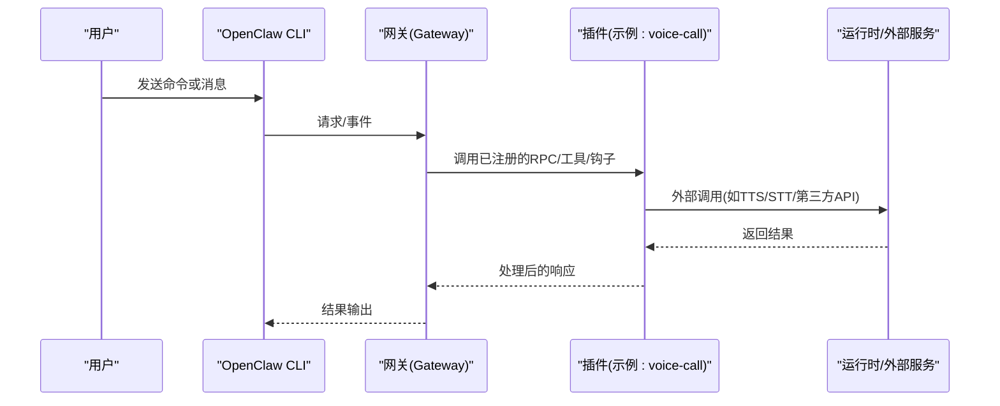
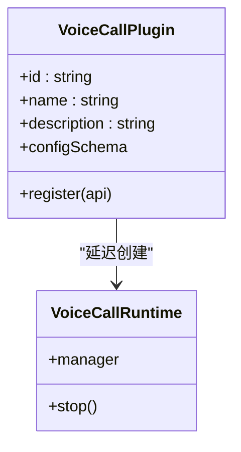
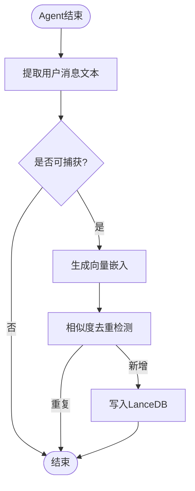
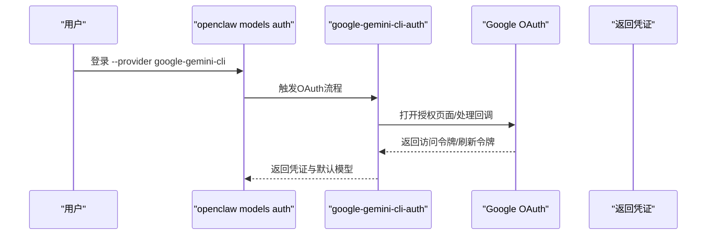
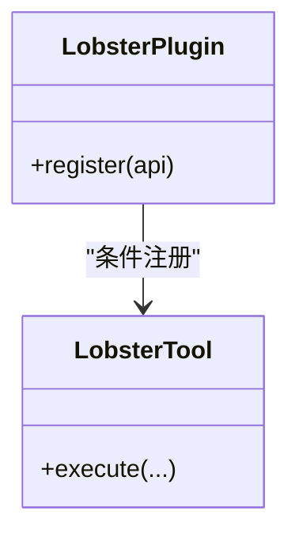
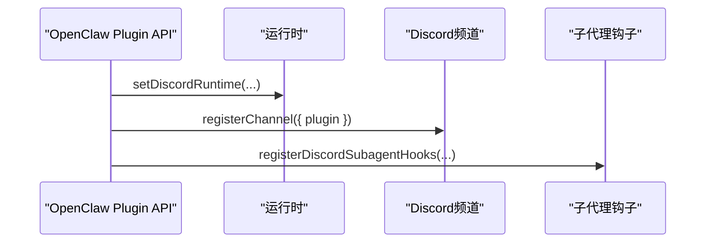
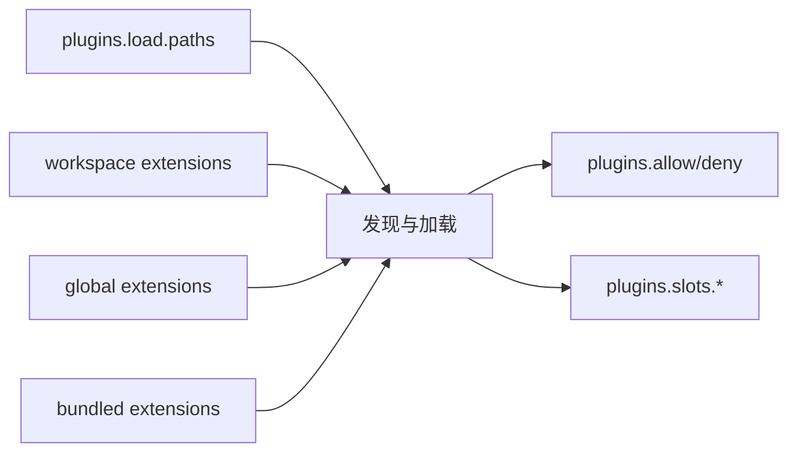

# 插件示例和模板

<cite>
**本文档引用的文件**
- [README.md](file://README.md)
- [docs/plugins/manifest.md](file://docs/plugins/manifest.md)
- [docs/plugins/community.md](file://docs/plugins/community.md)
- [docs/tools/plugin.md](file://docs/tools/plugin.md)
- [extensions/memory-core/openclaw.plugin.json](file://extensions/memory-core/openclaw.plugin.json)
- [extensions/memory-lancedb/openclaw.plugin.json](file://extensions/memory-lancedb/openclaw.plugin.json)
- [extensions/google-gemini-cli-auth/openclaw.plugin.json](file://extensions/google-gemini-cli-auth/openclaw.plugin.json)
- [extensions/lobster/openclaw.plugin.json](file://extensions/lobster/openclaw.plugin.json)
- [extensions/voice-call/index.ts](file://extensions/voice-call/index.ts)
- [extensions/memory-lancedb/index.ts](file://extensions/memory-lancedb/index.ts)
- [extensions/google-gemini-cli-auth/index.ts](file://extensions/google-gemini-cli-auth/index.ts)
- [extensions/lobster/index.ts](file://extensions/lobster/index.ts)
- [extensions/discord/index.ts](file://extensions/discord/index.ts)
</cite>

## 目录
1. [简介](#简介)
2. [项目结构](#项目结构)
3. [核心组件](#核心组件)
4. [架构总览](#架构总览)
5. [详细组件分析](#详细组件分析)
6. [依赖关系分析](#依赖关系分析)
7. [性能考虑](#性能考虑)
8. [故障排除指南](#故障排除指南)
9. [结论](#结论)
10. [附录](#附录)

## 简介
本文件面向OpenClaw插件开发者，提供系统化的插件示例与模板资源，覆盖以下类型：
- 频道适配器插件：如Discord、Telegram等
- 工具插件：如语音通话、长时记忆、认证等
- 认证插件：提供模型提供商OAuth或API Key流程
- 内存插件：提供长期记忆能力（核心与LanceDB实现）

目标是帮助开发者快速理解OpenClaw插件体系、规范编写与配置，并基于仓库中的真实示例进行二次开发。

## 项目结构
OpenClaw采用“核心平台 + 扩展生态”的架构。官方扩展集中于extensions目录，每个插件均包含：
- openclaw.plugin.json：插件清单与JSON Schema
- index.ts：插件入口模块，导出注册函数或对象
- 可选：src/子目录存放具体实现

图示来源
- [extensions/voice-call/index.ts](file://extensions/voice-call/index.ts#L146-L543)
- [extensions/memory-lancedb/index.ts](file://extensions/memory-lancedb/index.ts#L292-L679)
- [extensions/memory-core/openclaw.plugin.json](file://extensions/memory-core/openclaw.plugin.json#L1-L10)
- [extensions/google-gemini-cli-auth/index.ts](file://extensions/google-gemini-cli-auth/index.ts#L19-L76)
- [extensions/lobster/index.ts](file://extensions/lobster/index.ts#L8-L19)
- [extensions/discord/index.ts](file://extensions/discord/index.ts#L7-L20)

章节来源
- [README.md](file://README.md#L1-L560)
- [docs/tools/plugin.md](file://docs/tools/plugin.md#L1-L963)

## 核心组件
- 插件清单(openclaw.plugin.json)：声明插件id、kind、channels/providers/skills、configSchema与uiHints等
- 插件入口(index.ts)：通过OpenClaw Plugin SDK注册方法、HTTP路由、工具、CLI命令、服务、上下文引擎、钩子等
- 插件SDK子路径：按功能域划分，如core、telegram、discord、memory-lancedb等

章节来源
- [docs/plugins/manifest.md](file://docs/plugins/manifest.md#L1-L76)
- [docs/tools/plugin.md](file://docs/tools/plugin.md#L146-L186)

## 架构总览
OpenClaw插件在进程内运行，通过统一的插件SDK暴露能力。插件可注册：
- Gateway RPC方法
- HTTP路由
- Agent工具
- CLI命令
- 背景服务
- 上下文引擎
- 技能与自动回复命令

图示来源
- [docs/tools/plugin.md](file://docs/tools/plugin.md#L114-L145)
- [extensions/voice-call/index.ts](file://extensions/voice-call/index.ts#L230-L375)

章节来源
- [docs/tools/plugin.md](file://docs/tools/plugin.md#L66-L114)

## 详细组件分析

### 语音通话插件(virtual)
- 类型：工具插件 + HTTP路由 + CLI命令 + 服务
- 功能要点：
  - 注册多个Gateway RPC方法：initiate、continue、speak、end、status、start
  - 提供Agent工具：voice_call
  - CLI命令：voicecall
  - 服务：启动/停止时初始化运行时
  - 配置校验与弃用字段提示
- 设计模式：
  - 延迟初始化运行时，失败重试与端口清理
  - 参数解析与错误封装
  - UI提示与高级配置项分离

图示来源
- [extensions/voice-call/index.ts](file://extensions/voice-call/index.ts#L146-L197)

章节来源
- [extensions/voice-call/index.ts](file://extensions/voice-call/index.ts#L1-L543)

### 长时记忆插件(LanceDB)
- 类型：内存插件(kind: memory)
- 功能要点：
  - 提供记忆检索、存储、遗忘工具
  - 自动召回(before_agent_start)与自动捕获(agent_end)生命周期钩子
  - LanceDB向量存储 + OpenAI嵌入
  - 规则过滤与注入防护
- 设计模式：
  - 懒加载LanceDB模块
  - 向量搜索相似度转换(score映射)
  - 去重检测与分类识别
  - CLI命令辅助调试

图示来源
- [extensions/memory-lancedb/index.ts](file://extensions/memory-lancedb/index.ts#L574-L658)

章节来源
- [extensions/memory-lancedb/index.ts](file://extensions/memory-lancedb/index.ts#L1-L679)
- [extensions/memory-lancedb/openclaw.plugin.json](file://extensions/memory-lancedb/openclaw.plugin.json#L1-L89)

### 认证插件(Google Gemini CLI)
- 类型：认证插件(provider)
- 功能要点：
  - 注册provider: google-gemini-cli
  - OAuth流程：PKCE + 本地回调
  - 默认模型与环境变量支持
  - 返回凭证与默认模型
- 设计模式：
  - 使用SDK提供的OAuth结果构建器
  - 进度反馈与错误提示
  - 环境变量兼容性

图示来源
- [extensions/google-gemini-cli-auth/index.ts](file://extensions/google-gemini-cli-auth/index.ts#L25-L71)

章节来源
- [extensions/google-gemini-cli-auth/index.ts](file://extensions/google-gemini-cli-auth/index.ts#L1-L76)
- [extensions/google-gemini-cli-auth/openclaw.plugin.json](file://extensions/google-gemini-cli-auth/openclaw.plugin.json#L1-L10)

### 工作流工具插件(Lobster)
- 类型：工具插件
- 功能要点：
  - 在非沙箱环境下注册工具
  - 条件化工厂返回工具实例
- 设计模式：
  - 环境感知的可选注册
  - 工厂模式解耦

图示来源
- [extensions/lobster/index.ts](file://extensions/lobster/index.ts#L8-L18)

章节来源
- [extensions/lobster/index.ts](file://extensions/lobster/index.ts#L1-L19)
- [extensions/lobster/openclaw.plugin.json](file://extensions/lobster/openclaw.plugin.json#L1-L11)

### 频道适配器插件(Discord)
- 类型：频道插件
- 功能要点：
  - 设置运行时、注册频道、注册子代理钩子
- 设计模式：
  - 将运行时设置与频道注册解耦
  - 子代理钩子增强多会话协作

图示来源
- [extensions/discord/index.ts](file://extensions/discord/index.ts#L12-L16)

章节来源
- [extensions/discord/index.ts](file://extensions/discord/index.ts#L1-L20)

### 核心内存插件(memory-core)
- 类型：内存插件(kind: memory)，默认启用
- 特点：空配置Schema，作为占位实现

章节来源
- [extensions/memory-core/openclaw.plugin.json](file://extensions/memory-core/openclaw.plugin.json#L1-L10)

## 依赖关系分析
- 插件发现与优先级：配置路径 -> 工作区扩展 -> 全局扩展 -> 内置扩展
- 安全加固：路径安全检查、允许列表/禁止列表、安装追踪
- 插件清单与Schema：严格验证，缺失或无效将阻断配置
- 插件槽位：memory、contextEngine等独占槽位通过plugins.slots选择

图示来源
- [docs/tools/plugin.md](file://docs/tools/plugin.md#L228-L304)

章节来源
- [docs/tools/plugin.md](file://docs/tools/plugin.md#L228-L304)
- [docs/plugins/manifest.md](file://docs/plugins/manifest.md#L53-L76)

## 性能考虑
- 插件发现与清单元数据使用短时缓存，可通过环境变量禁用或调整缓存窗口
- 记忆插件的向量搜索与嵌入计算成本较高，建议合理限制召回数量与字符长度
- 语音通话插件的运行时延迟初始化避免不必要的资源占用

章节来源
- [docs/tools/plugin.md](file://docs/tools/plugin.md#L219-L227)
- [extensions/memory-lancedb/index.ts](file://extensions/memory-lancedb/index.ts#L116-L140)
- [extensions/voice-call/index.ts](file://extensions/voice-call/index.ts#L169-L197)

## 故障排除指南
- 插件清单缺失或Schema无效：将导致配置验证失败；请检查openclaw.plugin.json与configSchema
- 插件被禁用但配置存在：配置会被保留并在诊断中给出警告
- 未知插件ID或通道键：属于错误；需在插件清单中声明或修正配置
- 认证插件OAuth失败：检查环境变量与账户权限，参考插件内的错误提示与日志

章节来源
- [docs/plugins/manifest.md](file://docs/plugins/manifest.md#L53-L76)
- [extensions/google-gemini-cli-auth/index.ts](file://extensions/google-gemini-cli-auth/index.ts#L60-L67)

## 结论
OpenClaw提供了完善的插件体系与SDK，涵盖频道适配、工具、认证、内存等多类场景。开发者可直接参考仓库中的真实插件实现，遵循清单与Schema规范，结合生命周期钩子与服务机制，快速构建高质量插件。建议在开发过程中充分利用UI提示、严格配置验证与安全加固策略，确保插件的可用性与安全性。

## 附录
- 快速开始
  - 列出已加载插件：openclaw plugins list
  - 安装官方插件：openclaw plugins install @openclaw/voice-call
  - 重启网关后在plugins.entries.<id>.config下配置
- 社区插件提交
  - 需满足发布到npm、公开源码仓库、提供文档与问题跟踪等要求
  - 使用指定格式提交PR以列入社区插件列表

章节来源
- [docs/tools/plugin.md](file://docs/tools/plugin.md#L20-L44)
- [docs/plugins/community.md](file://docs/plugins/community.md#L15-L52)