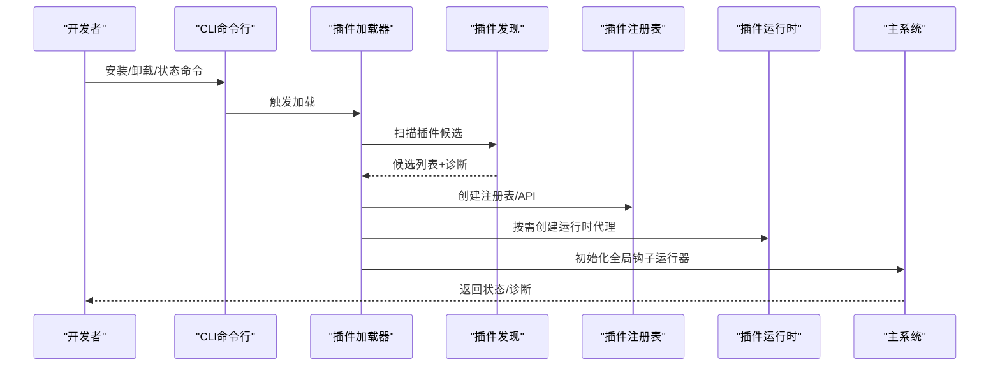
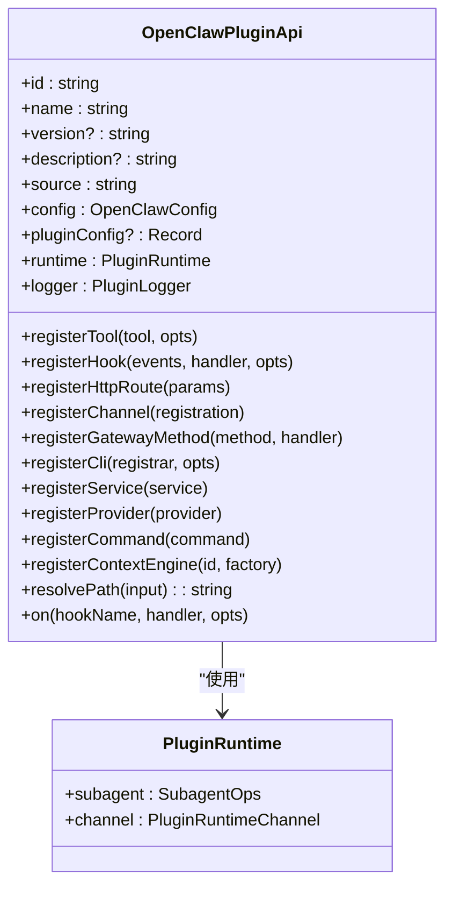
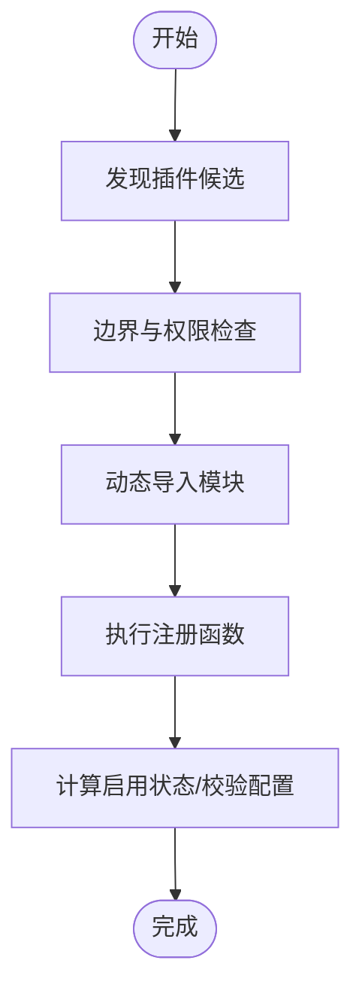
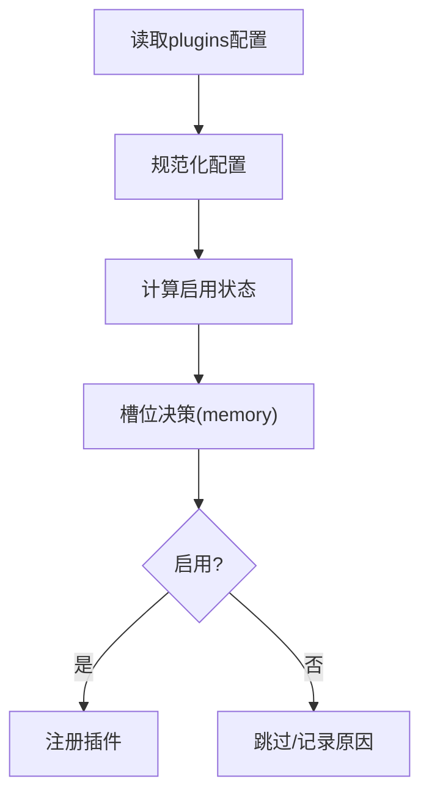
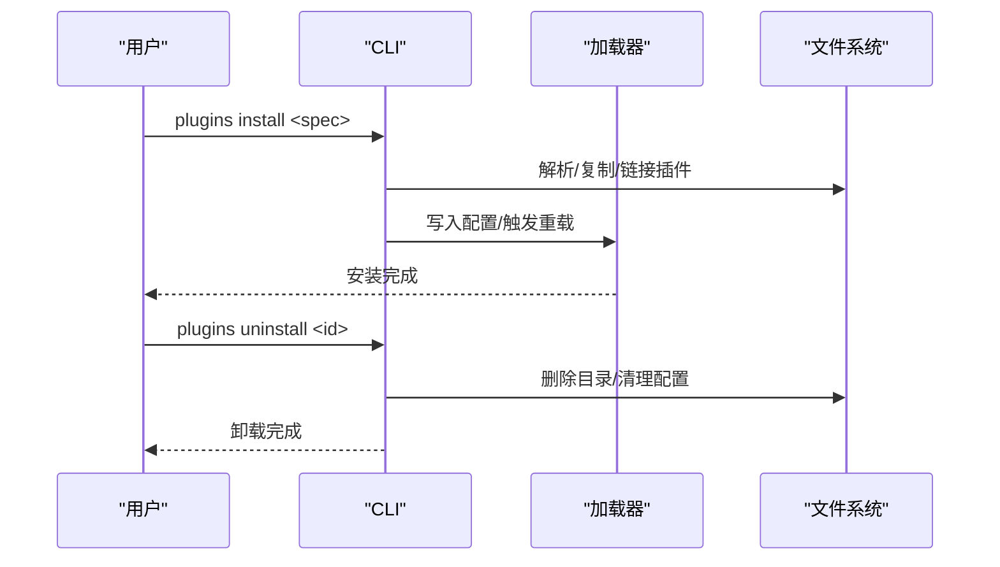
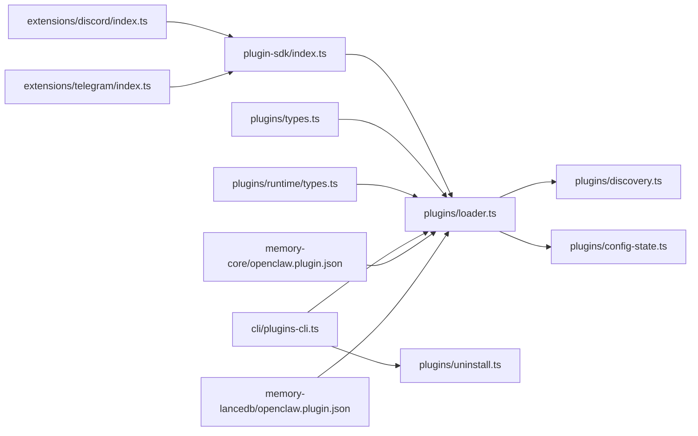

# 插件系统

<cite>
**本文引用的文件**
- [src/plugin-sdk/index.ts](file://src/plugin-sdk/index.ts)
- [src/plugins/types.ts](file://src/plugins/types.ts)
- [src/plugins/runtime/types.ts](file://src/plugins/runtime/types.ts)
- [src/plugins/loader.ts](file://src/plugins/loader.ts)
- [src/plugins/config-state.ts](file://src/plugins/config-state.ts)
- [src/plugins/discovery.ts](file://src/plugins/discovery.ts)
- [src/plugins/uninstall.ts](file://src/plugins/uninstall.ts)
- [src/cli/plugins-cli.ts](file://src/cli/plugins-cli.ts)
- [docs/plugins/manifest.md](file://docs/plugins/manifest.md)
- [docs/plugins/agent-tools.md](file://docs/plugins/agent-tools.md)
- [docs/refactor/plugin-sdk.md](file://docs/refactor/plugin-sdk.md)
- [extensions/discord/index.ts](file://extensions/discord/index.ts)
- [extensions/telegram/index.ts](file://extensions/telegram/index.ts)
- [extensions/memory-core/openclaw.plugin.json](file://extensions/memory-core/openclaw.plugin.json)
- [extensions/memory-lancedb/openclaw.plugin.json](file://extensions/memory-lancedb/openclaw.plugin.json)
</cite>

## 目录
1. [简介](#简介)
2. [项目结构](#项目结构)
3. [核心组件](#核心组件)
4. [架构总览](#架构总览)
5. [详细组件分析](#详细组件分析)
6. [依赖关系分析](#依赖关系分析)
7. [性能考量](#性能考量)
8. [故障排查指南](#故障排查指南)
9. [结论](#结论)
10. [附录](#附录)

## 简介
本文件面向OpenClaw插件系统的开发者与维护者，系统性阐述插件SDK的架构设计、API接口、生命周期管理、配置系统、安全沙箱与权限控制、安装/更新/卸载与版本管理、以及插件与主系统的交互机制（事件处理、数据交换）。文档同时提供从项目结构、Manifest配置到代码编写的规范指引，并给出测试、调试与发布的流程建议，帮助开发者快速上手并构建高质量插件。

## 项目结构
OpenClaw插件系统由“插件SDK”“插件加载器/发现/配置”“CLI工具”“示例插件”等模块组成。核心入口与对外API集中在插件SDK导出层；插件发现与加载在运行时完成；CLI提供安装、卸载、状态报告等运维能力；示例插件展示如何注册通道、子代理钩子、HTTP路由等。

```mermaid
graph TD
subgraph "插件SDK"
SDK["src/plugin-sdk/index.ts"]
Types["src/plugins/types.ts"]
RTTypes["src/plugins/runtime/types.ts"]
end
subgraph "插件加载与发现"
Loader["src/plugins/loader.ts"]
Discovery["src/plugins/discovery.ts"]
ConfigState["src/plugins/config-state.ts"]
end
subgraph "CLI"
CLI["src/cli/plugins-cli.ts"]
Uninstall["src/plugins/uninstall.ts"]
end
subgraph "示例插件"
DiscIdx["extensions/discord/index.ts"]
TelIdx["extensions/telegram/index.ts"]
MemCore["extensions/memory-core/openclaw.plugin.json"]
MemLance["extensions/memory-lancedb/openclaw.plugin.json"]
end
SDK --> Loader
Types --> Loader
RTTypes --> Loader
Loader --> Discovery
Loader --> ConfigState
CLI --> Loader
CLI --> Uninstall
DiscIdx --> SDK
TelIdx --> SDK
MemCore --> Loader
MemLance --> Loader
```

图表来源
- [src/plugin-sdk/index.ts](file://src/plugin-sdk/index.ts#L1-L812)
- [src/plugins/loader.ts](file://src/plugins/loader.ts#L1-L829)
- [src/plugins/discovery.ts](file://src/plugins/discovery.ts#L1-L712)
- [src/plugins/config-state.ts](file://src/plugins/config-state.ts#L1-L287)
- [src/cli/plugins-cli.ts](file://src/cli/plugins-cli.ts#L122-L727)
- [src/plugins/uninstall.ts](file://src/plugins/uninstall.ts#L57-L104)
- [extensions/discord/index.ts](file://extensions/discord/index.ts#L1-L20)
- [extensions/telegram/index.ts](file://extensions/telegram/index.ts#L1-L18)
- [extensions/memory-core/openclaw.plugin.json](file://extensions/memory-core/openclaw.plugin.json#L1-L10)
- [extensions/memory-lancedb/openclaw.plugin.json](file://extensions/memory-lancedb/openclaw.plugin.json#L1-L89)

章节来源
- [src/plugin-sdk/index.ts](file://src/plugin-sdk/index.ts#L1-L812)
- [src/plugins/loader.ts](file://src/plugins/loader.ts#L1-L829)
- [src/plugins/discovery.ts](file://src/plugins/discovery.ts#L1-L712)
- [src/plugins/config-state.ts](file://src/plugins/config-state.ts#L1-L287)
- [src/cli/plugins-cli.ts](file://src/cli/plugins-cli.ts#L122-L727)
- [src/plugins/uninstall.ts](file://src/plugins/uninstall.ts#L57-L104)
- [extensions/discord/index.ts](file://extensions/discord/index.ts#L1-L20)
- [extensions/telegram/index.ts](file://extensions/telegram/index.ts#L1-L18)
- [extensions/memory-core/openclaw.plugin.json](file://extensions/memory-core/openclaw.plugin.json#L1-L10)
- [extensions/memory-lancedb/openclaw.plugin.json](file://extensions/memory-lancedb/openclaw.plugin.json#L1-L89)

## 核心组件
- 插件SDK导出层：统一暴露插件API、运行时类型、通道适配、工具、Webhook、SSRF策略、日志与路径解析等能力，供插件作者使用。
- 插件定义与API：定义插件生命周期回调、命令、HTTP路由、服务、Provider认证、上下文引擎注册等接口。
- 运行时类型：定义插件运行时能力（如子代理运行/等待/会话消息读取）与通道能力（文本分块、媒体、路由、分组策略等）。
- 加载器与发现：扫描插件目录、校验边界与权限、解析Manifest、按配置启用/禁用、执行注册函数、收集诊断信息。
- 配置状态：规范化plugins配置（启用/允许/拒绝/加载路径/槽位），计算插件有效启用状态与内存槽决策。
- CLI与卸载：提供安装/卸载命令、移除配置项、记录诊断与日志。

章节来源
- [src/plugin-sdk/index.ts](file://src/plugin-sdk/index.ts#L1-L812)
- [src/plugins/types.ts](file://src/plugins/types.ts#L1-L893)
- [src/plugins/runtime/types.ts](file://src/plugins/runtime/types.ts#L1-L64)
- [src/plugins/loader.ts](file://src/plugins/loader.ts#L1-L829)
- [src/plugins/config-state.ts](file://src/plugins/config-state.ts#L1-L287)
- [src/plugins/discovery.ts](file://src/plugins/discovery.ts#L1-L712)
- [src/cli/plugins-cli.ts](file://src/cli/plugins-cli.ts#L122-L727)
- [src/plugins/uninstall.ts](file://src/plugins/uninstall.ts#L57-L104)

## 架构总览
OpenClaw插件系统采用“Manifest驱动+严格配置验证+延迟运行时初始化”的架构。启动时先发现与加载插件，再根据配置决定是否启用及如何注册；运行时通过代理运行时（runtime）与通道运行时（channel runtime）提供能力；CLI负责安装/卸载与运维。



图表来源
- [src/plugins/loader.ts](file://src/plugins/loader.ts#L447-L800)
- [src/plugins/discovery.ts](file://src/plugins/discovery.ts#L618-L712)
- [src/cli/plugins-cli.ts](file://src/cli/plugins-cli.ts#L122-L727)

章节来源
- [src/plugins/loader.ts](file://src/plugins/loader.ts#L447-L800)
- [src/plugins/discovery.ts](file://src/plugins/discovery.ts#L618-L712)
- [src/cli/plugins-cli.ts](file://src/cli/plugins-cli.ts#L122-L727)

## 详细组件分析

### 插件SDK与API接口
- SDK导出层集中暴露插件所需能力：通道适配、工具、Webhook、SSRF策略、日志、路径解析、OAuth、子代理运行时等。
- 插件API定义了注册入口：工具、钩子、HTTP路由、通道、网关方法、CLI、服务、Provider、自定义命令、上下文引擎等。
- 运行时类型定义了子代理运行能力（运行/等待/获取消息/删除会话）与通道能力（文本、媒体、路由、分组策略、去抖等）。



图表来源
- [src/plugin-sdk/index.ts](file://src/plugin-sdk/index.ts#L263-L306)
- [src/plugins/runtime/types.ts](file://src/plugins/runtime/types.ts#L51-L64)

章节来源
- [src/plugin-sdk/index.ts](file://src/plugin-sdk/index.ts#L1-L812)
- [src/plugins/types.ts](file://src/plugins/types.ts#L263-L306)
- [src/plugins/runtime/types.ts](file://src/plugins/runtime/types.ts#L1-L64)

### 插件生命周期与注册流程
- 发现阶段：扫描内置、工作区、全局扩展目录，解析package.json中的扩展入口，或匹配默认入口文件。
- 加载阶段：对每个候选插件进行边界检查、权限检查、打开入口文件、动态导入、执行注册函数。
- 注册阶段：创建插件记录、收集工具/钩子/通道/Provider/命令/服务/HTTP路由等元数据。
- 启用阶段：根据配置计算启用状态（允许/拒绝/槽位选择）、校验配置Schema、记录诊断信息。



图表来源
- [src/plugins/discovery.ts](file://src/plugins/discovery.ts#L394-L500)
- [src/plugins/loader.ts](file://src/plugins/loader.ts#L660-L768)
- [src/plugins/config-state.ts](file://src/plugins/config-state.ts#L189-L220)

章节来源
- [src/plugins/discovery.ts](file://src/plugins/discovery.ts#L1-L712)
- [src/plugins/loader.ts](file://src/plugins/loader.ts#L569-L800)
- [src/plugins/config-state.ts](file://src/plugins/config-state.ts#L189-L287)

### 配置系统与插件槽位
- 配置规范化：支持启用开关、允许/拒绝列表、加载路径、槽位（如memory槽位）与单个插件条目（含启用、钩子策略、配置）。
- 启用策略：优先级考虑“显式禁用/拒绝/显式启用/槽位匹配/允许列表/内置默认”。
- 槽位决策：内存类插件仅能有一个被选中；若显式设置槽位ID则仅该ID可启用；若槽位为禁用则所有内存插件禁用。



图表来源
- [src/plugins/config-state.ts](file://src/plugins/config-state.ts#L90-L104)
- [src/plugins/config-state.ts](file://src/plugins/config-state.ts#L189-L220)
- [src/plugins/config-state.ts](file://src/plugins/config-state.ts#L258-L287)

章节来源
- [src/plugins/config-state.ts](file://src/plugins/config-state.ts#L1-L287)

### 安全与沙箱
- 边界与权限检查：禁止插件源逃逸插件根目录、禁止世界可写路径、检测可疑所有权。
- SSRF策略：提供主机后缀白名单策略与HTTPS限制，用于Webhook与网络请求的安全防护。
- 插件SDK别名与导出：通过别名映射确保插件使用正确的SDK子路径，避免误用。

章节来源
- [src/plugins/discovery.ts](file://src/plugins/discovery.ts#L117-L251)
- [src/plugins/loader.ts](file://src/plugins/loader.ts#L539-L558)
- [src/plugin-sdk/index.ts](file://src/plugin-sdk/index.ts#L146-L176)

### 安装、更新、卸载与版本管理
- 安装：支持本地路径、归档包、NPM包规范；可选择链接模式；支持固定版本以锁定依赖。
- 卸载：从配置中移除条目、安装记录、允许列表、加载路径、内存槽位与插件目录；输出诊断与重启提示。
- 版本管理：Manifest声明版本；CLI提供安装/更新/卸载命令；示例插件Manifest展示字段与Schema要求。



图表来源
- [src/cli/plugins-cli.ts](file://src/cli/plugins-cli.ts#L719-L727)
- [src/plugins/uninstall.ts](file://src/plugins/uninstall.ts#L65-L104)

章节来源
- [src/cli/plugins-cli.ts](file://src/cli/plugins-cli.ts#L122-L727)
- [src/plugins/uninstall.ts](file://src/plugins/uninstall.ts#L57-L104)
- [docs/plugins/manifest.md](file://docs/plugins/manifest.md#L1-L76)

### 插件与主系统的交互
- 事件钩子：覆盖模型解析、提示构建、代理开始/结束、消息收发/发送、工具调用前后、结果持久化、会话开始/结束、子代理派生/交付/结束、网关启停等。
- 数据交换：通过运行时提供的子代理API与通道API进行消息分块、媒体处理、会话读取与删除、回复分发等。
- 权限控制：通过允许/拒绝列表、槽位选择、通道/群组策略、命令授权、SSRF策略等多层控制。

章节来源
- [src/plugins/types.ts](file://src/plugins/types.ts#L321-L377)
- [src/plugins/runtime/types.ts](file://src/plugins/runtime/types.ts#L8-L64)
- [src/plugin-sdk/index.ts](file://src/plugin-sdk/index.ts#L442-L456)

### 示例插件与最佳实践
- 通道插件示例：Discord与Telegram插件通过setRuntime与registerChannel注册通道能力，展示最小化插件结构。
- 内存插件示例：memory-core无配置，memory-lancedb提供嵌入模型、数据库路径、自动捕获/召回等配置与UI提示。
- 工具注册：插件可注册必选/可选工具，通过配置允许列表启用可选工具，遵循命名冲突与沙箱策略。

章节来源
- [extensions/discord/index.ts](file://extensions/discord/index.ts#L1-L20)
- [extensions/telegram/index.ts](file://extensions/telegram/index.ts#L1-L18)
- [extensions/memory-core/openclaw.plugin.json](file://extensions/memory-core/openclaw.plugin.json#L1-L10)
- [extensions/memory-lancedb/openclaw.plugin.json](file://extensions/memory-lancedb/openclaw.plugin.json#L1-L89)
- [docs/plugins/agent-tools.md](file://docs/plugins/agent-tools.md#L1-L100)

## 依赖关系分析
- 插件SDK导出层依赖运行时与通道能力，向插件暴露统一API。
- 加载器依赖发现模块与配置状态模块，负责注册与诊断。
- CLI依赖加载器与卸载逻辑，提供运维能力。
- 示例插件依赖SDK导出层，展示典型用法。



图表来源
- [src/plugin-sdk/index.ts](file://src/plugin-sdk/index.ts#L1-L812)
- [src/plugins/loader.ts](file://src/plugins/loader.ts#L1-L829)
- [src/plugins/discovery.ts](file://src/plugins/discovery.ts#L1-L712)
- [src/plugins/config-state.ts](file://src/plugins/config-state.ts#L1-L287)
- [src/cli/plugins-cli.ts](file://src/cli/plugins-cli.ts#L122-L727)
- [src/plugins/uninstall.ts](file://src/plugins/uninstall.ts#L57-L104)
- [extensions/discord/index.ts](file://extensions/discord/index.ts#L1-L20)
- [extensions/telegram/index.ts](file://extensions/telegram/index.ts#L1-L18)
- [extensions/memory-core/openclaw.plugin.json](file://extensions/memory-core/openclaw.plugin.json#L1-L10)
- [extensions/memory-lancedb/openclaw.plugin.json](file://extensions/memory-lancedb/openclaw.plugin.json#L1-L89)

章节来源
- [src/plugin-sdk/index.ts](file://src/plugin-sdk/index.ts#L1-L812)
- [src/plugins/loader.ts](file://src/plugins/loader.ts#L1-L829)
- [src/plugins/discovery.ts](file://src/plugins/discovery.ts#L1-L712)
- [src/plugins/config-state.ts](file://src/plugins/config-state.ts#L1-L287)
- [src/cli/plugins-cli.ts](file://src/cli/plugins-cli.ts#L122-L727)
- [src/plugins/uninstall.ts](file://src/plugins/uninstall.ts#L57-L104)
- [extensions/discord/index.ts](file://extensions/discord/index.ts#L1-L20)
- [extensions/telegram/index.ts](file://extensions/telegram/index.ts#L1-L18)
- [extensions/memory-core/openclaw.plugin.json](file://extensions/memory-core/openclaw.plugin.json#L1-L10)
- [extensions/memory-lancedb/openclaw.plugin.json](file://extensions/memory-lancedb/openclaw.plugin.json#L1-L89)

## 性能考量
- 发现缓存：插件发现支持短时缓存，减少重复扫描开销。
- 延迟运行时：运行时按需创建，避免在仅发现/跳过插件场景下加载通道依赖。
- 配置校验：Manifest与Schema在配置读写时验证，避免运行期昂贵的错误处理。
- 去抖与批处理：通道层提供去抖与批处理能力，降低重复消息处理成本。

章节来源
- [src/plugins/discovery.ts](file://src/plugins/discovery.ts#L38-L84)
- [src/plugins/loader.ts](file://src/plugins/loader.ts#L470-L502)

## 故障排查指南
- 插件未加载：检查Manifest是否存在且合法、配置是否启用、是否被拒绝或不在允许列表、槽位是否被占用。
- 路径问题：查看发现阶段的边界/权限警告，确认插件目录权限与归属。
- 配置错误：查看配置校验错误与诊断信息，修正JSON Schema不匹配字段。
- 卸载残留：确认已从配置移除条目、安装记录、允许列表、加载路径、内存槽位与目录。

章节来源
- [src/plugins/discovery.ts](file://src/plugins/discovery.ts#L216-L251)
- [src/plugins/loader.ts](file://src/plugins/loader.ts#L615-L626)
- [src/plugins/uninstall.ts](file://src/plugins/uninstall.ts#L65-L104)

## 结论
OpenClaw插件系统通过Manifest驱动的严格配置验证、安全边界与权限检查、延迟运行时初始化与完善的事件钩子体系，提供了高扩展性与强约束的插件生态。开发者可基于SDK快速实现通道、工具、服务与上下文引擎等能力，并通过CLI完成安装/卸载与运维。建议在开发中遵循Manifest与Schema规范、合理使用槽位与允许列表、关注安全策略与性能优化。

## 附录

### 开发指南与规范
- 项目结构：插件根目录必须包含openclaw.plugin.json；可选package.json用于扩展入口。
- Manifest要求：必须包含id与configSchema；可选kind、channels、providers、skills、uiHints、version等。
- 代码规范：使用SDK导出的API注册工具、钩子、HTTP路由、通道、服务、Provider与命令；遵循工具命名冲突与可选工具策略。

章节来源
- [docs/plugins/manifest.md](file://docs/plugins/manifest.md#L1-L76)
- [docs/plugins/agent-tools.md](file://docs/plugins/agent-tools.md#L1-L100)
- [extensions/discord/index.ts](file://extensions/discord/index.ts#L1-L20)
- [extensions/telegram/index.ts](file://extensions/telegram/index.ts#L1-L18)

### 测试、调试与发布
- 测试：利用测试环境默认禁用插件与内存槽位策略，确保单元测试快速稳定。
- 调试：关注诊断事件与日志，结合CLI状态报告定位问题。
- 发布：遵循Manifest与Schema规范，提供清晰的uiHints与配置说明；如涉及原生模块，明确构建与依赖要求。

章节来源
- [src/plugins/config-state.ts](file://src/plugins/config-state.ts#L137-L187)
- [docs/plugins/manifest.md](file://docs/plugins/manifest.md#L73-L76)