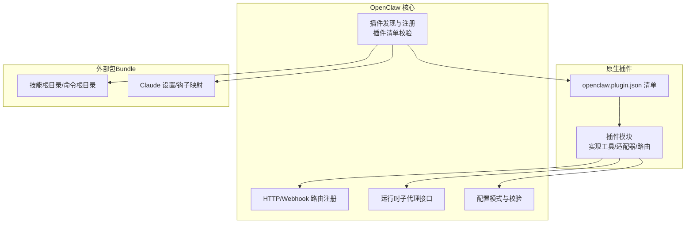
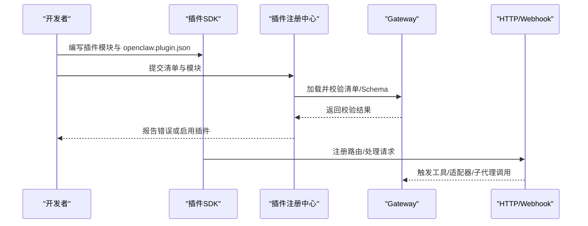
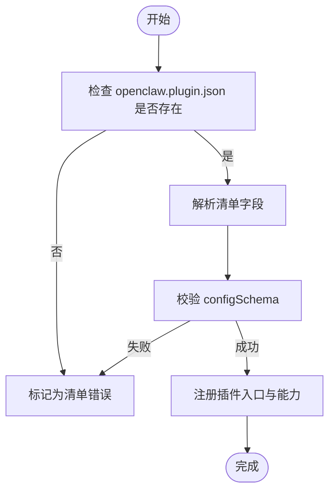
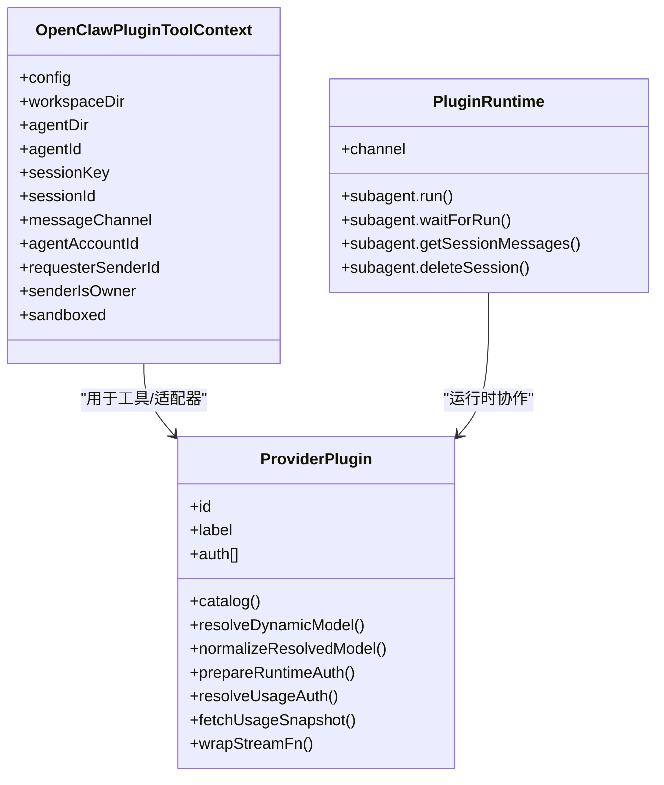
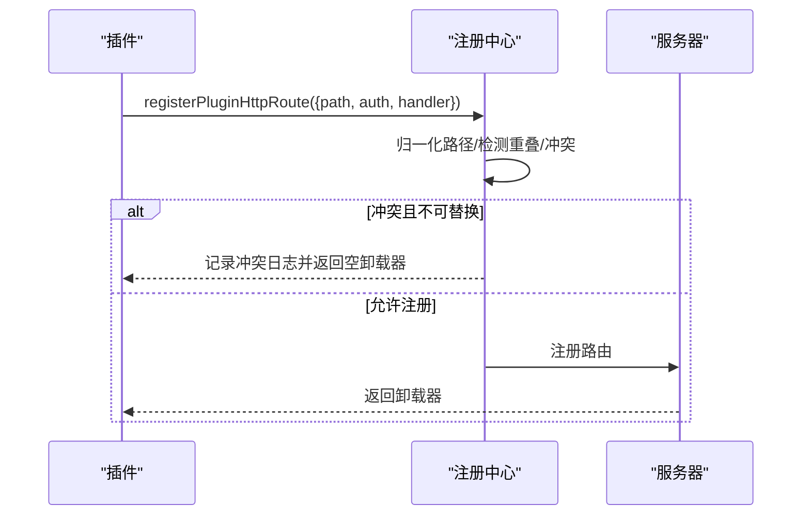
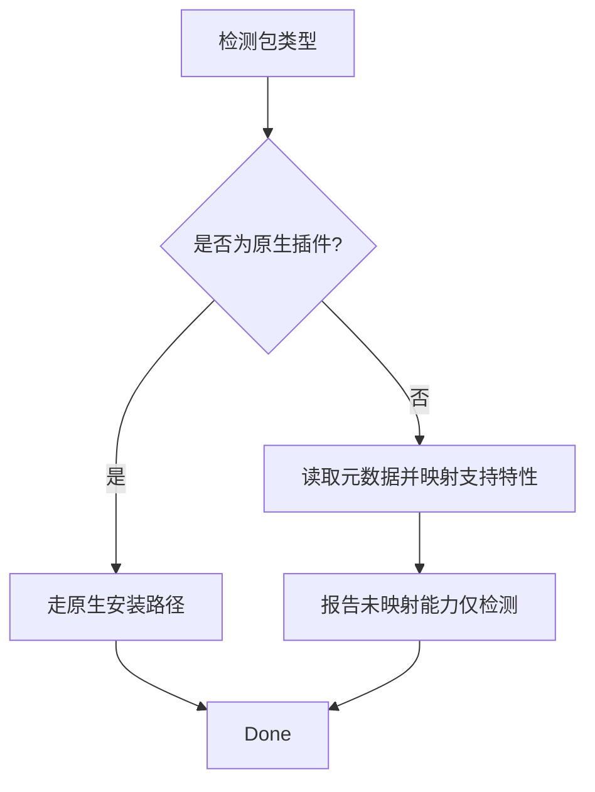
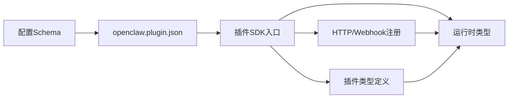

# 插件系统

<cite>
**本文引用的文件**
- [src/plugin-sdk/index.ts](file://src/plugin-sdk/index.ts)
- [src/plugins/types.ts](file://src/plugins/types.ts)
- [src/plugins/runtime/types.ts](file://src/plugins/runtime/types.ts)
- [src/plugins/config-schema.ts](file://src/plugins/config-schema.ts)
- [src/plugins/http-registry.ts](file://src/plugins/http-registry.ts)
- [docs/plugins/manifest.md](file://docs/plugins/manifest.md)
- [docs/plugins/bundles.md](file://docs/plugins/bundles.md)
- [docs/plugins/agent-tools.md](file://docs/plugins/agent-tools.md)
- [docs/plugins/community.md](file://docs/plugins/community.md)
- [docs/plugins/voice-call.md](file://docs/plugins/voice-call.md)
- [extensions/discord/openclaw.plugin.json](file://extensions/discord/openclaw.plugin.json)
- [extensions/anthropic/openclaw.plugin.json](file://extensions/anthropic/openclaw.plugin.json)
</cite>

## 目录
1. [简介](#简介)
2. [项目结构](#项目结构)
3. [核心组件](#核心组件)
4. [架构总览](#架构总览)
5. [详细组件分析](#详细组件分析)
6. [依赖关系分析](#依赖关系分析)
7. [性能考量](#性能考量)
8. [故障排查指南](#故障排查指南)
9. [结论](#结论)
10. [附录](#附录)

## 简介
本文件系统性解析 OpenClaw 的插件系统架构与扩展机制，覆盖插件开发框架、生命周期管理、安全模型、清单规范、依赖与版本控制、SDK 使用、最佳实践、现有插件分类与示例、测试与发布维护流程等。目标是帮助开发者快速上手并构建高质量、可维护、可审计的插件。

## 项目结构
OpenClaw 将“原生插件”与“外部包（bundle）”两类扩展统一纳入插件体系：
- 原生插件：以 openclaw.plugin.json 清单为入口，运行在 Gateway 进程内，具备完整的 SDK 能力（工具、通道适配、HTTP/Webhook、运行时子代理等）。
- 外部包（bundle）：Codex/Claude/Cursor 生态的打包内容，OpenClaw 仅做元数据读取与有限映射，不执行其运行时代码。

```mermaid
graph TB
subgraph "OpenClaw 核心"
A["插件发现与注册<br/>插件清单校验"]
B["HTTP/Webhook 路由注册"]
C["运行时子代理接口"]
D["配置模式与校验"]
end
subgraph "原生插件"
P1["插件模块<br/>实现工具/适配器/路由"]
M1["openclaw.plugin.json 清单"]
end
subgraph "外部包Bundle"
B1["技能根目录/命令根目录"]
B2["Claude 设置/钩子映射"]
end
A --> M1
A --> B1
A --> B2
M1 --> P1
P1 --> B
P1 --> C
P1 --> D
```

图示来源
- [docs/plugins/bundles.md:1-293](file://docs/plugins/bundles.md#L1-L293)
- [docs/plugins/manifest.md:1-100](file://docs/plugins/manifest.md#L1-L100)

章节来源
- [docs/plugins/bundles.md:1-293](file://docs/plugins/bundles.md#L1-L293)
- [docs/plugins/manifest.md:1-100](file://docs/plugins/manifest.md#L1-L100)

## 核心组件
- 插件 SDK 入口与导出：集中导出类型、工具函数、通道适配器、运行时接口、Webhook/HTTP 工具等，便于插件按需引入。
- 插件类型定义：涵盖工具上下文、工具选项、Hook 注册、Provider 认证与目录钩子、网关方法、命令上下文等。
- 运行时类型：定义子代理运行、等待、会话消息查询、删除会话等能力。
- 配置模式与校验：提供空配置模式与通用 JSON Schema 校验接口，确保配置在加载阶段即被验证。
- HTTP/Webhook 注册：提供路径归一化、重叠检测、冲突处理、认证策略等能力，保障路由安全与幂等。

章节来源
- [src/plugin-sdk/index.ts:1-872](file://src/plugin-sdk/index.ts#L1-L872)
- [src/plugins/types.ts:1-800](file://src/plugins/types.ts#L1-L800)
- [src/plugins/runtime/types.ts:1-64](file://src/plugins/runtime/types.ts#L1-L64)
- [src/plugins/config-schema.ts:1-34](file://src/plugins/config-schema.ts#L1-L34)
- [src/plugins/http-registry.ts:1-93](file://src/plugins/http-registry.ts#L1-L93)

## 架构总览
OpenClaw 插件系统围绕“清单驱动 + 类型安全 + 安全边界”的设计展开：
- 清单驱动：所有原生插件必须提供 openclaw.plugin.json，用于声明 id、kind、channels、providers、技能根目录、配置 Schema 等。
- 类型安全：通过 TypeScript 类型约束工具、Hook 上下文、Provider 钩子链路，降低运行期错误。
- 安全边界：原生插件在进程内运行；外部包仅做元数据与有限功能映射，避免任意代码执行风险。

```mermaid
sequenceDiagram
participant Dev as "开发者"
participant SDK as "插件SDK"
participant Reg as "插件注册中心"
participant GW as "Gateway"
participant HTTP as "HTTP/Webhook"
Dev->>SDK : 编写插件模块与 openclaw.plugin.json
Dev->>Reg : 提交清单与模块
Reg->>GW : 加载并校验清单/Schema
GW-->>Reg : 返回校验结果
Reg-->>Dev : 报告错误或启用插件
SDK->>HTTP : 注册路由/处理请求
HTTP-->>GW : 触发工具/适配器/子代理调用
```

图示来源
- [src/plugin-sdk/index.ts:1-872](file://src/plugin-sdk/index.ts#L1-L872)
- [src/plugins/http-registry.ts:1-93](file://src/plugins/http-registry.ts#L1-L93)
- [docs/plugins/manifest.md:1-100](file://docs/plugins/manifest.md#L1-L100)

## 详细组件分析

### 组件A：插件清单与配置 Schema
- 必填字段：id、configSchema。
- 可选字段：kind、channels、providers、providerAuthEnvVars、skills、name、description、uiHints、version。
- Schema 行为：严格校验，缺失或非法将阻断配置生效；支持空 Schema（如仅禁止额外属性）。
- 版本与兼容：清单中的 version 为信息项；实际兼容性由 channels/providers/skills 等字段与运行时解析逻辑共同决定。

```mermaid
flowchart TD
Start(["开始"]) --> CheckManifest["检查 openclaw.plugin.json 是否存在"]
CheckManifest --> |否| Fail["标记为清单错误"]
CheckManifest --> |是| Parse["解析清单字段"]
Parse --> ValidateSchema["校验 configSchema"]
ValidateSchema --> |失败| Fail
ValidateSchema --> |成功| Register["注册插件入口与能力"]
Register --> Done(["完成"])
```

图示来源
- [docs/plugins/manifest.md:1-100](file://docs/plugins/manifest.md#L1-L100)
- [src/plugins/config-schema.ts:1-34](file://src/plugins/config-schema.ts#L1-L34)

章节来源
- [docs/plugins/manifest.md:1-100](file://docs/plugins/manifest.md#L1-L100)
- [src/plugins/config-schema.ts:1-34](file://src/plugins/config-schema.ts#L1-L34)

### 组件B：插件类型与运行时接口
- 工具上下文：包含会话、代理、账户、沙箱状态等上下文信息，便于工具按需访问。
- 工具工厂与可选工具：支持必选/可选工具注册，并通过 allowlist 控制可用范围。
- Provider 钩子：覆盖认证、目录、动态模型解析、流包装、用量查询、缓存 TTL、思考策略、现代模型匹配等。
- 网关方法：允许插件注册自定义 Gateway 方法，扩展 RPC 能力。
- 子代理运行时：提供 run/wait/getSession/deleteSession 等能力，支撑多轮对话与会话管理。

```mermaid
classDiagram
class OpenClawPluginToolContext {
+config
+workspaceDir
+agentDir
+agentId
+sessionKey
+sessionId
+messageChannel
+agentAccountId
+requesterSenderId
+senderIsOwner
+sandboxed
}
class ProviderPlugin {
+id
+label
+auth[]
+catalog()
+resolveDynamicModel()
+normalizeResolvedModel()
+prepareRuntimeAuth()
+resolveUsageAuth()
+fetchUsageSnapshot()
+wrapStreamFn()
}
class PluginRuntime {
+subagent.run()
+subagent.waitForRun()
+subagent.getSessionMessages()
+subagent.deleteSession()
+channel
}
OpenClawPluginToolContext --> ProviderPlugin : "用于工具/适配器"
PluginRuntime --> ProviderPlugin : "运行时协作"
```

图示来源
- [src/plugins/types.ts:1-800](file://src/plugins/types.ts#L1-L800)
- [src/plugins/runtime/types.ts:1-64](file://src/plugins/runtime/types.ts#L1-L64)

章节来源
- [src/plugins/types.ts:1-800](file://src/plugins/types.ts#L1-L800)
- [src/plugins/runtime/types.ts:1-64](file://src/plugins/runtime/types.ts#L1-L64)

### 组件C：HTTP/Webhook 注册与安全
- 路径归一化与重叠检测：避免同路径不同插件的冲突，支持 exact 匹配与替换策略。
- 认证策略：不同插件可声明不同认证方式，重叠时进行对比与拒绝。
- 冲突处理：当路径冲突且不可替换时，记录日志并保留既有路由。
- 与运行时集成：注册中心与活动路由表配合，确保路由在运行时生效。

```mermaid
sequenceDiagram
participant P as "插件"
participant R as "注册中心"
participant S as "服务器"
P->>R : registerPluginHttpRoute({path, auth, handler})
R->>R : 归一化路径/检测重叠/冲突
alt 冲突且不可替换
R-->>P : 记录冲突日志并返回空卸载器
else 允许注册
R->>S : 注册路由
S-->>P : 返回卸载器
end
```

图示来源
- [src/plugins/http-registry.ts:1-93](file://src/plugins/http-registry.ts#L1-L93)

章节来源
- [src/plugins/http-registry.ts:1-93](file://src/plugins/http-registry.ts#L1-L93)

### 组件D：外部包（Bundle）支持与安全边界
- 支持格式：Codex、Claude、Cursor 三类生态的包布局。
- 映射范围：技能根目录、Hook Pack、MCP 配置、嵌入式 Pi 设置等。
- 不执行运行时代码：仅做边界检查与选择性映射，降低安全风险。
- 检测优先级：原生插件优先于 Bundle，避免双格式包被误判为 Bundle。

```mermaid
flowchart TD
Detect["检测包类型"] --> IsNative{"是否为原生插件?"}
IsNative --> |是| LoadNative["走原生安装路径"]
IsNative --> |否| LoadBundle["读取元数据并映射支持特性"]
LoadBundle --> Report["报告未映射能力仅检测"]
LoadNative --> Done
Report --> Done
```

图示来源
- [docs/plugins/bundles.md:1-293](file://docs/plugins/bundles.md#L1-L293)

章节来源
- [docs/plugins/bundles.md:1-293](file://docs/plugins/bundles.md#L1-L293)

### 组件E：现有插件示例与分类
- 通道插件：如 Discord、iMessage、Slack、Telegram、Signal、WhatsApp、LINE 等，提供账号解析、设置向导、消息规范化、状态问题收集等能力。
- Provider 插件：如 Anthropic、OpenAI、Google、GitHub Copilot、HuggingFace、OpenRouter、Ollama、Qwen、Moonshot、Mistral、VLLM、Synthetic 等，提供认证、目录、动态模型解析、用量查询、流包装等。
- 工具与技能：如 Voice Call、Firecrawl、Diffs、Open-Prose、LLM Task、Lobster 等，提供具体工具与技能文档。
- 辅助与诊断：如 Diagnostics-OTEL、Memory-Core、Memory-Lancedb、Device-Pair、Copilot-Proxy 等，提供可观测性、内存存储、设备配对、代理等。

章节来源
- [extensions/discord/openclaw.plugin.json:1-10](file://extensions/discord/openclaw.plugin.json#L1-L10)
- [extensions/anthropic/openclaw.plugin.json:1-13](file://extensions/anthropic/openclaw.plugin.json#L1-L13)
- [docs/plugins/voice-call.md:1-344](file://docs/plugins/voice-call.md#L1-L344)

## 依赖关系分析
- 插件 SDK 作为统一入口，聚合类型、工具与适配器，供各插件按需导入。
- 插件类型定义贯穿工具、Provider、Hook、网关方法、命令上下文等，形成强类型约束。
- HTTP/Webhook 注册依赖运行时注册中心，确保路由在进程内安全注册与卸载。
- 清单与配置 Schema 是插件启用的前提，决定插件能力与安全边界。

```mermaid
graph LR
SDK["插件SDK入口"] --> Types["插件类型定义"]
SDK --> Runtime["运行时类型"]
SDK --> Http["HTTP/Webhook注册"]
Manifest["openclaw.plugin.json"] --> SDK
Schema["配置Schema"] --> Manifest
Http --> Runtime
Types --> Runtime
```

图示来源
- [src/plugin-sdk/index.ts:1-872](file://src/plugin-sdk/index.ts#L1-L872)
- [src/plugins/types.ts:1-800](file://src/plugins/types.ts#L1-L800)
- [src/plugins/runtime/types.ts:1-64](file://src/plugins/runtime/types.ts#L1-L64)
- [src/plugins/http-registry.ts:1-93](file://src/plugins/http-registry.ts#L1-L93)
- [docs/plugins/manifest.md:1-100](file://docs/plugins/manifest.md#L1-L100)

章节来源
- [src/plugin-sdk/index.ts:1-872](file://src/plugin-sdk/index.ts#L1-L872)
- [src/plugins/types.ts:1-800](file://src/plugins/types.ts#L1-L800)
- [src/plugins/runtime/types.ts:1-64](file://src/plugins/runtime/types.ts#L1-L64)
- [src/plugins/http-registry.ts:1-93](file://src/plugins/http-registry.ts#L1-L93)
- [docs/plugins/manifest.md:1-100](file://docs/plugins/manifest.md#L1-L100)

## 性能考量
- 路由冲突检测与替换策略：减少重复注册与无效竞争，提升启动与运行时稳定性。
- 子代理运行与等待：通过会话键隔离与超时控制，避免长时间阻塞。
- Provider 动态模型解析：建议在解析前进行预热与缓存，减少网络 I/O 开销。
- Webhook 安全与限流：通过异常计数器与固定窗口限流，缓解恶意请求与抖动。

## 故障排查指南
- 清单与 Schema 错误：检查 openclaw.plugin.json 字段完整性与 JSON Schema 合法性；参考清单规范文档定位问题。
- 路由冲突：查看注册日志，确认路径、匹配方式与认证策略是否一致；必要时调整路径或匹配策略。
- Provider 认证与用量：核对环境变量与凭据解析顺序；若出现“缺少密钥”提示，按 Provider 钩子提供的缺失消息定制指引。
- 外部包未执行：确认是否为 Bundle 格式；根据 Bundle 文档了解当前映射范围与限制。

章节来源
- [docs/plugins/manifest.md:1-100](file://docs/plugins/manifest.md#L1-L100)
- [src/plugins/http-registry.ts:1-93](file://src/plugins/http-registry.ts#L1-L93)
- [docs/plugins/bundles.md:1-293](file://docs/plugins/bundles.md#L1-L293)

## 结论
OpenClaw 的插件系统以“清单驱动 + 类型安全 + 安全边界”为核心，既保证了原生插件的强大扩展能力，又通过 Bundle 支持降低了第三方内容的风险暴露面。通过严格的配置校验、路由注册与 Provider 钩子链路，插件能够在 Gateway 进程内稳定运行并提供丰富的工具与适配能力。建议在开发中遵循清单规范、最小权限原则与安全边界，结合本文的最佳实践与排错指南，构建高质量的插件生态。

## 附录

### 插件开发指南与最佳实践
- 清单编写：确保 id 唯一、configSchema 完整、channels/providers/skills 字段准确。
- 工具注册：优先使用可选工具并通过 allowlist 控制启用范围；为工具参数提供清晰的 JSON Schema。
- Provider 集成：利用 Provider 钩子完善认证、目录、动态模型解析与用量查询；注意缓存与流包装的性能影响。
- Webhook 安全：合理设置 allowedHosts/trustedProxyIPs；开启去重与限流；避免在公网直接暴露调试端点。
- 测试与发布：在本地与 CI 中验证清单与 Schema；遵循社区插件提交要求，提供文档与问题跟踪。

章节来源
- [docs/plugins/agent-tools.md:1-100](file://docs/plugins/agent-tools.md#L1-L100)
- [docs/plugins/community.md:1-52](file://docs/plugins/community.md#L1-L52)
- [docs/plugins/voice-call.md:1-344](file://docs/plugins/voice-call.md#L1-L344)