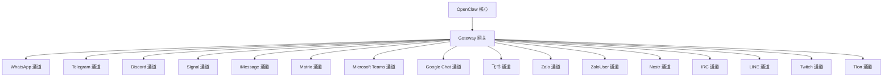
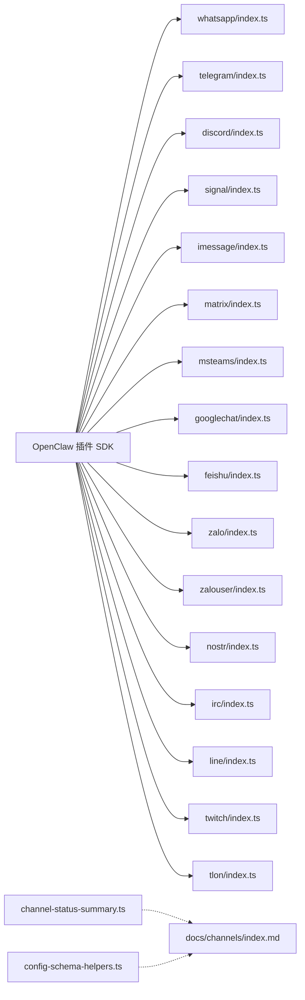

# Channel 插件

<cite>
**本文引用的文件**
- [docs/channels/index.md](file://docs/channels/index.md)
- [extensions/shared/channel-status-summary.ts](file://extensions/shared/channel-status-summary.ts)
- [extensions/shared/config-schema-helpers.ts](file://extensions/shared/config-schema-helpers.ts)
- [extensions/whatsapp/index.ts](file://extensions/whatsapp/index.ts)
- [extensions/telegram/index.ts](file://extensions/telegram/index.ts)
- [extensions/discord/index.ts](file://extensions/discord/index.ts)
- [extensions/signal/index.ts](file://extensions/signal/index.ts)
- [extensions/imessage/index.ts](file://extensions/imessage/index.ts)
- [extensions/matrix/index.ts](file://extensions/matrix/index.ts)
- [extensions/msteams/index.ts](file://extensions/msteams/index.ts)
- [extensions/googlechat/index.ts](file://extensions/googlechat/index.ts)
- [extensions/feishu/index.ts](file://extensions/feishu/index.ts)
- [extensions/zalo/index.ts](file://extensions/zalo/index.ts)
- [extensions/zalouser/index.ts](file://extensions/zalouser/index.ts)
- [extensions/nostr/index.ts](file://extensions/nostr/index.ts)
- [extensions/irc/index.ts](file://extensions/irc/index.ts)
- [extensions/line/index.ts](file://extensions/line/index.ts)
- [extensions/twitch/index.ts](file://extensions/twitch/index.ts)
- [extensions/tlon/index.ts](file://extensions/tlon/index.ts)
</cite>

## 目录
1. [简介](#简介)
2. [项目结构](#项目结构)
3. [核心组件](#核心组件)
4. [架构总览](#架构总览)
5. [详细组件分析](#详细组件分析)
6. [依赖关系分析](#依赖关系分析)
7. [性能考量](#性能考量)
8. [故障排除指南](#故障排除指南)
9. [结论](#结论)
10. [附录](#附录)

## 简介
本文件系统性梳理 OpenClaw 的 Channel 插件体系，覆盖 WhatsApp、Telegram、Discord、Signal、iMessage、Matrix、Microsoft Teams、Google Chat、Slack、Mattermost、Nextcloud Talk、Synology Chat、飞书（Feishu）、Zalo、ZaloUser、Nostr、IRC、LINE、Twitch、BlueBubbles、Tlon 等平台。内容包括各插件的功能特性、平台集成方式、认证与配置要点、消息路由规则、群组管理能力、媒体支持与使用示例，并提供配置模板、平台特定设置与故障排除建议，帮助用户正确安装、配置与使用。

## 项目结构
OpenClaw 的 Channel 插件采用“插件化 + 网关桥接”的架构：每个平台通过独立插件接入，统一由 OpenClaw 的插件 SDK 注册为通道（Channel），并通过网关（Gateway）完成消息路由与安全控制。共享模块提供状态汇总与配置校验等通用能力。

```mermaid
graph TB
subgraph "插件层"
WA["whatsapp/index.ts"]
TG["telegram/index.ts"]
DC["discord/index.ts"]
SG["signal/index.ts"]
IM["imessage/index.ts"]
MT["matrix/index.ts"]
MS["msteams/index.ts"]
GC["googlechat/index.ts"]
FS["feishu/index.ts"]
ZL["zalo/index.ts"]
ZU["zalouser/index.ts"]
NS["nostr/index.ts"]
IR["irc/index.ts"]
LN["line/index.ts"]
TW["twitch/index.ts"]
TL["tlon/index.ts"]
end
subgraph "共享模块"
CSS["extensions/shared/channel-status-summary.ts"]
CSH["extensions/shared/config-schema-helpers.ts"]
end
subgraph "文档"
IDX["docs/channels/index.md"]
end
WA --> |"注册通道"| IDX
TG --> |"注册通道"| IDX
DC --> |"注册通道"| IDX
SG --> |"注册通道"| IDX
IM --> |"注册通道"| IDX
MT --> |"注册通道"| IDX
MS --> |"注册通道"| IDX
GC --> |"注册通道"| IDX
FS --> |"注册通道"| IDX
ZL --> |"注册通道"| IDX
ZU --> |"注册通道"| IDX
NS --> |"注册通道"| IDX
IR --> |"注册通道"| IDX
LN --> |"注册通道"| IDX
TW --> |"注册通道"| IDX
TL --> |"注册通道"| IDX
CSS --> |"状态摘要"| IDX
CSH --> |"配置校验"| IDX
```

图表来源
- [docs/channels/index.md:1-48](file://docs/channels/index.md#L1-L48)
- [extensions/whatsapp/index.ts:1-18](file://extensions/whatsapp/index.ts#L1-L18)
- [extensions/telegram/index.ts:1-18](file://extensions/telegram/index.ts#L1-L18)
- [extensions/discord/index.ts:1-23](file://extensions/discord/index.ts#L1-L23)
- [extensions/signal/index.ts:1-18](file://extensions/signal/index.ts#L1-L18)
- [extensions/imessage/index.ts:1-18](file://extensions/imessage/index.ts#L1-L18)
- [extensions/matrix/index.ts:1-18](file://extensions/matrix/index.ts#L1-L18)
- [extensions/msteams/index.ts:1-18](file://extensions/msteams/index.ts#L1-L18)
- [extensions/googlechat/index.ts:1-18](file://extensions/googlechat/index.ts#L1-L18)
- [extensions/feishu/index.ts:1-71](file://extensions/feishu/index.ts#L1-L71)
- [extensions/zalo/index.ts:1-18](file://extensions/zalo/index.ts#L1-L18)
- [extensions/zalouser/index.ts:1-33](file://extensions/zalouser/index.ts#L1-L33)
- [extensions/nostr/index.ts:1-77](file://extensions/nostr/index.ts#L1-L77)
- [extensions/irc/index.ts:1-18](file://extensions/irc/index.ts#L1-L18)
- [extensions/line/index.ts:1-23](file://extensions/line/index.ts#L1-L23)
- [extensions/twitch/index.ts:1-21](file://extensions/twitch/index.ts#L1-L21)
- [extensions/tlon/index.ts:1-200](file://extensions/tlon/index.ts#L1-L200)
- [extensions/shared/channel-status-summary.ts:1-49](file://extensions/shared/channel-status-summary.ts#L1-L49)
- [extensions/shared/config-schema-helpers.ts:1-26](file://extensions/shared/config-schema-helpers.ts#L1-L26)

章节来源
- [docs/channels/index.md:1-48](file://docs/channels/index.md#L1-L48)

## 核心组件
- 插件注册器：各平台插件在入口文件中定义 id、name、description、configSchema，并通过 OpenClaw 插件 API 注册通道；部分插件还会注册子代理钩子、HTTP 路由或工具。
- 运行时注入：插件入口调用各自 runtime 设置函数，将运行时上下文注入到通道实现中，确保网络、存储、日志等基础设施可用。
- 状态摘要：共享模块提供被动通道状态与流量状态的摘要构建函数，便于统一上报与监控。
- 配置校验：共享模块提供通道开放策略与允许来源的校验辅助，保证 DM 开放策略与白名单一致性。

章节来源
- [extensions/whatsapp/index.ts:1-18](file://extensions/whatsapp/index.ts#L1-L18)
- [extensions/telegram/index.ts:1-18](file://extensions/telegram/index.ts#L1-L18)
- [extensions/discord/index.ts:1-23](file://extensions/discord/index.ts#L1-L23)
- [extensions/signal/index.ts:1-18](file://extensions/signal/index.ts#L1-L18)
- [extensions/imessage/index.ts:1-18](file://extensions/imessage/index.ts#L1-L18)
- [extensions/matrix/index.ts:1-18](file://extensions/matrix/index.ts#L1-L18)
- [extensions/msteams/index.ts:1-18](file://extensions/msteams/index.ts#L1-L18)
- [extensions/googlechat/index.ts:1-18](file://extensions/googlechat/index.ts#L1-L18)
- [extensions/feishu/index.ts:1-71](file://extensions/feishu/index.ts#L1-L71)
- [extensions/zalo/index.ts:1-18](file://extensions/zalo/index.ts#L1-L18)
- [extensions/zalouser/index.ts:1-33](file://extensions/zalouser/index.ts#L1-L33)
- [extensions/nostr/index.ts:1-77](file://extensions/nostr/index.ts#L1-L77)
- [extensions/irc/index.ts:1-18](file://extensions/irc/index.ts#L1-L18)
- [extensions/line/index.ts:1-23](file://extensions/line/index.ts#L1-L23)
- [extensions/twitch/index.ts:1-21](file://extensions/twitch/index.ts#L1-L21)
- [extensions/tlon/index.ts:1-200](file://extensions/tlon/index.ts#L1-L200)
- [extensions/shared/channel-status-summary.ts:1-49](file://extensions/shared/channel-status-summary.ts#L1-L49)
- [extensions/shared/config-schema-helpers.ts:1-26](file://extensions/shared/config-schema-helpers.ts#L1-L26)

## 架构总览
下图展示 OpenClaw 与各 Channel 插件的交互关系：插件通过 SDK 注册通道，通道通过运行时访问底层平台 API 或协议栈，消息经由网关路由至目标平台或从平台回流至 OpenClaw。

图表来源
- [extensions/whatsapp/index.ts:1-18](file://extensions/whatsapp/index.ts#L1-L18)
- [extensions/telegram/index.ts:1-18](file://extensions/telegram/index.ts#L1-L18)
- [extensions/discord/index.ts:1-23](file://extensions/discord/index.ts#L1-L23)
- [extensions/signal/index.ts:1-18](file://extensions/signal/index.ts#L1-L18)
- [extensions/imessage/index.ts:1-18](file://extensions/imessage/index.ts#L1-L18)
- [extensions/matrix/index.ts:1-18](file://extensions/matrix/index.ts#L1-L18)
- [extensions/msteams/index.ts:1-18](file://extensions/msteams/index.ts#L1-L18)
- [extensions/googlechat/index.ts:1-18](file://extensions/googlechat/index.ts#L1-L18)
- [extensions/feishu/index.ts:1-71](file://extensions/feishu/index.ts#L1-L71)
- [extensions/zalo/index.ts:1-18](file://extensions/zalo/index.ts#L1-L18)
- [extensions/zalouser/index.ts:1-33](file://extensions/zalouser/index.ts#L1-L33)
- [extensions/nostr/index.ts:1-77](file://extensions/nostr/index.ts#L1-L77)
- [extensions/irc/index.ts:1-18](file://extensions/irc/index.ts#L1-L18)
- [extensions/line/index.ts:1-23](file://extensions/line/index.ts#L1-L23)
- [extensions/twitch/index.ts:1-21](file://extensions/twitch/index.ts#L1-L21)
- [extensions/tlon/index.ts:1-200](file://extensions/tlon/index.ts#L1-L200)

## 详细组件分析

### WhatsApp 插件
- 功能特性
  - 基于 Baileys 的 QR 登录配对流程，支持群组与私聊消息收发。
  - 支持富文本、媒体、回复、转发等常见消息形态。
- 平台集成方式
  - 插件入口注册通道并注入运行时；通道实现负责与 Baileys 协议栈交互。
- 认证配置
  - 需要执行 QR 登录流程，首次登录后保存会话状态。
- 消息路由规则
  - 私聊与群聊 ID 区分处理；根据目标标识路由到对应会话。
- 群组管理
  - 支持成员查询、邀请、踢出、变更角色等操作。
- 媒体支持
  - 图片、视频、音频、文件上传与预览。
- 使用示例
  - 安装插件后启用通道，等待并扫描二维码完成配对；随后即可在聊天中与机器人交互。
- 故障排除
  - 若配对失败，检查网络连通性与二维码超时；必要时重新生成二维码并重试。

章节来源
- [extensions/whatsapp/index.ts:1-18](file://extensions/whatsapp/index.ts#L1-L18)

### Telegram 插件
- 功能特性
  - 基于 Bot API 与 grammY 框架，支持群组与私聊。
  - 支持多种消息类型与内联键盘、媒体发送。
- 平台集成方式
  - 插件入口注册通道并注入运行时；通道实现负责与 Telegram Bot API 通信。
- 认证配置
  - 需要 Bot Token；可配合 @BotFather 创建并获取。
- 消息路由规则
  - 私聊与群组消息通过 chat_id 区分；支持按会话路由。
- 群组管理
  - 支持管理员权限、退群、封禁等。
- 媒体支持
  - 图片、视频、文件、语音、动画、贴纸等。
- 使用示例
  - 获取 Bot Token 后启用通道；向机器人发送 /start 触发初始化。
- 故障排除
  - 若消息不达，检查 Token 权限与网络；确认 webhook 或长轮询模式配置正确。

章节来源
- [extensions/telegram/index.ts:1-18](file://extensions/telegram/index.ts#L1-L18)

### Discord 插件
- 功能特性
  - 使用 Discord Bot API 与 Gateway；支持服务器、频道与私聊。
  - 可注册子代理钩子以扩展能力。
- 平台集成方式
  - 插件入口注册通道并注入运行时；通道实现负责与 Discord API 交互。
- 认证配置
  - 需要 Bot Token 与应用 ID；在开发者门户创建应用并添加 Bot。
- 消息路由规则
  - 按 guild_id/channel_id/dm 区分；支持多服务器路由。
- 群组管理
  - 支持角色管理、权限控制、频道管理。
- 媒体支持
  - 图片、视频、附件上传与预览。
- 使用示例
  - 在开发者门户启用 GUILD_MEMBERS/GUILD_MESSAGES 等权限；启用通道后邀请机器人加入服务器。
- 故障排除
  - 若无响应，检查 intents 权限与机器人权限位；确认事件订阅与网关连接状态。

章节来源
- [extensions/discord/index.ts:1-23](file://extensions/discord/index.ts#L1-L23)

### Signal 插件
- 功能特性
  - 基于 signal-cli，强调隐私保护与端到端安全。
  - 支持文本、媒体、群组与私聊。
- 平台集成方式
  - 插件入口注册通道并注入运行时；通道实现负责与 signal-cli 交互。
- 认证配置
  - 需要手机号码与设备绑定；首次启动需完成初始配置。
- 消息路由规则
  - 私聊与群组通过号码或群组 ID 路由。
- 群组管理
  - 支持成员邀请、退出、管理员设置。
- 媒体支持
  - 图片、视频、音频、文件。
- 使用示例
  - 安装 signal-cli 并完成号码绑定；启用通道后开始收发消息。
- 故障排除
  - 若无法登录，检查信号服务可用性与本地配置；必要时重新绑定。

章节来源
- [extensions/signal/index.ts:1-18](file://extensions/signal/index.ts#L1-L18)

### iMessage 插件（已标记为旧版）
- 功能特性
  - 旧版 macOS 集成 via imsg CLI；新部署建议使用 BlueBubbles。
- 平台集成方式
  - 插件入口注册通道并注入运行时；通道实现负责与系统 iMessage 交互。
- 认证配置
  - 依赖系统账户与钥匙串凭据。
- 消息路由规则
  - 私聊通过对方 Apple ID/电话号码路由。
- 群组管理
  - 依赖系统组管理。
- 媒体支持
  - 文本、图片、视频、文件。
- 使用示例
  - 在 macOS 上启用相关权限；启用通道后开始收发消息。
- 故障排除
  - 新建部署请改用 BlueBubbles 插件以获得更佳体验。

章节来源
- [extensions/imessage/index.ts:1-18](file://extensions/imessage/index.ts#L1-L18)

### Matrix 插件
- 功能特性
  - 基于 matrix-js-sdk；支持房间与私聊。
- 平台集成方式
  - 插件入口注册通道并注入运行时；通道实现负责与 Matrix Homeserver 通信。
- 认证配置
  - 需要访问令牌与 homeserver 地址。
- 消息路由规则
  - 私聊与房间通过 room_id 路由。
- 群组管理
  - 支持房间管理、权限与成员管理。
- 媒体支持
  - 图片、视频、文件上传与预览。
- 使用示例
  - 获取访问令牌与 homeserver；启用通道后加入房间或发起私聊。
- 故障排除
  - 若鉴权失败，检查令牌有效期与权限范围。

章节来源
- [extensions/matrix/index.ts:1-18](file://extensions/matrix/index.ts#L1-L18)

### Microsoft Teams 插件
- 功能特性
  - 基于 Bot Framework；适合企业环境。
- 平台集成方式
  - 插件入口注册通道并注入运行时；通道实现负责与 Teams Bot API 交互。
- 认证配置
  - 需要应用 ID、密钥与 tenant 信息；在 Azure AD 中配置。
- 消息路由规则
  - 私聊与团队/频道通过 conversation_id 路由。
- 群组管理
  - 支持团队与频道权限管理。
- 媒体支持
  - 图片、视频、文件与卡片消息。
- 使用示例
  - 在 Azure 中创建 Bot 应用并配置权限；启用通道后邀请机器人加入团队。
- 故障排除
  - 若无消息，检查 Bot 权限与租户配置；确认消息事件订阅。

章节来源
- [extensions/msteams/index.ts:1-18](file://extensions/msteams/index.ts#L1-L18)

### Google Chat 插件
- 功能特性
  - 基于 HTTP Webhook；支持空间与直接聊天。
- 平台集成方式
  - 插件入口注册通道并注入运行时；通道实现负责接收与发送 Webhook。
- 认证配置
  - 需要服务账号与 OAuth 2.0 凭据；在 Google Cloud Console 配置。
- 消息路由规则
  - 私聊与空间通过 space_id 路由。
- 群组管理
  - 支持空间权限与成员管理。
- 媒体支持
  - 图片、视频、文件与交互式卡片。
- 使用示例
  - 创建服务账号并授予 Google Chat API 权限；启用通道后配置 Webhook。
- 故障排除
  - 若 Webhook 不达，检查回调 URL、签名与权限。

章节来源
- [extensions/googlechat/index.ts:1-18](file://extensions/googlechat/index.ts#L1-L18)

### 飞书（Feishu）插件
- 功能特性
  - 基于飞书/Lark Bot API；支持消息、卡片、媒体、反应、多工具集成。
- 平台集成方式
  - 插件入口注册通道并注入运行时；通道实现负责与飞书 API 交互。
- 认证配置
  - 需要 App ID、App Secret 与事件订阅；在开发者后台配置。
- 消息路由规则
  - 私聊与群聊通过 chat_id 路由；支持多租户。
- 群组管理
  - 支持群组成员管理与权限控制。
- 媒体支持
  - 图片、文件、视频与富文本卡片。
- 工具与钩子
  - 注册子代理钩子与多项工具（文档、wiki、驱动、权限、多维表格）。
- 使用示例
  - 在开发者后台创建应用并开启事件订阅；启用通道后授权并开始使用。
- 故障排除
  - 若事件未触发，检查事件订阅与回调地址；确认应用权限范围。

章节来源
- [extensions/feishu/index.ts:1-71](file://extensions/feishu/index.ts#L1-L71)

### Zalo 插件
- 功能特性
  - 基于 Zalo Bot API；适合越南市场。
- 平台集成方式
  - 插件入口注册通道并注入运行时；通道实现负责与 Zalo API 交互。
- 认证配置
  - 需要 App ID、App Secret 与事件订阅；在开发者后台配置。
- 消息路由规则
  - 私聊与群聊通过 conversation_id 路由。
- 群组管理
  - 支持群组成员管理。
- 媒体支持
  - 图片、视频、文件与表情包。
- 使用示例
  - 在开发者后台创建应用并配置回调；启用通道后授权并开始使用。
- 故障排除
  - 若消息不达，检查回调地址与权限范围。

章节来源
- [extensions/zalo/index.ts:1-18](file://extensions/zalo/index.ts#L1-L18)

### ZaloUser 插件
- 功能特性
  - 基于原生 zca-js 集成；支持个人账号消息与数据访问。
- 平台集成方式
  - 插件入口注册通道并注入运行时；通道实现负责与 Zalo 个人账号交互。
- 认证配置
  - 需要个人账号登录与授权；支持工具参数校验。
- 消息路由规则
  - 私聊通过好友 ID 路由。
- 群组管理
  - 支持群组列表与搜索。
- 媒体支持
  - 图片、链接、状态检查。
- 工具
  - 注册工具：发送文本/图片/链接、好友/群组查询、个人信息、状态检查。
- 使用示例
  - 启用通道后，通过工具执行发送与查询操作。
- 故障排除
  - 若工具报错，检查账号状态与授权范围。

章节来源
- [extensions/zalouser/index.ts:1-33](file://extensions/zalouser/index.ts#L1-L33)

### Nostr 插件
- 功能特性
  - 基于 NIP-04；支持去中心化私聊。
- 平台集成方式
  - 插件入口注册通道并注入运行时；通道实现负责与 relays 通信。
- 认证配置
  - 需要私钥与可选中继列表；支持通过 HTTP 接口更新配置。
- 消息路由规则
  - 私聊通过公钥路由；支持多账户管理。
- 群组管理
  - 去中心化，依赖公钥与中继共识。
- 媒体支持
  - 文本、加密消息与元数据。
- HTTP 路由
  - 提供 /api/channels/nostr 接口用于配置档案与账户信息。
- 使用示例
  - 配置私钥与中继；启用通道后开始接收与发送私聊。
- 故障排除
  - 若消息未达，检查中继连通性与签名有效性。

章节来源
- [extensions/nostr/index.ts:1-77](file://extensions/nostr/index.ts#L1-L77)

### IRC 插件
- 功能特性
  - 支持经典 IRC 服务器；通道与私聊均受支持。
- 平台集成方式
  - 插件入口注册通道并注入运行时；通道实现负责与 IRC 服务器通信。
- 认证配置
  - 支持服务器地址、端口、TLS、密码与用户名/密码认证。
- 消息路由规则
  - 频道与私聊通过名称区分；支持配对/白名单控制。
- 群组管理
  - 支持频道加入/离开与权限管理。
- 媒体支持
  - 文本为主，部分服务器支持扩展。
- 使用示例
  - 配置服务器与认证；加入目标频道或私聊用户。
- 故障排除
  - 若连接失败，检查服务器可达性与认证参数。

章节来源
- [extensions/irc/index.ts:1-18](file://extensions/irc/index.ts#L1-L18)

### LINE 插件
- 功能特性
  - 基于 LINE Messaging API；支持卡片命令与消息。
- 平台集成方式
  - 插件入口注册通道并注入运行时；通道实现负责与 LINE API 交互。
- 认证配置
  - 需要 Channel ID、Channel Secret 与 Access Token；在 LINE Developers 配置。
- 消息路由规则
  - 私聊与群聊通过 conversation_id 路由。
- 群组管理
  - 支持群组成员管理。
- 媒体支持
  - 图片、视频、文件与富文本卡片。
- 工具
  - 注册卡片命令以增强交互体验。
- 使用示例
  - 在 LINE Developers 创建 Channel 并配置回调；启用通道后开始使用。
- 故障排除
  - 若消息不达，检查回调 URL 与令牌权限。

章节来源
- [extensions/line/index.ts:1-23](file://extensions/line/index.ts#L1-L23)

### Twitch 插件
- 功能特性
  - 基于 IRC 连接；适合直播场景下的聊天互动。
- 平台集成方式
  - 插件入口注册通道并注入运行时；通道实现负责与 Twitch IRC 交互。
- 认证配置
  - 需要 OAuth Token 与用户名；用于身份验证。
- 消息路由规则
  - 频道聊天通过频道名路由。
- 群组管理
  - 依赖 Twitch 频道权限与订阅等级。
- 媒体支持
  - 文本为主，支持 Emote 与链接。
- 使用示例
  - 生成 OAuth Token 并配置用户名；进入目标频道开始互动。
- 故障排除
  - 若无法连接，检查 Token 权限与网络。

章节来源
- [extensions/twitch/index.ts:1-21](file://extensions/twitch/index.ts#L1-L21)

### Tlon 插件
- 功能特性
  - 基于 Urbit 的 Tlon CLI；支持活动、联系人、群组、消息等操作。
- 平台集成方式
  - 插件入口注册通道并注入运行时；通道实现负责与 Tlon CLI 交互。
- 认证配置
  - 需要本地安装的 tlon 可执行文件与账户凭据。
- 消息路由规则
  - 通过 CLI 子命令路由到不同资源。
- 群组管理
  - 支持群组列表、消息查询与活动查看。
- 媒体支持
  - 文本输出为主。
- 工具
  - 注册 tlon 工具，限制允许的子命令集合，安全地执行 CLI 操作。
- 使用示例
  - 安装 tlon 并登录；通过工具执行如 activity、channels、groups 等命令。
- 故障排除
  - 若命令无效，检查子命令是否在白名单中；确认可执行文件路径。

章节来源
- [extensions/tlon/index.ts:1-200](file://extensions/tlon/index.ts#L1-L200)

## 依赖关系分析
- 插件与 SDK 的耦合度低：各插件仅依赖对应平台的 SDK 入口与通道实现，通过统一的注册接口接入 OpenClaw。
- 运行时注入：插件通过 setXxxRuntime 将运行时注入通道，降低外部依赖耦合。
- 共享能力：状态摘要与配置校验在共享模块中复用，避免重复实现。
- 安全与合规：部分插件（如 Tlon、Nostr）内置白名单与 HTTP 路由，强化安全边界。

图表来源
- [extensions/whatsapp/index.ts:1-18](file://extensions/whatsapp/index.ts#L1-L18)
- [extensions/telegram/index.ts:1-18](file://extensions/telegram/index.ts#L1-L18)
- [extensions/discord/index.ts:1-23](file://extensions/discord/index.ts#L1-L23)
- [extensions/signal/index.ts:1-18](file://extensions/signal/index.ts#L1-L18)
- [extensions/imessage/index.ts:1-18](file://extensions/imessage/index.ts#L1-L18)
- [extensions/matrix/index.ts:1-18](file://extensions/matrix/index.ts#L1-L18)
- [extensions/msteams/index.ts:1-18](file://extensions/msteams/index.ts#L1-L18)
- [extensions/googlechat/index.ts:1-18](file://extensions/googlechat/index.ts#L1-L18)
- [extensions/feishu/index.ts:1-71](file://extensions/feishu/index.ts#L1-L71)
- [extensions/zalo/index.ts:1-18](file://extensions/zalo/index.ts#L1-L18)
- [extensions/zalouser/index.ts:1-33](file://extensions/zalouser/index.ts#L1-L33)
- [extensions/nostr/index.ts:1-77](file://extensions/nostr/index.ts#L1-L77)
- [extensions/irc/index.ts:1-18](file://extensions/irc/index.ts#L1-L18)
- [extensions/line/index.ts:1-23](file://extensions/line/index.ts#L1-L23)
- [extensions/twitch/index.ts:1-21](file://extensions/twitch/index.ts#L1-L21)
- [extensions/tlon/index.ts:1-200](file://extensions/tlon/index.ts#L1-L200)
- [extensions/shared/channel-status-summary.ts:1-49](file://extensions/shared/channel-status-summary.ts#L1-L49)
- [extensions/shared/config-schema-helpers.ts:1-26](file://extensions/shared/config-schema-helpers.ts#L1-L26)
- [docs/channels/index.md:1-48](file://docs/channels/index.md#L1-L48)

## 性能考量
- 连接池与并发：对高频平台（如 Telegram、Discord、Matrix）建议启用连接池与批量处理，减少握手开销。
- 缓存与状态：利用通道状态摘要与流量时间戳，实现健康检查与自愈机制。
- 媒体传输：优先使用平台直传（如飞书、Google Chat）以降低中间节点延迟。
- 事件驱动：在支持 Webhook 的平台（如 Google Chat、飞书）优先使用 Webhook，降低轮询成本。

## 故障排除指南
- 通用排查
  - 检查网络连通性与防火墙设置。
  - 确认凭据有效且权限范围正确。
  - 查看通道状态摘要中的 lastError 与 lastProbeAt。
- 平台特定
  - Telegram：确认 Bot Token 与 webhook 配置；检查是否被限制。
  - Discord：确认 intents 与权限位；检查事件订阅。
  - Matrix：确认访问令牌与 homeserver 地址；检查房间权限。
  - Google Chat：确认服务账号与回调 URL；检查签名与权限。
  - Feishu：确认事件订阅与回调地址；检查应用权限。
  - Zalo/ZaloUser：确认 App ID/Secret 与回调；检查授权范围。
  - Nostr：确认私钥与中继连通性；检查签名。
  - IRC：确认服务器地址、端口与认证参数。
  - LINE：确认 Channel 凭据与回调 URL。
  - Twitch：确认 OAuth Token 与网络。
  - Tlon：确认 tlon 可执行文件与子命令白名单。

章节来源
- [extensions/shared/channel-status-summary.ts:1-49](file://extensions/shared/channel-status-summary.ts#L1-L49)
- [extensions/shared/config-schema-helpers.ts:1-26](file://extensions/shared/config-schema-helpers.ts#L1-L26)

## 结论
OpenClaw 的 Channel 插件体系以“插件化 + 网关”为核心，覆盖主流即时通讯平台，提供一致的注册与运行时注入机制。通过共享的状态摘要与配置校验模块，实现统一的可观测性与安全性。针对不同平台的特性，用户可选择最合适的插件并按平台文档完成认证与配置，从而实现稳定的消息路由与丰富的群组/媒体能力。

## 附录
- 快速选择建议
  - 最快上手：Telegram（Bot Token）
  - 企业首选：Microsoft Teams（Bot Framework）
  - 去中心化：Nostr（NIP-04）
  - 私聊隐私：Signal（signal-cli）
  - 旧系统兼容：iMessage（已标记为旧版，建议 BlueBubbles）
- 配置模板与平台特定设置
  - 请参考各平台官方文档与插件入口中的 configSchema 说明，结合通道状态摘要进行验证与监控。
- 使用示例
  - 在启用通道后，按平台要求完成配对或授权；随后通过聊天界面或工具执行消息发送与查询。