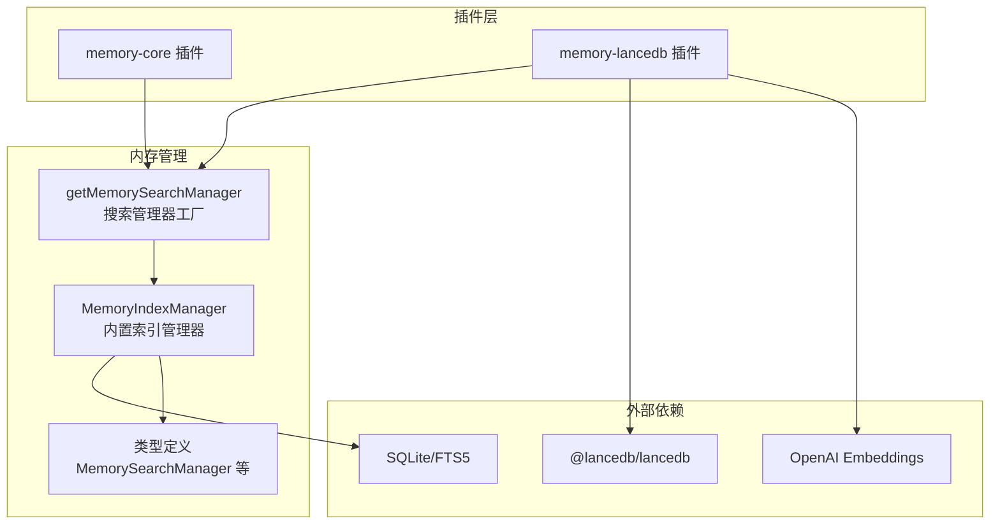
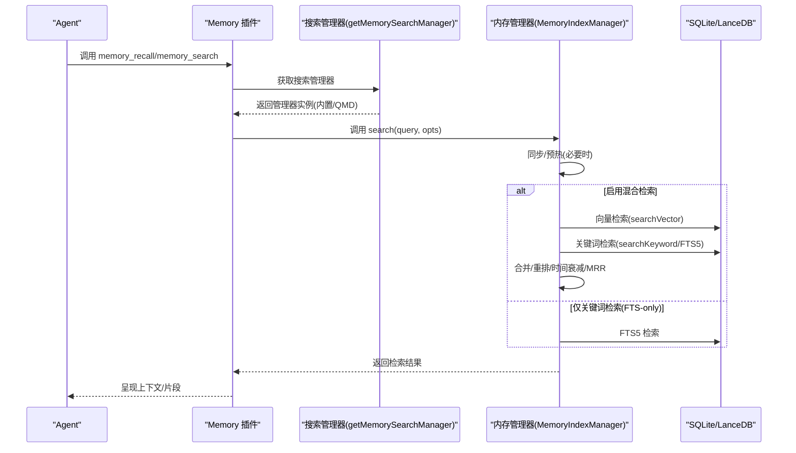
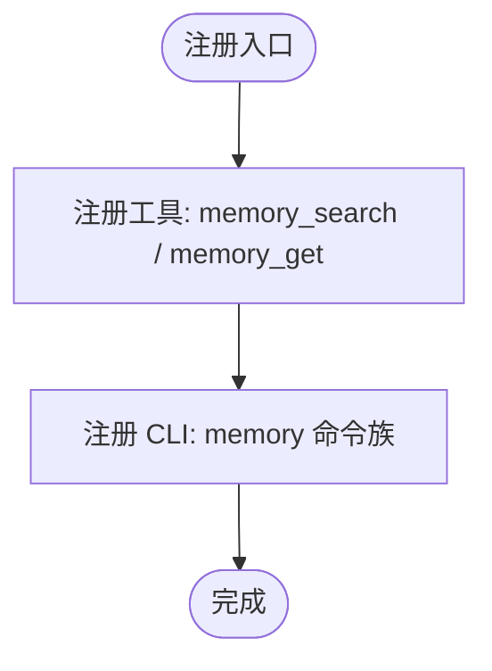
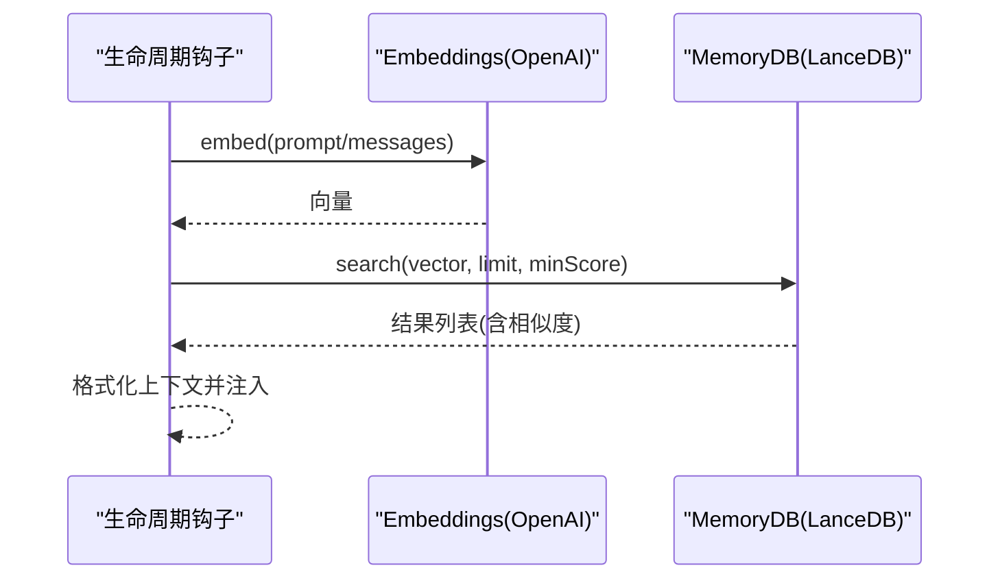
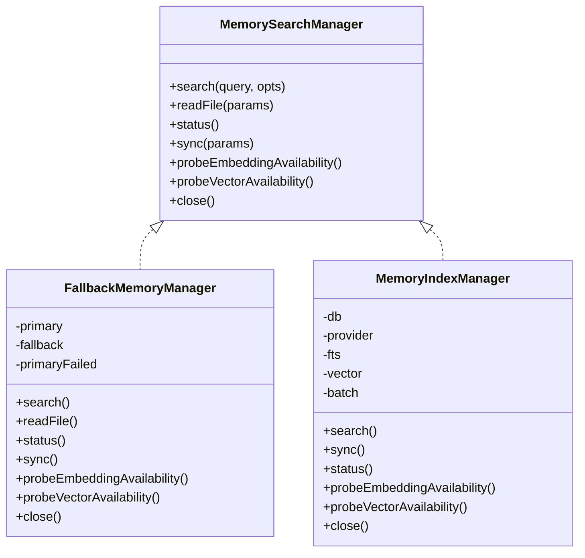
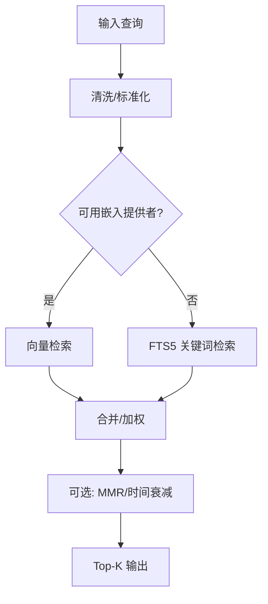
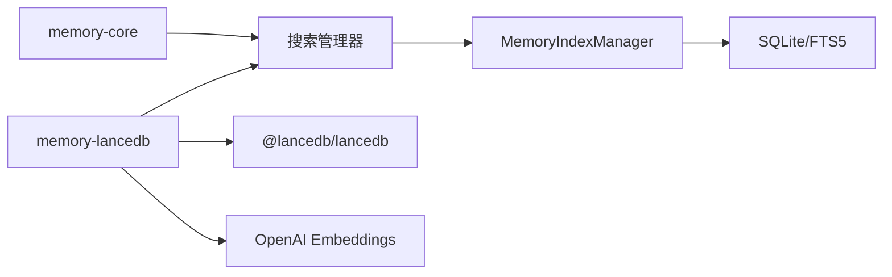

# Memory 插件

<cite>
**本文档引用的文件**
- [extensions/memory-core/index.ts](file://extensions/memory-core/index.ts)
- [extensions/memory-lancedb/index.ts](file://extensions/memory-lancedb/index.ts)
- [extensions/memory-lancedb/config.ts](file://extensions/memory-lancedb/config.ts)
- [src/memory/index.ts](file://src/memory/index.ts)
- [src/memory/manager.ts](file://src/memory/manager.ts)
- [src/memory/search-manager.ts](file://src/memory/search-manager.ts)
- [src/memory/types.ts](file://src/memory/types.ts)
- [docs/concepts/memory.md](file://docs/concepts/memory.md)
- [docs/cli/memory.md](file://docs/cli/memory.md)
</cite>

## 目录
1. [简介](#简介)
2. [项目结构](#项目结构)
3. [核心组件](#核心组件)
4. [架构总览](#架构总览)
5. [详细组件分析](#详细组件分析)
6. [依赖关系分析](#依赖关系分析)
7. [性能考量](#性能考量)
8. [故障排除指南](#故障排除指南)
9. [结论](#结论)
10. [附录](#附录)

## 简介
本文件系统性介绍 OpenClaw 的 Memory 插件体系，涵盖两大核心插件：Core 内存插件与 LanceDB 内存插件。内容包括：
- 内存存储后端与向量数据库集成
- 检索算法（BM25 关键词 + 向量相似）与混合检索策略
- 缓存策略与性能优化
- 配置选项、数据持久化、查询优化技巧
- 故障排除与与其他组件的集成方式

## 项目结构
Memory 插件由“插件层 + 核心内存管理器 + 搜索管理器 + 类型定义 + 文档”构成，形成清晰分层：
- 插件层：提供工具与 CLI，注册到 OpenClaw 生命周期钩子
- 内存管理器：负责索引构建、增量同步、向量/关键词检索、缓存与只读恢复
- 搜索管理器：统一对外接口，支持内置与 QMD 后端，并提供回退机制
- 类型定义：统一结果、状态与能力探测接口
- 文档：概念说明、CLI 使用与配置参考

**图表来源**
- [extensions/memory-core/index.ts:1-39](file://extensions/memory-core/index.ts#L1-L39)
- [extensions/memory-lancedb/index.ts:1-679](file://extensions/memory-lancedb/index.ts#L1-L679)
- [src/memory/search-manager.ts:1-254](file://src/memory/search-manager.ts#L1-L254)
- [src/memory/manager.ts:1-841](file://src/memory/manager.ts#L1-L841)
- [src/memory/types.ts:1-82](file://src/memory/types.ts#L1-L82)

**章节来源**
- [extensions/memory-core/index.ts:1-39](file://extensions/memory-core/index.ts#L1-L39)
- [extensions/memory-lancedb/index.ts:1-679](file://extensions/memory-lancedb/index.ts#L1-L679)
- [src/memory/index.ts:1-12](file://src/memory/index.ts#L1-L12)
- [src/memory/search-manager.ts:1-254](file://src/memory/search-manager.ts#L1-L254)
- [src/memory/manager.ts:1-841](file://src/memory/manager.ts#L1-L841)
- [src/memory/types.ts:1-82](file://src/memory/types.ts#L1-L82)

## 核心组件
- Core 内存插件
  - 提供 memory_search 与 memory_get 工具，基于工作区 Markdown 文件进行语义检索与精确读取
  - 注册 CLI 命令，支持状态、索引与搜索
- LanceDB 内存插件
  - 基于 LanceDB 的向量内存，自动召回与捕获
  - 支持 OpenAI Embeddings，具备规则过滤与 Prompt 安全处理
  - 提供 recall/store/forget 工具与 CLI 子命令
- 内存搜索管理器
  - 统一对外接口，支持内置 SQLite 索引与 QMD 后端，内置回退逻辑
- 内存管理器
  - 负责索引构建、增量同步、向量/关键词检索、缓存、只读数据库恢复
  - 支持批处理失败上限与并发控制

**章节来源**
- [extensions/memory-core/index.ts:10-36](file://extensions/memory-core/index.ts#L10-L36)
- [extensions/memory-lancedb/index.ts:292-679](file://extensions/memory-lancedb/index.ts#L292-L679)
- [src/memory/search-manager.ts:25-86](file://src/memory/search-manager.ts#L25-L86)
- [src/memory/manager.ts:61-241](file://src/memory/manager.ts#L61-L241)

## 架构总览
下图展示从插件到搜索管理器再到内存管理器的整体调用链，以及向量与关键词检索的混合流程。

**图表来源**
- [src/memory/search-manager.ts:25-86](file://src/memory/search-manager.ts#L25-L86)
- [src/memory/manager.ts:259-367](file://src/memory/manager.ts#L259-L367)

**章节来源**
- [src/memory/search-manager.ts:104-247](file://src/memory/search-manager.ts#L104-L247)
- [src/memory/manager.ts:259-452](file://src/memory/manager.ts#L259-L452)

## 详细组件分析

### Core 内存插件（memory-core）
- 功能
  - 注册 memory_search 与 memory_get 工具，面向工作区 Markdown 文件
  - 注册 CLI 命令，支持状态、索引与搜索
- 特点
  - 基于文件系统与内置 SQLite 索引
  - 无外部向量库依赖，适合轻量场景
  - 与会话生命周期解耦，按需同步

**图表来源**
- [extensions/memory-core/index.ts:10-36](file://extensions/memory-core/index.ts#L10-L36)

**章节来源**
- [extensions/memory-core/index.ts:1-39](file://extensions/memory-core/index.ts#L1-L39)
- [docs/cli/memory.md:1-67](file://docs/cli/memory.md#L1-L67)

### LanceDB 内存插件（memory-lancedb）
- 功能
  - recall/store/forget 三大工具，支持自动召回与自动捕获
  - CLI 子命令：ltm list/search/stats
- 数据流
  - 查询时将文本嵌入为向量，使用 LanceDB 向量检索，再映射为相似度分数
  - 存储时去重检查、分类检测、重要性标注
  - 忽略重复或注入式上下文，避免自我中毒
- 生命周期钩子
  - before_agent_start：自动注入相关记忆到上下文
  - agent_end：自动捕获用户输入中符合规则的内容

**图表来源**
- [extensions/memory-lancedb/index.ts:546-572](file://extensions/memory-lancedb/index.ts#L546-L572)
- [extensions/memory-lancedb/index.ts:574-658](file://extensions/memory-lancedb/index.ts#L574-L658)

**章节来源**
- [extensions/memory-lancedb/index.ts:292-679](file://extensions/memory-lancedb/index.ts#L292-L679)
- [extensions/memory-lancedb/config.ts:1-181](file://extensions/memory-lancedb/config.ts#L1-L181)

### 搜索管理器与内存管理器
- 搜索管理器
  - 解析后端配置，优先 QMD；失败则回退内置索引
  - 对外暴露统一接口：search/readFile/status/sync/probe
- 内存管理器
  - 索引构建：SQLite + FTS5 + 向量表
  - 混合检索：向量相似 + BM25 关键词，合并权重、可选 MMR 与时间衰减
  - 增量同步：文件系统监听、会话增量、定时刷新
  - 只读数据库恢复：自动重建连接并重新初始化
  - 批处理：远程嵌入批处理失败上限与并发控制

**图表来源**
- [src/memory/types.ts:61-82](file://src/memory/types.ts#L61-L82)
- [src/memory/search-manager.ts:104-247](file://src/memory/search-manager.ts#L104-L247)
- [src/memory/manager.ts:61-241](file://src/memory/manager.ts#L61-L241)

**章节来源**
- [src/memory/search-manager.ts:25-102](file://src/memory/search-manager.ts#L25-L102)
- [src/memory/manager.ts:45-134](file://src/memory/manager.ts#L45-L134)

### 检索算法与混合策略
- 向量检索
  - 使用 OpenAI 或兼容服务生成嵌入，LanceDB 向量搜索返回候选
  - 将 LanceDB 默认 L2 距离转换为 0-1 相似度
- 关键词检索（FTS5）
  - 在无嵌入提供者或禁用混合模式时启用
  - 对自然语言查询提取关键词以提升匹配效果
- 混合检索
  - 向量与关键词分别打分后合并，归一化权重
  - 可选 MMR（多样性）与时间衰减（新鲜度）
- 结果后处理
  - 截断、去重、排序、可选 MMR 与时间衰减

**图表来源**
- [src/memory/manager.ts:259-367](file://src/memory/manager.ts#L259-L367)
- [src/memory/manager.ts:395-452](file://src/memory/manager.ts#L395-L452)

**章节来源**
- [src/memory/manager.ts:259-452](file://src/memory/manager.ts#L259-L452)
- [docs/concepts/memory.md:461-776](file://docs/concepts/memory.md#L461-L776)

### 缓存策略与性能优化
- 嵌入缓存
  - SQLite 中缓存 chunk 嵌入，避免重复计算
  - 可配置最大条目数
- 向量加速
  - sqlite-vec 扩展：在数据库内执行向量距离查询，减少 JS 内存占用
  - 可通过配置启用/指定扩展路径
- 批处理
  - 远程嵌入批处理（OpenAI/Gemini/Voyage），提高大规模索引效率
  - 失败上限与并发控制，避免雪崩
- 只读数据库恢复
  - 自动检测只读错误并重建连接，保证稳定性

**章节来源**
- [docs/concepts/memory.md:678-776](file://docs/concepts/memory.md#L678-L776)
- [src/memory/manager.ts:454-590](file://src/memory/manager.ts#L454-L590)

## 依赖关系分析
- 插件到管理器
  - Core 插件通过工具注册调用搜索管理器
  - LanceDB 插件直接持有 MemoryDB 与 Embeddings 实例
- 管理器到后端
  - 内存管理器依赖 SQLite/FTS5 与可选 sqlite-vec
  - LanceDB 插件依赖 @lancedb/lancedb 与 OpenAI SDK
- 回退机制
  - QMD 后端不可用时自动回退内置索引
  - 内置索引异常时可进行只读恢复

**图表来源**
- [src/memory/search-manager.ts:31-76](file://src/memory/search-manager.ts#L31-L76)
- [extensions/memory-lancedb/index.ts:292-310](file://extensions/memory-lancedb/index.ts#L292-L310)

**章节来源**
- [src/memory/search-manager.ts:104-247](file://src/memory/search-manager.ts#L104-L247)
- [extensions/memory-lancedb/index.ts:26-37](file://extensions/memory-lancedb/index.ts#L26-L37)

## 性能考量
- 选择合适后端
  - 轻量场景优先 Core 插件（无外部依赖）
  - 需要向量检索与自动捕获时选择 LanceDB 插件
- 混合检索参数
  - 合理设置候选倍数、权重与最小分数阈值
  - 在大量重复内容场景启用 MMR
- 向量加速与缓存
  - 启用 sqlite-vec 与嵌入缓存
  - 批处理远程嵌入，降低延迟与成本
- 增量同步
  - 利用文件系统监听与会话增量，避免全量重建
  - 控制刷新频率与超时，平衡实时性与资源消耗

[本节为通用指导，无需特定文件来源]

## 故障排除指南
- 常见症状与排查步骤
  - 运行状态检查：status/gateway/probe/logs
  - 记忆功能异常：确认插件已启用、配置正确、API 密钥有效
- LanceDB 插件问题
  - 加载失败：检查平台原生绑定是否可用，必要时更换平台或安装替代
  - 向量检索为空：确认嵌入模型维度与向量维度一致，检查网络与密钥
  - 自动捕获无效：检查消息长度、触发规则与 Prompt 注入防护
- 内置索引问题
  - 只读数据库：自动恢复，若持续失败检查权限与磁盘空间
  - FTS 不可用：确认 sqlite-vec 是否可用，或降级为关键词检索
- CLI 使用
  - 使用 openclaw memory 命令进行状态、索引与搜索验证
  - 深入诊断可添加 --deep/--index/--verbose/--json 参数

**章节来源**
- [docs/help/troubleshooting.md:1-299](file://docs/help/troubleshooting.md#L1-L299)
- [docs/cli/memory.md:1-67](file://docs/cli/memory.md#L1-L67)
- [extensions/memory-lancedb/index.ts:26-37](file://extensions/memory-lancedb/index.ts#L26-L37)
- [src/memory/manager.ts:505-590](file://src/memory/manager.ts#L505-L590)

## 结论
OpenClaw 的 Memory 插件体系提供了从纯文本到向量增强的完整内存解决方案：
- Core 插件适合轻量与隐私优先场景
- LanceDB 插件提供强大的向量检索与自动化能力
- 搜索管理器与内存管理器统一抽象，支持后端切换与回退
- 通过缓存、向量加速与批处理等手段实现高性能与低成本
建议根据业务需求选择合适插件，并结合混合检索与后处理策略获得最佳体验

[本节为总结，无需特定文件来源]

## 附录

### 配置选项速查
- Core 插件
  - 通过插件槽位禁用：plugins.slots.memory = "none"
  - CLI：openclaw memory 命令族
- LanceDB 插件
  - embedding.apiKey：必填（支持环境变量占位符）
  - embedding.model：默认 text-embedding-3-small
  - embedding.dimensions：自定义模型需显式指定
  - embedding.baseUrl：兼容 OpenAI 接口的自定义端点
  - dbPath：默认 ~/.openclaw/memory/lancedb
  - autoCapture/autoRecall：自动捕获/召回开关
  - captureMaxChars：自动捕获最大字符数

**章节来源**
- [extensions/memory-lancedb/config.ts:92-181](file://extensions/memory-lancedb/config.ts#L92-L181)
- [docs/concepts/memory.md:1-803](file://docs/concepts/memory.md#L1-L803)