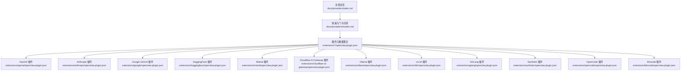
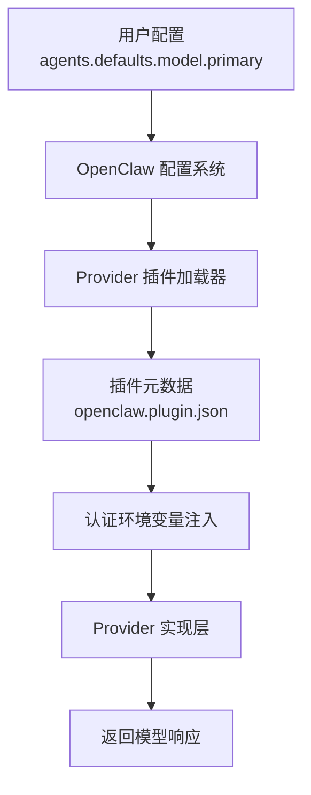
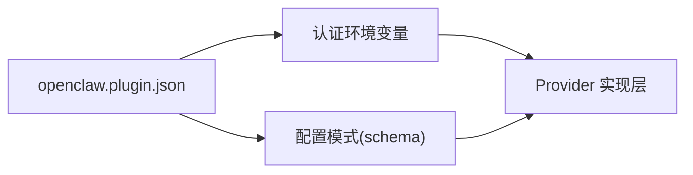

# Provider 插件

<cite>
**本文引用的文件**
- [docs/providers/index.md](file://docs/providers/index.md)
- [docs/providers/models.md](file://docs/providers/models.md)
- [extensions/openai/openclaw.plugin.json](file://extensions/openai/openclaw.plugin.json)
- [extensions/anthropic/openclaw.plugin.json](file://extensions/anthropic/openclaw.plugin.json)
- [extensions/google/openclaw.plugin.json](file://extensions/google/openclaw.plugin.json)
- [extensions/huggingface/openclaw.plugin.json](file://extensions/huggingface/openclaw.plugin.json)
- [extensions/mistral/openclaw.plugin.json](file://extensions/mistral/openclaw.plugin.json)
- [extensions/cloudflare-ai-gateway/openclaw.plugin.json](file://extensions/cloudflare-ai-gateway/openclaw.plugin.json)
- [extensions/ollama/openclaw.plugin.json](file://extensions/ollama/openclaw.plugin.json)
- [extensions/vllm/openclaw.plugin.json](file://extensions/vllm/openclaw.plugin.json)
- [extensions/sglang/openclaw.plugin.json](file://extensions/sglang/openclaw.plugin.json)
- [extensions/synthetic/openclaw.plugin.json](file://extensions/synthetic/openclaw.plugin.json)
- [extensions/opencode/openclaw.plugin.json](file://extensions/opencode/openclaw.plugin.json)
- [extensions/kilocode/openclaw.plugin.json](file://extensions/kilocode/openclaw.plugin.json)
</cite>

## 目录
1. [简介](#简介)
2. [项目结构](#项目结构)
3. [核心组件](#核心组件)
4. [架构总览](#架构总览)
5. [详细组件分析](#详细组件分析)
6. [依赖分析](#依赖分析)
7. [性能考虑](#性能考虑)
8. [故障排除指南](#故障排除指南)
9. [结论](#结论)
10. [附录](#附录)

## 简介
本文件系统性梳理 OpenClaw 的 Provider 插件体系，聚焦于各类 AI 模型提供商（LLM）的插件化集成与使用方法。内容覆盖认证配置、模型选择、配置模板、最佳实践与故障排除，帮助用户在不同 Provider 之间进行切换与优化。

## 项目结构
- 文档层：位于 docs/providers 下，包含“模型提供商”总览与快速入门指引。
- 插件元数据层：位于 extensions/*/openclaw.plugin.json，定义各 Provider 的插件 ID、支持的 Provider 列表、认证环境变量与配置模式。

图表来源
- [docs/providers/index.md:1-63](file://docs/providers/index.md#L1-L63)
- [docs/providers/models.md:1-45](file://docs/providers/models.md#L1-L45)
- [extensions/openai/openclaw.plugin.json:1-13](file://extensions/openai/openclaw.plugin.json#L1-L13)
- [extensions/anthropic/openclaw.plugin.json:1-13](file://extensions/anthropic/openclaw.plugin.json#L1-L13)
- [extensions/google/openclaw.plugin.json:1-13](file://extensions/google/openclaw.plugin.json#L1-L13)
- [extensions/huggingface/openclaw.plugin.json:1-13](file://extensions/huggingface/openclaw.plugin.json#L1-L13)
- [extensions/mistral/openclaw.plugin.json:1-13](file://extensions/mistral/openclaw.plugin.json#L1-L13)
- [extensions/cloudflare-ai-gateway/openclaw.plugin.json:1-13](file://extensions/cloudflare-ai-gateway/openclaw.plugin.json#L1-L13)
- [extensions/ollama/openclaw.plugin.json:1-13](file://extensions/ollama/openclaw.plugin.json#L1-L13)
- [extensions/vllm/openclaw.plugin.json:1-13](file://extensions/vllm/openclaw.plugin.json#L1-L13)
- [extensions/sglang/openclaw.plugin.json:1-13](file://extensions/sglang/openclaw.plugin.json#L1-L13)
- [extensions/synthetic/openclaw.plugin.json:1-13](file://extensions/synthetic/openclaw.plugin.json#L1-L13)
- [extensions/opencode/openclaw.plugin.json:1-13](file://extensions/opencode/openclaw.plugin.json#L1-L13)
- [extensions/kilocode/openclaw.plugin.json:1-13](file://extensions/kilocode/openclaw.plugin.json#L1-L13)

章节来源
- [docs/providers/index.md:1-63](file://docs/providers/index.md#L1-L63)
- [docs/providers/models.md:1-45](file://docs/providers/models.md#L1-L45)

## 核心组件
- Provider 插件元数据：每个 Provider 插件通过 openclaw.plugin.json 声明其插件 ID、支持的 Provider 名称、认证所需的环境变量以及配置模式（schema）。该模式用于校验与生成配置。
- 认证环境变量：各 Provider 在其插件元数据中声明了必需的认证环境变量键名，例如 OPENAI_API_KEY、ANTHROPIC_OAUTH_TOKEN 等。
- 配置模式：所有 Provider 插件的 configSchema 当前为空对象，表示默认无额外配置项；如需扩展，可在相应插件的 openclaw.plugin.json 中添加字段。

章节来源
- [extensions/openai/openclaw.plugin.json:1-13](file://extensions/openai/openclaw.plugin.json#L1-L13)
- [extensions/anthropic/openclaw.plugin.json:1-13](file://extensions/anthropic/openclaw.plugin.json#L1-L13)
- [extensions/google/openclaw.plugin.json:1-13](file://extensions/google/openclaw.plugin.json#L1-L13)
- [extensions/huggingface/openclaw.plugin.json:1-13](file://extensions/huggingface/openclaw.plugin.json#L1-L13)
- [extensions/mistral/openclaw.plugin.json:1-13](file://extensions/mistral/openclaw.plugin.json#L1-L13)
- [extensions/cloudflare-ai-gateway/openclaw.plugin.json:1-13](file://extensions/cloudflare-ai-gateway/openclaw.plugin.json#L1-L13)
- [extensions/ollama/openclaw.plugin.json:1-13](file://extensions/ollama/openclaw.plugin.json#L1-L13)
- [extensions/vllm/openclaw.plugin.json:1-13](file://extensions/vllm/openclaw.plugin.json#L1-L13)
- [extensions/sglang/openclaw.plugin.json:1-13](file://extensions/sglang/openclaw.plugin.json#L1-L13)
- [extensions/synthetic/openclaw.plugin.json:1-13](file://extensions/synthetic/openclaw.plugin.json#L1-L13)
- [extensions/opencode/openclaw.plugin.json:1-13](file://extensions/opencode/openclaw.plugin.json#L1-L13)
- [extensions/kilocode/openclaw.plugin.json:1-13](file://extensions/kilocode/openclaw.plugin.json#L1-L13)

## 架构总览
Provider 插件以“插件元数据 + Provider 实现”的方式解耦。用户通过 openclaw 的配置与命令行工具选择 Provider，并由对应插件负责注入认证与配置。

图表来源
- [docs/providers/index.md:16-25](file://docs/providers/index.md#L16-L25)
- [docs/providers/models.md:14-23](file://docs/providers/models.md#L14-L23)

## 详细组件分析

### OpenAI 插件
- 功能特性
  - 支持 OpenAI 与 OpenAI Codex 两个 Provider。
  - 默认认证环境变量为 OPENAI_API_KEY。
- 认证配置
  - 设置 OPENAI_API_KEY 后即可完成认证。
- 模型支持
  - 使用方式遵循“provider/model”格式，具体模型名称请参考官方文档或通过查询可用模型列表。
- 性能优化
  - 可结合流式输出、上下文裁剪与并发控制提升吞吐。
- 使用示例
  - 在配置中设置默认模型为 openai/...，并通过 openclaw 的配置流程完成认证。

章节来源
- [extensions/openai/openclaw.plugin.json:1-13](file://extensions/openai/openclaw.plugin.json#L1-L13)
- [docs/providers/index.md:29](file://docs/providers/index.md#L29)
- [docs/providers/models.md:27](file://docs/providers/models.md#L27)

### Anthropic 插件
- 功能特性
  - 支持 Anthropic Provider。
  - 认证可使用 OAuth Token 或 API Key。
- 认证配置
  - 设置 ANTHROPIC_OAUTH_TOKEN 或 ANTHROPIC_API_KEY。
- 模型支持
  - 使用方式遵循“provider/model”，模型名称以官方为准。
- 性能优化
  - 注意上下文长度限制与成本控制，合理分段与缓存提示词。
- 使用示例
  - 在配置中设置默认模型为 anthropic/...，并通过 openclaw 的配置流程完成认证。

章节来源
- [extensions/anthropic/openclaw.plugin.json:1-13](file://extensions/anthropic/openclaw.plugin.json#L1-L13)
- [docs/providers/index.md:30](file://docs/providers/index.md#L30)
- [docs/providers/models.md:28](file://docs/providers/models.md#L28)

### Google Gemini 插件
- 功能特性
  - 支持 Google 与 Google Gemini CLI 两种 Provider。
  - 认证可通过 GEMINI_API_KEY 或 GOOGLE_API_KEY。
- 认证配置
  - 设置任一可用的 API Key 环境变量。
- 模型支持
  - 使用方式遵循“provider/model”，具体模型名称以官方为准。
- 性能优化
  - 控制并发请求与上下文长度，避免超出配额。
- 使用示例
  - 在配置中设置默认模型为 google/...，并通过 openclaw 的配置流程完成认证。

章节来源
- [extensions/google/openclaw.plugin.json:1-13](file://extensions/google/openclaw.plugin.json#L1-L13)
- [docs/providers/index.md:32](file://docs/providers/index.md#L32)
- [docs/providers/models.md:37](file://docs/providers/models.md#L37)

### HuggingFace 插件
- 功能特性
  - 支持 HuggingFace Inference。
  - 认证使用 HUGGINGFACE_HUB_TOKEN 或 HF_TOKEN。
- 认证配置
  - 设置任一可用的 Hub Token 环境变量。
- 模型支持
  - 使用方式遵循“provider/model”，具体模型名称以官方为准。
- 性能优化
  - 关注模型队列与等待时间，必要时选择更合适的模型或调整请求频率。
- 使用示例
  - 在配置中设置默认模型为 huggingface/...，并通过 openclaw 的配置流程完成认证。

章节来源
- [extensions/huggingface/openclaw.plugin.json:1-13](file://extensions/huggingface/openclaw.plugin.json#L1-L13)
- [docs/providers/index.md:33](file://docs/providers/index.md#L33)
- [docs/providers/models.md:37](file://docs/providers/models.md#L37)

### Mistral 插件
- 功能特性
  - 支持 Mistral Provider。
  - 认证使用 MISTRAL_API_KEY。
- 认证配置
  - 设置 MISTRAL_API_KEY。
- 模型支持
  - 使用方式遵循“provider/model”，具体模型名称以官方为准。
- 性能优化
  - 控制上下文长度与批处理大小，避免超限。
- 使用示例
  - 在配置中设置默认模型为 mistral/...，并通过 openclaw 的配置流程完成认证。

章节来源
- [extensions/mistral/openclaw.plugin.json:1-13](file://extensions/mistral/openclaw.plugin.json#L1-L13)
- [docs/providers/index.md:37](file://docs/providers/index.md#L37)
- [docs/providers/models.md:33](file://docs/providers/models.md#L33)

### Cloudflare AI Gateway 插件
- 功能特性
  - 支持 Cloudflare AI Gateway。
  - 认证使用 CLOUDFLARE_AI_GATEWAY_API_KEY。
- 认证配置
  - 设置 CLOUDFLARE_AI_GATEWAY_API_KEY。
- 模型支持
  - 使用方式遵循“provider/model”，具体模型名称以官方为准。
- 性能优化
  - 关注边缘节点延迟与配额限制，优先选择就近区域。
- 使用示例
  - 在配置中设置默认模型为 cloudflare-ai-gateway/...，并通过 openclaw 的配置流程完成认证。

章节来源
- [extensions/cloudflare-ai-gateway/openclaw.plugin.json:1-13](file://extensions/cloudflare-ai-gateway/openclaw.plugin.json#L1-L13)
- [docs/providers/index.md:31](file://docs/providers/index.md#L31)
- [docs/providers/models.md:30](file://docs/providers/models.md#L30)

### Ollama 插件
- 功能特性
  - 支持 Ollama（本地与云端均可）。
  - 认证使用 OLLAMA_API_KEY。
- 认证配置
  - 设置 OLLAMA_API_KEY。
- 模型支持
  - 使用方式遵循“provider/model”，具体模型名称以官方为准。
- 性能优化
  - 本地运行时注意显存与 CPU 占用，云端运行时关注网络延迟。
- 使用示例
  - 在配置中设置默认模型为 ollama/...，并通过 openclaw 的配置流程完成认证。

章节来源
- [extensions/ollama/openclaw.plugin.json:1-13](file://extensions/ollama/openclaw.plugin.json#L1-L13)
- [docs/providers/index.md:40](file://docs/providers/index.md#L40)
- [docs/providers/models.md:34](file://docs/providers/models.md#L34)

### vLLM 插件
- 功能特性
  - 支持 vLLM（本地模型）。
  - 认证使用 VLLM_API_KEY。
- 认证配置
  - 设置 VLLM_API_KEY。
- 模型支持
  - 使用方式遵循“provider/model”，具体模型名称以官方为准。
- 性能优化
  - 结合 GPU 资源与批处理策略，优化吞吐与延迟。
- 使用示例
  - 在配置中设置默认模型为 vllm/...，并通过 openclaw 的配置流程完成认证。

章节来源
- [extensions/vllm/openclaw.plugin.json:1-13](file://extensions/vllm/openclaw.plugin.json#L1-L13)
- [docs/providers/index.md:49](file://docs/providers/index.md#L49)
- [docs/providers/models.md:39](file://docs/providers/models.md#L39)

### SGLang 插件
- 功能特性
  - 支持 SGLang。
  - 认证使用 SGLANG_API_KEY。
- 认证配置
  - 设置 SGLANG_API_KEY。
- 模型支持
  - 使用方式遵循“provider/model”，具体模型名称以官方为准。
- 性能优化
  - 结合推理后端与批处理参数，平衡吞吐与延迟。
- 使用示例
  - 在配置中设置默认模型为 sglang/...，并通过 openclaw 的配置流程完成认证。

章节来源
- [extensions/sglang/openclaw.plugin.json:1-13](file://extensions/sglang/openclaw.plugin.json#L1-L13)
- [docs/providers/index.md:49](file://docs/providers/index.md#L49)
- [docs/providers/models.md:39](file://docs/providers/models.md#L39)

### Synthetic 插件
- 功能特性
  - 支持 Synthetic。
  - 认证使用 SYNTHETIC_API_KEY。
- 认证配置
  - 设置 SYNTHETIC_API_KEY。
- 模型支持
  - 使用方式遵循“provider/model”，具体模型名称以官方为准。
- 性能优化
  - 关注配额与速率限制，合理规划调用频率。
- 使用示例
  - 在配置中设置默认模型为 synthetic/...，并通过 openclaw 的配置流程完成认证。

章节来源
- [extensions/synthetic/openclaw.plugin.json:1-13](file://extensions/synthetic/openclaw.plugin.json#L1-L13)
- [docs/providers/index.md:34](file://docs/providers/index.md#L34)
- [docs/providers/models.md:35](file://docs/providers/models.md#L35)

### OpenCode 插件
- 功能特性
  - 支持 OpenCode（Zen 与 Go）。
  - 认证使用 OPENCODE_API_KEY 或 OPENCODE_ZEN_API_KEY。
- 认证配置
  - 设置任一可用的 API Key 环境变量。
- 模型支持
  - 使用方式遵循“provider/model”，具体模型名称以官方为准。
- 性能优化
  - 区分不同后端能力，按场景选择最优模型。
- 使用示例
  - 在配置中设置默认模型为 opencode/...，并通过 openclaw 的配置流程完成认证。

章节来源
- [extensions/opencode/openclaw.plugin.json:1-13](file://extensions/opencode/openclaw.plugin.json#L1-L13)
- [docs/providers/index.md:42](file://docs/providers/index.md#L42)
- [docs/providers/models.md:35](file://docs/providers/models.md#L35)

### Kilocode 插件
- 功能特性
  - 支持 Kilocode。
  - 认证使用 KILOCODE_API_KEY。
- 认证配置
  - 设置 KILOCODE_API_KEY。
- 模型支持
  - 使用方式遵循“provider/model”，具体模型名称以官方为准。
- 性能优化
  - 关注配额与并发限制，避免触发风控。
- 使用示例
  - 在配置中设置默认模型为 kilocode/...，并通过 openclaw 的配置流程完成认证。

章节来源
- [extensions/kilocode/openclaw.plugin.json:1-13](file://extensions/kilocode/openclaw.plugin.json#L1-L13)
- [docs/providers/index.md:34](file://docs/providers/index.md#L34)
- [docs/providers/models.md:35](file://docs/providers/models.md#L35)

### 其他 Provider（按需扩展）
以下 Provider 已在“模型提供商”文档中列出，但当前仓库未提供对应的 openclaw.plugin.json 文件。若需要使用，请参考对应 Provider 的官方文档完成认证与配置，并在 OpenClaw 中以“provider/model”形式指定模型。

- Amazon Bedrock（AWS）
- MiniMax
- Moonshot AI
- NVIDIA
- Together AI
- Vercel AI Gateway
- Venice
- X.ai
- Qianfan
- Qwen（OAuth）
- GLM 模型
- Xiaomi
- Z.AI

章节来源
- [docs/providers/index.md:29-51](file://docs/providers/index.md#L29-L51)
- [docs/providers/models.md:25-42](file://docs/providers/models.md#L25-L42)

## 依赖分析
- 插件元数据到实现的依赖：每个 Provider 插件通过 openclaw.plugin.json 声明其支持的 Provider 名称与认证环境变量，OpenClaw 在加载时读取这些元数据以决定是否启用与如何注入认证。
- 配置模式依赖：所有 Provider 插件的 configSchema 为空对象，表示默认无额外配置项；如需扩展，可在相应插件的 openclaw.plugin.json 中添加字段。

图表来源
- [extensions/openai/openclaw.plugin.json:4-11](file://extensions/openai/openclaw.plugin.json#L4-L11)
- [extensions/anthropic/openclaw.plugin.json:4-11](file://extensions/anthropic/openclaw.plugin.json#L4-L11)
- [extensions/google/openclaw.plugin.json:4-11](file://extensions/google/openclaw.plugin.json#L4-L11)
- [extensions/huggingface/openclaw.plugin.json:4-11](file://extensions/huggingface/openclaw.plugin.json#L4-L11)
- [extensions/mistral/openclaw.plugin.json:4-11](file://extensions/mistral/openclaw.plugin.json#L4-L11)
- [extensions/cloudflare-ai-gateway/openclaw.plugin.json:4-11](file://extensions/cloudflare-ai-gateway/openclaw.plugin.json#L4-L11)
- [extensions/ollama/openclaw.plugin.json:4-11](file://extensions/ollama/openclaw.plugin.json#L4-L11)
- [extensions/vllm/openclaw.plugin.json:4-11](file://extensions/vllm/openclaw.plugin.json#L4-L11)
- [extensions/sglang/openclaw.plugin.json:4-11](file://extensions/sglang/openclaw.plugin.json#L4-L11)
- [extensions/synthetic/openclaw.plugin.json:4-11](file://extensions/synthetic/openclaw.plugin.json#L4-L11)
- [extensions/opencode/openclaw.plugin.json:4-11](file://extensions/opencode/openclaw.plugin.json#L4-L11)
- [extensions/kilocode/openclaw.plugin.json:4-11](file://extensions/kilocode/openclaw.plugin.json#L4-L11)

## 性能考虑
- 上下文长度与成本控制：针对长文本任务，建议分段处理与缓存常用提示词，避免不必要的重复计算。
- 并发与配额：合理设置并发数与重试策略，避免触发 Provider 的速率限制或配额上限。
- 本地与云端权衡：本地模型（如 Ollama、vLLM、SGLang）具备低延迟优势，但需关注硬件资源；云端模型具备更强算力，但需关注网络与成本。
- 流式输出：在支持的 Provider 上启用流式输出，改善用户体验并降低首字节延迟。

## 故障排除指南
- 认证失败
  - 检查对应 Provider 的认证环境变量是否正确设置。
  - 确认 API Key 或 Token 未过期且具有访问权限。
- 模型不可用
  - 确认已按照“provider/model”格式设置默认模型。
  - 检查 Provider 是否支持该模型，或尝试其他模型名称。
- 配置错误
  - 若需要扩展配置，请在相应 Provider 插件的 openclaw.plugin.json 中添加字段，并确保 schema 与实际配置一致。
- 性能问题
  - 调整并发数、批处理大小与上下文长度，观察吞吐与延迟变化。
  - 对于本地模型，检查 GPU/CPU 资源占用与内存使用情况。

章节来源
- [extensions/openai/openclaw.plugin.json:4-6](file://extensions/openai/openclaw.plugin.json#L4-L6)
- [extensions/anthropic/openclaw.plugin.json:4-6](file://extensions/anthropic/openclaw.plugin.json#L4-L6)
- [extensions/google/openclaw.plugin.json:4-6](file://extensions/google/openclaw.plugin.json#L4-L6)
- [extensions/huggingface/openclaw.plugin.json:4-6](file://extensions/huggingface/openclaw.plugin.json#L4-L6)
- [extensions/mistral/openclaw.plugin.json:4-6](file://extensions/mistral/openclaw.plugin.json#L4-L6)
- [extensions/cloudflare-ai-gateway/openclaw.plugin.json:4-6](file://extensions/cloudflare-ai-gateway/openclaw.plugin.json#L4-L6)
- [extensions/ollama/openclaw.plugin.json:4-6](file://extensions/ollama/openclaw.plugin.json#L4-L6)
- [extensions/vllm/openclaw.plugin.json:4-6](file://extensions/vllm/openclaw.plugin.json#L4-L6)
- [extensions/sglang/openclaw.plugin.json:4-6](file://extensions/sglang/openclaw.plugin.json#L4-L6)
- [extensions/synthetic/openclaw.plugin.json:4-6](file://extensions/synthetic/openclaw.plugin.json#L4-L6)
- [extensions/opencode/openclaw.plugin.json:4-6](file://extensions/opencode/openclaw.plugin.json#L4-L6)
- [extensions/kilocode/openclaw.plugin.json:4-6](file://extensions/kilocode/openclaw.plugin.json#L4-L6)

## 结论
通过 Provider 插件体系，OpenClaw 将多 Provider 的认证与配置抽象为统一的元数据接口，用户只需在配置中选择“provider/model”，并按需设置认证环境变量，即可在不同模型提供商之间灵活切换。对于未内置的 Provider，可参考官方文档完成认证与配置，并以相同方式接入。

## 附录
- 快速开始（两步法）
  - 步骤一：通过 openclaw 的配置向导完成 Provider 认证。
  - 步骤二：在配置中设置默认模型为“provider/model”。

章节来源
- [docs/providers/index.md:16-25](file://docs/providers/index.md#L16-L25)
- [docs/providers/models.md:14-23](file://docs/providers/models.md#L14-L23)