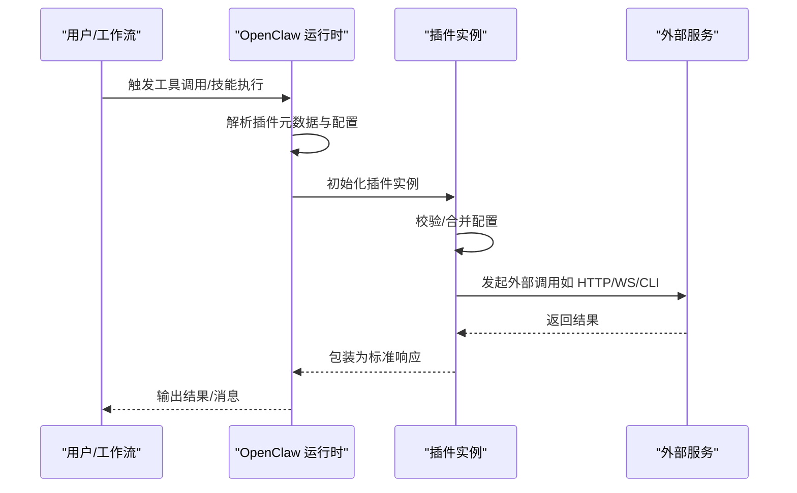
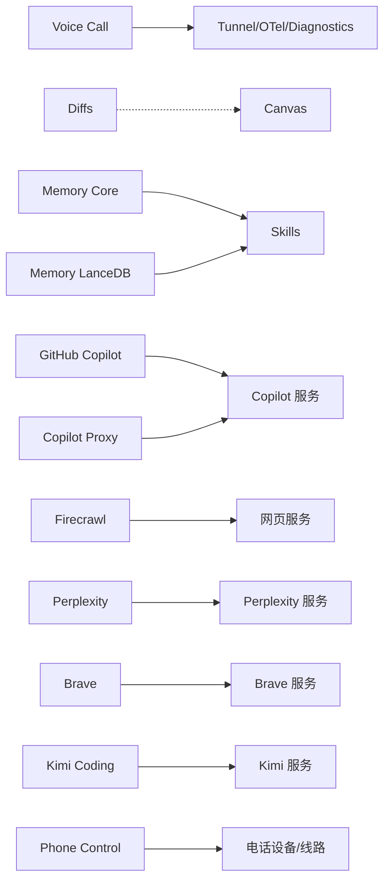

# 工具插件

<cite>
**本文引用的文件**
- [extensions/acpx/openclaw.plugin.json](file://extensions/acpx/openclaw.plugin.json)
- [extensions/voice-call/openclaw.plugin.json](file://extensions/voice-call/openclaw.plugin.json)
- [extensions/device-pair/openclaw.plugin.json](file://extensions/device-pair/openclaw.plugin.json)
- [extensions/thread-ownership/openclaw.plugin.json](file://extensions/thread-ownership/openclaw.plugin.json)
- [extensions/diagnostics-otel/openclaw.plugin.json](file://extensions/diagnostics-otel/openclaw.plugin.json)
- [extensions/diffs/openclaw.plugin.json](file://extensions/diffs/openclaw.plugin.json)
- [extensions/lobster/openclaw.plugin.json](file://extensions/lobster/openclaw.plugin.json)
- [extensions/open-prose/openclaw.plugin.json](file://extensions/open-prose/openclaw.plugin.json)
- [extensions/llm-task/openclaw.plugin.json](file://extensions/llm-task/openclaw.plugin.json)
- [extensions/openshell/openclaw.plugin.json](file://extensions/openshell/openclaw.plugin.json)
- [extensions/github-copilot/index.ts](file://extensions/github-copilot/index.ts)
- [extensions/copilot-proxy/index.ts](file://extensions/copilot-proxy/index.ts)
- [extensions/firecrawl/index.ts](file://extensions/firecrawl/index.ts)
- [extensions/perplexity/index.ts](file://extensions/perplexity/index.ts)
- [extensions/brave/index.ts](file://extensions/brave/index.ts)
- [extensions/kimi-coding/index.ts](file://extensions/kimi-coding/index.ts)
- [extensions/phone-control/index.ts](file://extensions/phone-control/index.ts)
- [extensions/memory-core/index.ts](file://extensions/memory-core/index.ts)
- [extensions/memory-lancedb/index.ts](file://extensions/memory-lancedb/index.ts)
- [extensions/canvas/src/index.ts](file://extensions/canvas/src/index.ts)
- [extensions/browser/index.ts](file://extensions/browser/index.ts)
- [extensions/cron/index.ts](file://extensions/cron/index.ts)
- [extensions/skills/index.ts](file://extensions/skills/index.ts)
- [extensions/talk-voice/openclaw.plugin.json](file://extensions/talk-voice/openclaw.plugin.json)
</cite>

## 目录
1. [简介](#简介)
2. [项目结构](#项目结构)
3. [核心组件](#核心组件)
4. [架构总览](#架构总览)
5. [详细组件分析](#详细组件分析)
6. [依赖分析](#依赖分析)
7. [性能考虑](#性能考虑)
8. [故障排除指南](#故障排除指南)
9. [结论](#结论)
10. [附录](#附录)

## 简介
本文件系统性梳理 OpenClaw 的“工具插件”体系，覆盖浏览器控制、Canvas 渲染、定时任务、技能系统、内存管理、语音通话、设备配对、线程所有权、诊断监控、代码差异、ACPRouter、Lobster、OpenProse、LLM Task、OpenShell、GitHub Copilot、Copilot Proxy、Firecrawl、Perplexity、Brave、Kimi Coding、Phone Control 等插件。针对每个插件，给出功能特性、使用场景、配置项与集成方式，并提供使用示例、最佳实践与故障排除建议。

## 项目结构
OpenClaw 将工具能力以“插件”形式组织在 extensions 目录下，每个插件通常包含：
- openclaw.plugin.json：插件元数据与配置 Schema、UI 提示
- index.ts 或 src/index.ts：插件实现入口
- skills 子目录：可选的内置技能清单
- 其他资源或脚本：如构建产物、静态资源等

```mermaid
graph TB
subgraph "插件层"
ACPR["ACPX Runtime"]
VC["Voice Call"]
DP["Device Pair"]
TO["Thread Ownership"]
DO["Diagnostics OTel"]
DF["Diffs"]
LB["Lobster"]
OP["OpenProse"]
LT["LLM Task"]
OS["OpenShell"]
GC["GitHub Copilot"]
CP["Copilot Proxy"]
FR["Firecrawl"]
PP["Perplexity"]
BR["Brave"]
KC["Kimi Coding"]
PC["Phone Control"]
MC["Memory Core"]
ML["Memory LanceDB"]
CV["Canvas"]
BW["Browser"]
CR["Cron"]
SK["Skills"]
end
subgraph "运行时"
RT["OpenClaw 运行时"]
end
RT --> ACPR
RT --> VC
RT --> DP
RT --> TO
RT --> DO
RT --> DF
RT --> LB
RT --> OP
RT --> LT
RT --> OS
RT --> GC
RT --> CP
RT --> FR
RT --> PP
RT --> BR
RT --> KC
RT --> PC
RT --> MC
RT --> ML
RT --> CV
RT --> BW
RT --> CR
RT --> SK
```

图示来源
- [extensions/acpx/openclaw.plugin.json:1-106](file://extensions/acpx/openclaw.plugin.json#L1-L106)
- [extensions/voice-call/openclaw.plugin.json:1-612](file://extensions/voice-call/openclaw.plugin.json#L1-L612)
- [extensions/device-pair/openclaw.plugin.json:1-21](file://extensions/device-pair/openclaw.plugin.json#L1-L21)
- [extensions/thread-ownership/openclaw.plugin.json:1-29](file://extensions/thread-ownership/openclaw.plugin.json#L1-L29)
- [extensions/diagnostics-otel/openclaw.plugin.json:1-9](file://extensions/diagnostics-otel/openclaw.plugin.json#L1-L9)
- [extensions/diffs/openclaw.plugin.json:1-183](file://extensions/diffs/openclaw.plugin.json#L1-L183)
- [extensions/lobster/openclaw.plugin.json:1-11](file://extensions/lobster/openclaw.plugin.json#L1-L11)
- [extensions/open-prose/openclaw.plugin.json:1-12](file://extensions/open-prose/openclaw.plugin.json#L1-L12)
- [extensions/llm-task/openclaw.plugin.json:1-22](file://extensions/llm-task/openclaw.plugin.json#L1-L22)
- [extensions/openshell/openclaw.plugin.json:1-100](file://extensions/openshell/openclaw.plugin.json#L1-L100)
- [extensions/github-copilot/index.ts](file://extensions/github-copilot/index.ts)
- [extensions/copilot-proxy/index.ts](file://extensions/copilot-proxy/index.ts)
- [extensions/firecrawl/index.ts](file://extensions/firecrawl/index.ts)
- [extensions/perplexity/index.ts](file://extensions/perplexity/index.ts)
- [extensions/brave/index.ts](file://extensions/brave/index.ts)
- [extensions/kimi-coding/index.ts](file://extensions/kimi-coding/index.ts)
- [extensions/phone-control/index.ts](file://extensions/phone-control/index.ts)
- [extensions/memory-core/index.ts](file://extensions/memory-core/index.ts)
- [extensions/memory-lancedb/index.ts](file://extensions/memory-lancedb/index.ts)
- [extensions/canvas/src/index.ts](file://extensions/canvas/src/index.ts)
- [extensions/browser/index.ts](file://extensions/browser/index.ts)
- [extensions/cron/index.ts](file://extensions/cron/index.ts)
- [extensions/skills/index.ts](file://extensions/skills/index.ts)
- [extensions/talk-voice/openclaw.plugin.json:1-11](file://extensions/talk-voice/openclaw.plugin.json#L1-L11)

章节来源
- [extensions/acpx/openclaw.plugin.json:1-106](file://extensions/acpx/openclaw.plugin.json#L1-L106)
- [extensions/voice-call/openclaw.plugin.json:1-612](file://extensions/voice-call/openclaw.plugin.json#L1-L612)
- [extensions/device-pair/openclaw.plugin.json:1-21](file://extensions/device-pair/openclaw.plugin.json#L1-L21)
- [extensions/thread-ownership/openclaw.plugin.json:1-29](file://extensions/thread-ownership/openclaw.plugin.json#L1-L29)
- [extensions/diagnostics-otel/openclaw.plugin.json:1-9](file://extensions/diagnostics-otel/openclaw.plugin.json#L1-L9)
- [extensions/diffs/openclaw.plugin.json:1-183](file://extensions/diffs/openclaw.plugin.json#L1-L183)
- [extensions/lobster/openclaw.plugin.json:1-11](file://extensions/lobster/openclaw.plugin.json#L1-L11)
- [extensions/open-prose/openclaw.plugin.json:1-12](file://extensions/open-prose/openclaw.plugin.json#L1-L12)
- [extensions/llm-task/openclaw.plugin.json:1-22](file://extensions/llm-task/openclaw.plugin.json#L1-L22)
- [extensions/openshell/openclaw.plugin.json:1-100](file://extensions/openshell/openclaw.plugin.json#L1-L100)
- [extensions/github-copilot/index.ts](file://extensions/github-copilot/index.ts)
- [extensions/copilot-proxy/index.ts](file://extensions/copilot-proxy/index.ts)
- [extensions/firecrawl/index.ts](file://extensions/firecrawl/index.ts)
- [extensions/perplexity/index.ts](file://extensions/perplexity/index.ts)
- [extensions/brave/index.ts](file://extensions/brave/index.ts)
- [extensions/kimi-coding/index.ts](file://extensions/kimi-coding/index.ts)
- [extensions/phone-control/index.ts](file://extensions/phone-control/index.ts)
- [extensions/memory-core/index.ts](file://extensions/memory-core/index.ts)
- [extensions/memory-lancedb/index.ts](file://extensions/memory-lancedb/index.ts)
- [extensions/canvas/src/index.ts](file://extensions/canvas/src/index.ts)
- [extensions/browser/index.ts](file://extensions/browser/index.ts)
- [extensions/cron/index.ts](file://extensions/cron/index.ts)
- [extensions/skills/index.ts](file://extensions/skills/index.ts)
- [extensions/talk-voice/openclaw.plugin.json:1-11](file://extensions/talk-voice/openclaw.plugin.json#L1-L11)

## 核心组件
- ACPX Runtime：提供 ACP 后端运行时，支持命令路径、版本策略、权限模式、非交互权限策略、超时、队列拥有者 TTL、MCP 服务器注入等配置。
- Voice Call：提供电话呼入呼出能力，支持 Twilio、Telnyx、Plivo、Mock 等提供商；支持入站策略、白名单、问候语、公网 URL、隧道、流式实时语音、STT/TTS 配置、并发限制、超时参数等。
- Device Pair：生成配对码与批准设备配对请求，支持公共 URL 配置。
- Thread Ownership：防止多代理在 Slack 线程中重复回复，通过 HTTP 调用 slack-forwarder 所有权 API 实现。
- Diagnostics OTel：启用诊断遥测（OTel）能力。
- Diffs：只读差异查看器与文件渲染器，支持字体、字号、行距、布局、主题、换行、行号、指示样式、背景高亮、文件格式（PNG/PDF）、质量、缩放、最大宽度、输出模式、远程访问安全等。
- Lobster：带类型化工作流与可恢复审批的工具。
- OpenProse：OpenProse VM 技能包与 /prose 命令。
- LLM Task：面向工作流的结构化任务 JSON 工具，支持默认提供商/模型、鉴权配置、模型白名单、最大令牌数、超时等。
- OpenShell：基于 OpenShell 的沙箱后端，支持镜像本地工作区、SSH 命令执行、网关、策略、GPU、自动提供者、远端工作区目录、超时等。
- GitHub Copilot、Copilot Proxy、Firecrawl、Perplexity、Brave、Kimi Coding、Phone Control：第三方/外部能力插件，分别对接 Copilot、搜索/爬取、Perplexity、Brave、Kimi Coding、电话控制等。

章节来源
- [extensions/acpx/openclaw.plugin.json:1-106](file://extensions/acpx/openclaw.plugin.json#L1-L106)
- [extensions/voice-call/openclaw.plugin.json:1-612](file://extensions/voice-call/openclaw.plugin.json#L1-L612)
- [extensions/device-pair/openclaw.plugin.json:1-21](file://extensions/device-pair/openclaw.plugin.json#L1-L21)
- [extensions/thread-ownership/openclaw.plugin.json:1-29](file://extensions/thread-ownership/openclaw.plugin.json#L1-L29)
- [extensions/diagnostics-otel/openclaw.plugin.json:1-9](file://extensions/diagnostics-otel/openclaw.plugin.json#L1-L9)
- [extensions/diffs/openclaw.plugin.json:1-183](file://extensions/diffs/openclaw.plugin.json#L1-L183)
- [extensions/lobster/openclaw.plugin.json:1-11](file://extensions/lobster/openclaw.plugin.json#L1-L11)
- [extensions/open-prose/openclaw.plugin.json:1-12](file://extensions/open-prose/openclaw.plugin.json#L1-L12)
- [extensions/llm-task/openclaw.plugin.json:1-22](file://extensions/llm-task/openclaw.plugin.json#L1-L22)
- [extensions/openshell/openclaw.plugin.json:1-100](file://extensions/openshell/openclaw.plugin.json#L1-L100)
- [extensions/github-copilot/index.ts](file://extensions/github-copilot/index.ts)
- [extensions/copilot-proxy/index.ts](file://extensions/copilot-proxy/index.ts)
- [extensions/firecrawl/index.ts](file://extensions/firecrawl/index.ts)
- [extensions/perplexity/index.ts](file://extensions/perplexity/index.ts)
- [extensions/brave/index.ts](file://extensions/brave/index.ts)
- [extensions/kimi-coding/index.ts](file://extensions/kimi-coding/index.ts)
- [extensions/phone-control/index.ts](file://extensions/phone-control/index.ts)

## 架构总览
工具插件通过统一的插件元数据与配置 Schema 与运行时集成，形成“声明式配置 + 可编程实现”的能力组合。典型流程：
- 运行时加载插件元数据（openclaw.plugin.json）
- 根据配置 Schema 校验用户配置
- 初始化插件实现（index.ts 或 src/index.ts）
- 在会话/工作流中调用插件工具或技能

图示来源
- [extensions/voice-call/openclaw.plugin.json:162-610](file://extensions/voice-call/openclaw.plugin.json#L162-L610)
- [extensions/openshell/openclaw.plugin.json:5-47](file://extensions/openshell/openclaw.plugin.json#L5-L47)
- [extensions/diffs/openclaw.plugin.json:68-181](file://extensions/diffs/openclaw.plugin.json#L68-L181)

## 详细组件分析

### 浏览器控制插件（Browser）
- 功能特性
  - 提供浏览器自动化能力，支持登录、页面操作、截图、PDF 导出等。
  - 支持 Linux 环境下的特定问题排查与配置。
- 使用场景
  - 自动化网页登录、数据抓取、表单填写、报告导出。
- 集成方式
  - 通过 openclaw.plugin.json 中的配置项进行初始化与参数传递。
- 配置选项
  - 登录相关参数、CDP 连接、超时、窗口尺寸、无头模式等（具体键位参考插件元数据与实现）。
- 使用示例
  - 在工作流中调用浏览器工具，传入目标 URL、凭据与操作序列。
- 最佳实践
  - 明确超时与重试策略；在 Linux 环境下注意驱动与依赖安装。
- 故障排除
  - 参考浏览器相关故障排查文档与 CDP 连接问题定位。

章节来源
- [extensions/browser/index.ts](file://extensions/browser/index.ts)
- [docs/tools/browser-linux-troubleshooting.md](file://docs/tools/browser-linux-troubleshooting.md)
- [docs/tools/browser-login.md](file://docs/tools/browser-login.md)
- [docs/tools/browser-wsl2-windows-remote-cdp-troubleshooting.md](file://docs/tools/browser-wsl2-windows-remote-cdp-troubleshooting.md)

### Canvas 渲染插件（Canvas）
- 功能特性
  - 提供 Canvas 渲染与图像处理能力，支持多种输出格式与质量设置。
- 使用场景
  - 将内容渲染为图片或 PDF，用于分享、归档或嵌入消息。
- 集成方式
  - 通过插件实现入口加载渲染引擎。
- 配置选项
  - 输出格式、质量、缩放、最大宽度、主题、布局等（具体键位参考插件实现）。
- 使用示例
  - 在工作流中调用 Canvas 工具，传入内容与渲染参数。
- 最佳实践
  - 控制输出尺寸与质量平衡渲染速度与清晰度。
- 故障排除
  - 检查渲染环境依赖与内存占用。

章节来源
- [extensions/canvas/src/index.ts](file://extensions/canvas/src/index.ts)

### 定时任务插件（Cron）
- 功能特性
  - 提供周期性任务调度能力，支持 Cron 表达式与心跳机制。
- 使用场景
  - 定时健康检查、数据同步、清理任务、周期性通知。
- 集成方式
  - 通过 openclaw.plugin.json 中的配置项注册与执行。
- 配置选项
  - 任务表达式、执行上下文、超时、并发策略等（具体键位参考插件实现）。
- 使用示例
  - 在配置中定义多个 Cron 任务，按计划触发。
- 最佳实践
  - 合理设置任务间隔与超时，避免资源争用。
- 故障排除
  - 参考自动化与 Cron 相关故障排查文档。

章节来源
- [extensions/cron/index.ts](file://extensions/cron/index.ts)
- [docs/automation/cron-jobs.md](file://docs/automation/cron-jobs.md)
- [docs/automation/cron-vs-heartbeat.md](file://docs/automation/cron-vs-heartbeat.md)

### 技能系统插件（Skills）
- 功能特性
  - 提供技能（Skill）能力，支持技能清单与执行。
- 使用场景
  - 将常用工具封装为可复用技能，简化调用。
- 集成方式
  - 通过 openclaw.plugin.json 中的 skills 字段声明技能目录。
- 配置选项
  - 技能清单、执行上下文、权限等（具体键位参考插件实现）。
- 使用示例
  - 在工作流中调用指定技能，传入参数。
- 最佳实践
  - 将复杂流程拆分为原子技能，便于组合与复用。
- 故障排除
  - 检查技能清单与依赖。

章节来源
- [extensions/skills/index.ts](file://extensions/skills/index.ts)

### 内存管理插件（Memory）
- Memory Core
  - 提供基础内存检索与存储能力。
- Memory LanceDB
  - 基于 LanceDB 的向量/结构化内存存储，支持配置化索引与查询。
- 使用场景
  - 长期记忆、上下文检索、向量相似度匹配。
- 集成方式
  - 通过 openclaw.plugin.json 中的配置项启用与参数传递。
- 配置选项
  - 数据库路径、索引参数、查询阈值、批量写入等（具体键位参考插件实现）。
- 使用示例
  - 在工作流中调用内存工具，进行检索或写入。
- 最佳实践
  - 合理设置索引与查询参数，平衡性能与准确性。
- 故障排除
  - 检查数据库连接与磁盘空间。

章节来源
- [extensions/memory-core/index.ts](file://extensions/memory-core/index.ts)
- [extensions/memory-lancedb/index.ts](file://extensions/memory-lancedb/index.ts)

### 语音通话插件（Voice Call）
- 功能特性
  - 支持呼入呼出、入站策略（禁用/白名单/配对/开放）、问候语、公网 URL、隧道（ngrok/Tailscale）、流式实时语音（STT/TTS）、并发限制、超时参数、TTS 提供商（OpenAI/ElevenLabs/Edge）、STT 提供商（OpenAI）等。
- 使用场景
  - 自动化电话外呼、语音交互、实时转写与合成为一体的通话体验。
- 集成方式
  - 通过 openclaw.plugin.json 中的配置项进行初始化。
- 配置选项
  - 提供商选择、号码、入站策略、允许号码列表、公网 URL、隧道配置、流式参数、TTS/STT 配置、并发与超时等。
- 使用示例
  - 配置 Twilio/Telnyx 凭证，设置默认呼出模式与问候语，启动公网 webhook。
- 最佳实践
  - 合理设置并发与超时，确保流式传输稳定性；在开发环境使用 Mock。
- 故障排除
  - 校验签名验证、公网可达性、隧道配置、STT/TTS 认证与模型。

章节来源
- [extensions/voice-call/openclaw.plugin.json:1-612](file://extensions/voice-call/openclaw.plugin.json#L1-L612)

### 设备配对插件（Device Pair）
- 功能特性
  - 生成配对码与批准设备配对请求，支持公共 URL。
- 使用场景
  - 新设备首次接入时的安全配对。
- 集成方式
  - 通过 openclaw.plugin.json 中的配置项启用。
- 配置选项
  - publicUrl：用于配对码的 WebSocket/HTTP(S) 地址。
- 使用示例
  - 在网关上配置公共 URL，引导新设备完成配对。
- 最佳实践
  - 使用 wss/ws 或 https/http，确保安全性与可达性。
- 故障排除
  - 检查网络连通性与证书有效性。

章节来源
- [extensions/device-pair/openclaw.plugin.json:1-21](file://extensions/device-pair/openclaw.plugin.json#L1-L21)

### 线程所有权插件（Thread Ownership）
- 功能特性
  - 防止多代理在 Slack 线程中重复回复，通过 HTTP 调用 slack-forwarder 所有权 API。
- 使用场景
  - 多代理协作场景下的线程一致性控制。
- 集成方式
  - 通过 openclaw.plugin.json 中的配置项启用。
- 配置选项
  - forwarderUrl：所有权 API 基础地址；abTestChannels：强制线程所有权的频道 ID 列表。
- 使用示例
  - 在多代理频道中启用该插件，确保同一时间只有一个代理回复。
- 最佳实践
  - 将测试频道加入 abTestChannels 以验证行为。
- 故障排除
  - 检查 forwarderUrl 可达性与权限。

章节来源
- [extensions/thread-ownership/openclaw.plugin.json:1-29](file://extensions/thread-ownership/openclaw.plugin.json#L1-L29)

### 诊断监控插件（Diagnostics OTel）
- 功能特性
  - 启用诊断遥测（OTel），采集指标与链路追踪。
- 使用场景
  - 运行时性能观测、问题定位与容量规划。
- 集成方式
  - 通过 openclaw.plugin.json 中的配置项启用。
- 配置选项
  - 插件本身不暴露额外配置项，需结合运行时 OTel 配置。
- 使用示例
  - 在运行时开启 OTel，加载该插件以增强可观测性。
- 最佳实践
  - 结合采样率与导出器配置，平衡开销与价值。
- 故障排除
  - 检查导出器可达性与认证。

章节来源
- [extensions/diagnostics-otel/openclaw.plugin.json:1-9](file://extensions/diagnostics-otel/openclaw.plugin.json#L1-L9)

### 代码差异插件（Diffs）
- 功能特性
  - 只读差异查看器与文件渲染器，支持字体、字号、行距、布局、主题、换行、行号、指示样式、背景高亮、文件格式（PNG/PDF）、质量、缩放、最大宽度、输出模式、远程访问安全等。
- 使用场景
  - 展示代码变更、渲染文件差异为图片/PDF。
- 集成方式
  - 通过 openclaw.plugin.json 中的配置项与 skills 字段启用。
- 配置选项
  - defaults.*：字体、字号、行距、布局、主题、换行、行号、指示样式、背景高亮、文件格式/质量/缩放/最大宽度、输出模式；
  - security.allowRemoteViewer：是否允许非回环访问。
- 使用示例
  - 在工作流中调用 Diffs 工具，传入 diff 内容与渲染参数。
- 最佳实践
  - 默认启用背景高亮与行号，合理设置缩放与最大宽度。
- 故障排除
  - 检查远程访问安全与渲染依赖。

章节来源
- [extensions/diffs/openclaw.plugin.json:1-183](file://extensions/diffs/openclaw.plugin.json#L1-L183)

### ACPRouter 插件（ACPX）
- 功能特性
  - ACP 运行时后端，支持命令路径、版本策略、工作目录、权限模式、非交互权限策略、超时、队列拥有者 TTL、MCP 服务器注入等。
- 使用场景
  - 通过 ACPX 执行受控命令与工作流，适配不同平台与安全策略。
- 集成方式
  - 通过 openclaw.plugin.json 中的配置项启用。
- 配置选项
  - command、expectedVersion、cwd、permissionMode、nonInteractivePermissions、strictWindowsCmdWrapper、timeoutSeconds、queueOwnerTtlSeconds、mcpServers 等。
- 使用示例
  - 指定 acpx 命令路径与版本，配置 MCP 服务器，设置权限模式。
- 最佳实践
  - 在 OpenClaw 中保持 queueOwnerTtlSeconds 较短，避免延迟完成。
- 故障排除
  - 校验命令路径、版本匹配与权限策略。

章节来源
- [extensions/acpx/openclaw.plugin.json:1-106](file://extensions/acpx/openclaw.plugin.json#L1-L106)

### Lobster 插件
- 功能特性
  - 带类型化工作流与可恢复审批的工具。
- 使用场景
  - 需要强类型约束与审批恢复的工作流编排。
- 集成方式
  - 通过 openclaw.plugin.json 中的配置项启用。
- 配置选项
  - 插件本身不暴露额外配置项。
- 使用示例
  - 在工作流中使用 Lobster 工具，传入类型化输入与审批参数。
- 最佳实践
  - 明确审批流程与恢复点，确保可审计性。
- 故障排除
  - 检查类型约束与审批状态。

章节来源
- [extensions/lobster/openclaw.plugin.json:1-11](file://extensions/lobster/openclaw.plugin.json#L1-L11)

### OpenProse 插件
- 功能特性
  - OpenProse VM 技能包与 /prose slash 命令。
- 使用场景
  - 文本生成、编辑与 VM 驱动的技能执行。
- 集成方式
  - 通过 openclaw.plugin.json 中的 skills 字段启用。
- 配置选项
  - 插件本身不暴露额外配置项。
- 使用示例
  - 在聊天中使用 /prose 命令，传入提示词与参数。
- 最佳实践
  - 合理设计提示词与上下文，提升生成质量。
- 故障排除
  - 检查 VM 可用性与模型配置。

章节来源
- [extensions/open-prose/openclaw.plugin.json:1-12](file://extensions/open-prose/openclaw.plugin.json#L1-L12)

### LLM Task 插件
- 功能特性
  - 面向工作流的结构化任务 JSON 工具，支持默认提供商/模型、鉴权配置、模型白名单、最大令牌数、超时等。
- 使用场景
  - 将复杂任务分解为结构化 JSON，由 LLM 生成或校验。
- 集成方式
  - 通过 openclaw.plugin.json 中的配置项启用。
- 配置选项
  - defaultProvider、defaultModel、defaultAuthProfileId、allowedModels、maxTokens、timeoutMs。
- 使用示例
  - 在工作流中调用 LLM Task 工具，传入任务描述与约束。
- 最佳实践
  - 严格限制 allowedModels，确保合规与成本可控。
- 故障排除
  - 校验鉴权配置与模型可用性。

章节来源
- [extensions/llm-task/openclaw.plugin.json:1-22](file://extensions/llm-task/openclaw.plugin.json#L1-L22)

### OpenShell 插件
- 功能特性
  - 基于 OpenShell 的沙箱后端，支持镜像本地工作区、SSH 命令执行、网关、策略、GPU、自动提供者、远端工作区目录、超时等。
- 使用场景
  - 在隔离环境中执行命令与脚本，保障安全与可追溯。
- 集成方式
  - 通过 openclaw.plugin.json 中的配置项启用。
- 配置选项
  - command、gateway、gatewayEndpoint、from、policy、providers、gpu、autoProviders、remoteWorkspaceDir、remoteAgentWorkspaceDir、timeoutSeconds。
- 使用示例
  - 创建沙箱并挂载本地工作区，执行受限命令。
- 最佳实践
  - 启用 autoProviders 并合理设置超时，避免资源泄漏。
- 敵障排除
  - 检查网关连通性与策略文件。

章节来源
- [extensions/openshell/openclaw.plugin.json:1-100](file://extensions/openshell/openclaw.plugin.json#L1-L100)

### GitHub Copilot 插件
- 功能特性
  - 对接 GitHub Copilot，提供代码补全与建议。
- 使用场景
  - 编程辅助、代码生成与重构建议。
- 集成方式
  - 通过插件实现入口加载 Copilot 客户端。
- 配置选项
  - 认证与模型配置（具体键位参考插件实现）。
- 使用示例
  - 在编辑器或工作流中触发 Copilot 建议。
- 最佳实践
  - 合理设置模型与上下文，提升建议质量。
- 故障排除
  - 校验认证与网络连通性。

章节来源
- [extensions/github-copilot/index.ts](file://extensions/github-copilot/index.ts)

### Copilot Proxy 插件
- 功能特性
  - 提供 Copilot 代理能力，便于内网或受限环境访问。
- 使用场景
  - 企业内网代理、合规访问控制。
- 集成方式
  - 通过插件实现入口加载代理逻辑。
- 配置选项
  - 代理端点、认证与转发规则（具体键位参考插件实现）。
- 使用示例
  - 在受限网络中通过代理访问 Copilot。
- 最佳实践
  - 明确代理链路与安全策略。
- 故障排除
  - 校验代理连通性与认证。

章节来源
- [extensions/copilot-proxy/index.ts](file://extensions/copilot-proxy/index.ts)

### Firecrawl 插件
- 功能特性
  - 提供网页抓取与内容提取能力。
- 使用场景
  - 从网页提取结构化数据、摘要与全文。
- 集成方式
  - 通过插件实现入口加载抓取逻辑。
- 配置选项
  - 抓取策略、深度、过滤规则（具体键位参考插件实现）。
- 使用示例
  - 在工作流中调用 Firecrawl，传入 URL 与参数。
- 最佳实践
  - 控制抓取深度与频率，尊重 robots.txt。
- 故障排除
  - 校验目标站点可访问性与反爬策略。

章节来源
- [extensions/firecrawl/index.ts](file://extensions/firecrawl/index.ts)

### Perplexity 插件
- 功能特性
  - 对接 Perplexity 搜索，提供高质量问答与检索。
- 使用场景
  - 快速检索知识、生成摘要与答案。
- 集成方式
  - 通过插件实现入口加载 Perplexity 客户端。
- 配置选项
  - 认证与模型配置（具体键位参考插件实现）。
- 使用示例
  - 在工作流中发起 Perplexity 查询。
- 最佳实践
  - 合理设置查询粒度与上下文。
- 故障排除
  - 校验认证与网络连通性。

章节来源
- [extensions/perplexity/index.ts](file://extensions/perplexity/index.ts)

### Brave 插件
- 功能特性
  - 对接 Brave 搜索，提供隐私友好的搜索体验。
- 使用场景
  - 隐私优先的搜索与信息检索。
- 集成方式
  - 通过插件实现入口加载 Brave 搜索客户端。
- 配置选项
  - 认证与模型配置（具体键位参考插件实现）。
- 使用示例
  - 在工作流中发起 Brave 搜索。
- 最佳实践
  - 关注隐私设置与结果质量。
- 故障排除
  - 校验认证与网络连通性。

章节来源
- [extensions/brave/index.ts](file://extensions/brave/index.ts)

### Kimi Coding 插件
- 功能特性
  - 对接 Kimi Coding，提供代码理解与生成能力。
- 使用场景
  - 代码阅读、生成与优化建议。
- 集成方式
  - 通过插件实现入口加载 Kimi Coding 客户端。
- 配置选项
  - 认证与模型配置（具体键位参考插件实现）。
- 使用示例
  - 在工作流中触发 Kimi Coding 分析。
- 最佳实践
  - 明确上下文范围，提升生成质量。
- 故障排除
  - 校验认证与网络连通性。

章节来源
- [extensions/kimi-coding/index.ts](file://extensions/kimi-coding/index.ts)

### Phone Control 插件
- 功能特性
  - 提供电话控制能力，支持拨号、挂断、状态查询等。
- 使用场景
  - 自动化电话控制与状态监控。
- 集成方式
  - 通过插件实现入口加载电话控制逻辑。
- 配置选项
  - 设备/线路配置、超时与重试策略（具体键位参考插件实现）。
- 使用示例
  - 在工作流中调用电话控制工具。
- 最佳实践
  - 明确权限与安全策略。
- 故障排除
  - 校验设备连通性与权限。

章节来源
- [extensions/phone-control/index.ts](file://extensions/phone-control/index.ts)

### 语音通话子插件（Talk Voice）
- 功能特性
  - 管理 Talk 语音选择（列出/设置）。
- 使用场景
  - 在通话场景中切换或选择语音。
- 集成方式
  - 通过 openclaw.plugin.json 中的配置项启用。
- 配置选项
  - 插件本身不暴露额外配置项。
- 使用示例
  - 在通话前选择合适的语音。
- 最佳实践
  - 与主 Voice Call 插件配合使用。
- 故障排除
  - 检查语音可用性与设备权限。

章节来源
- [extensions/talk-voice/openclaw.plugin.json:1-11](file://extensions/talk-voice/openclaw.plugin.json#L1-L11)

## 依赖分析
- 插件间耦合
  - Voice Call 与 Tunnel/OTel/Diagnostics 存在运行时依赖关系。
  - Diffs 与 Canvas 在渲染能力上互补。
  - Memory Core/LanceDB 与 Skills 在检索与技能执行上协同。
- 外部依赖
  - 第三方服务（Twilio/Telnyx/Plivo、Copilot、Perplexity、Brave、Kimi Coding、Firecrawl 等）。
- 循环依赖
  - 插件之间无直接循环依赖，通过运行时调度避免。
- 接口契约
  - 统一通过 openclaw.plugin.json 的 configSchema 与实现入口进行契约定义。

图示来源
- [extensions/voice-call/openclaw.plugin.json:301-340](file://extensions/voice-call/openclaw.plugin.json#L301-L340)
- [extensions/diffs/openclaw.plugin.json:68-181](file://extensions/diffs/openclaw.plugin.json#L68-L181)
- [extensions/memory-core/index.ts](file://extensions/memory-core/index.ts)
- [extensions/memory-lancedb/index.ts](file://extensions/memory-lancedb/index.ts)
- [extensions/github-copilot/index.ts](file://extensions/github-copilot/index.ts)
- [extensions/copilot-proxy/index.ts](file://extensions/copilot-proxy/index.ts)
- [extensions/firecrawl/index.ts](file://extensions/firecrawl/index.ts)
- [extensions/perplexity/index.ts](file://extensions/perplexity/index.ts)
- [extensions/brave/index.ts](file://extensions/brave/index.ts)
- [extensions/kimi-coding/index.ts](file://extensions/kimi-coding/index.ts)
- [extensions/phone-control/index.ts](file://extensions/phone-control/index.ts)

## 性能考虑
- 合理设置超时与并发，避免阻塞与资源耗尽。
- 在渲染与抓取场景中控制输出质量与数据规模。
- 使用缓存与增量更新减少重复计算与网络请求。
- 在语音与流式传输场景中优化网络与带宽。

## 故障排除指南
- 配置校验失败
  - 检查 openclaw.plugin.json 中的 configSchema 是否与实际配置一致。
- 外部服务不可达
  - 校验网络连通性、认证凭据与服务状态。
- 权限不足
  - 检查权限模式、白名单与安全策略。
- 超时与资源泄漏
  - 调整超时参数与资源上限，确保正确释放。
- 语音与流式传输异常
  - 校验公网 URL、隧道配置、STT/TTS 认证与模型。

章节来源
- [extensions/voice-call/openclaw.plugin.json:162-610](file://extensions/voice-call/openclaw.plugin.json#L162-L610)
- [extensions/openshell/openclaw.plugin.json:5-47](file://extensions/openshell/openclaw.plugin.json#L5-L47)
- [extensions/diffs/openclaw.plugin.json:68-181](file://extensions/diffs/openclaw.plugin.json#L68-L181)

## 结论
OpenClaw 的工具插件体系以“声明式配置 + 可编程实现”为核心，覆盖浏览器、渲染、定时、技能、内存、语音、配对、线程所有权、诊断、差异、ACPRouter、Lobster、OpenProse、LLM Task、OpenShell、第三方搜索/代码/通话等广泛场景。通过规范的插件元数据与配置 Schema，用户可以快速集成与定制所需能力，并在生产环境中稳定运行。

## 附录
- 插件清单与用途概览
  - Browser：浏览器自动化
  - Canvas：渲染与图像处理
  - Cron：定时任务
  - Skills：技能系统
  - Memory Core/LanceDB：内存检索与存储
  - Voice Call：电话呼入呼出
  - Device Pair：设备配对
  - Thread Ownership：线程所有权
  - Diagnostics OTel：诊断遥测
  - Diffs：差异查看与渲染
  - ACPRouter（ACPX）：ACP 运行时
  - Lobster：类型化工作流
  - OpenProse：VM 技能包
  - LLM Task：结构化任务工具
  - OpenShell：沙箱后端
  - GitHub Copilot/Copilot Proxy：代码补全与代理
  - Firecrawl/Perplexity/Brave/Kimi Coding：搜索/爬取/代码
  - Phone Control：电话控制
  - Talk Voice：语音选择管理