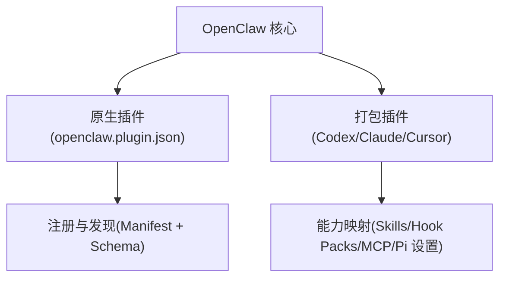
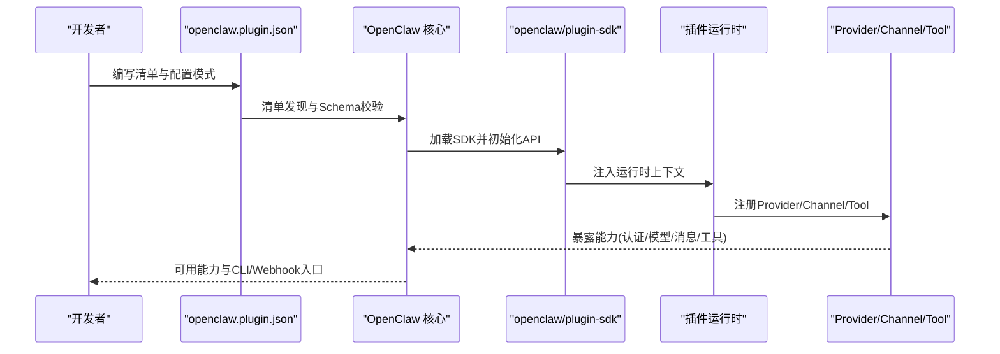
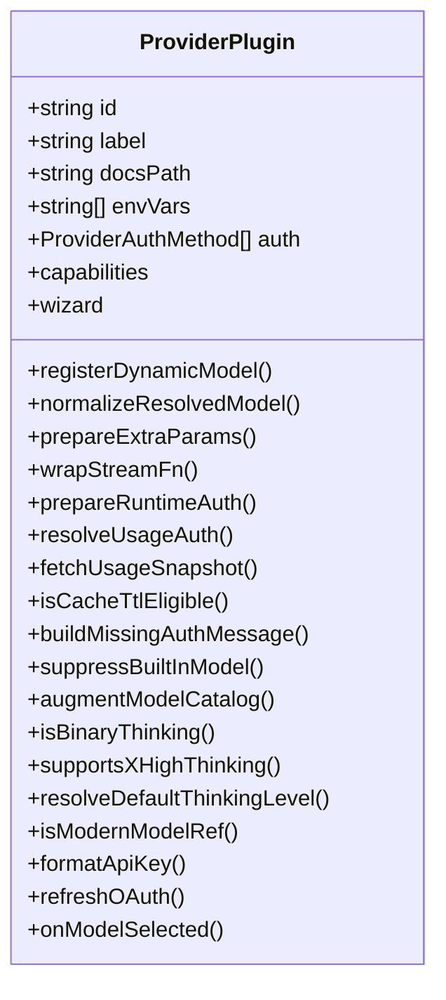
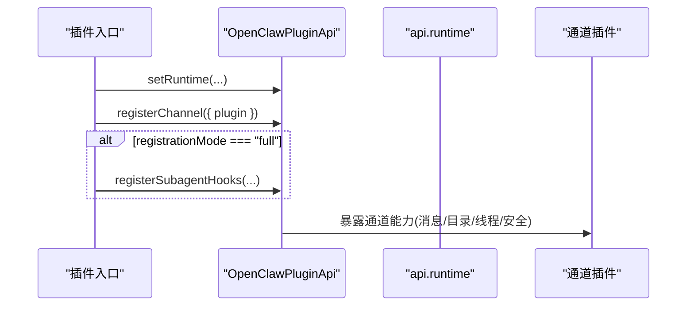
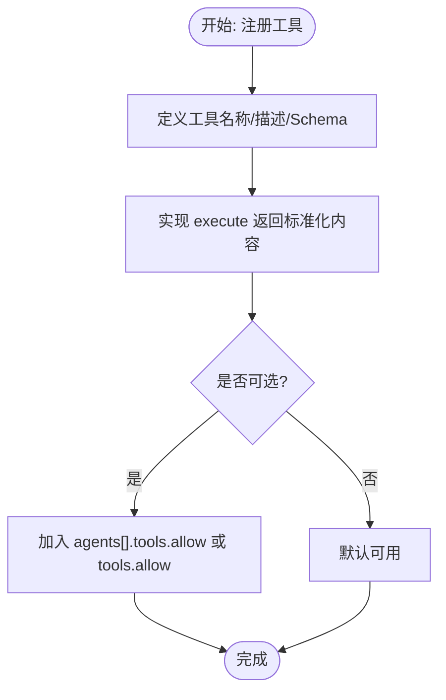
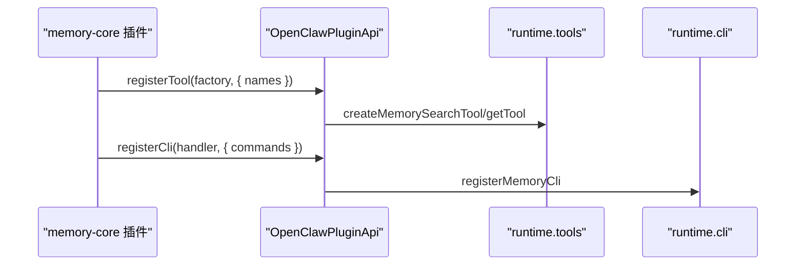
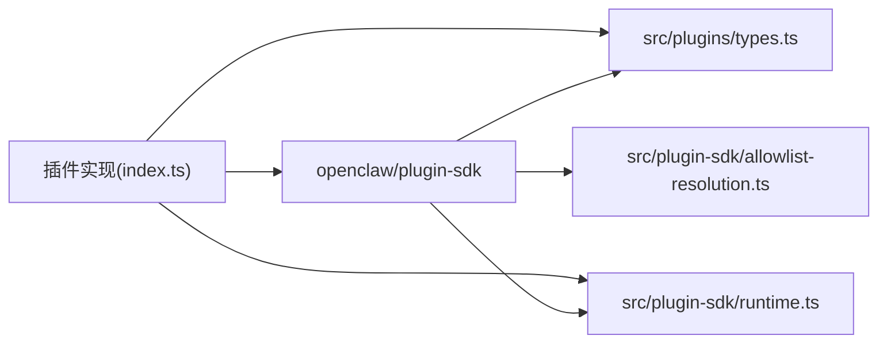

# 插件开发指南

<cite>
**本文引用的文件**
- [docs/plugins/manifest.md](file://docs/plugins/manifest.md)
- [docs/plugins/bundles.md](file://docs/plugins/bundles.md)
- [docs/plugins/agent-tools.md](file://docs/plugins/agent-tools.md)
- [docs/plugins/community.md](file://docs/plugins/community.md)
- [docs/plugins/voice-call.md](file://docs/plugins/voice-call.md)
- [src/plugin-sdk/index.ts](file://src/plugin-sdk/index.ts)
- [src/plugin-sdk/runtime.ts](file://src/plugin-sdk/runtime.ts)
- [src/plugin-sdk/allowlist-resolution.ts](file://src/plugin-sdk/allowlist-resolution.ts)
- [src/plugins/types.ts](file://src/plugins/types.ts)
- [extensions/anthropic/openclaw.plugin.json](file://extensions/anthropic/openclaw.plugin.json)
- [extensions/memory-core/openclaw.plugin.json](file://extensions/memory-core/openclaw.plugin.json)
- [extensions/discord/openclaw.plugin.json](file://extensions/discord/openclaw.plugin.json)
- [extensions/anthropic/index.ts](file://extensions/anthropic/index.ts)
- [extensions/memory-core/index.ts](file://extensions/memory-core/index.ts)
- [extensions/discord/index.ts](file://extensions/discord/index.ts)
- [extensions/feishu/index.ts](file://extensions/feishu/index.ts)
</cite>

## 目录
1. [简介](#简介)
2. [项目结构](#项目结构)
3. [核心组件](#核心组件)
4. [架构总览](#架构总览)
5. [详细组件分析](#详细组件分析)
6. [依赖关系分析](#依赖关系分析)
7. [性能考量](#性能考量)
8. [故障排查指南](#故障排查指南)
9. [结论](#结论)
10. [附录](#附录)

## 简介
本指南面向希望在 OpenClaw 平台上开发与发布的插件开发者，覆盖从架构设计、开发环境到清单配置、SDK 使用、测试与发布全流程。文档同时提供 Provider 插件、Channel 插件、Tool 插件与 Memory 插件的开发范式与参考实现，帮助你快速上手并构建高质量、可维护的插件。

## 项目结构
OpenClaw 的插件体系由“原生插件”和“打包插件（bundle）”两类组成：
- 原生插件：以 openclaw.plugin.json 清单为入口，遵循严格配置校验与发现机制。
- 打包插件：兼容 Codex/Claude/Cursor 生态，通过内容映射进入 OpenClaw 能力面。

图表来源
- [docs/plugins/bundles.md:10-30](file://docs/plugins/bundles.md#L10-L30)
- [docs/plugins/manifest.md:29-34](file://docs/plugins/manifest.md#L29-L34)

章节来源
- [docs/plugins/bundles.md:10-30](file://docs/plugins/bundles.md#L10-L30)
- [docs/plugins/manifest.md:29-34](file://docs/plugins/manifest.md#L29-L34)

## 核心组件
- 插件清单与校验
  - 每个原生插件必须提供 openclaw.plugin.json，包含 id 与 configSchema；可选声明 kind、channels、providers、skills 等。
  - 清单在配置读写阶段进行严格校验，缺失或非法将阻断配置验证。
- SDK 入口与导出
  - openclaw/plugin-sdk 提供统一 API，涵盖通道适配、工具注册、运行时上下文、HTTP/Webhook、鉴权、状态与媒体等能力。
- 插件类型与职责
  - Provider 插件：提供模型供应商能力、认证方法、动态模型解析、用量查询等。
  - Channel 插件：接入消息通道（如 Discord、Feishu），提供消息收发、目录、权限、线程等适配。
  - Tool 插件：注册 Agent 工具函数，支持必选/可选策略与允许列表控制。
  - Memory 插件：提供检索与获取记忆的能力与 CLI。

章节来源
- [docs/plugins/manifest.md:36-100](file://docs/plugins/manifest.md#L36-L100)
- [src/plugin-sdk/index.ts:1-872](file://src/plugin-sdk/index.ts#L1-L872)
- [src/plugins/types.ts:545-738](file://src/plugins/types.ts#L545-L738)

## 架构总览
下图展示插件在 OpenClaw 中的生命周期与交互路径：从清单发现、配置校验、运行时装载，到工具注册、通道适配、Provider 集成与 Webhook 处理。

图表来源
- [docs/plugins/manifest.md:29-34](file://docs/plugins/manifest.md#L29-L34)
- [src/plugin-sdk/index.ts:1-872](file://src/plugin-sdk/index.ts#L1-L872)
- [src/plugins/types.ts:545-738](file://src/plugins/types.ts#L545-L738)

## 详细组件分析

### 插件清单与配置模式
- 必填字段
  - id：插件唯一标识
  - configSchema：内联 JSON Schema，用于配置校验
- 可选字段
  - kind：插件种类（如 memory/context-engine）
  - channels/providers：声明注册的通道/供应商
  - providerAuthEnvVars：供应商凭据环境变量映射
  - skills：技能根目录
  - name/description/uiHints/version：元数据与 UI 提示
- 校验行为
  - 未知 channels.* 或插件 id 将报错
  - 禁用但配置存在时会警告
  - 未满足清单要求将阻止配置生效

章节来源
- [docs/plugins/manifest.md:36-100](file://docs/plugins/manifest.md#L36-L100)

### SDK API 与运行时
- 运行时注入
  - createLoggerBackedRuntime/resolveRuntimeEnv 提供日志与退出语义，便于插件在不同宿主中复用
- 关键能力导出
  - 通道适配：ChannelPlugin、消息/目录/线程/安全等接口
  - 工具注册：registerTool、工具上下文 OpenClawPluginToolContext
  - Webhook/HTTP：registerWebhookTarget/registerPluginRoute、请求守卫与限流
  - 鉴权：ProviderAuthContext/ProviderAuthResult、非交互式凭据解析
  - 状态与媒体：状态快照、媒体负载、文本分片
  - 允许列表：工具/频道/组策略解析与匹配
- 典型使用
  - 在插件入口调用 api.registerXXX(...) 完成能力注册
  - 通过 api.runtime 访问工具、会话、媒体与命令行子系统

章节来源
- [src/plugin-sdk/runtime.ts:1-45](file://src/plugin-sdk/runtime.ts#L1-L45)
- [src/plugin-sdk/index.ts:1-872](file://src/plugin-sdk/index.ts#L1-L872)

### Provider 插件（以 Anthropic 为例）
- 能力要点
  - 提供认证方法（setup-token），支持交互与非交互两种模式
  - 动态模型解析与兼容性处理（前向兼容旧版模型别名）
  - 默认思考级别策略、现代模型识别、缓存 TTL 合规
  - 用量认证与快照抓取
- 开发步骤
  - 定义插件对象，设置 id、label、docsPath、envVars
  - 实现 auth 数组中的 ProviderAuthMethod.run/runNonInteractive
  - 实现 resolveDynamicModel/normalizeResolvedModel/capabilities 等钩子
  - 可选：resolveUsageAuth/fetchUsageSnapshot/isCacheTtlEligible

图表来源
- [src/plugins/types.ts:545-738](file://src/plugins/types.ts#L545-L738)

章节来源
- [extensions/anthropic/index.ts:261-319](file://extensions/anthropic/index.ts#L261-L319)
- [extensions/anthropic/openclaw.plugin.json:1-13](file://extensions/anthropic/openclaw.plugin.json#L1-L13)

### Channel 插件（以 Discord 为例）
- 能力要点
  - 通过 api.registerChannel 注册通道插件
  - setRuntime 初始化运行时能力
  - 在完整注册模式下挂载子代理钩子与扩展能力
- 开发步骤
  - 定义插件对象，设置 id/name/description/configSchema
  - 在 register 回调中 setRuntime 并注册通道
  - 条件注册子代理钩子与扩展工具

图表来源
- [extensions/discord/index.ts:7-23](file://extensions/discord/index.ts#L7-L23)

章节来源
- [extensions/discord/index.ts:7-23](file://extensions/discord/index.ts#L7-L23)
- [extensions/discord/openclaw.plugin.json:1-10](file://extensions/discord/openclaw.plugin.json#L1-L10)

### Tool 插件（Agent 工具）
- 能力要点
  - 通过 api.registerTool 注册工具，支持必选与可选策略
  - 工具参数使用 JSON Schema 定义，执行返回标准化内容
  - 可选工具需加入允许列表（agents[].tools.allow 或全局 tools.allow）
- 开发步骤
  - 定义工具名称、描述与参数 Schema
  - 实现 execute 方法，返回标准化内容
  - 如为可选工具，配合 allowlist 控制启用

图表来源
- [docs/plugins/agent-tools.md:19-100](file://docs/plugins/agent-tools.md#L19-L100)

章节来源
- [docs/plugins/agent-tools.md:19-100](file://docs/plugins/agent-tools.md#L19-L100)

### Memory 插件（以 memory-core 为例）
- 能力要点
  - 注册 memory_search 与 memory_get 工具
  - 提供 CLI 子命令 memory
- 开发步骤
  - 在 register 回调中调用 api.runtime.tools 创建工具
  - 通过 api.registerCli 注册 CLI 子命令

图表来源
- [extensions/memory-core/index.ts:4-39](file://extensions/memory-core/index.ts#L4-L39)

章节来源
- [extensions/memory-core/index.ts:4-39](file://extensions/memory-core/index.ts#L4-L39)
- [extensions/memory-core/openclaw.plugin.json:1-10](file://extensions/memory-core/openclaw.plugin.json#L1-L10)

### 打包插件（Bundle）与兼容性
- 支持生态：Codex、Claude、Cursor
- 行为特征
  - 不在进程中执行 bundle 运行时代码，而是读取元数据并映射到本地能力
  - 优先检测原生插件布局；若同时存在，以原生为主
  - 当前映射：Skills、Hook Packs、MCP、嵌入式 Pi 设置
- 安全边界
  - bundle 仅做能力映射，不执行任意代码，降低风险

章节来源
- [docs/plugins/bundles.md:10-30](file://docs/plugins/bundles.md#L10-L30)
- [docs/plugins/bundles.md:84-158](file://docs/plugins/bundles.md#L84-L158)

### 允许列表与工具可用性
- 工具可用性受 allowlist/denylist 控制
- 允许列表支持按工具名、插件 id、插件组启用
- 工具 profile/byProvider/sandbox 策略影响最终可用性

章节来源
- [docs/plugins/agent-tools.md:65-100](file://docs/plugins/agent-tools.md#L65-L100)
- [src/plugin-sdk/allowlist-resolution.ts:1-31](file://src/plugin-sdk/allowlist-resolution.ts#L1-L31)

### 社区插件发布与质量标准
- 发布要求
  - npm 发布、GitHub 源码托管、清晰文档与问题跟踪、明确维护信号
- 提交流程
  - 通过 PR 添加条目，包含名称、npm 包名、仓库地址、简述与安装命令
- 质量门槛
  - 重视实用性、文档与安全性，避免低质量包装

章节来源
- [docs/plugins/community.md:15-52](file://docs/plugins/community.md#L15-L52)

### 语音通话插件（Voice Call）示例
- 能力概览
  - 支出/入站通话、多提供商（Twilio/Telnyx/Plivo）、Webhook 安全、流媒体、TTS 集成
- 配置要点
  - provider/fromNumber/toNumber、各提供商密钥、serve/webhookSecurity/publicUrl/tunnel
  - outbound.defaultMode、streaming 安全阈值
- CLI 与工具
  - openclaw voicecall 子命令与 voice_call 工具

章节来源
- [docs/plugins/voice-call.md:14-344](file://docs/plugins/voice-call.md#L14-L344)

## 依赖关系分析
- 插件对 SDK 的依赖
  - 插件通过 openclaw/plugin-sdk 获取统一 API，避免直接依赖核心内部模块
- 运行时耦合
  - 插件通过 api.runtime 访问工具、会话、媒体与命令行子系统
- Provider/Channel/Tool 的协作
  - Provider 提供模型与认证；Channel 提供消息通道；Tool 提供具体动作；Memory 提供检索能力

图表来源
- [src/plugin-sdk/index.ts:1-872](file://src/plugin-sdk/index.ts#L1-L872)
- [src/plugins/types.ts:1-800](file://src/plugins/types.ts#L1-L800)
- [src/plugin-sdk/runtime.ts:1-45](file://src/plugin-sdk/runtime.ts#L1-L45)
- [src/plugin-sdk/allowlist-resolution.ts:1-31](file://src/plugin-sdk/allowlist-resolution.ts#L1-L31)

章节来源
- [src/plugin-sdk/index.ts:1-872](file://src/plugin-sdk/index.ts#L1-L872)
- [src/plugins/types.ts:1-800](file://src/plugins/types.ts#L1-L800)

## 性能考量
- 配置校验前置
  - 利用严格 JSON Schema 在加载前完成配置校验，避免运行期开销
- 工具与模型解析
  - Provider 的动态模型解析应尽量轻量，必要时使用异步预热
- 流媒体与 Webhook
  - 合理设置流媒体连接上限与超时，避免资源泄露
- 允许列表匹配
  - 对大型允许列表采用高效匹配策略，减少决策延迟

## 故障排查指南
- 清单与配置
  - 若出现“未知通道/插件 id”或“禁用但配置存在”的提示，请检查 openclaw.plugin.json 的 id、channels、providers 字段与配置项一致性
- 工具不可用
  - 确认工具是否为可选且已加入 agents[].tools.allow 或 tools.allow
- Provider 认证
  - 检查 ProviderAuthContext 中的 envVars 与凭据存储，确认非交互式流程参数正确
- Webhook 安全
  - 若签名验证失败，检查 webhookSecurity.allowedHosts/trustedProxyIPs 与公网 URL 稳定性

章节来源
- [docs/plugins/manifest.md:74-84](file://docs/plugins/manifest.md#L74-L84)
- [docs/plugins/agent-tools.md:65-100](file://docs/plugins/agent-tools.md#L65-L100)
- [docs/plugins/voice-call.md:167-203](file://docs/plugins/voice-call.md#L167-L203)

## 结论
通过本指南，你可以基于 openclaw/plugin-sdk 快速构建 Provider/Channel/Tool/Memory 插件，并借助严格的清单与配置校验保障系统稳定。建议在开发过程中遵循允许列表策略、安全边界与性能优化原则，结合社区发布规范，持续提升插件质量与用户体验。

## 附录
- 开发模板与最佳实践
  - 清单模板：参考 openclaw.plugin.json 的最小可用 Schema
  - SDK 使用：通过 api.registerXXX 与 api.runtime 组合实现能力
  - 测试：利用 allowlist-resolution 与运行时工具进行单元与集成测试
  - 发布：遵循社区插件质量标准，提供清晰文档与维护信号

章节来源
- [docs/plugins/manifest.md:36-100](file://docs/plugins/manifest.md#L36-L100)
- [src/plugin-sdk/index.ts:1-872](file://src/plugin-sdk/index.ts#L1-L872)
- [src/plugin-sdk/allowlist-resolution.ts:1-31](file://src/plugin-sdk/allowlist-resolution.ts#L1-L31)
- [docs/plugins/community.md:15-52](file://docs/plugins/community.md#L15-L52)