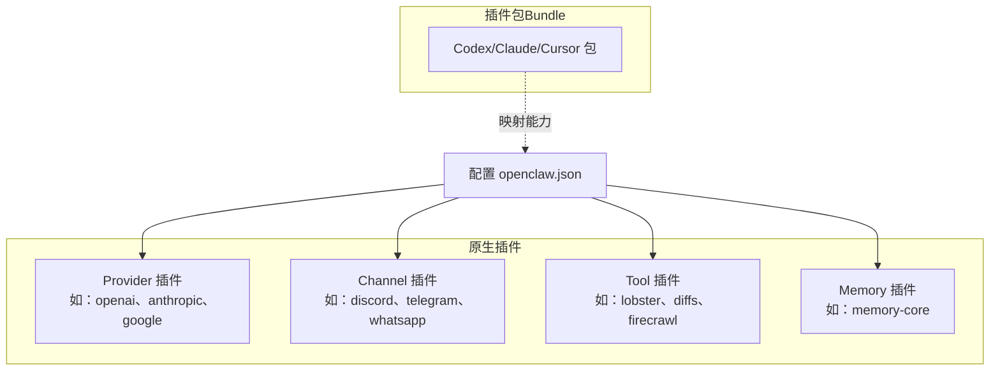
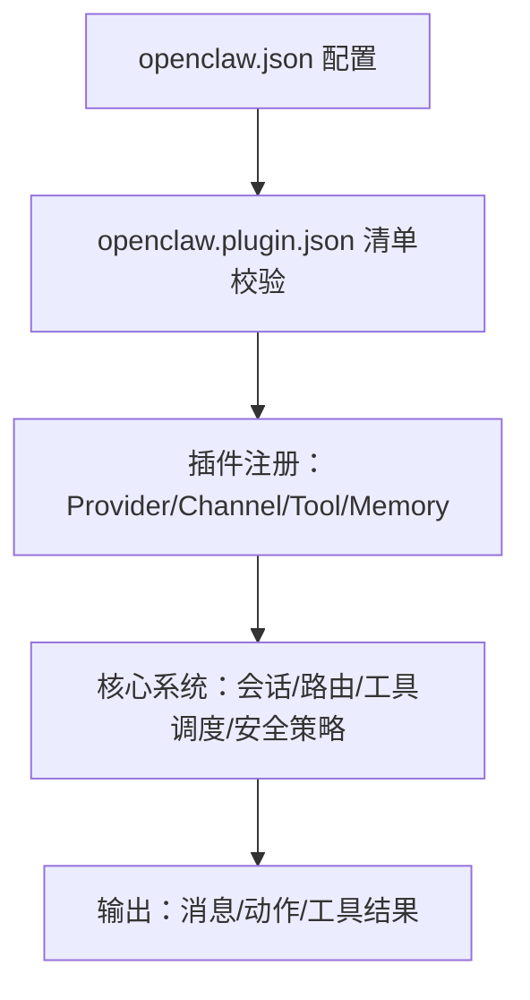
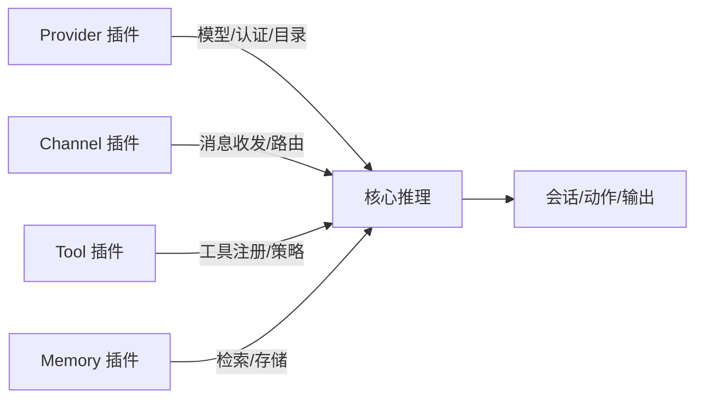

# 现有插件介绍

<cite>
**本文引用的文件**
- [README.md](file://README.md)
- [插件清单与JSON模式要求](file://docs/plugins/manifest.md)
- [插件包兼容性](file://docs/plugins/bundles.md)
- [模型提供商总览](file://docs/concepts/model-providers.md)
- [聊天通道总览](file://docs/channels/index.md)
- [工具总览](file://docs/tools/index.md)
- [模型提供商：OpenAI](file://docs/providers/openai.md)
- [模型提供商：Anthropic](file://docs/providers/anthropic.md)
- [模型提供商：Google](file://docs/providers/google.md)
- [聊天通道：Discord](file://docs/channels/discord.md)
- [聊天通道：Telegram](file://docs/channels/telegram.md)
- [聊天通道：WhatsApp](file://docs/channels/whatsapp.md)
- [聊天通道：Signal](file://docs/channels/signal.md)
- [聊天通道：iMessage](file://docs/channels/imessage.md)
- [聊天通道：Matrix](file://docs/channels/matrix.md)
- [聊天通道：Mattermost](file://docs/channels/mattermost.md)
- [聊天通道：Microsoft Teams](file://docs/channels/msteams.md)
- [聊天通道：Google Chat](file://docs/channels/googlechat.md)
- [聊天通道：Feishu](file://docs/channels/feishu.md)
- [聊天通道：LINE](file://docs/channels/line.md)
- [聊天通道：Nostr](file://docs/channels/nostr.md)
- [聊天通道：Synology Chat](file://docs/channels/synology-chat.md)
- [聊天通道：Tlon](file://docs/channels/tlon.md)
- [聊天通道：Twitch](file://docs/channels/twitch.md)
- [聊天通道：Zalo](file://docs/channels/zalo.md)
- [聊天通道：Zalo个人](file://docs/channels/zalouser.md)
- [聊天通道：WebChat](file://docs/web/webchat.md)
- [工具：浏览器](file://docs/tools/browser.md)
- [工具：Canvas](file://docs/platforms/mac/canvas.md)
- [工具：节点](file://docs/nodes)
- [工具：会话工具](file://docs/concepts/session-tool.md)
- [工具：消息发送](file://docs/tools/agent-send.md)
- [工具：定时任务](file://docs/automation/cron-jobs.md)
- [工具：网关控制](file://docs/gateway/configuration-reference.md)
- [扩展：openai](file://extensions/openai/openclaw.plugin.json)
- [扩展：discord](file://extensions/discord/openclaw.plugin.json)
- [扩展：memory-core](file://extensions/memory-core/openclaw.plugin.json)
- [扩展：lobster](file://extensions/lobster/openclaw.plugin.json)
</cite>

## 目录
1. [简介](#简介)
2. [项目结构](#项目结构)
3. [核心组件](#核心组件)
4. [架构总览](#架构总览)
5. [详细组件分析](#详细组件分析)
6. [依赖分析](#依赖分析)
7. [性能考虑](#性能考虑)
8. [故障排除指南](#故障排除指南)
9. [结论](#结论)
10. [附录](#附录)

## 简介
本文件面向已安装 OpenClaw 的用户，系统梳理现有插件生态，按“Provider 插件（模型提供商）”“Channel 插件（聊天通道）”“Tool 插件（工具）”“Memory 插件（记忆）”四类进行分类说明，覆盖功能特性、配置要点、使用场景、集成方式、示例与模板、以及常见问题排查。同时解释插件之间的协作关系与依赖关系，帮助你快速选择与组合合适的插件组合。

## 项目结构
OpenClaw 将“插件”分为两类：
- 原生插件（native plugin）：以 openclaw.plugin.json 为清单，具备严格 JSON Schema 校验，支持声明 provider、channel、kind、技能等元数据。
- 插件包（bundle plugin）：兼容 Codex/Clude/Cursor 生态的外部包，通过内容映射在 OpenClaw 中启用部分能力（如技能、钩子、MCP 配置等），但不执行包内运行时代码。

图示来源
- [插件清单与JSON模式要求:1-100](file://docs/plugins/manifest.md#L1-L100)
- [插件包兼容性:1-293](file://docs/plugins/bundles.md#L1-L293)

章节来源
- [插件清单与JSON模式要求:1-100](file://docs/plugins/manifest.md#L1-L100)
- [插件包兼容性:1-293](file://docs/plugins/bundles.md#L1-L293)

## 核心组件
- Provider 插件：负责模型提供商对接、认证、请求封装、目录合并、用量查询等。典型如 openai、anthropic、google、openrouter、mistral、ollama、vllm、sglang 等。
- Channel 插件：负责与各聊天平台的连接、消息收发、群组路由、权限与配对策略等。典型如 discord、telegram、whatsapp、signal、imessage、matrix、mattermost、msteams、googlechat、feishu、line、nostr、synology-chat、tlon、twitch、zalo、zalouser、webchat。
- Tool 插件：为代理提供可调用的工具集（如 lobsters 工作流、diff 查看器、firecrawl 等），并可与核心工具策略（allow/deny/profile）协同。
- Memory 插件：提供记忆检索与存储能力，如 memory-core。

章节来源
- [模型提供商总览:1-595](file://docs/concepts/model-providers.md#L1-L595)
- [聊天通道总览:1-48](file://docs/channels/index.md#L1-L48)
- [工具总览:1-578](file://docs/tools/index.md#L1-L578)
- [扩展：openai:1-13](file://extensions/openai/openclaw.plugin.json#L1-L13)
- [扩展：discord:1-10](file://extensions/discord/openclaw.plugin.json#L1-L10)
- [扩展：memory-core:1-10](file://extensions/memory-core/openclaw.plugin.json#L1-L10)
- [扩展：lobster:1-11](file://extensions/lobster/openclaw.plugin.json#L1-L11)

## 架构总览
OpenClaw 的“插件即能力”的架构如下：
- 配置层：openclaw.json 决定启用哪些插件、工具策略、模型与通道参数。
- 清单层：openclaw.plugin.json 提供插件元数据与 JSON Schema 校验。
- 运行层：插件注册 Provider/Channel/Tool/Memory 能力；核心系统按策略与安全规则调度。

图示来源
- [插件清单与JSON模式要求:1-100](file://docs/plugins/manifest.md#L1-L100)
- [模型提供商总览:1-595](file://docs/concepts/model-providers.md#L1-L595)
- [工具总览:1-578](file://docs/tools/index.md#L1-L578)

## 详细组件分析

### Provider 插件（模型提供商）
- 功能特性
  - 认证与轮换：支持多密钥轮换、环境变量注入、OAuth 登录流程、用量查询与配额展示。
  - 模型目录：插件可注入 catalog，OpenClaw 合并到 models.providers。
  - 行为接管：插件可实现 resolveDynamicModel、prepareDynamicModel、normalizeResolvedModel、capabilities、prepareExtraParams、wrapStreamFn、isCacheTtlEligible、buildMissingAuthMessage、suppressBuiltInModel、augmentModelCatalog、isBinaryThinking、supportsXHighThinking、resolveDefaultThinkingLevel、isModernModelRef、prepareRuntimeAuth、resolveUsageAuth、fetchUsageSnapshot 等。
  - 兼容性：内置 pi-ai 目录；支持自定义 base URL 与 OpenAI/Anthropic 兼容代理。
- 典型 Provider 插件
  - openai/openai-codex：OpenAI API 与 Codex OAuth，支持传输策略、fast 模式、服务等级、用量查询。
  - anthropic：Claude API 与 setup-token，支持二进制思考开关、缓存 TTL、家族元数据。
  - google：Gemini API Key、Vertex ADC、Gemini CLI OAuth。
  - openrouter、mistral、opencode、opencode-go、kilocode、zai、moonshot、minimax、qwen、volcengine、byteplus、together、venice、vercel-ai-gateway、huggingface、cloudflare-ai-gateway、nvidia、xai、groq、cerebras、github-copilot、ollama、vllm、sglang 等。
- 配置要点
  - 在 openclaw.json 中设置默认模型（如 "anthropic/claude-opus-4-6"）。
  - 使用 models.providers 自定义 base URL、headers、模型列表或兼容代理。
  - 使用 tools.byProvider 对特定 provider/model 进一步收紧工具集。
- 使用场景
  - 企业合规：通过 models.providers 指向内部代理或合规网关。
  - 多账号轮换：配置多个 API Key 并启用轮换，自动重试限流错误。
  - 用量监控：启用 provider 的用量查询与配额展示。
- 集成方式
  - 通过 openclaw setup --wizard 或 openclaw models auth 完成认证。
  - 通过 openclaw models set 设置默认模型。
  - 通过 openclaw plugins enable 启用/禁用 Provider 插件。
- 示例与模板
  - OpenAI：设置 OPENAI_API_KEY，设置 agents.defaults.model.primary 为 "openai/gpt-5.4"。
  - Anthropic：设置 ANTHROPIC_API_KEY 或使用 setup-token，设置 agents.defaults.model.primary 为 "anthropic/claude-opus-4-6"。
  - Google：设置 GEMINI_API_KEY 或使用 Gemini CLI OAuth，设置 agents.defaults.model.primary 为 "google/gemini-3.1-pro-preview"。
  - 自定义代理：在 models.providers 中声明 baseUrl、apiKey、api、models 列表。
- 故障排除
  - 认证失败：检查环境变量是否正确、轮换顺序、provider 是否被抑制。
  - 限流重试：确认仅在 429/资源耗尽等限流错误时自动切换密钥。
  - 用量查询：确认 provider 插件支持 fetchUsageSnapshot，并已配置相应凭据。

章节来源
- [模型提供商总览:1-595](file://docs/concepts/model-providers.md#L1-L595)
- [模型提供商：OpenAI](file://docs/providers/openai.md)
- [模型提供商：Anthropic](file://docs/providers/anthropic.md)
- [模型提供商：Google](file://docs/providers/google.md)
- [扩展：openai:1-13](file://extensions/openai/openclaw.plugin.json#L1-L13)

### Channel 插件（聊天通道）
- 功能特性
  - 支持文本、媒体、反应、编辑、撤回、贴纸、表情上传、成员管理、事件、投票、线程等。
  - 安全策略：默认 DM 配对（dmPolicy="pairing"），未知发件人需批准；公开 DM 需显式开启。
  - 组路由：支持提及门控、回复标签、分片与路由。
- 典型 Channel 插件
  - discord、telegram、whatsapp、signal、imessage、matrix、mattermost、msteams、googlechat、feishu、line、nostr、synology-chat、tlon、twitch、zalo、zalouser、webchat。
- 配置要点
  - 在 openclaw.json 中设置 channels.<channel>.token/botToken/allowFrom/groups 等。
  - 使用 dmPolicy 控制 DM 安全策略。
  - 使用 commands.* 与 allowFrom 控制命令与白名单。
- 使用场景
  - 快速上手：Telegram（简单 bot token）。
  - iMessage：推荐 BlueBubbles（macOS 服务器 REST API）。
  - 企业：Microsoft Teams、Google Chat、Slack。
- 集成方式
  - 通过 openclaw channels login 完成设备登录（如 whatsapp）。
  - 通过 openclaw pairing approve 完成未知发件人的配对批准。
  - 通过 openclaw doctor 检查 DM 策略与配置风险。
- 示例与模板
  - Telegram：channels.telegram.botToken。
  - Discord：channels.discord.token，可选 commands.* 与 guilds.allowFrom。
  - WhatsApp：channels.whatsapp.allowFrom 与 groups。
  - Signal：channels.signal 配置 section。
  - iMessage：channels.imessage.groups。
- 故障排除
  - 无法接收消息：检查 allowFrom 与 dmPolicy，确认配对状态。
  - 媒体/反应缺失：查看对应通道文档中的能力差异。
  - 跨平台一致性：不同通道的投票/线程/贴纸等能力存在差异，详见各通道文档。

章节来源
- [聊天通道总览:1-48](file://docs/channels/index.md#L1-L48)
- [聊天通道：Discord](file://docs/channels/discord.md)
- [聊天通道：Telegram](file://docs/channels/telegram.md)
- [聊天通道：WhatsApp](file://docs/channels/whatsapp.md)
- [聊天通道：Signal](file://docs/channels/signal.md)
- [聊天通道：iMessage](file://docs/channels/imessage.md)
- [聊天通道：Matrix](file://docs/channels/matrix.md)
- [聊天通道：Mattermost](file://docs/channels/mattermost.md)
- [聊天通道：Microsoft Teams](file://docs/channels/msteams.md)
- [聊天通道：Google Chat](file://docs/channels/googlechat.md)
- [聊天通道：Feishu](file://docs/channels/feishu.md)
- [聊天通道：LINE](file://docs/channels/line.md)
- [聊天通道：Nostr](file://docs/channels/nostr.md)
- [聊天通道：Synology Chat](file://docs/channels/synology-chat.md)
- [聊天通道：Tlon](file://docs/channels/tlon.md)
- [聊天通道：Twitch](file://docs/channels/twitch.md)
- [聊天通道：Zalo](file://docs/channels/zalo.md)
- [聊天通道：Zalo个人](file://docs/channels/zalouser.md)
- [聊天通道：WebChat](file://docs/web/webchat.md)

### Tool 插件（工具）
- 功能特性
  - 可插拔工具：插件可注册额外工具与 CLI 命令。
  - 工具策略：全局/按代理/按 Provider 的 allow/deny/profile 策略，支持 group:* 快捷组。
  - 安全与审计：loop-detection、elevated 权限、host/target 选择、approval 流程。
- 典型 Tool 插件
  - lobster：带可恢复审批的类型化工作流运行时。
  - diffs：只读 diff 查看与 PNG/PDF 渲染。
  - firecrawl：可选反反爬取抓取。
- 配置要点
  - tools.profile 设定基础允许集（minimal/coding/messaging/full）。
  - tools.allow/tools.deny 覆盖策略；支持 "*" 通配符。
  - tools.byProvider 针对特定 provider/model 进一步收紧。
  - loop-detection 可启用并配置阈值与检测器。
- 使用场景
  - 开发支持：coding profile + deny group:runtime。
  - 客服代理：messaging profile + 允许 message、sessions_*。
  - 安全审计：启用 loop-detection，限制 elevated。
- 集成方式
  - 通过 openclaw plugins enable 启用 Tool 插件。
  - 在 openclaw.json 中配置 tools.* 策略。
- 示例与模板
  - 工具策略：tools.profile="coding"，deny="group:runtime"。
  - Provider 特定：byProvider["openai/gpt-5.2"].allow=["group:fs","sessions_list"]。
  - lobster：在 prompt 注入中引用其工具描述。
- 故障排除
  - 工具不可见：确认插件已启用且未被 deny。
  - loop 检测触发：调整 threshold 或关闭检测器。
  - elevated 不生效：确认 sandbox 与 agents.tools.elevated 共同允许。

章节来源
- [工具总览:1-578](file://docs/tools/index.md#L1-L578)
- [扩展：lobster:1-11](file://extensions/lobster/openclaw.plugin.json#L1-L11)

### Memory 插件（记忆）
- 功能特性
  - 记忆检索与存储：提供 memory_search、memory_get 等工具。
  - 插槽选择：kind:"memory" 由 plugins.slots.memory 选择。
- 配置要点
  - 在 openclaw.json 中通过 plugins.slots.memory 指定具体实现。
  - 与工具策略配合，限制 memory_* 工具的可见范围。
- 使用场景
  - 需要长期上下文检索的代理。
  - 与 Tool 插件（如 diffs、firecrawl）结合，形成“检索-分析-行动”的闭环。
- 集成方式
  - 通过 openclaw plugins enable 启用 memory-core。
  - 在 openclaw.json 中配置 plugins.slots.memory。
- 示例与模板
  - memory-core：作为默认内存实现。
- 故障排除
  - 记忆工具不可用：确认插件已启用且未被 deny。
  - 性能瓶颈：评估检索索引与存储后端。

章节来源
- [扩展：memory-core:1-10](file://extensions/memory-core/openclaw.plugin.json#L1-L10)

### 插件协作与依赖关系
- Provider 与 Tool
  - Provider 插件可影响工具可用性（例如某些 Provider 的模型不支持某些工具参数）。
  - tools.byProvider 可针对特定 Provider 进一步收紧工具集。
- Channel 与 Tool
  - message 工具依赖 Channel 插件；不同通道的消息能力差异会影响 message 的行为。
- Tool 与 Memory
  - 记忆工具与检索型 Tool（如 web_search、web_fetch、firecrawl）可组合使用。
- Bundle 与原生插件
  - openclaw.plugin.json 优先于 Bundle 检测；若同一目录同时存在两者，优先按原生插件处理。

图示来源
- [插件清单与JSON模式要求:1-100](file://docs/plugins/manifest.md#L1-L100)
- [工具总览:1-578](file://docs/tools/index.md#L1-L578)
- [模型提供商总览:1-595](file://docs/concepts/model-providers.md#L1-L595)

## 依赖分析
- 插件耦合
  - Provider 插件与模型目录、认证、用量查询强相关。
  - Channel 插件与平台 API、配对策略、群组路由紧密耦合。
  - Tool 插件与核心工具策略、安全策略耦合。
  - Memory 插件与检索/存储实现耦合。
- 外部依赖
  - Provider 插件依赖对应平台 API 与凭据。
  - Channel 插件依赖平台 SDK/HTTP/WebSocket/Webhook。
  - Tool 插件可能依赖外部服务（如 web_search 的搜索引擎）。
- 循环依赖
  - 插件间无直接循环依赖；核心系统统一调度。
- 配置冲突
  - tools.allow 与 tools.deny 的匹配大小写不敏感，支持 "*"；未知或未加载的插件名会被忽略并记录警告。

章节来源
- [插件清单与JSON模式要求:1-100](file://docs/plugins/manifest.md#L1-L100)
- [工具总览:1-578](file://docs/tools/index.md#L1-L578)

## 性能考虑
- Provider
  - 合理设置传输策略（WebSocket/SSE/auto）与 fast 模式，减少延迟。
  - 使用模型目录合并与缓存 TTL，降低重复解析成本。
- Channel
  - 合理设置 allowFrom 与 groups，减少无关消息处理。
  - 使用线程/分片与路由策略，避免单通道过载。
- Tool
  - 启用 loop-detection，避免无效重复调用。
  - 限制 elevated 与 host/target，减少高权限操作开销。
- Memory
  - 选择高性能检索/存储后端，合理设置索引与分页。

## 故障排除指南
- 插件清单与 Schema
  - 缺失或无效的 openclaw.plugin.json 会导致配置验证失败；使用 openclaw doctor 检查插件错误。
  - 未知 channels.* 键或插件 id 未发现会报错。
- Provider
  - 认证失败：检查环境变量、轮换顺序、provider 是否被抑制。
  - 用量查询失败：确认 provider 插件支持 fetchUsageSnapshot。
- Channel
  - DM 未配对：使用 openclaw pairing approve 完成配对。
  - 媒体/反应缺失：参考对应通道文档的能力差异。
- Tool
  - 工具不可见：确认插件已启用且未被 deny；group:* 快捷组是否正确展开。
  - elevated 不生效：确认 sandbox 与 agents.tools.elevated 共同允许。
- Bundle
  - 能力未执行：检查 openclaw plugins info <id> 输出，确认当前未映射的能力。

章节来源
- [插件清单与JSON模式要求:1-100](file://docs/plugins/manifest.md#L1-L100)
- [插件包兼容性:1-293](file://docs/plugins/bundles.md#L1-L293)
- [README.md:1-560](file://README.md#L1-L560)

## 结论
OpenClaw 的插件体系以“清单驱动 + 严格校验 + 策略可控”为核心，围绕 Provider、Channel、Tool、Memory 四大类能力构建了强大的扩展生态。通过合理的插件组合与配置策略，可在本地/云端/企业环境中实现从模型接入、消息通道、工具调用到记忆检索的一体化智能助理体验。建议优先启用安全策略与工具策略，结合业务场景选择合适的 Provider 与 Channel，并按需引入 Tool/Memory 插件以增强能力。

## 附录
- 快速开始
  - Provider：openclaw setup --wizard 完成认证；openclaw models set 设置默认模型。
  - Channel：openclaw channels login 完成设备登录；openclaw pairing approve 完成配对。
  - Tool：openclaw plugins enable 启用插件；在 openclaw.json 中配置 tools.*。
  - Memory：openclaw plugins enable memory-core；在 openclaw.json 中配置 plugins.slots.memory。
- 参考文档
  - [模型提供商总览](file://docs/concepts/model-providers.md)
  - [聊天通道总览](file://docs/channels/index.md)
  - [工具总览](file://docs/tools/index.md)
  - [插件清单与JSON模式要求](file://docs/plugins/manifest.md)
  - [插件包兼容性](file://docs/plugins/bundles.md)