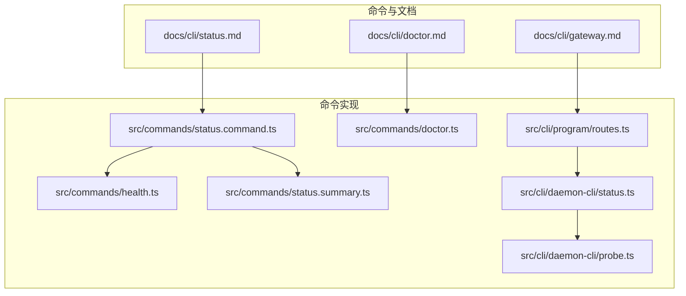
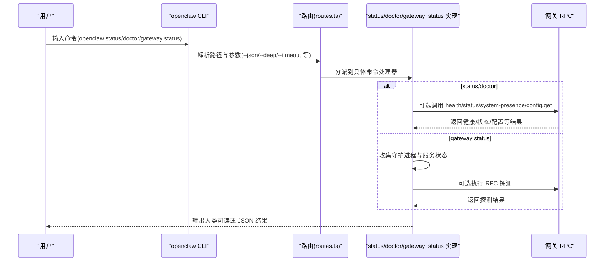
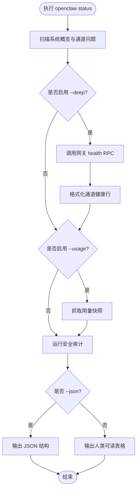
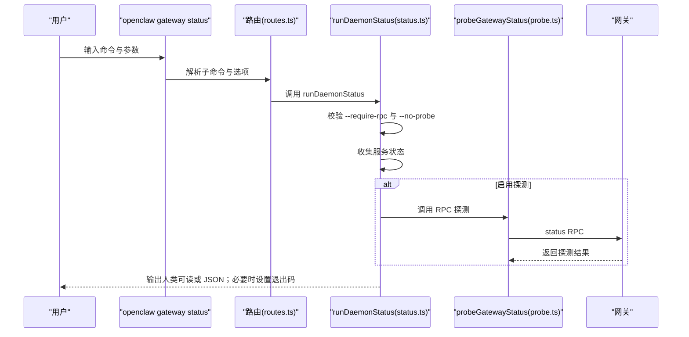
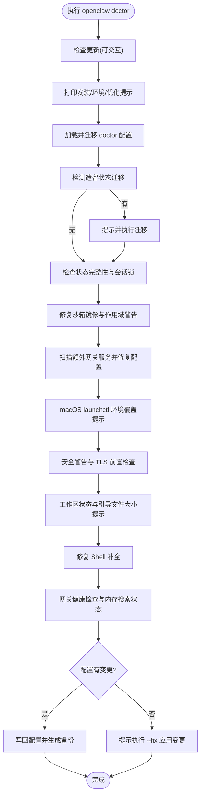
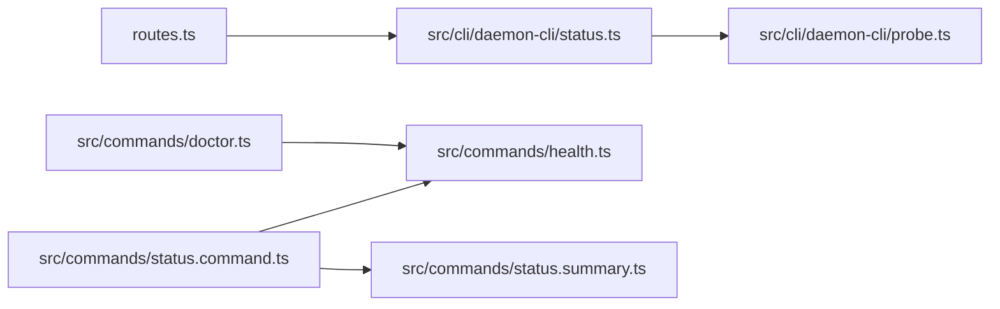

# 基础诊断步骤

<cite>
**本文引用的文件**
- [status.md](file://docs/cli/status.md)
- [doctor.md](file://docs/cli/doctor.md)
- [gateway.md](file://docs/cli/gateway.md)
- [status.command.ts](file://src/commands/status.command.ts)
- [health.ts](file://src/commands/health.ts)
- [doctor.ts](file://src/commands/doctor.ts)
- [routes.ts](file://src/cli/program/routes.ts)
- [status.ts](file://src/cli/daemon-cli/status.ts)
- [probe.ts](file://src/cli/daemon-cli/probe.ts)
- [status.summary.ts](file://src/commands/status.summary.ts)
</cite>

## 目录
1. [简介](#简介)
2. [项目结构](#项目结构)
3. [核心组件](#核心组件)
4. [架构总览](#架构总览)
5. [详细组件分析](#详细组件分析)
6. [依赖关系分析](#依赖关系分析)
7. [性能考量](#性能考量)
8. [故障排查指南](#故障排查指南)
9. [结论](#结论)
10. [附录](#附录)

## 简介
本文件面向使用者与运维人员，系统化讲解如何使用 openclaw 的三类诊断命令进行健康检查与问题定位：
- openclaw status：查看系统概览、通道状态、会话与内存等信息，并可选进行深度探测（deep）与用量快照（usage）。
- openclaw gateway status：检查网关服务安装/运行状态与 RPC 可达性，支持仅服务视图或带 RPC 探测。
- openclaw doctor：执行健康巡检与快速修复，涵盖网关、通道、沙箱、工作区、安全审计等。

目标是帮助你在 60 秒内完成快速检查，并在复杂问题时按步骤深入排查，识别常见错误信号并给出初步处理建议。

## 项目结构
围绕诊断相关的关键模块与文档如下：
- 文档层：CLI 命令参考文档，明确各命令用法、输出与注意事项。
- 命令层：status、health、doctor、gateway status 等命令的具体实现与路由。
- 守护进程与网关探测：daemon-cli 的状态收集与 RPC 探测逻辑。

图表来源
- [status.md](file://docs/cli/status.md)
- [doctor.md](file://docs/cli/doctor.md)
- [gateway.md](file://docs/cli/gateway.md)
- [status.command.ts](file://src/commands/status.command.ts)
- [health.ts](file://src/commands/health.ts)
- [doctor.ts](file://src/commands/doctor.ts)
- [routes.ts](file://src/cli/program/routes.ts)
- [status.ts](file://src/cli/daemon-cli/status.ts)
- [probe.ts](file://src/cli/daemon-cli/probe.ts)
- [status.summary.ts](file://src/commands/status.summary.ts)

章节来源
- [status.md](file://docs/cli/status.md)
- [doctor.md](file://docs/cli/doctor.md)
- [gateway.md](file://docs/cli/gateway.md)
- [status.command.ts](file://src/commands/status.command.ts)
- [health.ts](file://src/commands/health.ts)
- [doctor.ts](file://src/commands/doctor.ts)
- [routes.ts](file://src/cli/program/routes.ts)
- [status.ts](file://src/cli/daemon-cli/status.ts)
- [probe.ts](file://src/cli/daemon-cli/probe.ts)
- [status.summary.ts](file://src/commands/status.summary.ts)

## 核心组件
- openclaw status
  - 功能：汇总系统概览（更新通道、网关可达性、服务安装状态、代理与会话、内存、事件、心跳、会话列表等），可选 deep 探测通道健康，可选 usage 快照。
  - 关键行为：当启用 deep 时，调用网关 health RPC；当启用 usage 时，抓取用量快照；输出支持 JSON。
  - 正常标准：网关可达、通道“OK/链接”为主，无关键安全告警；会话活跃、内存可用。
  - 异常识别：通道显示“未配置/未链接/失败”，网关 unreachable 或 auth 警告，安全审计出现 critical/warn。
- openclaw gateway status
  - 功能：展示网关服务安装/加载状态与 RPC 可达性；支持仅服务视图或带 RPC 探测；支持 require-rpc 强制要求 RPC 成功。
  - 正常标准：服务已安装且加载成功；RPC 探测 ok；若 require-rpc，则非零退出码表示失败。
  - 异常识别：服务未安装/未加载；RPC 不可达或受限（scope-limited）；--require-rpc 时 RPC 失败导致退出码非零。
- openclaw doctor
  - 功能：引导式健康巡检与修复，覆盖网关认证模式、遗留状态迁移、会话锁、沙箱镜像、服务配置、安全警告、工作区与引导文件大小、Shell 补全等。
  - 正常标准：无交互提示需修复；必要变更已写入配置并生成备份；无无效配置项。
  - 异常识别：提示需要生成/旋转网关 token、清理遗留 Cron 存储、修复沙箱镜像、macOS launchctl 环境变量覆盖等问题。

章节来源
- [status.md](file://docs/cli/status.md)
- [doctor.md](file://docs/cli/doctor.md)
- [gateway.md](file://docs/cli/gateway.md)
- [status.command.ts](file://src/commands/status.command.ts)
- [health.ts](file://src/commands/health.ts)
- [doctor.ts](file://src/commands/doctor.ts)
- [status.ts](file://src/cli/daemon-cli/status.ts)
- [probe.ts](file://src/cli/daemon-cli/probe.ts)

## 架构总览
下图展示了从 CLI 到命令实现与网关 RPC 的调用链路，以及 doctor 的综合巡检流程。

图表来源
- [routes.ts](file://src/cli/program/routes.ts)
- [status.command.ts](file://src/commands/status.command.ts)
- [health.ts](file://src/commands/health.ts)
- [doctor.ts](file://src/commands/doctor.ts)
- [status.ts](file://src/cli/daemon-cli/status.ts)
- [probe.ts](file://src/cli/daemon-cli/probe.ts)

## 详细组件分析

### openclaw status 命令
- 入口与路由
  - 路由解析：根据路径匹配 status/health/sessions 等命令，支持 --json、--timeout、--verbose 等通用选项。
  - 参数校验：timeout 非正数将拒绝执行；deep 时触发 live 探测。
- 执行流程
  - 基础扫描：收集系统概览、网关连接详情、通道问题、代理与会话、内存状态、事件队列、心跳与最近会话。
  - 深度探测：当启用 --deep 时，调用网关 health RPC 并格式化通道健康行。
  - 用量快照：当启用 --usage 时，抓取提供商用量快照。
  - 安全审计：在 JSON 模式下直接运行；否则在进度条中执行。
  - 输出：人类可读表格与 JSON；JSON 包含安全审计、secretDiagnostics、health、usage、last-heartbeat 等。
- 正常状态标准
  - 网关：可达且认证方式清晰；无 auth 警告。
  - 通道：多数为 OK/链接；无关键错误；未配置项标记为 OFF。
  - 会话：存在近期活动；默认模型与上下文令牌合理。
  - 内存：插件启用且可用；向量/FTS/缓存状态正常或关闭但无脏数据。
  - 安全审计：critical/warn 数量为 0。
- 异常识别
  - 通道失败/未链接/未配置；网关 unreachable 或 auth 警告；安全审计出现 critical/warn。
  - 使用 --all 生成可分享的完整状态报告。

图表来源
- [status.command.ts](file://src/commands/status.command.ts)
- [health.ts](file://src/commands/health.ts)
- [status.summary.ts](file://src/commands/status.summary.ts)

章节来源
- [status.md](file://docs/cli/status.md)
- [status.command.ts](file://src/commands/status.command.ts)
- [health.ts](file://src/commands/health.ts)
- [status.summary.ts](file://src/commands/status.summary.ts)

### openclaw gateway status 命令
- 入口与路由
  - 路由解析：gateway status 子命令，支持 --url、--token、--password、--timeout、--no-probe、--deep、--require-rpc。
  - 参数约束：--require-rpc 与 --no-probe 不能同时使用；若仅服务视图则不强制 RPC 成功。
- 执行流程
  - 收集守护进程与节点服务状态；可选执行 RPC 探测；根据 require-rpc 决定退出码。
  - 输出：人类可读或 JSON；JSON 中包含 ok/degraded 字段及 per-target 连接与 RPC 状态。
- 正常状态标准
  - 至少一个目标可达（Reachable: yes）；RPC: ok 表示细节 RPC 成功。
  - 若存在作用域限制（缺少 operator.read），返回 degraded。
- 异常识别
  - 无目标可达（退出码非零）；RPC 受限（scopeLimited）；--require-rpc 时 RPC 失败导致非零退出码。

图表来源
- [routes.ts](file://src/cli/program/routes.ts)
- [status.ts](file://src/cli/daemon-cli/status.ts)
- [probe.ts](file://src/cli/daemon-cli/probe.ts)

章节来源
- [gateway.md](file://docs/cli/gateway.md)
- [routes.ts](file://src/cli/program/routes.ts)
- [status.ts](file://src/cli/daemon-cli/status.ts)
- [probe.ts](file://src/cli/daemon-cli/probe.ts)

### openclaw doctor 命令
- 入口与流程
  - 优先检查更新（可交互确认）；打印源安装、环境变量与启动优化提示。
  - 加载并可能迁移 doctor 配置；检测并修复遗留状态迁移、会话锁、旧版 Cron 存储。
  - 沙箱镜像修复与作用域警告；额外网关服务扫描与配置修复。
  - macOS launchctl 环境覆盖提示；安全警告与 TLS 前置条件检查。
  - 工作区状态与引导文件大小提示；Shell 补全修复；网关健康检查与内存搜索状态提示。
  - 最终写回配置（如有变更），生成备份并提示后续操作。
- 正常状态标准
  - 无交互提示需修复；必要变更已写入配置；无无效配置项。
- 异常识别与处理
  - 缺失或歧义的网关认证模式：提示设置显式 mode；必要时生成新 token。
  - 遗留状态迁移：预览后可一键迁移。
  - 旧版 Cron 存储：自动重写。
  - 沙箱模式：Docker 不可用时给出高信号警告与修复建议。
  - macOS launchctl 环境变量覆盖：提供查询与清除指令。
  - 安全审计：出现 critical/warn 时列出修复建议。

图表来源
- [doctor.ts](file://src/commands/doctor.ts)

章节来源
- [doctor.md](file://docs/cli/doctor.md)
- [doctor.ts](file://src/commands/doctor.ts)

## 依赖关系分析
- 命令到实现
  - openclaw status -> status.command.ts（调用 health RPC、用量快照、安全审计）
  - openclaw doctor -> doctor.ts（综合巡检与修复）
  - openclaw gateway status -> routes.ts -> status.ts（守护进程与服务状态收集）-> probe.ts（RPC 探测）
- 数据与接口
  - status.summary.ts 提供会话与心跳摘要，被 status.command.ts 使用。
  - health.ts 提供健康快照与格式化输出，被 status.command.ts 与 doctor.ts 使用。

图表来源
- [routes.ts](file://src/cli/program/routes.ts)
- [status.ts](file://src/cli/daemon-cli/status.ts)
- [probe.ts](file://src/cli/daemon-cli/probe.ts)
- [status.command.ts](file://src/commands/status.command.ts)
- [health.ts](file://src/commands/health.ts)
- [status.summary.ts](file://src/commands/status.summary.ts)
- [doctor.ts](file://src/commands/doctor.ts)

章节来源
- [routes.ts](file://src/cli/program/routes.ts)
- [status.ts](file://src/cli/daemon-cli/status.ts)
- [probe.ts](file://src/cli/daemon-cli/probe.ts)
- [status.command.ts](file://src/commands/status.command.ts)
- [health.ts](file://src/commands/health.ts)
- [status.summary.ts](file://src/commands/status.summary.ts)
- [doctor.ts](file://src/commands/doctor.ts)

## 性能考量
- 默认超时：health 与 doctor 的网关健康检查通常采用较长超时（如 10 秒级），以确保通道探测稳定。
- 深度探测成本：--deep 会逐通道执行 live 探测，耗时与通道数量、网络状况相关。
- JSON 输出：避免进度与着色开销，适合自动化脚本与日志采集。
- 并行与异步：status 在 JSON 模式下并行获取守护进程与节点服务状态，减少等待时间。

## 故障排查指南

### 60 秒快速检查法
- 第一步：确认网关可达
  - 执行：openclaw gateway status
  - 观察：至少一个目标可达；RPC: ok；若使用 --require-rpc，退出码应为 0。
  - 异常：无目标可达或 RPC 受限，先修复网络/认证再继续。
- 第二步：查看系统概览
  - 执行：openclaw status
  - 观察：网关 reachable、通道多数 OK/链接；无 critical/warn 安全告警。
  - 异常：通道失败/未链接/未配置；网关 unreachable/auth 警告；安全审计出现 critical/warn。
- 第三步：深入通道健康
  - 执行：openclaw status --deep
  - 观察：通道健康行显示 OK/失败；失败项优先处理。
  - 异常：多通道失败或失败占比高，结合 doctor 修复。
- 第四步：必要时执行巡检修复
  - 执行：openclaw doctor
  - 观察：无交互提示需修复；必要时应用 --fix 写回配置并生成备份。

### 逐步深入排查
- 网络与认证
  - 使用 openclaw gateway probe 检查远程/本地可达性与作用域；核对 --token/--password 是否正确传递。
  - 若存在 SecretRef 管理的认证，确保在当前命令路径可解析；否则在 JSON 模式下会显示 rpc.authWarning。
- 通道问题
  - 查看 status 的 Channels 表格，关注未配置/未链接/失败项；结合 doctor 的遗留状态迁移与 Cron 存储修复。
  - 对于特定通道，参考其插件的探测与自检逻辑（health.ts 中的通道探测与格式化）。
- 系统与服务
  - 使用 openclaw gateway status --deep 检查系统级服务；Linux 上注意 systemd 用户驻留（linger）需求。
  - macOS 上留意 launchctl 环境变量覆盖导致的“未授权”错误，必要时查询与清除。
- 安全与配置
  - 运行 doctor 的安全审计与配置有效性检查；修复 critical/warn 项。
  - 若 doctor 提示需要生成/旋转网关 token，按提示执行并重新运行 doctor。

### 常见错误信号与初步处理
- 网关不可达
  - 现象：gateway status 显示 unreachable；status 的网关列为 unreachable。
  - 处理：使用 openclaw gateway probe 排查；确认端口/绑定/认证；必要时使用 --require-rpc。
- 通道未链接/未配置
  - 现象：status 的 Channels 表格显示未链接/未配置；health 行显示 not linked/not configured。
  - 处理：检查对应通道的配置与授权；doctor 可协助修复遗留状态与 Cron 存储。
- 安全审计 critical/warn
  - 现象：doctor 输出 critical/warn 条目。
  - 处理：按提示修复；必要时运行 doctor --fix 写回配置并生成备份。
- macOS launchctl 环境覆盖
  - 现象：doctor 提示 launchctl getenv OPENCLAW_GATEWAY_TOKEN/PASSWORD 存在。
  - 处理：按 doctor 文档提供的命令查询与清除。
- 沙箱模式 Docker 不可用
  - 现象：doctor 报告高信号警告。
  - 处理：安装 Docker 或关闭沙箱模式。

章节来源
- [gateway.md](file://docs/cli/gateway.md)
- [status.md](file://docs/cli/status.md)
- [doctor.md](file://docs/cli/doctor.md)
- [status.command.ts](file://src/commands/status.command.ts)
- [health.ts](file://src/commands/health.ts)
- [doctor.ts](file://src/commands/doctor.ts)
- [status.ts](file://src/cli/daemon-cli/status.ts)
- [probe.ts](file://src/cli/daemon-cli/probe.ts)

## 结论
通过 openclaw status、gateway status 与 doctor 三类命令，可以形成从“表面健康”到“深层修复”的完整诊断闭环。建议将 60 秒快速检查法作为日常例行，遇到复杂问题时按步骤深入排查，结合 doctor 的引导式修复与安全审计，快速恢复系统稳定运行。

## 附录
- 命令速查
  - openclaw status：基础状态与可选 deep/usage。
  - openclaw gateway status：服务与 RPC 状态检查。
  - openclaw doctor：健康巡检与快速修复。
- 输出模式
  - --json：机器可读，便于自动化与日志采集。
  - --timeout：控制 RPC 超时，避免长时间阻塞。
  - --verbose/--debug：输出更详细的连接与探测信息。