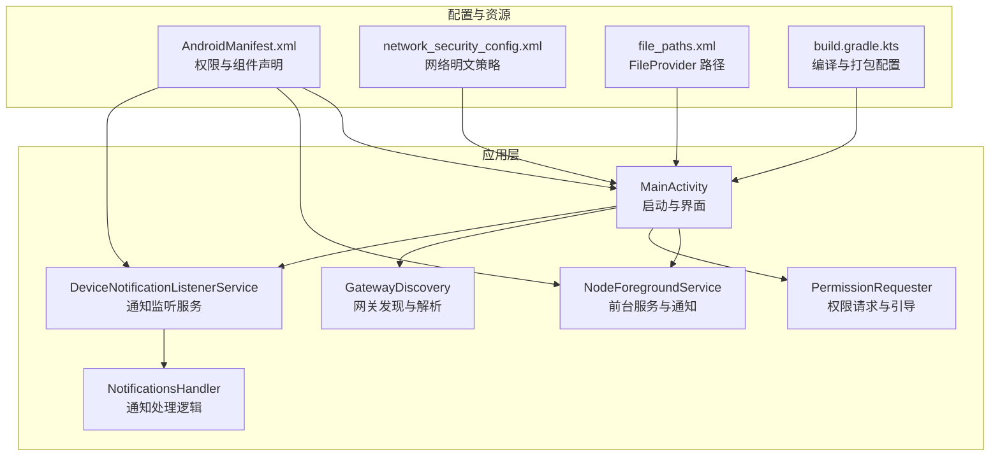
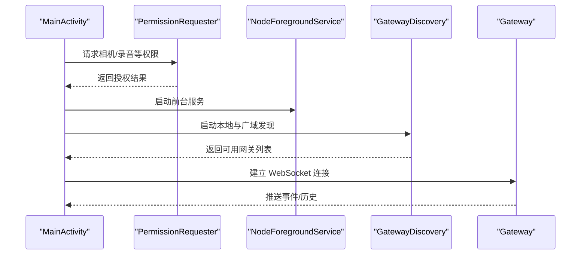
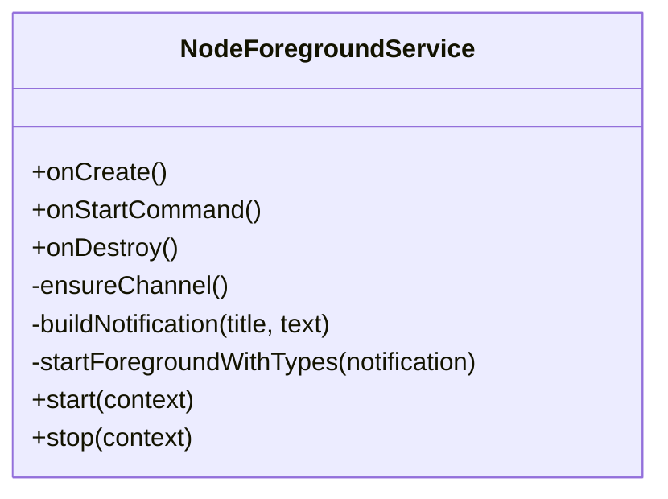
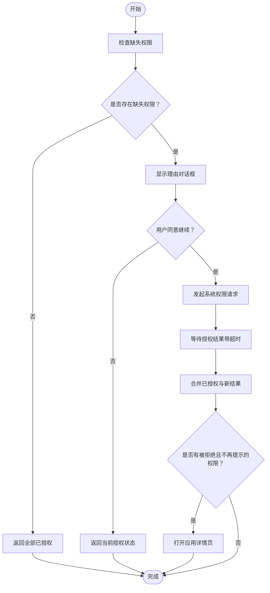
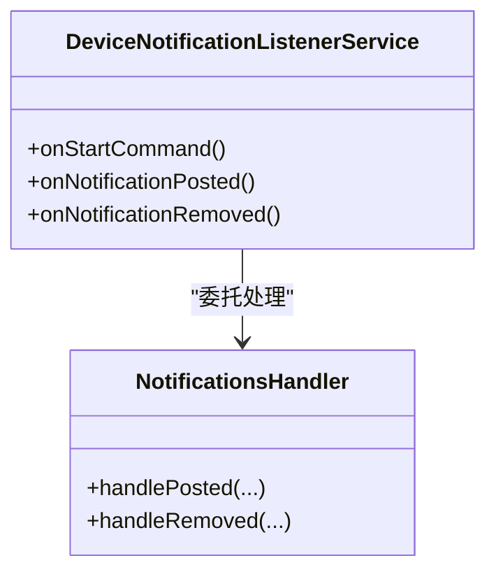
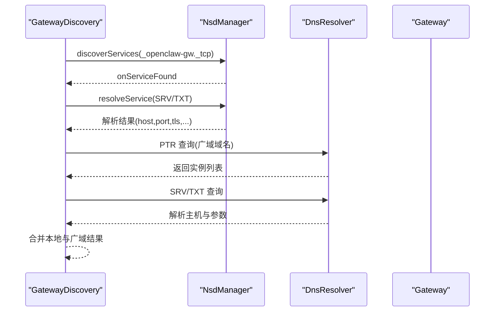
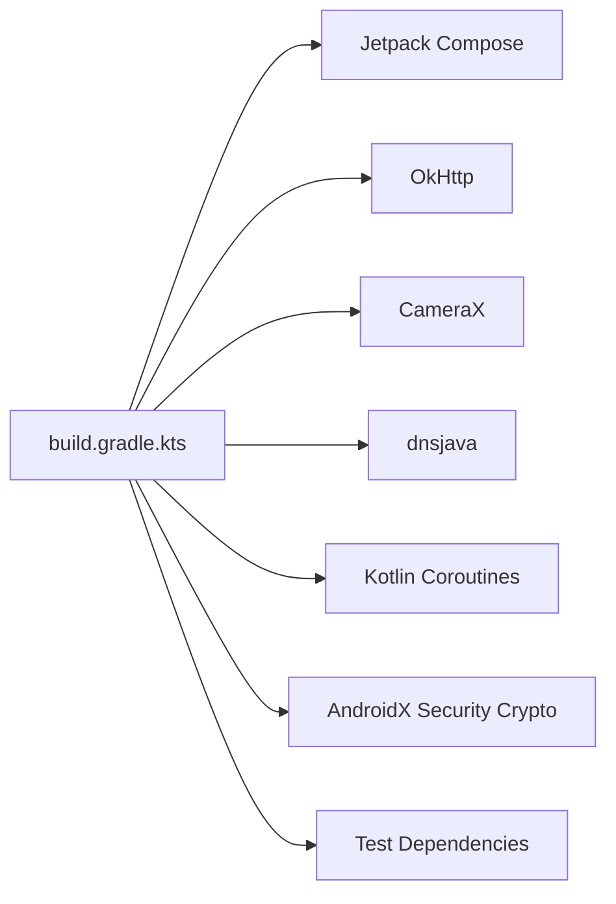

# Android 平台问题

<cite>
**本文引用的文件**
- [Android 应用文档](file://docs/platforms/android.md)
- [应用构建脚本](file://apps/android/app/build.gradle.kts)
- [应用清单](file://apps/android/app/src/main/AndroidManifest.xml)
- [前台服务](file://apps/android/app/src/main/java/ai/openclaw/app/NodeForegroundService.kt)
- [权限请求器](file://apps/android/app/src/main/java/ai/openclaw/app/PermissionRequester.kt)
- [主活动](file://apps/android/app/src/main/java/ai/openclaw/app/MainActivity.kt)
- [网络安全配置](file://apps/android/app/src/main/res/xml/network_security_config.xml)
- [文件路径规则](file://apps/android/app/src/main/res/xml/file_paths.xml)
- [网关发现](file://apps/android/app/src/main/java/ai/openclaw/app/gateway/GatewayDiscovery.kt)
- [通知监听服务](file://apps/android/app/src/main/java/ai/openclaw/app/node/DeviceNotificationListenerService.kt)
- [通知处理器](file://apps/android/app/src/main/java/ai/openclaw/app/node/NotificationsHandler.kt)
</cite>

## 目录
1. [简介](#简介)
2. [项目结构](#项目结构)
3. [核心组件](#核心组件)
4. [架构总览](#架构总览)
5. [详细组件分析](#详细组件分析)
6. [依赖关系分析](#依赖关系分析)
7. [性能考量](#性能考量)
8. [故障排除指南](#故障排除指南)
9. [结论](#结论)
10. [附录](#附录)

## 简介
本指南聚焦于 Android 平台特定问题与排障实践，覆盖权限系统、后台服务限制、通知管理、设备节点能力、无障碍服务配置、版本兼容性、权限申请流程、电池优化白名单、网络连接限制、常见崩溃与 ANR 排查、内存泄漏定位、Android Studio 调试与 Logcat 分析、性能监控与优化建议，以及 Google Play 与企业分发注意事项。内容基于仓库中的 Android 应用实现与文档进行整理，帮助开发者快速定位并解决 Android 端问题。

## 项目结构
Android 应用位于 apps/android/app，采用 Kotlin + Jetpack Compose 构建，使用 Gradle 多模块与多变体配置。核心特性包括：
- 前台服务维持长连接
- 基于 mDNS/NSD 与 DNS-SD 的网关自动发现
- 统一权限请求与引导
- 通知监听无障碍服务
- 网络安全策略支持本地与尾网场景

**图表来源**
- [应用清单:1-78](file://apps/android/app/src/main/AndroidManifest.xml#L1-L78)
- [前台服务:1-159](file://apps/android/app/src/main/java/ai/openclaw/app/NodeForegroundService.kt#L1-L159)
- [权限请求器:1-134](file://apps/android/app/src/main/java/ai/openclaw/app/PermissionRequester.kt#L1-L134)
- [主活动:1-64](file://apps/android/app/src/main/java/ai/openclaw/app/MainActivity.kt#L1-L64)
- [网关发现:1-522](file://apps/android/app/src/main/java/ai/openclaw/app/gateway/GatewayDiscovery.kt#L1-L522)
- [通知监听服务](file://apps/android/app/src/main/java/ai/openclaw/app/node/DeviceNotificationListenerService.kt)
- [通知处理器](file://apps/android/app/src/main/java/ai/openclaw/app/node/NotificationsHandler.kt)
- [网络安全配置:1-13](file://apps/android/app/src/main/res/xml/network_security_config.xml#L1-L13)
- [文件路径规则:1-5](file://apps/android/app/src/main/res/xml/file_paths.xml#L1-L5)
- [应用构建脚本:1-263](file://apps/android/app/build.gradle.kts#L1-L263)

**章节来源**
- [应用清单:1-78](file://apps/android/app/src/main/AndroidManifest.xml#L1-L78)
- [应用构建脚本:1-263](file://apps/android/app/build.gradle.kts#L1-L263)

## 核心组件
- 前台服务与持久通知：维持连接状态可见，避免被系统回收。
- 权限请求与引导：统一处理运行时权限，必要时跳转设置页。
- 网关发现：本地 mDNS/NSD 与广域 DNS-SD（Wide-Area Bonjour）双通道。
- 通知监听：通过无障碍服务监听系统通知，支持后续处理。
- 网络安全策略：允许本地与尾网明文流量，便于开发与内网场景。

**章节来源**
- [前台服务:1-159](file://apps/android/app/src/main/java/ai/openclaw/app/NodeForegroundService.kt#L1-L159)
- [权限请求器:1-134](file://apps/android/app/src/main/java/ai/openclaw/app/PermissionRequester.kt#L1-L134)
- [网关发现:1-522](file://apps/android/app/src/main/java/ai/openclaw/app/gateway/GatewayDiscovery.kt#L1-L522)
- [通知监听服务](file://apps/android/app/src/main/java/ai/openclaw/app/node/DeviceNotificationListenerService.kt)
- [通知处理器](file://apps/android/app/src/main/java/ai/openclaw/app/node/NotificationsHandler.kt)
- [网络安全配置:1-13](file://apps/android/app/src/main/res/xml/network_security_config.xml#L1-L13)

## 架构总览
Android 节点通过前台服务保持与网关的 WebSocket 连接；在不同网络环境下，优先使用本地 mDNS/NSD，跨网段时启用 Wide-Area Bonjour；权限与通知监听通过无障碍服务实现；网络策略允许本地与尾网明文通信。

**图表来源**
- [主活动:1-64](file://apps/android/app/src/main/java/ai/openclaw/app/MainActivity.kt#L1-L64)
- [权限请求器:1-134](file://apps/android/app/src/main/java/ai/openclaw/app/PermissionRequester.kt#L1-L134)
- [前台服务:1-159](file://apps/android/app/src/main/java/ai/openclaw/app/NodeForegroundService.kt#L1-L159)
- [网关发现:1-522](file://apps/android/app/src/main/java/ai/openclaw/app/gateway/GatewayDiscovery.kt#L1-L522)

## 详细组件分析

### 前台服务与通知管理
- 使用前台服务类型“数据同步”，确保连接稳定；通知包含启动与断开操作，支持立即生效。
- 服务生命周期中合并状态流，动态更新通知标题与文本，体现连接状态与麦克风监听状态。

**图表来源**
- [前台服务:1-159](file://apps/android/app/src/main/java/ai/openclaw/app/NodeForegroundService.kt#L1-L159)

**章节来源**
- [前台服务:1-159](file://apps/android/app/src/main/java/ai/openclaw/app/NodeForegroundService.kt#L1-L159)

### 权限系统与申请流程
- 统一注册多权限请求回调，按需展示理由对话框，必要时引导用户到设置页开启。
- 支持超时控制与并发互斥，合并已授权与新授权结果，避免重复弹窗。

**图表来源**
- [权限请求器:1-134](file://apps/android/app/src/main/java/ai/openclaw/app/PermissionRequester.kt#L1-L134)

**章节来源**
- [权限请求器:1-134](file://apps/android/app/src/main/java/ai/openclaw/app/PermissionRequester.kt#L1-L134)
- [主活动:1-64](file://apps/android/app/src/main/java/ai/openclaw/app/MainActivity.kt#L1-L64)

### 设备节点能力与无障碍服务
- 清单声明绑定通知监听服务的权限，组件导出为私有服务。
- 通知监听服务与处理器分离，便于扩展与测试。

**图表来源**
- [通知监听服务](file://apps/android/app/src/main/java/ai/openclaw/app/node/DeviceNotificationListenerService.kt)
- [通知处理器](file://apps/android/app/src/main/java/ai/openclaw/app/node/NotificationsHandler.kt)

**章节来源**
- [应用清单:49-56](file://apps/android/app/src/main/AndroidManifest.xml#L49-L56)
- [通知监听服务](file://apps/android/app/src/main/java/ai/openclaw/app/node/DeviceNotificationListenerService.kt)
- [通知处理器](file://apps/android/app/src/main/java/ai/openclaw/app/node/NotificationsHandler.kt)

### 网络连接与发现机制
- 本地发现：mDNS/NSD 搜索 _openclaw-gw._tcp，解析 SRV/TXT 记录获取端口与 TLS 信息。
- 广域发现：通过环境变量指定域名，使用 PTR/SRV/TXT 解析跨网关可达记录。
- DNS 解析：优先 VPN 网络（如 Tailscale），否则回退至活跃网络；支持直连解析器与系统解析器回退。

**图表来源**
- [网关发现:1-522](file://apps/android/app/src/main/java/ai/openclaw/app/gateway/GatewayDiscovery.kt#L1-L522)

**章节来源**
- [网关发现:1-522](file://apps/android/app/src/main/java/ai/openclaw/app/gateway/GatewayDiscovery.kt#L1-L522)

### 网络安全策略与明文流量
- 允许基础明文流量，并针对 openclaw.local 与 ts.net 子域放行 HTTP，满足本地与尾网开发需求。
- FileProvider 路径仅暴露缓存目录下的更新包，降低风险面。

**章节来源**
- [网络安全配置:1-13](file://apps/android/app/src/main/res/xml/network_security_config.xml#L1-L13)
- [文件路径规则:1-5](file://apps/android/app/src/main/res/xml/file_paths.xml#L1-L5)

## 依赖关系分析
- 编译与打包：compileSdk/targetSdk/minSdk、ABI 过滤、混淆与资源压缩、签名配置。
- 运行时依赖：Compose、OkHttp、CameraX、dnsjava、协程、安全加密库等。
- 测试：单元测试与 Robolectric、MockWebServer。

**图表来源**
- [应用构建脚本:1-263](file://apps/android/app/build.gradle.kts#L1-L263)

**章节来源**
- [应用构建脚本:1-263](file://apps/android/app/build.gradle.kts#L1-L263)

## 性能考量
- 前台服务通知：避免频繁更新，批量合并状态变化，减少通知刷新次数。
- 网络查询：广域 DNS-SD 定期轮询，建议合理间隔与超时，避免阻塞主线程。
- 权限请求：避免在热路径反复弹窗，使用理由对话框与设置页引导。
- 资源与混淆：启用资源收缩与 R8 优化，保留必要的图标集与网络库。
- UI 与生命周期：在 STARTED 状态收集状态流，避免在不可见时做重活。

[本节为通用指导，不直接分析具体文件]

## 故障排除指南

### 权限相关问题
- 症状：相机/录音/通知监听等功能不可用或行为异常。
- 排查步骤：
  - 确认清单中权限声明齐全。
  - 使用权限请求器检查缺失权限并触发授权流程。
  - 若出现“不再询问”，引导用户前往设置页手动开启。
  - 在主活动启动阶段附加权限请求器，确保生命周期内可响应授权结果。

**章节来源**
- [应用清单:1-78](file://apps/android/app/src/main/AndroidManifest.xml#L1-L78)
- [权限请求器:1-134](file://apps/android/app/src/main/java/ai/openclaw/app/PermissionRequester.kt#L1-L134)
- [主活动:1-64](file://apps/android/app/src/main/java/ai/openclaw/app/MainActivity.kt#L1-L64)

### 后台服务与连接稳定性
- 症状：连接中断、被系统回收、通知消失。
- 排查步骤：
  - 确认前台服务已启动且通知持续存在。
  - 检查服务是否以“数据同步”类型启动，避免被系统误判。
  - 观察通知标题/文本是否随连接状态与麦克风状态更新。
  - 如需断开，使用服务内置的断开动作。

**章节来源**
- [前台服务:1-159](file://apps/android/app/src/main/java/ai/openclaw/app/NodeForegroundService.kt#L1-L159)

### 通知监听与无障碍服务
- 症状：无法接收通知或处理逻辑未触发。
- 排查步骤：
  - 确认清单中声明了通知监听服务与绑定权限。
  - 检查无障碍服务开关是否开启。
  - 查看通知监听服务日志与处理器调用链。

**章节来源**
- [应用清单:49-56](file://apps/android/app/src/main/AndroidManifest.xml#L49-L56)
- [通知监听服务](file://apps/android/app/src/main/java/ai/openclaw/app/node/DeviceNotificationListenerService.kt)
- [通知处理器](file://apps/android/app/src/main/java/ai/openclaw/app/node/NotificationsHandler.kt)

### 设备节点功能与命令可用性
- 症状：某些节点命令（如相机、通知列表、联系人等）不可用。
- 排查步骤：
  - 确认对应权限已授予。
  - 检查命令在前台运行时才可用（如相机快照、视频录制）。
  - 参考平台文档确认命令族与参数。

**章节来源**
- [Android 应用文档:149-168](file://docs/platforms/android.md#L149-L168)

### 网络连接与发现失败
- 症状：无法发现网关、连接超时、TLS 校验失败。
- 排查步骤：
  - 本地：确认 mDNS/NSD 是否可用，检查服务发布与 TXT 参数。
  - 广域：确认域名与 Wide-Area Bonjour 配置，验证 PTR/SRV/TXT 解析。
  - DNS：优先 VPN 网络（如 Tailscale），否则回退至活跃网络。
  - 明文：确认网络策略允许 openclaw.local/ts.net 子域 HTTP。

**章节来源**
- [网关发现:1-522](file://apps/android/app/src/main/java/ai/openclaw/app/gateway/GatewayDiscovery.kt#L1-L522)
- [网络安全配置:1-13](file://apps/android/app/src/main/res/xml/network_security_config.xml#L1-L13)

### Android 版本兼容性与最小 SDK
- 最小 SDK：31，目标 SDK：36；注意权限模型与后台限制的变化。
- 后台限制：前台服务类型与通知必须配合使用。
- 网络安全：Android 9+ 默认禁止明文，需在网络安全配置中放行。

**章节来源**
- [应用构建脚本:64-74](file://apps/android/app/build.gradle.kts#L64-L74)
- [网络安全配置:1-13](file://apps/android/app/src/main/res/xml/network_security_config.xml#L1-L13)

### 电池优化与白名单配置
- 建议将应用加入电池优化白名单，避免系统节流导致连接中断。
- 前台服务类型有助于提升存活概率，但仍需结合系统策略与用户设置。

[本节为通用指导，不直接分析具体文件]

### 常见崩溃、内存泄漏与 ANR 排查
- 崩溃定位：
  - 使用 Android Studio 的崩溃报告与堆栈分析。
  - 关注权限回调、网络异步任务与 UI 线程交互。
- 内存泄漏：
  - 检查协程作用域与生命周期绑定，避免持有 Activity 上下文。
  - 注意 WebView/相机等大对象的释放。
- ANR：
  - 避免在主线程执行网络与磁盘 IO。
  - 减少前台服务通知更新频率，合并状态流。

[本节为通用指导，不直接分析具体文件]

### Android Studio 调试与 Logcat 分析
- 使用 Logcat 过滤标签（如“OpenClaw/GatewayDiscovery”）定位网关发现日志。
- 结合断点与观察者模式，跟踪状态流变化（连接状态、服务器名、麦克风状态）。
- 使用 Profiler 监控 CPU、内存与网络，识别热点。

[本节为通用指导，不直接分析具体文件]

### Google Play 发布与企业分发注意事项
- 签名与发布：
  - 正式发布需配置 release 签名，避免在仓库中泄露密钥。
  - 使用 Gradle 属性集中管理签名参数。
- 权限与隐私：
  - 仅声明必要权限，提供清晰的用途说明。
  - 使用 FileProvider 限制文件共享范围。
- 企业分发：
  - 通过企业渠道分发时，遵循组织安全策略与合规要求。
  - 提供清晰的版本号与变更日志。

**章节来源**
- [应用构建脚本:18-33](file://apps/android/app/build.gradle.kts#L18-L33)
- [应用清单:57-65](file://apps/android/app/src/main/AndroidManifest.xml#L57-L65)

## 结论
Android 平台问题的排查应围绕“权限—服务—网络—通知—发布”五个维度展开。通过前台服务维持连接、统一权限请求、双通道网关发现、无障碍服务监听与合理的网络安全策略，可显著提升稳定性与用户体验。结合 Android Studio 工具链与 Logcat 分析，可快速定位并解决问题。

[本节为总结性内容，不直接分析具体文件]

## 附录
- 参考平台文档：[Android 应用（节点）:1-168](file://docs/platforms/android.md#L1-L168)

[本节为补充说明，不直接分析具体文件]