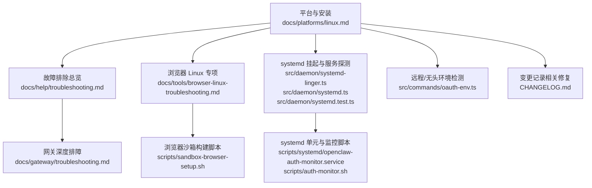
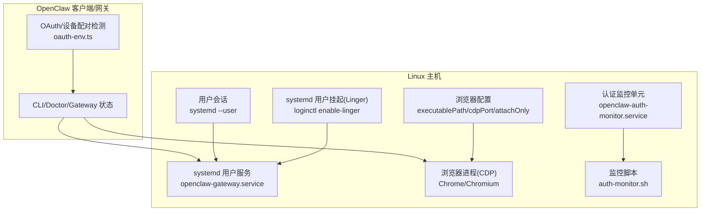
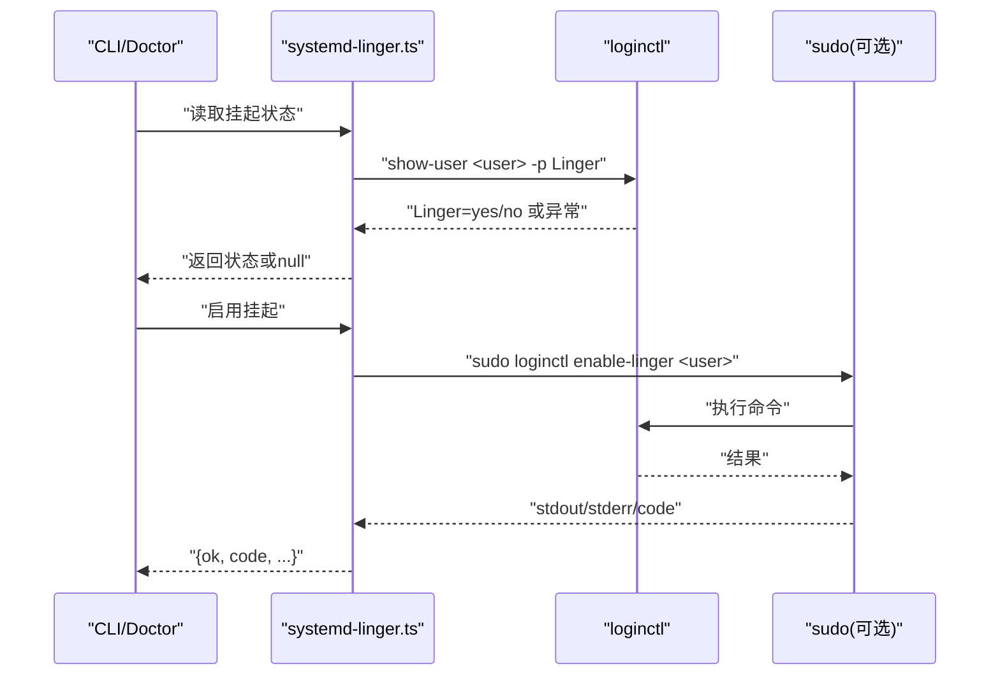
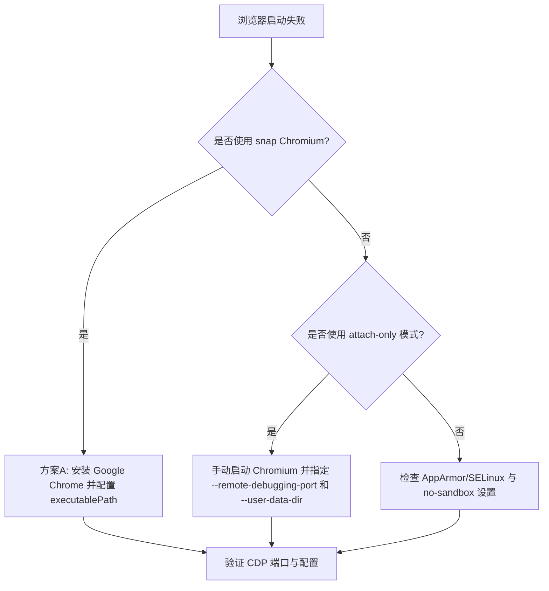
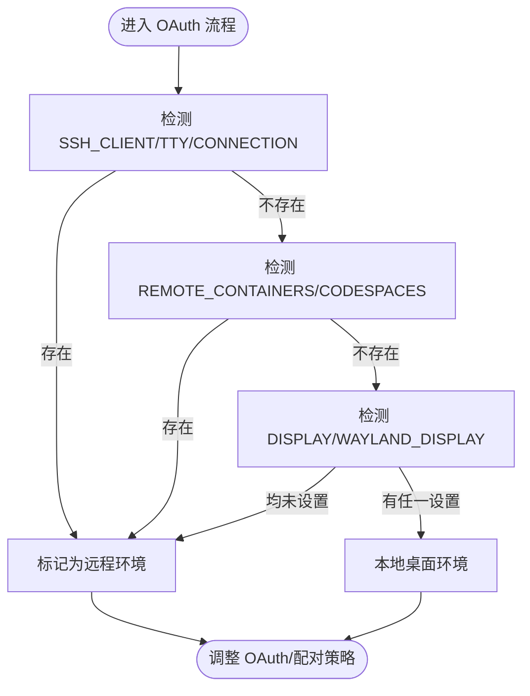
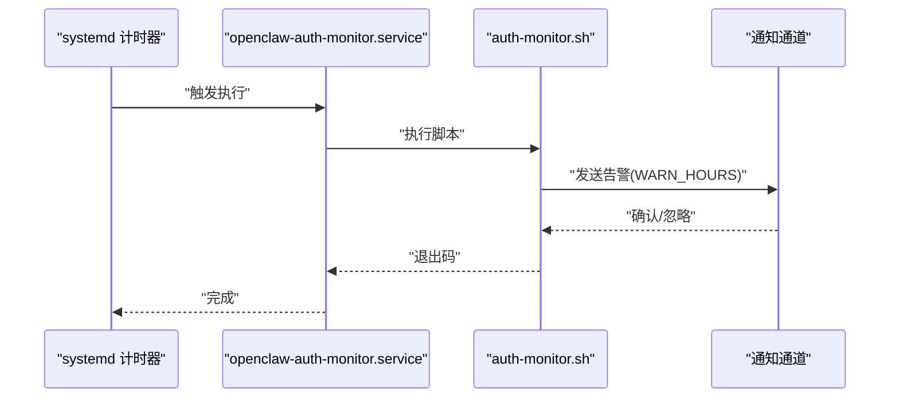
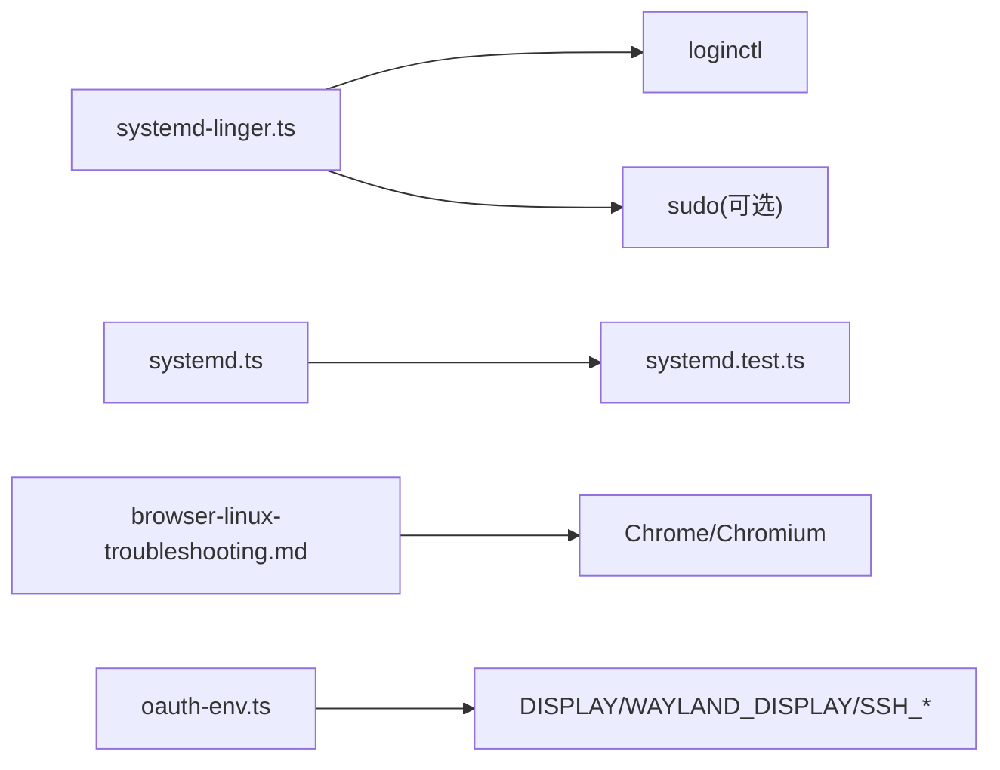

# Linux 平台问题

<cite>
**本文引用的文件**
- [docs/platforms/linux.md](file://docs/platforms/linux.md)
- [docs/help/troubleshooting.md](file://docs/help/troubleshooting.md)
- [docs/gateway/troubleshooting.md](file://docs/gateway/troubleshooting.md)
- [docs/tools/browser-linux-troubleshooting.md](file://docs/tools/browser-linux-troubleshooting.md)
- [src/daemon/systemd-linger.ts](file://src/daemon/systemd-linger.ts)
- [src/daemon/systemd.test.ts](file://src/daemon/systemd.test.ts)
- [src/daemon/systemd.ts](file://src/daemon/systemd.ts)
- [src/commands/oauth-env.ts](file://src/commands/oauth-env.ts)
- [scripts/systemd/openclaw-auth-monitor.service](file://scripts/systemd/openclaw-auth-monitor.service)
- [scripts/auth-monitor.sh](file://scripts/auth-monitor.sh)
- [scripts/sandbox-browser-setup.sh](file://scripts/sandbox-browser-setup.sh)
- [CHANGELOG.md](file://CHANGELOG.md)
</cite>

## 目录
1. [简介](#简介)
2. [项目结构](#项目结构)
3. [核心组件](#核心组件)
4. [架构总览](#架构总览)
5. [详细组件分析](#详细组件分析)
6. [依赖关系分析](#依赖关系分析)
7. [性能考虑](#性能考虑)
8. [故障排除指南](#故障排除指南)
9. [结论](#结论)
10. [附录](#附录)

## 简介
本指南聚焦于 Linux 平台上的 OpenClaw 使用与运维问题，覆盖发行版兼容性、包管理器安装、systemd 用户服务与挂起（linger）机制、权限与安全、桌面环境与显示协议（X11/Wayland）、浏览器控制（CDP）在 Linux 上的常见问题，以及服务启动失败、权限不足、端口占用、文件系统权限等典型故障的排查与修复路径。文档同时提供 systemd 单元文件配置示例、日志分析思路与性能优化建议。

## 项目结构
围绕 Linux 平台的关键文档与实现分布在以下位置：
- 平台与安装：docs/platforms/linux.md
- 故障排除总览：docs/help/troubleshooting.md
- 网关深度排障：docs/gateway/troubleshooting.md
- 浏览器 Linux 专项：docs/tools/browser-linux-troubleshooting.md
- systemd 与挂起：src/daemon/systemd-linger.ts、src/daemon/systemd.ts、src/daemon/systemd.test.ts
- systemd 单元与监控脚本：scripts/systemd/openclaw-auth-monitor.service、scripts/auth-monitor.sh
- 浏览器沙箱构建脚本：scripts/sandbox-browser-setup.sh
- 远程/无头环境检测：src/commands/oauth-env.ts
- 变更记录中的相关修复与加固：CHANGELOG.md



**图表来源**
- [docs/platforms/linux.md:1-95](file://docs/platforms/linux.md#L1-L95)
- [docs/help/troubleshooting.md:1-299](file://docs/help/troubleshooting.md#L1-L299)
- [docs/gateway/troubleshooting.md:1-380](file://docs/gateway/troubleshooting.md#L1-L380)
- [docs/tools/browser-linux-troubleshooting.md:1-140](file://docs/tools/browser-linux-troubleshooting.md#L1-L140)
- [src/daemon/systemd-linger.ts:1-73](file://src/daemon/systemd-linger.ts#L1-L73)
- [src/daemon/systemd.ts:268-309](file://src/daemon/systemd.ts#L268-L309)
- [src/daemon/systemd.test.ts:311-343](file://src/daemon/systemd.test.ts#L311-L343)
- [scripts/systemd/openclaw-auth-monitor.service:1-15](file://scripts/systemd/openclaw-auth-monitor.service#L1-L15)
- [scripts/auth-monitor.sh](file://scripts/auth-monitor.sh)
- [scripts/sandbox-browser-setup.sh:1-8](file://scripts/sandbox-browser-setup.sh#L1-L8)
- [src/commands/oauth-env.ts:1-22](file://src/commands/oauth-env.ts#L1-L22)
- [CHANGELOG.md](file://CHANGELOG.md)

**章节来源**
- [docs/platforms/linux.md:1-95](file://docs/platforms/linux.md#L1-L95)
- [docs/help/troubleshooting.md:1-299](file://docs/help/troubleshooting.md#L1-L299)
- [docs/gateway/troubleshooting.md:1-380](file://docs/gateway/troubleshooting.md#L1-L380)
- [docs/tools/browser-linux-troubleshooting.md:1-140](file://docs/tools/browser-linux-troubleshooting.md#L1-L140)
- [src/daemon/systemd-linger.ts:1-73](file://src/daemon/systemd-linger.ts#L1-L73)
- [src/daemon/systemd.ts:268-309](file://src/daemon/systemd.ts#L268-L309)
- [src/daemon/systemd.test.ts:311-343](file://src/daemon/systemd.test.ts#L311-L343)
- [scripts/systemd/openclaw-auth-monitor.service:1-15](file://scripts/systemd/openclaw-auth-monitor.service#L1-L15)
- [scripts/auth-monitor.sh](file://scripts/auth-monitor.sh)
- [scripts/sandbox-browser-setup.sh:1-8](file://scripts/sandbox-browser-setup.sh#L1-L8)
- [src/commands/oauth-env.ts:1-22](file://src/commands/oauth-env.ts#L1-L22)
- [CHANGELOG.md](file://CHANGELOG.md)

## 核心组件
- systemd 用户服务与挂起（Linger）
  - 读取当前用户的 systemd 用户会话状态，判断是否启用“挂起”以允许无登录状态下的长期运行。
  - 提供启用挂起的能力，并处理 sudo 权限与非交互模式。
- systemd 服务探测与错误分类
  - 对 systemctl 命令缺失、未启用、dbus 总线不可达等场景进行区分，避免误判为真实服务问题。
- 浏览器控制（Linux）
  - 针对 snap 包装的 Chromium 的 AppArmor 限制导致的 CDP 启动失败给出替代方案与 attach-only 模式。
- 远程/无头环境检测
  - 在 Linux 且无 X11/Wayland 显示变量时判定为远程/无头环境，指导后续行为（如 OAuth 流程）。
- systemd 单元与认证监控
  - 提供一次性任务单元用于认证过期预警，配合监控脚本执行通知。

**章节来源**
- [src/daemon/systemd-linger.ts:1-73](file://src/daemon/systemd-linger.ts#L1-L73)
- [src/daemon/systemd.ts:268-309](file://src/daemon/systemd.ts#L268-L309)
- [src/commands/oauth-env.ts:1-22](file://src/commands/oauth-env.ts#L1-L22)
- [scripts/systemd/openclaw-auth-monitor.service:1-15](file://scripts/systemd/openclaw-auth-monitor.service#L1-L15)

## 架构总览
下图展示 Linux 平台上 OpenClaw 的关键组件与外部系统交互：



**图表来源**
- [docs/platforms/linux.md:65-95](file://docs/platforms/linux.md#L65-L95)
- [src/daemon/systemd-linger.ts:46-73](file://src/daemon/systemd-linger.ts#L46-L73)
- [src/daemon/systemd.ts:268-309](file://src/daemon/systemd.ts#L268-L309)
- [docs/tools/browser-linux-troubleshooting.md:1-140](file://docs/tools/browser-linux-troubleshooting.md#L1-L140)
- [src/commands/oauth-env.ts:1-22](file://src/commands/oauth-env.ts#L1-L22)
- [scripts/systemd/openclaw-auth-monitor.service:1-15](file://scripts/systemd/openclaw-auth-monitor.service#L1-L15)
- [scripts/auth-monitor.sh](file://scripts/auth-monitor.sh)

## 详细组件分析

### systemd 用户服务与挂起（Linger）
- 功能要点
  - 解析当前用户，调用 loginctl 查询/设置挂起状态。
  - 支持 sudo 提权与非交互模式，避免阻塞自动化流程。
  - 返回执行结果与退出码，便于上层诊断。
- 典型问题
  - 无用户会话或 loginctl 不可用：返回空状态，不视为致命错误。
  - 权限不足：通过 sudo 参数提升，必要时使用非交互模式。
- 适用场景
  - 无图形登录但需要保持服务运行；容器或无头服务器。



**图表来源**
- [src/daemon/systemd-linger.ts:21-73](file://src/daemon/systemd-linger.ts#L21-L73)

**章节来源**
- [src/daemon/systemd-linger.ts:1-73](file://src/daemon/systemd-linger.ts#L1-L73)

### systemd 服务探测与错误分类
- 功能要点
  - 将 systemctl 缺失、未启用、dbus 总线不可达等错误进行分类，避免误报为服务安装失败。
  - 针对 Ubuntu 新装场景，处理 is-enabled 返回码 4 的“not-found”情形。
- 典型问题
  - 容器内缺少 systemctl：按“不可用”处理，不中断安装流程。
  - 用户总线不可达：区分“可达但降级”与“完全不可达”，分别报告。
- 修复与加固
  - 变更记录中多次强调对 systemd 探测的健壮性改进，确保首次安装与 WSL 环境稳定。

```mermaid
flowchart TD
Start(["开始探测"]) --> CheckCtl["检查 systemctl 是否存在"]
CheckCtl --> |不存在| Unavailable["标记为不可用"]
CheckCtl --> |存在| IsEnabled["systemctl --user is-enabled"]
IsEnabled --> Found{"返回码/输出解析"}
Found --> |未启用/屏蔽/掩码| NotEnabled["标记为未启用"]
Found --> |not-found(4)| TreatAsDisabled["按未启用处理"]
Found --> |成功| OK["服务已启用"]
Found --> |总线不可达| BusErr["分类为总线错误"]
Unavailable --> End(["结束"])
NotEnabled --> End
TreatAsDisabled --> End
OK --> End
BusErr --> End
```

**图表来源**
- [src/daemon/systemd.ts:268-309](file://src/daemon/systemd.ts#L268-L309)
- [src/daemon/systemd.test.ts:311-343](file://src/daemon/systemd.test.ts#L311-L343)

**章节来源**
- [src/daemon/systemd.ts:268-309](file://src/daemon/systemd.ts#L268-L309)
- [src/daemon/systemd.test.ts:311-343](file://src/daemon/systemd.test.ts#L311-L343)
- [CHANGELOG.md](file://CHANGELOG.md)

### 浏览器控制（Linux）与 snap 包装问题
- 问题定位
  - Ubuntu 默认的 Chromium 是 snap 包装，AppArmor 限制导致 CDP 启动失败。
- 解决方案
  - 安装官方 Google Chrome，配置 executablePath 指向非 snap 版本。
  - 若必须使用 snap Chromium，启用 attach-only 模式，手动启动浏览器并指定调试端口与用户数据目录。
- systemd 自动化
  - 可编写用户服务单元自动启动 snap Chromium，便于无人值守场景。



**图表来源**
- [docs/tools/browser-linux-troubleshooting.md:1-140](file://docs/tools/browser-linux-troubleshooting.md#L1-L140)

**章节来源**
- [docs/tools/browser-linux-troubleshooting.md:1-140](file://docs/tools/browser-linux-troubleshooting.md#L1-L140)

### 远程/无头环境检测与 OAuth 行为
- 行为说明
  - 在 Linux 且 DISPLAY/WAYLAND_DISPLAY 均未设置时，判定为远程/无头环境，影响 OAuth 与设备配对流程的行为选择。
- 实现入口
  - isRemoteEnvironment 判定逻辑结合 SSH 环境变量与容器标识。



**图表来源**
- [src/commands/oauth-env.ts:1-22](file://src/commands/oauth-env.ts#L1-L22)

**章节来源**
- [src/commands/oauth-env.ts:1-22](file://src/commands/oauth-env.ts#L1-L22)

### systemd 单元文件与认证监控
- 单元文件
  - 提供用户服务单元示例，描述如何启用与运行 openclaw-gateway。
- 认证监控
  - 一次性任务单元 openclaw-auth-monitor.service，配合 auth-monitor.sh 脚本在认证过期前发出告警。



**图表来源**
- [scripts/systemd/openclaw-auth-monitor.service:1-15](file://scripts/systemd/openclaw-auth-monitor.service#L1-L15)
- [scripts/auth-monitor.sh](file://scripts/auth-monitor.sh)

**章节来源**
- [scripts/systemd/openclaw-auth-monitor.service:1-15](file://scripts/systemd/openclaw-auth-monitor.service#L1-L15)
- [scripts/auth-monitor.sh](file://scripts/auth-monitor.sh)

## 依赖关系分析
- 组件耦合
  - systemd-linger.ts 依赖 loginctl 与 sudo（可选），与上层 CLI/Doctor 解耦。
  - systemd.ts 的错误分类与测试用例共同保证探测逻辑的稳定性。
  - 浏览器控制依赖浏览器二进制与 CDP 端口配置，与 snap/AppArmor 等系统约束强相关。
  - oauth-env.ts 仅依赖环境变量与平台信息，逻辑简单清晰。
- 外部依赖
  - systemd 用户总线、dbus、loginctl、snap 包装器、浏览器二进制路径等。



**图表来源**
- [src/daemon/systemd-linger.ts:1-73](file://src/daemon/systemd-linger.ts#L1-L73)
- [src/daemon/systemd.ts:268-309](file://src/daemon/systemd.ts#L268-L309)
- [src/daemon/systemd.test.ts:311-343](file://src/daemon/systemd.test.ts#L311-L343)
- [docs/tools/browser-linux-troubleshooting.md:1-140](file://docs/tools/browser-linux-troubleshooting.md#L1-L140)
- [src/commands/oauth-env.ts:1-22](file://src/commands/oauth-env.ts#L1-L22)

**章节来源**
- [src/daemon/systemd-linger.ts:1-73](file://src/daemon/systemd-linger.ts#L1-L73)
- [src/daemon/systemd.ts:268-309](file://src/daemon/systemd.ts#L268-L309)
- [src/daemon/systemd.test.ts:311-343](file://src/daemon/systemd.test.ts#L311-L343)
- [docs/tools/browser-linux-troubleshooting.md:1-140](file://docs/tools/browser-linux-troubleshooting.md#L1-L140)
- [src/commands/oauth-env.ts:1-22](file://src/commands/oauth-env.ts#L1-L22)

## 性能考虑
- systemd 服务重启与监听清理
  - 在服务重启前后显式清理监听与端口，减少僵尸进程与资源泄漏。
- 浏览器 CDP 端口与 no-sandbox
  - 在部分 Linux 发行版上启用 no-sandbox 可降低启动失败概率，但需评估安全影响。
- SELinux 与容器挂载
  - 在 Fedora/RHEL 等 SELinux 强制模式主机上，使用 :Z 标记修正挂载权限，避免 EACCES。

**章节来源**
- [CHANGELOG.md](file://CHANGELOG.md)

## 故障排除指南

### 通用三分钟快速诊断
- 命令顺序
  - openclaw status
  - openclaw status --all
  - openclaw gateway probe
  - openclaw gateway status
  - openclaw doctor
  - openclaw channels status --probe
  - openclaw logs --follow
- 期望信号
  - 所有命令输出健康，无重复致命错误，RPC 探针正常。

**章节来源**
- [docs/help/troubleshooting.md:13-36](file://docs/help/troubleshooting.md#L13-L36)

### 网关服务未运行/启动失败
- 常见原因
  - 本地模式未启用、绑定地址非回环且未配置认证、端口被占用。
- 排查步骤
  - 检查 gateway.mode、bind、auth 配置与 RPC 探针。
  - 使用 doctor 与 deep 状态进一步定位。
- 修复建议
  - 设置本地模式或配置共享令牌/设备配对。
  - 更换端口或释放占用进程。

**章节来源**
- [docs/gateway/troubleshooting.md:152-181](file://docs/gateway/troubleshooting.md#L152-L181)

### 系统服务（systemd）相关问题
- systemctl 缺失/不可用
  - 在容器或最小环境，按“不可用”处理，不阻断安装流程。
- 服务未启用/屏蔽/掩码
  - 分类识别后提示用户启用或修复单元文件。
- dbus 总线不可达
  - 降级为“可达但受限”或“完全不可达”，分别报告并引导修复。

**章节来源**
- [src/daemon/systemd.ts:268-309](file://src/daemon/systemd.ts#L268-L309)
- [src/daemon/systemd.test.ts:311-343](file://src/daemon/systemd.test.ts#L311-L343)

### 权限与文件系统问题
- 文件权限
  - 配置备份轮转后保留所有者仅读权限，清理过期 .bak.* 文件，降低凭据泄露风险。
- SELinux 与挂载
  - 在强制模式主机使用 :Z 标记修正 bind mount 权限，避免 EACCES。

**章节来源**
- [CHANGELOG.md](file://CHANGELOG.md)

### 端口占用与绑定问题
- 现象
  - “另一个网关实例已在监听”或 EADDRINUSE。
- 处理
  - 更换端口或终止占用进程；确保非回环绑定已配置认证。

**章节来源**
- [docs/gateway/troubleshooting.md:170-175](file://docs/gateway/troubleshooting.md#L170-L175)

### 浏览器工具在 Linux 上失败
- 常见症状
  - “无法在端口启动 Chrome CDP”、“找不到浏览器可执行文件”、“扩展中继已运行但无标签连接”。
- 解决方案
  - 安装官方 Google Chrome 替代 snap 包装的 Chromium。
  - 使用 attach-only 模式手动启动浏览器并指定调试端口与用户数据目录。
  - 如需扩展中继，确保已安装扩展并在目标标签页激活。

**章节来源**
- [docs/tools/browser-linux-troubleshooting.md:1-140](file://docs/tools/browser-linux-troubleshooting.md#L1-L140)

### 远程/无头环境与 OAuth
- 现象
  - 在无 X11/Wayland 的 Linux 环境中，OAuth/设备配对流程可能需要调整。
- 处理
  - 使用 isRemoteEnvironment 判定逻辑，采用适合的配对方式（如设备令牌重试）。

**章节来源**
- [src/commands/oauth-env.ts:1-22](file://src/commands/oauth-env.ts#L1-L22)

### systemd 单元配置与认证监控
- 单元文件
  - 参考平台文档中的用户服务示例，启用并运行 openclaw-gateway。
- 认证监控
  - 使用 openclaw-auth-monitor.service 与 auth-monitor.sh 在认证过期前告警，配置 WARN_HOURS 与通知渠道。

**章节来源**
- [docs/platforms/linux.md:65-95](file://docs/platforms/linux.md#L65-L95)
- [scripts/systemd/openclaw-auth-monitor.service:1-15](file://scripts/systemd/openclaw-auth-monitor.service#L1-L15)
- [scripts/auth-monitor.sh](file://scripts/auth-monitor.sh)

## 结论
Linux 平台上的 OpenClaw 使用与运维主要围绕 systemd 用户服务、挂起（Linger）机制、浏览器 CDP 启动、远程/无头环境检测与权限/SELinux 等方面展开。通过标准化的诊断命令、健壮的 systemd 探测与错误分类、针对 snap 包装 Chromium 的替代方案，以及完善的认证监控与日志分析流程，可以高效定位并修复大多数平台相关问题。建议在生产环境中结合 SELinux 标记、严格的文件权限与合理的 systemd 单元配置，确保服务稳定与安全。

## 附录
- 相关变更记录要点（节选）
  - systemd 探测健壮性改进，处理 Ubuntu 新装与 WSL 场景。
  - 浏览器沙箱镜像构建脚本，便于隔离与复现。
  - SELinux 强制模式下的 bind mount 标记修正，减少 EACCES。

**章节来源**
- [CHANGELOG.md](file://CHANGELOG.md)
- [scripts/sandbox-browser-setup.sh:1-8](file://scripts/sandbox-browser-setup.sh#L1-L8)