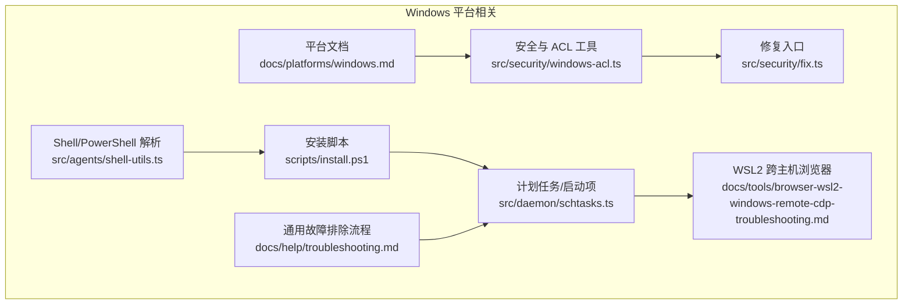
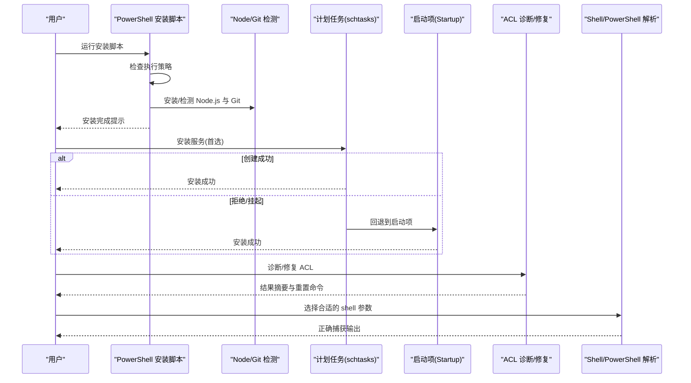
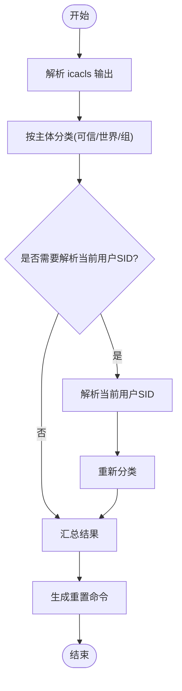
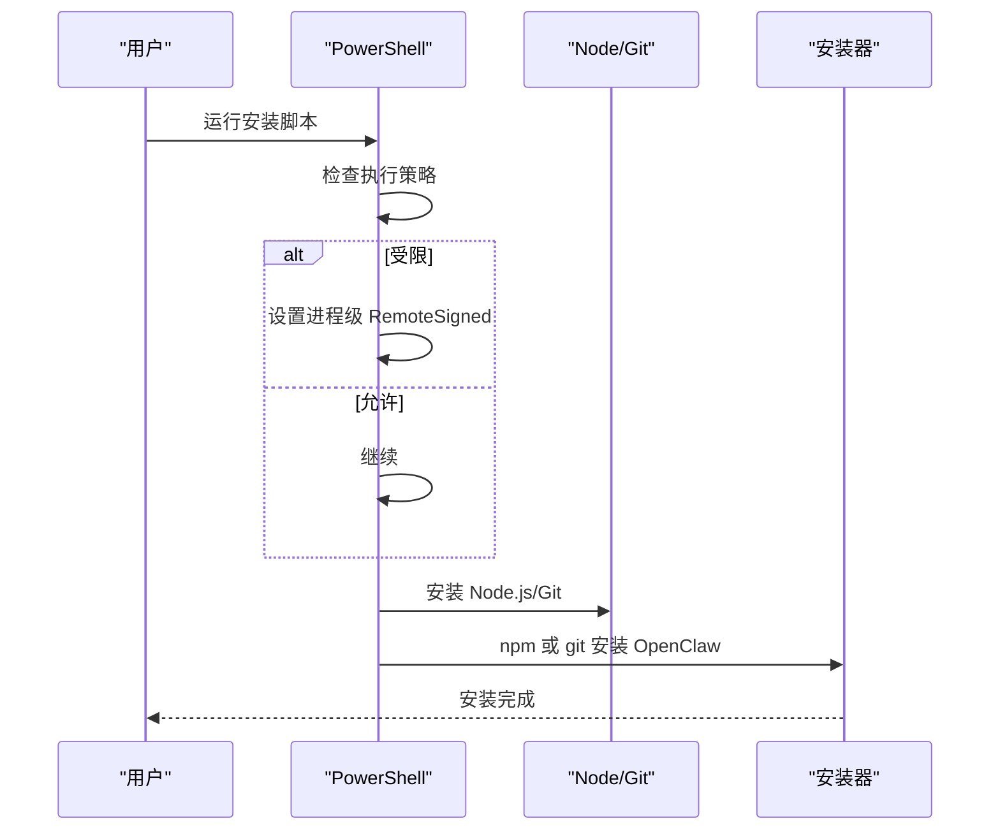
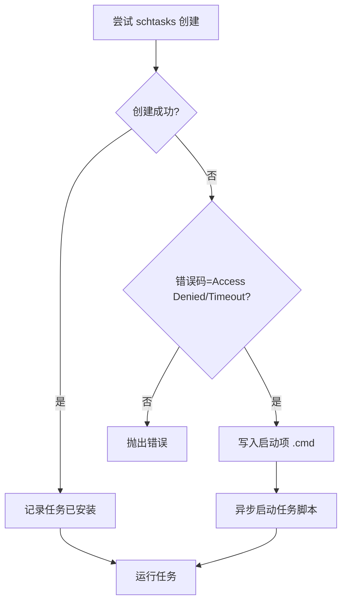
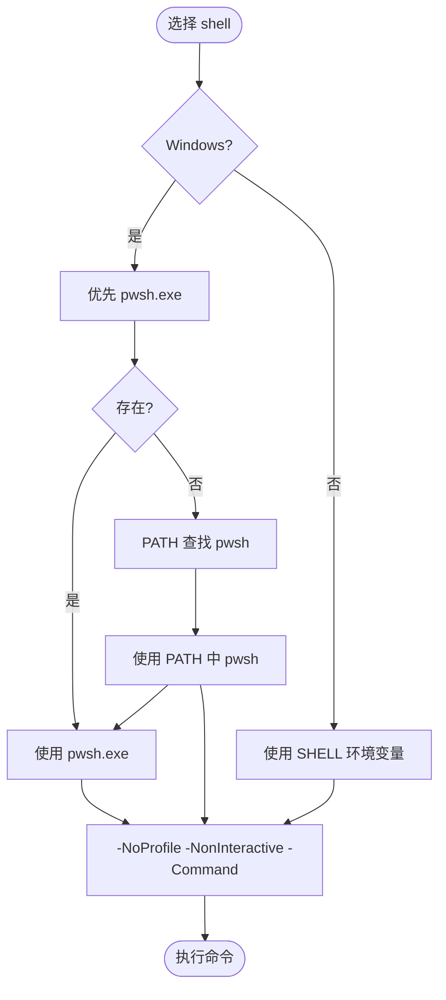
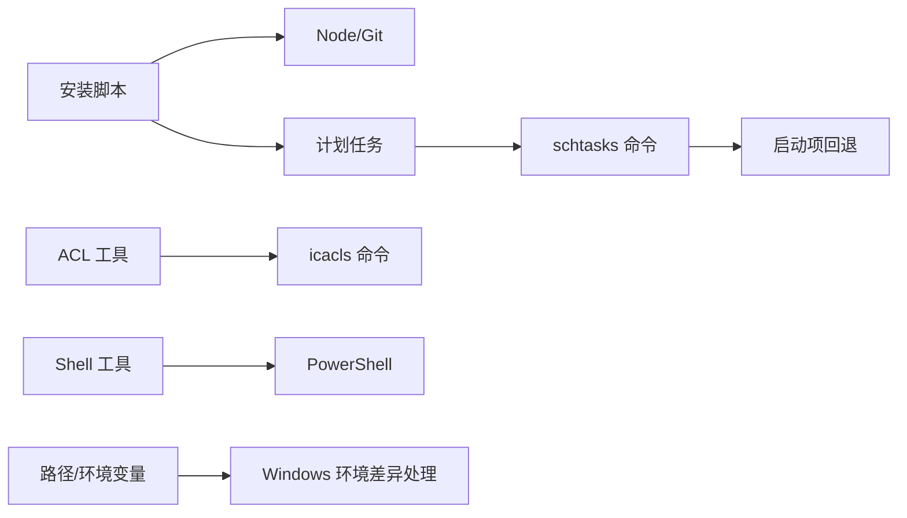

# Windows 平台问题

<cite>
**本文引用的文件**
- [windows.md](file://docs/platforms/windows.md)
- [windows-acl.ts](file://src/security/windows-acl.ts)
- [fix.ts](file://src/security/fix.ts)
- [shell-utils.ts](file://src/agents/shell-utils.ts)
- [install.ps1](file://scripts/install.ps1)
- [schtasks.ts](file://src/daemon/schtasks.ts)
- [schtasks.startup-fallback.test.ts](file://src/daemon/schtasks.startup-fallback.test.ts)
- [path-prepend.ts](file://src/infra/path-prepend.ts)
- [windows-spawn.ts](file://src/plugin-sdk/windows-spawn.ts)
- [browser-wsl2-windows-remote-cdp-troubleshooting.md](file://docs/tools/browser-wsl2-windows-remote-cdp-troubleshooting.md)
- [troubleshooting.md](file://docs/help/troubleshooting.md)
</cite>

## 目录
1. [简介](#简介)
2. [项目结构](#项目结构)
3. [核心组件](#核心组件)
4. [架构总览](#架构总览)
5. [详细组件分析](#详细组件分析)
6. [依赖关系分析](#依赖关系分析)
7. [性能考量](#性能考量)
8. [故障排除指南](#故障排除指南)
9. [结论](#结论)
10. [附录](#附录)

## 简介
本指南聚焦于 Windows 平台特有的问题与排障实践，覆盖权限模型（ACL/icacls）、UAC 提升、服务安装与启动项回退、防火墙与端口转发、PowerShell 执行策略、Node.js 与包管理器版本要求、WSL2 与 Windows 的跨主机浏览器控制、以及常见 DLL/路径/环境变量问题。内容基于仓库中与 Windows 相关的实现与文档，帮助用户在 Windows 上稳定运行 OpenClaw。

## 项目结构
与 Windows 相关的关键位置包括：
- 平台文档：docs/platforms/windows.md
- 安全与 ACL 工具：src/security/windows-acl.ts、src/security/fix.ts
- Shell 与 PowerShell 解析：src/agents/shell-utils.ts、scripts/install.ps1
- 计划任务与启动项：src/daemon/schtasks.ts、src/daemon/schtasks.startup-fallback.test.ts
- 路径与环境变量：src/infra/path-prepend.ts、src/plugin-sdk/windows-spawn.ts
- WSL2 与 Windows 浏览器联动：docs/tools/browser-wsl2-windows-remote-cdp-troubleshooting.md
- 通用故障排除流程：docs/help/troubleshooting.md

图表来源
- [windows.md:1-242](file://docs/platforms/windows.md#L1-L242)
- [windows-acl.ts:1-364](file://src/security/windows-acl.ts#L1-L364)
- [fix.ts:1-41](file://src/security/fix.ts#L1-L41)
- [shell-utils.ts:1-193](file://src/agents/shell-utils.ts#L1-L193)
- [install.ps1:1-360](file://scripts/install.ps1#L1-L360)
- [schtasks.ts:76-654](file://src/daemon/schtasks.ts#L76-L654)
- [browser-wsl2-windows-remote-cdp-troubleshooting.md:1-243](file://docs/tools/browser-wsl2-windows-remote-cdp-troubleshooting.md#L1-L243)
- [troubleshooting.md:1-299](file://docs/help/troubleshooting.md#L1-L299)

章节来源
- [windows.md:1-242](file://docs/platforms/windows.md#L1-L242)
- [windows-acl.ts:1-364](file://src/security/windows-acl.ts#L1-L364)
- [fix.ts:1-41](file://src/security/fix.ts#L1-L41)
- [shell-utils.ts:1-193](file://src/agents/shell-utils.ts#L1-L193)
- [install.ps1:1-360](file://scripts/install.ps1#L1-L360)
- [schtasks.ts:76-654](file://src/daemon/schtasks.ts#L76-L654)
- [browser-wsl2-windows-remote-cdp-troubleshooting.md:1-243](file://docs/tools/browser-wsl2-windows-remote-cdp-troubleshooting.md#L1-L243)
- [troubleshooting.md:1-299](file://docs/help/troubleshooting.md#L1-L299)

## 核心组件
- Windows ACL 分析与重置
  - 解析并分类 ACL 条目，识别可信主体、世界访问与组访问；支持以 SID 输出规避本地化名称问题；提供格式化命令用于重置权限。
- 安全修复入口
  - 将 ACL 修复与 chmod/icacls 行为抽象为统一结果类型，便于诊断与回滚。
- Shell/PowerShell 自动选择与输出净化
  - 在 Windows 上优先选择 PowerShell 7，回退到 Windows PowerShell 5.1；对二进制输出进行清洗，避免控制字符干扰。
- 安装脚本与执行策略
  - 检测并临时放宽执行策略，自动安装 Node.js 与 Git，支持 npm 与 git 两种安装方式，并处理 PATH 注入。
- 计划任务与启动项回退
  - 优先使用计划任务；当 schtasks 创建被拒绝或挂起时，回退到当前用户的“启动”文件夹登录项，确保开机自启。
- 路径与环境变量
  - 处理 Windows 上 PATH 键大小写差异（Path/PATH），合并去重并保持顺序；解析可执行文件时考虑 PATHEXT。
- WSL2 与 Windows 联动
  - 提供从 WSL2 访问 Windows Chrome CDP 的分层验证流程与端口转发建议。

章节来源
- [windows-acl.ts:1-364](file://src/security/windows-acl.ts#L1-L364)
- [fix.ts:1-41](file://src/security/fix.ts#L1-L41)
- [shell-utils.ts:1-193](file://src/agents/shell-utils.ts#L1-L193)
- [install.ps1:1-360](file://scripts/install.ps1#L1-L360)
- [schtasks.ts:76-654](file://src/daemon/schtasks.ts#L76-L654)
- [path-prepend.ts:1-79](file://src/infra/path-prepend.ts#L1-L79)
- [windows-spawn.ts:60-97](file://src/plugin-sdk/windows-spawn.ts#L60-L97)
- [browser-wsl2-windows-remote-cdp-troubleshooting.md:1-243](file://docs/tools/browser-wsl2-windows-remote-cdp-troubleshooting.md#L1-L243)

## 架构总览
下图展示 Windows 平台关键流程：安装脚本负责执行策略与依赖检测，随后通过计划任务或启动项实现服务自启；安全模块负责 ACL 诊断与修复；Shell 工具保证在 Windows 上使用合适的 shell 与参数；WSL2 场景下提供浏览器 CDP 与端口转发的分层验证。

图表来源
- [install.ps1:42-80](file://scripts/install.ps1#L42-L80)
- [schtasks.ts:570-623](file://src/daemon/schtasks.ts#L570-L623)
- [schtasks.startup-fallback.test.ts:90-123](file://src/daemon/schtasks.startup-fallback.test.ts#L90-L123)
- [windows-acl.ts:280-319](file://src/security/windows-acl.ts#L280-L319)
- [shell-utils.ts:42-70](file://src/agents/shell-utils.ts#L42-L70)

## 详细组件分析

### Windows ACL 分析与重置
- 功能要点
  - 解析 icacls 输出，剥离目标前缀，提取主体与权限令牌，过滤继承标志，计算读写能力。
  - 本地化系统账户名与 SID 映射，确保非英语系统也能正确分类。
  - 支持以 SID 输出规避编码问题；必要时补充当前用户 SID 再次分类。
  - 提供格式化命令字符串与结构化参数，便于生成可执行的重置命令。
- 典型用法
  - 诊断：调用 inspectWindowsAcl 获取条目与分类结果。
  - 修复：根据返回摘要生成重置命令，恢复受控权限。
- 关键接口路径
  - [parseIcaclsOutput:213-247](file://src/security/windows-acl.ts#L213-L247)
  - [summarizeWindowsAcl:249-268](file://src/security/windows-acl.ts#L249-L268)
  - [inspectWindowsAcl:280-319](file://src/security/windows-acl.ts#L280-L319)
  - [formatIcaclsResetCommand:332-339](file://src/security/windows-acl.ts#L332-L339)
  - [createIcaclsResetCommand:341-363](file://src/security/windows-acl.ts#L341-L363)

图表来源
- [windows-acl.ts:213-319](file://src/security/windows-acl.ts#L213-L319)

章节来源
- [windows-acl.ts:1-364](file://src/security/windows-acl.ts#L1-L364)
- [fix.ts:1-41](file://src/security/fix.ts#L1-L41)

### 安装脚本与执行策略
- 功能要点
  - 检测当前进程执行策略，若受限则尝试设置为 RemoteSigned（进程级）；否则提示管理员级设置。
  - 自动安装 Node.js（优先 winget/choco/scoop），检测 Git，支持 npm 与 git 两种安装路径。
  - 安装后尝试将 npm 全局 bin 目录加入用户 PATH。
- 关键接口路径
  - [Ensure-ExecutionPolicy:56-80](file://scripts/install.ps1#L56-L80)
  - [Ensure-Node:151-162](file://scripts/install.ps1#L151-L162)
  - [Ensure-Git:193-200](file://scripts/install.ps1#L193-L200)
  - [Install-OpenClawNpm:202-218](file://scripts/install.ps1#L202-L218)
  - [Install-OpenClawGit:220-260](file://scripts/install.ps1#L220-L260)

图表来源
- [install.ps1:56-80](file://scripts/install.ps1#L56-L80)
- [install.ps1:151-162](file://scripts/install.ps1#L151-L162)
- [install.ps1:193-200](file://scripts/install.ps1#L193-L200)
- [install.ps1:202-218](file://scripts/install.ps1#L202-L218)
- [install.ps1:220-260](file://scripts/install.ps1#L220-L260)

章节来源
- [install.ps1:1-360](file://scripts/install.ps1#L1-L360)

### 计划任务与启动项回退
- 功能要点
  - 优先注册计划任务（ONLOGON，LIMITED 权限），失败时回退到当前用户“启动”文件夹中的 .cmd 启动器。
  - 对 schtasks 响应进行错误码判定，支持“访问被拒绝”与“超时”两类典型场景。
  - 启动器脚本最小化隐藏窗口并异步启动任务脚本。
- 关键接口路径
  - [installScheduledTask:570-623](file://src/daemon/schtasks.ts#L570-L623)
  - [shouldFallbackToStartupEntry:593-594](file://src/daemon/schtasks.ts#L593-L594)
  - [buildStartupLauncherScript:266-275](file://src/daemon/schtasks.ts#L266-L275)
  - [launchFallbackTaskScript:305-311](file://src/daemon/schtasks.ts#L305-L311)

图表来源
- [schtasks.ts:570-623](file://src/daemon/schtasks.ts#L570-L623)
- [schtasks.startup-fallback.test.ts:90-123](file://src/daemon/schtasks.startup-fallback.test.ts#L90-L123)

章节来源
- [schtasks.ts:76-654](file://src/daemon/schtasks.ts#L76-L654)
- [schtasks.startup-fallback.test.ts:1-130](file://src/daemon/schtasks.startup-fallback.test.ts#L1-L130)

### Shell/PowerShell 自动选择与输出净化
- 功能要点
  - Windows 上优先选择 PowerShell 7，其次 PATH 中的 pwsh，最后回退到 Windows PowerShell 5.1 的 powershell.exe。
  - 使用 -NoProfile -NonInteractive -Command 作为默认参数，提升输出捕获稳定性。
  - 对二进制输出进行格式与代理字符清理，保留必要的控制字符。
- 关键接口路径
  - [resolvePowerShellPath:5-40](file://src/agents/shell-utils.ts#L5-L40)
  - [getShellConfig:42-70](file://src/agents/shell-utils.ts#L42-L70)
  - [sanitizeBinaryOutput:147-168](file://src/agents/shell-utils.ts#L147-L168)

图表来源
- [shell-utils.ts:5-40](file://src/agents/shell-utils.ts#L5-L40)
- [shell-utils.ts:42-70](file://src/agents/shell-utils.ts#L42-L70)

章节来源
- [shell-utils.ts:1-193](file://src/agents/shell-utils.ts#L1-L193)

### 路径与环境变量处理
- 功能要点
  - Windows 上 PATH 键可能为 Path（大小写不敏感），需先查找实际键再读取与合并。
  - 合并时去重并保持顺序，避免重复条目导致搜索效率下降。
  - 解析可执行文件时考虑 PATHEXT，支持大小写扩展名匹配。
- 关键接口路径
  - [findPathKey:8-18](file://src/infra/path-prepend.ts#L8-L18)
  - [mergePathPrepend:40-57](file://src/infra/path-prepend.ts#L40-L57)
  - [applyPathPrepend:60-79](file://src/infra/path-prepend.ts#L60-L79)
  - [resolveCommandPath:60-92](file://src/plugin-sdk/windows-spawn.ts#L60-L92)

章节来源
- [path-prepend.ts:1-79](file://src/infra/path-prepend.ts#L1-L79)
- [windows-spawn.ts:60-97](file://src/plugin-sdk/windows-spawn.ts#L60-L97)

### WSL2 与 Windows 联动（浏览器 CDP）
- 功能要点
  - 分层验证：先在 Windows 验证 Chrome CDP 可达，再从 WSL2 验证可达性，最后检查 OpenClaw 配置与 Control UI 安全上下文。
  - 当跨命名空间使用扩展中继时，可通过 relayBindHost 控制绑定地址。
- 关键接口路径
  - [分层验证与建议:79-208](file://docs/tools/browser-wsl2-windows-remote-cdp-troubleshooting.md#L79-L208)

章节来源
- [browser-wsl2-windows-remote-cdp-troubleshooting.md:1-243](file://docs/tools/browser-wsl2-windows-remote-cdp-troubleshooting.md#L1-L243)

## 依赖关系分析
- 安装脚本依赖 Node/Git 环境，安装完成后通过计划任务或启动项实现服务自启。
- 计划任务模块依赖系统 schtasks 命令；当 schtasks 不可用时回退到启动项。
- ACL 工具依赖 icacls 输出解析；在非英语系统上通过 SID 输出规避本地化名称问题。
- Shell 工具在 Windows 上强制使用 PowerShell，避免 cmd.exe 管道捕获问题。
- 路径与环境变量模块处理 Windows 特有的 PATH/PATHEXT 差异。

图表来源
- [install.ps1:151-162](file://scripts/install.ps1#L151-L162)
- [schtasks.ts:570-623](file://src/daemon/schtasks.ts#L570-L623)
- [windows-acl.ts:280-319](file://src/security/windows-acl.ts#L280-L319)
- [shell-utils.ts:42-70](file://src/agents/shell-utils.ts#L42-L70)
- [path-prepend.ts:60-79](file://src/infra/path-prepend.ts#L60-L79)

章节来源
- [install.ps1:1-360](file://scripts/install.ps1#L1-L360)
- [schtasks.ts:76-654](file://src/daemon/schtasks.ts#L76-L654)
- [windows-acl.ts:1-364](file://src/security/windows-acl.ts#L1-L364)
- [shell-utils.ts:1-193](file://src/agents/shell-utils.ts#L1-L193)
- [path-prepend.ts:1-79](file://src/infra/path-prepend.ts#L1-L79)

## 性能考量
- 计划任务创建失败时回退到启动项，避免长时间阻塞；启动器采用异步启动，降低前台等待时间。
- ACL 解析仅在需要时解析当前用户 SID，减少不必要的系统调用。
- Shell 使用 PowerShell 以改善输出捕获稳定性，减少因控制台 API 导致的管道空输出问题。
- 路径合并与去重避免冗余搜索，PATHEXT 匹配减少多次尝试。

## 故障排除指南

### 权限模型与 ACL 修复
- 症状
  - 文件/目录存在世界可写或组可写条目，导致安全扫描告警。
- 排查步骤
  - 使用 ACL 诊断函数获取条目列表与分类摘要。
  - 若存在非可信主体的写权限，参考格式化重置命令生成器输出，构造 icacls 重置命令。
- 相关接口
  - [inspectWindowsAcl:280-319](file://src/security/windows-acl.ts#L280-L319)
  - [formatIcaclsResetCommand:332-339](file://src/security/windows-acl.ts#L332-L339)
  - [createIcaclsResetCommand:341-363](file://src/security/windows-acl.ts#L341-L363)

章节来源
- [windows-acl.ts:280-319](file://src/security/windows-acl.ts#L280-L319)
- [windows-acl.ts:332-363](file://src/security/windows-acl.ts#L332-L363)

### UAC 提升与执行策略
- 症状
  - 安装脚本无法运行或 npm 安装失败；PowerShell 报告受限执行策略。
- 排查步骤
  - 安装脚本会尝试将当前进程执行策略设为 RemoteSigned；若失败，提示以管理员身份设置 LocalMachine 策略。
  - 确认已安装 Node.js 22+ 与 Git，必要时通过 winget/choco/scoop 自动安装。
- 相关接口
  - [Ensure-ExecutionPolicy:56-80](file://scripts/install.ps1#L56-L80)
  - [Ensure-Node:151-162](file://scripts/install.ps1#L151-L162)
  - [Ensure-Git:193-200](file://scripts/install.ps1#L193-L200)

章节来源
- [install.ps1:56-80](file://scripts/install.ps1#L56-L80)
- [install.ps1:151-162](file://scripts/install.ps1#L151-L162)
- [install.ps1:193-200](file://scripts/install.ps1#L193-L200)

### 服务安装与启动项回退
- 症状
  - 计划任务创建被拒绝或 schtasks 挂起；服务未安装或无法启动。
- 排查步骤
  - 若 schtasks 返回“访问被拒绝”或“超时”，系统会自动在当前用户“启动”文件夹创建 .cmd 启动器并异步启动。
  - 检查启动项路径是否存在，确认任务脚本已生成。
- 相关接口
  - [installScheduledTask:570-623](file://src/daemon/schtasks.ts#L570-L623)
  - [shouldFallbackToStartupEntry:593-594](file://src/daemon/schtasks.ts#L593-L594)
  - [buildStartupLauncherScript:266-275](file://src/daemon/schtasks.ts#L266-L275)

章节来源
- [schtasks.ts:570-623](file://src/daemon/schtasks.ts#L570-L623)
- [schtasks.startup-fallback.test.ts:90-123](file://src/daemon/schtasks.startup-fallback.test.ts#L90-L123)

### 防火墙与端口转发（WSL2）
- 症状
  - 从 WSL2 无法访问 Windows 上的 Chrome CDP；或从 Windows 无法访问 WSL2 上的服务。
- 排查步骤
  - 先在各自主机验证端点可达性（curl /json/version 与 /json/list）。
  - 若需要跨主机访问，使用 netsh interface portproxy 添加 v4tov4 规则，并允许相应入站规则。
  - 注意 relayBindHost 的使用场景，避免不必要的暴露。
- 相关接口
  - [WSL2 跨主机浏览器故障排除:79-208](file://docs/tools/browser-wsl2-windows-remote-cdp-troubleshooting.md#L79-L208)

章节来源
- [browser-wsl2-windows-remote-cdp-troubleshooting.md:79-208](file://docs/tools/browser-wsl2-windows-remote-cdp-troubleshooting.md#L79-L208)

### PowerShell 与 CMD 命令行工具
- 症状
  - 在 PowerShell 中直接调用 npm/openclaw 报错；或输出被截断。
- 排查步骤
  - 使用 PowerShell 作为传输层，显式调用 .cmd 包装器；避免直接裸用 npm/openclaw。
  - 确保执行策略允许脚本运行；必要时设置进程级 RemoteSigned。
- 相关接口
  - [getShellConfig:42-70](file://src/agents/shell-utils.ts#L42-L70)
  - [Ensure-ExecutionPolicy:56-80](file://scripts/install.ps1#L56-L80)

章节来源
- [shell-utils.ts:42-70](file://src/agents/shell-utils.ts#L42-L70)
- [install.ps1:56-80](file://scripts/install.ps1#L56-L80)

### Windows 版本兼容性与 .NET 运行时
- 症状
  - 安装过程中提示缺少某些运行时或依赖。
- 排查步骤
  - 确认已满足 Node.js 22+ 要求；安装脚本会自动尝试安装 Node.js 与 Git。
  - 若涉及 .NET 相关组件，请确保系统具备对应运行时；本仓库主要依赖 Node 生态。
- 相关接口
  - [Ensure-Node:151-162](file://scripts/install.ps1#L151-L162)

章节来源
- [install.ps1:151-162](file://scripts/install.ps1#L151-L162)

### 常见 DLL 缺失、路径权限与环境变量
- 症状
  - 进程无法找到可执行文件；PATH 未包含所需目录；PATHEXT 未正确解析。
- 排查步骤
  - 使用路径合并工具确保 PATH 去重且顺序合理；在 Windows 上注意 Path 键大小写。
  - 解析命令时考虑 PATHEXT，支持大小写扩展名匹配。
- 相关接口
  - [applyPathPrepend:60-79](file://src/infra/path-prepend.ts#L60-L79)
  - [resolveCommandPath:60-92](file://src/plugin-sdk/windows-spawn.ts#L60-L92)

章节来源
- [path-prepend.ts:60-79](file://src/infra/path-prepend.ts#L60-L79)
- [windows-spawn.ts:60-92](file://src/plugin-sdk/windows-spawn.ts#L60-L92)

### 通用故障排除流程
- 症状
  - 任意功能异常，需要快速定位根因。
- 排查步骤
  - 按照通用故障排除页面的“首分钟”清单依次执行状态检查、探测、诊断与日志跟踪。
- 相关接口
  - [通用故障排除流程:17-25](file://docs/help/troubleshooting.md#L17-L25)

章节来源
- [troubleshooting.md:17-25](file://docs/help/troubleshooting.md#L17-L25)

## 结论
本指南围绕 Windows 平台的权限、执行策略、服务安装、防火墙与跨主机浏览器控制等关键问题提供了系统化的排障思路与操作指引。结合仓库中的 ACL 工具、安装脚本、计划任务与启动项回退、Shell/PowerShell 解析、路径与环境变量处理，以及 WSL2 与 Windows 的联动文档，用户可在 Windows 上更稳健地部署与运行 OpenClaw。

## 附录
- 快速参考
  - 安装脚本：检查执行策略、安装 Node.js/Git、npm/git 安装 OpenClaw。
  - 计划任务：优先 schtasks，失败回退启动项；确认启动器脚本与任务脚本。
  - ACL 修复：诊断条目与分类，生成重置命令。
  - Shell：使用 PowerShell 作为传输层，显式调用 .cmd 包装器。
  - 路径：注意 Windows PATH/PATHEXT 差异，合并去重。
  - WSL2：分层验证 Chrome CDP 可达性，必要时添加端口转发与防火墙规则。