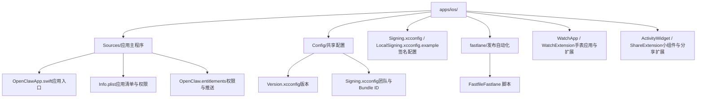
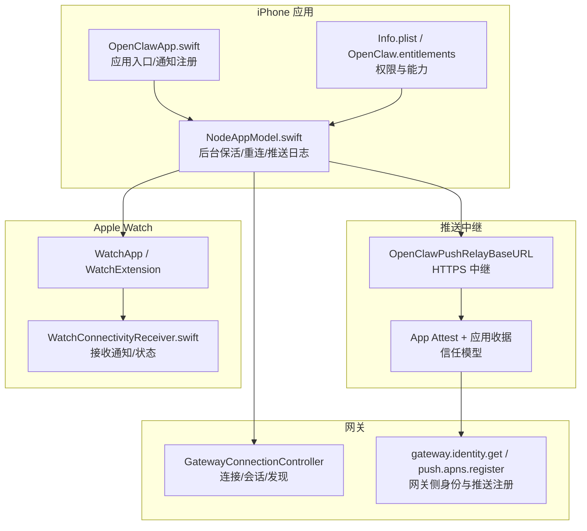
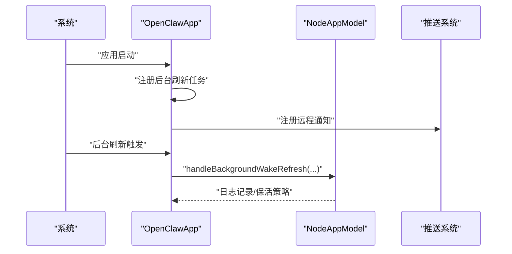
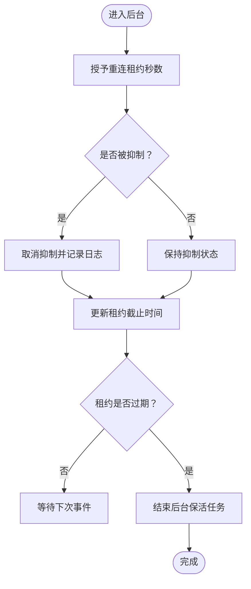
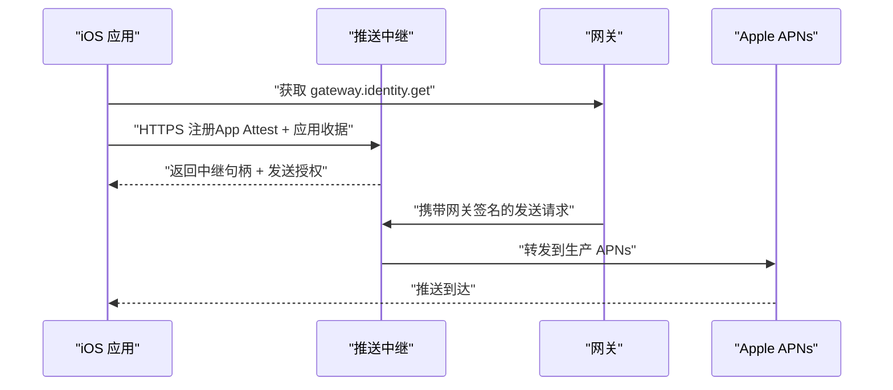
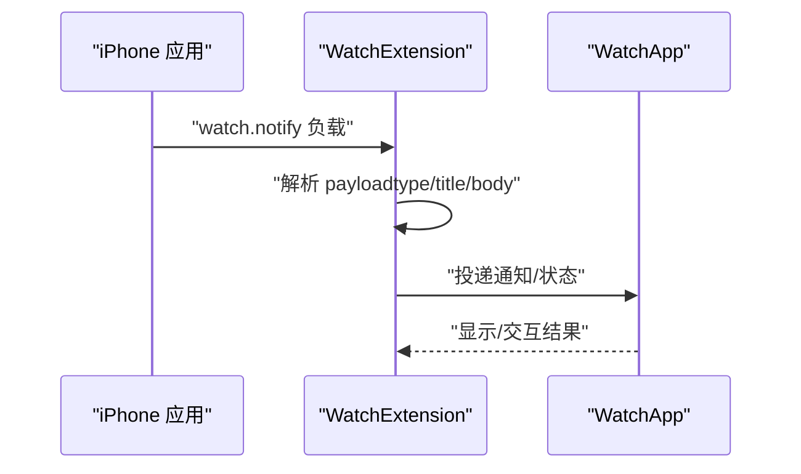
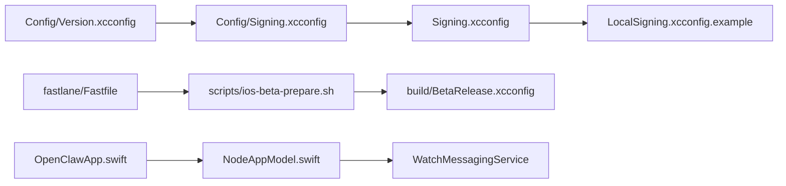

# iOS 平台问题

<cite>
**本文引用的文件**
- [apps/ios/README.md](file://apps/ios/README.md)
- [apps/ios/Signing.xcconfig](file://apps/ios/Signing.xcconfig)
- [apps/ios/LocalSigning.xcconfig.example](file://apps/ios/LocalSigning.xcconfig.example)
- [apps/ios/Config/Signing.xcconfig](file://apps/ios/Config/Signing.xcconfig)
- [apps/ios/Config/Version.xcconfig](file://apps/ios/Config/Version.xcconfig)
- [apps/ios/Sources/OpenClaw.entitlements](file://apps/ios/Sources/OpenClaw.entitlements)
- [apps/ios/Sources/Info.plist](file://apps/ios/Sources/Info.plist)
- [apps/ios/WatchApp/Info.plist](file://apps/ios/WatchApp/Info.plist)
- [apps/ios/fastlane/Fastfile](file://apps/ios/fastlane/Fastfile)
- [scripts/ios-configure-signing.sh](file://scripts/ios-configure-signing.sh)
- [scripts/ios-asc-keychain-setup.sh](file://scripts/ios-asc-keychain-setup.sh)
- [scripts/ios-beta-prepare.sh](file://scripts/ios-beta-prepare.sh)
- [apps/ios/Sources/OpenClawApp.swift](file://apps/ios/Sources/OpenClawApp.swift)
- [apps/ios/Sources/Model/NodeAppModel.swift](file://apps/ios/Sources/Model/NodeAppModel.swift)
- [apps/ios/WatchExtension/Sources/WatchConnectivityReceiver.swift](file://apps/ios/WatchExtension/Sources/WatchConnectivityReceiver.swift)
</cite>

## 目录
1. [简介](#简介)
2. [项目结构](#项目结构)
3. [核心组件](#核心组件)
4. [架构总览](#架构总览)
5. [详细组件分析](#详细组件分析)
6. [依赖关系分析](#依赖关系分析)
7. [性能与电池优化](#性能与电池优化)
8. [故障排除指南](#故障排除指南)
9. [结论](#结论)
10. [附录](#附录)

## 简介
本指南聚焦于 iOS 平台在本仓库中的实现与常见问题排查，覆盖权限配置、后台执行限制、推送通知、设备节点功能、Watch 应用集成、iOS 版本兼容性、App Store 发布流程、企业签名与沙盒限制、崩溃日志分析、内存与网络问题、电池优化策略，以及开发证书与 Provisioning Profile 的配置与调试技巧。内容基于仓库中 iOS 应用工程、配置文件与发布脚本进行系统化梳理。

## 项目结构
iOS 相关源码与配置主要位于 apps/ios 目录，包含应用工程、扩展、Watch 应用、配置与发布自动化。关键位置如下：
- 工程与配置：apps/ios/Sources、apps/ios/Config、apps/ios/Signing.xcconfig、apps/ios/LocalSigning.xcconfig.example
- 推送与权限：apps/ios/Sources/OpenClaw.entitlements、apps/ios/Sources/Info.plist
- Watch 应用与扩展：apps/ios/WatchApp、apps/ios/WatchExtension
- 发布与自动化：apps/ios/fastlane/Fastfile、scripts/ios-*.sh
- 文档与使用说明：apps/ios/README.md

**图表来源**
- [apps/ios/Sources/OpenClawApp.swift](file://apps/ios/Sources/OpenClawApp.swift)
- [apps/ios/Sources/Info.plist](file://apps/ios/Sources/Info.plist)
- [apps/ios/Sources/OpenClaw.entitlements](file://apps/ios/Sources/OpenClaw.entitlements)
- [apps/ios/Config/Version.xcconfig](file://apps/ios/Config/Version.xcconfig)
- [apps/ios/Config/Signing.xcconfig](file://apps/ios/Config/Signing.xcconfig)
- [apps/ios/fastlane/Fastfile](file://apps/ios/fastlane/Fastfile)

**章节来源**
- [apps/ios/README.md](file://apps/ios/README.md)
- [apps/ios/Sources/Info.plist](file://apps/ios/Sources/Info.plist)
- [apps/ios/Config/Version.xcconfig](file://apps/ios/Config/Version.xcconfig)
- [apps/ios/Config/Signing.xcconfig](file://apps/ios/Config/Signing.xcconfig)

## 核心组件
- 应用入口与生命周期：OpenClawApp.swift 在启动时注册后台刷新任务、远程通知，并建立网关连接控制器。
- 节点模型与后台控制：NodeAppModel 负责后台重连租约、后台任务保活与推送唤醒日志记录。
- Watch 集成：通过 WatchConnectivityReceiver 处理来自 iPhone 的通知消息，支持状态查询与通知投递。
- 权限与能力：Info.plist 声明相机、麦克风、定位、运动、本地网络、后台模式与 Live Activities；entitlements 指定 aps-environment。
- 发布与签名：Fastlane 脚本负责 TestFlight 归档与上传；脚本负责生成 BetaRelease.xcconfig、写入版本与推送中继配置；Signing.xcconfig/LocalSigning.xcconfig 管理 Bundle ID、团队与 Provisioning Profile。

**章节来源**
- [apps/ios/Sources/OpenClawApp.swift](file://apps/ios/Sources/OpenClawApp.swift)
- [apps/ios/Sources/Model/NodeAppModel.swift](file://apps/ios/Sources/Model/NodeAppModel.swift)
- [apps/ios/WatchExtension/Sources/WatchConnectivityReceiver.swift](file://apps/ios/WatchExtension/Sources/WatchConnectivityReceiver.swift)
- [apps/ios/Sources/Info.plist](file://apps/ios/Sources/Info.plist)
- [apps/ios/Sources/OpenClaw.entitlements](file://apps/ios/Sources/OpenClaw.entitlements)
- [apps/ios/fastlane/Fastfile](file://apps/ios/fastlane/Fastfile)
- [scripts/ios-beta-prepare.sh](file://scripts/ios-beta-prepare.sh)

## 架构总览
下图展示 iOS 应用与网关、推送中继、Watch 扩展之间的交互关系与职责边界。

**图表来源**
- [apps/ios/Sources/OpenClawApp.swift](file://apps/ios/Sources/OpenClawApp.swift)
- [apps/ios/Sources/Model/NodeAppModel.swift](file://apps/ios/Sources/Model/NodeAppModel.swift)
- [apps/ios/Sources/Info.plist](file://apps/ios/Sources/Info.plist)
- [apps/ios/Sources/OpenClaw.entitlements](file://apps/ios/Sources/OpenClaw.entitlements)
- [apps/ios/fastlane/Fastfile](file://apps/ios/fastlane/Fastfile)
- [apps/ios/WatchExtension/Sources/WatchConnectivityReceiver.swift](file://apps/ios/WatchExtension/Sources/WatchConnectivityReceiver.swift)

## 详细组件分析

### 组件一：应用入口与后台唤醒
- 启动阶段注册后台刷新任务与远程通知，确保后台唤醒与推送可达。
- 使用 BGTaskScheduler 提交最小 60 秒的最早开始时间请求，并记录成功/失败日志。
- 当存在待处理的 APNs 设备令牌或 Watch 快速回复动作时，在 appModel 就绪后异步处理。

**图表来源**
- [apps/ios/Sources/OpenClawApp.swift](file://apps/ios/Sources/OpenClawApp.swift)
- [apps/ios/Sources/Model/NodeAppModel.swift](file://apps/ios/Sources/Model/NodeAppModel.swift)

**章节来源**
- [apps/ios/Sources/OpenClawApp.swift](file://apps/ios/Sources/OpenClawApp.swift)
- [apps/ios/Sources/Model/NodeAppModel.swift](file://apps/ios/Sources/Model/NodeAppModel.swift)

### 组件二：后台重连租约与保活
- 在后台场景下授予“重连租约”，避免频繁断连；到期后结束后台保活任务。
- 记录租约授予原因、是否抑制状态等日志，便于诊断后台行为异常。

**图表来源**
- [apps/ios/Sources/Model/NodeAppModel.swift](file://apps/ios/Sources/Model/NodeAppModel.swift)

**章节来源**
- [apps/ios/Sources/Model/NodeAppModel.swift](file://apps/ios/Sources/Model/NodeAppModel.swift)

### 组件三：推送通知与中继信任模型
- Info.plist 定义推送传输、分发方式、APNs 环境与中继基础 URL 等构建时变量。
- entitlements 指定 aps-environment（开发/生产），用于本地与正式构建的差异。
- Beta 流程通过 BetaRelease.xcconfig 固化官方 Bundle ID、推送中继与 APNs 环境，配合 Fastlane 自动归档与上传。

**图表来源**
- [apps/ios/Sources/Info.plist](file://apps/ios/Sources/Info.plist)
- [apps/ios/Sources/OpenClaw.entitlements](file://apps/ios/Sources/OpenClaw.entitlements)
- [apps/ios/fastlane/Fastfile](file://apps/ios/fastlane/Fastfile)
- [scripts/ios-beta-prepare.sh](file://scripts/ios-beta-prepare.sh)

**章节来源**
- [apps/ios/README.md](file://apps/ios/README.md)
- [apps/ios/Sources/Info.plist](file://apps/ios/Sources/Info.plist)
- [apps/ios/Sources/OpenClaw.entitlements](file://apps/ios/Sources/OpenClaw.entitlements)
- [apps/ios/fastlane/Fastfile](file://apps/ios/fastlane/Fastfile)
- [scripts/ios-beta-prepare.sh](file://scripts/ios-beta-prepare.sh)

### 组件四：Watch 应用与通知路由
- WatchExtension 从 iPhone 接收通知负载，解析类型与标题/正文，过滤空值后进行展示或处理。
- NodeAppModel 支持 watch.status/watch.notify 等命令，编码参数并调用 WatchMessagingService 进行投递。

**图表来源**
- [apps/ios/WatchExtension/Sources/WatchConnectivityReceiver.swift](file://apps/ios/WatchExtension/Sources/WatchConnectivityReceiver.swift)
- [apps/ios/Sources/Model/NodeAppModel.swift](file://apps/ios/Sources/Model/NodeAppModel.swift)

**章节来源**
- [apps/ios/WatchExtension/Sources/WatchConnectivityReceiver.swift](file://apps/ios/WatchExtension/Sources/WatchConnectivityReceiver.swift)
- [apps/ios/Sources/Model/NodeAppModel.swift](file://apps/ios/Sources/Model/NodeAppModel.swift)

### 组件五：权限与后台模式
- Info.plist 声明相机、麦克风、定位、运动、照片库、本地网络、Live Activities、Bonjour 服务、后台模式（音频、远程通知）等。
- entitlements 指定 aps-environment，影响本地/正式构建的推送行为。
- WatchApp/Info.plist 指定配套的 iPhone 应用 Bundle ID，确保 Watch 与 iPhone 关联。

**章节来源**
- [apps/ios/Sources/Info.plist](file://apps/ios/Sources/Info.plist)
- [apps/ios/Sources/OpenClaw.entitlements](file://apps/ios/Sources/OpenClaw.entitlements)
- [apps/ios/WatchApp/Info.plist](file://apps/ios/WatchApp/Info.plist)

## 依赖关系分析
- 配置层：Config/Version.xcconfig 与 Config/Signing.xcconfig 提供版本与签名默认值；Signing.xcconfig 与 LocalSigning.xcconfig 支持本地覆盖。
- 发布层：Fastfile 读取根版本、解析 TestFlight 最新构建号、准备 BetaRelease.xcconfig 并归档/上传。
- 应用层：OpenClawApp.swift 依赖 NodeAppModel 实现后台保活与推送日志；NodeAppModel 依赖 WatchMessagingService 与网关控制器。

**图表来源**
- [apps/ios/Config/Version.xcconfig](file://apps/ios/Config/Version.xcconfig)
- [apps/ios/Config/Signing.xcconfig](file://apps/ios/Config/Signing.xcconfig)
- [apps/ios/Signing.xcconfig](file://apps/ios/Signing.xcconfig)
- [apps/ios/LocalSigning.xcconfig.example](file://apps/ios/LocalSigning.xcconfig.example)
- [apps/ios/fastlane/Fastfile](file://apps/ios/fastlane/Fastfile)
- [scripts/ios-beta-prepare.sh](file://scripts/ios-beta-prepare.sh)
- [apps/ios/Sources/OpenClawApp.swift](file://apps/ios/Sources/OpenClawApp.swift)
- [apps/ios/Sources/Model/NodeAppModel.swift](file://apps/ios/Sources/Model/NodeAppModel.swift)

**章节来源**
- [apps/ios/Config/Version.xcconfig](file://apps/ios/Config/Version.xcconfig)
- [apps/ios/Config/Signing.xcconfig](file://apps/ios/Config/Signing.xcconfig)
- [apps/ios/Signing.xcconfig](file://apps/ios/Signing.xcconfig)
- [apps/ios/LocalSigning.xcconfig.example](file://apps/ios/LocalSigning.xcconfig.example)
- [apps/ios/fastlane/Fastfile](file://apps/ios/fastlane/Fastfile)
- [scripts/ios-beta-prepare.sh](file://scripts/ios-beta-prepare.sh)
- [apps/ios/Sources/OpenClawApp.swift](file://apps/ios/Sources/OpenClawApp.swift)
- [apps/ios/Sources/Model/NodeAppModel.swift](file://apps/ios/Sources/Model/NodeAppModel.swift)

## 性能与电池优化
- 后台刷新最小延迟为 60 秒，避免过于频繁的唤醒；根据业务需要动态调整延迟并记录日志。
- 仅在后台场景授予重连租约，租约到期后及时结束后台任务，减少电池消耗。
- 使用 Live Activities 与后台音频模式需谨慎，确保必要场景才启用，避免无意义的常驻资源占用。
- 通过 Info.plist 的后台模式数组明确声明所需能力，避免系统对未声明能力的隐式放行导致的电量异常。

**章节来源**
- [apps/ios/Sources/OpenClawApp.swift](file://apps/ios/Sources/OpenClawApp.swift)
- [apps/ios/Sources/Model/NodeAppModel.swift](file://apps/ios/Sources/Model/NodeAppModel.swift)
- [apps/ios/Sources/Info.plist](file://apps/ios/Sources/Info.plist)

## 故障排除指南

### 一、权限与隐私
- 相机/麦克风/定位/运动/相册/语音识别：在 Info.plist 中已声明用途描述；若用户拒绝，相关功能不可用。请检查设置页与权限弹窗。
- 本地网络与 Bonjour：用于网关发现；若网络受限或防火墙拦截，可能导致发现失败。
- Live Activities：已在 Info.plist 启用；如不生效，检查系统版本与权限状态。

**章节来源**
- [apps/ios/Sources/Info.plist](file://apps/ios/Sources/Info.plist)

### 二、后台执行限制
- 后台刷新最小延迟 60 秒；频繁触发可能被系统抑制。
- 重连租约仅在后台有效；前台场景无需租约。
- 若出现后台断连频繁，检查租约授予与日志记录，确认是否存在网络波动或配对状态异常。

**章节来源**
- [apps/ios/Sources/OpenClawApp.swift](file://apps/ios/Sources/OpenClawApp.swift)
- [apps/ios/Sources/Model/NodeAppModel.swift](file://apps/ios/Sources/Model/NodeAppModel.swift)

### 三、推送通知
- 本地/手动构建默认 aps-environment 为 development，推送中继与 APNs 环境由 Info.plist 变量控制。
- 正式构建使用 relay 模式，需满足“官方/正式分发路径”要求，且必须可访问中继基础 URL。
- 若出现“APNs 注册失败”，请检查签名团队/Provisioning Profile 是否支持推送能力、Bundle ID 是否匹配、aps-environment 是否正确。

**章节来源**
- [apps/ios/README.md](file://apps/ios/README.md)
- [apps/ios/Sources/Info.plist](file://apps/ios/Sources/Info.plist)
- [apps/ios/Sources/OpenClaw.entitlements](file://apps/ios/Sources/OpenClaw.entitlements)

### 四、设备节点功能
- 前台优先：后台场景下部分命令（如 canvas/camera/screen/talk）受限。
- 位置自动化：需 Always 权限与后台位置能力；建议先在前台验证，再进行后台场景测试。
- 网络路径：若自动发现不稳定，可在高级设置中切换为手动主机/端口 + TLS，结合“发现调试日志”定位问题。

**章节来源**
- [apps/ios/README.md](file://apps/ios/README.md)

### 五、Watch 应用集成
- WatchApp/Info.plist 指向 iPhone 应用 Bundle ID；若未配对或未安装，通知投递会返回不可用错误。
- WatchExtension 解析通知负载时会过滤空标题/正文；请确保传递有效参数。
- 如遇投递失败，检查配对状态、Watch 应用安装状态与传输方式。

**章节来源**
- [apps/ios/WatchApp/Info.plist](file://apps/ios/WatchApp/Info.plist)
- [apps/ios/WatchExtension/Sources/WatchConnectivityReceiver.swift](file://apps/ios/WatchExtension/Sources/WatchConnectivityReceiver.swift)
- [apps/ios/Sources/Model/NodeAppModel.swift](file://apps/ios/Sources/Model/NodeAppModel.swift)

### 六、iOS 版本兼容性
- 本地部署要求 Xcode 16+；确保使用最新 SDK 以获得最佳兼容性。
- Info.plist 中声明了多方向旋转与场景配置；如遇到界面方向问题，请核对 Info.plist 对应键值。

**章节来源**
- [apps/ios/README.md](file://apps/ios/README.md)
- [apps/ios/Sources/Info.plist](file://apps/ios/Sources/Info.plist)

### 七、App Store 发布注意事项
- 使用 Fastlane lane：beta_archive 仅归档，beta 同时上传至 TestFlight。
- 自动解析 TestFlight 最新构建号并自增；也可显式传入构建号。
- 发布前需准备 BetaRelease.xcconfig（包含官方 Bundle ID、推送中继与 APNs 环境），并确保 App Store Connect API 密钥可用。

**章节来源**
- [apps/ios/fastlane/Fastfile](file://apps/ios/fastlane/Fastfile)

### 八、企业签名与沙盒限制
- 本地开发可通过 scripts/ios-configure-signing.sh 自动生成本地签名覆盖，避免冲突。
- 企业签名不在本仓库发布流程范围内；如需企业分发，请自行准备符合企业分发规范的证书与配置文件。

**章节来源**
- [scripts/ios-configure-signing.sh](file://scripts/ios-configure-signing.sh)
- [apps/ios/README.md](file://apps/ios/README.md)

### 九、崩溃日志分析
- 在 Xcode 控制台按子系统/类别过滤日志，如 ai.openclaw.ios、GatewayDiag、APNs registration failed。
- 结合后台刷新与重连日志，定位断连/唤醒异常的时间点与原因。

**章节来源**
- [apps/ios/README.md](file://apps/ios/README.md)

### 十、内存管理与网络连接
- 后台保活与租约管理需避免持有长生命周期对象；在租约到期或任务完成后及时释放。
- 网络层建议采用超时与重试策略，结合网关健康探测与 TLS 指纹提示，提升稳定性。

**章节来源**
- [apps/ios/Sources/Model/NodeAppModel.swift](file://apps/ios/Sources/Model/NodeAppModel.swift)

### 十一、开发证书与 Provisioning Profile 管理
- 本地签名：运行 scripts/ios-configure-signing.sh 生成 .local-signing.xcconfig 或复制 LocalSigning.xcconfig.example 进行覆盖。
- ASC Keychain：使用 scripts/ios-asc-keychain-setup.sh 将 App Store Connect API Key 写入 Keychain，并导出环境变量供 Fastlane 使用。
- Beta 准备：scripts/ios-beta-prepare.sh 写入 BetaRelease.xcconfig，固化官方 Bundle ID、推送中继与 APNs 环境，并重新生成工程。

**章节来源**
- [scripts/ios-configure-signing.sh](file://scripts/ios-configure-signing.sh)
- [scripts/ios-asc-keychain-setup.sh](file://scripts/ios-asc-keychain-setup.sh)
- [scripts/ios-beta-prepare.sh](file://scripts/ios-beta-prepare.sh)
- [apps/ios/fastlane/Fastfile](file://apps/ios/fastlane/Fastfile)

## 结论
本指南基于仓库中的 iOS 工程与发布脚本，系统梳理了权限、后台、推送、Watch 集成、版本与发布流程等关键环节。建议在开发与测试阶段遵循“前台优先验证 + 后台场景复测”的策略，并利用日志与 Fastlane 流程保障发布质量。对于企业签名与沙盒限制，应严格遵守分发规范并做好证书与配置管理。

## 附录
- 调试清单
  - 确认签名基线：重新生成工程、检查团队与 Bundle ID。
  - 在应用设置中查看网关状态、配对/鉴权状态。
  - 若需要，开启“发现调试日志”并查看日志输出。
  - 在 Xcode 控制台按子系统/类别过滤日志。
  - 先前台复现，再后台验证与资源影响评估。

**章节来源**
- [apps/ios/README.md](file://apps/ios/README.md)