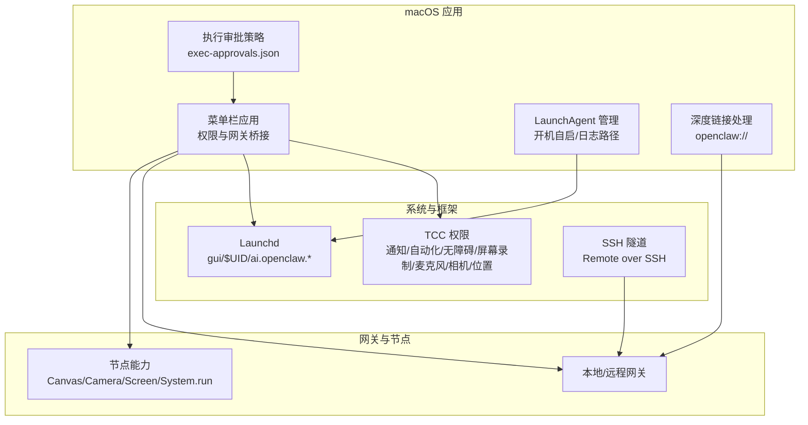
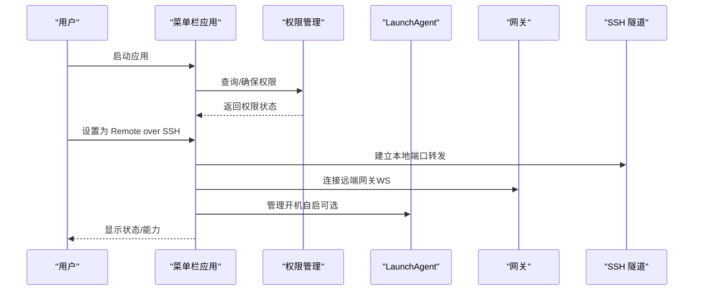
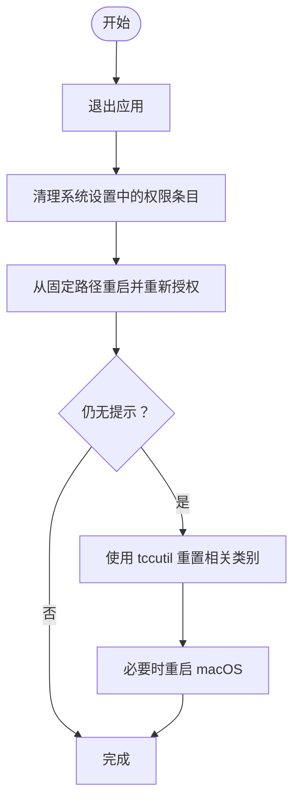
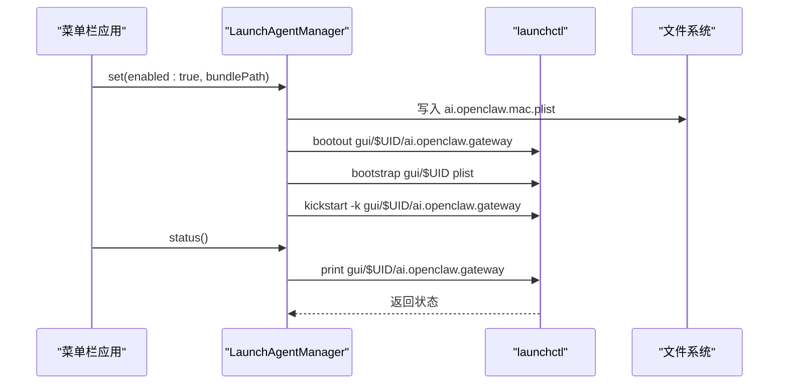
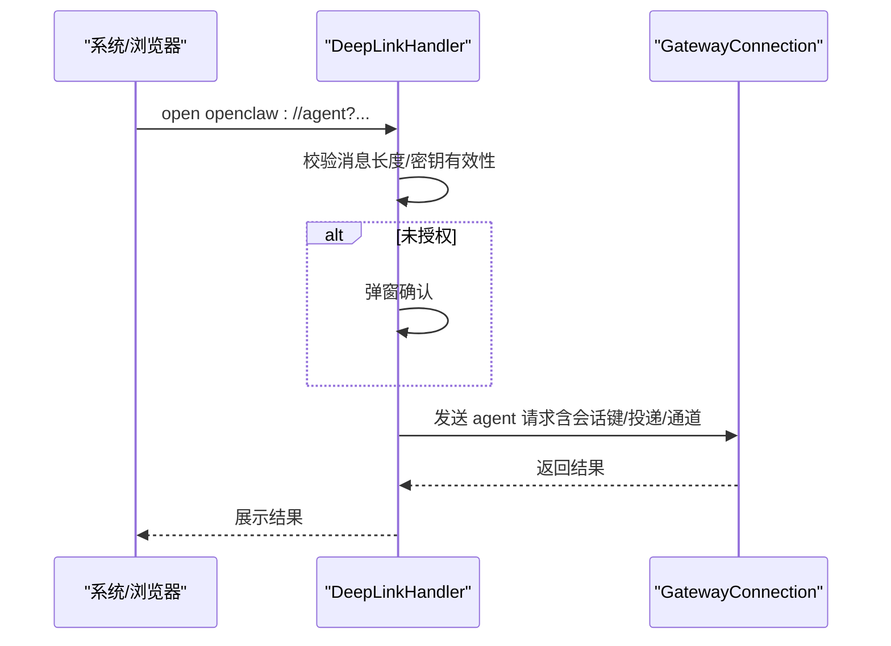
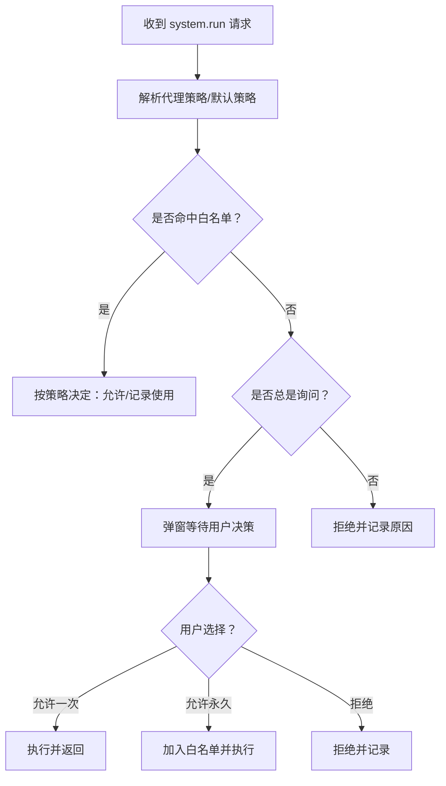
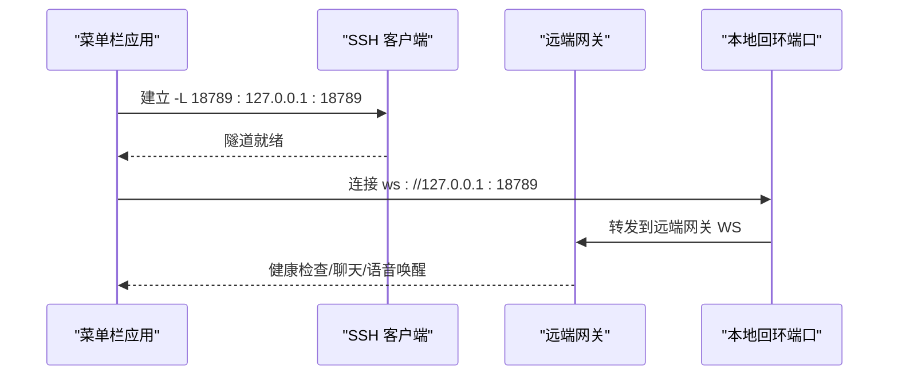
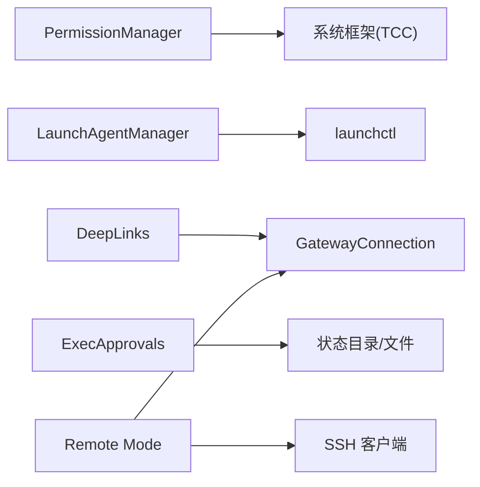

# macOS 平台问题

<cite>
**本文引用的文件**
- [macOS 应用总览](file://docs/platforms/macos.md)
- [macOS 权限（TCC）](file://docs/platforms/mac/permissions.md)
- [macOS 远程控制](file://docs/platforms/mac/remote.md)
- [macOS 应用源码：权限管理](file://apps/macos/Sources/OpenClaw/PermissionManager.swift)
- [macOS 应用源码：LaunchAgent 管理](file://apps/macos/Sources/OpenClaw/LaunchAgentManager.swift)
- [macOS 应用源码：深度链接处理](file://apps/macos/Sources/OpenClaw/DeepLinks.swift)
- [macOS 应用源码：执行审批策略](file://apps/macos/Sources/OpenClaw/ExecApprovals.swift)
- [macOS 应用源码：Launchctl 工具](file://apps/macos/Sources/OpenClaw/Launchctl.swift)
- [macOS 应用源码：节点菜单](file://apps/macos/Sources/OpenClaw/NodesMenu.swift)
- [macOS 应用源码：平台标签格式化](file://apps/macos/Sources/OpenClaw/PlatformLabelFormatter.swift)
- [macOS 应用源码：实例设置](file://apps/macos/Sources/OpenClaw/InstancesSettings.swift)
- [macOS 安装虚拟机指南](file://docs/install/macos-vm.md)
- [通用故障排除指南](file://docs/help/troubleshooting.md)
- [macOS 安装脚本（构建工具检测）](file://scripts/install.sh)
- [打包 macOS 应用脚本](file://scripts/package-mac-app.sh)
</cite>

## 目录
1. [简介](#简介)
2. [项目结构](#项目结构)
3. [核心组件](#核心组件)
4. [架构总览](#架构总览)
5. [详细组件分析](#详细组件分析)
6. [依赖关系分析](#依赖关系分析)
7. [性能考量](#性能考量)
8. [故障排除指南](#故障排除指南)
9. [结论](#结论)
10. [附录](#附录)

## 简介
本指南聚焦于 macOS 平台特有的问题与排障实践，覆盖以下关键主题：
- macOS 权限体系（TCC 框架）与提示恢复
- Launchd 服务管理与自启动控制
- 系统运行权限审批（Exec approvals）与安全策略
- 深度链接集成（Deep Link）与未授权模式
- 远程连接（SSH 隧道）与“Remote over SSH”模式
- 菜单栏应用功能、节点能力与系统运行命令控制
- 常见安装与开发流程问题定位
- 与 iOS 平台的差异对比

## 项目结构
OpenClaw 在 macOS 上由菜单栏应用、本地/远程网关桥接、节点能力暴露与系统运行审批等模块组成。应用通过 LaunchAgent 管理本地服务生命周期，并以 TCC 权限为前提提供屏幕录制、摄像头、麦克风、通知、自动化等能力。

图示来源
- [macOS 应用总览:9-73](file://docs/platforms/macos.md#L9-L73)
- [macOS 应用源码：LaunchAgent 管理:3-26](file://apps/macos/Sources/OpenClaw/LaunchAgentManager.swift#L3-L26)
- [macOS 应用源码：深度链接处理:1-200](file://apps/macos/Sources/OpenClaw/DeepLinks.swift#L1-L200)
- [macOS 应用源码：执行审批策略:222-345](file://apps/macos/Sources/OpenClaw/ExecApprovals.swift#L222-L345)

章节来源
- [macOS 应用总览:9-73](file://docs/platforms/macos.md#L9-L73)

## 核心组件
- 权限管理（PermissionManager）
  - 统一校验与触发 macOS TCC 权限，包括通知、自动化（AppleScript）、无障碍、屏幕录制、麦克风、语音识别、摄像头、位置。
  - 提供交互式授权与非交互式状态查询。
- LaunchAgent 管理（LaunchAgentManager）
  - 写入/删除 LaunchAgents 列表项，控制开机自启；记录标准输出/错误日志路径。
- 深度链接处理（DeepLinks）
  - 解析 openclaw:// 协议，支持代理请求、确认提示、未授权密钥、路由与投递策略。
- 执行审批策略（ExecApprovals）
  - 本地存储 system.run 的安全策略与白名单，支持默认策略、按代理策略、通配符策略、令牌与套接字配置。
- 远程控制（SSH 隧道）
  - 在 Remote over SSH 模式下，通过 ssh -N -L 将远端网关端口转发至本地回环，便于健康检查、WebChat 与语音唤醒转发。

章节来源
- [macOS 应用源码：权限管理:12-227](file://apps/macos/Sources/OpenClaw/PermissionManager.swift#L12-L227)
- [macOS 应用源码：LaunchAgent 管理:3-26](file://apps/macos/Sources/OpenClaw/LaunchAgentManager.swift#L3-L26)
- [macOS 应用源码：深度链接处理:1-200](file://apps/macos/Sources/OpenClaw/DeepLinks.swift#L1-L200)
- [macOS 应用源码：执行审批策略:222-345](file://apps/macos/Sources/OpenClaw/ExecApprovals.swift#L222-L345)
- [macOS 远程控制:1-85](file://docs/platforms/mac/remote.md#L1-L85)

## 架构总览
macOS 应用作为“菜单栏伴侣”，负责：
- 权限提示与状态监控
- 启动/连接网关（本地或远程）
- 暴露 macOS 特有能力（Canvas、Camera、Screen、system.run）
- 在远程模式下管理本地节点主机服务并通过 SSH 隧道与远端网关通信

图示来源
- [macOS 应用总览:26-73](file://docs/platforms/macos.md#L26-L73)
- [macOS 应用源码：LaunchAgent 管理:9-26](file://apps/macos/Sources/OpenClaw/LaunchAgentManager.swift#L9-L26)
- [macOS 应用源码：权限管理:188-227](file://apps/macos/Sources/OpenClaw/PermissionManager.swift#L188-L227)
- [macOS 远程控制:10-43](file://docs/platforms/mac/remote.md#L10-L43)

## 详细组件分析

### 权限管理（TCC）与恢复流程
- 权限类型与触发方式
  - 通知、自动化（AppleScript）、无障碍、屏幕录制、麦克风、语音识别、摄像头、位置。
  - 支持交互式授权与非交互式状态查询；位置授权支持“始终”与“使用时”两种模式。
- 权限恢复清单
  - 退出应用、清理系统设置中的对应条目、从固定路径重新启动并重新授权。
  - 使用 tccutil 重置特定权限类别（如 Accessibility、ScreenCapture、AppleEvents）。
- 文件夹读写权限
  - 终端/后台进程对桌面/文档/下载等目录的读取可能受限，需授予相应进程上下文的访问权限。

图示来源
- [macOS 权限（TCC）:27-41](file://docs/platforms/mac/permissions.md#L27-L41)

章节来源
- [macOS 应用源码：权限管理:13-175](file://apps/macos/Sources/OpenClaw/PermissionManager.swift#L13-L175)
- [macOS 权限（TCC）:10-50](file://docs/platforms/mac/permissions.md#L10-L50)

### Launchd 服务管理
- LaunchAgent 标签与路径
  - 默认标签：ai.openclaw.gateway（或带 profile 的变体）。
  - 列表文件位于 ~/Library/LaunchAgents/ai.openclaw.mac.plist。
- 控制命令
  - kickstart/bootout 用于重启/卸载；status 检查是否已安装并处于运行态。
- 自启动策略
  - 写入 plist 后通过 bootstrap/kickstart 生效；禁用时移除列表文件但不终止当前运行的应用。

图示来源
- [macOS 应用源码：LaunchAgent 管理:9-26](file://apps/macos/Sources/OpenClaw/LaunchAgentManager.swift#L9-L26)
- [macOS 应用源码：Launchctl 工具:9-26](file://apps/macos/Sources/OpenClaw/Launchctl.swift#L9-L26)

章节来源
- [macOS 应用源码：LaunchAgent 管理:3-79](file://apps/macos/Sources/OpenClaw/LaunchAgentManager.swift#L3-L79)
- [macOS 应用源码：Launchctl 工具:1-39](file://apps/macos/Sources/OpenClaw/Launchctl.swift#L1-L39)

### 深度链接（Deep Link）与未授权模式
- 协议与路由
  - 注册 openclaw://，解析 agent 类型链接，支持消息、会话键、思考模式、投递开关与通道、超时与未授权密钥。
- 安全策略
  - 无密钥时触发确认提示，限制未授权消息长度，忽略投递/路由参数；有有效密钥时允许无人值守运行。
- 密钥管理
  - 生成随机密钥并持久化到 UserDefaults；Canvas 生成临时密钥避免阻塞初始化。

图示来源
- [macOS 应用源码：深度链接处理:57-139](file://apps/macos/Sources/OpenClaw/DeepLinks.swift#L57-L139)

章节来源
- [macOS 应用源码：深度链接处理:1-200](file://apps/macos/Sources/OpenClaw/DeepLinks.swift#L1-L200)

### 执行审批策略（system.run 安全控制）
- 存储位置与结构
  - 文件：~/.openclaw/exec-approvals.json；包含版本、套接字配置、默认策略、按代理策略与通配符策略。
- 策略维度
  - 安全级别（deny/allowlist/full）、询问策略（off/on-miss/always）、询问回退、技能自动放行。
- 白名单与模式
  - 支持路径模式校验与规范化；允许添加/更新白名单条目并记录最近使用。
- 环境隔离
  - system.run 环境变量过滤与合并策略，Shell 包装器的最小允许集合。

图示来源
- [macOS 应用源码：执行审批策略:222-539](file://apps/macos/Sources/OpenClaw/ExecApprovals.swift#L222-L539)

章节来源
- [macOS 应用源码：执行审批策略:1-800](file://apps/macos/Sources/OpenClaw/ExecApprovals.swift#L1-L800)

### 远程连接（SSH 隧道）与“Remote over SSH”
- 模式与传输
  - Local：本机运行；Remote over SSH：通过 SSH 隧道转发网关端口；Direct（ws/wss）：直连网关 URL。
- 隧道行为
  - 复用健康隧道或重启；使用 BatchMode、ExitOnForwardFailure、keepalive；本地端口稳定复用。
- 客户端 IP 观察
  - SSH 隧道使用 loopback，网关看到节点 IP 为 127.0.0.1；如需真实 IP，选择 Direct 传输。
- 故障排查要点
  - PATH/CLI 可达性（exit 127 表示找不到 openclaw）；SSH 可达性与 Baileys 登录状态；WebChat 依赖健康 WS 连接。

图示来源
- [macOS 远程控制:18-43](file://docs/platforms/mac/remote.md#L18-L43)

章节来源
- [macOS 远程控制:1-85](file://docs/platforms/mac/remote.md#L1-L85)

### 菜单栏应用功能与节点能力
- 功能概览
  - 菜单栏状态与通知；TCC 提示；本地/远程网关；macOS 专属工具（Canvas、Camera、Screen、system.run）；可选安装全局 CLI。
- 节点能力（macOS）
  - Canvas：present/navigate/eval/snapshot/a2ui.*；Camera：snap/clip；Screen：record；System：run/notify。
- 服务与 IPC
  - 远程模式下本地节点主机服务连接网关 WS；system.run 在应用 UI/TCC 上下文执行，提示与输出保留在应用内。

章节来源
- [macOS 应用总览:15-73](file://docs/platforms/macos.md#L15-L73)

## 依赖关系分析
- 权限管理依赖系统框架（UserNotifications、AVFoundation、CoreGraphics、CoreLocation、Speech、AX、CG）。
- LaunchAgent 管理依赖 launchctl 与文件系统；与日志路径绑定。
- 深度链接处理依赖系统 URL 处理与对话框；与网关连接共享会话键。
- 执行审批策略依赖状态目录权限加固与安全令牌生成。
- 远程模式依赖 SSH 客户端与网关 WS；与本地回环端口绑定。

图示来源
- [macOS 应用源码：权限管理:1-11](file://apps/macos/Sources/OpenClaw/PermissionManager.swift#L1-L11)
- [macOS 应用源码：LaunchAgent 管理:1-79](file://apps/macos/Sources/OpenClaw/LaunchAgentManager.swift#L1-L79)
- [macOS 应用源码：深度链接处理:1-200](file://apps/macos/Sources/OpenClaw/DeepLinks.swift#L1-L200)
- [macOS 应用源码：执行审批策略:222-345](file://apps/macos/Sources/OpenClaw/ExecApprovals.swift#L222-L345)
- [macOS 远程控制:18-43](file://docs/platforms/mac/remote.md#L18-L43)

## 性能考量
- 权限轮询与 UI 更新
  - 权限监控定时器周期性检查，最小间隔 0.5 秒，避免频繁刷新。
- 日志与 I/O
  - LaunchAgent 标准输出/错误重定向至日志文件，便于离线诊断。
- 隧道稳定性
  - 复用健康隧道减少握手开销；SSH 参数优化（BatchMode、ExitOnForwardFailure、keepalive）提升可靠性。

章节来源
- [macOS 应用源码：权限管理:449-465](file://apps/macos/Sources/OpenClaw/PermissionManager.swift#L449-L465)
- [macOS 应用源码：LaunchAgent 管理:28-58](file://apps/macos/Sources/OpenClaw/LaunchAgentManager.swift#L28-L58)

## 故障排除指南

### 一、权限问题（TCC）
- 症状
  - 权限提示消失、权限状态异常、文件读取/目录枚举挂起。
- 排查步骤
  - 退出应用，清理系统设置中对应条目，从固定路径重启并重新授权。
  - 若仍无提示，使用 tccutil 重置相关类别（如 Accessibility、ScreenCapture、AppleEvents）。
  - 必要时重启 macOS。
- 相关文件
  - 权限状态查询与交互逻辑、AppleScript 权限检测与引导。

章节来源
- [macOS 权限（TCC）:27-41](file://docs/platforms/mac/permissions.md#L27-L41)
- [macOS 应用源码：权限管理:188-227](file://apps/macos/Sources/OpenClaw/PermissionManager.swift#L188-L227)
- [macOS 应用源码：权限管理:351-395](file://apps/macos/Sources/OpenClaw/PermissionManager.swift#L351-L395)

### 二、Launchd 服务管理
- 症状
  - 开机自启未生效、无法启动/停止、状态显示异常。
- 排查步骤
  - 检查 ~/Library/LaunchAgents/ai.openclaw.mac.plist 是否存在。
  - 使用 status() 检查是否打印出 LaunchAgent；若不存在，执行 openclaw gateway install 或在应用中启用。
  - 通过 bootout/kickstart 重启服务；禁用时移除列表文件但不终止当前应用。
- 相关文件
  - LaunchAgent 写入、启动/停止与状态查询。

章节来源
- [macOS 应用源码：LaunchAgent 管理:9-26](file://apps/macos/Sources/OpenClaw/LaunchAgentManager.swift#L9-L26)
- [macOS 应用源码：LaunchAgent 管理:28-58](file://apps/macos/Sources/OpenClaw/LaunchAgentManager.swift#L28-L58)

### 三、系统运行权限审批（Exec approvals）
- 症状
  - system.run 被拒绝、需要审批、白名单未命中。
- 排查步骤
  - 检查 ~/.openclaw/exec-approvals.json 的策略与白名单；确认默认策略与代理策略合并结果。
  - 对于包含 shell 控制语法的命令，按“未命中”处理并要求显式审批或允许 shell。
  - 允许“总是”后自动加入白名单；注意包装器路径的解包规则。
- 相关文件
  - 策略解析、白名单校验与记录、环境变量过滤与合并。

章节来源
- [macOS 应用总览:75-111](file://docs/platforms/macos.md#L75-L111)
- [macOS 应用源码：执行审批策略:222-539](file://apps/macos/Sources/OpenClaw/ExecApprovals.swift#L222-L539)

### 四、深度链接（Deep Link）
- 症状
  - openclaw:// 无法唤起、确认提示过于频繁、无人值守密钥无效。
- 排查步骤
  - 确认协议注册与 URL 解析；短消息在无密钥时会被限制并忽略投递/路由参数。
  - 无人值守密钥需与应用生成的密钥一致；Canvas 生成临时密钥不影响外部调用。
  - 如被节流，等待短暂冷却时间。
- 相关文件
  - 深度链接解析、确认提示与密钥生成。

章节来源
- [macOS 应用总览:112-138](file://docs/platforms/macos.md#L112-L138)
- [macOS 应用源码：深度链接处理:57-139](file://apps/macos/Sources/OpenClaw/DeepLinks.swift#L57-L139)

### 五、远程连接（SSH 隧道）
- 症状
  - 健康检查失败、WebChat 卡住、节点 IP 显示 127.0.0.1、语音唤醒转发异常。
- 排查步骤
  - 测试远端 PATH 与 openclaw 可达性（exit 127 表示未找到）；检查 Baileys 登录状态。
  - 确认本地转发端口与网关 WS 端口一致；SSH 隧道使用 loopback，节点 IP 为 127.0.0.1。
  - 如需真实客户端 IP，切换为 Direct（ws/wss）传输。
- 相关文件
  - 远程模式说明与隧道参数。

章节来源
- [macOS 远程控制:68-74](file://docs/platforms/mac/remote.md#L68-L74)

### 六、安装与开发流程问题
- 症状
  - 构建工具缺失、Xcode 命令行工具未就绪、cmake 未安装。
- 排查步骤
  - macOS 下检测并安装 Xcode 命令行工具与 cmake；Homebrew 可用于安装 cmake。
  - 打包脚本负责多架构 Sparkle 框架合并与 Mach-O 合并。
- 相关文件
  - 安装脚本与打包脚本。

章节来源
- [macOS 安装脚本（构建工具检测）:623-643](file://scripts/install.sh#L623-L643)
- [打包 macOS 应用脚本:40-82](file://scripts/package-mac-app.sh#L40-L82)

### 七、常见症状与快速诊断
- 症状
  - 无回复、控制 UI 无法连接、网关未启动、通道连接但消息不流动、自动化未触发、节点工具失败、浏览器工具失败。
- 快速诊断
  - 按顺序执行：status、status --all、gateway probe、gateway status、doctor、channels status --probe、logs --follow。
  - 根据具体场景参考通用故障排除页面的分段诊断与常见日志签名。
- 相关文件
  - 通用故障排除指南。

章节来源
- [通用故障排除指南:13-35](file://docs/help/troubleshooting.md#L13-L35)
- [通用故障排除指南:68-299](file://docs/help/troubleshooting.md#L68-L299)

### 八、与 iOS 平台差异对比
- 权限模型
  - iOS 通过系统设置与权限状态 API 获取授权；macOS 通过 TCC 框架并在 UI/TCC 上下文中执行 system.run。
- 设备标识与平台字符串
  - iOS 使用设备族与平台字符串；macOS 平台字符串为“macOS X.Y.Z”。
- 能力与工具
  - iOS 更强调照片/联系人/日历/提醒等权限；macOS 强调屏幕录制、摄像头、麦克风、通知、自动化等。
- 运行时上下文
  - macOS app 在前台 UI/TCC 上下文中执行 system.run；iOS 通常在沙盒限制下运行。

章节来源
- [macOS 应用源码：平台标签格式化:1-31](file://apps/macos/Sources/OpenClaw/PlatformLabelFormatter.swift#L1-L31)
- [macOS 应用源码：实例设置:270-290](file://apps/macos/Sources/OpenClaw/InstancesSettings.swift#L270-L290)
- [macOS 应用源码：节点菜单:131-156](file://apps/macos/Sources/OpenClaw/NodesMenu.swift#L131-L156)

## 结论
针对 macOS 平台，OpenClaw 通过菜单栏应用统一管理权限、Launchd 服务、远程连接与系统运行审批，形成闭环的自动化与安全控制。遇到问题时，优先从权限恢复、LaunchAgent 状态、远程隧道可达性与 exec-approvals 策略入手，结合通用诊断流程快速定位根因。

## 附录
- 状态目录放置建议
  - 避免 iCloud 或其他云同步路径；推荐本地非同步路径 ~/.openclaw。
- macOS VM 运行
  - 使用 Lume 创建隔离的 macOS VM，适合需要 iMessage/BlueBubbles 或严格隔离的场景。

章节来源
- [macOS 应用总览:146-163](file://docs/platforms/macos.md#L146-L163)
- [macOS 安装虚拟机指南:1-282](file://docs/install/macos-vm.md#L1-L282)