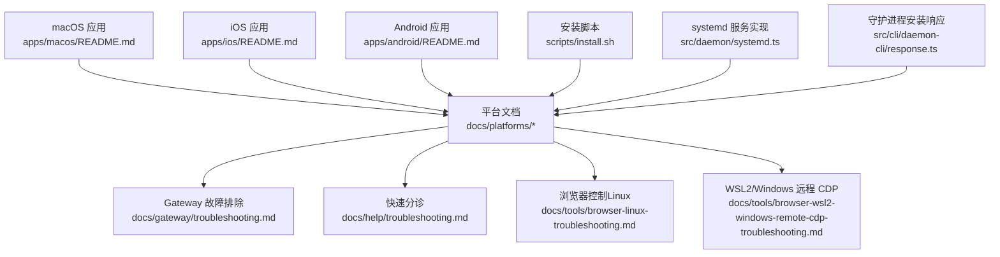
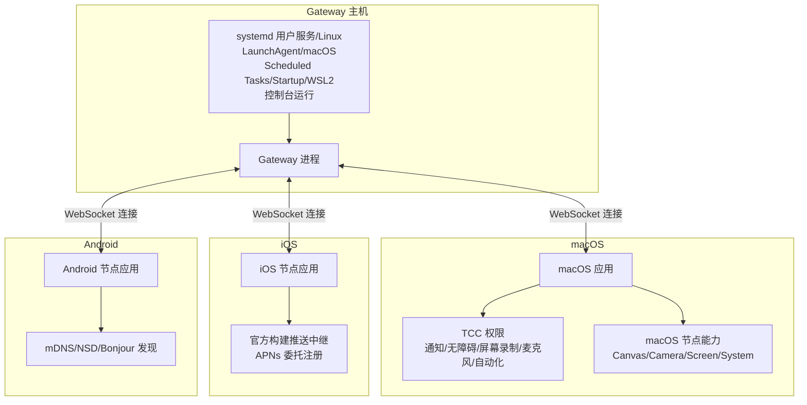
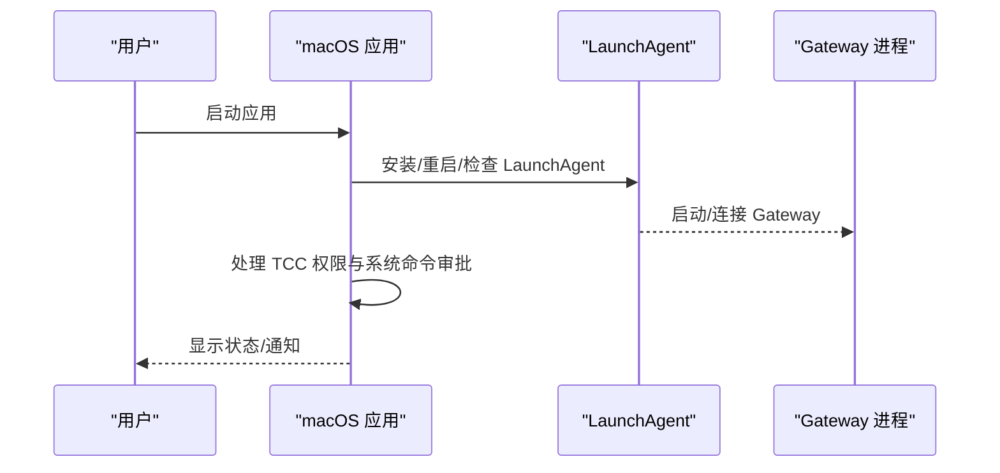
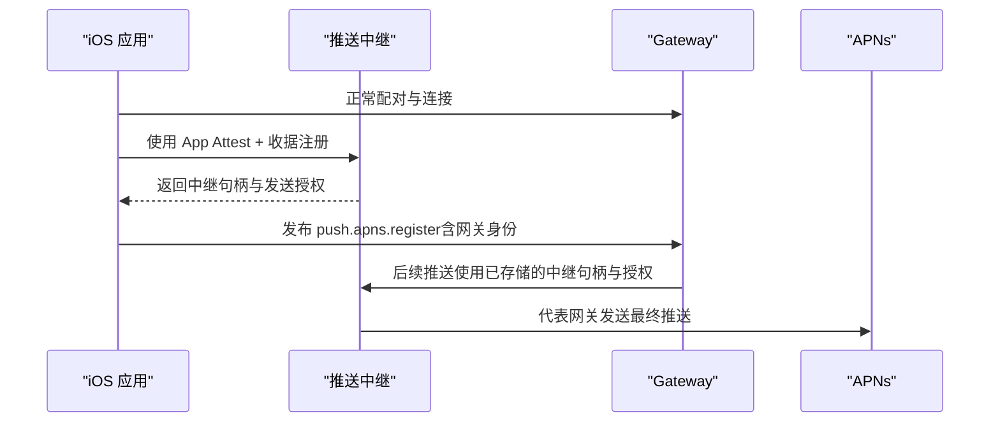
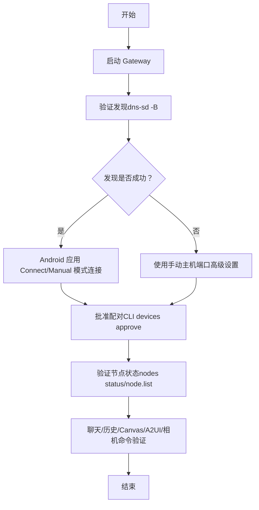
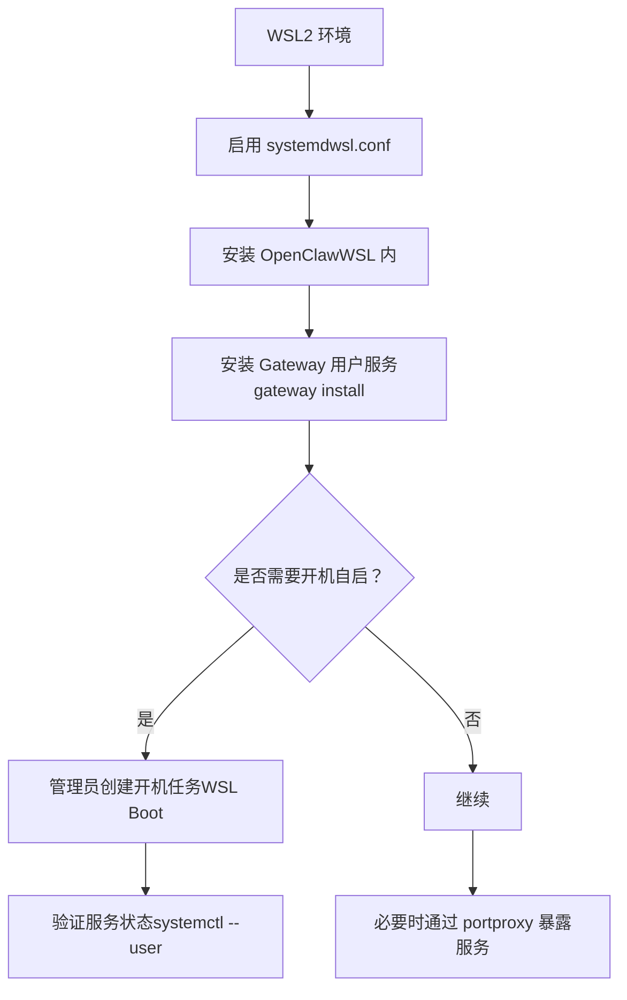
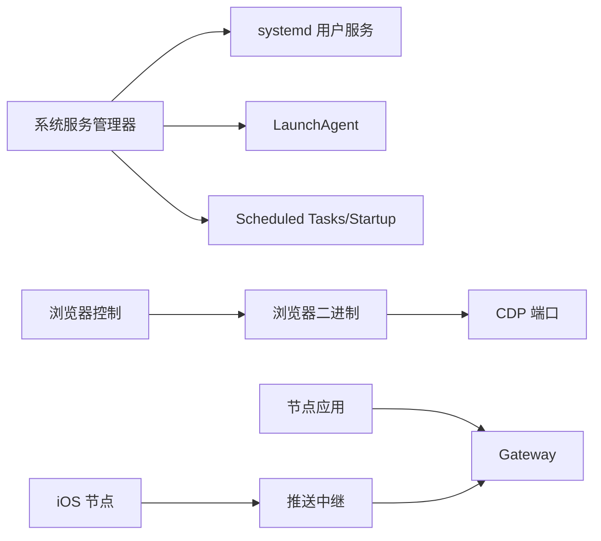

# 平台特定问题

<cite>
**本文引用的文件**
- [docs/platforms/index.md](file://docs/platforms/index.md)
- [docs/platforms/macos.md](file://docs/platforms/macos.md)
- [docs/platforms/ios.md](file://docs/platforms/ios.md)
- [docs/platforms/android.md](file://docs/platforms/android.md)
- [docs/platforms/windows.md](file://docs/platforms/windows.md)
- [docs/platforms/linux.md](file://docs/platforms/linux.md)
- [docs/gateway/troubleshooting.md](file://docs/gateway/troubleshooting.md)
- [docs/help/troubleshooting.md](file://docs/help/troubleshooting.md)
- [docs/tools/browser-linux-troubleshooting.md](file://docs/tools/browser-linux-troubleshooting.md)
- [docs/tools/browser-wsl2-windows-remote-cdp-troubleshooting.md](file://docs/tools/browser-wsl2-windows-remote-cdp-troubleshooting.md)
- [apps/macos/README.md](file://apps/macos/README.md)
- [apps/android/README.md](file://apps/android/README.md)
- [apps/ios/README.md](file://apps/ios/README.md)
- [scripts/install.sh](file://scripts/install.sh)
- [src/daemon/systemd.ts](file://src/daemon/systemd.ts)
- [src/cli/daemon-cli/response.ts](file://src/cli/daemon-cli/response.ts)
</cite>

## 目录
1. [简介](#简介)
2. [项目结构](#项目结构)
3. [核心组件](#核心组件)
4. [架构总览](#架构总览)
5. [详细组件分析](#详细组件分析)
6. [依赖关系分析](#依赖关系分析)
7. [性能考量](#性能考量)
8. [故障排除指南](#故障排除指南)
9. [结论](#结论)
10. [附录](#附录)

## 简介
本指南聚焦于平台特定问题，覆盖 macOS、iOS、Android、Windows（WSL2）、Linux 等平台在安装、运行、权限、服务管理、网络发现与连接、浏览器控制、日志与诊断等方面的常见问题与解决方案。文档同时提供跨平台升级与迁移注意事项，帮助用户在不同操作系统上稳定运行 OpenClaw 的 Gateway 与配套节点应用。

## 项目结构
- 平台文档集中在 docs/platforms 下，分别描述 macOS、iOS、Android、Windows、Linux 的支持状态、安装路径、服务安装方式与注意事项。
- 故障排除文档分为“快速分诊”和“深度排障”，前者提供症状到命令的映射，后者提供更深入的诊断步骤与错误码解释。
- 平台特定工具与浏览器控制文档覆盖 Linux 浏览器启动问题与 WSL2/Windows 远程 CDP 场景的分层排查流程。
- 应用侧文档（apps/*/README.md）提供开发与打包签名、构建与测试流程等信息，便于定位平台差异导致的问题。

**图表来源**
- [docs/platforms/index.md](file://docs/platforms/index.md)
- [docs/platforms/macos.md](file://docs/platforms/macos.md)
- [docs/platforms/ios.md](file://docs/platforms/ios.md)
- [docs/platforms/android.md](file://docs/platforms/android.md)
- [docs/platforms/windows.md](file://docs/platforms/windows.md)
- [docs/platforms/linux.md](file://docs/platforms/linux.md)
- [docs/gateway/troubleshooting.md](file://docs/gateway/troubleshooting.md)
- [docs/help/troubleshooting.md](file://docs/help/troubleshooting.md)
- [docs/tools/browser-linux-troubleshooting.md](file://docs/tools/browser-linux-troubleshooting.md)
- [docs/tools/browser-wsl2-windows-remote-cdp-troubleshooting.md](file://docs/tools/browser-wsl2-windows-remote-cdp-troubleshooting.md)
- [apps/macos/README.md](file://apps/macos/README.md)
- [apps/ios/README.md](file://apps/ios/README.md)
- [apps/android/README.md](file://apps/android/README.md)
- [scripts/install.sh](file://scripts/install.sh)
- [src/daemon/systemd.ts](file://src/daemon/systemd.ts)
- [src/cli/daemon-cli/response.ts](file://src/cli/daemon-cli/response.ts)

**章节来源**
- [docs/platforms/index.md](file://docs/platforms/index.md)
- [docs/platforms/macos.md](file://docs/platforms/macos.md)
- [docs/platforms/ios.md](file://docs/platforms/ios.md)
- [docs/platforms/android.md](file://docs/platforms/android.md)
- [docs/platforms/windows.md](file://docs/platforms/windows.md)
- [docs/platforms/linux.md](file://docs/platforms/linux.md)

## 核心组件
- 平台选择与服务安装：根据操作系统选择合适的守护进程安装方式（macOS LaunchAgent、Linux systemd 用户服务、Windows Scheduled Tasks/Startup 登录项），并提供修复与迁移命令。
- 节点应用（macOS、iOS、Android）：负责本地权限管理、与 Gateway 的连接与配对、能力暴露与工具调用；不同平台在权限模型、后台限制、推送与发现机制上存在差异。
- 浏览器控制：在 Linux 上常遇到 snap 包浏览器沙箱导致的 CDP 启动失败；WSL2/Windows 场景下需要分层验证远端 CDP 可达性与扩展中继配置。
- 升级与迁移：升级后常见问题包括认证与 URL 行为变化、绑定与鉴权门槛提升、设备身份与配对状态变更，需按步骤回溯与重装服务元数据。

**章节来源**
- [docs/platforms/index.md](file://docs/platforms/index.md)
- [docs/gateway/troubleshooting.md](file://docs/gateway/troubleshooting.md)
- [docs/help/troubleshooting.md](file://docs/help/troubleshooting.md)

## 架构总览
下图展示 Gateway 与各平台节点应用的交互关系，以及关键的平台差异点（权限、后台限制、推送、发现与连接）。

**图表来源**
- [docs/platforms/macos.md](file://docs/platforms/macos.md)
- [docs/platforms/ios.md](file://docs/platforms/ios.md)
- [docs/platforms/android.md](file://docs/platforms/android.md)
- [docs/platforms/index.md](file://docs/platforms/index.md)

## 详细组件分析

### macOS 平台
- 角色与职责：菜单栏应用负责权限（TCC）提示、本地/远程模式切换、节点能力暴露、系统命令执行审批与安全策略。
- LaunchAgent 控制：通过 launchctl 安装/重启/卸载 per-user LaunchAgent；若未安装，可通过 CLI 安装或应用内启用。
- Exec 审批：system.run 的安全策略、允许列表与环境变量过滤规则；支持“始终允许”持久化决策。
- 远程连接：SSH 隧道复用控制平面端口，使用 loopback 报告节点 IP；如需真实客户端 IP，可改用直连传输。
- 诊断：提供独立 CLI 工具验证握手与发现逻辑，对比 NWBrowser 与 DNS-SD 的差异。
- 开发与打包：支持自动签名与团队 ID 校验，提供禁用库校验与跳过审计的开发选项。

**图表来源**
- [docs/platforms/macos.md](file://docs/platforms/macos.md)

**章节来源**
- [docs/platforms/macos.md](file://docs/platforms/macos.md)
- [apps/macos/README.md](file://apps/macos/README.md)

### iOS 平台
- 角色与职责：作为节点应用连接 Gateway，暴露 Canvas、屏幕快照、相机、位置、语音唤醒与对话等能力。
- 推送中继（官方构建）：通过外部推送中继完成 APNs 注册委托，避免在 Gateway 存储原始 APNs 凭证；支持基于网关身份的授权与刷新。
- 认证与信任链：从 iOS 应用到网关、再到中继与 APNs 的多跳信任流程，确保仅官方构建可用且注册不可被其他网关复用。
- 发现路径：Bonjour（局域网）、跨网络的单播 DNS-SD（配合 Tailscale split DNS）、手动主机端口。
- 常见错误：前台不可用导致节点工具不可用、Canvas 主机未配置、配对提示不出现、重装后钥匙串令牌清除需重新配对。

**图表来源**
- [docs/platforms/ios.md](file://docs/platforms/ios.md)

**章节来源**
- [docs/platforms/ios.md](file://docs/platforms/ios.md)
- [apps/ios/README.md](file://apps/ios/README.md)

### Android 平台
- 角色与职责：作为节点应用连接 Gateway，支持聊天历史、Canvas/A2UI、相机拍照/录视频、设备健康与权限查询等。
- 连接与发现：mDNS/NSD（局域网）、跨网络的单播 DNS-SD（Tailscale split DNS）、手动主机端口。
- 权限：Android 13+ 需要 NEARBY_WIFI_DEVICES 或 ACCESS_FINE_LOCATION（12 及以下）用于 NSD 扫描；前台服务通知权限；相机与录音权限。
- 诊断与验证：提供连接运行手册（启动 Gateway、验证发现、连接应用、批准配对、验证节点在线、聊天与历史、Canvas/A2UI、相机命令）。
- 集成能力测试：预置前提条件清单、失败快速修复建议（配对、Canvas 主机可达、前台激活）。

**图表来源**
- [docs/platforms/android.md](file://docs/platforms/android.md)

**章节来源**
- [docs/platforms/android.md](file://docs/platforms/android.md)
- [apps/android/README.md](file://apps/android/README.md)

### Windows（WSL2）平台
- 安装路径：推荐通过 WSL2（Ubuntu）安装，保持与 Linux 一致的运行时与工具链兼容性。
- 服务安装：优先使用 Scheduled Tasks；若被拒绝则回退到当前用户的 Startup 登录项并立即启动；若 schtasks 卡死则快速中止并回退。
- 自动启动链路：启用 linger、安装用户服务、以管理员身份创建开机启动任务；重启后在 WSL 内验证用户服务状态。
- 高级场景：通过 netsh portproxy 将 Windows 端口转发至 WSL IP，允许其他机器访问 WSL 内的服务；注意 WSL IP 重启后需刷新规则。
- 本地 CLI：原生 Windows CLI 功能逐步完善，但 WSL2 仍是推荐路径。

**图表来源**
- [docs/platforms/windows.md](file://docs/platforms/windows.md)

**章节来源**
- [docs/platforms/windows.md](file://docs/platforms/windows.md)

### Linux 平台
- 支持状态：Gateway 在 Linux 上完全支持；推荐 Node 作为运行时。
- 服务安装：通过 systemd 用户服务默认安装；共享或始终在线服务器可使用系统服务。
- 快速入门：在 VPS 上安装 Node、全局安装 openclaw、安装并启用守护进程、通过 SSH 端口转发访问 Dashboard。

**章节来源**
- [docs/platforms/linux.md](file://docs/platforms/linux.md)

## 依赖关系分析
- 平台服务安装依赖系统服务管理器：Linux 使用 systemd 用户服务；macOS 使用 LaunchAgent；Windows 使用 Scheduled Tasks/Startup。
- 浏览器控制依赖系统浏览器二进制与 CDP 端口；Linux 上 snap 包浏览器常因沙箱限制导致启动失败。
- 节点应用依赖 Gateway 的发现与配对流程；iOS 的官方构建依赖推送中继与网关身份委托。

**图表来源**
- [src/daemon/systemd.ts](file://src/daemon/systemd.ts)
- [docs/tools/browser-linux-troubleshooting.md](file://docs/tools/browser-linux-troubleshooting.md)
- [docs/platforms/ios.md](file://docs/platforms/ios.md)

**章节来源**
- [src/daemon/systemd.ts](file://src/daemon/systemd.ts)
- [docs/tools/browser-linux-troubleshooting.md](file://docs/tools/browser-linux-troubleshooting.md)
- [docs/platforms/ios.md](file://docs/platforms/ios.md)

## 性能考量
- 节点工具在后台受限：iOS 当前将前台作为可靠模式，后台命令（如 Canvas/Camera/Screen/Talk）受限；Android 的 Canvas/A2UI 与相机命令需要前台 WebView 附加。
- 浏览器控制：Linux 上 snap 包浏览器沙箱会增加启动失败概率，建议使用非 snap 的官方浏览器或采用 attach-only 模式。
- WSL2 端口转发：频繁刷新 portproxy 规则可能带来额外开销，建议在登录时自动刷新。

[本节为通用指导，无需具体文件分析]

## 故障排除指南

### 通用快速分诊（2 分钟）
- 执行命令阶梯：status、status --all、gateway probe、gateway status、doctor、channels status --probe、logs --follow。
- 关注健康信号：Gateway 运行中、RPC 探测成功、通道连接/就绪、无重复致命错误。

**章节来源**
- [docs/help/troubleshooting.md](file://docs/help/troubleshooting.md)

### 深度排障（按症状）
- 无回复：检查路由与策略、通道探针、配对状态；关注“提及必需”“待配对”“阻止/白名单”等日志线索。
- 控制 UI/仪表板无法连接：核对 URL、认证模式与安全上下文；关注“设备身份必需”“设备随机数缺失/不匹配/签名无效/过期”“AUTH_TOKEN_MISMATCH”等细节码。
- Gateway 服务未运行：检查服务状态、配置与端口冲突；关注“仅本地模式”“拒绝绑定且无认证”“另一个实例已在监听”等提示。
- 通道已连接但消息不流动：检查策略、权限与通道特定规则；关注“提及必需”“待配对/未加入/缺少作用域/401/403”等。
- Cron/心跳未触发或未送达：检查调度器状态、作业运行历史与静默时段；关注“调度器禁用”“定时器失败”“静默时段/请求进行中/未知账户”等。
- 节点已配对但工具失败：检查前台状态、系统权限与执行审批；关注“前台不可用”“权限缺失”“执行审批待定/允许列表未命中”等。
- 浏览器工具失败：检查浏览器可执行路径、CDP 可达性与扩展中继标签页连接；关注“无法启动 CDP”“可执行路径不存在”“扩展中继运行但无标签连接”“仅 attach-only 且不可达”。

**章节来源**
- [docs/gateway/troubleshooting.md](file://docs/gateway/troubleshooting.md)

### 平台特定故障排除

#### macOS
- LaunchAgent 未安装/异常：使用 openclaw gateway install 或通过应用启用；使用 launchctl kickstart/bootout 控制。
- Exec 审批与安全策略：检查 ~/.openclaw/exec-approvals.json；注意 shell 控制语法与环境变量过滤。
- 远程模式隧道：确认 SSH 隧道复用与 loopback IP 报告；如需真实 IP，改用直连传输。
- 诊断工具：使用独立 CLI 验证握手与发现，对比 NWBrowser 与 DNS-SD 差异。

**章节来源**
- [docs/platforms/macos.md](file://docs/platforms/macos.md)

#### iOS
- 官方构建推送中继：确保 gateway.push.apns.relay.baseUrl 配置正确；注册流程包含 App Attest 与收据验证。
- 认证与信任链：从 iOS 到网关、中继、APNs 的多跳校验；避免本地/测试构建误用托管中继。
- 常见错误：前台不可用、Canvas 主机未配置、配对提示不出现、重装后钥匙串令牌清除需重新配对。

**章节来源**
- [docs/platforms/ios.md](file://docs/platforms/ios.md)

#### Android
- 发现与连接：局域网使用 mDNS/NSD，跨网络使用单播 DNS-SD（split DNS）；失败时使用手动主机端口。
- 权限：Android 13+ 需要 NEARBY_WIFI_DEVICES 或 ACCESS_FINE_LOCATION；前台服务通知、相机/录音权限。
- 诊断与验证：按连接运行手册逐项验证；集成能力测试前准备清单与常见修复。

**章节来源**
- [docs/platforms/android.md](file://docs/platforms/android.md)

#### Windows（WSL2）
- 服务安装：优先 Scheduled Tasks；失败回退 Startup 登录项；若 schtasks 卡死则快速中止并回退。
- 自动启动链路：启用 linger、安装用户服务、创建开机任务；重启后验证服务状态。
- 端口转发：通过 netsh portproxy 将 Windows 端口转发至 WSL IP；WLS IP 重启后刷新规则。

**章节来源**
- [docs/platforms/windows.md](file://docs/platforms/windows.md)

#### Linux
- 服务安装：systemd 用户服务默认；共享/始终在线服务器使用系统服务。
- 快速入门：Node 安装、全局安装 openclaw、安装并启用守护进程、SSH 端口转发访问 Dashboard。

**章节来源**
- [docs/platforms/linux.md](file://docs/platforms/linux.md)

### 浏览器控制（Linux 与 WSL2/Windows）
- Linux：snap 包浏览器沙箱常导致 CDP 启动失败；推荐安装官方 Google Chrome 或使用 attach-only 模式手动启动。
- WSL2/Windows：分层验证 Windows Chrome CDP 可达性、WSL2 可达性、浏览器配置、控制 UI 安全上下文与授权、扩展中继拓扑。

**章节来源**
- [docs/tools/browser-linux-troubleshooting.md](file://docs/tools/browser-linux-troubleshooting.md)
- [docs/tools/browser-wsl2-windows-remote-cdp-troubleshooting.md](file://docs/tools/browser-wsl2-windows-remote-cdp-troubleshooting.md)

### 升级与迁移注意事项
- 认证与 URL 行为变化：检查 gateway.mode、gateway.remote.url、gateway.auth.mode；显式 --url 不再回退到存储凭据。
- 绑定与鉴权门槛提升：非 loopback 绑定需配置鉴权；旧键不再替换新键。
- 设备身份与配对状态变更：检查 pending 设备审批与 DM 配对审批。
- 服务配置与运行态不一致：通过强制重新安装服务元数据并重启解决。

**章节来源**
- [docs/gateway/troubleshooting.md](file://docs/gateway/troubleshooting.md)

## 结论
不同平台在服务安装、权限模型、后台行为、网络发现与连接、浏览器控制等方面存在显著差异。遵循本文提供的平台特定流程与故障排除步骤，结合“快速分诊—深度排障”的诊断路径，可有效降低跨平台部署与运维成本，并在升级后快速恢复稳定运行。

[本节为总结，无需具体文件分析]

## 附录

### 平台服务安装与检查要点
- Linux：systemd 用户服务可用性检查、单元文件备份与覆盖、服务状态与重启。
- macOS：LaunchAgent 安装/重启/卸载、per-user 标签与 profile 支持。
- Windows：Scheduled Tasks 创建与回退逻辑、Startup 登录项、WSL 自动启动任务。
- 守护进程安装响应：安装失败时的错误提示与回退处理。

**章节来源**
- [src/daemon/systemd.ts](file://src/daemon/systemd.ts)
- [src/cli/daemon-cli/response.ts](file://src/cli/daemon-cli/response.ts)

### 安装脚本与系统要求
- Linux 发行版构建工具安装：apt（Debian/Ubuntu）、pacman（Arch）、dnf（Fedora）分支处理。
- Node 版本与运行时：Node 24 推荐，Node 22 LTS 兼容；Bun 不推荐用于 Gateway（WhatsApp/Telegram bug）。

**章节来源**
- [scripts/install.sh](file://scripts/install.sh)
- [docs/platforms/linux.md](file://docs/platforms/linux.md)
- [docs/platforms/index.md](file://docs/platforms/index.md)