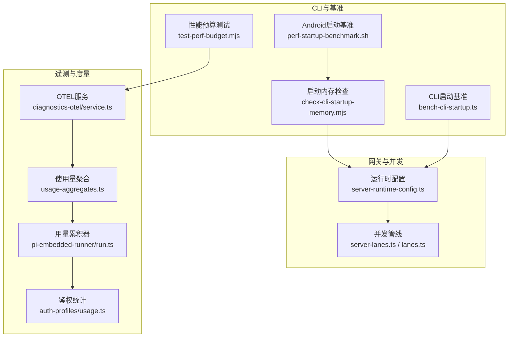
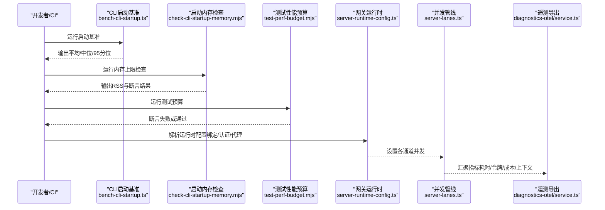
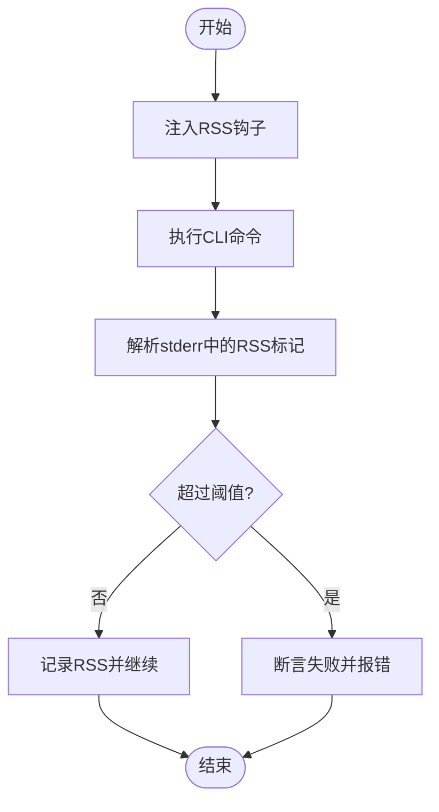
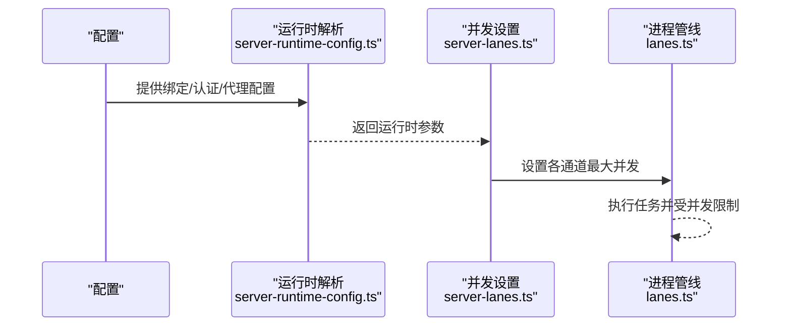
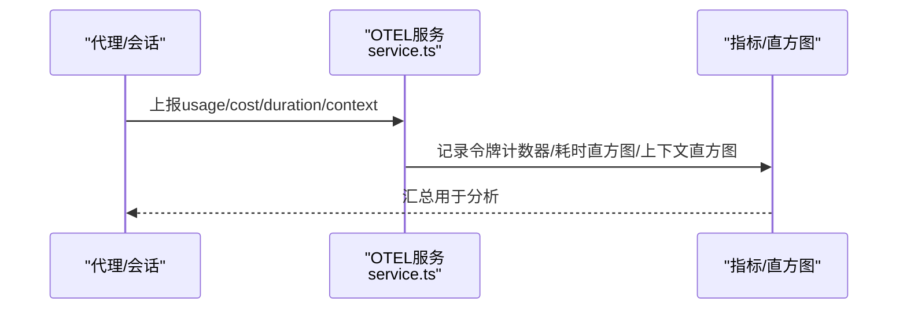
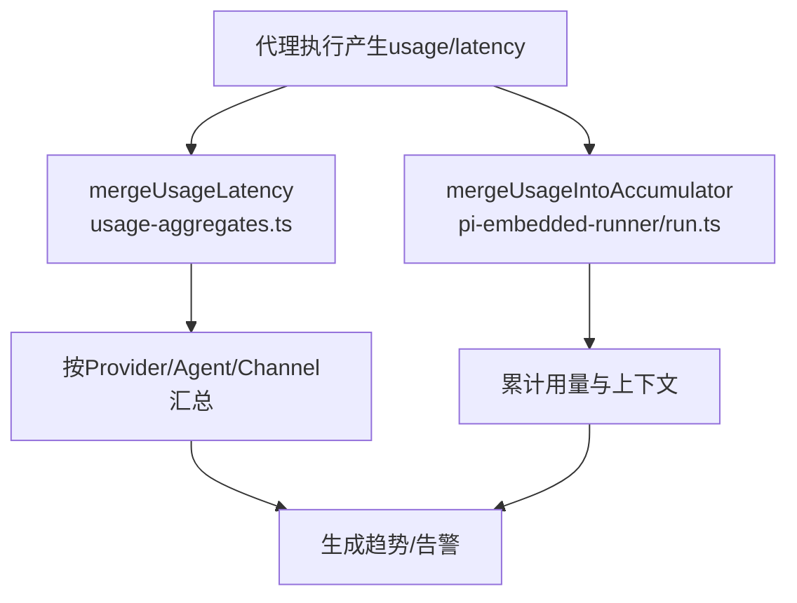
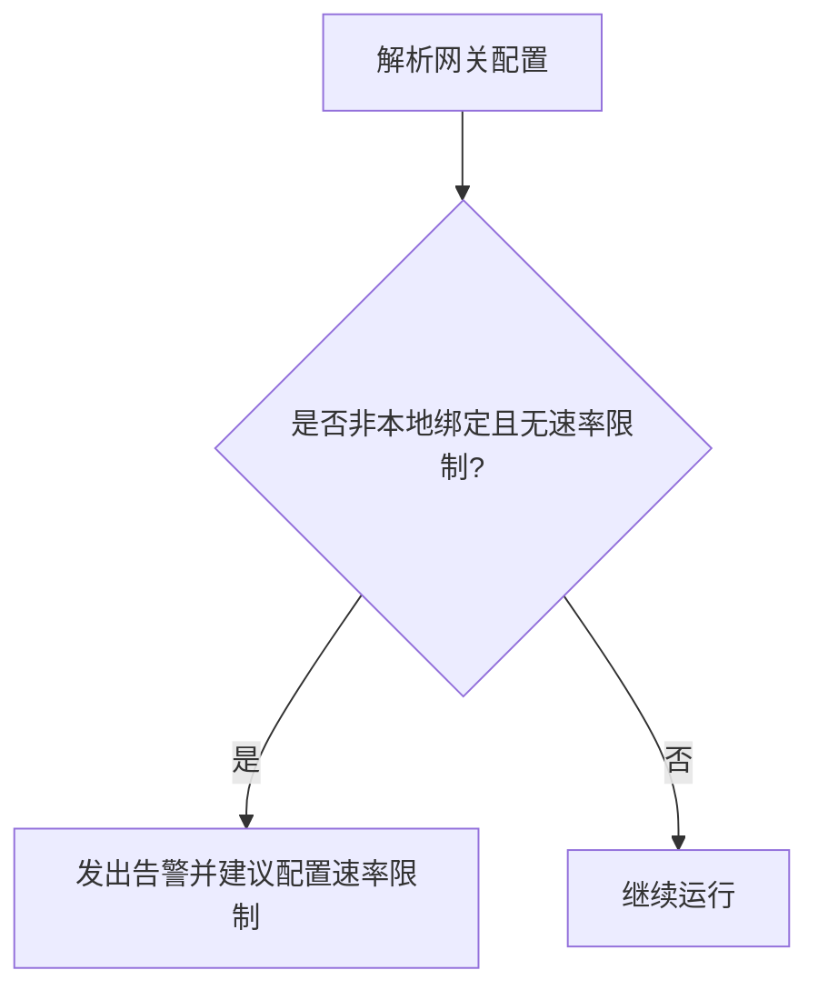
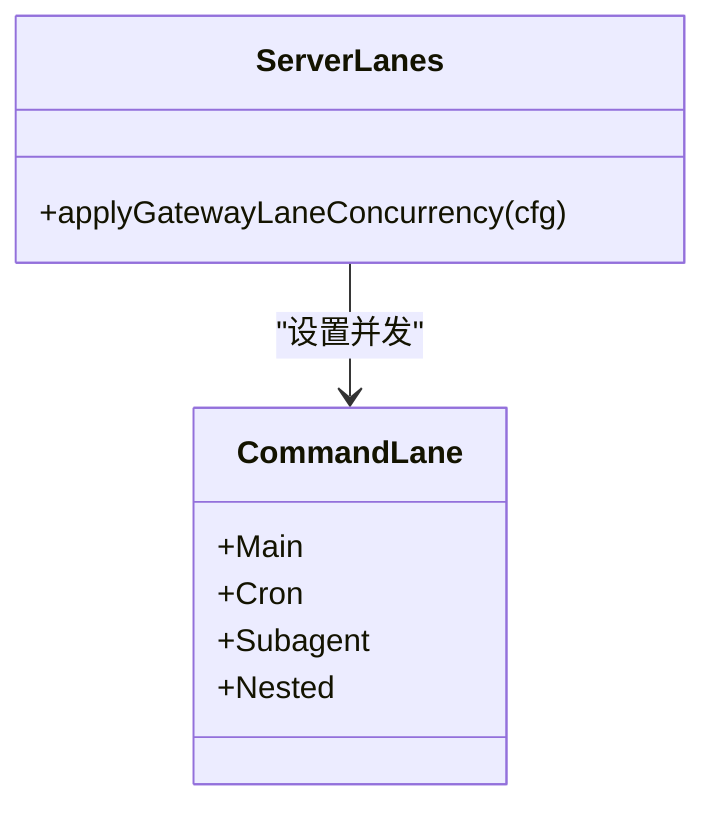
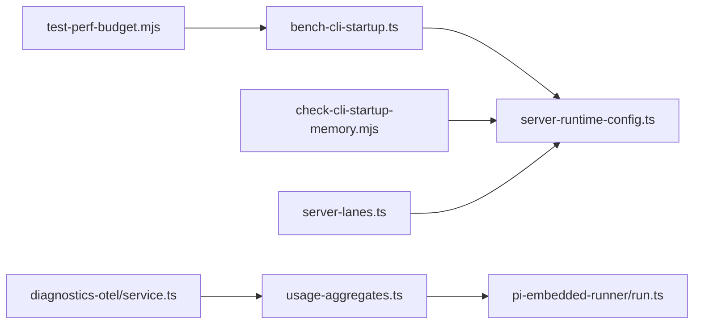

# 性能问题

<cite>
**本文引用的文件**
- [scripts/test-perf-budget.mjs](file://scripts/test-perf-budget.mjs)
- [scripts/check-cli-startup-memory.mjs](file://scripts/check-cli-startup-memory.mjs)
- [scripts/bench-cli-startup.ts](file://scripts/bench-cli-startup.ts)
- [src/gateway/server-runtime-config.ts](file://src/gateway/server-runtime-config.ts)
- [src/gateway/server-lanes.ts](file://src/gateway/server-lanes.ts)
- [src/process/lanes.ts](file://src/process/lanes.ts)
- [extensions/diagnostics-otel/src/service.ts](file://extensions/diagnostics-otel/src/service.ts)
- [src/shared/usage-aggregates.ts](file://src/shared/usage-aggregates.ts)
- [src/agents/pi-embedded-runner/run.ts](file://src/agents/pi-embedded-runner/run.ts)
- [src/agents/auth-profiles/usage.ts](file://src/agents/auth-profiles/usage.ts)
- [src/logging.ts](file://src/logging.ts)
- [apps/android/scripts/perf-startup-benchmark.sh](file://apps/android/scripts/perf-startup-benchmark.sh)
- [src/security/audit.ts](file://src/security/audit.ts)
- [src/cli/memory-cli.ts](file://src/cli/memory-cli.ts)
- [src/commands/status.scan.ts](file://src/commands/status.scan.ts)
- [extensions/open-prose/skills/prose/guidance/antipatterns.md](file://extensions/open-prose/skills/prose/guidance/antipatterns.md)
</cite>

## 目录
1. [简介](#简介)
2. [项目结构](#项目结构)
3. [核心组件](#核心组件)
4. [架构总览](#架构总览)
5. [详细组件分析](#详细组件分析)
6. [依赖分析](#依赖分析)
7. [性能考量](#性能考量)
8. [故障排查指南](#故障排查指南)
9. [结论](#结论)
10. [附录](#附录)

## 简介
本指南聚焦于在本仓库中与性能相关的关键机制与实践，覆盖以下主题：
- 内存泄漏与启动内存占用控制
- CPU 使用率与并发瓶颈识别与缓解
- 响应延迟与吞吐瓶颈定位
- 代理与网关性能分析与负载评估
- 工具执行效率优化与基准测试
- 大规模部署的扩展策略与监控告警

目标是帮助开发者与运维人员快速定位性能问题，并提供可操作的优化建议与工具链。

## 项目结构
围绕性能的关键路径主要分布在如下模块：
- CLI 启动与基准：启动时间与内存占用的测量脚本
- 网关运行时与并发：绑定模式、认证、代理与并发限制
- 诊断与遥测：OTEL 遥测导出、指标与直方图
- 使用量统计与聚合：令牌用量、上下文大小、延迟聚合
- 安全审计：鉴权与速率限制对性能与安全的影响
- 移动端性能基准：Android 启动时间基准脚本

**图表来源**
- [scripts/check-cli-startup-memory.mjs:1-142](file://scripts/check-cli-startup-memory.mjs#L1-L142)
- [scripts/test-perf-budget.mjs:1-128](file://scripts/test-perf-budget.mjs#L1-L128)
- [scripts/bench-cli-startup.ts:1-200](file://scripts/bench-cli-startup.ts#L1-L200)
- [apps/android/scripts/perf-startup-benchmark.sh:115-124](file://apps/android/scripts/perf-startup-benchmark.sh#L115-L124)
- [src/gateway/server-runtime-config.ts:1-189](file://src/gateway/server-runtime-config.ts#L1-L189)
- [src/gateway/server-lanes.ts:1-11](file://src/gateway/server-lanes.ts#L1-L11)
- [src/process/lanes.ts:1-7](file://src/process/lanes.ts#L1-L7)
- [extensions/diagnostics-otel/src/service.ts:78-108](file://extensions/diagnostics-otel/src/service.ts#L78-L108)
- [src/shared/usage-aggregates.ts:1-66](file://src/shared/usage-aggregates.ts#L1-L66)
- [src/agents/pi-embedded-runner/run.ts:167-187](file://src/agents/pi-embedded-runner/run.ts#L167-L187)
- [src/agents/auth-profiles/usage.ts:196-238](file://src/agents/auth-profiles/usage.ts#L196-L238)

**章节来源**
- [scripts/check-cli-startup-memory.mjs:1-142](file://scripts/check-cli-startup-memory.mjs#L1-L142)
- [scripts/test-perf-budget.mjs:1-128](file://scripts/test-perf-budget.mjs#L1-L128)
- [scripts/bench-cli-startup.ts:1-200](file://scripts/bench-cli-startup.ts#L1-L200)
- [apps/android/scripts/perf-startup-benchmark.sh:115-124](file://apps/android/scripts/perf-startup-benchmark.sh#L115-L124)
- [src/gateway/server-runtime-config.ts:1-189](file://src/gateway/server-runtime-config.ts#L1-L189)
- [src/gateway/server-lanes.ts:1-11](file://src/gateway/server-lanes.ts#L1-L11)
- [src/process/lanes.ts:1-7](file://src/process/lanes.ts#L1-L7)
- [extensions/diagnostics-otel/src/service.ts:78-108](file://extensions/diagnostics-otel/src/service.ts#L78-L108)
- [src/shared/usage-aggregates.ts:1-66](file://src/shared/usage-aggregates.ts#L1-L66)
- [src/agents/pi-embedded-runner/run.ts:167-187](file://src/agents/pi-embedded-runner/run.ts#L167-L187)
- [src/agents/auth-profiles/usage.ts:196-238](file://src/agents/auth-profiles/usage.ts#L196-L238)

## 核心组件
- 启动性能与内存基线
  - 启动内存上限检查：通过注入资源使用钩子捕获最大 RSS，结合环境变量阈值进行断言。
  - 启动时间基准：多命令多次采样，输出均值、中位数、95 分位等统计。
  - 测试性能预算：基于 wall time 与基线回归阈值的自动化断言。
  - Android 启动基准：冷启动时间的基线对比与变化幅度计算。

- 网关运行时与并发
  - 绑定模式与可信代理：严格校验绑定地址与可信代理范围，避免非本地暴露导致的安全与性能风险。
  - 并发管线：按主代理、子代理、定时任务划分通道，并设置最大并发以避免过载。

- 诊断与遥测
  - OTEL 导出：支持 http/protobuf 协议，按服务名与采样率导出指标/日志/追踪；记录令牌用量、成本、耗时、上下文大小等。
  - 使用量聚合：按 Provider、Agent、Channel 聚合用量与延迟，便于趋势分析。

- 安全审计与速率限制
  - 未配置速率限制的风险提示，防止暴力破解与资源滥用。

**章节来源**
- [scripts/check-cli-startup-memory.mjs:34-63](file://scripts/check-cli-startup-memory.mjs#L34-L63)
- [scripts/bench-cli-startup.ts:20-26](file://scripts/bench-cli-startup.ts#L20-L26)
- [scripts/test-perf-budget.mjs:15-55](file://scripts/test-perf-budget.mjs#L15-L55)
- [apps/android/scripts/perf-startup-benchmark.sh:115-124](file://apps/android/scripts/perf-startup-benchmark.sh#L115-L124)
- [src/gateway/server-runtime-config.ts:149-165](file://src/gateway/server-runtime-config.ts#L149-L165)
- [src/gateway/server-lanes.ts:6-10](file://src/gateway/server-lanes.ts#L6-L10)
- [src/process/lanes.ts:1-7](file://src/process/lanes.ts#L1-L7)
- [extensions/diagnostics-otel/src/service.ts:78-108](file://extensions/diagnostics-otel/src/service.ts#L78-L108)
- [src/shared/usage-aggregates.ts:32-66](file://src/shared/usage-aggregates.ts#L32-L66)
- [src/security/audit.ts:687-698](file://src/security/audit.ts#L687-L698)

## 架构总览
下图展示从 CLI 到网关再到遥测的关键路径，以及并发与安全约束如何影响整体性能。

**图表来源**
- [scripts/bench-cli-startup.ts:134-153](file://scripts/bench-cli-startup.ts#L134-L153)
- [scripts/check-cli-startup-memory.mjs:101-133](file://scripts/check-cli-startup-memory.mjs#L101-L133)
- [scripts/test-perf-budget.mjs:62-82](file://scripts/test-perf-budget.mjs#L62-L82)
- [src/gateway/server-runtime-config.ts:40-188](file://src/gateway/server-runtime-config.ts#L40-L188)
- [src/gateway/server-lanes.ts:6-10](file://src/gateway/server-lanes.ts#L6-L10)
- [extensions/diagnostics-otel/src/service.ts:389-426](file://extensions/diagnostics-otel/src/service.ts#L389-L426)

## 详细组件分析

### 启动性能与内存占用
- 目标
  - 识别启动阶段的内存峰值异常，避免因第三方库或初始化流程导致的内存泄漏。
  - 建立启动时间基线，持续监控回归。
- 关键机制
  - 注入进程退出钩子收集最大 RSS，解析标记输出并断言阈值。
  - 多命令多次采样，输出统计指标，便于横向比较。
  - 测试预算脚本基于 wall time 与基线回归阈值进行断言。
  - Android 冷启动时间的基线对比与变化百分比计算。
- 优化建议
  - 减少启动阶段的同步 I/O 与大对象分配。
  - 将非关键初始化延迟到首次使用。
  - 对第三方库进行按需加载与缓存复用。

**图表来源**
- [scripts/check-cli-startup-memory.mjs:22-32](file://scripts/check-cli-startup-memory.mjs#L22-L32)
- [scripts/check-cli-startup-memory.mjs:101-133](file://scripts/check-cli-startup-memory.mjs#L101-L133)

**章节来源**
- [scripts/check-cli-startup-memory.mjs:1-142](file://scripts/check-cli-startup-memory.mjs#L1-L142)
- [scripts/bench-cli-startup.ts:68-96](file://scripts/bench-cli-startup.ts#L68-L96)
- [scripts/test-perf-budget.mjs:62-82](file://scripts/test-perf-budget.mjs#L62-L82)
- [apps/android/scripts/perf-startup-benchmark.sh:115-124](file://apps/android/scripts/perf-startup-benchmark.sh#L115-L124)

### 网关运行时与并发瓶颈
- 目标
  - 在保证安全的前提下，合理设置绑定与认证，避免不必要的网络暴露带来的性能与安全风险。
  - 通过并发管线限制不同通道的并发度，防止资源争用与队列积压。
- 关键机制
  - 运行时配置解析：绑定模式、可信代理、认证方式、Tailscale 模式等。
  - 并发管线：主代理、子代理、定时任务通道的最大并发由配置解析函数决定。
- 优化建议
  - 将高延迟或高资源消耗的任务放入独立通道并限制并发。
  - 对外部网络访问进行缓存与批处理，减少重复请求。
  - 合理设置超时与重试，避免长时间阻塞。

**图表来源**
- [src/gateway/server-runtime-config.ts:40-188](file://src/gateway/server-runtime-config.ts#L40-L188)
- [src/gateway/server-lanes.ts:6-10](file://src/gateway/server-lanes.ts#L6-L10)
- [src/process/lanes.ts:1-7](file://src/process/lanes.ts#L1-L7)

**章节来源**
- [src/gateway/server-runtime-config.ts:149-165](file://src/gateway/server-runtime-config.ts#L149-L165)
- [src/gateway/server-lanes.ts:6-10](file://src/gateway/server-lanes.ts#L6-L10)
- [src/process/lanes.ts:1-7](file://src/process/lanes.ts#L1-L7)

### 代理性能分析与遥测
- 目标
  - 通过 OTEL 导出关键指标（令牌用量、成本、耗时、上下文大小），辅助定位代理性能瓶颈。
- 关键机制
  - OTEL 服务：根据配置与环境变量选择协议、端点、服务名与采样率。
  - 指标记录：累计输入/输出/缓存读写/提示词/总用量，记录耗时直方图与上下文直方图。
- 优化建议
  - 优先优化高耗时路径（如模型推理、网络往返）。
  - 控制上下文大小，避免过度增长导致的延迟与成本上升。
  - 使用批处理与缓存降低重复工作。

**图表来源**
- [extensions/diagnostics-otel/src/service.ts:78-108](file://extensions/diagnostics-otel/src/service.ts#L78-L108)
- [extensions/diagnostics-otel/src/service.ts:389-426](file://extensions/diagnostics-otel/src/service.ts#L389-L426)

**章节来源**
- [extensions/diagnostics-otel/src/service.ts:78-108](file://extensions/diagnostics-otel/src/service.ts#L78-L108)
- [extensions/diagnostics-otel/src/service.ts:389-426](file://extensions/diagnostics-otel/src/service.ts#L389-L426)

### 使用量统计与延迟聚合
- 目标
  - 通过聚合使用量与延迟，识别异常波动与热点。
- 关键机制
  - 合并延迟：按 Provider/Agent/Channel 聚合计数、求和、最小/最大、P95。
  - 用量累积：在代理执行过程中累积输入/输出/缓存读写/总用量，并保留最近一次缓存字段以便上下文报告。
  - 鉴权统计：冷却与禁用状态到期后重置错误计数，确保公平重试窗口。
- 优化建议
  - 结合 P95 延迟与令牌用量，定位慢查询与高成本调用。
  - 对高频小任务进行合并或批处理，减少开销。

**图表来源**
- [src/shared/usage-aggregates.ts:32-66](file://src/shared/usage-aggregates.ts#L32-L66)
- [src/agents/pi-embedded-runner/run.ts:167-187](file://src/agents/pi-embedded-runner/run.ts#L167-L187)

**章节来源**
- [src/shared/usage-aggregates.ts:1-66](file://src/shared/usage-aggregates.ts#L1-L66)
- [src/agents/pi-embedded-runner/run.ts:167-187](file://src/agents/pi-embedded-runner/run.ts#L167-L187)
- [src/agents/auth-profiles/usage.ts:196-238](file://src/agents/auth-profiles/usage.ts#L196-L238)

### 安全审计与速率限制
- 目标
  - 通过安全审计发现潜在风险，避免无速率限制导致的资源滥用与性能退化。
- 关键机制
  - 当网关非本地绑定且未配置速率限制时，发出警告并给出修复建议。
- 优化建议
  - 在公网暴露场景下启用速率限制，防止暴力破解与资源耗尽。
  - 与 CDN/反向代理配合，实现更细粒度的限流与熔断。

**图表来源**
- [src/security/audit.ts:687-698](file://src/security/audit.ts#L687-L698)

**章节来源**
- [src/security/audit.ts:687-698](file://src/security/audit.ts#L687-L698)

### 并发处理与任务调度
- 目标
  - 通过合理的并发策略避免过载与抖动。
- 关键机制
  - 将任务划分为主代理、子代理、定时任务等通道，并设置最大并发。
  - 参考“过早并行”与“同步fire-and-forget”的反模式指导，避免协调开销超过收益。
- 优化建议
  - 对长尾任务进行批处理或分片。
  - 将非关键日志与非关键操作异步化或批量提交。

**图表来源**
- [src/process/lanes.ts:1-7](file://src/process/lanes.ts#L1-L7)
- [src/gateway/server-lanes.ts:6-10](file://src/gateway/server-lanes.ts#L6-L10)

**章节来源**
- [src/gateway/server-lanes.ts:6-10](file://src/gateway/server-lanes.ts#L6-L10)
- [src/process/lanes.ts:1-7](file://src/process/lanes.ts#L1-L7)
- [extensions/open-prose/skills/prose/guidance/antipatterns.md:500-558](file://extensions/open-prose/skills/prose/guidance/antipatterns.md#L500-L558)

## 依赖分析
- 组件耦合
  - CLI 基准与内存检查相互独立，但都服务于启动性能治理。
  - 网关运行时配置为并发管线提供输入，后者进一步驱动遥测指标的汇聚。
  - 遥测服务依赖配置与环境变量，输出统一指标供上层分析。
- 外部依赖
  - Node 进程资源使用 API 用于内存采集。
  - OTEL 导出协议与端点由配置与环境变量决定。
- 循环依赖
  - 未见循环导入迹象；各模块职责清晰。

**图表来源**
- [scripts/bench-cli-startup.ts:134-153](file://scripts/bench-cli-startup.ts#L134-L153)
- [scripts/check-cli-startup-memory.mjs:101-133](file://scripts/check-cli-startup-memory.mjs#L101-L133)
- [scripts/test-perf-budget.mjs:62-82](file://scripts/test-perf-budget.mjs#L62-L82)
- [src/gateway/server-runtime-config.ts:40-188](file://src/gateway/server-runtime-config.ts#L40-L188)
- [src/gateway/server-lanes.ts:6-10](file://src/gateway/server-lanes.ts#L6-L10)
- [extensions/diagnostics-otel/src/service.ts:389-426](file://extensions/diagnostics-otel/src/service.ts#L389-L426)
- [src/shared/usage-aggregates.ts:32-66](file://src/shared/usage-aggregates.ts#L32-L66)
- [src/agents/pi-embedded-runner/run.ts:167-187](file://src/agents/pi-embedded-runner/run.ts#L167-L187)

**章节来源**
- [scripts/bench-cli-startup.ts:1-200](file://scripts/bench-cli-startup.ts#L1-L200)
- [scripts/check-cli-startup-memory.mjs:1-142](file://scripts/check-cli-startup-memory.mjs#L1-L142)
- [scripts/test-perf-budget.mjs:1-128](file://scripts/test-perf-budget.mjs#L1-L128)
- [src/gateway/server-runtime-config.ts:1-189](file://src/gateway/server-runtime-config.ts#L1-L189)
- [src/gateway/server-lanes.ts:1-11](file://src/gateway/server-lanes.ts#L1-L11)
- [extensions/diagnostics-otel/src/service.ts:78-108](file://extensions/diagnostics-otel/src/service.ts#L78-L108)
- [src/shared/usage-aggregates.ts:1-66](file://src/shared/usage-aggregates.ts#L1-L66)
- [src/agents/pi-embedded-runner/run.ts:167-187](file://src/agents/pi-embedded-runner/run.ts#L167-L187)

## 性能考量
- 内存
  - 启动阶段避免一次性加载大对象；对第三方库采用按需加载与缓存。
  - 使用内存上限检查脚本建立基线，持续监控回归。
- CPU
  - 识别高耗时路径（模型推理、网络 I/O、磁盘 I/O），优先优化。
  - 合理批处理与缓存，减少重复计算。
- 延迟
  - 关注 P95/P99 延迟与令牌用量，定位慢查询与高成本调用。
  - 通过并发限制与队列管理避免过载。
- 并发
  - 将不同类型任务分流至独立通道并设置并发上限。
  - 避免“过早并行”与“同步fire-and-forget”，减少协调开销。

[本节为通用指导，无需特定文件来源]

## 故障排查指南
- 启动内存异常
  - 现象：RSS 超过阈值或触发矩阵加密引导警告。
  - 排查：确认临时目录与环境变量设置，检查第三方库初始化顺序。
  - 工具：启动内存检查脚本。
- 启动时间回归
  - 现象：平均/95 分位启动时间超出阈值。
  - 排查：对比基线版本，定位新增依赖或初始化逻辑变更。
  - 工具：启动基准脚本与测试预算脚本。
- 网关绑定与认证问题
  - 现象：非本地绑定且未配置速率限制，出现安全告警。
  - 排查：检查绑定模式、可信代理与认证配置。
  - 工具：运行时配置解析与安全审计。
- 并发过载
  - 现象：队列积压、延迟升高。
  - 排查：核对各通道并发上限与任务类型分布。
  - 工具：并发管线设置与日志过滤。

**章节来源**
- [scripts/check-cli-startup-memory.mjs:101-133](file://scripts/check-cli-startup-memory.mjs#L101-L133)
- [scripts/bench-cli-startup.ts:134-153](file://scripts/bench-cli-startup.ts#L134-L153)
- [scripts/test-perf-budget.mjs:98-127](file://scripts/test-perf-budget.mjs#L98-L127)
- [src/gateway/server-runtime-config.ts:149-165](file://src/gateway/server-runtime-config.ts#L149-L165)
- [src/security/audit.ts:687-698](file://src/security/audit.ts#L687-L698)
- [src/gateway/server-lanes.ts:6-10](file://src/gateway/server-lanes.ts#L6-L10)
- [src/logging.ts:1-70](file://src/logging.ts#L1-L70)

## 结论
通过启动性能基线、运行时配置与并发限制、遥测指标聚合与安全审计，可以系统性地识别与缓解内存、CPU、延迟与并发瓶颈问题。建议在 CI 中集成启动内存与启动时间基准，结合 OTEL 指标与安全审计，形成闭环的性能治理流程。

[本节为总结，无需特定文件来源]

## 附录
- 大规模部署扩展策略
  - 弹性伸缩：依据 P95 延迟与令牌用量动态扩缩容。
  - 缓存与批处理：在网络与模型调用层面引入缓存与批处理。
  - 通道隔离：将高延迟任务与高频任务分离，分别设置并发上限。
- 监控告警配置
  - 指标：启动时间（平均/95 分位）、RSS、P95 延迟、令牌用量、成本、上下文大小。
  - 触发条件：超过阈值或与基线相比的回归百分比。
  - 建议：结合可信代理与速率限制，避免误报与漏报。

[本节为通用指导，无需特定文件来源]