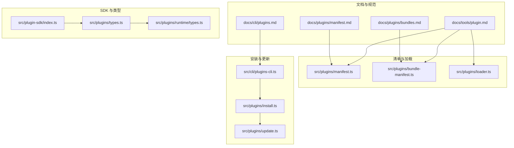
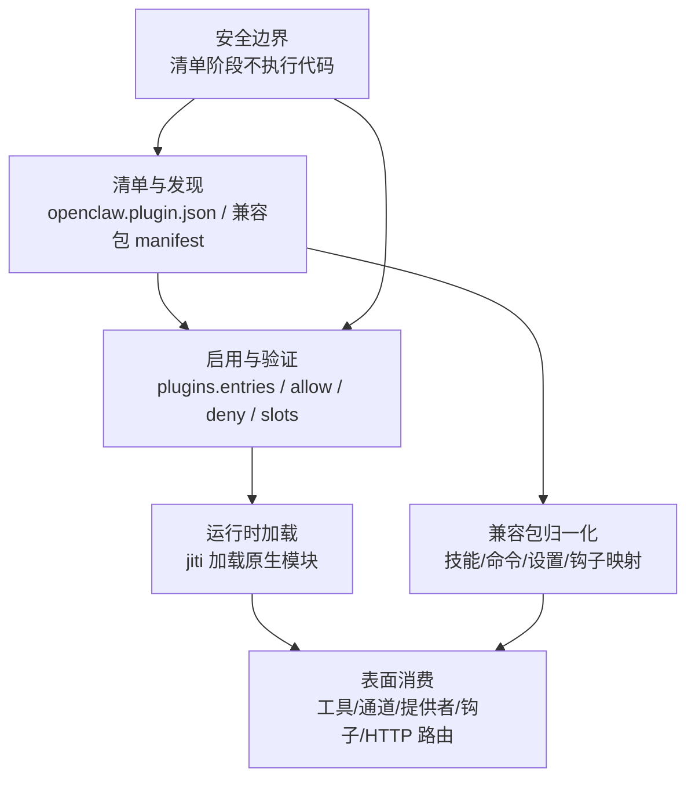
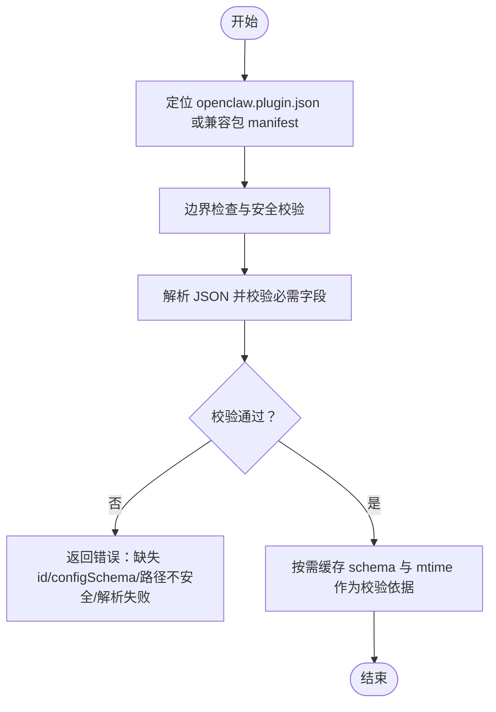
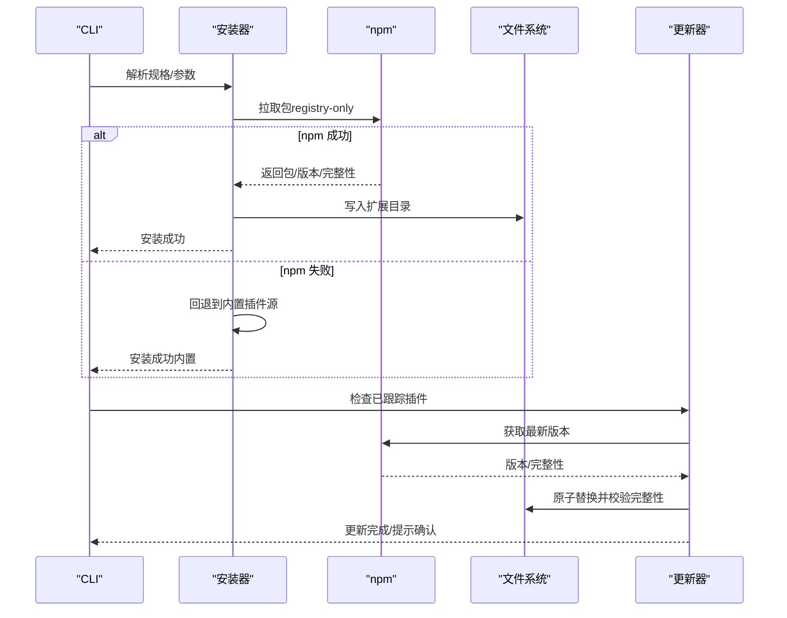
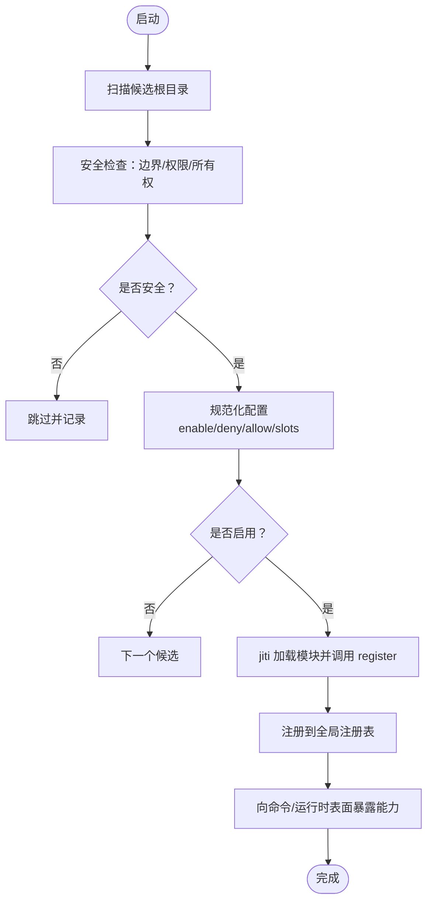
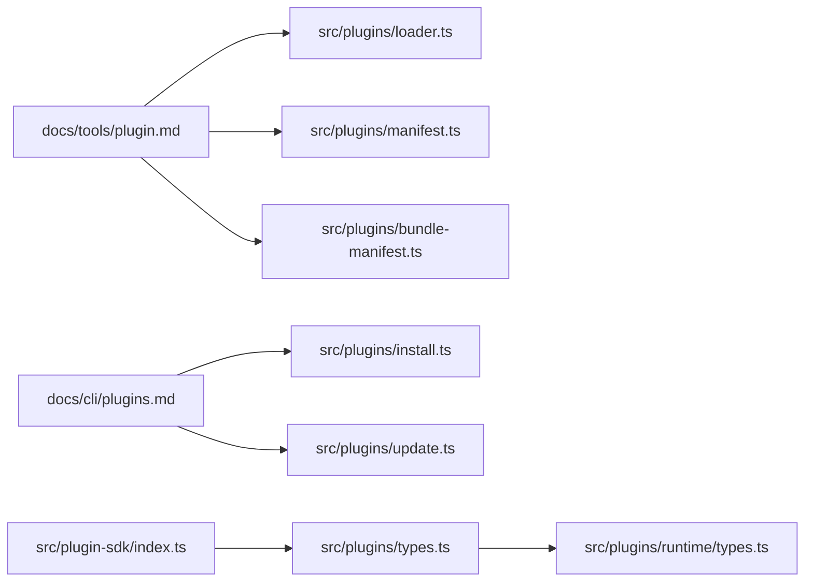

# 插件问题

<cite>
**本文引用的文件**
- [docs/cli/plugins.md](file://docs/cli/plugins.md)
- [docs/plugins/manifest.md](file://docs/plugins/manifest.md)
- [docs/plugins/bundles.md](file://docs/plugins/bundles.md)
- [docs/tools/plugin.md](file://docs/tools/plugin.md)
- [src/plugin-sdk/index.ts](file://src/plugin-sdk/index.ts)
- [src/plugins/types.ts](file://src/plugins/types.ts)
- [src/plugins/runtime/types.ts](file://src/plugins/runtime/types.ts)
- [src/plugins/manifest.ts](file://src/plugins/manifest.ts)
- [src/plugins/bundle-manifest.ts](file://src/plugins/bundle-manifest.ts)
- [src/plugins/loader.ts](file://src/plugins/loader.ts)
- [src/plugins/install.ts](file://src/plugins/install.ts)
- [src/plugins/update.ts](file://src/plugins/update.ts)
- [src/infra/plugin-install-path-warnings.ts](file://src/infra/plugin-install-path-warnings.ts)
- [src/infra/npm-pack-install.test.ts](file://src/infra/npm-pack-install.test.ts)
- [src/infra/install-package-dir.test.ts](file://src/infra/install-package-dir.test.ts)
- [src/cli/plugins-cli.ts](file://src/cli/plugins-cli.ts)
- [docs/gateway/troubleshooting.md](file://docs/gateway/troubleshooting.md)
- [extensions/diffs/openclaw.plugin.json](file://extensions/diffs/openclaw.plugin.json)
- [extensions/anthropic/openclaw.plugin.json](file://extensions/anthropic/openclaw.plugin.json)
</cite>

## 目录
1. [简介](#简介)
2. [项目结构](#项目结构)
3. [核心组件](#核心组件)
4. [架构总览](#架构总览)
5. [详细组件分析](#详细组件分析)
6. [依赖分析](#依赖分析)
7. [性能考虑](#性能考虑)
8. [故障排除指南](#故障排除指南)
9. [结论](#结论)
10. [附录](#附录)

## 简介
本指南聚焦于 OpenClaw 插件系统在安装、加载、兼容性与运行时环境方面的常见问题与排障方法。内容覆盖：
- 安装失败、加载错误、兼容性问题、权限不足等诊断步骤
- 插件包格式验证、依赖关系检查、运行时环境配置与插件冲突处理
- 插件开发调试方法、插件状态监控与插件更新策略
- 插件安全扫描与权限审查最佳实践

## 项目结构
OpenClaw 的插件体系由“原生插件（openclaw.plugin.json + 运行模块）”与“兼容包（Codex/Claude/Cursor 布鲁姆）”两类组成。官方文档与实现分别从“发现/清单/验证/加载/表面消费”的四层模型与“清单优先”的行为边界进行设计。

图示来源
- [docs/tools/plugin.md:60-120](file://docs/tools/plugin.md#L60-L120)
- [docs/plugins/manifest.md:29-35](file://docs/plugins/manifest.md#L29-L35)
- [docs/plugins/bundles.md:10-50](file://docs/plugins/bundles.md#L10-L50)
- [docs/cli/plugins.md:20-31](file://docs/cli/plugins.md#L20-L31)
- [src/plugin-sdk/index.ts:1-100](file://src/plugin-sdk/index.ts#L1-L100)
- [src/plugins/types.ts:1-120](file://src/plugins/types.ts#L1-L120)
- [src/plugins/runtime/types.ts:1-64](file://src/plugins/runtime/types.ts#L1-L64)
- [src/plugins/manifest.ts:65-108](file://src/plugins/manifest.ts#L65-L108)
- [src/plugins/bundle-manifest.ts:91-132](file://src/plugins/bundle-manifest.ts#L91-L132)
- [src/plugins/loader.ts:1227-1261](file://src/plugins/loader.ts#L1227-L1261)
- [src/plugins/install.ts:182-235](file://src/plugins/install.ts#L182-L235)
- [src/plugins/update.ts:327-377](file://src/plugins/update.ts#L327-L377)
- [src/cli/plugins-cli.ts:322-346](file://src/cli/plugins-cli.ts#L322-L346)

章节来源
- [docs/tools/plugin.md:60-120](file://docs/tools/plugin.md#L60-L120)
- [docs/plugins/manifest.md:29-35](file://docs/plugins/manifest.md#L29-L35)
- [docs/plugins/bundles.md:10-50](file://docs/plugins/bundles.md#L10-L50)
- [docs/cli/plugins.md:20-31](file://docs/cli/plugins.md#L20-L31)

## 核心组件
- 清单与模式校验：原生插件必须提供 openclaw.plugin.json，并内嵌 JSON Schema；兼容包通过各自 manifest 或默认布局被归一化。
- 加载管线：发现候选根目录 → 读取清单/包元数据 → 拒绝不安全候选 → 规范化配置 → 决策启用 → 以 jiti 加载原生模块 → 注册能力到注册表。
- 安全边界：清单阶段禁止执行插件代码；原生运行时为进程内执行，无沙箱；兼容包仅映射能力，不执行运行时代码。
- 更新与完整性：npm 安装使用 --ignore-scripts；支持完整性哈希漂移检测与提示确认。

章节来源
- [docs/tools/plugin.md:440-481](file://docs/tools/plugin.md#L440-L481)
- [docs/plugins/manifest.md:68-84](file://docs/plugins/manifest.md#L68-L84)
- [docs/plugins/bundles.md:240-254](file://docs/plugins/bundles.md#L240-L254)
- [docs/cli/plugins.md:53-67](file://docs/cli/plugins.md#L53-L67)

## 架构总览
下图展示插件系统从“清单/发现/验证/加载/表面消费”的分层与边界：

图示来源
- [docs/tools/plugin.md:60-87](file://docs/tools/plugin.md#L60-L87)
- [docs/tools/plugin.md:440-481](file://docs/tools/plugin.md#L440-L481)
- [docs/plugins/bundles.md:31-68](file://docs/plugins/bundles.md#L31-L68)

## 详细组件分析

### 组件A：清单与模式校验
- 原生插件要求：id、configSchema 必填；空 schema 可接受；schema 在配置读写时验证而非运行时。
- 兼容包：自动识别 .codex-plugin、.claude-plugin、.cursor-plugin 布局；不使用 openclaw.plugin.json 验证。
- 安全检查：清单路径边界检查、拒绝硬链接；解析失败或非对象直接报错。

图示来源
- [src/plugins/manifest.ts:65-108](file://src/plugins/manifest.ts#L65-L108)
- [src/plugins/bundle-manifest.ts:91-132](file://src/plugins/bundle-manifest.ts#L91-L132)
- [docs/plugins/manifest.md:68-84](file://docs/plugins/manifest.md#L68-L84)

章节来源
- [src/plugins/manifest.ts:65-108](file://src/plugins/manifest.ts#L65-L108)
- [src/plugins/bundle-manifest.ts:91-132](file://src/plugins/bundle-manifest.ts#L91-L132)
- [docs/plugins/manifest.md:68-84](file://docs/plugins/manifest.md#L68-L84)

### 组件B：安装与更新流程
- 安装：支持 npm 规范（registry-only）、本地路径/归档；对裸 spec 与 @latest 采用稳定轨道；支持 --link 与 --pin。
- 更新：仅对 tracked 的 npm 插件生效；支持完整性哈希漂移警告与交互确认。
- 失败回退：npm 安装失败时可回退到同名内置插件源。

图示来源
- [docs/cli/plugins.md:44-90](file://docs/cli/plugins.md#L44-L90)
- [src/plugins/install.ts:182-235](file://src/plugins/install.ts#L182-L235)
- [src/plugins/update.ts:327-377](file://src/plugins/update.ts#L327-L377)
- [src/cli/plugins-cli.ts:322-346](file://src/cli/plugins-cli.ts#L322-L346)

章节来源
- [docs/cli/plugins.md:44-90](file://docs/cli/plugins.md#L44-L90)
- [src/plugins/install.ts:182-235](file://src/plugins/install.ts#L182-L235)
- [src/plugins/update.ts:327-377](file://src/plugins/update.ts#L327-L377)
- [src/cli/plugins-cli.ts:322-346](file://src/cli/plugins-cli.ts#L322-L346)

### 组件C：加载与运行时注册
- 发现顺序：配置路径 → 工作区扩展 → 全局扩展 → 内置扩展；同 id 同优先级时首个命中。
- 安全加固：候选路径边界检查、拒绝世界可写、可疑所有权；未受信任来源的非内置插件发出警告。
- 加载：manifest 验证通过后，若存在 register/activate 导出则创建 API 并调用注册。

图示来源
- [docs/tools/plugin.md:658-752](file://docs/tools/plugin.md#L658-L752)
- [src/plugins/loader.ts:1227-1261](file://src/plugins/loader.ts#L1227-L1261)

章节来源
- [docs/tools/plugin.md:658-752](file://docs/tools/plugin.md#L658-L752)
- [src/plugins/loader.ts:1227-1261](file://src/plugins/loader.ts#L1227-L1261)

### 组件D：兼容包映射与能力报告
- 支持：技能根、Claude 命令根、Cursor 命令根、Codex 钩子目录等；settings.json 映射为嵌入式 Pi 设置。
- 不执行：Claude hooks.json、Cursor hooks.json、rules 等当前未连线的能力会显示为“已检测但未连线”。

章节来源
- [docs/plugins/bundles.md:84-158](file://docs/plugins/bundles.md#L84-L158)
- [docs/plugins/bundles.md:268-293](file://docs/plugins/bundles.md#L268-L293)

## 依赖分析
- 文档与实现耦合点：CLI 文档与安装/更新实现强相关；清单文档与 manifest/bundle-manifest 实现强相关；插件指南与 loader 实现强相关。
- 类型与 SDK：plugin-sdk 汇聚了插件 API、通道适配器、运行时辅助等类型定义，供插件开发与运行时消费。
- 运行时类型：PluginRuntime 提供子代理运行、消息查询与会话管理等接口。

图示来源
- [docs/tools/plugin.md:60-120](file://docs/tools/plugin.md#L60-L120)
- [src/plugins/loader.ts:1227-1261](file://src/plugins/loader.ts#L1227-L1261)
- [src/plugins/manifest.ts:65-108](file://src/plugins/manifest.ts#L65-L108)
- [src/plugins/bundle-manifest.ts:91-132](file://src/plugins/bundle-manifest.ts#L91-L132)
- [docs/cli/plugins.md:44-90](file://docs/cli/plugins.md#L44-L90)
- [src/plugins/install.ts:182-235](file://src/plugins/install.ts#L182-L235)
- [src/plugins/update.ts:327-377](file://src/plugins/update.ts#L327-L377)
- [src/plugin-sdk/index.ts:1-100](file://src/plugin-sdk/index.ts#L1-L100)
- [src/plugins/types.ts:1-120](file://src/plugins/types.ts#L1-L120)
- [src/plugins/runtime/types.ts:1-64](file://src/plugins/runtime/types.ts#L1-L64)

章节来源
- [src/plugin-sdk/index.ts:1-100](file://src/plugin-sdk/index.ts#L1-L100)
- [src/plugins/types.ts:1-120](file://src/plugins/types.ts#L1-L120)
- [src/plugins/runtime/types.ts:1-64](file://src/plugins/runtime/types.ts#L1-L64)

## 性能考虑
- 缓存机制：清单与发现结果、注册表在进程内短缓存，减少启动与重复命令开销；可通过环境变量禁用或调整窗口。
- 安全前置：在加载前完成清单与路径安全检查，避免运行时异常带来的额外成本。

章节来源
- [docs/tools/plugin.md:649-657](file://docs/tools/plugin.md#L649-L657)

## 故障排除指南

### 一、安装失败
- 症状
  - npm 安装失败（包不存在/404/权限）
  - 归档安装失败（格式不支持/解压失败）
  - 裸规格或 @latest 解析到预发布版本被拒绝
- 诊断步骤
  - 使用 openclaw plugins install 指定 npm 规格，确认 registry-only 且版本/标签正确
  - 若裸规格匹配内置插件 id，改用显式作用域包名
  - 对本地路径/归档，确认支持的扩展名与布局
- 处理建议
  - 优先使用带版本号或 dist-tag 的精确规格
  - 出现 npm 失败时，CLI 会尝试回退到内置同名插件源
  - 如需本地开发，使用 --link 将目录加入 plugins.load.paths

章节来源
- [docs/cli/plugins.md:44-90](file://docs/cli/plugins.md#L44-L90)
- [src/plugins/install.ts:182-235](file://src/plugins/install.ts#L182-L235)
- [src/cli/plugins-cli.ts:322-346](file://src/cli/plugins-cli.ts#L322-L346)

### 二、加载错误
- 症状
  - 插件缺少 openclaw.plugin.json 或 manifest 路径不安全
  - manifest 解析失败或非对象
  - register/activate 导出缺失
  - 配置 schema 校验失败
- 诊断步骤
  - 检查插件根目录是否存在 openclaw.plugin.json
  - 确认清单路径边界检查通过（无硬链接、无越界）
  - 验证 configSchema 是否有效
  - 确认模块导出 register/activate
- 处理建议
  - 修复 openclaw.plugin.json 结构与字段
  - 修正 schema 并确保 schema 缓存键与 mtime 关联
  - 补齐模块导出并确保运行时可加载

章节来源
- [src/plugins/manifest.ts:65-108](file://src/plugins/manifest.ts#L65-L108)
- [src/plugins/loader.ts:1227-1261](file://src/plugins/loader.ts#L1227-L1261)

### 三、兼容性问题
- 症状
  - 兼容包未按预期执行（如 Claude hooks.json 未执行）
  - 能力报告中出现“检测到但未连线”
- 诊断步骤
  - 使用 openclaw plugins info 查看能力映射
  - 确认包布局符合支持的子集（技能/命令/钩子/设置）
- 处理建议
  - 优先使用 Codex hook 目录布局或 Claude/Cursor 的技能/命令根
  - 对未连线能力，等待后续版本支持或改用原生插件

章节来源
- [docs/plugins/bundles.md:124-158](file://docs/plugins/bundles.md#L124-L158)
- [docs/plugins/bundles.md:268-293](file://docs/plugins/bundles.md#L268-L293)

### 四、权限不足
- 症状
  - 世界可写路径被拒绝
  - 路径所有权可疑（非当前用户且非 root）
- 诊断步骤
  - 检查插件根目录与父路径权限
  - 确认非内置插件来源的路径所有权
- 处理建议
  - 修正目录权限与属主
  - 对工作区插件，明确启用/允许列表以满足信任边界

章节来源
- [docs/tools/plugin.md:722-730](file://docs/tools/plugin.md#L722-L730)

### 五、插件包格式验证
- 原生插件
  - 必须包含 openclaw.plugin.json，且 id 与 configSchema 存在
  - 即使无配置也需提供空 schema
- 兼容包
  - 自动识别 .codex-plugin、.claude-plugin、.cursor-plugin 布局
  - 不强制使用 openclaw.plugin.json 验证，但会映射支持的能力

章节来源
- [docs/plugins/manifest.md:29-35](file://docs/plugins/manifest.md#L29-L35)
- [docs/plugins/bundles.md:159-217](file://docs/plugins/bundles.md#L159-L217)

### 六、依赖关系检查
- npm 依赖安装使用 --ignore-scripts，避免生命周期脚本
- 包含 openclaw.extensions 的包，其入口必须位于插件目录内（经符号链接解析后）

章节来源
- [docs/cli/plugins.md:53-56](file://docs/cli/plugins.md#L53-L56)
- [docs/tools/plugin.md:792-799](file://docs/tools/plugin.md#L792-L799)

### 七、运行时环境配置
- 缓存控制：可通过环境变量禁用发现/清单缓存或调整缓存窗口
- 运行时日志：加载错误会在日志中输出具体插件 id 与错误信息

章节来源
- [docs/tools/plugin.md:649-657](file://docs/tools/plugin.md#L649-L657)
- [src/plugins/loader.ts:1227-1261](file://src/plugins/loader.ts#L1227-L1261)

### 八、插件冲突处理
- 同 id 冲突：按扫描顺序首个命中，后续同 id 复制被忽略
- 工作区插件可覆盖内置插件（用于开发/热修复）
- 通过 plugins.allow 以 id 为基础进行授权，不基于来源

章节来源
- [docs/tools/plugin.md:742-752](file://docs/tools/plugin.md#L742-L752)

### 九、插件开发调试方法
- 清单优先：先保证 openclaw.plugin.json 与 schema 正确，再加载运行模块
- 读写时验证：配置读写阶段即进行 schema 校验，避免运行时崩溃
- 诊断命令：使用 openclaw doctor 与 openclaw plugins doctor 获取更详细的诊断信息

章节来源
- [docs/tools/plugin.md:458-470](file://docs/tools/plugin.md#L458-L470)
- [docs/cli/plugins.md:28](file://docs/cli/plugins.md#L28)

### 十、插件状态监控
- 列表与详情：openclaw plugins list/info 查看格式、子类型与能力
- 运行时健康：结合 openclaw status、openclaw gateway status、openclaw logs --follow
- 状态问题：参考网关故障排除文档中的通用排查流程

章节来源
- [docs/cli/plugins.md:20-43](file://docs/cli/plugins.md#L20-L43)
- [docs/gateway/troubleshooting.md:14-31](file://docs/gateway/troubleshooting.md#L14-L31)

### 十一、插件更新策略
- 仅对 tracked 的 npm 插件生效
- 支持完整性哈希漂移警告与交互确认
- --dry-run 可预检更新风险

章节来源
- [docs/cli/plugins.md:109-122](file://docs/cli/plugins.md#L109-L122)
- [src/plugins/update.ts:327-377](file://src/plugins/update.ts#L327-L377)

### 十二、安全扫描与权限审查
- 安装依赖使用 --ignore-scripts，避免构建脚本
- 安装完整性：支持完整性哈希校验与漂移告警
- 安全边界：清单阶段不执行代码；原生插件进程内执行，无沙箱
- 路径安全：拒绝世界可写与可疑所有权；内置插件默认开启

章节来源
- [docs/cli/plugins.md:53-56](file://docs/cli/plugins.md#L53-L56)
- [src/infra/npm-pack-install.test.ts:151-192](file://src/infra/npm-pack-install.test.ts#L151-L192)
- [docs/tools/plugin.md:129-148](file://docs/tools/plugin.md#L129-L148)
- [docs/tools/plugin.md:722-730](file://docs/tools/plugin.md#L722-L730)

## 结论
OpenClaw 插件系统的故障排除应遵循“清单优先、安全前置、验证在先”的原则。通过规范的清单与 schema、严格的路径与权限检查、以及清晰的安装/更新流程，可显著降低安装失败、加载错误与兼容性问题的发生概率。对于权限不足与冲突问题，建议结合 allow 列表与扫描顺序进行治理。同时，利用 doctor 与状态命令进行持续监控，配合完整性与缓存策略提升稳定性与可观测性。

## 附录

### A. 常见清单样例参考
- 原生插件清单字段与 schema 示例：参见 [extensions/diffs/openclaw.plugin.json:1-183](file://extensions/diffs/openclaw.plugin.json#L1-L183)
- ProviderAuthEnvVars 示例：参见 [extensions/anthropic/openclaw.plugin.json:1-13](file://extensions/anthropic/openclaw.plugin.json#L1-L13)

章节来源
- [extensions/diffs/openclaw.plugin.json:1-183](file://extensions/diffs/openclaw.plugin.json#L1-L183)
- [extensions/anthropic/openclaw.plugin.json:1-13](file://extensions/anthropic/openclaw.plugin.json#L1-L13)