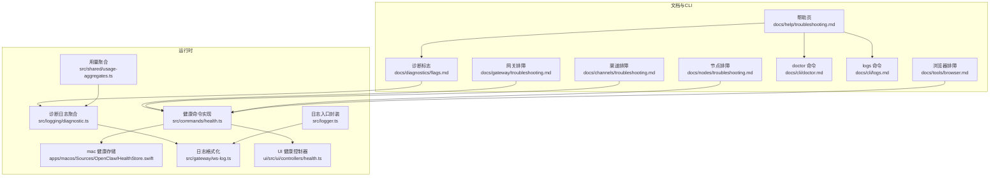
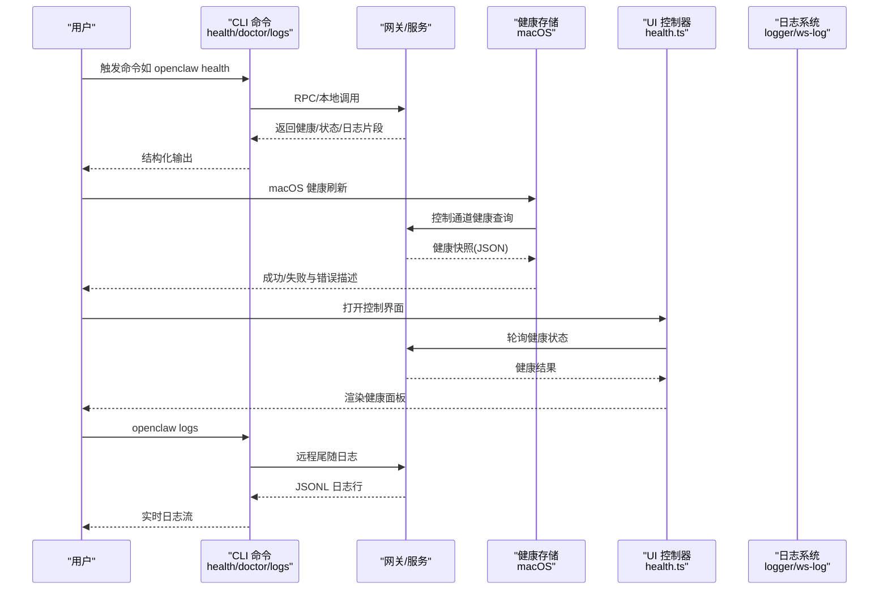
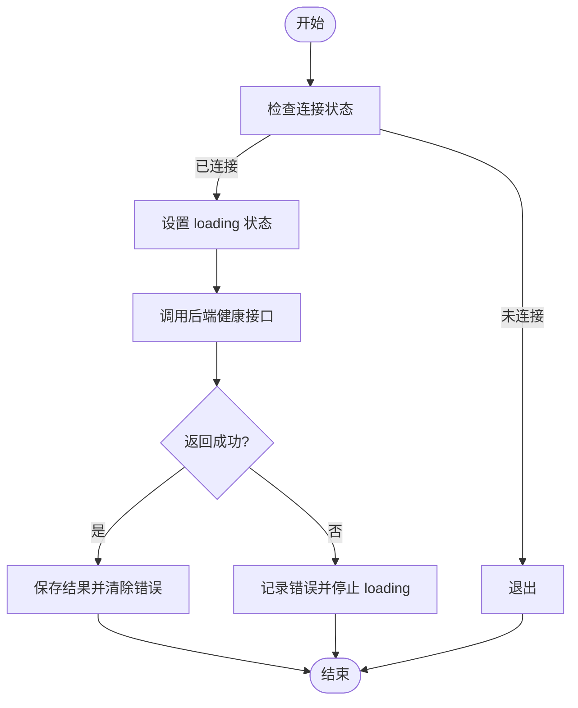
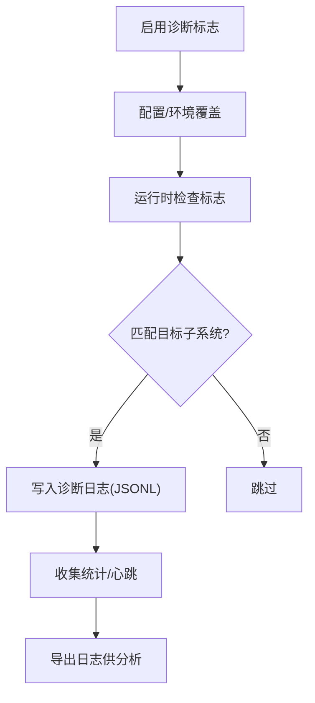
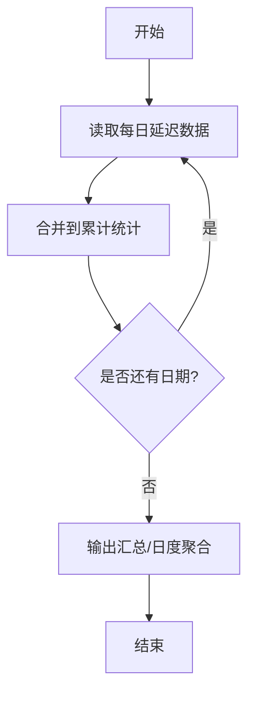
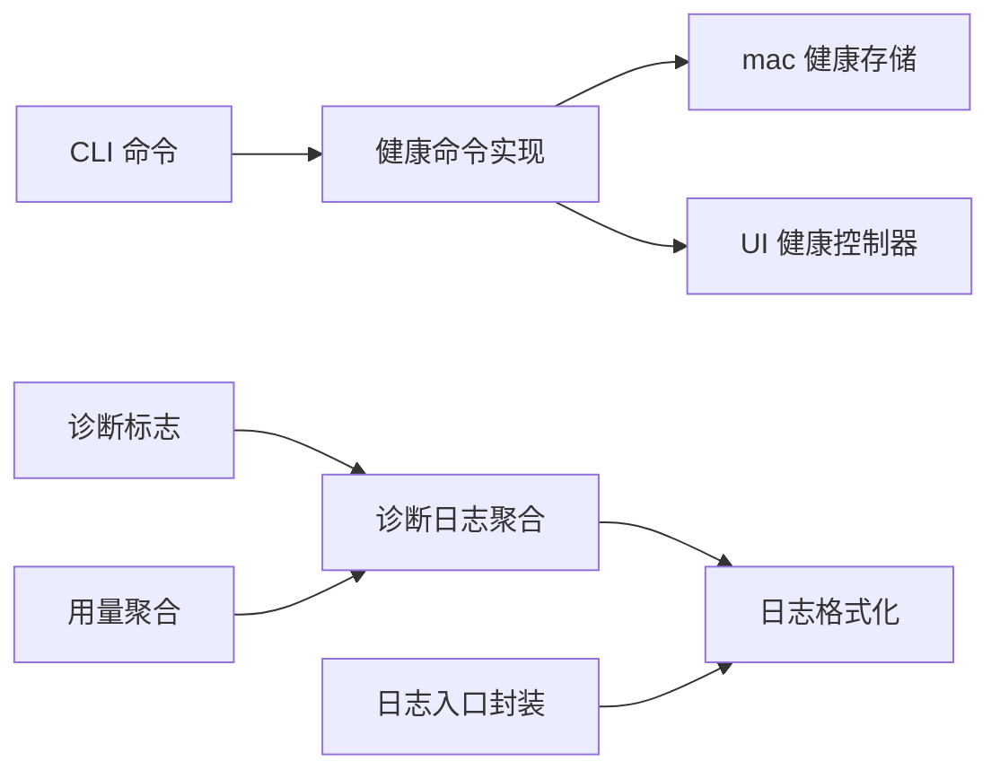

# 故障排除

<cite>
**本文引用的文件**
- [docs/help/troubleshooting.md](file://docs/help/troubleshooting.md)
- [docs/gateway/troubleshooting.md](file://docs/gateway/troubleshooting.md)
- [docs/channels/troubleshooting.md](file://docs/channels/troubleshooting.md)
- [docs/nodes/troubleshooting.md](file://docs/nodes/troubleshooting.md)
- [docs/tools/browser.md](file://docs/tools/browser.md)
- [docs/cli/doctor.md](file://docs/cli/doctor.md)
- [docs/cli/logs.md](file://docs/cli/logs.md)
- [docs/diagnostics/flags.md](file://docs/diagnostics/flags.md)
- [src/commands/health.ts](file://src/commands/health.ts)
- [apps/macos/Sources/OpenClaw/HealthStore.swift](file://apps/macos/Sources/OpenClaw/HealthStore.swift)
- [src/infra/diagnostic-flags.test.ts](file://src/infra/diagnostic-flags.test.ts)
- [src/logging/diagnostic.ts](file://src/logging/diagnostic.ts)
- [src/logger.ts](file://src/logger.ts)
- [src/gateway/ws-log.ts](file://src/gateway/ws-log.ts)
- [src/shared/usage-aggregates.ts](file://src/shared/usage-aggregates.ts)
- [ui/src/ui/controllers/health.ts](file://ui/src/ui/controllers/health.ts)
- [.github/ISSUE_TEMPLATE/bug_report.yml](file://.github/ISSUE_TEMPLATE/bug_report.yml)
- [.github/ISSUE_TEMPLATE/feature_request.yml](file://.github/ISSUE_TEMPLATE/feature_request.yml)
</cite>

## 目录
1. [简介](#简介)
2. [项目结构](#项目结构)
3. [核心组件](#核心组件)
4. [架构总览](#架构总览)
5. [详细组件分析](#详细组件分析)
6. [依赖关系分析](#依赖关系分析)
7. [性能考量](#性能考量)
8. [故障排除指南](#故障排除指南)
9. [结论](#结论)
10. [附录](#附录)

## 简介
本指南面向 OpenClaw 用户与运维人员，提供系统化、可操作的故障排除方法与诊断工具使用说明。内容覆盖：
- 健康检查与状态诊断
- 日志采集与分析
- 性能与用量洞察
- 平台/渠道/节点/浏览器等专项排查
- 问题报告模板与社区支持
- 预防性维护与监控最佳实践

## 项目结构
OpenClaw 将“故障排除”能力分布在多个层面：
- 文档层：帮助页、运行手册、CLI 参考
- 命令层：health、doctor、logs、browser 等命令
- 运行时层：健康快照、诊断标志、日志格式化
- 平台层：macOS 健康刷新、UI 健康加载
- 扩展层：诊断 OTel 插件、诊断标志匹配逻辑

图示来源
- [docs/help/troubleshooting.md](file://docs/help/troubleshooting.md)
- [docs/gateway/troubleshooting.md](file://docs/gateway/troubleshooting.md)
- [docs/channels/troubleshooting.md](file://docs/channels/troubleshooting.md)
- [docs/nodes/troubleshooting.md](file://docs/nodes/troubleshooting.md)
- [docs/tools/browser.md](file://docs/tools/browser.md)
- [docs/cli/doctor.md](file://docs/cli/doctor.md)
- [docs/cli/logs.md](file://docs/cli/logs.md)
- [docs/diagnostics/flags.md](file://docs/diagnostics/flags.md)
- [src/commands/health.ts](file://src/commands/health.ts)
- [apps/macos/Sources/OpenClaw/HealthStore.swift](file://apps/macos/Sources/OpenClaw/HealthStore.swift)
- [src/logging/diagnostic.ts](file://src/logging/diagnostic.ts)
- [src/gateway/ws-log.ts](file://src/gateway/ws-log.ts)
- [src/logger.ts](file://src/logger.ts)
- [src/shared/usage-aggregates.ts](file://src/shared/usage-aggregates.ts)
- [ui/src/ui/controllers/health.ts](file://ui/src/ui/controllers/health.ts)

章节来源
- [docs/help/troubleshooting.md](file://docs/help/troubleshooting.md)
- [docs/gateway/troubleshooting.md](file://docs/gateway/troubleshooting.md)
- [docs/channels/troubleshooting.md](file://docs/channels/troubleshooting.md)
- [docs/nodes/troubleshooting.md](file://docs/nodes/troubleshooting.md)
- [docs/tools/browser.md](file://docs/tools/browser.md)
- [docs/cli/doctor.md](file://docs/cli/doctor.md)
- [docs/cli/logs.md](file://docs/cli/logs.md)
- [docs/diagnostics/flags.md](file://docs/diagnostics/flags.md)
- [src/commands/health.ts](file://src/commands/health.ts)
- [apps/macos/Sources/OpenClaw/HealthStore.swift](file://apps/macos/Sources/OpenClaw/HealthStore.swift)
- [src/logging/diagnostic.ts](file://src/logging/diagnostic.ts)
- [src/gateway/ws-log.ts](file://src/gateway/ws-log.ts)
- [src/logger.ts](file://src/logger.ts)
- [src/shared/usage-aggregates.ts](file://src/shared/usage-aggregates.ts)
- [ui/src/ui/controllers/health.ts](file://ui/src/ui/controllers/health.ts)

## 核心组件
- 健康检查与状态
  - CLI 健康命令：输出通道/插件/账户维度的健康摘要，并在需要时打印插件自报告。
  - macOS 健康存储：通过控制通道拉取健康快照，记录成功/失败与错误描述。
  - UI 健康加载：在连接状态下轮询健康结果，避免重复请求与并发刷新。

- 诊断标志与日志
  - 诊断标志：按命名空间启用子系统日志（如 telegram.http），支持通配与环境覆盖。
  - 日志格式化：统一错误信息格式，保留关键字段（名称、消息、代码）。
  - 诊断日志聚合：会话级统计与心跳，辅助定位异常峰值与吞吐瓶颈。

- 性能与用量
  - 用量聚合：按日合并延迟指标（均值、最小、最大、P95），用于生成趋势与热点分析。

章节来源
- [src/commands/health.ts](file://src/commands/health.ts)
- [apps/macos/Sources/OpenClaw/HealthStore.swift](file://apps/macos/Sources/OpenClaw/HealthStore.swift)
- [ui/src/ui/controllers/health.ts](file://ui/src/ui/controllers/health.ts)
- [docs/diagnostics/flags.md](file://docs/diagnostics/flags.md)
- [src/gateway/ws-log.ts](file://src/gateway/ws-log.ts)
- [src/logging/diagnostic.ts](file://src/logging/diagnostic.ts)
- [src/shared/usage-aggregates.ts](file://src/shared/usage-aggregates.ts)

## 架构总览
下图展示从用户到命令、再到运行时与平台组件的交互路径，以及健康检查与日志流的关键节点。

图示来源
- [src/commands/health.ts](file://src/commands/health.ts)
- [apps/macos/Sources/OpenClaw/HealthStore.swift](file://apps/macos/Sources/OpenClaw/HealthStore.swift)
- [ui/src/ui/controllers/health.ts](file://ui/src/ui/controllers/health.ts)
- [docs/cli/logs.md](file://docs/cli/logs.md)
- [src/gateway/ws-log.ts](file://src/gateway/ws-log.ts)
- [src/logger.ts](file://src/logger.ts)

## 详细组件分析

### 健康检查组件
- 健康命令职责
  - 汇总通道/插件/账户健康状态
  - 在 verbose 模式下输出账户明细
  - 对已绑定且具备自报告能力的插件触发自报告

- macOS 健康存储
  - 定期刷新健康快照，记录上次成功时间与错误
  - 失败时区分“输出非 JSON”与“抛出异常”，并记录警告/错误日志

- UI 健康加载
  - 防止并发刷新与重复请求
  - 在连接状态变化时触发健康数据获取

图示来源
- [ui/src/ui/controllers/health.ts](file://ui/src/ui/controllers/health.ts)

章节来源
- [src/commands/health.ts](file://src/commands/health.ts)
- [apps/macos/Sources/OpenClaw/HealthStore.swift](file://apps/macos/Sources/OpenClaw/HealthStore.swift)
- [ui/src/ui/controllers/health.ts](file://ui/src/ui/controllers/health.ts)

### 诊断标志与日志系统
- 诊断标志
  - 支持命名空间匹配与通配符
  - 允许通过配置或环境变量临时启用
  - 输出到标准诊断日志文件（JSONL）

- 日志格式化
  - 统一错误对象提取 name/message/code
  - 截断过长日志，保留关键信息

- 诊断日志聚合
  - 会话级统计与心跳，便于定位异常时段与峰值

图示来源
- [docs/diagnostics/flags.md](file://docs/diagnostics/flags.md)
- [src/infra/diagnostic-flags.test.ts](file://src/infra/diagnostic-flags.test.ts)
- [src/gateway/ws-log.ts](file://src/gateway/ws-log.ts)
- [src/logging/diagnostic.ts](file://src/logging/diagnostic.ts)

章节来源
- [docs/diagnostics/flags.md](file://docs/diagnostics/flags.md)
- [src/infra/diagnostic-flags.test.ts](file://src/infra/diagnostic-flags.test.ts)
- [src/gateway/ws-log.ts](file://src/gateway/ws-log.ts)
- [src/logging/diagnostic.ts](file://src/logging/diagnostic.ts)

### 性能与用量分析
- 用量聚合
  - 合并延迟指标（计数、求和、最小、最大、P95）
  - 按日聚合，支持生成缓存命中率、错误率、吞吐量等洞察

图示来源
- [src/shared/usage-aggregates.ts](file://src/shared/usage-aggregates.ts)

章节来源
- [src/shared/usage-aggregates.ts](file://src/shared/usage-aggregates.ts)

## 依赖关系分析
- 命令层依赖运行时健康与日志系统
- macOS 健康存储依赖控制通道与网关健康接口
- UI 健康控制器依赖 CLI 健康命令与网关 RPC
- 诊断标志与日志系统共同支撑问题定位与根因分析

图示来源
- [src/commands/health.ts](file://src/commands/health.ts)
- [apps/macos/Sources/OpenClaw/HealthStore.swift](file://apps/macos/Sources/OpenClaw/HealthStore.swift)
- [ui/src/ui/controllers/health.ts](file://ui/src/ui/controllers/health.ts)
- [docs/diagnostics/flags.md](file://docs/diagnostics/flags.md)
- [src/logging/diagnostic.ts](file://src/logging/diagnostic.ts)
- [src/gateway/ws-log.ts](file://src/gateway/ws-log.ts)
- [src/logger.ts](file://src/logger.ts)
- [src/shared/usage-aggregates.ts](file://src/shared/usage-aggregates.ts)

章节来源
- [src/commands/health.ts](file://src/commands/health.ts)
- [apps/macos/Sources/OpenClaw/HealthStore.swift](file://apps/macos/Sources/OpenClaw/HealthStore.swift)
- [ui/src/ui/controllers/health.ts](file://ui/src/ui/controllers/health.ts)
- [docs/diagnostics/flags.md](file://docs/diagnostics/flags.md)
- [src/logging/diagnostic.ts](file://src/logging/diagnostic.ts)
- [src/gateway/ws-log.ts](file://src/gateway/ws-log.ts)
- [src/logger.ts](file://src/logger.ts)
- [src/shared/usage-aggregates.ts](file://src/shared/usage-aggregates.ts)

## 性能考量
- 使用用量聚合指标识别异常高峰与低效模式
- 通过诊断标志聚焦特定子系统，降低全局日志开销
- 利用 UI 健康加载的幂等设计避免重复请求
- 在高负载场景下优先使用远程日志与诊断文件，减少控制面压力

## 故障排除指南

### 快速三分钟排障流程
- 执行以下命令，按顺序观察输出与错误：
  - openclaw status
  - openclaw status --all
  - openclaw gateway probe
  - openclaw gateway status
  - openclaw doctor
  - openclaw channels status --probe
  - openclaw logs --follow

- 健康信号参考
  - openclaw status：显示已配置渠道，无明显认证错误
  - openclaw status --all：完整报告可分享
  - openclaw gateway probe：可达性正常（例如 Reachable: yes；RPC 缺少 operator.read 属于降级而非连接失败）
  - openclaw gateway status：Runtime: running，RPC 探针 ok
  - openclaw doctor：无阻塞性配置/服务错误
  - openclaw channels status --probe：各渠道显示 connected 或 ready
  - openclaw logs --follow：活动稳定，无重复致命错误

章节来源
- [docs/help/troubleshooting.md](file://docs/help/troubleshooting.md)

### 症状导向排查树
- 问题分类与首查命令
  - 无回复：检查状态、网关、渠道探针、配对列表、日志
  - 控制 UI 无法连接：检查状态、网关、日志、doctor、渠道探针
  - 网关未启动或服务未运行：检查状态、网关、日志、doctor、渠道探针
  - 渠道已连但消息不流动：检查传输、配对/白名单、提及策略
  - 定时任务/心跳未触发或未投递：检查定时器、运行历史、静默时段
  - 节点已配对但相机/屏幕/执行失败：检查前台、权限、执行审批
  - 浏览器工具失败：检查浏览器状态、可到达性、扩展附加

章节来源
- [docs/help/troubleshooting.md](file://docs/help/troubleshooting.md)

### 网关专项排障
- 命令优先级
  - openclaw status
  - openclaw gateway status
  - openclaw logs --follow
  - openclaw doctor
  - openclaw channels status --probe

- 关键健康信号
  - openclaw gateway status 显示 Runtime: running 且 RPC 探针 ok
  - openclaw doctor 无阻塞性配置/服务问题
  - openclaw channels status --probe 显示 connected/ready

- 常见错误与修复
  - Anthropic 长上下文 429：检查模型配置与订阅资格，或切换回普通上下文窗口
  - 设备身份/令牌不匹配：根据错误详情码执行一次性设备重试或轮换令牌
  - 绑定冲突：确保非环回绑定时配置了认证，或调整端口避免占用

章节来源
- [docs/gateway/troubleshooting.md](file://docs/gateway/troubleshooting.md)

### 渠道专项排障
- 命令优先级
  - openclaw status
  - openclaw gateway status
  - openclaw logs --follow
  - openclaw doctor
  - openclaw channels status --probe

- 常见渠道问题与签名
  - WhatsApp：DM 未回复、群忽略、随机断线重登
  - Telegram：/start 后无可用回复流、群静默、网络错误导致发送失败、启动时 setMyCommands 被拒
  - Discord：公会未回复、群消息被忽略、DM 未回复
  - Slack：Socket 已连但无响应、DM 被阻止、频道未处理
  - iMessage/BlueBubbles：无入站事件、macOS 权限缺失、DM 发送方被阻止
  - Signal：守护进程可达但机器人静默、DM 被阻止、群回复未触发
  - Matrix：登录但房间消息忽略、DM 未处理、加密房间失败

章节来源
- [docs/channels/troubleshooting.md](file://docs/channels/troubleshooting.md)

### 节点专项排障
- 命令优先级
  - openclaw status
  - openclaw gateway status
  - openclaw logs --follow
  - openclaw doctor
  - openclaw channels status --probe
  - openclaw nodes status
  - openclaw nodes describe --node <idOrNameOrIp>
  - openclaw approvals get --node <idOrNameOrIp>

- 常见节点错误码
  - NODE_BACKGROUND_UNAVAILABLE：节点应用处于后台，需切前台
  - *_PERMISSION_REQUIRED / LOCATION_PERMISSION_REQUIRED：系统权限缺失或拒绝
  - SYSTEM_RUN_DENIED：执行审批待决或允许清单未包含命令

章节来源
- [docs/nodes/troubleshooting.md](file://docs/nodes/troubleshooting.md)

### 浏览器工具专项排障
- 命令与检查要点
  - openclaw browser status
  - openclaw browser start --browser-profile openclaw
  - openclaw browser profiles
  - openclaw logs --follow
  - openclaw doctor

- 常见错误与修复
  - 无法启动 Chrome CDP：检查浏览器可执行路径与权限
  - 未附加扩展标签页：确认扩展已安装并点击图标进行附加
  - 仅 attach-only 模式无可达目标：确保存在可连接的 CDP 目标

章节来源
- [docs/tools/browser.md](file://docs/tools/browser.md)

### doctor 命令与自动修复
- 功能要点
  - 健康检查 + 快速修复
  - 交互提示仅在 TTY 且非非交互模式下出现
  - 写备份并清理未知配置键
  - 检测并归档会话目录孤儿转录文件
  - 重写旧版计划任务存储
  - 内存搜索就绪检查与模型配置建议
  - Docker 不可用时给出明确告警与修复建议
  - SecretRef 管理的令牌/密码不可用时只发出只读告警

- macOS launchctl 环境覆盖
  - 若曾设置 OPENCLAW_GATEWAY_TOKEN/PASSWORD，可能覆盖配置导致持续 unauthorized
  - 提供 getenv 与 unsetenv 操作示例

章节来源
- [docs/cli/doctor.md](file://docs/cli/doctor.md)

### 日志采集与分析
- 远程日志
  - openclaw logs：通过 RPC 尾随网关日志（支持 JSON、本地时间戳）
  - 适用于远程网关与容器环境

- 诊断标志日志
  - 通过 diagnostics.flags 或 OPENCLAW_DIAGNOSTICS 启用目标子系统日志
  - 输出到 JSONL 文件，支持过滤与实时跟踪

- 日志格式化
  - 统一错误对象提取 name/message/code
  - 截断超长日志，保留关键信息

章节来源
- [docs/cli/logs.md](file://docs/cli/logs.md)
- [docs/diagnostics/flags.md](file://docs/diagnostics/flags.md)
- [src/gateway/ws-log.ts](file://src/gateway/ws-log.ts)
- [src/logger.ts](file://src/logger.ts)

### 性能诊断与用量洞察
- 用量聚合
  - 合并每日延迟指标（计数、求和、最小、最大、P95）
  - 生成缓存命中率、错误率、吞吐量等洞察卡片

- UI 用量视图
  - 展示模型/提供商/工具/代理/渠道的 Top 列表
  - 标注峰值错误日/小时，辅助定位异常时段

章节来源
- [src/shared/usage-aggregates.ts](file://src/shared/usage-aggregates.ts)

### 问题报告模板与社区支持
- 问题报告模板
  - Bug 报告模板：用于提交缺陷与复现步骤
  - 功能请求模板：用于提出新需求与背景说明

- 社区与支持
  - GitHub Issues：按模板填写并附上健康报告、doctor 输出、相关日志
  - 文档与深潜手册：先走快速三分钟流程，再进入对应章节深挖

章节来源
- [.github/ISSUE_TEMPLATE/bug_report.yml](file://.github/ISSUE_TEMPLATE/bug_report.yml)
- [.github/ISSUE_TEMPLATE/feature_request.yml](file://.github/ISSUE_TEMPLATE/feature_request.yml)
- [docs/help/troubleshooting.md](file://docs/help/troubleshooting.md)

### 预防性维护与监控最佳实践
- 定期执行 doctor 以发现配置漂移与服务异常
- 使用诊断标志聚焦可疑子系统，缩短定位时间
- 保持网关与节点的私有网络暴露（如 Tailscale），避免公网直连
- 对远程 CDP 端点与令牌采用短期有效与密钥管理器保护
- 建立健康面板与日志告警，关注重复致命错误与异常峰值

## 结论
通过“快速三分钟流程 + 症状导向排查树 + 专项渠道/节点/浏览器排障 + doctor 自动修复 + 诊断标志与日志分析 + 用量洞察”的组合拳，OpenClaw 用户与运维人员可以高效定位并解决问题。建议将 doctor 与诊断标志纳入日常巡检，结合 UI 健康面板与日志告警，形成闭环的预防性维护体系。

## 附录
- 常用命令速查
  - openclaw status / openclaw status --all
  - openclaw gateway probe / openclaw gateway status
  - openclaw doctor
  - openclaw channels status --probe
  - openclaw logs --follow
  - openclaw browser status / openclaw browser start --browser-profile openclaw
  - openclaw nodes status / openclaw nodes describe --node <id>
  - openclaw approvals get --node <id>

- 诊断标志示例
  - 启用 telegram.http 与 gateway.* 子系统日志
  - 通过环境变量临时禁用所有标志或启用特定组合

章节来源
- [docs/help/troubleshooting.md](file://docs/help/troubleshooting.md)
- [docs/cli/doctor.md](file://docs/cli/doctor.md)
- [docs/diagnostics/flags.md](file://docs/diagnostics/flags.md)
- [docs/tools/browser.md](file://docs/tools/browser.md)
- [docs/nodes/troubleshooting.md](file://docs/nodes/troubleshooting.md)
- [docs/channels/troubleshooting.md](file://docs/channels/troubleshooting.md)
- [docs/gateway/troubleshooting.md](file://docs/gateway/troubleshooting.md)
- [docs/cli/logs.md](file://docs/cli/logs.md)