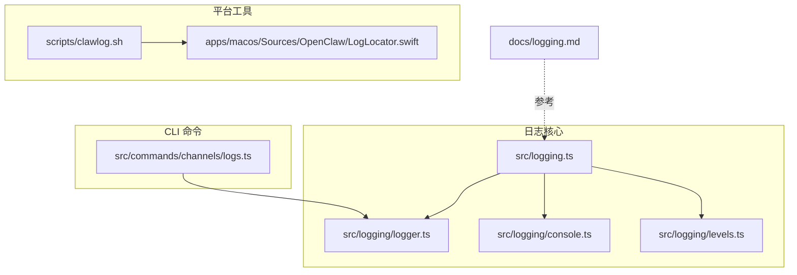
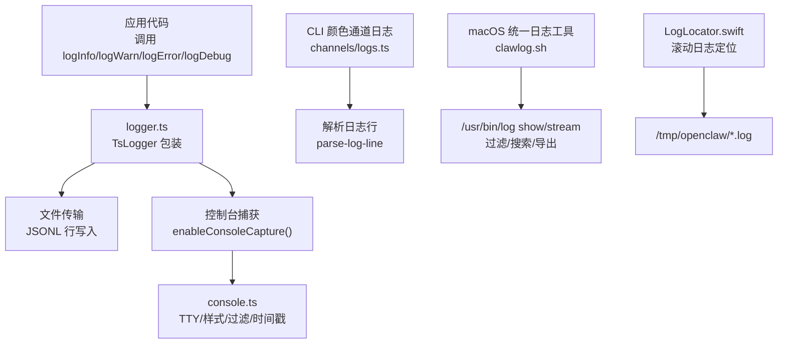
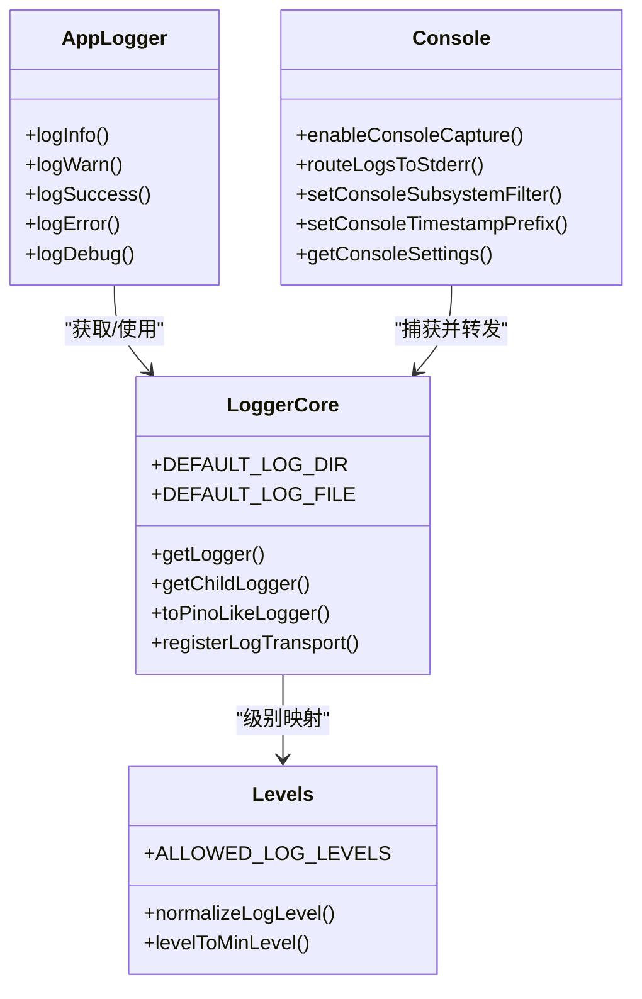
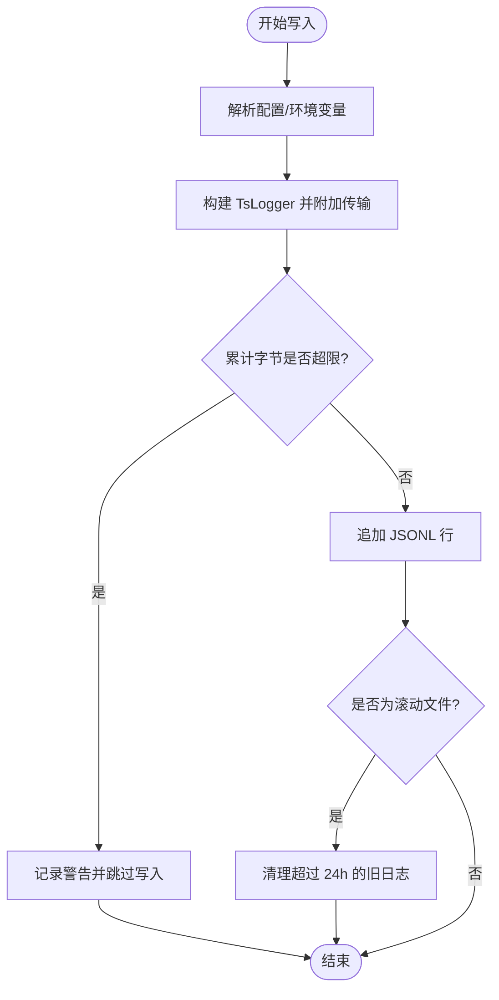
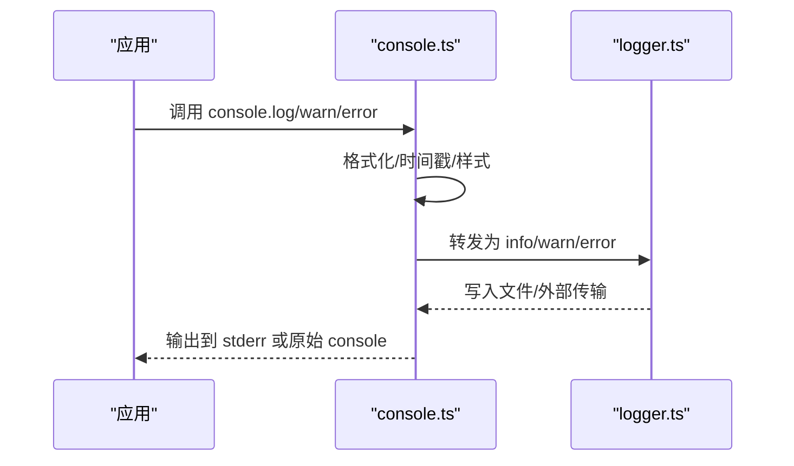
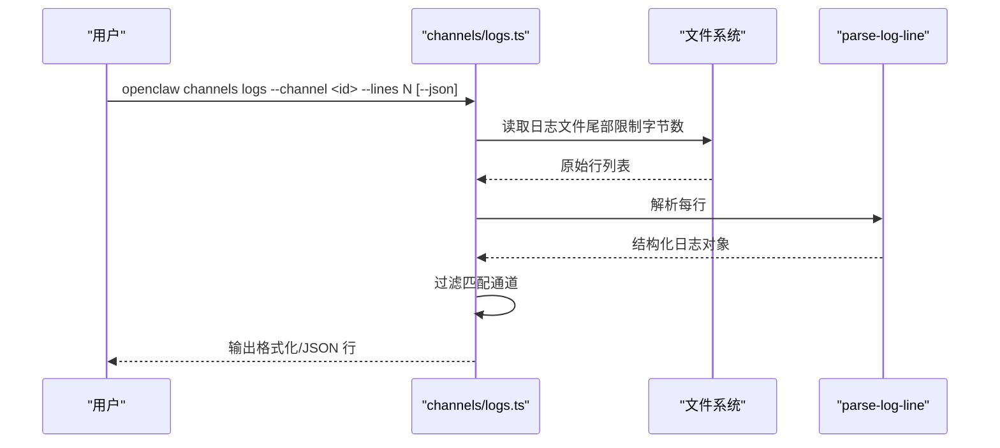
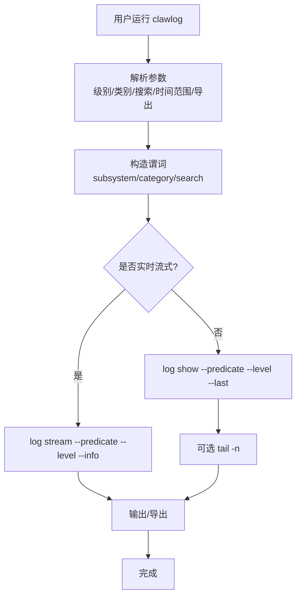
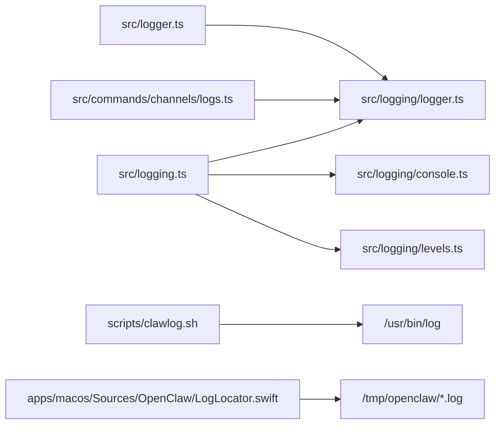

# 日志分析

<cite>
**本文引用的文件**
- [src/logging.ts](file://src/logging.ts)
- [src/logger.ts](file://src/logger.ts)
- [src/logging/logger.ts](file://src/logging/logger.ts)
- [src/logging/console.ts](file://src/logging/console.ts)
- [src/logging/levels.ts](file://src/logging/levels.ts)
- [src/commands/channels/logs.ts](file://src/commands/channels/logs.ts)
- [scripts/clawlog.sh](file://scripts/clawlog.sh)
- [apps/macos/Sources/OpenClaw/LogLocator.swift](file://apps/macos/Sources/OpenClaw/LogLocator.swift)
- [docs/logging.md](file://docs/logging.md)
- [src/logger.test.ts](file://src/logger.test.ts)
</cite>

## 目录
1. [简介](#简介)
2. [项目结构](#项目结构)
3. [核心组件](#核心组件)
4. [架构总览](#架构总览)
5. [详细组件分析](#详细组件分析)
6. [依赖关系分析](#依赖关系分析)
7. [性能考量](#性能考量)
8. [故障排查指南](#故障排查指南)
9. [结论](#结论)
10. [附录](#附录)

## 简介
本指南面向需要使用 openclaw 的日志系统进行问题定位与根因分析的工程师与运维人员。内容覆盖：
- 使用 openclaw logs 命令与日志文件进行诊断
- 日志级别与输出格式的理解
- 关键错误信号识别与常见错误模式
- 日志轮转管理与远程日志收集
- 日志过滤技巧、错误模式识别与根因分析方法
- 日志监控配置、告警规则与日志存储优化策略

## 项目结构
围绕日志分析的关键目录与文件：
- 日志核心实现：src/logging/*（日志级别、控制台格式化、文件写入、子系统日志）
- CLI 日志命令：src/commands/channels/logs.ts（通道日志查看）
- macOS 统一日志工具：scripts/clawlog.sh（统一过滤、实时流式、导出）
- 日志文件定位（macOS）：apps/macos/Sources/OpenClaw/LogLocator.swift（滚动日志定位）
- 文档：docs/logging.md（日志位置、CLI 使用、配置与遥测）

**图表来源**
- [src/logging.ts:1-70](file://src/logging.ts#L1-L70)
- [src/logging/logger.ts:1-348](file://src/logging/logger.ts#L1-L348)
- [src/logging/console.ts:1-333](file://src/logging/console.ts#L1-L333)
- [src/logging/levels.ts:1-38](file://src/logging/levels.ts#L1-L38)
- [src/commands/channels/logs.ts:1-114](file://src/commands/channels/logs.ts#L1-L114)
- [scripts/clawlog.sh:1-322](file://scripts/clawlog.sh#L1-L322)
- [apps/macos/Sources/OpenClaw/LogLocator.swift:1-36](file://apps/macos/Sources/OpenClaw/LogLocator.swift#L1-L36)
- [docs/logging.md:1-353](file://docs/logging.md#L1-L353)

**章节来源**
- [src/logging.ts:1-70](file://src/logging.ts#L1-L70)
- [src/logging/logger.ts:1-348](file://src/logging/logger.ts#L1-L348)
- [src/logging/console.ts:1-333](file://src/logging/console.ts#L1-L333)
- [src/logging/levels.ts:1-38](file://src/logging/levels.ts#L1-L38)
- [src/commands/channels/logs.ts:1-114](file://src/commands/channels/logs.ts#L1-L114)
- [scripts/clawlog.sh:1-322](file://scripts/clawlog.sh#L1-L322)
- [apps/macos/Sources/OpenClaw/LogLocator.swift:1-36](file://apps/macos/Sources/OpenClaw/LogLocator.swift#L1-L36)
- [docs/logging.md:1-353](file://docs/logging.md#L1-L353)

## 核心组件
- 日志级别与映射：支持 silent/fatal/error/warn/info/debug/trace，提供规范化与最小级别映射。
- 文件日志：默认滚动到每日文件，具备大小上限与过期清理；可配置最大文件字节与日志路径。
- 控制台输出：TTY 自适应、样式（pretty/compact/json）、时间戳前缀、子系统过滤、EPIPE 安全处理。
- 子系统日志：消息中带“子系统: 消息”前缀时自动路由到对应子系统 logger。
- CLI 颜色通道日志：按通道过滤、尾部读取、JSON 输出、限制行数。

**章节来源**
- [src/logging/levels.ts:1-38](file://src/logging/levels.ts#L1-L38)
- [src/logging/logger.ts:1-348](file://src/logging/logger.ts#L1-L348)
- [src/logging/console.ts:1-333](file://src/logging/console.ts#L1-L333)
- [src/logger.ts:1-86](file://src/logger.ts#L1-L86)
- [src/commands/channels/logs.ts:1-114](file://src/commands/channels/logs.ts#L1-L114)

## 架构总览
下图展示日志从应用到文件与控制台的流向，以及 CLI 与 macOS 统一日志工具的接入点。

**图表来源**
- [src/logger.ts:1-86](file://src/logger.ts#L1-L86)
- [src/logging/logger.ts:1-348](file://src/logging/logger.ts#L1-L348)
- [src/logging/console.ts:1-333](file://src/logging/console.ts#L1-L333)
- [src/commands/channels/logs.ts:1-114](file://src/commands/channels/logs.ts#L1-L114)
- [scripts/clawlog.sh:1-322](file://scripts/clawlog.sh#L1-L322)
- [apps/macos/Sources/OpenClaw/LogLocator.swift:1-36](file://apps/macos/Sources/OpenClaw/LogLocator.swift#L1-L36)

## 详细组件分析

### 日志级别与输出格式
- 支持级别：silent < fatal < error < warn < info < debug < trace
- 文件日志级别由配置或环境变量决定；控制台级别可独立配置
- 控制台样式：TTY 时默认 pretty（彩色、带时间戳），非 TTY 默认 compact；也可强制 json/plain/no-color
- 子系统前缀：当消息以“子系统: ”开头时，自动拆分并路由到子系统 logger

**图表来源**
- [src/logging/levels.ts:1-38](file://src/logging/levels.ts#L1-L38)
- [src/logging/logger.ts:1-348](file://src/logging/logger.ts#L1-L348)
- [src/logging/console.ts:1-333](file://src/logging/console.ts#L1-L333)
- [src/logger.ts:1-86](file://src/logger.ts#L1-L86)

**章节来源**
- [src/logging/levels.ts:1-38](file://src/logging/levels.ts#L1-L38)
- [src/logging/logger.ts:1-348](file://src/logging/logger.ts#L1-L348)
- [src/logging/console.ts:1-333](file://src/logging/console.ts#L1-L333)
- [src/logger.ts:1-86](file://src/logger.ts#L1-L86)

### 文件日志与轮转
- 默认滚动文件路径：/tmp/openclaw/openclaw-YYYY-MM-DD.log
- 写入策略：逐条 JSONL 追加；超过 maxFileBytes 后抑制写入并输出警告
- 过期清理：保留最近 24 小时内的滚动日志，超出则删除
- 测试场景：在 vitest 中可静默文件日志以提升启动速度

**图表来源**
- [src/logging/logger.ts:140-184](file://src/logging/logger.ts#L140-L184)
- [src/logging/logger.ts:323-347](file://src/logging/logger.ts#L323-L347)

**章节来源**
- [src/logging/logger.ts:1-348](file://src/logging/logger.ts#L1-L348)
- [src/logger.test.ts:74-94](file://src/logger.test.ts#L74-L94)

### 控制台输出与过滤
- 控制台捕获：将 console.* 调用转发至文件 logger，同时保证 stdout 清洁（RPC/JSON 场景）
- TTY 自适应：TTY 时启用彩色与时间戳，非 TTY 采用紧凑模式
- 子系统过滤：可按前缀白名单过滤控制台输出
- EPIPE 安全：监听 stdout/stderr 异步错误，避免管道关闭导致崩溃

**图表来源**
- [src/logging/console.ts:209-332](file://src/logging/console.ts#L209-L332)
- [src/logger.ts:37-85](file://src/logger.ts#L37-L85)
- [src/logging/logger.ts:126-184](file://src/logging/logger.ts#L126-L184)

**章节来源**
- [src/logging/console.ts:1-333](file://src/logging/console.ts#L1-L333)
- [src/logger.ts:1-86](file://src/logger.ts#L1-L86)

### CLI 颜色通道日志（openclaw channels logs）
- 功能：按通道过滤日志、尾部读取、限制行数、JSON 输出
- 实现要点：解析日志行、匹配子系统/模块、截断到指定数量

**图表来源**
- [src/commands/channels/logs.ts:76-114](file://src/commands/channels/logs.ts#L76-L114)

**章节来源**
- [src/commands/channels/logs.ts:1-114](file://src/commands/channels/logs.ts#L1-L114)

### macOS 统一日志工具（clawlog）
- 作用：通过 /usr/bin/log 命令访问 macOS 统一日志，绕过隐私遮蔽，支持过滤、搜索、导出与实时流式
- 关键能力：类别过滤、错误过滤、文本搜索、时间范围、JSON 输出、导出文件、sudo 权限提示

**图表来源**
- [scripts/clawlog.sh:220-284](file://scripts/clawlog.sh#L220-L284)
- [scripts/clawlog.sh:286-321](file://scripts/clawlog.sh#L286-L321)

**章节来源**
- [scripts/clawlog.sh:1-322](file://scripts/clawlog.sh#L1-L322)

### 日志文件定位（macOS）
- 默认日志目录：/tmp/openclaw
- 最新日志：按修改时间选择最新文件，支持环境变量覆盖目录

**章节来源**
- [apps/macos/Sources/OpenClaw/LogLocator.swift:1-36](file://apps/macos/Sources/OpenClaw/LogLocator.swift#L1-L36)

## 依赖关系分析
- 日志 API 入口：src/logging.ts 导出控制台、级别、logger、子系统等接口
- 日志实现：src/logging/logger.ts 提供文件写入、轮转、大小上限与过期清理
- 控制台：src/logging/console.ts 提供样式、过滤、时间戳与安全处理
- 应用层：src/logger.ts 对外暴露 logInfo/logWarn 等便捷函数，并支持子系统前缀
- CLI：src/commands/channels/logs.ts 依赖日志解析与配置，提供通道级日志查看
- 平台：scripts/clawlog.sh 与 apps/macos/Sources/OpenClaw/LogLocator.swift 分别面向 macOS 统一日志与滚动日志定位

**图表来源**
- [src/logging.ts:1-70](file://src/logging.ts#L1-L70)
- [src/logging/logger.ts:1-348](file://src/logging/logger.ts#L1-L348)
- [src/logging/console.ts:1-333](file://src/logging/console.ts#L1-L333)
- [src/logging/levels.ts:1-38](file://src/logging/levels.ts#L1-L38)
- [src/logger.ts:1-86](file://src/logger.ts#L1-L86)
- [src/commands/channels/logs.ts:1-114](file://src/commands/channels/logs.ts#L1-L114)
- [scripts/clawlog.sh:1-322](file://scripts/clawlog.sh#L1-L322)
- [apps/macos/Sources/OpenClaw/LogLocator.swift:1-36](file://apps/macos/Sources/OpenClaw/LogLocator.swift#L1-L36)

**章节来源**
- [src/logging.ts:1-70](file://src/logging.ts#L1-L70)
- [src/logging/logger.ts:1-348](file://src/logging/logger.ts#L1-L348)
- [src/logging/console.ts:1-333](file://src/logging/console.ts#L1-L333)
- [src/logging/levels.ts:1-38](file://src/logging/levels.ts#L1-L38)
- [src/logger.ts:1-86](file://src/logger.ts#L1-L86)
- [src/commands/channels/logs.ts:1-114](file://src/commands/channels/logs.ts#L1-L114)
- [scripts/clawlog.sh:1-322](file://scripts/clawlog.sh#L1-L322)
- [apps/macos/Sources/OpenClaw/LogLocator.swift:1-36](file://apps/macos/Sources/OpenClaw/LogLocator.swift#L1-L36)

## 性能考量
- 文件写入：逐条 JSONL 追加，超限后抑制写入，避免磁盘压力过大
- 滚动清理：仅保留 24 小时内日志，降低磁盘占用
- 控制台输出：TTY 时彩色与时间戳增强可读性；非 TTY 使用紧凑模式减少开销
- CLI 读取：按最大字节数尾读，避免一次性加载大文件
- 测试优化：vitest 下默认静默文件日志，加速启动

**章节来源**
- [src/logging/logger.ts:140-184](file://src/logging/logger.ts#L140-L184)
- [src/logging/logger.ts:323-347](file://src/logging/logger.ts#L323-L347)
- [src/logging/console.ts:50-58](file://src/logging/console.ts#L50-L58)
- [src/commands/channels/logs.ts:44-74](file://src/commands/channels/logs.ts#L44-L74)
- [src/logger.test.ts:64-72](file://src/logger.test.ts#L64-L72)

## 故障排查指南

### 快速定位步骤
- 确认网关可达：若 CLI 无法连接，先执行诊断命令
- 查看日志位置：确认文件路径与权限
- 提升详细度：临时提高日志级别或开启诊断标志
- 过滤聚焦：按通道、类别、错误关键字缩小范围
- 导出分析：将近期日志导出到文件进行离线分析

**章节来源**
- [docs/logging.md:347-353](file://docs/logging.md#L347-L353)

### 常见错误信号与识别
- 文件写入被抑制：出现“达到文件大小上限”的警告，表示当前日志文件已达上限，后续写入被抑制
- 控制台噪音：可通过子系统过滤与紧凑样式降低干扰
- 管道关闭异常：控制台已内置 EPIPE 错误处理，避免崩溃

**章节来源**
- [src/logging/logger.ts:155-178](file://src/logging/logger.ts#L155-L178)
- [src/logging/console.ts:215-231](file://src/logging/console.ts#L215-L231)

### 日志轮转与清理
- 滚动文件：按日期命名，默认保留 24 小时内的日志
- 大小上限：默认 500MB，超限时抑制写入并输出警告
- 手动清理：可删除旧文件或使用系统轮转工具

**章节来源**
- [src/logging/logger.ts:186-191](file://src/logging/logger.ts#L186-L191)
- [src/logging/logger.ts:323-347](file://src/logging/logger.ts#L323-L347)

### 远程日志收集
- macOS：使用 clawlog.sh 通过 /usr/bin/log 命令实时流式或导出
- 文件收集：在受控环境中将 /tmp/openclaw 下的日志文件复制到集中存储
- 注意：macOS 默认对敏感信息进行隐私遮蔽，需使用 sudo 访问完整日志

**章节来源**
- [scripts/clawlog.sh:57-59](file://scripts/clawlog.sh#L57-L59)
- [scripts/clawlog.sh:286-321](file://scripts/clawlog.sh#L286-L321)

### 日志过滤技巧
- CLI 通道过滤：按通道 ID 过滤，快速定位特定插件活动
- 文本搜索：在 clawlog.sh 中使用搜索参数，快速定位关键字
- 错误聚焦：仅显示错误级别或错误关键词，缩短排查路径

**章节来源**
- [src/commands/channels/logs.ts:30-42](file://src/commands/channels/logs.ts#L30-L42)
- [scripts/clawlog.sh:179-190](file://scripts/clawlog.sh#L179-L190)
- [scripts/clawlog.sh:230-232](file://scripts/clawlog.sh#L230-L232)

### 错误模式识别与根因分析
- 模式一：高频重复的“会话状态变更”提示（在非 verbose 模式下可能被抑制）
- 模式二：控制台出现“慢监听器”提示，结合子系统过滤定位具体监听器
- 模式三：文件日志中出现“网络/认证/通道”相关错误堆栈，优先检查网络连通与凭据

**章节来源**
- [src/logging/console.ts:140-168](file://src/logging/console.ts#L140-L168)

### 日志监控配置、告警规则与存储优化
- 监控配置：基于日志级别与关键字建立监控规则（如 error/warn 比例、特定通道错误）
- 告警规则：阈值触发（如 5 分钟内错误数超过阈值）、趋势异常检测
- 存储优化：合理设置 maxFileBytes、定期清理旧日志、使用远程日志收集与压缩归档

**章节来源**
- [src/logging/logger.ts:186-191](file://src/logging/logger.ts#L186-L191)
- [src/logging/logger.ts:323-347](file://src/logging/logger.ts#L323-L347)

## 结论
通过理解 openclaw 的日志体系（级别、文件、控制台、子系统、CLI 与 macOS 工具），可以高效地进行问题定位与根因分析。建议在日常运维中：
- 明确日志级别与输出格式，按需提升详细度
- 使用通道过滤与文本搜索快速聚焦
- 利用滚动与大小上限策略保障稳定性
- 通过远程日志工具与导出机制支撑离线分析
- 建立监控与告警，配合存储优化实现可持续运维

## 附录

### 常用命令与参考
- CLI 日志查看：参见文档中的 CLI 用法与输出模式
- macOS 统一日志：参见 clawlog.sh 的选项与示例
- 日志位置：参见文档中的文件路径与配置方式

**章节来源**
- [docs/logging.md:40-81](file://docs/logging.md#L40-L81)
- [scripts/clawlog.sh:78-122](file://scripts/clawlog.sh#L78-L122)