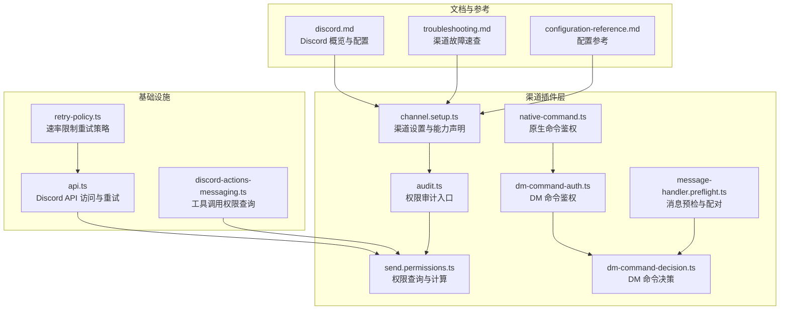
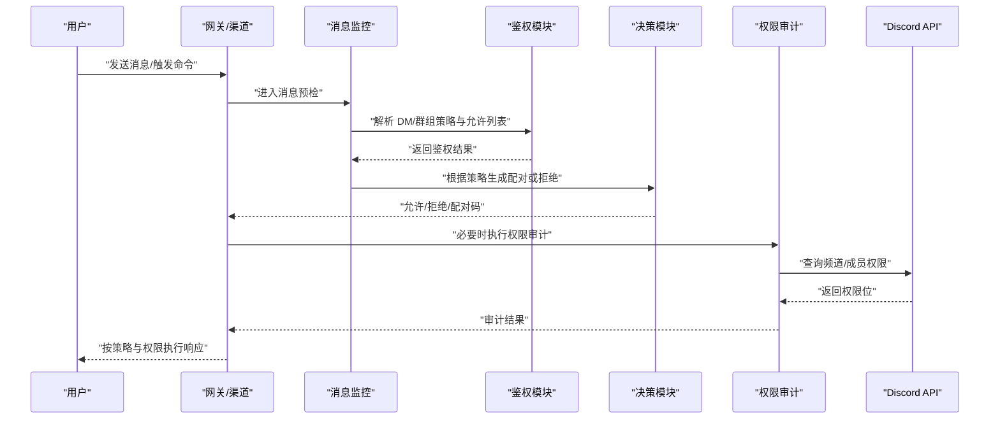
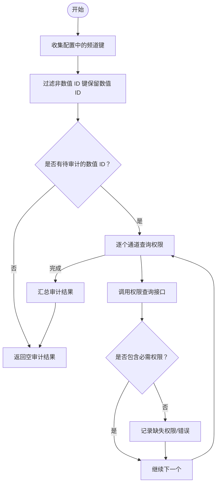
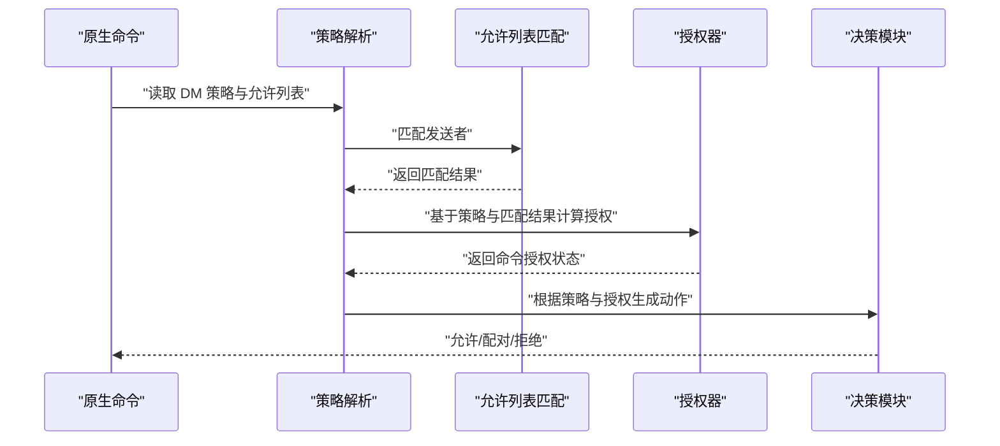
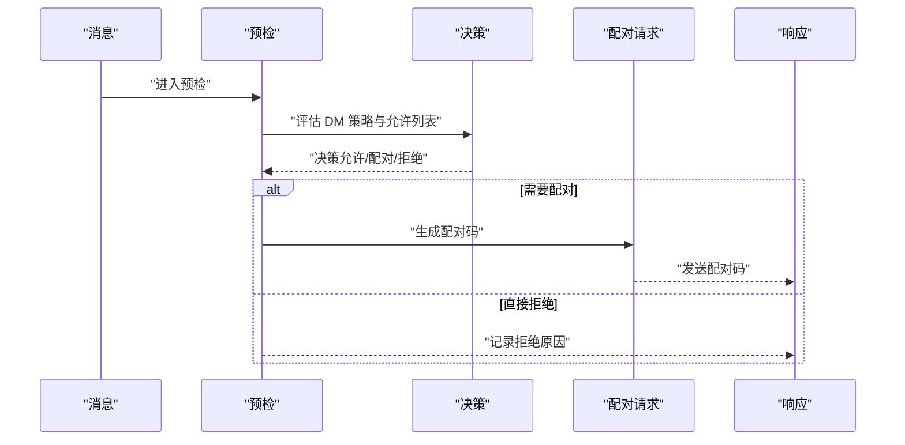
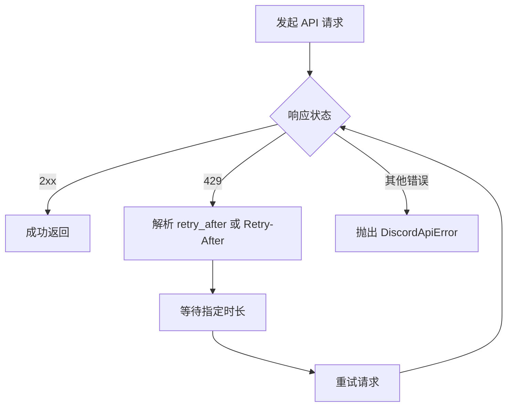
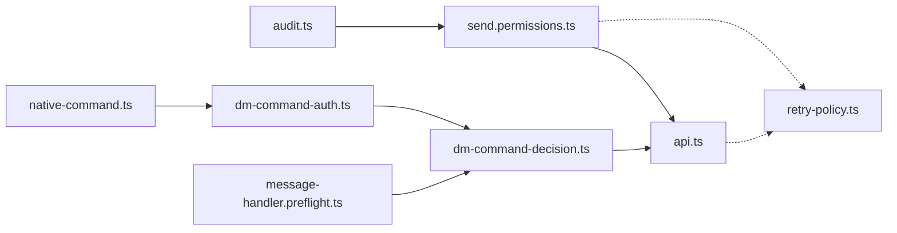

# Discord 连接故障排除

<cite>
**本文档引用的文件**
- [discord.md](file://docs/channels/discord.md)
- [troubleshooting.md](file://docs/channels/troubleshooting.md)
- [channel.setup.ts](file://extensions/discord/src/channel.setup.ts)
- [audit.ts](file://extensions/discord/src/audit.ts)
- [status-issues.ts](file://extensions/discord/src/status-issues.ts)
- [send.permissions.ts](file://extensions/discord/src/send.permissions.ts)
- [native-command.ts](file://extensions/discord/src/monitor/native-command.ts)
- [dm-command-auth.ts](file://extensions/discord/src/monitor/dm-command-auth.ts)
- [dm-command-decision.ts](file://extensions/discord/src/monitor/dm-command-decision.ts)
- [message-handler.preflight.ts](file://extensions/discord/src/monitor/message-handler.preflight.ts)
- [configuration-reference.md](file://docs/gateway/configuration-reference.md)
- [api.ts](file://extensions/discord/src/api.ts)
- [retry-policy.ts](file://src/infra/retry-policy.ts)
- [discord-actions-messaging.ts](file://src/agents/tools/discord-actions-messaging.ts)
</cite>

## 目录
1. [简介](#简介)
2. [项目结构](#项目结构)
3. [核心组件](#核心组件)
4. [架构总览](#架构总览)
5. [详细组件分析](#详细组件分析)
6. [依赖关系分析](#依赖关系分析)
7. [性能考虑](#性能考虑)
8. [故障排除指南](#故障排除指南)
9. [结论](#结论)
10. [附录](#附录)

## 简介
本指南面向在使用 OpenClaw 的 Discord 渠道时遇到连接或消息处理问题的用户与运维人员。内容覆盖以下典型症状：服务器在线但无公会回复、群组消息被忽略、私信回复缺失，并提供系统化的诊断流程与修复建议。重点检查项包括：公会/频道权限验证、提及门控检查、配对状态管理、令牌与作用域验证，以及 Discord API 限流与权限配置的最佳实践。

## 项目结构
OpenClaw 将 Discord 渠道能力以插件形式组织，核心位于扩展目录中，同时配套文档与工具链支持诊断与配置。

**图表来源**
- [channel.setup.ts:1-76](file://extensions/discord/src/channel.setup.ts#L1-L76)
- [audit.ts:1-142](file://extensions/discord/src/audit.ts#L1-L142)
- [send.permissions.ts:1-233](file://extensions/discord/src/send.permissions.ts#L1-L233)
- [native-command.ts:1416-1461](file://extensions/discord/src/monitor/native-command.ts#L1416-L1461)
- [dm-command-auth.ts:1-105](file://extensions/discord/src/monitor/dm-command-auth.ts#L1-L105)
- [dm-command-decision.ts:1-48](file://extensions/discord/src/monitor/dm-command-decision.ts#L1-L48)
- [message-handler.preflight.ts:251-284](file://extensions/discord/src/monitor/message-handler.preflight.ts#L251-L284)
- [discord.md:1-800](file://docs/channels/discord.md#L1-L800)
- [troubleshooting.md:57-67](file://docs/channels/troubleshooting.md#L57-L67)
- [configuration-reference.md:18-44](file://docs/gateway/configuration-reference.md#L18-L44)
- [api.ts:1-136](file://extensions/discord/src/api.ts#L1-L136)
- [retry-policy.ts:61-86](file://src/infra/retry-policy.ts#L61-L86)
- [discord-actions-messaging.ts:183-192](file://src/agents/tools/discord-actions-messaging.ts#L183-L192)

**章节来源**
- [channel.setup.ts:1-76](file://extensions/discord/src/channel.setup.ts#L1-L76)
- [discord.md:1-800](file://docs/channels/discord.md#L1-L800)

## 核心组件
- 权限审计与校验：通过收集配置中的公会/频道键并过滤非数值 ID，仅对可审计的数值通道执行权限检查；必要时返回未解析通道数量提示。
- 原生命令与 DM 命令鉴权：统一采用 DM 策略与允许列表匹配，结合访问组授权器决定命令是否可执行。
- 消息预检与配对：在 DM 场景下根据策略生成一次性配对码，或直接拒绝未授权发送者。
- API 访问与重试：封装 Discord API 调用，自动解析 429 重试时间并进行指数退避重试。
- 配置参考：明确 DM/群组策略、提及要求、线程绑定、反应通知等关键配置项。

**章节来源**
- [audit.ts:73-85](file://extensions/discord/src/audit.ts#L73-L85)
- [audit.ts:87-141](file://extensions/discord/src/audit.ts#L87-L141)
- [send.permissions.ts:154-233](file://extensions/discord/src/send.permissions.ts#L154-L233)
- [native-command.ts:1416-1461](file://extensions/discord/src/monitor/native-command.ts#L1416-L1461)
- [dm-command-auth.ts:46-105](file://extensions/discord/src/monitor/dm-command-auth.ts#L46-L105)
- [dm-command-decision.ts:5-48](file://extensions/discord/src/monitor/dm-command-decision.ts#L5-L48)
- [message-handler.preflight.ts:251-284](file://extensions/discord/src/monitor/message-handler.preflight.ts#L251-L284)
- [api.ts:96-136](file://extensions/discord/src/api.ts#L96-L136)
- [retry-policy.ts:61-86](file://src/infra/retry-policy.ts#L61-L86)
- [configuration-reference.md:18-44](file://docs/gateway/configuration-reference.md#L18-L44)

## 架构总览
下图展示从消息进入、鉴权到响应的关键路径，以及权限审计与 API 重试在其中的位置。

**图表来源**
- [message-handler.preflight.ts:251-284](file://extensions/discord/src/monitor/message-handler.preflight.ts#L251-L284)
- [dm-command-auth.ts:46-105](file://extensions/discord/src/monitor/dm-command-auth.ts#L46-L105)
- [dm-command-decision.ts:5-48](file://extensions/discord/src/monitor/dm-command-decision.ts#L5-L48)
- [audit.ts:87-141](file://extensions/discord/src/audit.ts#L87-L141)
- [send.permissions.ts:154-233](file://extensions/discord/src/send.permissions.ts#L154-L233)
- [api.ts:96-136](file://extensions/discord/src/api.ts#L96-L136)

## 详细组件分析

### 组件一：权限审计与通道校验
- 收集配置中的公会/频道键，跳过通配符键（如 "*"），仅对数值 ID 通道进行审计。
- 对每个通道调用权限查询接口，比对必需权限集合，记录缺失项或错误信息。
- 若存在非数值 ID 键，返回“未解析通道数”，提示使用数值 ID。

**图表来源**
- [audit.ts:73-85](file://extensions/discord/src/audit.ts#L73-L85)
- [audit.ts:87-141](file://extensions/discord/src/audit.ts#L87-L141)
- [send.permissions.ts:154-233](file://extensions/discord/src/send.permissions.ts#L154-L233)

**章节来源**
- [audit.ts:73-85](file://extensions/discord/src/audit.ts#L73-L85)
- [audit.ts:87-141](file://extensions/discord/src/audit.ts#L87-L141)
- [send.permissions.ts:154-233](file://extensions/discord/src/send.permissions.ts#L154-L233)

### 组件二：原生命令与 DM 命令鉴权
- 解析 DM 策略（默认/允许列表/开放/禁用）与允许列表，支持名称匹配开关与访问组授权器。
- 命令授权规则：当 DM 策略为开放且决策允许时，命令即被授权；否则遵循已授权状态。
- 决策模块根据策略与匹配结果，选择允许、生成配对码或直接拒绝。

**图表来源**
- [native-command.ts:1416-1461](file://extensions/discord/src/monitor/native-command.ts#L1416-L1461)
- [dm-command-auth.ts:46-105](file://extensions/discord/src/monitor/dm-command-auth.ts#L46-L105)
- [dm-command-decision.ts:5-48](file://extensions/discord/src/monitor/dm-command-decision.ts#L5-L48)

**章节来源**
- [native-command.ts:1416-1461](file://extensions/discord/src/monitor/native-command.ts#L1416-L1461)
- [dm-command-auth.ts:46-105](file://extensions/discord/src/monitor/dm-command-auth.ts#L46-L105)
- [dm-command-decision.ts:5-48](file://extensions/discord/src/monitor/dm-command-decision.ts#L5-L48)

### 组件三：消息预检与配对流程
- 在 DM 场景下，若策略要求配对或拒绝，则生成一次性配对码并发送给用户；否则直接拒绝。
- 预检日志记录发送者信息与匹配元数据，便于定位问题。

**图表来源**
- [message-handler.preflight.ts:251-284](file://extensions/discord/src/monitor/message-handler.preflight.ts#L251-L284)
- [dm-command-decision.ts:5-48](file://extensions/discord/src/monitor/dm-command-decision.ts#L5-L48)

**章节来源**
- [message-handler.preflight.ts:251-284](file://extensions/discord/src/monitor/message-handler.preflight.ts#L251-L284)
- [dm-command-decision.ts:5-48](file://extensions/discord/src/monitor/dm-command-decision.ts#L5-L48)

### 组件四：API 访问与速率限制重试
- 封装 Discord API 请求，自动添加认证头并解析错误体。
- 当收到 429 时，优先使用响应体中的 retry_after，其次读取 Retry-After 头，进行带抖动的指数退避重试。
- 提供专用重试运行器，用于消息发送等场景。

**图表来源**
- [api.ts:96-136](file://extensions/discord/src/api.ts#L96-L136)
- [retry-policy.ts:61-86](file://src/infra/retry-policy.ts#L61-L86)

**章节来源**
- [api.ts:96-136](file://extensions/discord/src/api.ts#L96-L136)
- [retry-policy.ts:61-86](file://src/infra/retry-policy.ts#L61-L86)

## 依赖关系分析
- 权限审计依赖权限查询模块与配置解析；权限查询依赖 Discord REST 客户端。
- 原生命令与 DM 命令鉴权共享同一策略与允许列表匹配逻辑，最终由决策模块统一输出。
- 消息预检在鉴权失败时触发配对流程，避免重复生成配对码。
- API 访问与重试策略贯穿消息发送与权限查询，确保稳定性。

**图表来源**
- [audit.ts:1-142](file://extensions/discord/src/audit.ts#L1-L142)
- [send.permissions.ts:1-233](file://extensions/discord/src/send.permissions.ts#L1-L233)
- [api.ts:1-136](file://extensions/discord/src/api.ts#L1-L136)
- [native-command.ts:1416-1461](file://extensions/discord/src/monitor/native-command.ts#L1416-L1461)
- [dm-command-auth.ts:1-105](file://extensions/discord/src/monitor/dm-command-auth.ts#L1-L105)
- [dm-command-decision.ts:1-48](file://extensions/discord/src/monitor/dm-command-decision.ts#L1-L48)
- [message-handler.preflight.ts:251-284](file://extensions/discord/src/monitor/message-handler.preflight.ts#L251-L284)
- [retry-policy.ts:61-86](file://src/infra/retry-policy.ts#L61-L86)

**章节来源**
- [audit.ts:1-142](file://extensions/discord/src/audit.ts#L1-L142)
- [send.permissions.ts:1-233](file://extensions/discord/src/send.permissions.ts#L1-L233)
- [api.ts:1-136](file://extensions/discord/src/api.ts#L1-L136)
- [native-command.ts:1416-1461](file://extensions/discord/src/monitor/native-command.ts#L1416-L1461)
- [dm-command-auth.ts:1-105](file://extensions/discord/src/monitor/dm-command-auth.ts#L1-L105)
- [dm-command-decision.ts:1-48](file://extensions/discord/src/monitor/dm-command-decision.ts#L1-L48)
- [message-handler.preflight.ts:251-284](file://extensions/discord/src/monitor/message-handler.preflight.ts#L251-L284)
- [retry-policy.ts:61-86](file://src/infra/retry-policy.ts#L61-L86)

## 性能考虑
- 速率限制：针对 429 错误进行带抖动的指数退避重试，避免雪崩效应。
- 权限查询：仅对数值 ID 通道执行审计，减少无效请求；必要时缓存查询结果以降低 API 压力。
- 日志与可观测性：在预检阶段记录发送者与匹配元数据，便于快速定位问题。

[本节为通用指导，无需特定文件来源]

## 故障排除指南

### 快速检查清单
- 使用健康基线命令确认运行状态与通道探测结果正常。
- 查看最近日志，关注速率限制与权限相关错误。
- 执行渠道状态探测，核对连接状态与权限审计结果。

**章节来源**
- [troubleshooting.md:13-30](file://docs/channels/troubleshooting.md#L13-L30)

### 典型症状与修复

#### 服务器在线但无公会回复
- 最快检查：通道状态探测。
- 可能原因：公会/频道未加入允许列表、提及门控未关闭、消息内容意图未启用。
- 修复建议：
  - 将目标公会加入允许列表，并确保频道键为数值 ID。
  - 在频道或公会配置中关闭“需要提及”或开启“忽略其他提及”。
  - 确认开发者门户中已启用“消息内容意图”。

**章节来源**
- [troubleshooting.md:61-63](file://docs/channels/troubleshooting.md#L61-L63)
- [discord.md:443-461](file://docs/channels/discord.md#L443-L461)
- [discord.md:369-461](file://docs/channels/discord.md#L369-L461)

#### 群组消息被忽略
- 最快检查：查看日志中的“提及门控丢弃”记录。
- 可能原因：未提及机器人、未满足自定义提及模式、启用了“忽略其他提及”。
- 修复建议：
  - 在消息中明确提及机器人或在配置中放宽提及要求。
  - 检查并调整提及模式配置。

**章节来源**
- [troubleshooting.md](file://docs/channels/troubleshooting.md#L64)
- [discord.md:443-461](file://docs/channels/discord.md#L443-L461)

#### 私信回复缺失
- 最快检查：列出 Discord 配对请求。
- 可能原因：DM 策略为禁用、未知发送者未配对、允许列表未包含发送者。
- 修复建议：
  - 启用 DM 并调整 DM 策略（默认为配对模式）。
  - 批准对应的配对请求或更新允许列表。

**章节来源**
- [troubleshooting.md](file://docs/channels/troubleshooting.md#L65)
- [configuration-reference.md:22-43](file://docs/gateway/configuration-reference.md#L22-L43)

### 关键检查步骤

#### 公会/频道权限验证
- 使用权限审计工具检查配置中数值 ID 频道的权限位，确认包含“查看频道”和“发送消息”。
- 若存在非数值 ID 键，需改为数值 ID 以便审计。

**章节来源**
- [audit.ts:24-37](file://extensions/discord/src/audit.ts#L24-L37)
- [audit.ts:73-85](file://extensions/discord/src/audit.ts#L73-L85)
- [audit.ts:87-141](file://extensions/discord/src/audit.ts#L87-L141)
- [send.permissions.ts:154-233](file://extensions/discord/src/send.permissions.ts#L154-L233)

#### 提及门控检查
- 在公会/频道配置中设置“需要提及”或“忽略其他提及”，并确保机器人被正确提及。
- 自定义提及模式可通过代理配置进行调整。

**章节来源**
- [discord.md:443-461](file://docs/channels/discord.md#L443-L461)

#### 配对状态管理
- 列出当前未批准的配对请求，及时审批或调整 DM 策略。
- 配对码有效期为 1 小时，超时后需重新发起。

**章节来源**
- [troubleshooting.md](file://docs/channels/troubleshooting.md#L65)
- [configuration-reference.md:39-43](file://docs/gateway/configuration-reference.md#L39-L43)

#### 令牌与作用域验证
- 确保配置中的 Bot Token 正确且来源优先级符合预期。
- OAuth scopes 与基础权限应满足最低要求（例如查看频道、发送消息、读取消息历史等）。

**章节来源**
- [discord.md:489-538](file://docs/channels/discord.md#L489-L538)
- [channel.setup.ts:62-73](file://extensions/discord/src/channel.setup.ts#L62-L73)

#### 工具调用权限查询
- 通过工具调用获取指定频道的权限位，辅助定位权限不足问题。

**章节来源**
- [discord-actions-messaging.ts:183-192](file://src/agents/tools/discord-actions-messaging.ts#L183-L192)

### 最佳实践
- 使用数值 ID 作为公会/频道键，确保权限审计与配置一致性。
- 默认采用“允许列表”策略，仅在受信任环境中使用“开放”策略。
- 合理配置提及门控，兼顾易用性与安全性。
- 针对速率限制做好重试策略与退避参数调优。

**章节来源**
- [configuration-reference.md:18-44](file://docs/gateway/configuration-reference.md#L18-L44)
- [api.ts:96-136](file://extensions/discord/src/api.ts#L96-L136)
- [retry-policy.ts:61-86](file://src/infra/retry-policy.ts#L61-L86)

## 结论
通过系统化地执行权限审计、策略与允许列表检查、配对状态核对与 API 重试优化，大多数 Discord 渠道连接与消息处理问题均可快速定位并修复。建议在生产环境中始终使用数值 ID、最小权限原则与合理的速率限制策略，以获得稳定可靠的体验。

[本节为总结性内容，无需特定文件来源]

## 附录

### 相关配置要点索引
- DM 策略与允许列表：[配置参考:22-43](file://docs/gateway/configuration-reference.md#L22-L43)
- 公会/频道策略与提及门控：[Discord 文档:397-461](file://docs/channels/discord.md#L397-L461)
- 线程绑定与反应通知：[Discord 文档:642-782](file://docs/channels/discord.md#L642-L782)

**章节来源**
- [configuration-reference.md:22-43](file://docs/gateway/configuration-reference.md#L22-L43)
- [discord.md:397-461](file://docs/channels/discord.md#L397-L461)
- [discord.md:642-782](file://docs/channels/discord.md#L642-L782)