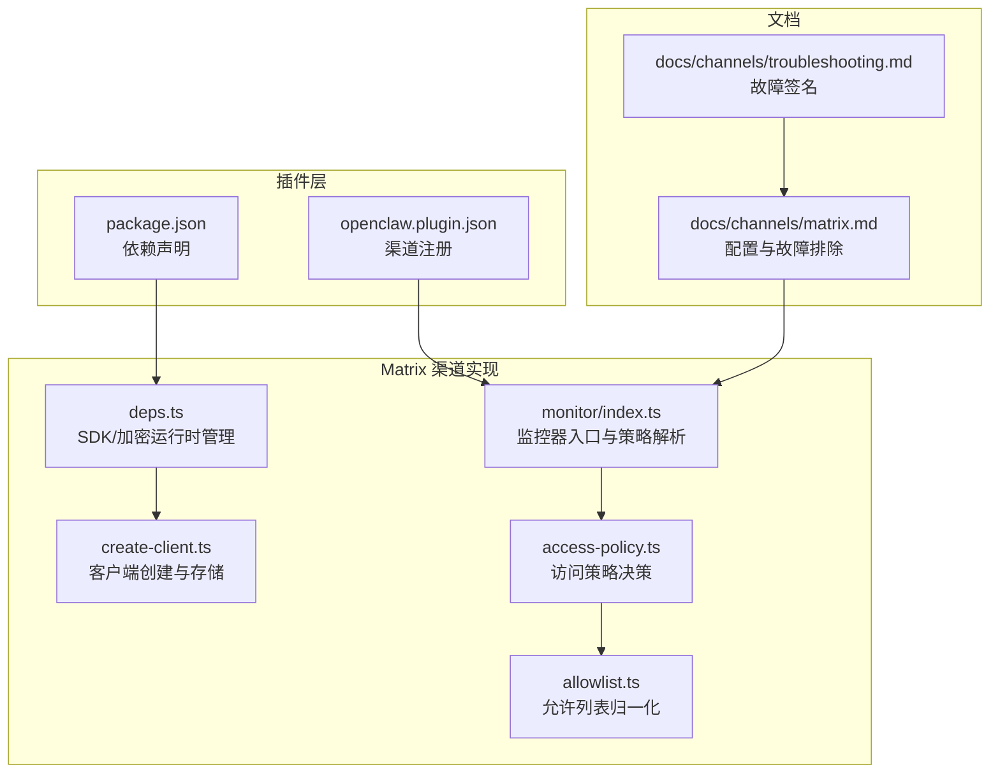
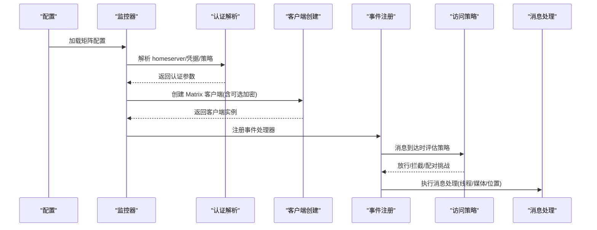
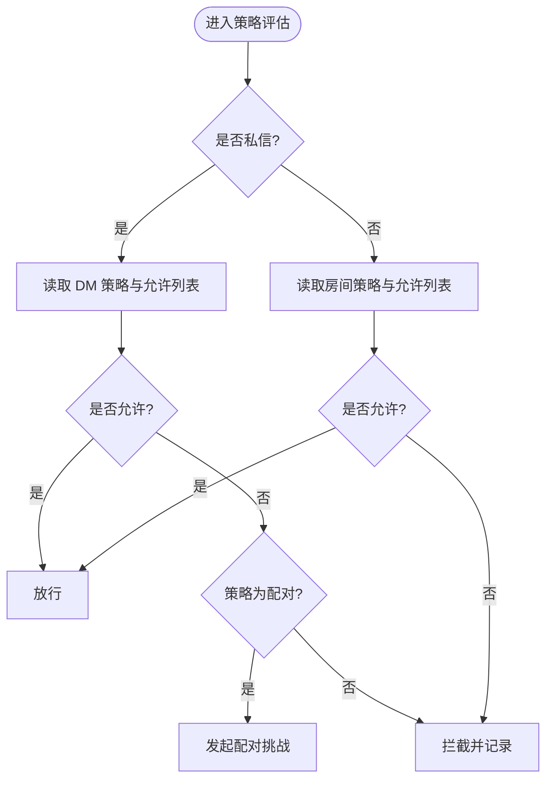
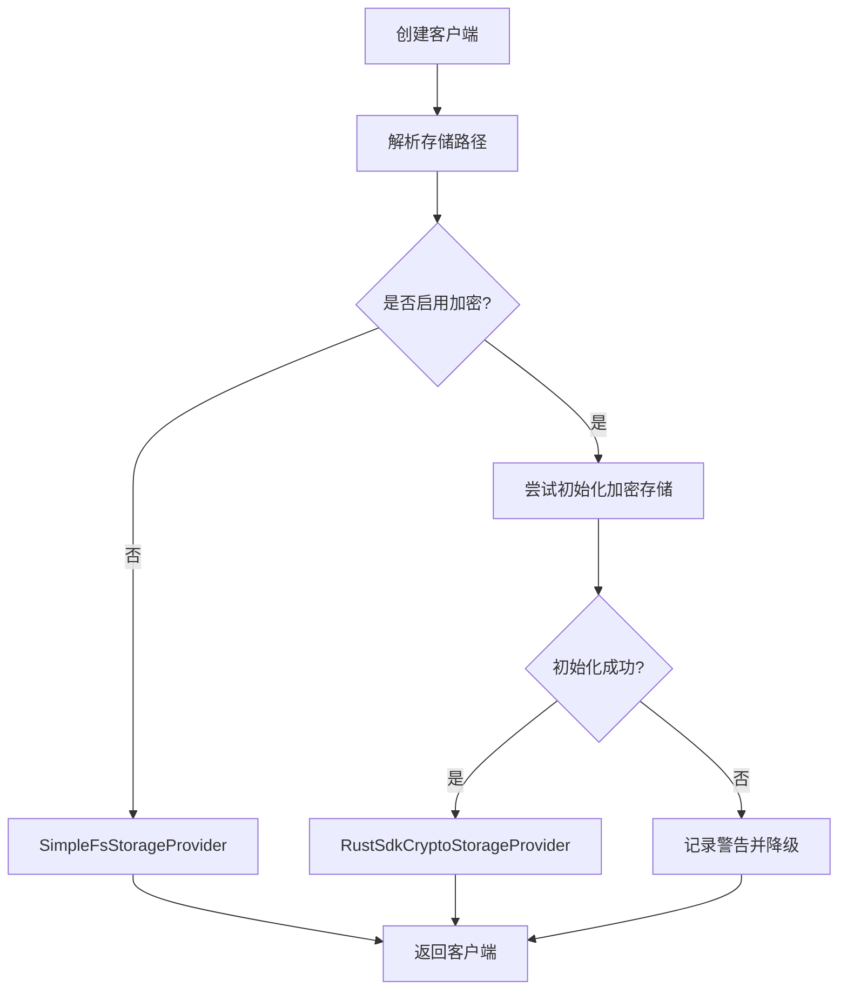
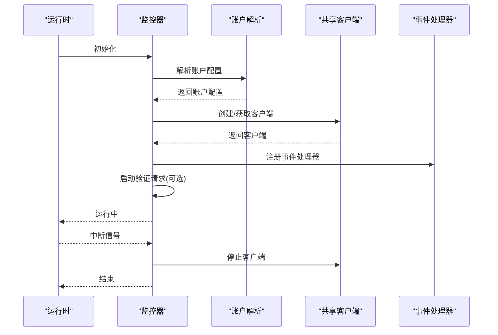
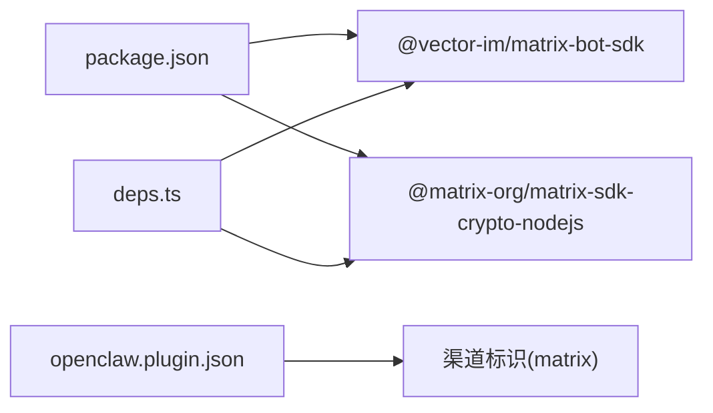
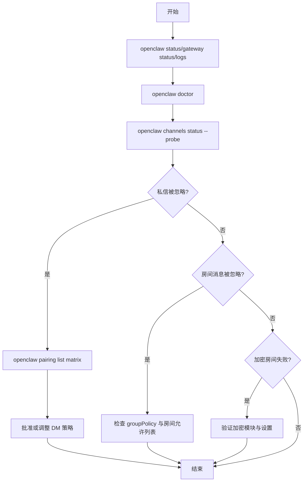
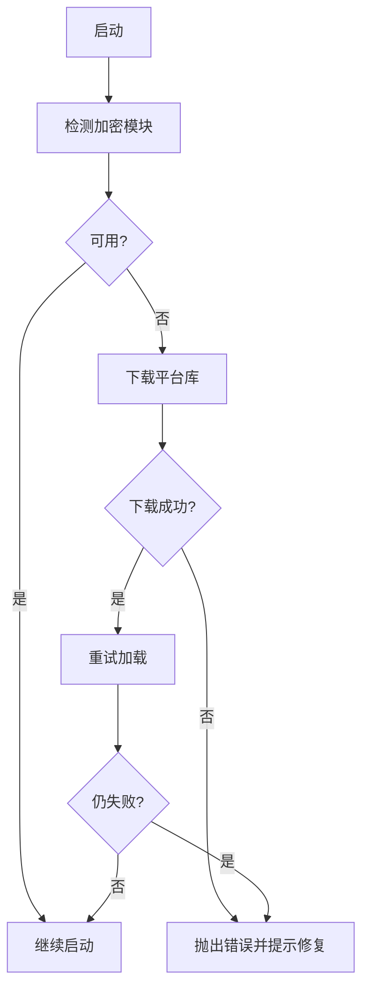

# Matrix 连接故障排除

<cite>
**本文档引用的文件**
- [matrix.md](file://docs/channels/matrix.md)
- [troubleshooting.md](file://docs/channels/troubleshooting.md)
- [package.json](file://extensions/matrix/package.json)
- [openclaw.plugin.json](file://extensions/matrix/openclaw.plugin.json)
- [deps.ts](file://extensions/matrix/src/matrix/deps.ts)
- [create-client.ts](file://extensions/matrix/src/matrix/client/create-client.ts)
- [index.ts](file://extensions/matrix/src/matrix/monitor/index.ts)
- [access-policy.ts](file://extensions/matrix/src/matrix/monitor/access-policy.ts)
- [allowlist.ts](file://extensions/matrix/src/matrix/monitor/allowlist.ts)
</cite>

## 目录
1. [简介](#简介)
2. [项目结构](#项目结构)
3. [核心组件](#核心组件)
4. [架构总览](#架构总览)
5. [详细组件分析](#详细组件分析)
6. [依赖关系分析](#依赖关系分析)
7. [性能考虑](#性能考虑)
8. [故障排除指南](#故障排除指南)
9. [结论](#结论)

## 简介
本指南面向在使用 OpenClaw Matrix 渠道时遇到连接与消息处理问题的用户，聚焦以下典型症状：
- 已登录但房间消息被忽略
- 私信无法处理
- 加密房间失败

内容涵盖房间策略配置、允许列表管理、加密模块验证、加密设置检查，以及 Homeserver 配置与端点可达性验证的系统化排查流程。

## 项目结构
Matrix 渠道作为插件独立维护，核心实现位于 `extensions/matrix` 目录，文档位于 `docs/channels/matrix.md`。插件通过外部 SDK 与 Matrix Homeserver 交互，并提供多账号支持、房间/私信策略、线程回复、媒体与位置能力。

**图表来源**
- [package.json:1-43](file://extensions/matrix/package.json#L1-L43)
- [openclaw.plugin.json:1-10](file://extensions/matrix/openclaw.plugin.json#L1-L10)
- [deps.ts:1-127](file://extensions/matrix/src/matrix/deps.ts#L1-L127)
- [create-client.ts:1-128](file://extensions/matrix/src/matrix/client/create-client.ts#L1-L128)
- [index.ts:1-415](file://extensions/matrix/src/matrix/monitor/index.ts#L1-L415)
- [access-policy.ts:1-127](file://extensions/matrix/src/matrix/monitor/access-policy.ts#L1-L127)
- [allowlist.ts:1-95](file://extensions/matrix/src/matrix/monitor/allowlist.ts#L1-L95)
- [matrix.md:1-304](file://docs/channels/matrix.md#L1-L304)
- [troubleshooting.md:108-117](file://docs/channels/troubleshooting.md#L108-L117)

**章节来源**
- [package.json:1-43](file://extensions/matrix/package.json#L1-L43)
- [openclaw.plugin.json:1-10](file://extensions/matrix/openclaw.plugin.json#L1-L10)
- [matrix.md:1-304](file://docs/channels/matrix.md#L1-L304)

## 核心组件
- 插件元数据与安装信息：定义渠道 ID、文档路径、安装规范与依赖白名单。
- SDK/加密运行时管理：确保 @vector-im/matrix-bot-sdk 与 @matrix-org/matrix-sdk-crypto-nodejs 可用，必要时自动下载平台库。
- 客户端创建：根据配置创建 Matrix 客户端，初始化本地存储与可选的加密存储，处理设备列表异常。
- 监控器：解析房间/私信策略，注册事件处理器，执行首次验证请求，管理生命周期。
- 访问策略：基于 DM 策略与允许列表决定是否放行，支持配对挑战与日志记录。
- 允许列表：对用户 ID 进行大小写与前缀归一化，支持通配符与多种输入格式。

**章节来源**
- [deps.ts:45-127](file://extensions/matrix/src/matrix/deps.ts#L45-L127)
- [create-client.ts:40-128](file://extensions/matrix/src/matrix/client/create-client.ts#L40-L128)
- [index.ts:233-415](file://extensions/matrix/src/matrix/monitor/index.ts#L233-L415)
- [access-policy.ts:17-127](file://extensions/matrix/src/matrix/monitor/access-policy.ts#L17-L127)
- [allowlist.ts:8-95](file://extensions/matrix/src/matrix/monitor/allowlist.ts#L8-L95)

## 架构总览
下图展示从配置到消息处理的关键路径，包括策略解析、客户端创建、事件监听与设备验证。

**图表来源**
- [index.ts:233-376](file://extensions/matrix/src/matrix/monitor/index.ts#L233-L376)
- [create-client.ts:40-128](file://extensions/matrix/src/matrix/client/create-client.ts#L40-L128)
- [access-policy.ts:17-127](file://extensions/matrix/src/matrix/monitor/access-policy.ts#L17-L127)

## 详细组件分析

### 组件A：策略与允许列表
- 归一化规则：用户 ID 去除前缀与大小写标准化，支持 matrix:user: 与 user: 前缀；房间条目支持 matrix:room: 等前缀清理。
- 匹配逻辑：优先精确 ID，其次带前缀 ID，最后 user: 前缀形式；支持通配符 "*"。
- DM 策略：pairing（需要配对）、allowlist（允许列表）、open（公开，需配合 allowFrom=["*"]）、disabled（禁用）。
- 房间策略：allowlist（默认，需允许列表）、open（公开）、disabled（禁用）；支持 per-room users 允许列表。

**图表来源**
- [access-policy.ts:17-127](file://extensions/matrix/src/matrix/monitor/access-policy.ts#L17-L127)
- [allowlist.ts:75-95](file://extensions/matrix/src/matrix/monitor/allowlist.ts#L75-L95)

**章节来源**
- [access-policy.ts:17-127](file://extensions/matrix/src/matrix/monitor/access-policy.ts#L17-L127)
- [allowlist.ts:8-95](file://extensions/matrix/src/matrix/monitor/allowlist.ts#L8-L95)

### 组件B：客户端创建与加密存储
- 存储路径：按账户+homeserver+用户+token 哈希组织，包含 bot-storage.json 与 SQLite 加密数据库。
- 加密开关：当启用加密且可加载加密模块时，创建 RustSdkCryptoStorageProvider；否则降级为明文存储并记录警告。
- 设备列表健壮性：对异常的设备列表进行过滤与告警，避免崩溃。

**图表来源**
- [create-client.ts:54-124](file://extensions/matrix/src/matrix/client/create-client.ts#L54-L124)

**章节来源**
- [create-client.ts:40-128](file://extensions/matrix/src/matrix/client/create-client.ts#L40-L128)

### 组件C：监控器与事件处理
- 生命周期：解析账户配置 → 创建/获取共享客户端 → 注册事件 → 启动验证请求（如启用加密）→ 响应中断信号停止。
- 策略回退：当缺失 provider 配置时，默认回退为 allowlist，确保安全。
- 多账号：每个账户独立运行，支持继承顶层配置并按账户覆盖。

**图表来源**
- [index.ts:233-415](file://extensions/matrix/src/matrix/monitor/index.ts#L233-L415)

**章节来源**
- [index.ts:233-415](file://extensions/matrix/src/matrix/monitor/index.ts#L233-L415)

## 依赖关系分析
- 外部依赖：@vector-im/matrix-bot-sdk 提供客户端与事件；@matrix-org/matrix-sdk-crypto-nodejs 提供端到端加密。
- 插件元数据：openclaw.plugin.json 声明渠道 ID 与文档路径；package.json 定义安装与发布校验。
- 运行时依赖：deps.ts 在启动时检测并安装/下载所需运行时组件。

**图表来源**
- [package.json:6-13](file://extensions/matrix/package.json#L6-L13)
- [openclaw.plugin.json:2-3](file://extensions/matrix/openclaw.plugin.json#L2-L3)
- [deps.ts:7-8](file://extensions/matrix/src/matrix/deps.ts#L7-L8)

**章节来源**
- [package.json:1-43](file://extensions/matrix/package.json#L1-L43)
- [openclaw.plugin.json:1-10](file://extensions/matrix/openclaw.plugin.json#L1-L10)
- [deps.ts:45-127](file://extensions/matrix/src/matrix/deps.ts#L45-L127)

## 性能考虑
- 初始同步限制：可通过配置调整 initialSyncLimit，平衡启动速度与历史消息完整性。
- 媒体大小限制：默认最大 20MB，可根据网络与存储条件调整。
- 文本分片：支持按长度或换行符切分，避免超长文本导致传输失败。
- 线程回复：threadReplies 控制回复是否保持在原线程，减少上下文漂移。

[本节为通用指导，不直接分析具体文件]

## 故障排除指南

### 通用诊断清单
- 运行状态与日志：使用状态命令与实时日志定位问题。
- 探针模式：使用探针检查渠道连通性与基本功能。
- 配对状态：查询并批准待审批的私信发送者。

**图表来源**
- [matrix.md:250-272](file://docs/channels/matrix.md#L250-L272)
- [troubleshooting.md:110-116](file://docs/channels/troubleshooting.md#L110-L116)

**章节来源**
- [matrix.md:250-272](file://docs/channels/matrix.md#L250-L272)
- [troubleshooting.md:108-117](file://docs/channels/troubleshooting.md#L108-L117)

### 常见症状与根因定位

- 已登录但房间消息被忽略
  - 可能原因：groupPolicy 为 allowlist 且房间未列入允许列表；或 per-room users 限制了发送者。
  - 快速检查：确认 rooms/groups 配置与房间 ID/别名解析结果；查看日志中的映射与未解析项。
  - 修复建议：将目标房间加入 groups；或在 per-room users 中添加允许用户；必要时调整 groupPolicy。

- 私信无法处理
  - 可能原因：dm.policy 为 pairing 且发送者未批准；或 dm.policy 为 allowlist/open 但 allowFrom 不匹配。
  - 快速检查：列出配对请求并批准；核对 allowFrom 是否包含完整 Matrix ID。
  - 修复建议：将发送者加入 allowFrom；或改为 open 并设置 allowFrom=["*"]；或在 UI/向导中完成配对。

- 加密房间失败
  - 可能原因：缺少加密运行时或初始化失败；加密设置与房间不一致；设备未验证。
  - 快速检查：确认加密模块可用；查看存储路径与数据库是否存在；确认 homeserver/用户/令牌组合一致。
  - 修复建议：启用加密支持并重试；在另一客户端完成设备验证；必要时重建加密存储（更换令牌/设备后会创建新存储）。

**章节来源**
- [matrix.md:111-137](file://docs/channels/matrix.md#L111-L137)
- [index.ts:300-312](file://extensions/matrix/src/matrix/monitor/index.ts#L300-L312)
- [create-client.ts:66-81](file://extensions/matrix/src/matrix/client/create-client.ts#L66-L81)

### 关键配置与检查清单

- 房间策略与允许列表
  - groupPolicy：allowlist/open/disabled；默认 allowlist。
  - groups：房间 ID 或别名；支持通配符 "*" 作为默认策略。
  - groupAllowFrom：允许触发机器人的用户列表（完整 Matrix ID）。
  - per-room users：进一步限制房间内发送者。
  - autoJoin/autoJoinAllowlist：邀请处理策略与允许列表。

- 私信策略与允许列表
  - dm.policy：pairing/allowlist/open/disabled；默认 pairing。
  - dm.allowFrom：允许私信的用户列表（完整 Matrix ID）。
  - allowlistOnly：强制所有策略为 allowlist（除非显式 disabled）。

- 加密设置
  - encryption：true/false；启用后要求加密运行时可用。
  - 存储位置：按账户+homeserver+用户+token 哈希组织；变更令牌/设备会创建新存储。
  - 设备验证：首次连接请求验证，需在其他客户端批准。

- Homeserver 与端点可达性
  - 确认 homeserver URL 正确且可访问。
  - 使用探针模式检查渠道连通性。
  - 如遇网络限制，确保允许构建脚本与二进制下载。

**章节来源**
- [matrix.md:195-224](file://docs/channels/matrix.md#L195-L224)
- [matrix.md:185-194](file://docs/channels/matrix.md#L185-L194)
- [matrix.md:111-137](file://docs/channels/matrix.md#L111-L137)
- [matrix.md:274-304](file://docs/channels/matrix.md#L274-L304)

### 加密模块验证与修复

- 自动引导流程
  - 若检测到缺失加密运行时，自动调用下载脚本获取平台库。
  - 下载完成后再次尝试加载，若仍失败则抛出明确错误。

- 常见错误与修复
  - 缺少平台库：允许构建脚本并执行下载脚本；或手动重建加密包。
  - 初始化失败：检查存储权限与磁盘空间；确认 SQLite 可写。
  - 设备未验证：在 Element 等客户端批准验证请求。

**图表来源**
- [deps.ts:45-88](file://extensions/matrix/src/matrix/deps.ts#L45-L88)

**章节来源**
- [deps.ts:45-127](file://extensions/matrix/src/matrix/deps.ts#L45-L127)
- [matrix.md:111-137](file://docs/channels/matrix.md#L111-L137)

## 结论
Matrix 渠道的故障通常源于策略配置不当、允许列表不完整或加密运行时缺失。通过遵循本文提供的诊断流程与配置检查清单，可快速定位并修复“已登录但房间消息被忽略”、“私信无法处理”、“加密房间失败”等核心问题。建议在生产环境中启用 allowlistOnly 以强化默认安全策略，并定期验证加密模块与设备验证状态。