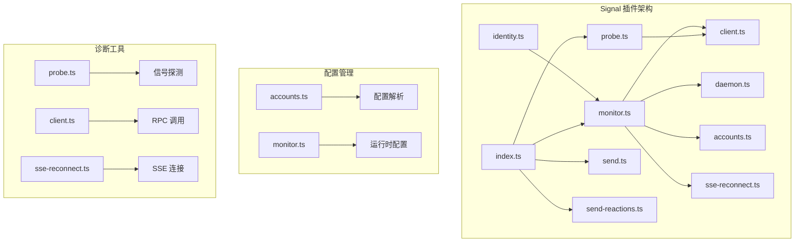
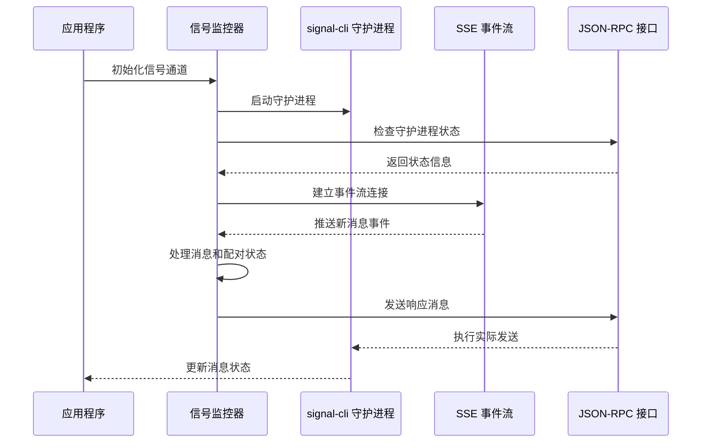
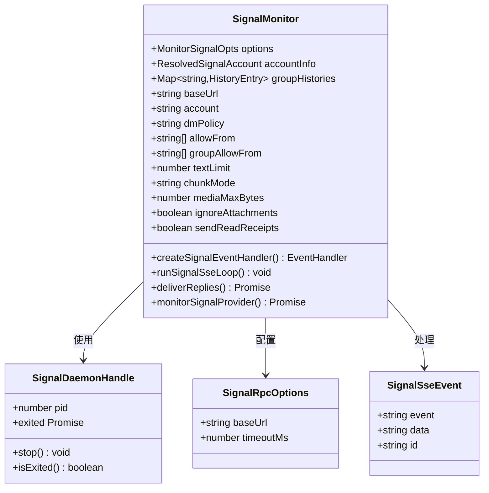
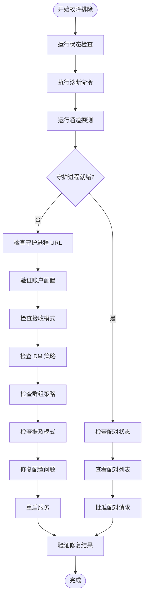
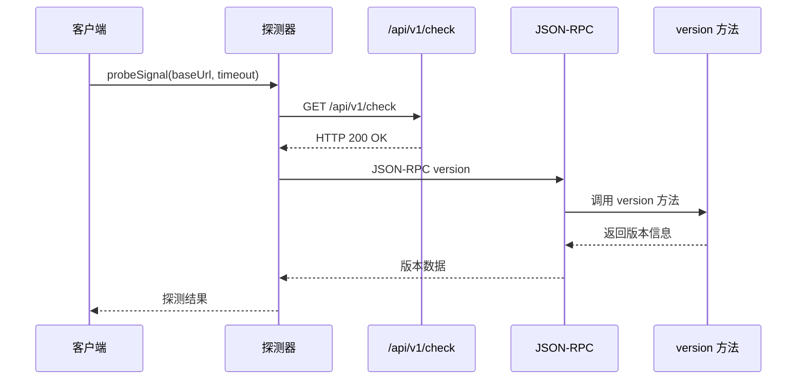
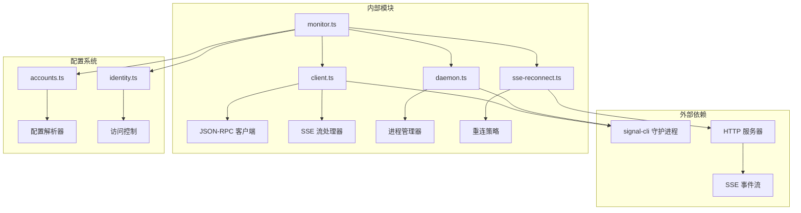
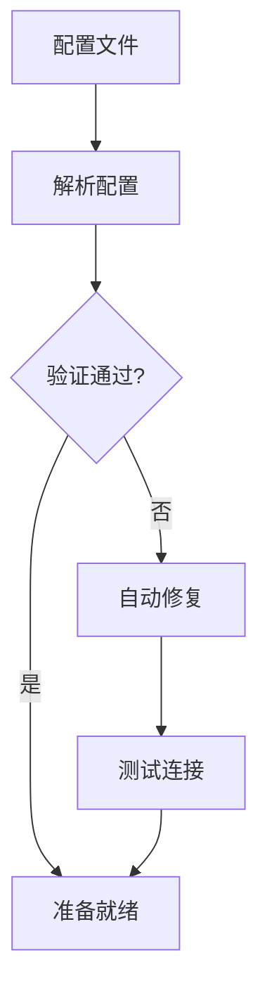
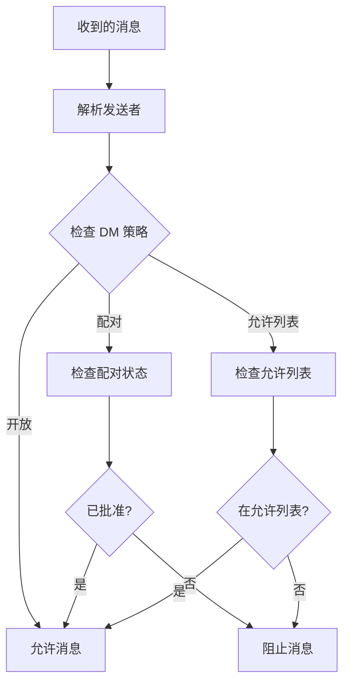

# Signal 连接故障排除

<cite>
**本文档引用的文件**
- [signal.md](file://docs/channels/signal.md)
- [troubleshooting.md](file://docs/channels/troubleshooting.md)
- [monitor.ts](file://extensions/signal/src/monitor.ts)
- [client.ts](file://extensions/signal/src/client.ts)
- [probe.ts](file://extensions/signal/src/probe.ts)
- [daemon.ts](file://extensions/signal/src/daemon.ts)
- [accounts.ts](file://extensions/signal/src/accounts.ts)
- [identity.ts](file://extensions/signal/src/identity.ts)
- [sse-reconnect.ts](file://extensions/signal/src/sse-reconnect.ts)
- [index.ts](file://extensions/signal/src/index.ts)
</cite>

## 目录
1. [简介](#简介)
2. [项目结构](#项目结构)
3. [核心组件](#核心组件)
4. [架构概览](#架构概览)
5. [详细组件分析](#详细组件分析)
6. [依赖关系分析](#依赖关系分析)
7. [性能考虑](#性能考虑)
8. [故障排除指南](#故障排除指南)
9. [结论](#结论)

## 简介

本文档提供了 Signal 渠道连接故障排除的详细指南，重点关注守护进程可访问但机器人静默、私信被阻止、群组回复不触发等问题。文档基于 OpenClaw 项目的 Signal 插件实现，详细说明了 signal-cli 守护进程 URL/账户验证、接收模式配置、配对状态检查、群组允许列表和提及模式设置等诊断步骤。

## 项目结构

Signal 插件采用模块化设计，主要包含以下关键组件：



**图表来源**
- [monitor.ts:1-485](file://extensions/signal/src/monitor.ts#L1-L485)
- [client.ts:1-216](file://extensions/signal/src/client.ts#L1-L216)
- [daemon.ts:1-148](file://extensions/signal/src/daemon.ts#L1-L148)

**章节来源**
- [monitor.ts:1-60](file://extensions/signal/src/monitor.ts#L1-L60)
- [client.ts:1-30](file://extensions/signal/src/client.ts#L1-L30)

## 核心组件

### 信号监控器 (Signal Monitor)

Signal 监控器是整个插件的核心组件，负责管理守护进程生命周期、处理事件流和执行消息路由。

**主要功能：**
- 守护进程自动启动和管理
- SSE 事件流监听和重连机制
- 消息处理和路由决策
- 配对状态管理和访问控制

### 客户端接口 (Client Interface)

提供与 signal-cli 守护进程通信的统一接口，包括 RPC 调用和 SSE 流处理。

**关键特性：**
- HTTP 基础 URL 规范化
- JSON-RPC 请求构建和响应解析
- SSE 事件流读取和事件分发

### 守护进程管理 (Daemon Manager)

负责 signal-cli 守护进程的启动、监控和优雅关闭。

**功能特性：**
- 自动检测和启动守护进程
- 进程输出日志分类和处理
- 异常退出检测和错误报告
- 优雅停止和资源清理

**章节来源**
- [monitor.ts:334-485](file://extensions/signal/src/monitor.ts#L334-L485)
- [client.ts:70-132](file://extensions/signal/src/client.ts#L70-L132)
- [daemon.ts:91-148](file://extensions/signal/src/daemon.ts#L91-L148)

## 架构概览

Signal 插件采用客户端-服务器架构，通过 HTTP JSON-RPC 和 SSE 实现双向通信：



**图表来源**
- [monitor.ts:412-468](file://extensions/signal/src/monitor.ts#L412-L468)
- [client.ts:134-154](file://extensions/signal/src/client.ts#L134-L154)
- [daemon.ts:91-148](file://extensions/signal/src/daemon.ts#L91-L148)

## 详细组件分析

### 信号监控器类图



**图表来源**
- [monitor.ts:38-58](file://extensions/signal/src/monitor.ts#L38-L58)
- [monitor.ts:16-27](file://extensions/signal/src/monitor.ts#L16-L27)
- [client.ts:5-27](file://extensions/signal/src/client.ts#L5-L27)

### 诊断流程图



**图表来源**
- [troubleshooting.md:15-23](file://docs/channels/troubleshooting.md#L15-L23)
- [signal.md:253-287](file://docs/channels/signal.md#L253-L287)

**章节来源**
- [monitor.ts:212-239](file://extensions/signal/src/monitor.ts#L212-L239)
- [probe.ts:23-56](file://extensions/signal/src/probe.ts#L23-L56)

### 信号探测器

信号探测器提供快速健康检查功能，验证守护进程的可用性和版本信息：



**图表来源**
- [probe.ts:23-56](file://extensions/signal/src/probe.ts#L23-L56)
- [client.ts:109-132](file://extensions/signal/src/client.ts#L109-L132)

**章节来源**
- [probe.ts:1-57](file://extensions/signal/src/probe.ts#L1-L57)
- [client.ts:109-132](file://extensions/signal/src/client.ts#L109-L132)

## 依赖关系分析

Signal 插件的依赖关系呈现清晰的分层结构：



**图表来源**
- [monitor.ts:25-36](file://extensions/signal/src/monitor.ts#L25-L36)
- [client.ts:1-4](file://extensions/signal/src/client.ts#L1-L4)
- [daemon.ts:1-3](file://extensions/signal/src/daemon.ts#L1-L3)

**章节来源**
- [monitor.ts:1-485](file://extensions/signal/src/monitor.ts#L1-L485)
- [accounts.ts:1-69](file://extensions/signal/src/accounts.ts#L1-L69)

## 性能考虑

### 连接重试策略

SSE 连接实现了指数退避重试机制，以应对网络不稳定情况：

- **初始延迟**: 1 秒
- **最大延迟**: 10 秒  
- **退避因子**: 2
- **抖动**: 20%

### 文本分块处理

支持多种文本分块模式以优化消息传输：

- **长度分块**: 基于字符数限制
- **换行分块**: 先按段落分割再进行长度限制

### 媒体处理优化

- 默认媒体大小限制: 8MB
- 支持附件下载控制
- 媒体缓冲区管理

## 故障排除指南

### 快速诊断命令

按照以下顺序执行诊断命令：

```bash
openclaw status
openclaw gateway status  
openclaw logs --follow
openclaw doctor
openclaw channels status --probe
```

### 常见问题诊断

#### 守护进程可达但机器人静默

**症状**: 守护进程返回 200 OK，但没有消息响应

**诊断步骤**:
1. 验证守护进程 URL 和账户配置
2. 检查接收模式设置 (`on-start` vs `manual`)
3. 确认信号探测器返回正确的版本信息
4. 查看 SSE 连接状态和重连日志

**解决方案**:
- 检查 `channels.signal.httpUrl` 配置
- 验证 `channels.signal.account` 设置
- 确认 `channels.signal.receiveMode` 正确配置

#### 私信被阻止

**症状**: 新用户发送消息后无响应

**诊断步骤**:
1. 检查配对状态: `openclaw pairing list signal`
2. 验证 DM 策略配置
3. 确认允许发送者的白名单设置
4. 查看配对代码的有效期和状态

**解决方案**:
- 批准待处理的配对请求
- 调整 `channels.signal.dmPolicy` 设置
- 添加发送者到 `channels.signal.allowFrom`

#### 群组回复不触发

**症状**: 群组消息被忽略或不响应

**诊断步骤**:
1. 检查群组策略配置 (`open | allowlist | disabled`)
2. 验证群组允许列表 (`channels.signal.groupAllowFrom`)
3. 确认提及模式设置
4. 查看群组覆盖配置

**解决方案**:
- 添加群组 ID 到允许列表
- 配置适当的提及模式
- 检查群组覆盖规则

### 配置验证和修复

#### 账户配置验证



**图表来源**
- [accounts.ts:34-62](file://extensions/signal/src/accounts.ts#L34-L62)
- [monitor.ts:334-384](file://extensions/signal/src/monitor.ts#L334-L384)

#### 访问控制检查



**图表来源**
- [identity.ts:107-139](file://extensions/signal/src/identity.ts#L107-L139)
- [monitor.ts:428-455](file://extensions/signal/src/monitor.ts#L428-L455)

### 连接配置差异

#### Signal Desktop vs 移动应用

| 配置项 | Signal Desktop | 移动应用 | 差异说明 |
|--------|----------------|----------|----------|
| 账号模型 | QR 链接模式 | 电话号码注册 | Desktop 使用链接模式更稳定 |
| 接收模式 | 默认 on-start | 可能需要手动启动 | Mobile 应用可能需要额外配置 |
| 配对方式 | 二维码扫描 | 验证码输入 | Desktop 配对更直观 |
| 通知设置 | 系统通知 | 应用内通知 | 两者通知行为不同 |

#### 多账户支持

Signal 插件支持多账户配置，每个账户可以有独立的设置：

```json
{
  "channels": {
    "signal": {
      "accounts": {
        "bot1": {
          "account": "+15551234567",
          "httpUrl": "http://localhost:8080",
          "dmPolicy": "pairing"
        },
        "bot2": {
          "account": "+15557654321", 
          "httpUrl": "http://localhost:8081",
          "dmPolicy": "allowlist"
        }
      }
    }
  }
}
```

**章节来源**
- [signal.md:253-287](file://docs/channels/signal.md#L253-L287)
- [troubleshooting.md:96-106](file://docs/channels/troubleshooting.md#L96-L106)
- [monitor.ts:334-485](file://extensions/signal/src/monitor.ts#L334-L485)

## 结论

Signal 渠道故障排除需要系统性的方法，从基础的守护进程状态检查到复杂的配对和访问控制验证。通过理解 Signal 插件的架构设计和各组件职责，可以有效地定位和解决大多数连接问题。

关键要点：
- 始终使用标准化的诊断命令序列
- 重点关注守护进程状态和 SSE 连接
- 仔细检查配对状态和访问控制配置
- 利用多账户功能隔离不同的使用场景
- 根据 Signal Desktop 和移动应用的差异调整配置

通过遵循本文档提供的步骤和最佳实践，应该能够快速识别和解决 Signal 渠道连接中的大部分问题。