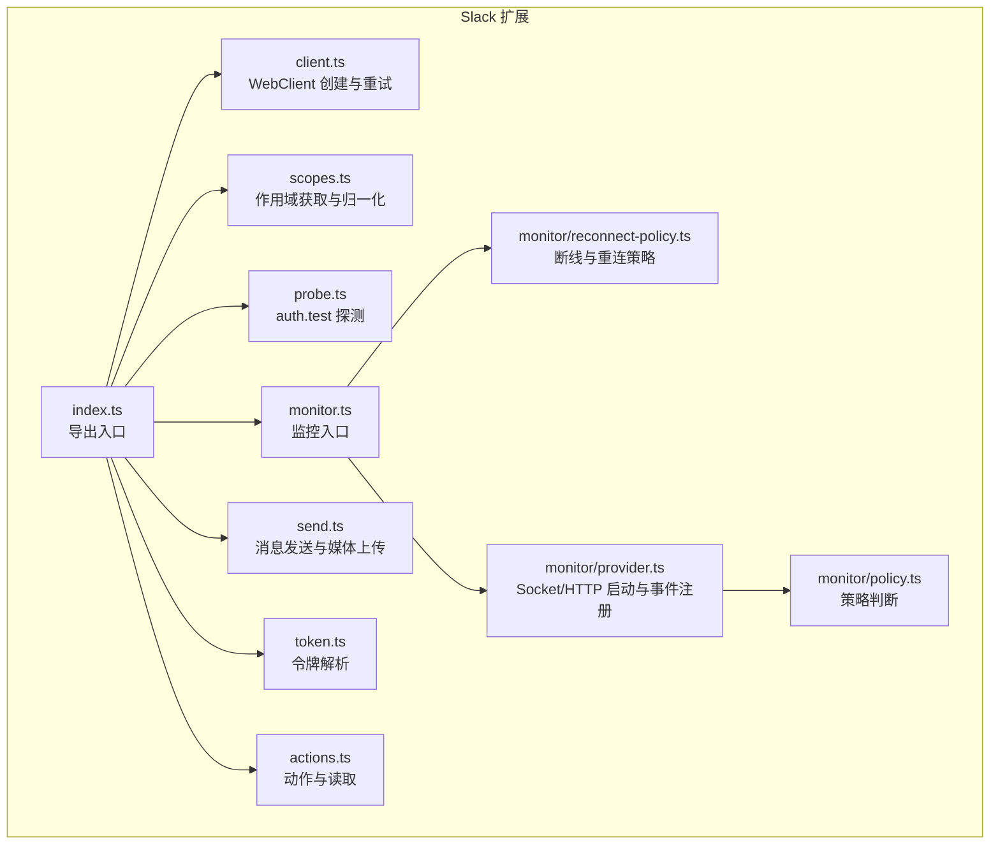
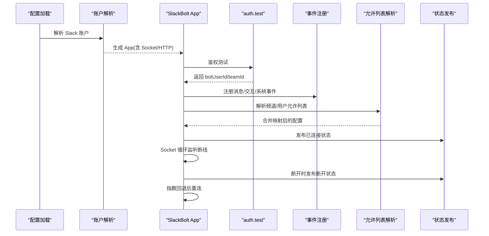
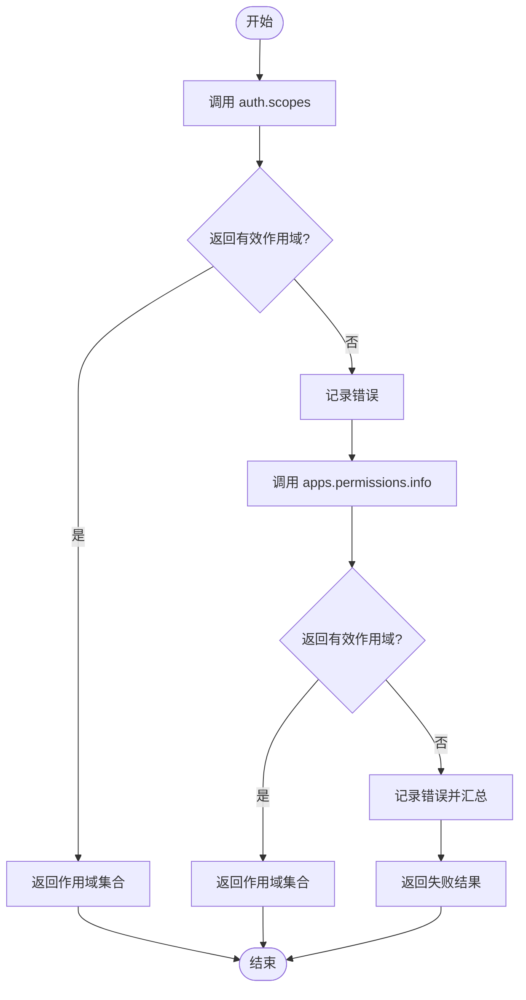
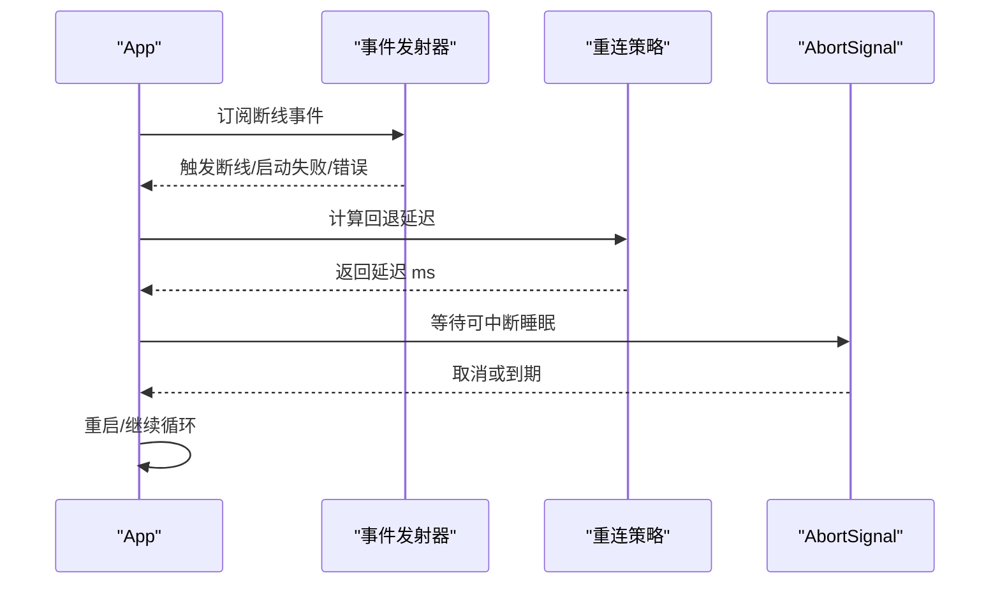
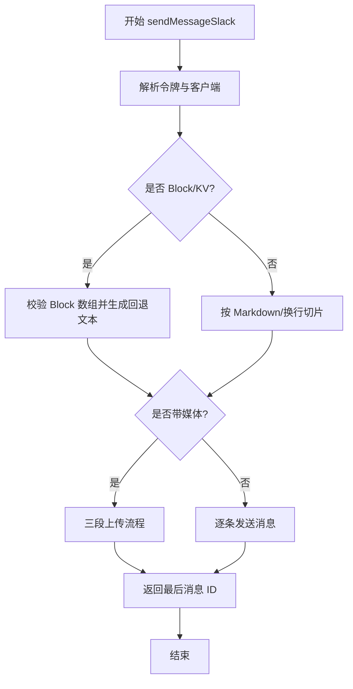
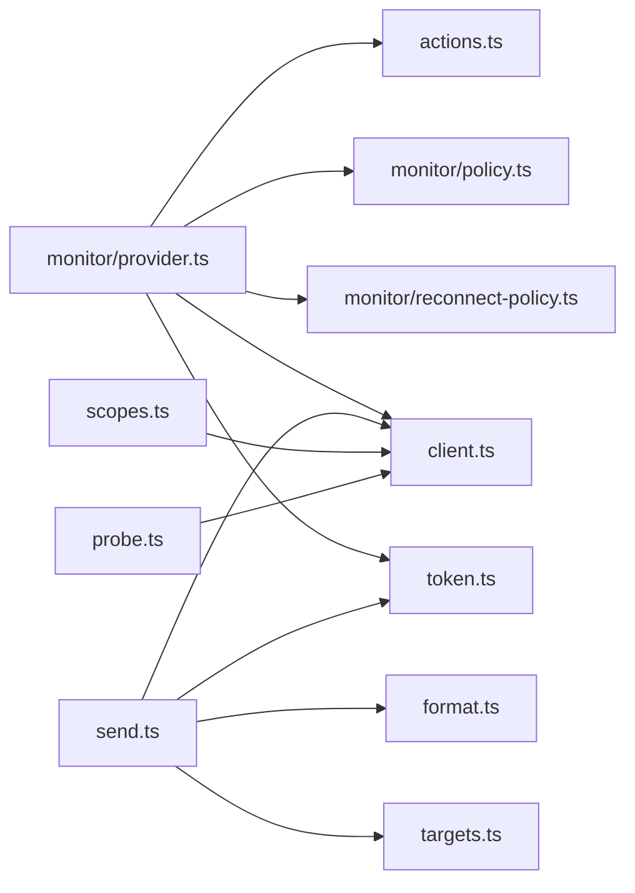

# Slack 连接故障排除

<cite>
**本文档引用的文件**
- [extensions/slack/src/index.ts](file://extensions/slack/src/index.ts)
- [extensions/slack/src/client.ts](file://extensions/slack/src/client.ts)
- [extensions/slack/src/scopes.ts](file://extensions/slack/src/scopes.ts)
- [extensions/slack/src/monitor/reconnect-policy.ts](file://extensions/slack/src/monitor/reconnect-policy.ts)
- [extensions/slack/src/probe.ts](file://extensions/slack/src/probe.ts)
- [extensions/slack/src/monitor.ts](file://extensions/slack/src/monitor.ts)
- [extensions/slack/src/token.ts](file://extensions/slack/src/token.ts)
- [extensions/slack/src/actions.ts](file://extensions/slack/src/actions.ts)
- [extensions/slack/src/monitor/policy.ts](file://extensions/slack/src/monitor/policy.ts)
- [extensions/slack/src/monitor/provider.ts](file://extensions/slack/src/monitor/provider.ts)
- [extensions/slack/src/send.ts](file://extensions/slack/src/send.ts)
- [docs/channels/slack.md](file://docs/channels/slack.md)
</cite>

## 目录
1. [简介](#简介)
2. [项目结构](#项目结构)
3. [核心组件](#核心组件)
4. [架构总览](#架构总览)
5. [详细组件分析](#详细组件分析)
6. [依赖关系分析](#依赖关系分析)
7. [性能考量](#性能考量)
8. [故障排除指南](#故障排除指南)
9. [结论](#结论)
10. [附录](#附录)

## 简介
本指南聚焦于 Slack 渠道连接的故障排除，覆盖 Socket 模式连接但无响应、私信被阻止、频道消息被忽略等常见问题。文档基于仓库中的 Slack 扩展实现与官方文档，提供从令牌验证、作用域检查、群组策略到频道允许列表管理的系统化诊断流程，并给出 Slack App 权限配置与集成限制的解决方案。

## 项目结构
Slack 扩展位于 extensions/slack，核心模块包括：
- 客户端与重试：创建 WebClient、默认重试配置
- 作用域获取：通过 auth.scopes 与 apps.permissions.info 获取并归一化作用域
- 探测：auth.test 快速验证令牌有效性与耗时
- 监控：Socket/HTTP 模式启动、断线检测与自动重连策略
- 发送：消息发送、分块、媒体上传、自定义身份回退
- 令牌解析：bot/app/user token 解析与归一化
- 策略与路由：DM/频道策略、允许列表解析与匹配

**图表来源**
- [extensions/slack/src/index.ts:1-26](file://extensions/slack/src/index.ts#L1-L26)
- [extensions/slack/src/client.ts:1-21](file://extensions/slack/src/client.ts#L1-L21)
- [extensions/slack/src/scopes.ts:1-117](file://extensions/slack/src/scopes.ts#L1-L117)
- [extensions/slack/src/probe.ts:1-46](file://extensions/slack/src/probe.ts#L1-L46)
- [extensions/slack/src/monitor.ts:1-6](file://extensions/slack/src/monitor.ts#L1-L6)
- [extensions/slack/src/monitor/reconnect-policy.ts:1-109](file://extensions/slack/src/monitor/reconnect-policy.ts#L1-L109)
- [extensions/slack/src/monitor/provider.ts:1-521](file://extensions/slack/src/monitor/provider.ts#L1-L521)
- [extensions/slack/src/send.ts:1-361](file://extensions/slack/src/send.ts#L1-L361)
- [extensions/slack/src/token.ts:1-30](file://extensions/slack/src/token.ts#L1-L30)
- [extensions/slack/src/actions.ts:1-447](file://extensions/slack/src/actions.ts#L1-L447)
- [extensions/slack/src/monitor/policy.ts:1-14](file://extensions/slack/src/monitor/policy.ts#L1-L14)

**章节来源**
- [extensions/slack/src/index.ts:1-26](file://extensions/slack/src/index.ts#L1-L26)
- [extensions/slack/src/client.ts:1-21](file://extensions/slack/src/client.ts#L1-L21)
- [extensions/slack/src/scopes.ts:1-117](file://extensions/slack/src/scopes.ts#L1-L117)
- [extensions/slack/src/probe.ts:1-46](file://extensions/slack/src/probe.ts#L1-L46)
- [extensions/slack/src/monitor.ts:1-6](file://extensions/slack/src/monitor.ts#L1-L6)
- [extensions/slack/src/monitor/reconnect-policy.ts:1-109](file://extensions/slack/src/monitor/reconnect-policy.ts#L1-L109)
- [extensions/slack/src/monitor/provider.ts:1-521](file://extensions/slack/src/monitor/provider.ts#L1-L521)
- [extensions/slack/src/send.ts:1-361](file://extensions/slack/src/send.ts#L1-L361)
- [extensions/slack/src/token.ts:1-30](file://extensions/slack/src/token.ts#L1-L30)
- [extensions/slack/src/actions.ts:1-447](file://extensions/slack/src/actions.ts#L1-L447)
- [extensions/slack/src/monitor/policy.ts:1-14](file://extensions/slack/src/monitor/policy.ts#L1-L14)

## 核心组件
- WebClient 与重试：统一创建 WebClient 并设置默认重试参数，确保网络波动下的稳定性。
- 作用域获取：优先调用 auth.scopes；若失败则尝试 apps.permissions.info，提取并去重排序作用域，便于诊断缺失权限。
- 探测：auth.test 调用，返回耗时、状态码与 bot/team 信息，用于快速判定令牌可用性。
- 断线与重连：Socket 模式下监听 disconnected、unable_to_socket_mode_start、error 事件，结合指数回退策略与最大尝试次数，避免无效重试阻塞网关。
- 发送与媒体：支持文本分块、Markdown 切片、Block Kit 回退、文件三段上传（获取 URL → 上传 → 完成），并处理 chat:write.customize 缺失的降级路径。
- 令牌解析：支持配置与环境变量回退，区分 bot/app/user token 的使用场景与优先级。
- 策略与路由：根据 groupPolicy、allowlist 配置与运行时策略，判断通道是否允许接入。

**章节来源**
- [extensions/slack/src/client.ts:1-21](file://extensions/slack/src/client.ts#L1-L21)
- [extensions/slack/src/scopes.ts:92-116](file://extensions/slack/src/scopes.ts#L92-L116)
- [extensions/slack/src/probe.ts:12-45](file://extensions/slack/src/probe.ts#L12-L45)
- [extensions/slack/src/monitor/reconnect-policy.ts:45-109](file://extensions/slack/src/monitor/reconnect-policy.ts#L45-L109)
- [extensions/slack/src/send.ts:89-131](file://extensions/slack/src/send.ts#L89-L131)
- [extensions/slack/src/token.ts:10-30](file://extensions/slack/src/token.ts#L10-L30)
- [extensions/slack/src/monitor/policy.ts:3-13](file://extensions/slack/src/monitor/policy.ts#L3-L13)

## 架构总览
下图展示 Slack 监控主流程：根据模式选择 Socket 或 HTTP，完成鉴权测试、事件注册、允许列表解析与运行时状态发布；Socket 模式下持续监听断线并按策略重连。

**图表来源**
- [extensions/slack/src/monitor/provider.ts:97-509](file://extensions/slack/src/monitor/provider.ts#L97-L509)

**章节来源**
- [extensions/slack/src/monitor/provider.ts:97-509](file://extensions/slack/src/monitor/provider.ts#L97-L509)

## 详细组件分析

### 组件 A：作用域获取与令牌验证
- 功能要点
  - 优先调用 auth.scopes；若失败回退 apps.permissions.info
  - 提取 scopes 与 scope 字段，支持 info.scopes、info.scope、user_scopes、bot_scopes
  - 归一化为去重排序的作用域数组，便于比对
  - 记录各方法错误，便于定位权限问题
- 适用场景
  - 新建或迁移 Slack App 后，确认 bot/app token 是否具备所需作用域
  - 诊断“频道消息被忽略”“私信被阻止”等权限相关问题

**图表来源**
- [extensions/slack/src/scopes.ts:77-116](file://extensions/slack/src/scopes.ts#L77-L116)

**章节来源**
- [extensions/slack/src/scopes.ts:53-116](file://extensions/slack/src/scopes.ts#L53-L116)

### 组件 B：Socket 模式断线检测与重连策略
- 功能要点
  - 监听 disconnected、unable_to_socket_mode_start、error 事件
  - 对非恢复性认证错误（如 invalid_auth、token_revoked）直接失败，避免无效重试
  - 指数回退 + 抖动 + 最大尝试次数控制，防止雪崩
  - 支持 AbortSignal 中断
- 适用场景
  - Socket 模式连接但无响应：检查认证错误类型、回退策略与尝试次数
  - 长时间无事件：结合 lastEventAt/lastInboundAt 健康指标定位“半死”连接

**图表来源**
- [extensions/slack/src/monitor/reconnect-policy.ts:45-109](file://extensions/slack/src/monitor/reconnect-policy.ts#L45-L109)
- [extensions/slack/src/monitor/provider.ts:414-509](file://extensions/slack/src/monitor/provider.ts#L414-L509)

**章节来源**
- [extensions/slack/src/monitor/reconnect-policy.ts:1-109](file://extensions/slack/src/monitor/reconnect-policy.ts#L1-L109)
- [extensions/slack/src/monitor/provider.ts:414-509](file://extensions/slack/src/monitor/provider.ts#L414-L509)

### 组件 C：消息发送与媒体上传
- 功能要点
  - 文本分块：按 Markdown/换行模式切片，上限受 textChunkLimit 与 Slack 文本限制约束
  - 媒体上传：三段式流程（获取 URL → 上传 → 完成），支持线程回复与本地根目录白名单
  - 自定义身份降级：当缺少 chat:write.customize 时自动移除自定义头像/用户名重试
  - DM 场景：用户 ID 自动转换为 DM 通道 ID
- 适用场景
  - 发送长文本/媒体失败：检查分块策略、大小限制与网络策略
  - 自定义身份不生效：确认 chat:write.customize 作用域

**图表来源**
- [extensions/slack/src/send.ts:252-361](file://extensions/slack/src/send.ts#L252-L361)

**章节来源**
- [extensions/slack/src/send.ts:89-131](file://extensions/slack/src/send.ts#L89-L131)
- [extensions/slack/src/send.ts:170-190](file://extensions/slack/src/send.ts#L170-L190)
- [extensions/slack/src/send.ts:192-250](file://extensions/slack/src/send.ts#L192-L250)
- [extensions/slack/src/send.ts:252-361](file://extensions/slack/src/send.ts#L252-L361)

### 组件 D：令牌解析与归一化
- 功能要点
  - 支持显式令牌、账户配置与环境变量回退
  - 区分 botToken、appToken、userToken 使用场景
  - userToken 默认只读行为，写操作需 botToken 或开启非只读
- 适用场景
  - “私信被阻止”“频道消息被忽略”：确认令牌来源与权限范围
  - 多账户：确保每个账户独立配置 webhookPath（HTTP 模式）

**章节来源**
- [extensions/slack/src/token.ts:10-30](file://extensions/slack/src/token.ts#L10-L30)
- [extensions/slack/src/actions.ts:44-57](file://extensions/slack/src/actions.ts#L44-L57)

### 组件 E：策略与路由（DM/频道）
- 功能要点
  - groupPolicy：open/allowlist/disabled 控制频道接入
  - 允许列表解析：在令牌允许时解析名称/用户名为 ID，并合并映射
  - 名称匹配：默认 ID 优先，启用 dangerouslyAllowNameMatching 才允许名称匹配
- 适用场景
  - “频道消息被忽略”：检查 groupPolicy、channels.* 允许列表与 requireMention
  - “私信被阻止”：检查 dm.enabled、dmPolicy、allowFrom 与 pairing 状态

**章节来源**
- [extensions/slack/src/monitor/policy.ts:3-13](file://extensions/slack/src/monitor/policy.ts#L3-L13)
- [extensions/slack/src/monitor/provider.ts:316-404](file://extensions/slack/src/monitor/provider.ts#L316-L404)

## 依赖关系分析
- 模块耦合
  - monitor/provider 依赖 monitor/reconnect-policy、monitor/policy、token、client、actions 等
  - send 依赖 client、token、targets、format、media 等
  - scopes 依赖 WebClient 与工具函数
- 外部依赖
  - @slack/web-api、@slack/bolt
  - 运行时健康与状态发布接口

**图表来源**
- [extensions/slack/src/monitor/provider.ts:1-521](file://extensions/slack/src/monitor/provider.ts#L1-L521)
- [extensions/slack/src/monitor/reconnect-policy.ts:1-109](file://extensions/slack/src/monitor/reconnect-policy.ts#L1-L109)
- [extensions/slack/src/monitor/policy.ts:1-14](file://extensions/slack/src/monitor/policy.ts#L1-L14)
- [extensions/slack/src/token.ts:1-30](file://extensions/slack/src/token.ts#L1-L30)
- [extensions/slack/src/client.ts:1-21](file://extensions/slack/src/client.ts#L1-L21)
- [extensions/slack/src/actions.ts:1-447](file://extensions/slack/src/actions.ts#L1-L447)
- [extensions/slack/src/send.ts:1-361](file://extensions/slack/src/send.ts#L1-L361)
- [extensions/slack/src/scopes.ts:1-117](file://extensions/slack/src/scopes.ts#L1-L117)
- [extensions/slack/src/probe.ts:1-46](file://extensions/slack/src/probe.ts#L1-L46)

**章节来源**
- [extensions/slack/src/monitor/provider.ts:1-521](file://extensions/slack/src/monitor/provider.ts#L1-L521)
- [extensions/slack/src/monitor/reconnect-policy.ts:1-109](file://extensions/slack/src/monitor/reconnect-policy.ts#L1-L109)
- [extensions/slack/src/monitor/policy.ts:1-14](file://extensions/slack/src/monitor/policy.ts#L1-L14)
- [extensions/slack/src/token.ts:1-30](file://extensions/slack/src/token.ts#L1-L30)
- [extensions/slack/src/client.ts:1-21](file://extensions/slack/src/client.ts#L1-L21)
- [extensions/slack/src/actions.ts:1-447](file://extensions/slack/src/actions.ts#L1-L447)
- [extensions/slack/src/send.ts:1-361](file://extensions/slack/src/send.ts#L1-L361)
- [extensions/slack/src/scopes.ts:1-117](file://extensions/slack/src/scopes.ts#L1-L117)
- [extensions/slack/src/probe.ts:1-46](file://extensions/slack/src/probe.ts#L1-L46)

## 性能考量
- 重试与超时
  - 默认重试 2 次，指数回退，随机抖动，避免瞬时峰值放大
  - 探测与作用域查询设置超时，防止阻塞
- 分块与流式
  - 文本分块与 Markdown 表格模式优化传输效率
  - Slack 原生流式（assistant:write）在可用时减少多次请求往返
- 媒体上传
  - 三段上传降低单次请求体积，配合 SSRF 策略与大小限制提升安全性与稳定性

[本节为通用指导，无需特定文件来源]

## 故障排除指南

### 1) Socket 模式连接但无响应
- 步骤
  - 检查 botToken 与 appToken 是否正确配置且具备 connections:write（Socket 模式）
  - 使用 auth.test 快速探测，确认返回状态码与耗时
  - 查看断线事件：disconnected、unable_to_socket_mode_start、error
  - 若出现非恢复性认证错误（invalid_auth、token_revoked 等），立即停止重试并修复令牌
  - 调整回退策略与最大尝试次数，避免长时间阻塞
- 关联实现
  - 断线监听与回退策略：[extensions/slack/src/monitor/reconnect-policy.ts:45-109](file://extensions/slack/src/monitor/reconnect-policy.ts#L45-L109)
  - Socket 循环与状态发布：[extensions/slack/src/monitor/provider.ts:414-509](file://extensions/slack/src/monitor/provider.ts#L414-L509)
  - auth.test 探测：[extensions/slack/src/probe.ts:12-45](file://extensions/slack/src/probe.ts#L12-L45)

**章节来源**
- [extensions/slack/src/monitor/reconnect-policy.ts:45-109](file://extensions/slack/src/monitor/reconnect-policy.ts#L45-L109)
- [extensions/slack/src/monitor/provider.ts:414-509](file://extensions/slack/src/monitor/provider.ts#L414-L509)
- [extensions/slack/src/probe.ts:12-45](file://extensions/slack/src/probe.ts#L12-L45)

### 2) 私信被阻止
- 步骤
  - 检查 channels.slack.dm.enabled 与 dmPolicy（pairing/allowlist/open/disabled）
  - 核对 allowFrom 与 pairing 列表，确认用户是否已批准
  - 若启用 userToken，确认其作用域与只读设置
- 关联实现
  - DM 策略与允许列表解析：[extensions/slack/src/monitor/policy.ts:3-13](file://extensions/slack/src/monitor/policy.ts#L3-L13)
  - 允许列表解析与合并：[extensions/slack/src/monitor/provider.ts:316-404](file://extensions/slack/src/monitor/provider.ts#L316-L404)

**章节来源**
- [extensions/slack/src/monitor/policy.ts:3-13](file://extensions/slack/src/monitor/policy.ts#L3-L13)
- [extensions/slack/src/monitor/provider.ts:316-404](file://extensions/slack/src/monitor/provider.ts#L316-L404)

### 3) 频道消息被忽略
- 步骤
  - 检查 groupPolicy（open/allowlist/disabled）
  - 核对 channels.slack.channels.* 允许列表与 requireMention 设置
  - 检查 per-channel users 允许列表与 allowBots/skills 等细项
  - 若使用名称匹配，确认 dangerouslyAllowNameMatching 已启用
- 关联实现
  - 策略判断：[extensions/slack/src/monitor/policy.ts:3-13](file://extensions/slack/src/monitor/policy.ts#L3-L13)
  - 允许列表解析与合并：[extensions/slack/src/monitor/provider.ts:316-404](file://extensions/slack/src/monitor/provider.ts#L316-L404)

**章节来源**
- [extensions/slack/src/monitor/policy.ts:3-13](file://extensions/slack/src/monitor/policy.ts#L3-L13)
- [extensions/slack/src/monitor/provider.ts:316-404](file://extensions/slack/src/monitor/provider.ts#L316-L404)

### 4) 应用令牌与机器人令牌验证
- 步骤
  - Socket 模式：需要 botToken + appToken（connections:write）
  - HTTP 模式：需要 botToken + signingSecret
  - 使用 auth.test 验证令牌有效性与耗时
  - 使用作用域获取函数检查实际授予的作用域
- 关联实现
  - 令牌解析：[extensions/slack/src/token.ts:10-30](file://extensions/slack/src/token.ts#L10-L30)
  - auth.test 探测：[extensions/slack/src/probe.ts:12-45](file://extensions/slack/src/probe.ts#L12-L45)
  - 作用域获取：[extensions/slack/src/scopes.ts:92-116](file://extensions/slack/src/scopes.ts#L92-L116)

**章节来源**
- [extensions/slack/src/token.ts:10-30](file://extensions/slack/src/token.ts#L10-L30)
- [extensions/slack/src/probe.ts:12-45](file://extensions/slack/src/probe.ts#L12-L45)
- [extensions/slack/src/scopes.ts:92-116](file://extensions/slack/src/scopes.ts#L92-L116)

### 5) 所需作用域检查
- 常见作用域
  - bot 用户：chat:write、channels:history、channels:read、groups:history、im:history、im:read、im:write、mpim:history、mpim:read、mpim:write、users:read、app_mentions:read、assistant:write、reactions:read、reactions:write、pins:read、pins:write、emoji:read、commands、files:read、files:write
  - user-token（只读）：channels:history、groups:history、im:history、mpim:history、channels:read、groups:read、im:read、mpim:read、users:read、reactions:read、pins:read、emoji:read
- 步骤
  - 使用作用域获取函数列出当前作用域
  - 对照清单核对缺失项
  - 在 Slack App 权限中补充并重新安装应用
- 关联实现
  - 作用域获取与错误收集：[extensions/slack/src/scopes.ts:77-116](file://extensions/slack/src/scopes.ts#L77-L116)

**章节来源**
- [extensions/slack/src/scopes.ts:77-116](file://extensions/slack/src/scopes.ts#L77-L116)

### 6) 群组策略与频道允许列表管理
- 步骤
  - groupPolicy：open/allowlist/disabled
  - channels.slack.channels.* 使用稳定 ID，避免名称变化导致路由失效
  - 启用 dangerouslyAllowNameMatching 仅在必要时开启
  - 解析允许列表：在令牌允许时解析名称/用户名为 ID，并合并映射
- 关联实现
  - 策略判断：[extensions/slack/src/monitor/policy.ts:3-13](file://extensions/slack/src/monitor/policy.ts#L3-L13)
  - 允许列表解析与合并：[extensions/slack/src/monitor/provider.ts:316-404](file://extensions/slack/src/monitor/provider.ts#L316-L404)

**章节来源**
- [extensions/slack/src/monitor/policy.ts:3-13](file://extensions/slack/src/monitor/policy.ts#L3-L13)
- [extensions/slack/src/monitor/provider.ts:316-404](file://extensions/slack/src/monitor/provider.ts#L316-L404)

### 7) Slack App 权限配置与集成限制
- 权限配置
  - Socket Mode：启用 Socket Mode，授予 connections:write
  - 事件订阅：app_mention、message.channels/groups/im/mpim、reaction_added/removed、member_joined/left_channel、channel_rename、pin_added/removed
  - App Home Messages Tab：启用以支持 DM
  - Assistant：启用 Agents and AI Apps，授予 assistant:write
- 集成限制
  - HTTP 模式需唯一 webhookPath，避免多账户冲突
  - 自定义身份（chat:write.customize）缺失时会自动降级
- 关联实现与参考
  - Slack 文档与清单：[docs/channels/slack.md:389-480](file://docs/channels/slack.md#L389-L480)
  - Socket/HTTP 启动与事件注册：[extensions/slack/src/monitor/provider.ts:188-309](file://extensions/slack/src/monitor/provider.ts#L188-L309)

**章节来源**
- [docs/channels/slack.md:389-480](file://docs/channels/slack.md#L389-L480)
- [extensions/slack/src/monitor/provider.ts:188-309](file://extensions/slack/src/monitor/provider.ts#L188-L309)

## 结论
通过上述组件与流程，可系统化地诊断与修复 Slack 渠道连接问题。建议优先进行令牌与作用域验证、策略与允许列表检查，再针对 Socket/HTTP 模式的具体特征进行深入排查。遵循本文档的步骤与实现细节，可显著缩短故障定位时间并提高稳定性。

[本节为总结，无需特定文件来源]

## 附录
- 常用命令与参考
  - 探针与日志：openclaw channels status --probe、openclaw logs --follow、openclaw doctor
  - Slack 文档与配置参考：[docs/channels/slack.md](file://docs/channels/slack.md)

**章节来源**
- [docs/channels/slack.md:493-538](file://docs/channels/slack.md#L493-L538)