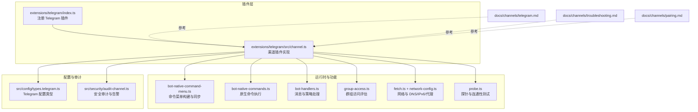
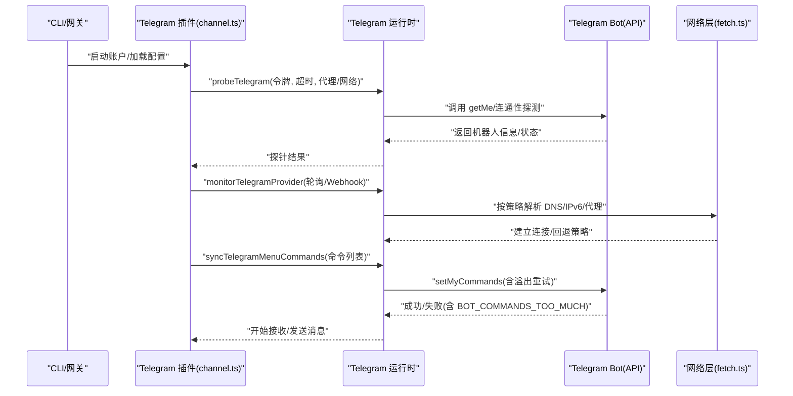
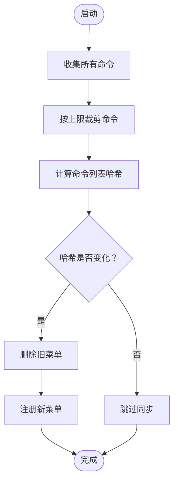
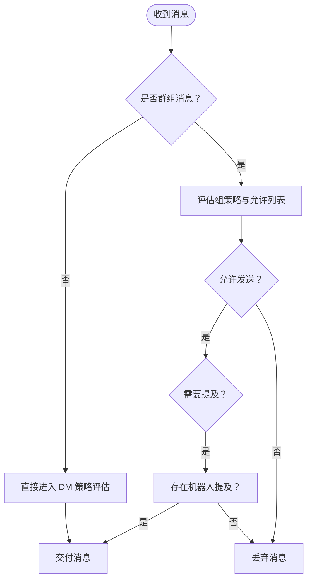
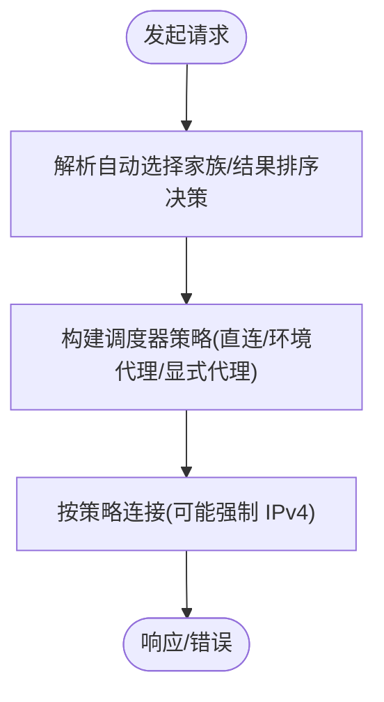
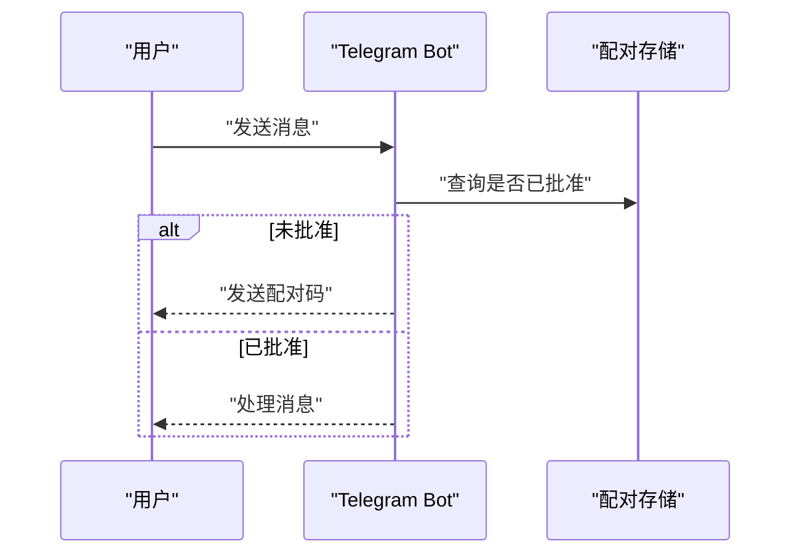
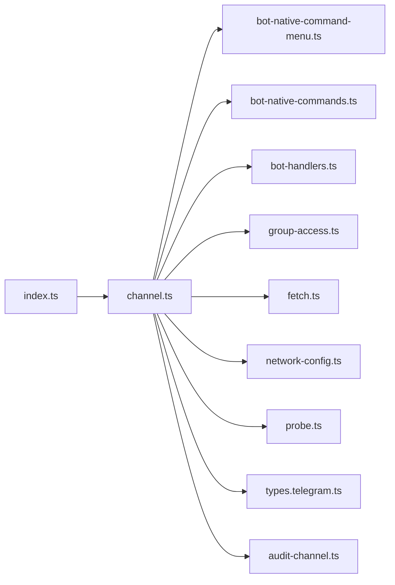

# Telegram 连接故障排除

<cite>
**本文引用的文件**
- [docs/channels/telegram.md](file://docs/channels/telegram.md)
- [docs/channels/troubleshooting.md](file://docs/channels/troubleshooting.md)
- [docs/channels/pairing.md](file://docs/channels/pairing.md)
- [extensions/telegram/index.ts](file://extensions/telegram/index.ts)
- [extensions/telegram/src/channel.ts](file://extensions/telegram/src/channel.ts)
- [extensions/telegram/src/bot-native-command-menu.ts](file://extensions/telegram/src/bot-native-command-menu.ts)
- [extensions/telegram/src/bot-native-commands.ts](file://extensions/telegram/src/bot-native-commands.ts)
- [extensions/telegram/src/bot-handlers.ts](file://extensions/telegram/src/bot-handlers.ts)
- [extensions/telegram/src/group-access.ts](file://extensions/telegram/src/group-access.ts)
- [extensions/telegram/src/fetch.ts](file://extensions/telegram/src/fetch.ts)
- [extensions/telegram/src/network-config.ts](file://extensions/telegram/src/network-config.ts)
- [extensions/telegram/src/probe.ts](file://extensions/telegram/src/probe.ts)
- [src/config/types.telegram.ts](file://src/config/types.telegram.ts)
- [src/security/audit-channel.ts](file://src/security/audit-channel.ts)
</cite>

## 目录
1. [简介](#简介)
2. [项目结构](#项目结构)
3. [核心组件](#核心组件)
4. [架构总览](#架构总览)
5. [详细组件分析](#详细组件分析)
6. [依赖关系分析](#依赖关系分析)
7. [性能考量](#性能考量)
8. [故障排除指南](#故障排除指南)
9. [结论](#结论)
10. [附录](#附录)

## 简介
本指南聚焦于 Telegram 渠道连接与运行中的常见问题，提供系统化的快速检查与修复路径，覆盖以下典型症状：
- /start 后无回复（需先批准或调整 DM 策略）
- 群组静默（需检查隐私模式与提及要求）
- 发送失败且出现网络错误（需排查 DNS/IPv6/代理路由）
- setMyCommands 被拒（命令过多或网络受限）
- 升级后允许列表阻止（需运行诊断并修复）

同时涵盖配对状态检查、隐私模式配置、DNS/IPv6/代理路由设置、命令数量限制等关键解决要点。

## 项目结构
OpenClaw 的 Telegram 支持由“插件层 + 运行时 + 配置模型 + 文档”构成：
- 插件入口负责注册 Telegram 渠道能力与运行时
- 运行时实现长轮询/Webhook、命令菜单同步、消息处理与安全策略
- 配置模型定义网络、命令、分组、线程、动作等参数
- 文档提供快速排障清单与最佳实践

**图表来源**
- [extensions/telegram/index.ts:1-18](file://extensions/telegram/index.ts#L1-L18)
- [extensions/telegram/src/channel.ts:182-574](file://extensions/telegram/src/channel.ts#L182-L574)
- [extensions/telegram/src/bot-native-command-menu.ts:105-208](file://extensions/telegram/src/bot-native-command-menu.ts#L105-L208)
- [extensions/telegram/src/bot-native-commands.ts:864-900](file://extensions/telegram/src/bot-native-commands.ts#L864-L900)
- [extensions/telegram/src/bot-handlers.ts:566-609](file://extensions/telegram/src/bot-handlers.ts#L566-L609)
- [extensions/telegram/src/group-access.ts:120-153](file://extensions/telegram/src/group-access.ts#L120-L153)
- [extensions/telegram/src/fetch.ts:1-466](file://extensions/telegram/src/fetch.ts#L1-L466)
- [extensions/telegram/src/network-config.ts:1-107](file://extensions/telegram/src/network-config.ts#L1-L107)
- [extensions/telegram/src/probe.ts:93-116](file://extensions/telegram/src/probe.ts#L93-L116)
- [src/config/types.telegram.ts:1-271](file://src/config/types.telegram.ts#L1-L271)
- [src/security/audit-channel.ts:720-861](file://src/security/audit-channel.ts#L720-L861)

**章节来源**
- [extensions/telegram/index.ts:1-18](file://extensions/telegram/index.ts#L1-L18)
- [extensions/telegram/src/channel.ts:182-574](file://extensions/telegram/src/channel.ts#L182-L574)

## 核心组件
- 渠道插件：负责配置校验、配对通知、消息发送、状态采集、启动与注销等
- 命令菜单：在启动时通过 setMyCommands 注册原生与自定义命令，并处理溢出与重试
- 消息处理：根据隐私模式、提及要求、群组策略与允许列表进行准入控制
- 网络层：支持自动选择 IP 版本、DNS 结果排序、环境代理与显式代理、IPv4 固定回退
- 探针：验证令牌有效性、机器人信息与连通性
- 安全审计：检查允许列表格式、通配符风险与缺失授权

**章节来源**
- [extensions/telegram/src/channel.ts:182-574](file://extensions/telegram/src/channel.ts#L182-L574)
- [extensions/telegram/src/bot-native-command-menu.ts:105-208](file://extensions/telegram/src/bot-native-command-menu.ts#L105-L208)
- [extensions/telegram/src/bot-handlers.ts:566-609](file://extensions/telegram/src/bot-handlers.ts#L566-L609)
- [extensions/telegram/src/fetch.ts:1-466](file://extensions/telegram/src/fetch.ts#L1-L466)
- [extensions/telegram/src/probe.ts:93-116](file://extensions/telegram/src/probe.ts#L93-L116)
- [src/security/audit-channel.ts:720-861](file://src/security/audit-channel.ts#L720-L861)

## 架构总览
下图展示 Telegram 渠道从启动到运行的关键交互流程，包括命令菜单同步、消息准入与网络路由。

**图表来源**
- [extensions/telegram/src/channel.ts:472-519](file://extensions/telegram/src/channel.ts#L472-L519)
- [extensions/telegram/src/probe.ts:93-116](file://extensions/telegram/src/probe.ts#L93-L116)
- [extensions/telegram/src/bot-native-command-menu.ts:169-208](file://extensions/telegram/src/bot-native-command-menu.ts#L169-L208)
- [extensions/telegram/src/fetch.ts:185-229](file://extensions/telegram/src/fetch.ts#L185-L229)

## 详细组件分析

### 组件A：命令菜单与 setMyCommands 同步
- 功能要点
  - 构建命令列表并计算哈希以避免重复同步
  - 先删除旧菜单再注册新菜单，确保不残留过期条目
  - 当命令超过上限时自动降级并记录日志
  - 可禁用原生命令菜单，仅保留自定义命令
- 关键行为
  - 命令上限裁剪与溢出计数
  - 哈希缓存跳过未变更的同步
  - 失败时记录错误并继续后续流程

**图表来源**
- [extensions/telegram/src/bot-native-command-menu.ts:105-208](file://extensions/telegram/src/bot-native-command-menu.ts#L105-L208)

**章节来源**
- [extensions/telegram/src/bot-native-command-menu.ts:105-208](file://extensions/telegram/src/bot-native-command-menu.ts#L105-L208)
- [extensions/telegram/src/bot-native-commands.ts:864-900](file://extensions/telegram/src/bot-native-commands.ts#L864-L900)

### 组件B：消息准入与群组策略
- 功能要点
  - 根据隐私模式与提及要求决定是否接收群组消息
  - 依据组策略与允许列表进行发送者授权
  - 支持话题级别覆盖与继承
- 关键行为
  - 禁用策略直接丢弃消息
  - 允许列表为空或未配置时阻断
  - 未授权发送者被明确记录并丢弃

**图表来源**
- [extensions/telegram/src/bot-handlers.ts:566-609](file://extensions/telegram/src/bot-handlers.ts#L566-L609)
- [extensions/telegram/src/group-access.ts:120-153](file://extensions/telegram/src/group-access.ts#L120-L153)

**章节来源**
- [extensions/telegram/src/bot-handlers.ts:566-609](file://extensions/telegram/src/bot-handlers.ts#L566-L609)
- [extensions/telegram/src/group-access.ts:120-153](file://extensions/telegram/src/group-access.ts#L120-L153)

### 组件C：网络与 DNS/IPv6/代理路由
- 功能要点
  - 自动选择 IP 版本（autoSelectFamily）与 DNS 结果排序（ipv4first/verbatim）
  - 环境代理优先于显式代理；支持固定 IPv4 回退
  - 在 WSL2 或 Node 22+ 默认倾向使用 IPv4 以规避常见 IPv6 问题
- 关键行为
  - 解析顺序：环境变量 > 配置 > 默认策略
  - 仅在直连或显式代理且允许粘滞回退时启用 IPv4 固定

**图表来源**
- [extensions/telegram/src/network-config.ts:31-102](file://extensions/telegram/src/network-config.ts#L31-L102)
- [extensions/telegram/src/fetch.ts:185-229](file://extensions/telegram/src/fetch.ts#L185-L229)
- [extensions/telegram/src/fetch.ts:432-466](file://extensions/telegram/src/fetch.ts#L432-L466)

**章节来源**
- [extensions/telegram/src/network-config.ts:31-102](file://extensions/telegram/src/network-config.ts#L31-L102)
- [extensions/telegram/src/fetch.ts:185-229](file://extensions/telegram/src/fetch.ts#L185-L229)

### 组件D：配对状态与 DM 策略
- 功能要点
  - DM 策略默认为“配对”，未知发件人需经批准
  - 支持允许列表与开放策略；升级后可自动修复 @username 到数字 ID
  - 提供配对列表与批准操作
- 关键行为
  - 未批准前消息不处理
  - 配对批准后通知用户并写入允许列表

**图表来源**
- [docs/channels/pairing.md:32-37](file://docs/channels/pairing.md#L32-L37)
- [extensions/telegram/src/channel.ts:189-205](file://extensions/telegram/src/channel.ts#L189-L205)

**章节来源**
- [docs/channels/pairing.md:1-111](file://docs/channels/pairing.md#L1-L111)
- [extensions/telegram/src/channel.ts:189-205](file://extensions/telegram/src/channel.ts#L189-L205)

## 依赖关系分析
- 插件入口依赖运行时导出的 Telegram 能力
- 渠道插件依赖命令菜单、原生命令、消息处理器、群组策略、网络与探针模块
- 配置类型为上述模块提供类型约束
- 安全审计模块贯穿允许列表与策略检查

**图表来源**
- [extensions/telegram/index.ts:1-18](file://extensions/telegram/index.ts#L1-L18)
- [extensions/telegram/src/channel.ts:182-574](file://extensions/telegram/src/channel.ts#L182-L574)

**章节来源**
- [extensions/telegram/index.ts:1-18](file://extensions/telegram/index.ts#L1-L18)
- [extensions/telegram/src/channel.ts:182-574](file://extensions/telegram/src/channel.ts#L182-L574)

## 性能考量
- 命令菜单同步采用哈希缓存，避免频繁 setMyCommands 触发限流
- 长轮询基于 grammY Runner，整体并发受 agents.defaults.maxConcurrent 控制
- 网络层在 Node 22+ 默认倾向 IPv4，减少因 IPv6 不稳定导致的重试与失败
- 代理与环境代理的优先级与粘滞回退策略降低全局失败概率

[本节为通用指导，无需特定文件来源]

## 故障排除指南

### 快速检查清单（按症状）
- /start 但无可用回复流
  - 检查配对状态与 DM 策略
  - 步骤：列出配对请求并批准
  - 参考：[docs/channels/troubleshooting.md:49](file://docs/channels/troubleshooting.md#L49)
- 机器人在线但群组保持静默
  - 检查隐私模式与提及要求
  - 参考：[docs/channels/troubleshooting.md:50](file://docs/channels/troubleshooting.md#L50)
- 发送失败且出现网络错误
  - 检查 DNS/IPv6/代理路由至 api.telegram.org
  - 参考：[docs/channels/troubleshooting.md:51](file://docs/channels/troubleshooting.md#L51)
- setMyCommands 被拒绝
  - 检查命令数量与网络错误
  - 参考：[docs/channels/troubleshooting.md:52](file://docs/channels/troubleshooting.md#L52)
- 升级后允许列表阻止
  - 运行安全审计与修复
  - 参考：[docs/channels/troubleshooting.md:53](file://docs/channels/troubleshooting.md#L53)

### 详细步骤与建议

- /start 后无回复
  - 使用配对命令查看与批准
  - 若策略为 allowlist，请确认 allowFrom 中包含你的数字 ID
  - 参考：[docs/channels/pairing.md:32-37](file://docs/channels/pairing.md#L32-L37)，[docs/channels/telegram.md:105-123](file://docs/channels/telegram.md#L105-L123)

- 群组静默
  - 若隐私模式开启，需在群组中关闭隐私或赋予管理员身份
  - 调整 requireMention 或添加机器人的提及模式
  - 参考：[docs/channels/telegram.md:75-103](file://docs/channels/telegram.md#L75-L103)，[docs/channels/telegram.md:208-246](file://docs/channels/telegram.md#L208-L246)

- 网络错误导致发送失败
  - 在 Node 22+ 环境默认使用 IPv4；若仍失败，检查代理与 DNS
  - 参考：[extensions/telegram/src/network-config.ts:51-58](file://extensions/telegram/src/network-config.ts#L51-L58)，[extensions/telegram/src/fetch.ts:185-229](file://extensions/telegram/src/fetch.ts#L185-L229)

- setMyCommands 被拒
  - 命令过多触发 BOT_COMMANDS_TOO_MUCH：减少插件/技能/自定义命令或禁用原生命令菜单
  - 网络错误：修复到 api.telegram.org 的 DNS/HTTPS
  - 参考：[docs/channels/telegram.md:338-342](file://docs/channels/telegram.md#L338-L342)，[extensions/telegram/src/bot-native-command-menu.ts:105-208](file://extensions/telegram/src/bot-native-command-menu.ts#L105-L208)

- 升级后允许列表阻止
  - 运行 doctor --fix 将 @username 替换为数字 ID
  - 审计发现非数值条目与通配符风险并给出修复建议
  - 参考：[docs/channels/telegram.md:119-122](file://docs/channels/telegram.md#L119-L122)，[src/security/audit-channel.ts:805-821](file://src/security/audit-channel.ts#L805-L821)

- Webhook 配置与健康检查
  - 配置 webhookUrl 与 webhookSecret；必要时上传证书
  - 本地监听默认绑定 127.0.0.1:8787；如需外网入口请前置反向代理
  - 参考：[src/config/types.telegram.ts:157-165](file://src/config/types.telegram.ts#L157-L165)，[extensions/telegram/src/webhook.test.ts:371-474](file://extensions/telegram/src/webhook.test.ts#L371-L474)

- 命令数量限制与菜单管理
  - 原生命令默认启用；可通过 commands.native 控制
  - 自定义命令需符合命名规范，不可与原生命令冲突
  - 参考：[docs/channels/telegram.md:302-337](file://docs/channels/telegram.md#L302-L337)，[extensions/telegram/src/bot-native-command-menu.ts:105-208](file://extensions/telegram/src/bot-native-command-menu.ts#L105-L208)

- 隐私模式与提及行为
  - Privacy Mode 下需关闭隐私或管理员身份以接收全部群组消息
  - 可通过 mentionPatterns 与 requireMention 控制触发条件
  - 参考：[docs/channels/telegram.md:75-103](file://docs/channels/telegram.md#L75-L103)，[docs/channels/telegram.md:208-246](file://docs/channels/telegram.md#L208-L246)

**章节来源**
- [docs/channels/troubleshooting.md:43-55](file://docs/channels/troubleshooting.md#L43-L55)
- [docs/channels/pairing.md:32-37](file://docs/channels/pairing.md#L32-L37)
- [docs/channels/telegram.md:75-103](file://docs/channels/telegram.md#L75-L103)
- [docs/channels/telegram.md:302-342](file://docs/channels/telegram.md#L302-L342)
- [src/config/types.telegram.ts:157-165](file://src/config/types.telegram.ts#L157-L165)
- [extensions/telegram/src/bot-native-command-menu.ts:105-208](file://extensions/telegram/src/bot-native-command-menu.ts#L105-L208)
- [extensions/telegram/src/network-config.ts:51-58](file://extensions/telegram/src/network-config.ts#L51-L58)
- [extensions/telegram/src/fetch.ts:185-229](file://extensions/telegram/src/fetch.ts#L185-L229)
- [src/security/audit-channel.ts:805-821](file://src/security/audit-channel.ts#L805-L821)

## 结论
针对 Telegram 渠道的连接与运行问题，建议遵循“先状态后网络，先策略后命令”的排查顺序：
- 用 status/gateway status/logs/doctor/channels status --probe 快速定位
- 检查配对与 DM 策略、隐私模式与提及要求
- 排查 DNS/IPv6/代理路由与 api.telegram.org 连通性
- 控制命令数量与菜单同步策略
- 升级后运行 doctor 与安全审计修复允许列表

[本节为总结，无需特定文件来源]

## 附录

### 常见配置项速查
- 令牌与 DM 策略：channels.telegram.botToken、dmPolicy、allowFrom
- 群组策略与允许列表：groupPolicy、groupAllowFrom、groups
- 命令菜单：commands.native、customCommands
- 网络与代理：network.autoSelectFamily、network.dnsResultOrder、proxy
- Webhook：webhookUrl、webhookSecret、webhookPath、webhookHost、webhookPort、webhookCertPath

**章节来源**
- [src/config/types.telegram.ts:75-204](file://src/config/types.telegram.ts#L75-L204)
- [docs/channels/telegram.md:36-47](file://docs/channels/telegram.md#L36-L47)
- [docs/channels/telegram.md:142-206](file://docs/channels/telegram.md#L142-L206)
- [docs/channels/telegram.md:302-337](file://docs/channels/telegram.md#L302-L337)