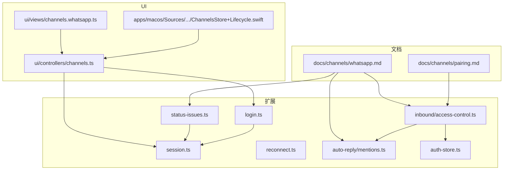
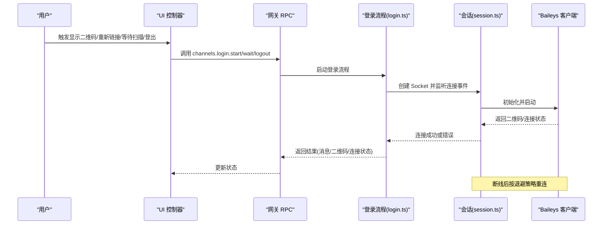
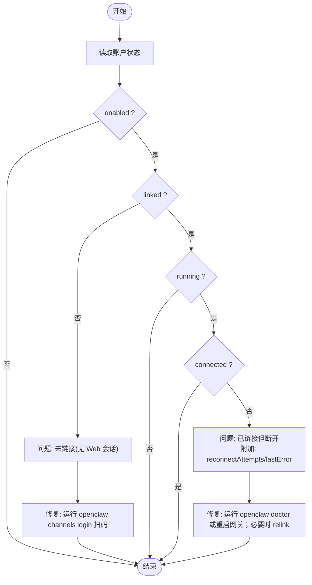
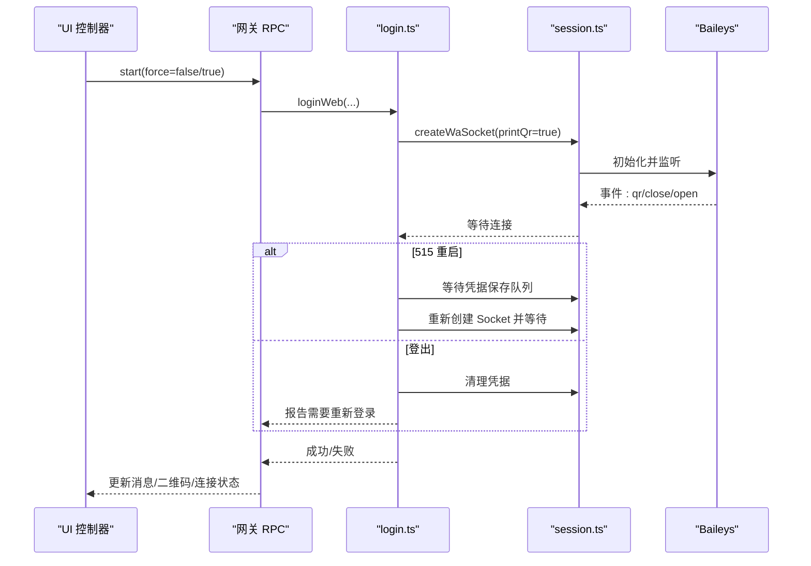
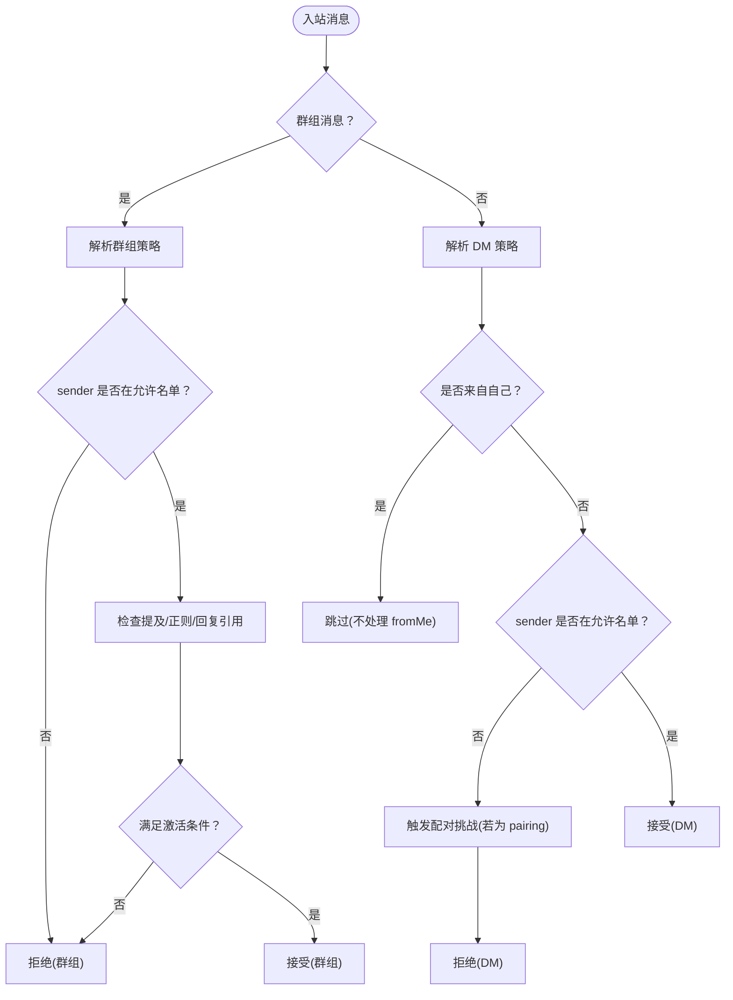
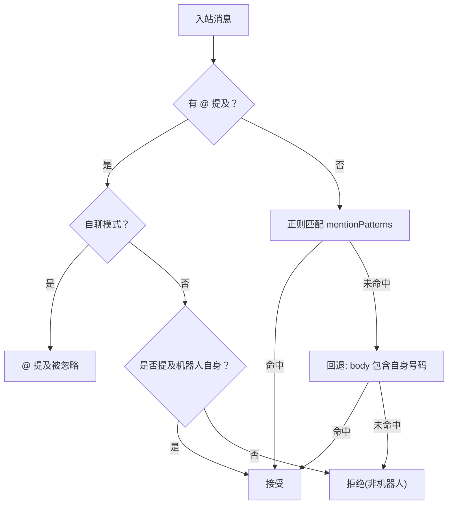
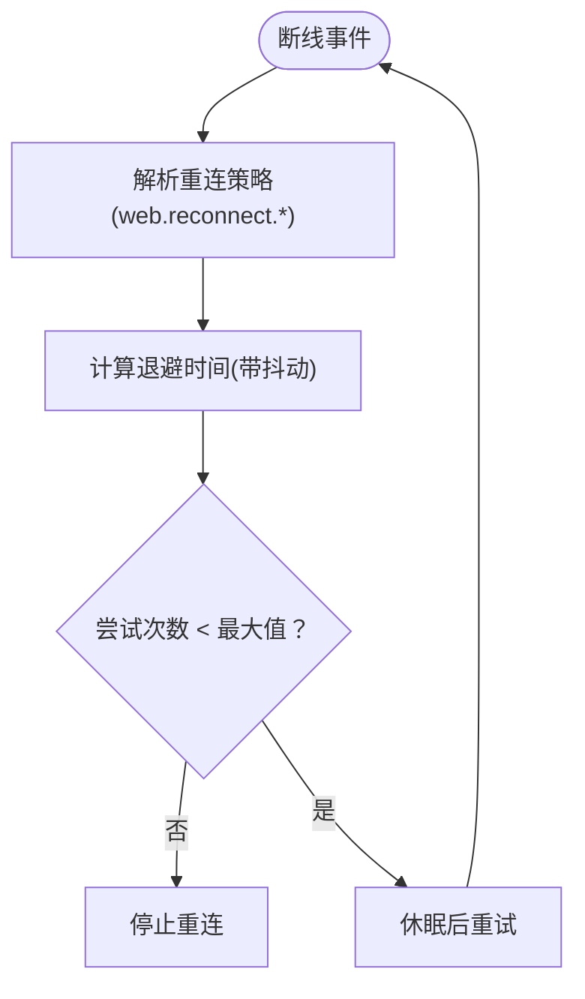
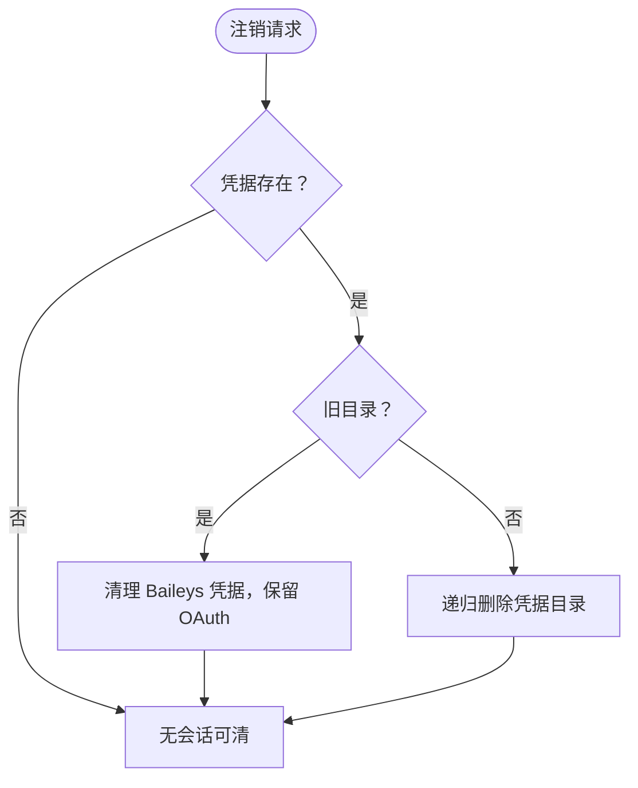
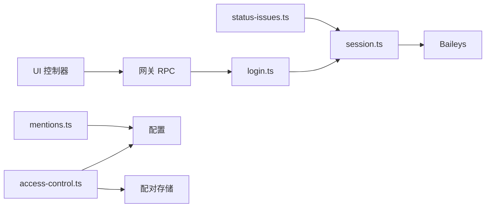

# WhatsApp 连接故障排除

<cite>
**本文引用的文件**
- [docs/channels/whatsapp.md](file://docs/channels/whatsapp.md)
- [extensions/whatsapp/src/status-issues.ts](file://extensions/whatsapp/src/status-issues.ts)
- [extensions/whatsapp/src/login.ts](file://extensions/whatsapp/src/login.ts)
- [extensions/whatsapp/src/session.ts](file://extensions/whatsapp/src/session.ts)
- [extensions/whatsapp/src/reconnect.ts](file://extensions/whatsapp/src/reconnect.ts)
- [extensions/whatsapp/src/inbound/access-control.ts](file://extensions/whatsapp/src/inbound/access-control.ts)
- [extensions/whatsapp/src/auto-reply/mentions.ts](file://extensions/whatsapp/src/auto-reply/mentions.ts)
- [extensions/whatsapp/src/auth-store.ts](file://extensions/whatsapp/src/auth-store.ts)
- [ui/src/ui/views/channels.whatsapp.ts](file://ui/src/ui/views/channels.whatsapp.ts)
- [ui/src/ui/controllers/channels.ts](file://ui/src/ui/controllers/channels.ts)
- [apps/macos/Sources/OpenClaw/ChannelsStore+Lifecycle.swift](file://apps/macos/Sources/OpenClaw/ChannelsStore+Lifecycle.swift)
- [docs/channels/pairing.md](file://docs/channels/pairing.md)
</cite>

## 目录
1. [简介](#简介)
2. [项目结构](#项目结构)
3. [核心组件](#核心组件)
4. [架构总览](#架构总览)
5. [详细组件分析](#详细组件分析)
6. [依赖关系分析](#依赖关系分析)
7. [性能考量](#性能考量)
8. [故障排除指南](#故障排除指南)
9. [结论](#结论)
10. [附录](#附录)

## 简介
本指南聚焦于 WhatsApp 渠道（基于 Baileys 的 WhatsApp Web）在 OpenClaw 中的连接故障排除。覆盖典型问题：连接但无回复、群组消息被忽略、随机断开重连循环，并提供系统化的诊断与修复步骤。同时详解配对列表检查、DM 策略配置、提及模式设置、重新登录验证等关键操作，以及与 WhatsApp Business API 限制、网络连接问题和权限配置相关的解决方案。

## 项目结构
围绕 WhatsApp 的相关实现分布在以下模块：
- 文档层：渠道使用与故障排除文档
- 扩展层：WhatsApp 渠道插件（状态检查、登录、会话、重连、入站访问控制、提及检测、认证存储）
- UI 层：Web 控制台与移动端对登录流程的封装
- 配对与权限：渠道配对机制与运行时策略

**图表来源**
- [docs/channels/whatsapp.md:1-446](file://docs/channels/whatsapp.md#L1-L446)
- [extensions/whatsapp/src/status-issues.ts:1-74](file://extensions/whatsapp/src/status-issues.ts#L1-L74)
- [extensions/whatsapp/src/login.ts:1-83](file://extensions/whatsapp/src/login.ts#L1-L83)
- [extensions/whatsapp/src/session.ts:1-347](file://extensions/whatsapp/src/session.ts#L1-L347)
- [extensions/whatsapp/src/reconnect.ts:1-53](file://extensions/whatsapp/src/reconnect.ts#L1-L53)
- [extensions/whatsapp/src/inbound/access-control.ts:1-228](file://extensions/whatsapp/src/inbound/access-control.ts#L1-L228)
- [extensions/whatsapp/src/auto-reply/mentions.ts:1-121](file://extensions/whatsapp/src/auto-reply/mentions.ts#L1-L121)
- [extensions/whatsapp/src/auth-store.ts:131-167](file://extensions/whatsapp/src/auth-store.ts#L131-L167)
- [ui/src/ui/views/channels.whatsapp.ts:1-118](file://ui/src/ui/views/channels.whatsapp.ts#L1-L118)
- [ui/src/ui/controllers/channels.ts:1-94](file://ui/src/ui/controllers/channels.ts#L1-L94)
- [apps/macos/Sources/OpenClaw/ChannelsStore+Lifecycle.swift:76-119](file://apps/macos/Sources/OpenClaw/ChannelsStore+Lifecycle.swift#L76-L119)

**章节来源**
- [docs/channels/whatsapp.md:1-446](file://docs/channels/whatsapp.md#L1-L446)
- [extensions/whatsapp/src/status-issues.ts:1-74](file://extensions/whatsapp/src/status-issues.ts#L1-L74)
- [extensions/whatsapp/src/login.ts:1-83](file://extensions/whatsapp/src/login.ts#L1-L83)
- [extensions/whatsapp/src/session.ts:1-347](file://extensions/whatsapp/src/session.ts#L1-L347)
- [extensions/whatsapp/src/reconnect.ts:1-53](file://extensions/whatsapp/src/reconnect.ts#L1-L53)
- [extensions/whatsapp/src/inbound/access-control.ts:1-228](file://extensions/whatsapp/src/inbound/access-control.ts#L1-L228)
- [extensions/whatsapp/src/auto-reply/mentions.ts:1-121](file://extensions/whatsapp/src/auto-reply/mentions.ts#L1-L121)
- [extensions/whatsapp/src/auth-store.ts:131-167](file://extensions/whatsapp/src/auth-store.ts#L131-L167)
- [ui/src/ui/views/channels.whatsapp.ts:1-118](file://ui/src/ui/views/channels.whatsapp.ts#L1-L118)
- [ui/src/ui/controllers/channels.ts:1-94](file://ui/src/ui/controllers/channels.ts#L1-L94)
- [apps/macos/Sources/OpenClaw/ChannelsStore+Lifecycle.swift:76-119](file://apps/macos/Sources/OpenClaw/ChannelsStore+Lifecycle.swift#L76-L119)

## 核心组件
- 状态检查器：收集已启用账户的认证与运行时问题，识别“未链接”“已链接但断开”等情形并给出修复建议。
- 登录流程：创建 Baileys Socket、打印二维码、等待连接、处理特定错误码（如 515 重启、登出）。
- 会话与认证：多文件认证状态管理、备份恢复、权限保护、WebSocket 错误处理。
- 重连策略：指数退避、抖动、最大尝试次数、心跳周期可配置。
- 入站访问控制：DM 与群组策略、自聊保护、配对请求与允许名单合并。
- 提及检测：显式 @、正则匹配、回复引用回退、自聊模式下的特殊处理。
- UI 控制：Web 控制台与移动端封装登录、等待扫描、注销、刷新等操作。

**章节来源**
- [extensions/whatsapp/src/status-issues.ts:37-73](file://extensions/whatsapp/src/status-issues.ts#L37-L73)
- [extensions/whatsapp/src/login.ts:17-82](file://extensions/whatsapp/src/login.ts#L17-L82)
- [extensions/whatsapp/src/session.ts:97-168](file://extensions/whatsapp/src/session.ts#L97-L168)
- [extensions/whatsapp/src/reconnect.ts:28-48](file://extensions/whatsapp/src/reconnect.ts#L28-L48)
- [extensions/whatsapp/src/inbound/access-control.ts:41-223](file://extensions/whatsapp/src/inbound/access-control.ts#L41-L223)
- [extensions/whatsapp/src/auto-reply/mentions.ts:20-121](file://extensions/whatsapp/src/auto-reply/mentions.ts#L20-L121)
- [ui/src/ui/controllers/channels.ts:29-94](file://ui/src/ui/controllers/channels.ts#L29-L94)

## 架构总览
下图展示从用户触发到最终连接建立的关键交互，以及常见断线后的重连路径。

**图表来源**
- [ui/src/ui/controllers/channels.ts:29-94](file://ui/src/ui/controllers/channels.ts#L29-L94)
- [extensions/whatsapp/src/login.ts:17-82](file://extensions/whatsapp/src/login.ts#L17-L82)
- [extensions/whatsapp/src/session.ts:97-191](file://extensions/whatsapp/src/session.ts#L97-L191)
- [extensions/whatsapp/src/reconnect.ts:28-48](file://extensions/whatsapp/src/reconnect.ts#L28-L48)

## 详细组件分析

### 组件一：状态检查与问题定位
- 功能要点
  - 收集已启用账户的状态快照，识别未链接与“已链接但断开”的异常。
  - 对断开账户附加重试次数与最后错误信息，便于快速定位。
  - 提供 CLI 命令修复建议（doctor、channels login）。
- 关键字段
  - linked/connected/running/reconnectAttempts/lastError
- 适用场景
  - “连接但无回复”：通常表现为 running=true、connected=false。
  - “随机断开重连循环”：通过 reconnectAttempts 与 lastError 判断。

**图表来源**
- [extensions/whatsapp/src/status-issues.ts:37-73](file://extensions/whatsapp/src/status-issues.ts#L37-L73)

**章节来源**
- [extensions/whatsapp/src/status-issues.ts:37-73](file://extensions/whatsapp/src/status-issues.ts#L37-L73)

### 组件二：登录与重新登录流程
- 功能要点
  - 创建 Baileys Socket，支持打印二维码与等待连接。
  - 处理特定错误码：
    - 515：配对后要求重启，等待凭据保存队列后重试。
    - 登出：清理缓存会话，提示重新登录。
  - 会话事件：连接打开/关闭、二维码生成、WebSocket 错误日志。
- 操作步骤
  - 显示二维码：channels.login.start(force=false)
  - 等待扫描：channels.login.wait
  - 强制重新链接：channels.login.start(force=true)
  - 注销：channels.logout(channel=whatsapp)

**图表来源**
- [ui/src/ui/controllers/channels.ts:29-77](file://ui/src/ui/controllers/channels.ts#L29-L77)
- [extensions/whatsapp/src/login.ts:17-82](file://extensions/whatsapp/src/login.ts#L17-L82)
- [extensions/whatsapp/src/session.ts:97-168](file://extensions/whatsapp/src/session.ts#L97-L168)

**章节来源**
- [extensions/whatsapp/src/login.ts:17-82](file://extensions/whatsapp/src/login.ts#L17-L82)
- [extensions/whatsapp/src/session.ts:97-168](file://extensions/whatsapp/src/session.ts#L97-L168)
- [ui/src/ui/controllers/channels.ts:29-77](file://ui/src/ui/controllers/channels.ts#L29-L77)

### 组件三：入站访问控制与配对
- 功能要点
  - DM 策略：pairing（默认）、allowlist、open、disabled。
  - 群组策略：open、allowlist、disabled；sender allowlist 可回退到 allowFrom。
  - 自聊保护：当自身号码在 allowFrom 内时，跳过自读取回执、忽略自触发提及。
  - 配对请求：未知发送者触发配对挑战，经批准后写入允许名单。
- 关键配置
  - channels.whatsapp.dmPolicy、allowFrom
  - channels.whatsapp.groupPolicy、groupAllowFrom、groups
  - selfChatMode、session.dmScope、historyLimit

**图表来源**
- [extensions/whatsapp/src/inbound/access-control.ts:41-223](file://extensions/whatsapp/src/inbound/access-control.ts#L41-L223)

**章节来源**
- [extensions/whatsapp/src/inbound/access-control.ts:41-223](file://extensions/whatsapp/src/inbound/access-control.ts#L41-L223)
- [docs/channels/whatsapp.md:134-200](file://docs/channels/whatsapp.md#L134-L200)
- [docs/channels/pairing.md:20-56](file://docs/channels/pairing.md#L20-L56)

### 组件四：提及检测与激活命令
- 功能要点
  - 显式 @（含 JID/E.164 归一化）、正则表达式（agents/groupChat.mentionPatterns）、回复引用回退。
  - 自聊模式下忽略 @ 提及以避免自我触发。
  - 会话级激活命令：/activation mention 或 /activation always。
- 适用场景
  - 群组消息被忽略：检查 requireMention、mentionPatterns、groupAllowFrom、groups。

**图表来源**
- [extensions/whatsapp/src/auto-reply/mentions.ts:28-110](file://extensions/whatsapp/src/auto-reply/mentions.ts#L28-L110)

**章节来源**
- [extensions/whatsapp/src/auto-reply/mentions.ts:20-121](file://extensions/whatsapp/src/auto-reply/mentions.ts#L20-L121)
- [docs/channels/whatsapp.md:178-200](file://docs/channels/whatsapp.md#L178-L200)

### 组件五：重连策略与心跳
- 功能要点
  - 默认心跳：60 秒；可配置 override。
  - 退避策略：初始 2s、最大 30s、因子 1.8、抖动 0.25、最大尝试 12 次。
  - 参数校验与边界钳制，确保策略稳定。
- 适用场景
  - “随机断开重连循环”：检查 web.reconnect.* 配置与 lastError。

**图表来源**
- [extensions/whatsapp/src/reconnect.ts:28-48](file://extensions/whatsapp/src/reconnect.ts#L28-L48)

**章节来源**
- [extensions/whatsapp/src/reconnect.ts:28-48](file://extensions/whatsapp/src/reconnect.ts#L28-L48)

### 组件六：认证存储与注销
- 功能要点
  - 多文件认证目录、凭据备份与权限保护（chmod 600）。
  - 注销：删除认证目录（或迁移旧目录），保留 OAuth 文件。
  - 读取自身份：从凭据中解析 JID/E.164。
- 适用场景
  - “连接但无回复”且怀疑凭据损坏：执行 channels.logout 后重新登录。

**图表来源**
- [extensions/whatsapp/src/auth-store.ts:131-167](file://extensions/whatsapp/src/auth-store.ts#L131-L167)

**章节来源**
- [extensions/whatsapp/src/auth-store.ts:131-167](file://extensions/whatsapp/src/auth-store.ts#L131-L167)

## 依赖关系分析
- UI 层依赖网关 RPC 方法：web.login.start、web.login.wait、channels.logout。
- 登录流程依赖会话层：创建 Socket、监听连接事件、处理错误码。
- 访问控制依赖配置与配对存储：DM/群组策略、允许名单、配对请求。
- 提及检测依赖全局配置：mentionPatterns、自聊天模式。

**图表来源**
- [ui/src/ui/controllers/channels.ts:29-94](file://ui/src/ui/controllers/channels.ts#L29-L94)
- [extensions/whatsapp/src/login.ts:17-82](file://extensions/whatsapp/src/login.ts#L17-L82)
- [extensions/whatsapp/src/session.ts:97-168](file://extensions/whatsapp/src/session.ts#L97-L168)
- [extensions/whatsapp/src/inbound/access-control.ts:41-223](file://extensions/whatsapp/src/inbound/access-control.ts#L41-L223)
- [extensions/whatsapp/src/auto-reply/mentions.ts:20-121](file://extensions/whatsapp/src/auto-reply/mentions.ts#L20-L121)
- [extensions/whatsapp/src/status-issues.ts:37-73](file://extensions/whatsapp/src/status-issues.ts#L37-L73)

**章节来源**
- [ui/src/ui/controllers/channels.ts:29-94](file://ui/src/ui/controllers/channels.ts#L29-L94)
- [extensions/whatsapp/src/login.ts:17-82](file://extensions/whatsapp/src/login.ts#L17-L82)
- [extensions/whatsapp/src/session.ts:97-168](file://extensions/whatsapp/src/session.ts#L97-L168)
- [extensions/whatsapp/src/inbound/access-control.ts:41-223](file://extensions/whatsapp/src/inbound/access-control.ts#L41-L223)
- [extensions/whatsapp/src/auto-reply/mentions.ts:20-121](file://extensions/whatsapp/src/auto-reply/mentions.ts#L20-L121)
- [extensions/whatsapp/src/status-issues.ts:37-73](file://extensions/whatsapp/src/status-issues.ts#L37-L73)

## 性能考量
- 心跳与退避：合理的心跳周期与退避策略可减少无效重试，降低资源消耗。
- 历史注入上下文：群组历史注入上限可控制内存占用，避免过长上下文导致延迟。
- 媒体大小限制：发送/接收媒体上限与自动优化可避免超大文件阻塞。
- 自读取回执：自聊模式跳过自读取回执，减少不必要的网络往返。

[本节为通用指导，无需具体文件来源]

## 故障排除指南

### 1) 连接但无回复（已链接但断开）
- 症状
  - 状态显示 linked=true、running=true、connected=false，出现 reconnectAttempts 与 lastError。
- 诊断
  - 使用 doctor 与 logs --follow 检查底层错误。
  - 确认网络连通性与防火墙放行。
- 修复
  - 运行 doctor 或重启网关。
  - 如持续出现，执行 relink（channels.login.start）并重新扫码。
  - 检查 web.reconnect.* 与 web.heartbeatSeconds 配置。

**章节来源**
- [extensions/whatsapp/src/status-issues.ts:62-70](file://extensions/whatsapp/src/status-issues.ts#L62-L70)
- [extensions/whatsapp/src/reconnect.ts:28-48](file://extensions/whatsapp/src/reconnect.ts#L28-L48)
- [docs/channels/whatsapp.md:389-401](file://docs/channels/whatsapp.md#L389-L401)

### 2) 群组消息被忽略
- 症状
  - 群组消息未触发响应。
- 诊断顺序
  - groupPolicy 与 groupAllowFrom/allowFrom。
  - groups 允许列表。
  - mention gating（requireMention 与 mentionPatterns）。
  - 检查 JSON5 配置中是否存在重复键导致覆盖。
- 修复
  - 将 groupPolicy 设为 open 或在 allowFrom 中添加允许发送者。
  - 在 agents.groupChat.mentionPatterns 中添加或调整正则。
  - 确保 groups 列表包含目标群 JID。

**章节来源**
- [extensions/whatsapp/src/inbound/access-control.ts:86-147](file://extensions/whatsapp/src/inbound/access-control.ts#L86-L147)
- [extensions/whatsapp/src/auto-reply/mentions.ts:20-121](file://extensions/whatsapp/src/auto-reply/mentions.ts#L20-L121)
- [docs/channels/whatsapp.md:410-419](file://docs/channels/whatsapp.md#L410-L419)

### 3) 随机断开与重连循环
- 症状
  - 连续断开与重连，reconnectAttempts 上升。
- 诊断
  - 查看 lastError 获取具体原因。
  - 检查网络稳定性、代理/防火墙、DNS 解析。
- 修复
  - 调整 web.reconnect.*（增大 maxAttempts、maxMs 或降低 factor）。
  - 设置合理的 web.heartbeatSeconds。
  - 若问题持续，执行 relink 并观察 logs。

**章节来源**
- [extensions/whatsapp/src/reconnect.ts:28-48](file://extensions/whatsapp/src/reconnect.ts#L28-L48)
- [extensions/whatsapp/src/session.ts:160-165](file://extensions/whatsapp/src/session.ts#L160-L165)
- [docs/channels/whatsapp.md:389-401](file://docs/channels/whatsapp.md#L389-L401)

### 4) 配对列表检查与 DM 策略
- 症状
  - 未知发送者消息被忽略或触发配对挑战。
- 诊断
  - 检查 channels.whatsapp.dmPolicy 与 allowFrom。
  - 查看配对存储（~/.openclaw/credentials/）中的允许名单。
- 修复
  - pairing：在门户批准配对请求。
  - allowlist：将发送者加入 allowFrom。
  - open：需包含 "*" 且谨慎使用。
  - disabled：忽略所有 DM。

**章节来源**
- [extensions/whatsapp/src/inbound/access-control.ts:149-215](file://extensions/whatsapp/src/inbound/access-control.ts#L149-L215)
- [docs/channels/pairing.md:20-56](file://docs/channels/pairing.md#L20-L56)
- [docs/channels/whatsapp.md:134-154](file://docs/channels/whatsapp.md#L134-L154)

### 5) 提及模式设置与激活命令
- 症状
  - 群组消息未触发，尽管发送者在允许名单内。
- 诊断
  - 检查 requireMention 与 mentionPatterns。
  - 确认是否处于自聊模式。
- 修复
  - 在 agents.groupChat.mentionPatterns 中添加机器人名称或正则。
  - 使用会话级 /activation mention 或 /activation always。

**章节来源**
- [extensions/whatsapp/src/auto-reply/mentions.ts:20-121](file://extensions/whatsapp/src/auto-reply/mentions.ts#L20-L121)
- [docs/channels/whatsapp.md:178-199](file://docs/channels/whatsapp.md#L178-L199)

### 6) 重新登录验证
- 步骤
  - 显示二维码：channels.login.start(false)。
  - 等待扫描：channels.login.wait。
  - 强制重新链接：channels.login.start(true)。
  - 注销：channels.logout(channel=whatsapp)。
- 注意
  - 515 重启：等待凭据保存队列后自动重试。
  - 登出：清理凭据，提示重新登录。

**章节来源**
- [ui/src/ui/controllers/channels.ts:29-94](file://ui/src/ui/controllers/channels.ts#L29-L94)
- [extensions/whatsapp/src/login.ts:17-82](file://extensions/whatsapp/src/login.ts#L17-L82)
- [extensions/whatsapp/src/session.ts:141-153](file://extensions/whatsapp/src/session.ts#L141-L153)

### 7) WhatsApp Business API 限制、网络连接与权限
- 限制与注意
  - 当前架构为 WhatsApp Web（Baileys），不包含 Twilio WhatsApp Messaging 渠道。
  - 不兼容 Bun 运行时，建议使用 Node。
- 网络与权限
  - 放行 WebSocket 与二维码扫描所需网络。
  - 凭据目录权限应为 600，避免被其他用户读取。
  - 日志中关注 WebSocket error、连接关闭原因。

**章节来源**
- [docs/channels/whatsapp.md:118-124](file://docs/channels/whatsapp.md#L118-L124)
- [extensions/whatsapp/src/session.ts:160-165](file://extensions/whatsapp/src/session.ts#L160-L165)
- [extensions/whatsapp/src/auth-store.ts:84-87](file://extensions/whatsapp/src/auth-store.ts#L84-L87)
- [docs/channels/whatsapp.md:421-423](file://docs/channels/whatsapp.md#L421-L423)

## 结论
针对 WhatsApp 渠道的连接故障，建议采用“状态检查—登录验证—策略核对—重连调优”的系统化排查路径。结合配对列表、DM/群组策略与提及模式配置，可有效解决“连接但无回复”“群组消息忽略”“断开重连循环”等典型问题。对于 Business API 限制与运行环境约束，应遵循文档建议并保持日志监控以快速定位根因。

[本节为总结，无需具体文件来源]

## 附录

### A. UI 与移动端操作入口
- Web 控制台
  - 显示二维码、重新链接、等待扫描、登出、刷新。
- macOS 应用
  - 封装了 waitWhatsAppLogin 与 logoutWhatsApp 的调用。

**章节来源**
- [ui/src/ui/views/channels.whatsapp.ts:7-118](file://ui/src/ui/views/channels.whatsapp.ts#L7-L118)
- [ui/src/ui/controllers/channels.ts:29-94](file://ui/src/ui/controllers/channels.ts#L29-L94)
- [apps/macos/Sources/OpenClaw/ChannelsStore+Lifecycle.swift:76-119](file://apps/macos/Sources/OpenClaw/ChannelsStore+Lifecycle.swift#L76-L119)

### B. 常用命令速查
- 显示二维码/重新链接：channels.login.start
- 等待扫描：channels.login.wait
- 注销：channels.logout(channel=whatsapp)
- 诊断：doctor
- 查看状态：channels.status

**章节来源**
- [docs/channels/whatsapp.md:382-385](file://docs/channels/whatsapp.md#L382-L385)
- [docs/channels/whatsapp.md:394-397](file://docs/channels/whatsapp.md#L394-L397)