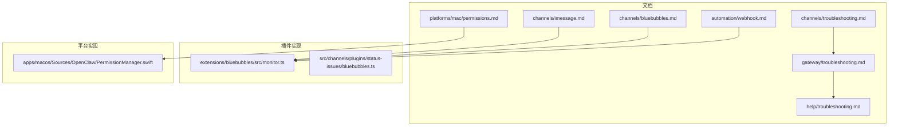
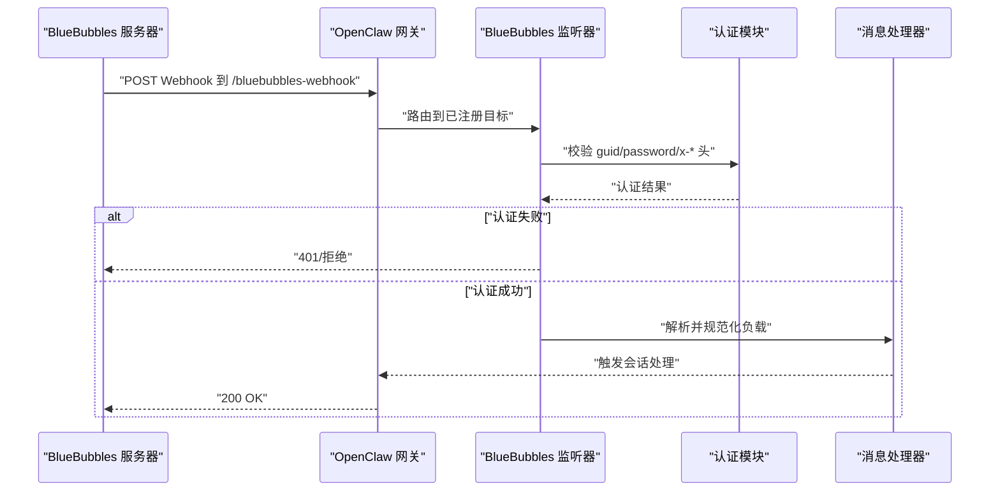
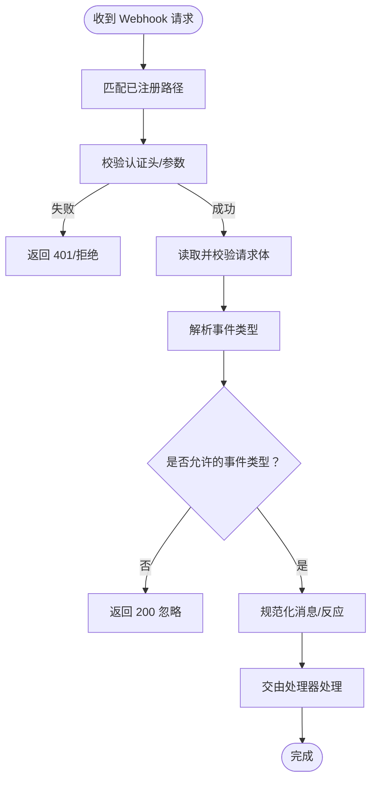
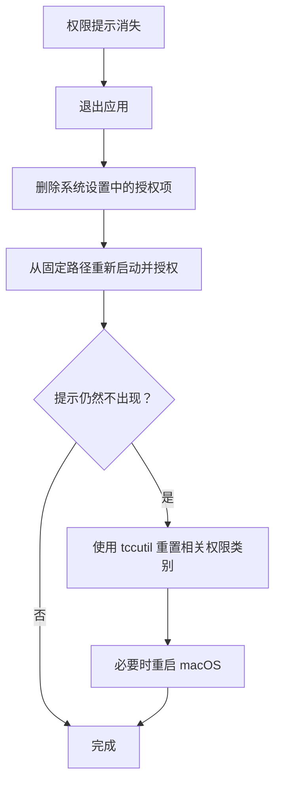
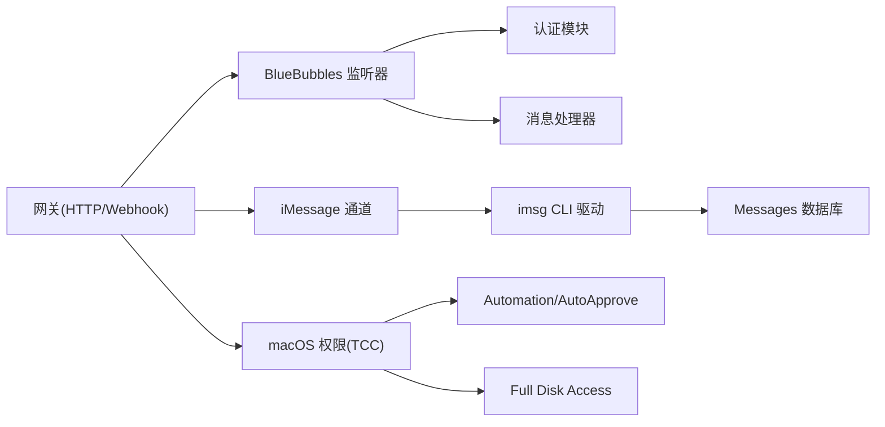

# iMessage 和 BlueBubbles 连接故障排除

<cite>
**本文档引用的文件**
- [docs/channels/imessage.md](file://docs/channels/imessage.md)
- [docs/channels/bluebubbles.md](file://docs/channels/bluebubbles.md)
- [docs/channels/troubleshooting.md](file://docs/channels/troubleshooting.md)
- [docs/gateway/troubleshooting.md](file://docs/gateway/troubleshooting.md)
- [docs/help/troubleshooting.md](file://docs/help/troubleshooting.md)
- [docs/automation/webhook.md](file://docs/automation/webhook.md)
- [extensions/bluebubbles/src/monitor.ts](file://extensions/bluebubbles/src/monitor.ts)
- [src/channels/plugins/status-issues/bluebubbles.ts](file://src/channels/plugins/status-issues/bluebubbles.ts)
- [apps/macos/Sources/OpenClaw/PermissionManager.swift](file://apps/macos/Sources/OpenClaw/PermissionManager.swift)
- [docs/platforms/mac/permissions.md](file://docs/platforms/mac/permissions.md)
</cite>

## 目录
1. [简介](#简介)
2. [项目结构](#项目结构)
3. [核心组件](#核心组件)
4. [架构总览](#架构总览)
5. [详细组件分析](#详细组件分析)
6. [依赖关系分析](#依赖关系分析)
7. [性能考量](#性能考量)
8. [故障排除指南](#故障排除指南)
9. [结论](#结论)
10. [附录](#附录)

## 简介
本指南面向在 macOS 上部署 iMessage 和 BlueBubbles 渠道的用户，提供系统化的故障排除流程，覆盖以下典型问题：
- 无入站事件
- macOS 可发送但无接收
- 私信发送方被阻止
- Webhook/服务器可达性检查
- macOS TCC 权限验证
- 应用权限配置
- BlueBubbles 服务器状态监控

本指南同时提供命令行诊断步骤、可视化流程图与最佳实践建议，帮助快速定位并解决问题。

## 项目结构
OpenClaw 仓库包含多语言实现与丰富的文档，围绕“通道（Channel）”抽象组织 iMessage 与 BlueBubbles 的集成逻辑。相关文档与实现分布如下：
- 文档层：channels、gateway、help、automation、platforms/mac 等目录下的故障排除与配置参考
- 插件层：extensions/bluebubbles 提供 BlueBubbles 通道的具体实现，包括 Webhook 监听、认证与处理
- 平台层：apps/macos 包含 macOS 权限管理与监控逻辑

**图表来源**
- [docs/channels/imessage.md](file://docs/channels/imessage.md)
- [docs/channels/bluebubbles.md](file://docs/channels/bluebubbles.md)
- [docs/channels/troubleshooting.md](file://docs/channels/troubleshooting.md)
- [docs/gateway/troubleshooting.md](file://docs/gateway/troubleshooting.md)
- [docs/help/troubleshooting.md](file://docs/help/troubleshooting.md)
- [docs/automation/webhook.md](file://docs/automation/webhook.md)
- [docs/platforms/mac/permissions.md](file://docs/platforms/mac/permissions.md)
- [extensions/bluebubbles/src/monitor.ts](file://extensions/bluebubbles/src/monitor.ts)
- [src/channels/plugins/status-issues/bluebubbles.ts](file://src/channels/plugins/status-issues/bluebubbles.ts)
- [apps/macos/Sources/OpenClaw/PermissionManager.swift](file://apps/macos/Sources/OpenClaw/PermissionManager.swift)

**章节来源**
- [docs/channels/imessage.md](file://docs/channels/imessage.md)
- [docs/channels/bluebubbles.md](file://docs/channels/bluebubbles.md)
- [docs/channels/troubleshooting.md](file://docs/channels/troubleshooting.md)
- [docs/gateway/troubleshooting.md](file://docs/gateway/troubleshooting.md)
- [docs/help/troubleshooting.md](file://docs/help/troubleshooting.md)
- [docs/automation/webhook.md](file://docs/automation/webhook.md)
- [docs/platforms/mac/permissions.md](file://docs/platforms/mac/permissions.md)
- [extensions/bluebubbles/src/monitor.ts](file://extensions/bluebubbles/src/monitor.ts)
- [src/channels/plugins/status-issues/bluebubbles.ts](file://src/channels/plugins/status-issues/bluebubbles.ts)
- [apps/macos/Sources/OpenClaw/PermissionManager.swift](file://apps/macos/Sources/OpenClaw/PermissionManager.swift)

## 核心组件
- iMessage（legacy imsg）
  - 通过本地或远程 imsg CLI 与 Messages 数据库交互，支持配对模式与访问控制策略
  - 关键点：全盘访问权限、自动化权限、配对码有效期、附件根目录校验
- BlueBubbles（推荐）
  - 基于 BlueBubbles macOS 服务器的 REST/WEBHOOK 方案，功能更丰富且易于部署
  - 关键点：Webhook 认证、服务器状态探测、消息去重与处理、动作能力开关
- macOS 权限（TCC）
  - Automation、Accessibility、AppleEvents 等权限的授予与持久化要求
  - 关键点：签名一致性、Bundle ID、路径稳定性；权限丢失时的恢复流程

**章节来源**
- [docs/channels/imessage.md](file://docs/channels/imessage.md)
- [docs/channels/bluebubbles.md](file://docs/channels/bluebubbles.md)
- [docs/platforms/mac/permissions.md](file://docs/platforms/mac/permissions.md)

## 架构总览
下图展示 BlueBubbles 入站消息从 BlueBubbles 服务器到 OpenClaw 网关的关键路径与认证流程。

**图表来源**
- [extensions/bluebubbles/src/monitor.ts](file://extensions/bluebubbles/src/monitor.ts)
- [docs/automation/webhook.md](file://docs/automation/webhook.md)

## 详细组件分析

### BlueBubbles Webhook 监听与认证
- 注册与路由
  - 监听器按配置注册精确匹配的 Webhook 路径，并维护目标集合
- 认证机制
  - 支持查询参数与多种请求头进行认证（guid/password/x-guid/x-password/x-bluebubbles-guid/authorization）
  - 使用安全比较函数避免时序攻击
- 负载处理
  - 读取并校验请求体，解析事件类型（新增消息、更新消息、反应等）
  - 对非允许事件类型直接返回 200 忽略
- 状态与可观测性
  - 记录收到的事件键、忽略原因、认证拒绝日志
  - 缓存服务器信息（macOS 版本、私有 API 开启状态），用于动作能力自动降级

**图表来源**
- [extensions/bluebubbles/src/monitor.ts](file://extensions/bluebubbles/src/monitor.ts)

**章节来源**
- [extensions/bluebubbles/src/monitor.ts](file://extensions/bluebubbles/src/monitor.ts)
- [docs/automation/webhook.md](file://docs/automation/webhook.md)

### macOS 权限与自动化
- 权限要求
  - 发送 iMessage 需要 Automation 权限
  - 访问 Messages 数据库需要 Full Disk Access
- 权限持久化
  - 签名、Bundle ID、路径必须稳定，否则 macOS 会视作新应用并清除历史授权
- 恢复流程
  - 退出应用、移除系统设置中的授权项、从原路径重新启动并重新授权
  - 若仍不出现提示，使用 tccutil 重置相关权限类别

**图表来源**
- [docs/platforms/mac/permissions.md](file://docs/platforms/mac/permissions.md)
- [apps/macos/Sources/OpenClaw/PermissionManager.swift](file://apps/macos/Sources/OpenClaw/PermissionManager.swift)

**章节来源**
- [docs/platforms/mac/permissions.md](file://docs/platforms/mac/permissions.md)
- [apps/macos/Sources/OpenClaw/PermissionManager.swift](file://apps/macos/Sources/OpenClaw/PermissionManager.swift)

### iMessage（legacy imsg）接入要点
- 配置与部署
  - 本地或通过 SSH 远程调用 imsg CLI
  - 附件抓取需配置 remoteHost 与允许的附件根目录
- 权限与配对
  - 首次运行需在相同用户/会话上下文触发 GUI 提示以授予权限
  - DM 默认配对模式，配对码 1 小时后过期
- 访问控制
  - DM/群组策略与允许列表，提及检测（正则）与控制命令绕过规则

**章节来源**
- [docs/channels/imessage.md](file://docs/channels/imessage.md)

## 依赖关系分析
- BlueBubbles 插件依赖网关的 Webhook 注册与认证框架
- 权限管理与 macOS 系统设置存在强耦合，签名与路径变更会导致权限失效
- iMessage 通道依赖本地/远程 imsg CLI 与 Messages 数据库

**图表来源**
- [extensions/bluebubbles/src/monitor.ts](file://extensions/bluebubbles/src/monitor.ts)
- [docs/channels/imessage.md](file://docs/channels/imessage.md)
- [docs/platforms/mac/permissions.md](file://docs/platforms/mac/permissions.md)

**章节来源**
- [extensions/bluebubbles/src/monitor.ts](file://extensions/bluebubbles/src/monitor.ts)
- [docs/channels/imessage.md](file://docs/channels/imessage.md)
- [docs/platforms/mac/permissions.md](file://docs/platforms/mac/permissions.md)

## 性能考量
- Webhook 并发与去重
  - 监听器内置飞行中请求限制与事件去重注册表，避免重复处理与资源争用
- 服务器状态探测
  - 启动时缓存 BlueBubbles 服务器信息（macOS 版本、私有 API），用于动作能力自动降级
- 日志与可观测性
  - 详细的 verbose 日志记录事件键与处理路径，便于定位异常

**章节来源**
- [extensions/bluebubbles/src/monitor.ts](file://extensions/bluebubbles/src/monitor.ts)

## 故障排除指南

### 通用诊断命令与优先级
- 快速三分钟流程
  - 运行状态、网关探测、医生检查、通道探测、日志跟踪
- 深入排查
  - 结合“无回复”“通道连上但消息不流动”“网关服务未运行”等场景的专项命令

**章节来源**
- [docs/help/troubleshooting.md](file://docs/help/troubleshooting.md)
- [docs/gateway/troubleshooting.md](file://docs/gateway/troubleshooting.md)

### iMessage 与 BlueBubbles 故障签名与修复
- 无入站事件
  - 检查 Webhook/服务器可达性与应用权限
  - BlueBubbles：确认 webhook URL 与密码正确、服务器状态正常
  - iMessage：确认 imsg CLI 可用、权限已授予、配对码有效
- macOS 可发送但无接收
  - 检查 macOS 隐私权限（Automation/TCC），必要时重新授权
- 私信发送方被阻止
  - 查看配对列表并批准相应渠道的配对码，或调整允许列表

**章节来源**
- [docs/channels/troubleshooting.md](file://docs/channels/troubleshooting.md)
- [docs/channels/bluebubbles.md](file://docs/channels/bluebubbles.md)
- [docs/channels/imessage.md](file://docs/channels/imessage.md)

### BlueBubbles Webhook 与服务器状态监控
- Webhook 认证
  - 确保 BlueBubbles 服务器配置的 webhook 密码与 OpenClaw 中一致
  - 支持多种认证头/参数，避免代理导致的本地信任绕过
- 服务器状态
  - 网关启动时探测 BlueBubbles 服务器信息（macOS 版本、私有 API）
  - 若服务器版本不兼容某些动作（如编辑/取消发送），插件会自动禁用对应能力
- 常见问题
  - typing/read 事件停止：检查 webhook 日志与路径匹配
  - 配对码过期：使用配对工具查看并批准
  - 反应/编辑/图标更新不稳定：检查服务器版本与私有 API 开启状态

**章节来源**
- [extensions/bluebubbles/src/monitor.ts](file://extensions/bluebubbles/src/monitor.ts)
- [src/channels/plugins/status-issues/bluebubbles.ts](file://src/channels/plugins/status-issues/bluebubbles.ts)
- [docs/channels/bluebubbles.md](file://docs/channels/bluebubbles.md)

### macOS 权限与自动化配置
- 权限要求
  - 发送消息需要 Automation 权限
  - 访问数据库需要 Full Disk Access
- 签名与路径稳定性
  - 签名不一致、Bundle ID 变更、路径变化均可能导致权限丢失
- 恢复步骤
  - 退出应用、移除系统设置中的授权项、从原路径重新启动并重新授权
  - 若仍无效，使用 tccutil 重置相关权限类别，必要时重启 macOS

**章节来源**
- [docs/platforms/mac/permissions.md](file://docs/platforms/mac/permissions.md)
- [apps/macos/Sources/OpenClaw/PermissionManager.swift](file://apps/macos/Sources/OpenClaw/PermissionManager.swift)

### Webhook/服务器可达性检查
- 配置与认证
  - 确认 OpenClaw 网关已启用 hooks 并配置 token 与路径
  - BlueBubbles Webhook 需要密码或 guid 参数，支持多种头部
- 可达性验证
  - 通过 curl 或浏览器向网关端点发起请求，验证鉴权与响应
  - 检查反向代理与防火墙规则，确保 BlueBubbles 服务器可访问网关

**章节来源**
- [docs/automation/webhook.md](file://docs/automation/webhook.md)
- [extensions/bluebubbles/src/monitor.ts](file://extensions/bluebubbles/src/monitor.ts)

### iMessage（legacy imsg）特定问题
- imsg 不可用或 RPC 不受支持
  - 使用 CLI 检查 imsg RPC 支持与通道探测
- 远程附件抓取失败
  - 检查 remoteHost、SSH/SCP 密钥认证、主机密钥、远端路径可读性
- 权限提示遗漏
  - 在相同用户/会话上下文重新执行一次 imsg 命令以触发 GUI 提示

**章节来源**
- [docs/channels/imessage.md](file://docs/channels/imessage.md)

## 结论
- BlueBubbles 是当前 iMessage 集成的推荐方案，具备更强的 API 能力与更易用的部署方式
- 故障排除应遵循“先通路、再权限、后策略”的顺序：Webhook/服务器可达性 → macOS 权限 → 配对/允许列表/提及策略
- 对于 macOS 权限问题，签名、Bundle ID、路径的稳定性至关重要；权限丢失时按恢复清单逐项排查
- 借助网关与通道的诊断命令与日志，可快速定位问题根因并采取针对性修复

## 附录

### 常用命令速查
- 通道与网关状态
  - openclaw status
  - openclaw gateway status
  - openclaw channels status --probe
- 日志与医生检查
  - openclaw logs --follow
  - openclaw doctor
- BlueBubbles 配对与策略
  - openclaw pairing list bluebubbles
  - openclaw pairing approve bluebubbles <CODE>
- iMessage 配对与策略
  - openclaw pairing list imessage
  - openclaw pairing approve imessage <CODE>

**章节来源**
- [docs/help/troubleshooting.md](file://docs/help/troubleshooting.md)
- [docs/gateway/troubleshooting.md](file://docs/gateway/troubleshooting.md)
- [docs/channels/troubleshooting.md](file://docs/channels/troubleshooting.md)
- [docs/channels/bluebubbles.md](file://docs/channels/bluebubbles.md)
- [docs/channels/imessage.md](file://docs/channels/imessage.md)