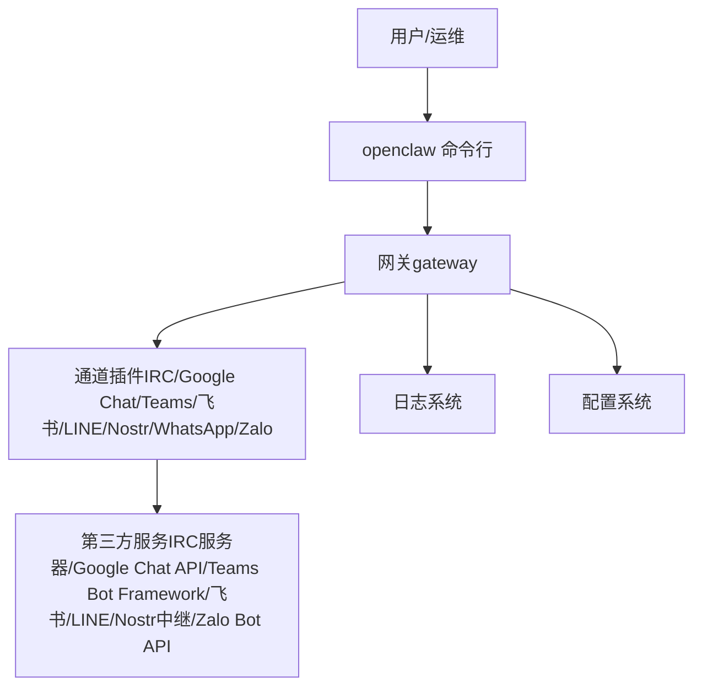
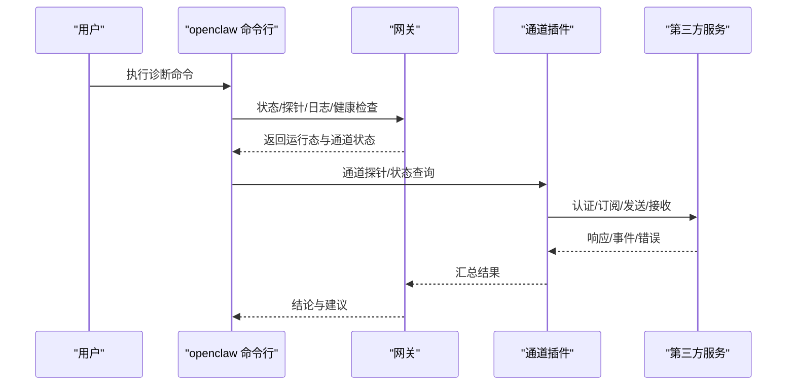
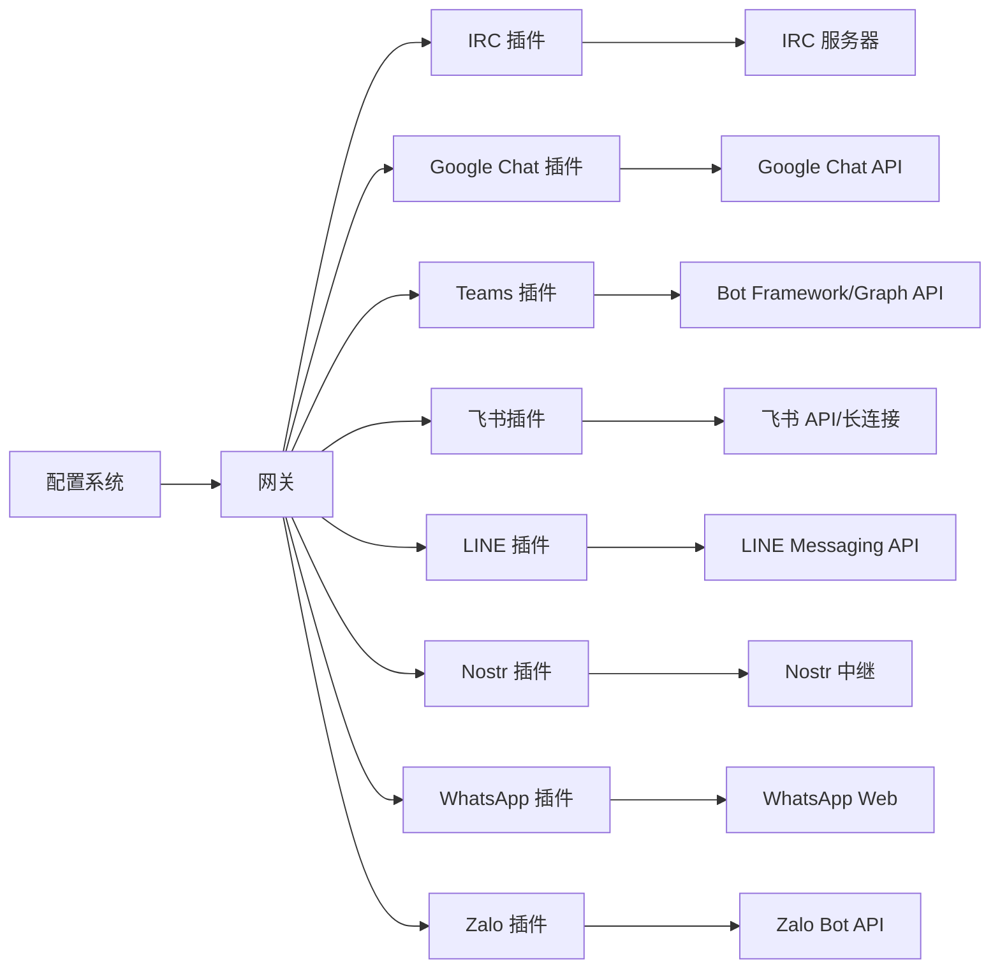

# 其他渠道故障排除

<cite>
**本文引用的文件**
- [docs/help/troubleshooting.md](file://docs/help/troubleshooting.md)
- [docs/gateway/troubleshooting.md](file://docs/gateway/troubleshooting.md)
- [docs/channels/troubleshooting.md](file://docs/channels/troubleshooting.md)
- [docs/channels/irc.md](file://docs/channels/irc.md)
- [docs/channels/googlechat.md](file://docs/channels/googlechat.md)
- [docs/channels/msteams.md](file://docs/channels/msteams.md)
- [docs/channels/feishu.md](file://docs/channels/feishu.md)
- [docs/channels/line.md](file://docs/channels/line.md)
- [docs/channels/nostr.md](file://docs/channels/nostr.md)
- [docs/channels/whatsapp.md](file://docs/channels/whatsapp.md)
- [docs/channels/zalo.md](file://docs/channels/zalo.md)
</cite>

## 目录
1. [简介](#简介)
2. [项目结构](#项目结构)
3. [核心组件](#核心组件)
4. [架构总览](#架构总览)
5. [详细组件分析](#详细组件分析)
6. [依赖关系分析](#依赖关系分析)
7. [性能考虑](#性能考虑)
8. [故障排除指南](#故障排除指南)
9. [结论](#结论)
10. [附录](#附录)

## 简介
本指南面向在 OpenClaw 中集成多种即时通讯渠道（IRC、Google Chat、Microsoft Teams、飞书、LINE、Nostr、WhatsApp Business、Zalo）时遇到连接或消息流问题的用户。内容覆盖通用诊断流程、日志分析技巧、网络与第三方服务限制处理策略，并提供各渠道的配置验证与重连机制调试方法，帮助快速定位并修复问题。

## 项目结构
OpenClaw 将“网关（gateway）”作为统一入口，各渠道以插件形式接入，通过统一的命令行工具进行状态检查、日志追踪与配置管理。通用故障排除流程优先于具体渠道细节，确保在多渠道环境下保持一致的诊断思路。

图示来源
- [docs/help/troubleshooting.md:13-25](file://docs/help/troubleshooting.md#L13-L25)
- [docs/gateway/troubleshooting.md:14-24](file://docs/gateway/troubleshooting.md#L14-L24)

章节来源
- [docs/help/troubleshooting.md:13-25](file://docs/help/troubleshooting.md#L13-L25)
- [docs/gateway/troubleshooting.md:14-24](file://docs/gateway/troubleshooting.md#L14-L24)

## 核心组件
- 诊断命令阶梯：建议按顺序执行状态检查、网关探测、日志跟踪、健康检查与通道探针，以快速定位问题范围。
- 通道探针：用于确认通道是否“已连接/就绪”，避免仅凭表面现象误判。
- 日志系统：持续关注错误信号（如鉴权失败、权限缺失、提及规则阻断、配对请求等），并结合“升级后异常”场景进行回溯。
- 配置系统：通道级与全局配置的联动（如默认策略、提及要求、允许名单、媒体限额等）直接影响消息流。

章节来源
- [docs/help/troubleshooting.md:13-25](file://docs/help/troubleshooting.md#L13-L25)
- [docs/gateway/troubleshooting.md:14-24](file://docs/gateway/troubleshooting.md#L14-L24)
- [docs/channels/troubleshooting.md:13-23](file://docs/channels/troubleshooting.md#L13-L23)

## 架构总览
下图展示从命令到通道插件与第三方服务的整体交互路径，以及常见阻断点（鉴权、权限、提及、配对、网络可达性）：

图示来源
- [docs/help/troubleshooting.md:13-25](file://docs/help/troubleshooting.md#L13-L25)
- [docs/gateway/troubleshooting.md:186-192](file://docs/gateway/troubleshooting.md#L186-L192)

章节来源
- [docs/help/troubleshooting.md:13-25](file://docs/help/troubleshooting.md#L13-L25)
- [docs/gateway/troubleshooting.md:186-192](file://docs/gateway/troubleshooting.md#L186-L192)

## 详细组件分析

### 通用诊断流程与日志分析
- 快速三分钟诊断：先用“状态—网关探测—日志—健康检查—通道探针”的阶梯，确认运行态与通道连通性。
- 日志信号识别：关注“提及必需”“待批准配对”“被过滤/白名单拒绝”“鉴权失败/权限缺失”等关键词，结合上下文定位根因。
- 升级后异常：若升级后出现异常，重点检查网关模式、URL 覆盖行为变化、绑定与鉴权严格化、设备/配对状态变更等。

章节来源
- [docs/help/troubleshooting.md:13-25](file://docs/help/troubleshooting.md#L13-L25)
- [docs/help/troubleshooting.md:307-374](file://docs/help/troubleshooting.md#L307-L374)
- [docs/gateway/troubleshooting.md:14-24](file://docs/gateway/troubleshooting.md#L14-L24)
- [docs/gateway/troubleshooting.md:307-374](file://docs/gateway/troubleshooting.md#L307-L374)

### IRC 故障排除
- 连接与认证：确认主机、端口、TLS、昵称、密码/服务器密码；若自定义网络 TLS 失败，需校验证书链与主机/端口。
- 组消息不回复：检查组策略与允许名单，以及“提及必应”规则；如需无需提及，可在通道配置中关闭 requireMention。
- 发送者允许：区分 DM 允许（allowFrom）与组消息允许（groupAllowFrom 或 per-channel groups["#channel"].allowFrom）。
- 安全建议：在公共频道允许 * 时，建议收紧工具集，降低风险。

章节来源
- [docs/channels/irc.md:39-44](file://docs/channels/irc.md#L39-L44)
- [docs/channels/irc.md:63-73](file://docs/channels/irc.md#L63-L73)
- [docs/channels/irc.md:89-111](file://docs/channels/irc.md#L89-L111)
- [docs/channels/irc.md:128-131](file://docs/channels/irc.md#L128-L131)
- [docs/channels/irc.md:237-242](file://docs/channels/irc.md#L237-L242)

### Google Chat 故障排除
- 公网 URL 与路径暴露：仅暴露 /googlechat 路径，私有仪表盘保留在内网；推荐使用 Tailscale Serve/Funnel 或反向代理。
- 服务账号与受众：正确配置 serviceAccountFile 与 audienceType/audience；验证 Google Chat 应用的 Webhook URL 与事件订阅。
- 渠道未启用/未重启：确认已添加配置并重启网关；使用通道探针检查状态。
- 提及与配对：DM 默认配对；群组默认需要 @提及；可通过 botUser 与 requireMention 调整。

章节来源
- [docs/channels/googlechat.md:64-118](file://docs/channels/googlechat.md#L64-L118)
- [docs/channels/googlechat.md:139-153](file://docs/channels/googlechat.md#L139-L153)
- [docs/channels/googlechat.md:209-256](file://docs/channels/googlechat.md#L209-L256)

### Microsoft Teams 故障排除
- 插件安装：Teams 为独立插件，需单独安装；最小配置包括 appId、appPassword、tenantId 与 webhook 端口/路径。
- 长连接与隧道：本地开发可使用 ngrok/Tailscale Funnel；生产环境需公网可达且 HTTPS。
- 权限与清单：RSC 权限用于实时监听；若需下载附件/历史，需 Graph API 权限并完成管理员同意。
- Webhook 超时与重复：处理慢响应可能导致超时与重试；注意去重与重复消息影响。
- 提及与线程样式：replyStyle（threads/posts）需与团队/频道实际 UI 风格匹配，否则回复位置异常。

章节来源
- [docs/channels/msteams.md:16-38](file://docs/channels/msteams.md#L16-L38)
- [docs/channels/msteams.md:41-66](file://docs/channels/msteams.md#L41-L66)
- [docs/channels/msteams.md:194-212](file://docs/channels/msteams.md#L194-L212)
- [docs/channels/msteams.md:287-291](file://docs/channels/msteams.md#L287-L291)
- [docs/channels/msteams.md:430-441](file://docs/channels/msteams.md#L430-L441)
- [docs/channels/msteams.md:487-518](file://docs/channels/msteams.md#L487-L518)
- [docs/channels/msteams.md:745-760](file://docs/channels/msteams.md#L745-L760)

### 飞书（Lark）故障排除
- 应用创建与权限：在开放平台创建企业应用，配置权限与机器人能力，设置事件订阅为长连接（im.message.receive_v1）。
- 配置方式：支持向导、配置文件与环境变量；可选 webhook 模式（需 verificationToken 与 encryptKey）。
- 消息与媒体：默认配对 DM；群组默认需要 @提及；媒体大小受 mediaMaxMb 限制；可调整 typingIndicator 与解析用户名以优化配额。
- 常见问题：未发布/未批准导致无消息；事件订阅未包含 im.message.receive_v1；长连接未启用；权限不足；网关未运行。

章节来源
- [docs/channels/feishu.md:70-162](file://docs/channels/feishu.md#L70-L162)
- [docs/channels/feishu.md:164-290](file://docs/channels/feishu.md#L164-L290)
- [docs/channels/feishu.md:452-482](file://docs/channels/feishu.md#L452-L482)

### LINE 故障排除
- 插件安装：需单独安装 LINE 插件；最小配置包括 channelAccessToken、channelSecret 与 dmPolicy。
- Webhook 与签名：Webhook URL 必须 HTTPS；签名验证基于原始请求体（HMAC），需严格预检与超时控制。
- 消息与媒体：文本分片上限 5000 字符；Markdown 去除，复杂格式转为 Flex 卡；媒体下载上限受 mediaMaxMb 控制。
- 常见问题：Webhook 验证失败（URL/密钥不匹配）；无入站事件（路径不一致/网关不可达）；媒体下载错误（超出限额）。

章节来源
- [docs/channels/line.md:20-33](file://docs/channels/line.md#L20-L33)
- [docs/channels/line.md:55-70](file://docs/channels/line.md#L55-L70)
- [docs/channels/line.md:186-194](file://docs/channels/line.md#L186-L194)

### Nostr 故障排除
- 插件安装：按需安装 Nostr 插件；最小配置包括 privateKey 与可选 relay 列表。
- 密钥与中继：支持 nsec/hex 私钥格式；默认 relay 列表可扩展；建议使用 2–3 个中继提高冗余。
- 访问控制：默认 DM 策略为配对；可切换为 allowlist/open；生产环境建议 allowlist。
- 常见问题：未收到消息（私钥无效/中继不可达/未启用）；无法发送回复（写入受限/出站连通性/速率限制）；重复回复（多中继导致，系统会按事件 ID 去重）。

章节来源
- [docs/channels/nostr.md:15-51](file://docs/channels/nostr.md#L15-L51)
- [docs/channels/nostr.md:81-91](file://docs/channels/nostr.md#L81-L91)
- [docs/channels/nostr.md:212-231](file://docs/channels/nostr.md#L212-L231)

### WhatsApp 故障排除
- 登录与重连：若显示“未登录”，需重新扫码登录；若反复断开/重连，检查网络与第三方服务稳定性。
- 发送失败：当目标账户无活跃监听器时会快速失败；需确保网关运行且账户已登录。
- 群组忽略：检查 groupPolicy、sender allowlist、群组允许列表、提及规则；注意 JSON5 后项覆盖前项的问题。
- 运行时兼容：建议使用 Node 运行时，避免 Bun 的兼容性问题。

章节来源
- [docs/channels/whatsapp.md:374-424](file://docs/channels/whatsapp.md#L374-L424)

### Zalo 故障排除
- 令牌与配对：令牌需有效；首次联系会触发配对码，需批准；支持长轮询与 webhook（互斥）。
- Webhook：需 HTTPS、正确密钥长度与 Content-Type；注意与长轮询互斥与速率限制。
- 媒体与流控：文本分片上限 2000 字符；媒体下载/上传受 mediaMaxMb 限制；流控可能返回 429。

章节来源
- [docs/channels/zalo.md:194-208](file://docs/channels/zalo.md#L194-L208)
- [docs/channels/zalo.md:142-154](file://docs/channels/zalo.md#L142-L154)

## 依赖关系分析
- 通道与网关：通道插件依赖网关提供的统一运行时、日志与配置接口；通道状态由通道探针反馈。
- 第三方服务：各通道依赖对应平台的 API/SDK/Webhook/长连接；网络可达性与鉴权是关键。
- 配置耦合：通道策略（提及、允许名单、工具集）、媒体限额、会话边界等配置相互影响，需整体审视。

图示来源
- [docs/channels/irc.md:10-11](file://docs/channels/irc.md#L10-L11)
- [docs/channels/googlechat.md:8-10](file://docs/channels/googlechat.md#L8-L10)
- [docs/channels/msteams.md:8-14](file://docs/channels/msteams.md#L8-L14)
- [docs/channels/feishu.md:9-11](file://docs/channels/feishu.md#L9-L11)
- [docs/channels/line.md:10-18](file://docs/channels/line.md#L10-L18)
- [docs/channels/nostr.md:9-13](file://docs/channels/nostr.md#L9-L13)
- [docs/channels/whatsapp.md:8-10](file://docs/channels/whatsapp.md#L8-L10)
- [docs/channels/zalo.md:8-10](file://docs/channels/zalo.md#L8-L10)

章节来源
- [docs/channels/irc.md:10-11](file://docs/channels/irc.md#L10-L11)
- [docs/channels/googlechat.md:8-10](file://docs/channels/googlechat.md#L8-L10)
- [docs/channels/msteams.md:8-14](file://docs/channels/msteams.md#L8-L14)
- [docs/channels/feishu.md:9-11](file://docs/channels/feishu.md#L9-L11)
- [docs/channels/line.md:10-18](file://docs/channels/line.md#L10-L18)
- [docs/channels/nostr.md:9-13](file://docs/channels/nostr.md#L9-L13)
- [docs/channels/whatsapp.md:8-10](file://docs/channels/whatsapp.md#L8-L10)
- [docs/channels/zalo.md:8-10](file://docs/channels/zalo.md#L8-L10)

## 性能考虑
- 日志与探针：高频日志会带来 IO 压力，建议在定位阶段开启“跟随日志”，定位后恢复常规级别。
- 媒体与分片：合理设置媒体上限与文本分片策略，避免大媒体传输阻塞与超时。
- 通道特性：部分通道（如 Zalo）存在字符/流控限制，需在设计上规避长时间流式输出。
- 网络与中继：多中继（Nostr）可提升可用性但可能引入重复与延迟，需在协议层做去重与限速。

## 故障排除指南
- 通用步骤
  - 执行状态—网关探测—日志—健康检查—通道探针的阶梯，确认运行态与通道连通性。
  - 关注日志中的“提及必需”“待批准配对”“被过滤/白名单拒绝”“鉴权失败/权限缺失”等信号。
  - 若升级后异常，检查网关模式、URL 覆盖行为、绑定与鉴权严格化、设备/配对状态变更。
- 网络与第三方限制
  - 公网暴露仅限必要路径（如 Google Chat 的 /googlechat），其余保持内网。
  - 使用隧道（ngrok/Tailscale）进行本地开发；生产环境确保 HTTPS 与域名解析稳定。
  - 对速率限制敏感的通道（如 Zalo Webhook）做好退避与幂等处理。
- 渠道特定验证
  - IRC：核对 TLS、昵称、服务器密码、提及规则与允许名单。
  - Google Chat：核对服务账号、受众、Webhook URL 与事件订阅。
  - Teams：核对插件安装、RSC/Graph 权限、清单与 replyStyle。
  - 飞书：核对应用权限、事件订阅、长连接与配对/允许名单。
  - LINE：核对 webhook URL、签名验证、媒体限额。
  - Nostr：核对私钥、中继列表、访问策略。
  - WhatsApp：核对登录状态、重连循环、群组策略与提及规则。
  - Zalo：核对令牌、长轮询/ webhook 互斥、速率限制。

章节来源
- [docs/help/troubleshooting.md:13-25](file://docs/help/troubleshooting.md#L13-L25)
- [docs/gateway/troubleshooting.md:14-24](file://docs/gateway/troubleshooting.md#L14-L24)
- [docs/channels/irc.md:237-242](file://docs/channels/irc.md#L237-L242)
- [docs/channels/googlechat.md:209-256](file://docs/channels/googlechat.md#L209-L256)
- [docs/channels/msteams.md:487-518](file://docs/channels/msteams.md#L487-L518)
- [docs/channels/feishu.md:452-482](file://docs/channels/feishu.md#L452-L482)
- [docs/channels/line.md:186-194](file://docs/channels/line.md#L186-L194)
- [docs/channels/nostr.md:212-231](file://docs/channels/nostr.md#L212-L231)
- [docs/channels/whatsapp.md:374-424](file://docs/channels/whatsapp.md#L374-L424)
- [docs/channels/zalo.md:194-208](file://docs/channels/zalo.md#L194-L208)

## 结论
通过统一的诊断流程与日志信号识别，配合各渠道的配置要点与网络限制处理策略，大多数连接与消息流问题可以在较短时间内定位并修复。建议在生产环境中固化最小权限、严格的鉴权与访问控制，并针对速率限制与网络波动制定稳健的重试与去重机制。

## 附录
- 快速命令参考（来自通用文档）
  - openclaw status
  - openclaw gateway status
  - openclaw logs --follow
  - openclaw doctor
  - openclaw channels status --probe

章节来源
- [docs/help/troubleshooting.md:13-25](file://docs/help/troubleshooting.md#L13-L25)
- [docs/gateway/troubleshooting.md:14-24](file://docs/gateway/troubleshooting.md#L14-L24)
- [docs/channels/troubleshooting.md:13-23](file://docs/channels/troubleshooting.md#L13-L23)