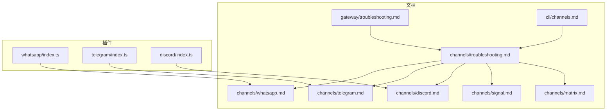
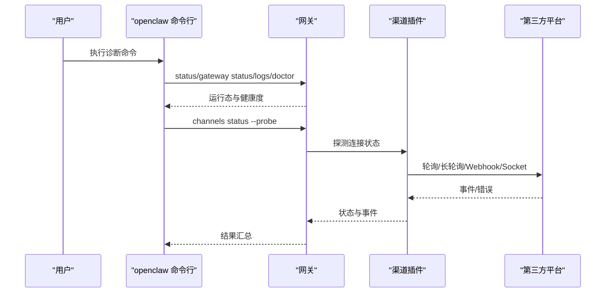
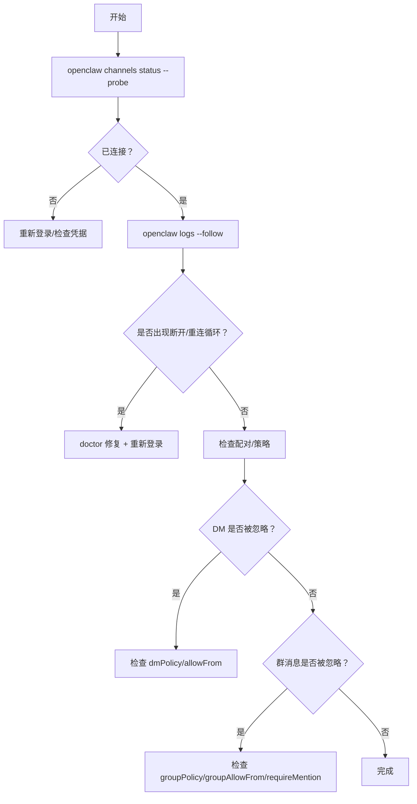
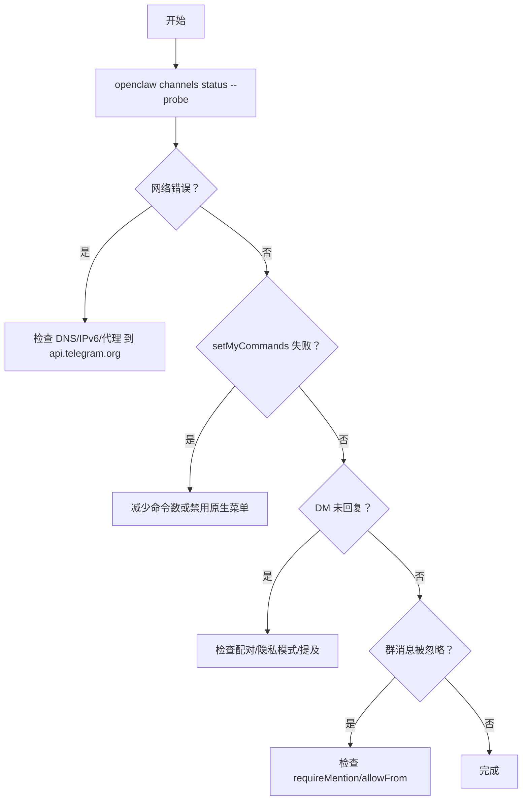
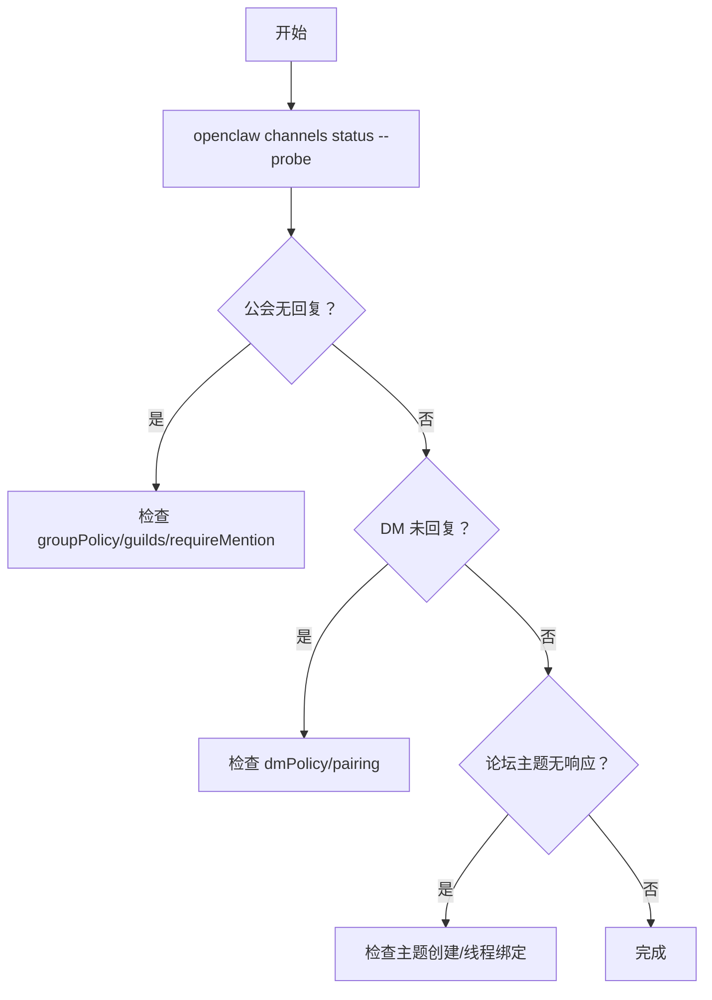
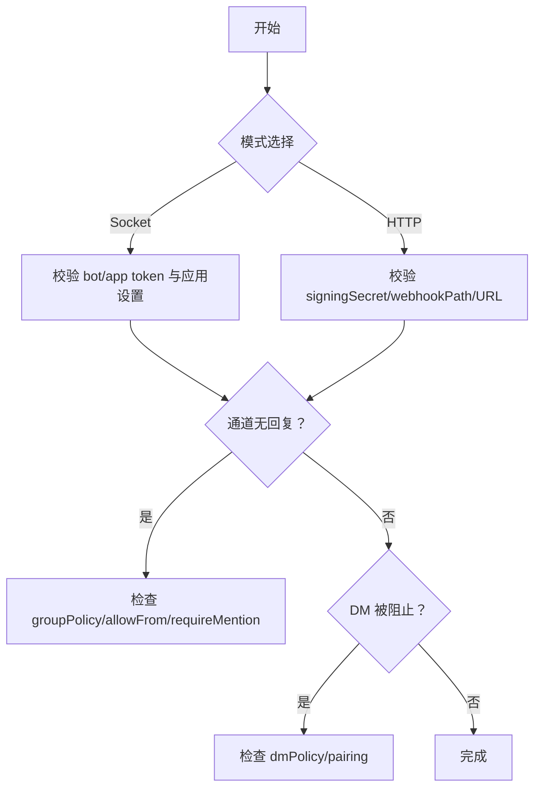
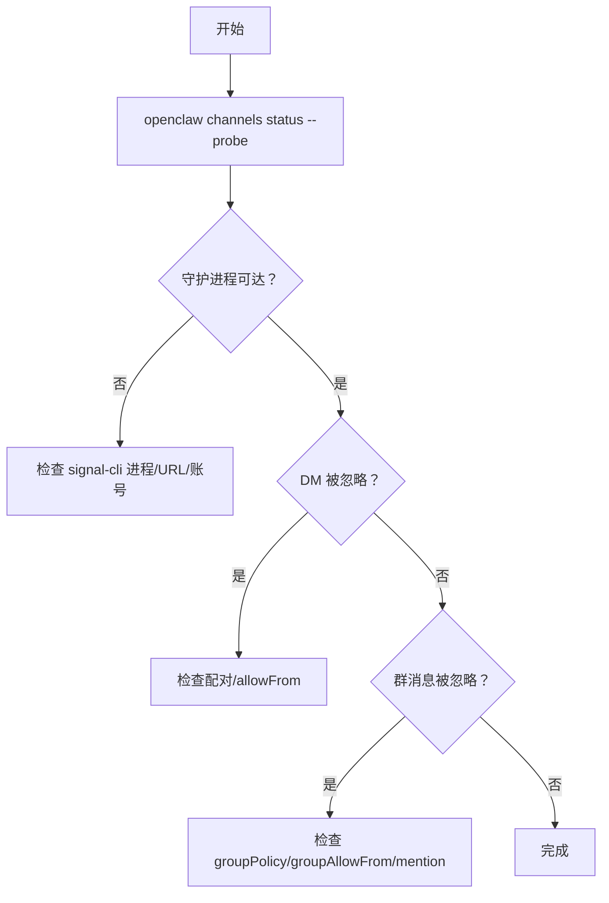
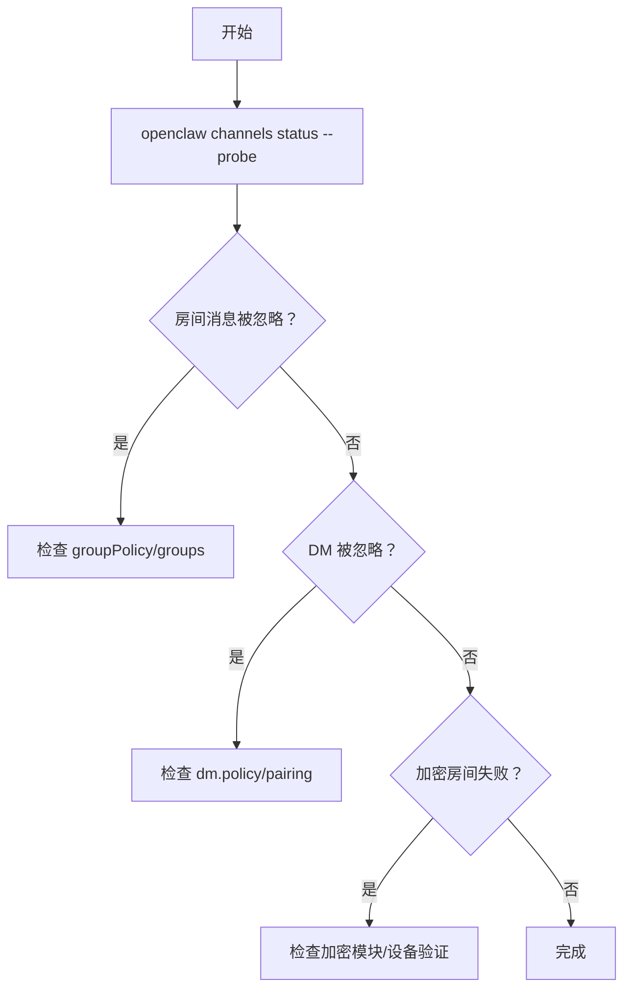
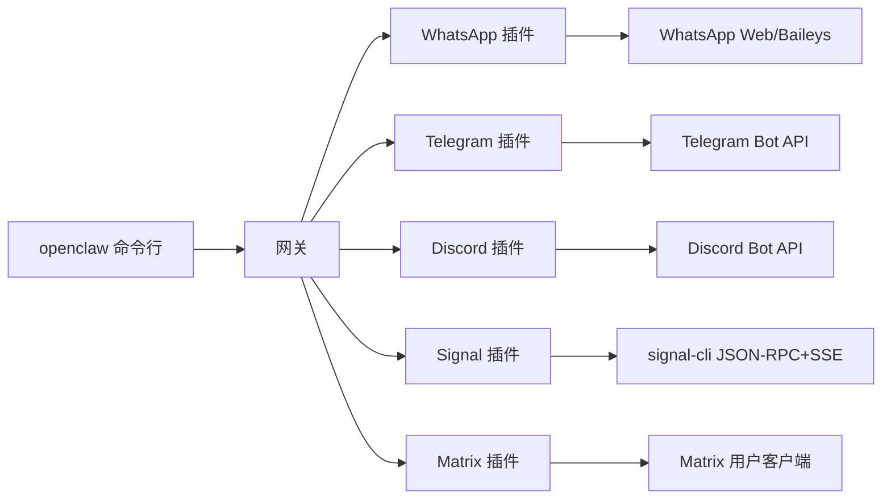

# 渠道连接问题

<cite>
**本文引用的文件**
- [docs/channels/troubleshooting.md](file://docs/channels/troubleshooting.md)
- [docs/channels/whatsapp.md](file://docs/channels/whatsapp.md)
- [docs/channels/telegram.md](file://docs/channels/telegram.md)
- [docs/channels/discord.md](file://docs/channels/discord.md)
- [docs/channels/signal.md](file://docs/channels/signal.md)
- [docs/channels/matrix.md](file://docs/channels/matrix.md)
- [docs/gateway/troubleshooting.md](file://docs/gateway/troubleshooting.md)
- [docs/cli/channels.md](file://docs/cli/channels.md)
</cite>

## 目录
1. [简介](#简介)
2. [项目结构](#项目结构)
3. [核心组件](#核心组件)
4. [架构总览](#架构总览)
5. [详细组件分析](#详细组件分析)
6. [依赖关系分析](#依赖关系分析)
7. [性能考量](#性能考量)
8. [故障排除指南](#故障排除指南)
9. [结论](#结论)
10. [附录](#附录)

## 简介
本指南聚焦于即时通讯渠道（WhatsApp、Telegram、Discord、Signal、Slack、Matrix）在连接与消息流转中的常见问题，提供系统化的诊断步骤、配置校验清单、重连与限流处理策略。内容基于官方文档与插件实现，覆盖认证失败、网络中断、API 限制、权限不足等典型症状，并给出可操作的命令与检查点。

## 项目结构
- 文档层：各渠道独立文档（WhatsApp、Telegram、Discord、Signal、Slack、Matrix）与通用故障排除页（channels/troubleshooting、gateway/troubleshooting）。
- CLI 层：channels 子命令用于账户管理、能力探测、日志查看与 ID 解析。
- 插件层：各渠道以插件形式注册到网关运行时，负责具体协议对接与事件处理。

**图表来源**
- [docs/channels/troubleshooting.md:1-119](file://docs/channels/troubleshooting.md#L1-L119)
- [docs/channels/whatsapp.md:1-446](file://docs/channels/whatsapp.md#L1-L446)
- [docs/channels/telegram.md:1-982](file://docs/channels/telegram.md#L1-L982)
- [docs/channels/discord.md:1-1224](file://docs/channels/discord.md#L1-L1224)
- [docs/channels/signal.md:1-330](file://docs/channels/signal.md#L1-L330)
- [docs/channels/matrix.md:1-304](file://docs/channels/matrix.md#L1-L304)
- [docs/gateway/troubleshooting.md:1-380](file://docs/gateway/troubleshooting.md#L1-L380)
- [docs/cli/channels.md:1-103](file://docs/cli/channels.md#L1-L103)
- [extensions/whatsapp/index.ts:1-18](file://extensions/whatsapp/index.ts#L1-L18)
- [extensions/telegram/index.ts:1-18](file://extensions/telegram/index.ts#L1-L18)
- [extensions/discord/index.ts:1-23](file://extensions/discord/index.ts#L1-L23)

**章节来源**
- [docs/channels/troubleshooting.md:1-119](file://docs/channels/troubleshooting.md#L1-L119)
- [docs/gateway/troubleshooting.md:1-380](file://docs/gateway/troubleshooting.md#L1-L380)
- [docs/cli/channels.md:1-103](file://docs/cli/channels.md#L1-L103)

## 核心组件
- 通用诊断命令序列：status、gateway status、logs --follow、doctor、channels status --probe。
- 各渠道关键配置项：令牌/凭据、访问策略（dmPolicy/groupPolicy）、允许列表、提及规则、历史上下文、媒体大小限制、分块模式、回执与反应、线程绑定与会话隔离。
- 连接状态与重连：通道探针（--probe）、轮询/长轮询/Webhook 模式、Socket Mode、外部守护进程（signal-cli）。
- 权限与作用域：各平台的 bot/app token、用户 token、事件订阅、交互权限、隐私模式与可见性设置。

**章节来源**
- [docs/channels/troubleshooting.md:13-31](file://docs/channels/troubleshooting.md#L13-L31)
- [docs/channels/whatsapp.md:126-133](file://docs/channels/whatsapp.md#L126-L133)
- [docs/channels/telegram.md:105-118](file://docs/channels/telegram.md#L105-L118)
- [docs/channels/discord.md:369-461](file://docs/channels/discord.md#L369-L461)
- [docs/channels/signal.md:165-181](file://docs/channels/signal.md#L165-L181)
- [docs/channels/matrix.md:180-224](file://docs/channels/matrix.md#L180-L224)

## 架构总览
下图展示从 CLI 到网关再到各渠道插件的调用链路与诊断路径：

**图表来源**
- [docs/gateway/troubleshooting.md:14-31](file://docs/gateway/troubleshooting.md#L14-L31)
- [docs/cli/channels.md:18-27](file://docs/cli/channels.md#L18-L27)

## 详细组件分析

### WhatsApp（Web）
- 运行模型：网关持有会话与重连循环；发送需目标账号存在活跃监听器。
- 访问控制：dmPolicy（pairing/allowlist/open/disabled）、groupPolicy（open/allowlist/disabled）、群组允许列表与发送者允许列表、提及规则。
- 常见症状与修复：
  - 已连接但无回复：检查配对列表与 DM 策略。
  - 群消息被忽略：检查 requireMention 与提及模式。
  - 随机断开重登：doctor + 日志 + 重新登录。
- 配置要点：textChunkLimit、chunkMode、mediaMaxMb、sendReadReceipts、ackReaction、multi-account 凭据目录、web/heartbeat/reconnect 参数。

**图表来源**
- [docs/channels/troubleshooting.md:31-41](file://docs/channels/troubleshooting.md#L31-L41)
- [docs/channels/whatsapp.md:374-424](file://docs/channels/whatsapp.md#L374-L424)

**章节来源**
- [docs/channels/troubleshooting.md:31-41](file://docs/channels/troubleshooting.md#L31-L41)
- [docs/channels/whatsapp.md:126-133](file://docs/channels/whatsapp.md#L126-L133)
- [docs/channels/whatsapp.md:134-200](file://docs/channels/whatsapp.md#L134-L200)
- [docs/channels/whatsapp.md:374-424](file://docs/channels/whatsapp.md#L374-L424)

### Telegram（Bot API）
- 运行模型：网关拥有连接；长轮询默认；Webhook 可选；支持论坛主题与线程。
- 访问控制：dmPolicy、allowFrom（支持 tg:/telegram: 前缀）、群组策略与发送者允许列表、提及规则。
- 常见症状与修复：
  - /start 无可用回复流：检查配对列表与 DM 策略。
  - 群组保持静默：检查隐私模式与提及要求。
  - 发送失败且显示网络错误：检查到 api.telegram.org 的 DNS/IPv6/代理。
  - setMyCommands 被拒：减少命令数量或禁用原生菜单。
  - 升级后允许列表阻断：执行安全审计与 doctor --fix。
- 配置要点：streaming（部分/阻塞/进度）、HTML 回退、内联按钮、命令菜单、链接预览、消息动作（react/send/delete/edit/sticker）。

**图表来源**
- [docs/channels/troubleshooting.md:43-55](file://docs/channels/troubleshooting.md#L43-L55)
- [docs/channels/telegram.md:75-103](file://docs/channels/telegram.md#L75-L103)
- [docs/channels/telegram.md:302-353](file://docs/channels/telegram.md#L302-L353)

**章节来源**
- [docs/channels/troubleshooting.md:43-55](file://docs/channels/troubleshooting.md#L43-L55)
- [docs/channels/telegram.md:75-103](file://docs/channels/telegram.md#L75-L103)
- [docs/channels/telegram.md:105-162](file://docs/channels/telegram.md#L105-L162)
- [docs/channels/telegram.md:302-353](file://docs/channels/telegram.md#L302-L353)

### Discord（Bot API）
- 运行模型：网关拥有连接；支持 Socket Mode 与 HTTP 事件 API；论坛频道仅接受主题发帖。
- 访问控制：dmPolicy、groupPolicy、服务器/频道允许列表、提及规则、角色路由绑定。
- 常见症状与修复：
  - 机器人在线但公会不回复：检查公会/频道允许列表与消息意图。
  - 群消息被忽略：检查提及门控与 requireMention。
  - DM 回复缺失：检查配对列表与 DM 策略。
- 配置要点：线程绑定、反应通知、ACK 反应、配置写入、Slash 命令、组件与模态表单。

**图表来源**
- [docs/channels/troubleshooting.md:57-67](file://docs/channels/troubleshooting.md#L57-L67)
- [docs/channels/discord.md:264-286](file://docs/channels/discord.md#L264-L286)
- [docs/channels/discord.md:463-487](file://docs/channels/discord.md#L463-L487)

**章节来源**
- [docs/channels/troubleshooting.md:57-67](file://docs/channels/troubleshooting.md#L57-L67)
- [docs/channels/discord.md:369-461](file://docs/channels/discord.md#L369-L461)
- [docs/channels/discord.md:642-686](file://docs/channels/discord.md#L642-L686)

### Slack（Socket Mode + HTTP）
- 运行模型：默认 Socket Mode；HTTP 事件 API 可选；支持文本流与交互回复。
- 访问控制：dmPolicy、groupPolicy、通道允许列表、提及规则、线程与回复标签。
- 常见症状与修复：
  - 通道无回复：检查 groupPolicy、通道允许列表、requireMention、用户允许列表。
  - DM 被阻止：检查 dm.enabled、dmPolicy、配对/允许列表。
  - Socket 模式未连接：校验 bot/app token 与 Slack 应用设置。
  - HTTP 模式未接收事件：校验签名密钥、Webhook 路径与请求 URL。
- 配置要点：streaming/nativeStreaming、actions.*、userToken、线程历史与回复模式。

**图表来源**
- [docs/channels/troubleshooting.md:69-79](file://docs/channels/troubleshooting.md#L69-L79)
- [docs/channels/signal.md:253-287](file://docs/channels/signal.md#L253-L287)

**章节来源**
- [docs/channels/troubleshooting.md:69-79](file://docs/channels/troubleshooting.md#L69-L79)
- [docs/channels/signal.md:253-287](file://docs/channels/signal.md#L253-L287)

### Signal（signal-cli JSON-RPC + SSE）
- 运行模型：通过 signal-cli 守护进程通信；DM 共享主会话；群组隔离。
- 访问控制：dmPolicy（默认 pairing）、groupPolicy、群组允许列表与发送者允许列表。
- 常见症状与修复：
  - 守护进程可达但无回复：检查 httpUrl/account 与 receiveMode。
  - DM 被阻止：检查配对状态。
  - 群消息未触发：检查群允许列表与提及模式。
- 配置要点：httpUrl/autoStart/startupTimeoutMs、receiveMode、ignoreAttachments、历史上下文、媒体上限、反应级别。

**图表来源**
- [docs/channels/troubleshooting.md:96-106](file://docs/channels/troubleshooting.md#L96-L106)
- [docs/channels/signal.md:253-287](file://docs/channels/signal.md#L253-L287)

**章节来源**
- [docs/channels/troubleshooting.md:96-106](file://docs/channels/troubleshooting.md#L96-L106)
- [docs/channels/signal.md:165-181](file://docs/channels/signal.md#L165-L181)
- [docs/channels/signal.md:182-201](file://docs/channels/signal.md#L182-L201)

### Matrix（插件）
- 运行模型：作为用户连接任意 homeserver；支持 DM、房间、线程、媒体、反应、轮询、位置与 E2EE。
- 访问控制：dm.policy（默认 pairing）、groupPolicy（默认 allowlist）、房间允许列表与发送者允许列表。
- 常见症状与修复：
  - 登录但房间消息被忽略：检查 groupPolicy 与房间允许列表。
  - DM 被忽略：检查 pairing 与 allowFrom。
  - 加密房间失败：检查加密模块与设备验证。
- 配置要点：homeserver/access token、encryption、threadReplies、replyToMode、autoJoin、多账户配置。

**图表来源**
- [docs/channels/troubleshooting.md:108-118](file://docs/channels/troubleshooting.md#L108-L118)
- [docs/channels/matrix.md:248-272](file://docs/channels/matrix.md#L248-L272)

**章节来源**
- [docs/channels/troubleshooting.md:108-118](file://docs/channels/troubleshooting.md#L108-L118)
- [docs/channels/matrix.md:111-137](file://docs/channels/matrix.md#L111-L137)
- [docs/channels/matrix.md:185-224](file://docs/channels/matrix.md#L185-L224)

## 依赖关系分析
- 诊断命令依赖网关运行态与通道插件状态；通道插件依赖平台 API（Telegram/Discord/Slack/Signal/Matrix）与各自认证与权限。
- 配置写入与通道能力探测受 SecretRef 与环境变量影响；升级后可能因严格默认与 URL/认证行为变化导致“看似连接但不可达”。

**图表来源**
- [docs/cli/channels.md:18-27](file://docs/cli/channels.md#L18-L27)
- [docs/gateway/troubleshooting.md:18-31](file://docs/gateway/troubleshooting.md#L18-L31)
- [extensions/whatsapp/index.ts:1-18](file://extensions/whatsapp/index.ts#L1-L18)
- [extensions/telegram/index.ts:1-18](file://extensions/telegram/index.ts#L1-L18)
- [extensions/discord/index.ts:1-23](file://extensions/discord/index.ts#L1-L23)

**章节来源**
- [docs/cli/channels.md:66-71](file://docs/cli/channels.md#L66-L71)
- [docs/gateway/troubleshooting.md:307-374](file://docs/gateway/troubleshooting.md#L307-L374)

## 性能考量
- 分块与限速：合理设置 textChunkLimit 与 chunkMode，避免超长消息导致失败或延迟。
- 历史上下文：根据群组规模与消息密度调整 historyLimit，避免过长上下文影响响应时间。
- 并发与重试：通道工具与 CLI 发送支持重试与并发控制，结合平台速率限制进行退避。
- 媒体处理：媒体上限与自动优化降低传输失败率；必要时启用附件忽略以提升稳定性。

## 故障排除指南

### 通用诊断流程
- 快速命令序列：openclaw status → openclaw gateway status → openclaw logs --follow → openclaw doctor → openclaw channels status --probe。
- 健康基线：Runtime: running、RPC probe: ok、通道探针显示 connected/ready。
- 升级后异常：核对 gateway.mode、gateway.remote.url、gateway.auth.mode 与 bind 设置，确保 URL/认证一致。

**章节来源**
- [docs/channels/troubleshooting.md:13-31](file://docs/channels/troubleshooting.md#L13-L31)
- [docs/gateway/troubleshooting.md:14-31](file://docs/gateway/troubleshooting.md#L14-L31)
- [docs/gateway/troubleshooting.md:307-347](file://docs/gateway/troubleshooting.md#L307-L347)

### 认证失败
- Telegram：确认 botToken 与隐私模式；若使用环境变量，注意仅默认账户生效。
- Discord：校验 botToken 与应用设置（意图、OAuth scopes），确保事件订阅与交互 URL 正确。
- Slack：Socket Mode 需要 appToken + botToken；HTTP 模式需要 signingSecret 与唯一 webhookPath。
- Signal：校验 httpUrl/account 与 receiveMode；守护进程可达性与启动超时。
- Matrix：确认 homeserver、access token 或 userId/password；E2EE 需要设备验证。

**章节来源**
- [docs/channels/telegram.md:24-73](file://docs/channels/telegram.md#L24-L73)
- [docs/channels/discord.md:24-172](file://docs/channels/discord.md#L24-L172)
- [docs/channels/signal.md:165-181](file://docs/channels/signal.md#L165-L181)
- [docs/channels/matrix.md:40-93](file://docs/channels/matrix.md#L40-L93)

### 网络连接中断
- Telegram：检查到 api.telegram.org 的 DNS/IPv6/代理；setMyCommands 失败常伴随网络错误。
- Signal：守护进程与本地端口可达性；慢启动时可调整 startupTimeoutMs。
- Matrix：Homeserver 可达性与 E2EE 设备验证；加密模块加载失败时按提示重建依赖。

**章节来源**
- [docs/channels/telegram.md:338-341](file://docs/channels/telegram.md#L338-L341)
- [docs/channels/signal.md:180-181](file://docs/channels/signal.md#L180-L181)
- [docs/channels/matrix.md:123-126](file://docs/channels/matrix.md#L123-L126)

### API 限制与权限不足
- Telegram：命令菜单溢出触发 BOT_COMMANDS_TOO_MUCH；减少自定义命令或禁用原生菜单。
- Slack：检查 scopes 与事件订阅；assistant:write 为文本流所需。
- Discord：确保 Message Content Intent、Server Members Intent 等已启用。
- Matrix：加密模块缺失或设备未验证导致解密失败。

**章节来源**
- [docs/channels/telegram.md:338-341](file://docs/channels/telegram.md#L338-L341)
- [docs/channels/signal.md:289-294](file://docs/channels/signal.md#L289-L294)
- [docs/channels/discord.md:500-506](file://docs/channels/discord.md#L500-L506)
- [docs/channels/matrix.md:111-126](file://docs/channels/matrix.md#L111-L126)

### 配置验证与重连调试
- 使用 openclaw channels status --probe 获取通道状态快照。
- 使用 openclaw pairing list 查看待审批配对与允许列表状态。
- 使用 openclaw channels capabilities 获取平台能力提示（如 Discord intents、Slack scopes）。
- 使用 openclaw channels logs --channel all 实时观察事件流。

**章节来源**
- [docs/cli/channels.md:18-27](file://docs/cli/channels.md#L18-L27)
- [docs/cli/channels.md:73-86](file://docs/cli/channels.md#L73-L86)
- [docs/cli/channels.md:88-102](file://docs/cli/channels.md#L88-L102)

## 结论
针对各即时通讯渠道的连接问题，建议遵循“先全局后局部”的诊断顺序：以通用命令快速定位运行态与通道状态，再依据渠道特性检查认证、网络、权限与配置。通过分门别类的策略（提及规则、允许列表、历史上下文、媒体与分块、E2EE 与设备验证）与重连/限流处理，可显著提升稳定性与可维护性。

## 附录
- 常用命令速查
  - openclaw status
  - openclaw gateway status
  - openclaw logs --follow
  - openclaw doctor
  - openclaw channels status --probe
  - openclaw pairing list <channel>
  - openclaw channels capabilities
  - openclaw channels logs --channel all